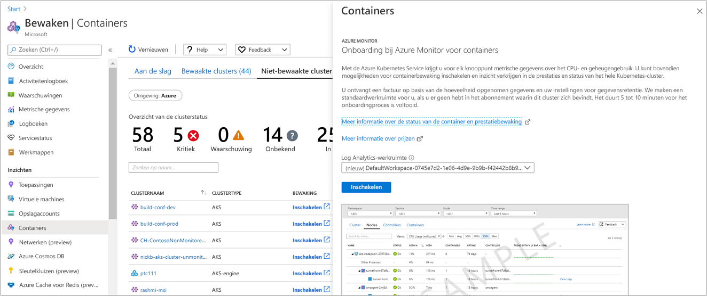

# <a name="configure-azure-red-hat-openshift-v3-with-azure-monitor-for-containers"></a>Azure Red Hat open Shift v3 configureren met Azure Monitor voor containers

Azure Monitor voor containers biedt uitgebreide bewakings ervaring voor de Azure Kubernetes-service (AKS) en AKS-engine clusters. In dit artikel wordt beschreven hoe u de bewaking kunt inschakelen van Kubernetes-clusters die worden gehost op [Azure Red Hat open Shift](../../openshift/intro-openshift.md) versie 3 en de meest recente ondersteunde versie van versie 3, om een vergelijk bare bewakings ervaring te krijgen.

>[!NOTE]
>De ondersteuning voor Azure Red Hat open Shift is op dit moment een functie in Public Preview.
>

Azure Monitor voor containers kunnen worden ingeschakeld voor nieuwe of een of meer bestaande implementaties van Azure Red Hat open SHIFT met behulp van de volgende ondersteunde methoden:

- Voor een bestaand cluster van de Azure Portal of met Azure Resource Manager sjabloon.
- Voor een nieuw cluster met Azure Resource Manager sjabloon, of tijdens het maken van een nieuw cluster met behulp van de [Azure cli](https://docs.microsoft.com/cli/azure/openshift?view=azure-cli-latest#az-openshift-create).

## <a name="supported-and-unsupported-features"></a>Ondersteunde en niet-ondersteunde functies

Azure Monitor voor containers biedt ondersteuning voor het bewaken van Azure Red Hat open Shift zoals beschreven in het artikel [overzicht](container-insights-overview.md) , met uitzonde ring van de volgende functies:

- Live-gegevens (preview-versie)
- [Metrische gegevens verzamelen](container-insights-update-metrics.md) van cluster knooppunten en peulen en deze opslaan in de data base met Azure monitor gegevens

## <a name="prerequisites"></a>Vereisten

- Een [log Analytics-werk ruimte](../platform/design-logs-deployment.md).

    Azure Monitor voor containers ondersteunt een Log Analytics-werk ruimte in de regio's die worden vermeld in azure- [producten per regio](https://azure.microsoft.com/global-infrastructure/services/?regions=all&products=monitor). Om uw eigen werk ruimte te maken, kan deze worden gemaakt via [Azure Resource Manager](../platform/template-workspace-configuration.md), via [Power shell](../scripts/powershell-sample-create-workspace.md?toc=%2fpowershell%2fmodule%2ftoc.json)of in de [Azure Portal](../learn/quick-create-workspace.md).

- Als u de functies in Azure Monitor voor containers wilt inschakelen en openen, moet u Mini maal lid zijn van de rol Azure *contributor* in het Azure-abonnement en een lid van de rol [*log Analytics Inzender*](../platform/manage-access.md#manage-access-using-azure-permissions) van de werk ruimte log Analytics die is geconfigureerd met Azure monitor voor containers.

- Als u de bewakings gegevens wilt bekijken, bent u lid van de machtiging [*log Analytics lezer*](../platform/manage-access.md#manage-access-using-azure-permissions) -rol met de log Analytics werk ruimte die is geconfigureerd met Azure monitor voor containers.

## <a name="identify-your-log-analytics-workspace-id"></a>Uw Log Analytics werk ruimte-ID identificeren

 Als u wilt integreren met een bestaande Log Analytics-werk ruimte, moet u beginnen met het identificeren van de volledige Resource-ID van uw Log Analytics werk ruimte. De resource-ID van de werk ruimte is vereist voor de para meter `workspaceResourceId` Wanneer u controle inschakelt met behulp van de Azure Resource Manager sjabloon methode.

1. Een lijst met alle abonnementen waartoe u toegang hebt door de volgende opdracht uit te voeren:

    ```azurecli
    az account list --all -o table
    ```

    De uitvoer ziet er als volgt uit:

    ```azurecli
    Name                                  CloudName    SubscriptionId                        State    IsDefault
    ------------------------------------  -----------  ------------------------------------  -------  -----------
    Microsoft Azure                       AzureCloud   0fb60ef2-03cc-4290-b595-e71108e8f4ce  Enabled  True
    ```

1. Kopieer de waarde voor **SubscriptionId**.

1. Ga naar het abonnement dat als host fungeert voor de Log Analytics-werk ruimte door de volgende opdracht uit te voeren:

    ```azurecli
    az account set -s <subscriptionId of the workspace>
    ```

1. De lijst met werk ruimten in uw abonnementen weer geven in de standaard JSON-indeling door de volgende opdracht uit te voeren:

    ```
    az resource list --resource-type Microsoft.OperationalInsights/workspaces -o json
    ```

1. Zoek in de uitvoer de naam van de werk ruimte en kopieer de volledige Resource-ID van die Log Analytics werk ruimte onder de veld **-id**.

## <a name="enable-for-a-new-cluster-using-an-azure-resource-manager-template"></a>Inschakelen voor een nieuw cluster met behulp van een Azure Resource Manager sjabloon

Voer de volgende stappen uit om een Azure Red Hat open Shift-cluster te implementeren waarvoor bewaking is ingeschakeld. Voordat u verdergaat, leest u de zelf studie [een Azure Red Hat open Shift-cluster maken](../../openshift/tutorial-create-cluster.md) om inzicht te krijgen in de afhankelijkheden die u moet configureren zodat uw omgeving correct is ingesteld.

Deze methode bevat twee JSON-sjablonen. Met één sjabloon wordt de configuratie opgegeven voor het implementeren van het cluster waarvoor bewaking is ingeschakeld. de andere bevat parameter waarden die u configureert om het volgende op te geven:

- De resource-ID van de Azure Red Hat open Shift-cluster.

- De resource groep waarin het cluster is geïmplementeerd.

- [Azure Active Directory Tenant-id](../../openshift/howto-create-tenant.md#create-a-new-azure-ad-tenant) die is geconstateerd na het uitvoeren van de stappen voor het maken van een of een al gemaakte.

- [Azure Active Directory client toepassings-id](../../openshift/howto-aad-app-configuration.md#create-an-azure-ad-app-registration) na het uitvoeren van de stappen voor het maken van een of een al gemaakt.

- [Azure Active Directory client geheim](../../openshift/howto-aad-app-configuration.md#create-a-client-secret) dat is vermeld na het uitvoeren van de stappen voor het maken van een of een al gemaakt.

- [Azure AD-beveiligings groep](../../openshift/howto-aad-app-configuration.md#create-an-azure-ad-security-group) genoteerd na het uitvoeren van de stappen voor het maken van een of een al gemaakte.

- Resource-ID van een bestaande Log Analytics-werk ruimte. Zie [uw log Analytics werk ruimte-id identificeren](#identify-your-log-analytics-workspace-id) voor meer informatie over hoe u deze gegevens kunt ophalen.

- Het aantal hoofd knooppunten dat in het cluster moet worden gemaakt.

- Het aantal reken knooppunten in het profiel van de agent groep.

- Het aantal infrastructuur knooppunten in het profiel van de agent groep.

Als u niet bekend bent met het concept van het implementeren van resources met behulp van een sjabloon, raadpleegt u:

- [Resources implementeren met Resource Manager-sjablonen en Azure PowerShell](../../azure-resource-manager/templates/deploy-powershell.md)

- [Resources implementeren met Resource Manager-sjablonen en Azure CLI](../../azure-resource-manager/templates/deploy-cli.md)

Als u ervoor kiest om de Azure CLI te gebruiken, moet u de CLI eerst lokaal installeren en gebruiken. U moet de Azure CLI-versie 2.0.65 of hoger uitvoeren. Voer uit om uw versie te identificeren `az --version` . Als u de Azure CLI wilt installeren of upgraden, raadpleegt u [de Azure cli installeren](https://docs.microsoft.com/cli/azure/install-azure-cli).

1. Down load en sla de bestanden op in een lokale map, het Azure Resource Manager sjabloon en het parameter bestand, om een cluster met de invoeg toepassing voor bewaking te maken met behulp van de volgende opdrachten:

    `curl -LO https://raw.githubusercontent.com/microsoft/Docker-Provider/ci_dev/scripts/onboarding/aro/enable_monitoring_to_new_cluster/newClusterWithMonitoring.json`

    `curl -LO https://raw.githubusercontent.com/microsoft/Docker-Provider/ci_dev/scripts/onboarding/aro/enable_monitoring_to_new_cluster/newClusterWithMonitoringParam.json`

2. Aanmelden bij Azure

    ```azurecli
    az login
    ```

    Als u toegang hebt tot meerdere abonnementen, voert `az account set -s {subscription ID}` `{subscription ID}` u de vervanging uit met het abonnement dat u wilt gebruiken.

3. Maak een resource groep voor het cluster als u er nog geen hebt. Zie [ondersteunde regio's](../../openshift/supported-resources.md#azure-regions)voor een lijst met Azure-regio's die openshift op Azure ondersteunen.

    ```azurecli
    az group create -g <clusterResourceGroup> -l <location>
    ```

4. Bewerk het JSON-parameter bestand **newClusterWithMonitoringParam.jsop** en werk de volgende waarden bij:

    - *locatie*
    - *clusterName*
    - *aadTenantId*
    - *aadClientId*
    - *aadClientSecret*
    - *aadCustomerAdminGroupId*
    - *workspaceResourceId*
    - *masterNodeCount*
    - *computeNodeCount*
    - *infraNodeCount*

5. In de volgende stap wordt het cluster geïmplementeerd met bewaking met behulp van de Azure CLI.

    ```azurecli
    az group deployment create --resource-group <ClusterResourceGroupName> --template-file ./newClusterWithMonitoring.json --parameters @./newClusterWithMonitoringParam.json
    ```

    De uitvoer ziet er ongeveer als volgt uit:

    ```output
    provisioningState       : Succeeded
    ```

## <a name="enable-for-an-existing-cluster"></a>Inschakelen voor een bestaand cluster

Voer de volgende stappen uit om de bewaking in te scha kelen van een Azure Red Hat open Shift-cluster dat is geïmplementeerd in Azure. U kunt dit doen met behulp van de Azure Portal of door de meegeleverde sjablonen te gebruiken.

### <a name="from-the-azure-portal"></a>Vanuit Azure Portal

1. Meld u aan bij [Azure Portal](https://portal.azure.com).

2. Selecteer in het menu Azure Portal of op de start pagina **Azure monitor**. Selecteer in de sectie **insightss** de optie **containers**.

3. Selecteer de **niet-bewaakte clusters**op de pagina **monitor-containers** .

4. Zoek in de lijst met niet-bewaakte clusters het cluster in de lijst en klik op **inschakelen**. U kunt de resultaten in de lijst identificeren door te zoeken naar de waarde **Aro** onder het kolom **cluster type**.

5. Als u een bestaande Log Analytics-werk ruimte hebt in hetzelfde abonnement als het cluster, selecteert u in de vervolg keuzelijst de pagina **onboarding to Azure monitor voor containers** .  
    De lijst preselecteert de standaardwerk ruimte en de standaard locatie waarin het cluster is geïmplementeerd in het abonnement.

    

    >[!NOTE]
    >Als u een nieuwe Log Analytics-werk ruimte wilt maken voor het opslaan van de bewakings gegevens uit het cluster, volgt u de instructies in [een log Analytics-werk ruimte maken](../../azure-monitor/learn/quick-create-workspace.md). Zorg ervoor dat u de werk ruimte maakt in hetzelfde abonnement dat het RedHat open Shift-cluster is geïmplementeerd.

Nadat u bewaking hebt ingeschakeld, kan het ongeveer 15 minuten duren voordat u de metrische gegevens van de status voor het cluster kunt weer geven.

### <a name="enable-using-an-azure-resource-manager-template"></a>Inschakelen met behulp van een Azure Resource Manager sjabloon

Deze methode bevat twee JSON-sjablonen. Met één sjabloon geeft u de configuratie op om bewaking in te scha kelen. de andere bevat parameter waarden die u configureert om het volgende op te geven:

- De resource-ID van Azure RedHat open Shift cluster.

- De resource groep waarin het cluster is geïmplementeerd.

- Een Log Analytics-werkruimte. Zie [uw log Analytics werk ruimte-id identificeren](#identify-your-log-analytics-workspace-id) voor meer informatie over hoe u deze gegevens kunt ophalen.

Als u niet bekend bent met het concept van het implementeren van resources met behulp van een sjabloon, raadpleegt u:

- [Resources implementeren met Resource Manager-sjablonen en Azure PowerShell](../../azure-resource-manager/templates/deploy-powershell.md)

- [Resources implementeren met Resource Manager-sjablonen en Azure CLI](../../azure-resource-manager/templates/deploy-cli.md)

Als u ervoor kiest om de Azure CLI te gebruiken, moet u de CLI eerst lokaal installeren en gebruiken. U moet de Azure CLI-versie 2.0.65 of hoger uitvoeren. Voer uit om uw versie te identificeren `az --version` . Als u de Azure CLI wilt installeren of upgraden, raadpleegt u [de Azure cli installeren](https://docs.microsoft.com/cli/azure/install-azure-cli).

1. Down load de sjabloon en het parameter bestand om uw cluster bij te werken met de invoeg toepassing bewaking met behulp van de volgende opdrachten:

    `curl -LO https://raw.githubusercontent.com/microsoft/Docker-Provider/ci_dev/scripts/onboarding/aro/enable_monitoring_to_existing_cluster/existingClusterOnboarding.json`

    `curl -LO https://raw.githubusercontent.com/microsoft/Docker-Provider/ci_dev/scripts/onboarding/aro/enable_monitoring_to_existing_cluster/existingClusterParam.json`

2. Aanmelden bij Azure

    ```azurecli
    az login
    ```

    Als u toegang hebt tot meerdere abonnementen, voert `az account set -s {subscription ID}` `{subscription ID}` u de vervanging uit met het abonnement dat u wilt gebruiken.

3. Geef het abonnement van het Azure RedHat open Shift-cluster op.

    ```azurecli
    az account set --subscription "Subscription Name"  
    ```

4. Voer de volgende opdracht uit om de cluster locatie en de resource-ID te identificeren:

    ```azurecli
    az openshift show -g <clusterResourceGroup> -n <clusterName>
    ```

5. Bewerk het JSON-parameter bestandexistingClusterParam.jsen werk de waarden *aroResourceId* en *aroResourceLocation* **bij** . De waarde voor **workspaceResourceId** is de volledige resource-id van uw log Analytics-werk ruimte, met inbegrip van de naam van de werk ruimte.

6. Als u wilt implementeren met Azure CLI, voert u de volgende opdrachten uit:

    ```azurecli
    az group deployment create --resource-group <ClusterResourceGroupName> --template-file ./ExistingClusterOnboarding.json --parameters @./existingClusterParam.json
    ```

    De uitvoer ziet er ongeveer als volgt uit:

    ```output
    provisioningState       : Succeeded
    ```

## <a name="next-steps"></a>Volgende stappen

- Als bewaking is ingeschakeld voor het verzamelen van het status-en resource gebruik van uw RedHat open Shift-cluster en workloads die hierop worden uitgevoerd, leert [u hoe u Azure monitor gebruikt](container-insights-analyze.md) voor containers.

- De container agent verzamelt standaard de container/stderr-logboeken van alle containers die worden uitgevoerd in alle naam ruimten, met uitzonde ring van uitvoeren-System. Als u de container logboek verzameling specifiek wilt configureren voor bepaalde naam ruimten of naam ruimten, bekijkt u de configuratie van de [container Insights-agent](container-insights-agent-config.md) om de gewenste instellingen voor het verzamelen van gegevens te configureren voor uw ConfigMap-configuratie bestand.

- Als u Prometheus-metrische gegevens uit uw cluster wilt opwaarderen en analyseren, raadpleegt u [Prometheus metrische gegevens](container-insights-prometheus-integration.md) weer geven

- Zie [het bewaken van uw Azure Red Hat open Shift-cluster stoppen](container-insights-optout-openshift.md)voor meer informatie over het stoppen van het bewaken van uw cluster met Azure monitor voor containers.
