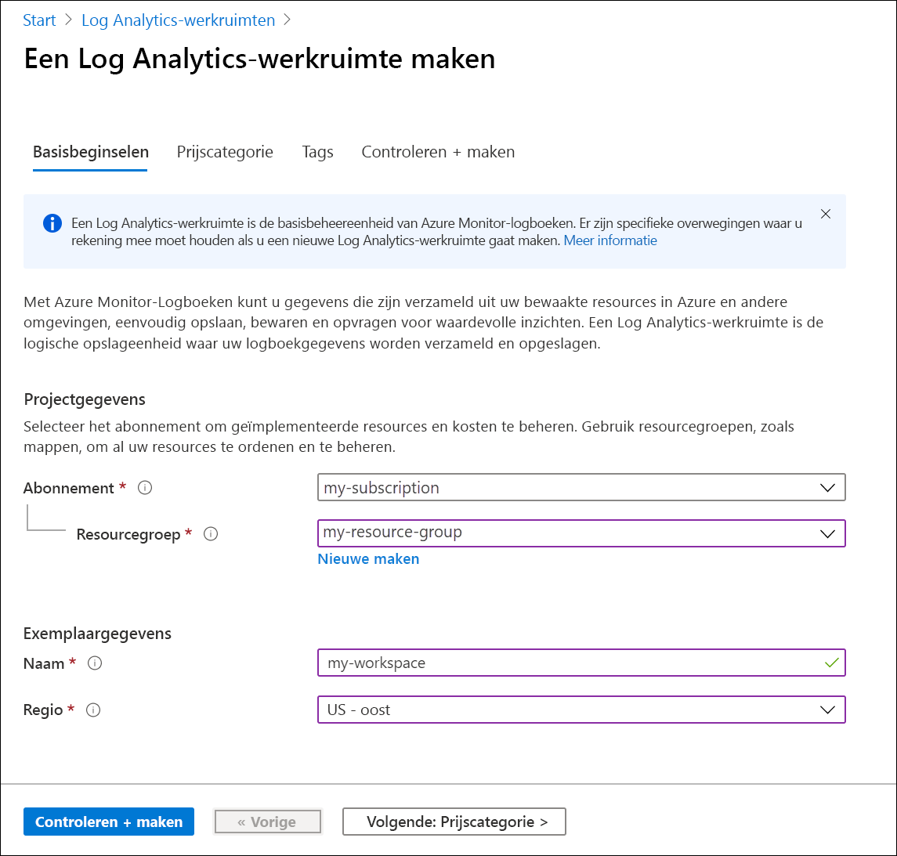
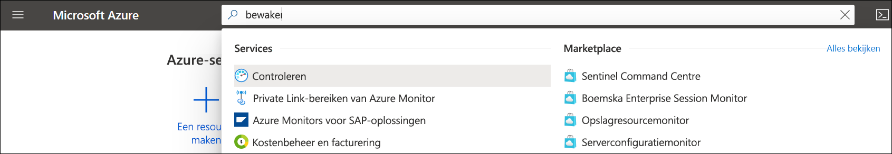
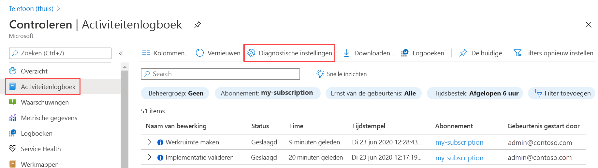
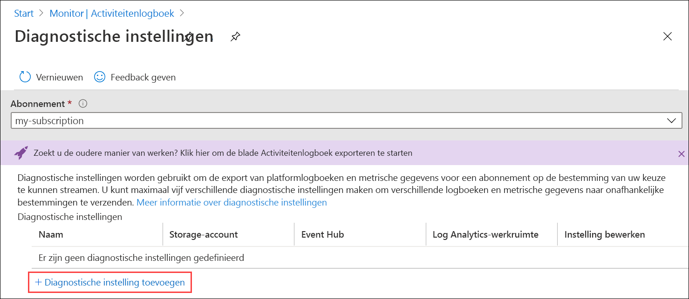
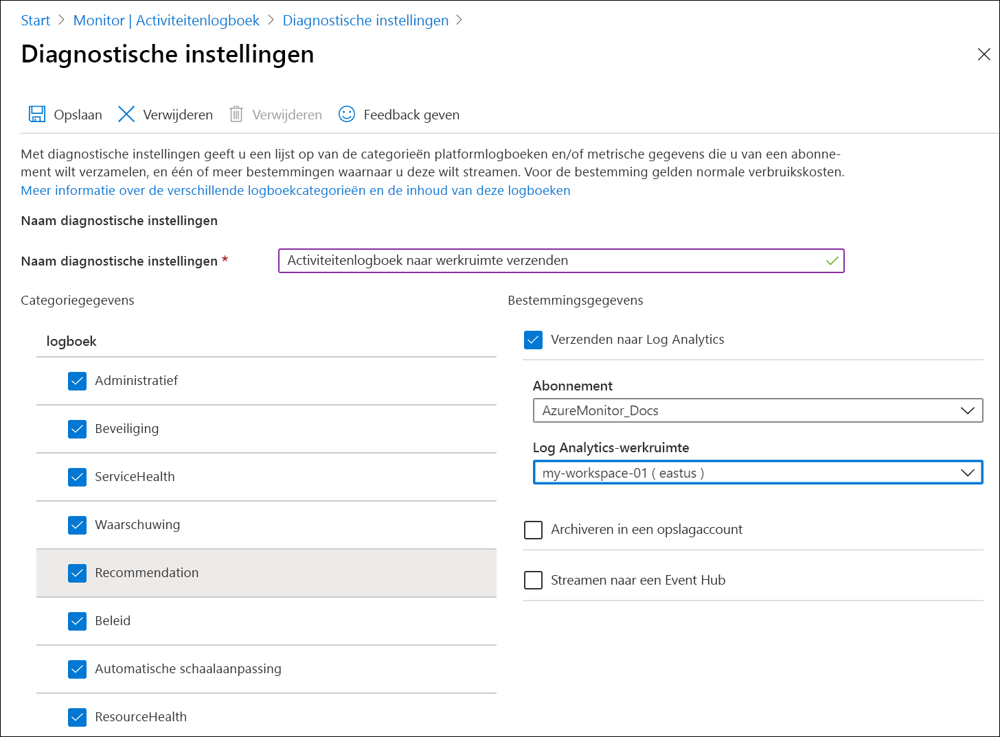
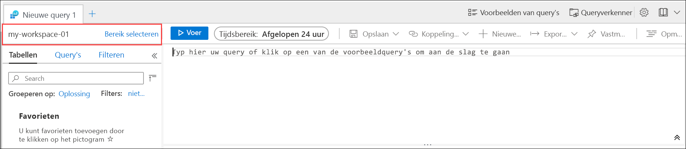
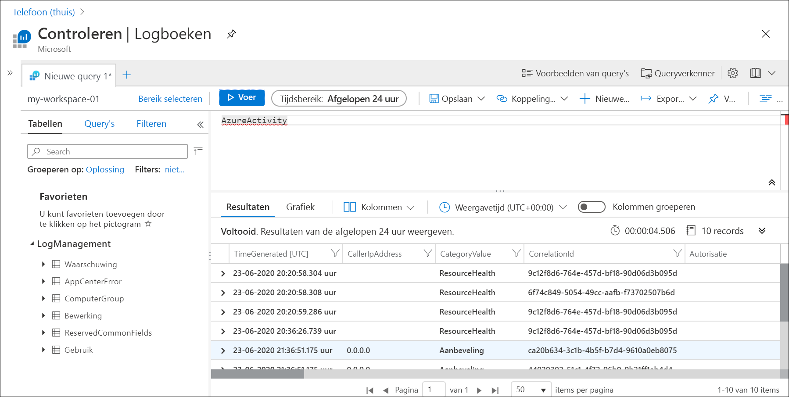
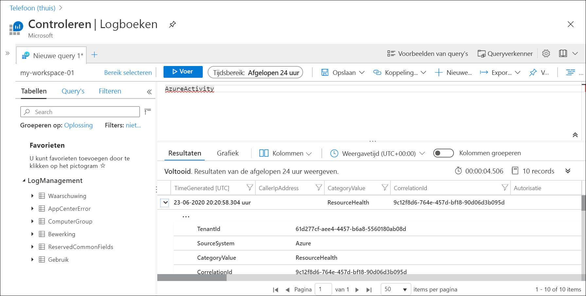

# Azure-activiteitenlogboek verzenden naar Log Analytics-werkruimte met behulp van een Azure-portal
Het activiteitenlogboek is een platformlogboek in Azure dat inzicht biedt in gebeurtenissen op abonnementsniveau. Dit geldt ook voor gegevens zoals wanneer een resource wordt gewijzigd of wanneer een virtuele machine wordt gestart. U kunt het activiteitenlogboek weergeven in de Azure-portal, of items ophalen met PowerShell en CLI. Deze Quick Start laat zien hoe u de Azure-portal kunt gebruiken voor het maken van een Log Analytics-werkruimte en een diagnostische instelling om het activiteitenlogboek te verzenden naar Azure Monitor-logboeken waar u het kunt analyseren met behulp van [logboekquery's](../log-query/log-query-overview.md) en om andere functies, zoals [logboekwaarschuwingen](../platform/alerts-log-query.md) en [werkmappen](../platform/workbooks-overview.md), in te schakelen. 

## Meld u aan bij Azure Portal
Meld u aan bij de Azure Portal op [https://portal.azure.com](https://portal.azure.com). 

## Een Log Analytics-werkruimte maken
Zoek en selecteer vervolgens **Log Analytics-werkruimten** in de Azure-portal. 

  
Klik op **Toevoegen** en geef vervolgens waarden op voor de **Resourcegroep**, de **Naam** van de werkruimte en **Locatie**. De naam van de werkruimte moet uniek zijn voor elk Azure-abonnement.

Klik op **Beoordelen en maken** om de instellingen te controleren en klik vervolgens **Maken** om de werkruimte te maken. Hiermee selecteert u een standaardprijscategorie van **Betalen per gebruik-** die geen wijzigingen doorvoert totdat u voldoende gegevens begint te verzamelen. Er worden geen kosten in rekening gebracht voor het verzamelen van het Activiteitenlogboek.

## Diagnostische instelling maken
Zoek in de Azure-portal naar **Monitor** en selecteer dit. 

Selecteer **Activiteitenlogboek**. U ziet recente gebeurtenissen voor het huidige abonnement. Klik op **Diagnostische instellingen** om de diagnostische instellingen voor het abonnement weer te geven.

Klik op **Diagnostische instelling toevoegen** om een nieuwe instelling te maken. 

Typ een naam zoals *Activiteitenlogboek verzenden naar werkruimte*. Selecteer elke categorie. Selecteer **Verzenden naar Log Analytics** als enige bestemming en geef vervolgens de werkruimte op die u hebt gemaakt. Klik op **Opslaan** om de diagnostische instelling te maken en sluit de pagina.

## Logboekgegevens genereren
Alleen nieuwe vermeldingen in het activiteitenlogboek worden verzonden naar de Log Analytics-werkruimte, dus voer enkele acties in uw abonnement uit die worden geregistreerd, zoals het starten of stoppen van een virtuele machine of het maken of wijzigen van een andere resource. Mogelijk moet u enkele minuten wachten totdat de diagnostische instelling is gemaakt en de eerste gegevens naar de werkruimte worden geschreven. Na deze vertraging worden alle gebeurtenissen die naar het activiteitenlogboek worden geschreven, binnen een paar seconden verzonden naar de werkruimte.

## Gegevens ophalen met een logboekquery

Selecteer **Logboeken** in het menu **Azure Monitor**. Sluit de pagina **Voorbeeldquery's**. Als het bereik niet is ingesteld op de werkruimte die u hebt gemaakt, klikt u op **Bereik selecteren** en zoekt u de werkruimte op.

Typ `AzureActivity` in het queryvenster en klik op **Uitvoeren**. Dit is een eenvoudige query waarmee alle records in de tabel *AzureActivity* worden geretourneerd. Deze tabel bevat alle records die vanuit het activiteitenlogboek zijn verzonden.

Vouw een van de records uit om de gedetailleerde eigenschappen ervan te bekijken.

Probeer een complexere query, zoals `AzureActivity | summarize count() by CategoryValue`, die een telling van gebeurtenissen per categorie bevat.

## Volgende stappen
In deze quickstart hebt u het activiteitenlogboek geconfigureerd om te worden verzonden naar een Log Analytics-werkruimte. U kunt nu andere gegevens configureren die moeten worden verzameld in de werkruimte, waar u ze kunt analyseren met [logboekquery's](../log-query/log-query-overview.md) in Azure Monitor, en gebruikmaken van functies zoals [logboekwaarschuwingen](../platform/alerts-log-query.md) en [werkmappen](../platform/workbooks-overview.md). Vervolgens moet u de [resourcelogboeken](../platform/resource-logs.md) uit uw Azure-resources verzamelen, die de gegevens in het Activiteitenlogboek aanvullen en die inzicht geven in de bewerkingen die binnen elke resource zijn uitgevoerd.

> [!div class="nextstepaction"]
> [Resourcelogboeken verzamelen en analyseren met Azure Monitor](tutorial-resource-logs.md)
