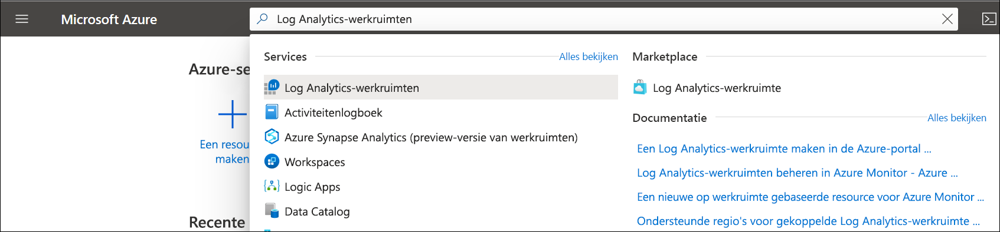

# Een Log Analytics-werkruimte in Azure Portal maken
Gebruik het menu **log Analytics werk ruimten** om een log Analytics-werk ruimte te maken met behulp van de Azure Portal. Een Log Analytics-werk ruimte is een unieke omgeving voor Azure Monitor logboek gegevens. Elke werk ruimte heeft een eigen gegevens opslagplaats en-configuratie, en gegevens bronnen en-oplossingen zijn geconfigureerd om hun gegevens op te slaan in een bepaalde werk ruimte. U hebt een Log Analytics-werk ruimte nodig als u van plan bent om gegevens te verzamelen uit de volgende bronnen:

* Azure-resources in uw abonnement
* On-premises computers die worden bewaakt door System Center Operations Manager
* Verzamelingen van apparaten uit Configuration Manager 
* Diagnose-of logboek gegevens vanuit Azure Storage

Zie de volgende onderwerpen voor andere bronnen, zoals virtuele Azure-machines en Windows-of Linux-Vm's in uw omgeving:

*  [Gegevens verzamelen van virtuele machines van Azure](../learn/quick-collect-azurevm.md) 
*  [Gegevens verzamelen van een hybride Linux-computer](../learn/quick-collect-linux-computer.md)
*  [Gegevens verzamelen van de hybride Windows-computer](quick-collect-windows-computer.md)

Als u nog geen abonnement op Azure hebt, maak dan een [gratis account](https://azure.microsoft.com/free/?WT.mc_id=A261C142F) aan voordat u begint.

## Meld u aan bij Azure Portal
Meld u aan bij de Azure Portal op [https://portal.azure.com](https://portal.azure.com). 

## Een werkruimte maken
1. Klik in Azure Portal op **Alle services**. Typ in de lijst met resources **Log Analytics**. Als u begint te typen, wordt de lijst gefilterd op basis van uw invoer. Selecteer **Log Analytics-werkruimten**.

    
  
2. Klik op **toevoegen**en selecteer vervolgens opties voor de volgende items:

   * Geef een naam op voor de nieuwe **Log Analytics-werkruimte**, bijvoorbeeld *StandaardLAWerkruimte*. Deze naam moet globaal uniek zijn in alle Azure Monitor-abonnementen.
   * Selecteer een **abonnement** om te koppelen door een selectie in de vervolgkeuzelijst te maken als de geselecteerde standaardwaarde niet juist is.
   * Kies voor **resource groep**een bestaande resource groep die al is ingesteld, of maak een nieuwe.  
   * Selecteer een beschik bare **locatie**.  Zie voor meer informatie de [regio's log Analytics beschikbaar in](https://azure.microsoft.com/regions/services/) en zoek naar Azure monitor in het veld **zoeken naar een product** .  
   * Als u een werkruimte maakt in een nieuw abonnement dat na 2 april 2018 is gemaakt, gebruikt deze automatisch de prijscategorie *Per GB*. De optie voor het selecteren van een prijscategorie is dan niet beschikbaar.  Als u een werk ruimte maakt voor een bestaand abonnement dat is gemaakt vóór 2 april, of voor een abonnement dat is gekoppeld aan een bestaande Enterprise Agreement EA-inschrijving, selecteert u de gewenste prijs categorie.  Zie [log Analytics prijs informatie](https://azure.microsoft.com/pricing/details/log-analytics/)voor meer informatie over de specifieke lagen.

          

3. Nadat u de vereiste gegevens hebt opgegeven in het deelvenster **Log Analytics-werkruimte**, klikt u op **OK**.  

Terwijl de gegevens worden geverifieerd en de werkruimte wordt gemaakt, kunt u de voortgang bijhouden onder **Meldingen** in het menu. 

## Problemen oplossen
Wanneer u een werk ruimte maakt die in de afgelopen 14 dagen is verwijderd en de status voor het [voorlopig verwijderen](../platform/delete-workspace.md#soft-delete-behavior)heeft, kan de bewerking afwijken, afhankelijk van de configuratie van uw werk ruimte:
1. Als u dezelfde naam voor de werk ruimte, de resource groep, het abonnement en de regio opgeeft als in de verwijderde werk ruimte, wordt uw werk ruimte hersteld, met inbegrip van de bijbehorende gegevens, configuratie en verbonden agents.
2. Als u dezelfde naam voor de werk ruimte gebruikt, maar een andere resource groep, abonnement of regio, krijgt u een fout melding *deze werkruimte naam wordt al gebruikt. Probeer een ander account*. Volg deze stappen om de werk ruimte eerst te herstellen en permanent verwijderen uit te voeren om de tijdelijke verwijdering te onderdrukken en uw werk ruimte permanent te verwijderen en een nieuwe werk ruimte met dezelfde naam te maken:
   - Uw werk ruimte [herstellen](../platform/delete-workspace.md#recover-workspace)
   - Uw werk ruimte [permanent verwijderen](../platform/delete-workspace.md#permanent-workspace-delete)
   - Een nieuwe werk ruimte maken met dezelfde werkruimte naam

## Volgende stappen
Nu u een werk ruimte beschikbaar hebt, kunt u een verzameling van de telemetrie-bewaking configureren, Zoek opdrachten in Logboeken uitvoeren om die gegevens te analyseren en een beheer oplossing toevoegen om extra gegevens en analytische inzichten te leveren. 

* Zie [Azure service-logboeken en-metrische gegevens verzamelen voor gebruik in log Analytics](../platform/resource-logs.md#send-to-log-analytics-workspace)voor informatie over het inschakelen van het verzamelen van data van Azure-resources met Azure Diagnostics of Azure Storage.  
* [Voeg System Center Operations Manager als gegevens bron](../platform/om-agents.md) toe om gegevens te verzamelen van agents die uw Operations Manager beheer groep rapporteren en op te slaan in uw log Analytics-werk ruimte. 
* Verbind [Configuration Manager](../platform/collect-sccm.md) om computers te importeren die lid zijn van verzamelingen in de hiërarchie.  
* Bekijk de beschik bare [bewakings oplossingen](../insights/solutions.md) en hoe u een oplossing kunt toevoegen aan of verwijderen uit uw werk ruimte.
