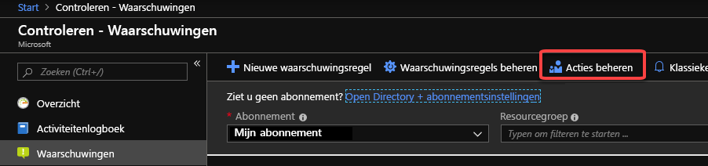
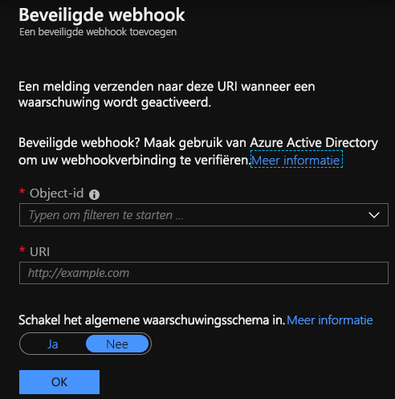

# <a name="create-and-manage-action-groups-in-the-azure-portal"></a>Actiegroepen maken en beheren in de Azure-portal
Een actiegroep is een verzameling meldingsvoorkeuren die zijn gedefinieerd door de eigenaar van een Azure-abonnement. Azure Monitor- en Servicestatuswaarschuwingen gebruiken actiegroepen om gebruikers te laten weten dat er een waarschuwing is geactiveerd. Verschillende waarschuwingen kunnen dezelfde actiegroep of verschillende actiegroepen gebruiken, afhankelijk van de vereisten van de gebruiker. U maximaal 2.000 actiegroepen configureren in een abonnement.

U configureert een actie om een persoon per e-mail of sms op de hoogte te stellen, zij ontvangen een bevestiging dat hij of zij aan de actiegroep is toegevoegd.

In dit artikel ziet u hoe u actiegroepen in de Azure-portal maken en beheren.

Elke actie bestaat uit de volgende eigenschappen:

* **Naam:** een unieke id binnen de actiegroep.  
* **Actietype**: De uitgevoerde actie. Voorbeelden hiervan zijn het verzenden van een spraakoproep, SMS, e-mail; of het activeren van verschillende soorten geautomatiseerde acties. Zie de typen later in dit artikel.
* **Details**: De overeenkomstige details die per *actietype*verschillen .

Zie [Sjablonen voor actiegroepResourcebeheer](../../azure-monitor/platform/action-groups-create-resource-manager-template.md)voor informatie over het gebruik van Azure Resource Manager-sjablonen om actiegroepen te configureren.

## <a name="create-an-action-group-by-using-the-azure-portal"></a>Een actiegroep maken met de Azure-portal

1. Zoek en selecteer **Monitor**in de [Azure-portal](https://portal.azure.com). Het **deelvenster Monitor** consolideert al uw bewakingsinstellingen en gegevens in één weergave.

1. Selecteer **Waarschuwingen** en vervolgens **Acties beheren**.

    
    
1. Selecteer **Actiegroep toevoegen**en vul de velden in.

    
    
1. Voer een naam in het vak **Groepsnaam van** de groep in en voer een naam in het vak **Korte naam** in. De korte naam wordt gebruikt in plaats van een volledige naam van de actiegroep als er meldingen via deze groep worden verzonden.

      

1. Het vak **Abonnement** vult automatisch met uw huidige abonnement. Dit abonnement is het abonnement waarin de actiegroep wordt opgeslagen.

1. Selecteer de **groep Resource** waarin de actiegroep is opgeslagen.

1. Definieer een lijst met acties. Geef voor elke actie het volgende op:

    1. **Naam:** Voer een unieke id in voor deze actie.

    1. **Actietype:** selecteer E-mail/SMS/Push/Voice, Logic App, Webhook, ITSM of Automation Runbook.

    1. **Details:** Voer op basis van het actietype een telefoonnummer, e-mailadres, webhook URI, Azure-app, ITSM-verbinding of Automatiseringsrunbook in. Geef voor ITSM-actie extra **werkitem** en andere velden op waarvoor uw ITSM-gereedschap nodig heeft.
    
    1. **Algemeen waarschuwingsschema**: U ervoor kiezen om het [algemene waarschuwingsschema](https://aka.ms/commonAlertSchemaDocs)in te schakelen, wat het voordeel biedt dat er één uitbreidbare en uniforme waarschuwingspayload is voor alle waarschuwingsservices in Azure Monitor.

1. Selecteer **OK** om de actiegroep te maken.

## <a name="manage-your-action-groups"></a>Uw actiegroepen beheren

Nadat u een actiegroep hebt gemaakt, u **actiegroepen** weergeven door **Acties beheren te** selecteren op de **bestemmingspagina Waarschuwingen** in het deelvenster **Monitor.** Selecteer de actiegroep die u wilt beheren:

* Acties toevoegen, bewerken of verwijderen.
* Verwijder de actiegroep.

## <a name="action-specific-information"></a>Actiespecifieke informatie

> [!NOTE]
> Zie [Abonnementsservicelimieten voor controle](https://docs.microsoft.com/azure/azure-resource-manager/management/azure-subscription-service-limits#azure-monitor-limits) voor numerieke limieten voor elk van de onderstaande items.  

### <a name="automation-runbook"></a>Runbook voor automatisering
Raadpleeg de [azure-abonnementsservicelimieten](../../azure-resource-manager/management/azure-subscription-service-limits.md) voor limieten voor Runbook-payloads.

Mogelijk hebt u een beperkt aantal Runbook-acties in een actiegroep. 

### <a name="azure-app-push-notifications"></a>Pushmeldingen voor Azure-apps
Mogelijk hebt u een beperkt aantal Azure-app-acties in een actiegroep.

### <a name="email"></a>Email
E-mails worden verzonden vanaf de volgende e-mailadressen. Ervoor zorgen dat uw e-mailfiltering op de juiste manier is geconfigureerd
- azure-noreply@microsoft.com
- azureemail-noreply@microsoft.com
- alerts-noreply@mail.windowsazure.com

Mogelijk hebt u een beperkt aantal e-mailacties in een actiegroep. Zie het [artikel over tariefbeperkende informatie.](./../../azure-monitor/platform/alerts-rate-limiting.md)

### <a name="email-azure-resource-manager-role"></a>A-mail a-mail a-mail functie Azure Resource Manager
Stuur e-mail naar de leden van de rol van het abonnement. E-mail wordt alleen verzonden naar **Azure AD-gebruikers** van de rol. E-mail wordt niet verzonden naar Azure AD-groepen of serviceprincipals.

Mogelijk hebt u een beperkt aantal e-mailacties in een actiegroep. Zie het [artikel over tariefbeperkende informatie.](./../../azure-monitor/platform/alerts-rate-limiting.md)

### <a name="function"></a>Functie
Roept een bestaand HTTP-triggereindpunt aan in [Azure-functies](../../azure-functions/functions-create-first-azure-function.md#create-a-function-app).

Mogelijk hebt u een beperkt aantal functieacties in een actiegroep.

### <a name="itsm"></a>ITSM
ITSM Action vereist een ITSM-verbinding. Meer informatie over het maken van een [ITSM-verbinding](../../azure-monitor/platform/itsmc-overview.md).

Mogelijk hebt u een beperkt aantal ITSM-acties in een actiegroep. 

### <a name="logic-app"></a>Logische apps
Mogelijk hebt u een beperkt aantal Logic App-acties in een actiegroep.

### <a name="secure-webhook"></a>Veilige webhaak
Met de actie Actiegroepen Webhook u gebruik maken van Azure Active Directory om de verbinding tussen uw actiegroep en uw beveiligde web-API (webhook-eindpunt) te beveiligen. De algemene workflow om van deze functionaliteit gebruik te maken wordt hieronder beschreven. Zie overzicht van [Microsoft Identity Platform (v2.0)](https://docs.microsoft.com/azure/active-directory/develop/v2-overview)voor een overzicht van Azure AD-toepassingen en serviceprincipals.

1. Maak een Azure AD-toepassing voor uw beveiligde web-API. Zie https://docs.microsoft.com/azure/active-directory/develop/scenario-protected-web-api-overview.
    - Configureer uw beveiligde API om te worden aangeroepen door een daemon-app.
    
1. Actiegroepen inschakelen om uw Azure AD-toepassing te gebruiken.

    > [!NOTE]
    > U moet lid zijn van de [azure AD-toepassingsbeheerderrol](https://docs.microsoft.com/azure/active-directory/users-groups-roles/directory-assign-admin-roles#available-roles) om dit script uit te voeren.
    
    - Wijzig de Connect-AzureAD-aanroep van het PowerShell-script om uw Azure AD-tenant-id te gebruiken.
    - De variabele $myAzureADApplicationObjectId van het PowerShell-script wijzigen om de object-id van uw Azure AD-toepassing te gebruiken
    - Voer het gewijzigde script uit.
    
1. Configureer de actie Secure Webhook voor actiegroep Secure.
    - Kopieer de waarde $myApp.ObjectId uit het script en voer deze in het veld Toepassingsobject-id in de actiedefinitie Webhook.
    
    

#### <a name="secure-webhook-powershell-script"></a>Secure Webhook PowerShell-script

```PowerShell
Connect-AzureAD -TenantId "<provide your Azure AD tenant ID here>"
    
# This is your Azure AD Application's ObjectId. 
$myAzureADApplicationObjectId = "<the Object Id of your Azure AD Application>"
    
# This is the Action Groups Azure AD AppId
$actionGroupsAppId = "461e8683-5575-4561-ac7f-899cc907d62a"
    
# This is the name of the new role we will add to your Azure AD Application
$actionGroupRoleName = "ActionGroupsSecureWebhook"
    
# Create an application role of given name and description
Function CreateAppRole([string] $Name, [string] $Description)
{
    $appRole = New-Object Microsoft.Open.AzureAD.Model.AppRole
    $appRole.AllowedMemberTypes = New-Object System.Collections.Generic.List[string]
    $appRole.AllowedMemberTypes.Add("Application");
    $appRole.DisplayName = $Name
    $appRole.Id = New-Guid
    $appRole.IsEnabled = $true
    $appRole.Description = $Description
    $appRole.Value = $Name;
    return $appRole
}
    
# Get my Azure AD Application, it's roles and service principal
$myApp = Get-AzureADApplication -ObjectId $myAzureADApplicationObjectId
$myAppRoles = $myApp.AppRoles
$actionGroupsSP = Get-AzureADServicePrincipal -Filter ("appId eq '" + $actionGroupsAppId + "'")

Write-Host "App Roles before addition of new role.."
Write-Host $myAppRoles
    
# Create the role if it doesn't exist
if ($myAppRoles -match "ActionGroupsSecureWebhook")
{
    Write-Host "The Action Groups role is already defined.`n"
}
else
{
    $myServicePrincipal = Get-AzureADServicePrincipal -Filter ("appId eq '" + $myApp.AppId + "'")
    
    # Add our new role to the Azure AD Application
    $newRole = CreateAppRole -Name $actionGroupRoleName -Description "This is a role for Action Groups to join"
    $myAppRoles.Add($newRole)
    Set-AzureADApplication -ObjectId $myApp.ObjectId -AppRoles $myAppRoles
}
    
# Create the service principal if it doesn't exist
if ($actionGroupsSP -match "AzNS AAD Webhook")
{
    Write-Host "The Service principal is already defined.`n"
}
else
{
    # Create a service principal for the Action Groups Azure AD Application and add it to the role
    $actionGroupsSP = New-AzureADServicePrincipal -AppId $actionGroupsAppId
}
    
New-AzureADServiceAppRoleAssignment -Id $myApp.AppRoles[0].Id -ResourceId $myServicePrincipal.ObjectId -ObjectId $actionGroupsSP.ObjectId -PrincipalId $actionGroupsSP.ObjectId
    
Write-Host "My Azure AD Application ($myApp.ObjectId): " + $myApp.ObjectId
Write-Host "My Azure AD Application's Roles"
Write-Host $myApp.AppRoles
```

### <a name="sms"></a>Sms
Zie de [tariefbeperkende informatie](./../../azure-monitor/platform/alerts-rate-limiting.md) en [sms-waarschuwingsgedrag](../../azure-monitor/platform/alerts-sms-behavior.md) voor aanvullende belangrijke informatie.

Mogelijk hebt u een beperkt aantal sms-acties in een actiegroep.  

### <a name="voice"></a>Spraak
Zie het [artikel over tariefbeperkende informatie.](./../../azure-monitor/platform/alerts-rate-limiting.md)

Mogelijk hebt u een beperkt aantal spraakacties in een actiegroep.

### <a name="webhook"></a>Webhook
Webhooks worden opnieuw geprobeerd met behulp van de volgende regels. De webhook-aanroep wordt maximaal 2 keer opnieuw geprobeerd wanneer de volgende HTTP-statuscodes worden geretourneerd: 408, 429, 503, 504 of het HTTP-eindpunt reageert niet. De eerste poging vindt plaats na 10 seconden. De tweede poging gebeurt na 100 seconden. Na twee fouten zal geen enkele actiegroep het eindpunt gedurende 30 minuten aanroepen. 

Bron-IP-adresbereiken
 - 13.72.19.232
 - 13.106.57.181
 - 13.106.54.3
 - 13.106.54.19
 - 13.106.38.142
 - 13.106.38.148
 - 13.106.57.196
 - 13.106.57.197
 - 52.244.68.117
 - 52.244.65.137
 - 52.183.31.0
 - 52.184.145.166
 - 51.4.138.199
 - 51.5.148.86
 - 51.5.149.19

Als u updates wilt ontvangen over wijzigingen in deze IP-adressen, raden we u aan een servicestatuswaarschuwing te configureren, die controleert op informatieve meldingen over de service Actiegroepen.

Mogelijk hebt u een beperkt aantal Webhook-acties in een actiegroep.


## <a name="next-steps"></a>Volgende stappen
* Meer informatie over [sms-waarschuwingsgedrag](../../azure-monitor/platform/alerts-sms-behavior.md).  
* Inzicht krijgen [in het webhookschema voor activiteitenlogboekwaarschuwingen](../../azure-monitor/platform/activity-log-alerts-webhook.md).  
* Meer informatie over [ITSM-connector](../../azure-monitor/platform/itsmc-overview.md)
* Meer informatie over [tariefbeperking](../../azure-monitor/platform/alerts-rate-limiting.md) bij waarschuwingen.
* Krijg een [overzicht van waarschuwingen voor activiteitenlogboeken](../../azure-monitor/platform/alerts-overview.md)en ontdek hoe u waarschuwingen ontvangt.  
* Meer informatie over het [configureren van waarschuwingen wanneer een servicestatusmelding wordt geplaatst.](../../azure-monitor/platform/alerts-activity-log-service-notifications.md)
