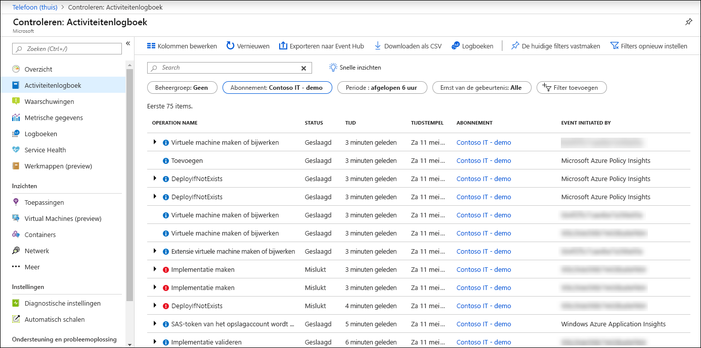
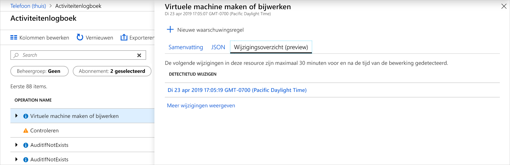
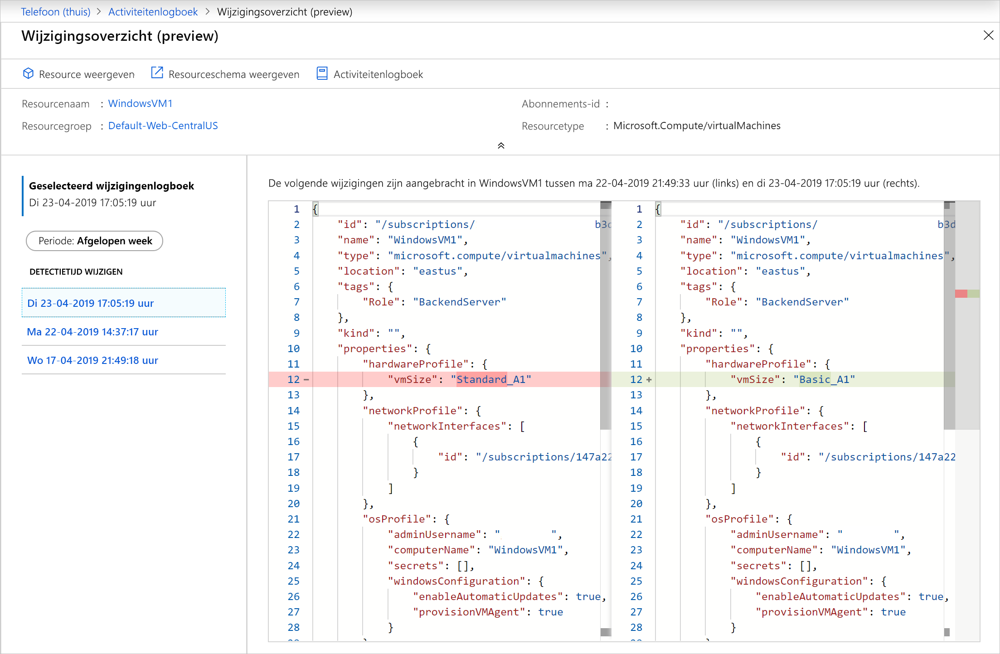
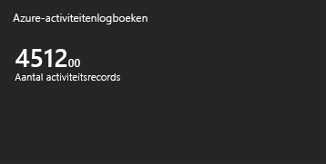
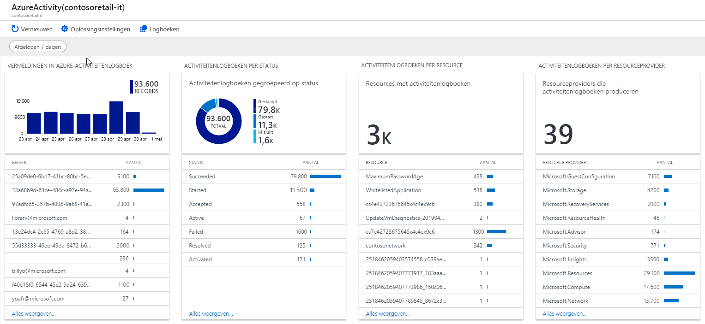

# <a name="view-and-retrieve-azure-activity-log-events"></a>Activiteiten logboek gebeurtenissen van Azure bekijken en ophalen

Het [Azure-activiteiten logboek](platform-logs-overview.md) biedt inzicht in gebeurtenissen op abonnements niveau die in azure hebben plaatsgevonden. In dit artikel vindt u informatie over verschillende methoden voor het weer geven en ophalen van activiteiten logboek gebeurtenissen.

## <a name="azure-portal"></a>Azure Portal
Bekijk het activiteiten logboek voor alle resources in het menu **monitor** in de Azure Portal. Bekijk het activiteiten logboek voor een bepaalde resource vanuit de optie **activiteiten logboek** in het menu van de resource.



U kunt activiteiten logboek gebeurtenissen filteren op de volgende velden:

* **Time span**: de begin-en eind tijd voor gebeurtenissen.
* **Categorie**: de gebeurtenis categorie zoals beschreven in [Categorieën in het activiteiten logboek](activity-log-view.md#categories-in-the-activity-log).
* **Abonnement**: een of meer namen van Azure-abonnementen.
* **Resource groep**: een of meer resource groepen binnen de geselecteerde abonnementen.
* **Resource (naam)** :-de naam van een specifieke resource.
* **Resource type**: het type resource, bijvoorbeeld _micro soft. Compute/informatie_.
* **Bewerkings naam** : de naam van een Azure Resource Manager bewerking, bijvoorbeeld _micro soft. SQL/servers/schrijven_.
* **Ernst**: de ernst van de gebeurtenis. Beschik bare waarden zijn _informatief_, _waarschuwing_, _fout_, _kritiek_.
* **Gebeurtenis gestart door**: de gebruiker die de bewerking heeft uitgevoerd.
* **Open zoeken**: zoekvak voor tekst openen waarin wordt gezocht naar de teken reeks in alle velden van alle gebeurtenissen.

## <a name="categories-in-the-activity-log"></a>Categorieën in het activiteiten logboek
Elke gebeurtenis in het activiteiten logboek heeft een bepaalde categorie die wordt beschreven in de volgende tabel. Zie voor volledige informatie over de schema's van deze categorieën vallen [gebeurtenisschema in het Azure-activiteitenlogboek](activity-log-schema.md). 

| Categorie | Beschrijving |
|:---|:---|
| Administratief | Bevat de record van alle bewerkingen voor maken, bijwerken, verwijderen en acties die zijn uitgevoerd via Resource Manager. Voor beelden van beheer gebeurtenissen zijn het maken van een _virtuele machine_ en het verwijderen van de _netwerk beveiligings groep_.<br><br>Elke actie die door een gebruiker of toepassing wordt uitgevoerd met behulp van Resource Manager, is gemodelleerd als een bewerking voor een bepaald bron type. Als het bewerkings type _schrijven_, _verwijderen_of _actie_is, worden de records van zowel het begin als het slagen of mislukken van die bewerking vastgelegd in de beheer categorie. Beheer gebeurtenissen omvatten ook eventuele wijzigingen in op rollen gebaseerd toegangs beheer in een abonnement. |
| Service Health | Bevat de record van alle service status incidenten die zich in azure hebben voorgedaan. Een voor beeld van een Service Health gebeurtenis _SQL Azure in VS-Oost_ondervindt downtime. <br><br>Service Health gebeurtenissen zijn beschikbaar in zes rassen: _actie vereist_, _assistentie herstel_, _incident_, _onderhoud_, _informatie_of _beveiliging_. Deze gebeurtenissen worden alleen gemaakt als u een resource in het abonnement hebt die van invloed is op de gebeurtenis.
| Status van resources | Bevat de record van de resource status gebeurtenissen die zijn opgetreden in uw Azure-resources. Een voor beeld van een Resource Health gebeurtenis is de status van de _virtuele machine is gewijzigd in niet beschikbaar_.<br><br>Resource Health gebeurtenissen kunnen een van de vier statussen vertegenwoordigen: _beschikbaar, niet_ _beschikbaar_, _gedegradeerd_en _onbekend_. Daarnaast kunnen Resource Health gebeurtenissen worden gecategoriseerd als _platform gestart_ of door de _gebruiker gestart_. |
| Waarschuwing | Bevat de registratie van activeringen voor Azure-waarschuwingen. Een voor beeld van een waarschuwings gebeurtenis is _CPU% op myVM heeft de afgelopen vijf minuten meer dan 80_.|
| Automatisch schalen | Bevat de record van gebeurtenissen die betrekking hebben op de werking van de engine voor automatisch schalen op basis van de instellingen voor automatisch schalen die u hebt gedefinieerd in uw abonnement. Een voor beeld van een automatisch schalen-gebeurtenis is het _Omhoog schalen van de actie voor schalen is mislukt_. |
| Aanbeveling | Bevat aanbevelings gebeurtenissen van Azure Advisor. |
| Beveiliging | Bevat de record van waarschuwingen die zijn gegenereerd door Azure Security Center. Een voor beeld van een beveiligings gebeurtenis is een _verdacht dubbel extensie bestand_dat wordt uitgevoerd. |
| Beleid | Bevat records van alle bewerkingen voor effect acties die zijn uitgevoerd door Azure Policy. Voor beelden van beleids gebeurtenissen zijn onder andere _controle_ en _weigeren_. Elke actie die wordt uitgevoerd door beleid, wordt gemodelleerd als een bewerking voor een resource. |

## <a name="view-change-history"></a>Wijzigings overzicht weer geven

Bij het controleren van het activiteiten logboek kan het u helpen om te zien welke wijzigingen er zijn aangebracht tijdens die gebeurtenis tijd. U kunt deze informatie bekijken met de **wijzigings geschiedenis**. Selecteer een gebeurtenis in het activiteiten logboek waarin u wilt zoeken. Selecteer het tabblad **wijzigings overzicht (preview)** om de bijbehorende wijzigingen met die gebeurtenis weer te geven.



Als er wijzigingen zijn aangebracht aan de gebeurtenis, ziet u een lijst met wijzigingen die u kunt selecteren. Hiermee opent u de pagina **wijzigings overzicht (preview)** . Op deze pagina ziet u de wijzigingen van de resource. Zoals u kunt zien in het volgende voor beeld, kunnen we niet alleen zien dat de VM de grootte heeft gewijzigd, maar wat de vorige VM-grootte was vóór de wijziging en waar deze is gewijzigd in.



Zie [resource wijzigingen ophalen](../../governance/resource-graph/how-to/get-resource-changes.md)voor meer informatie over wijzigings geschiedenis.


## <a name="powershell"></a>PowerShell
Gebruik de cmdlet [Get-AzLog](https://docs.microsoft.com/powershell/module/az.monitor/get-azlog) om het activiteiten logboek van Power shell op te halen. Hier volgen enkele algemene voor beelden.

> [!NOTE]
> `Get-AzLog` biedt alleen 15 dagen aan geschiedenis. Gebruik de para meter **-MaxEvents** om de laatste N gebeurtenissen na 15 dagen op te vragen. Als u toegang wilt hebben tot gebeurtenissen die ouder zijn dan 15 dagen, gebruikt u de REST API of SDK. Als u **StartTime**niet opneemt, wordt de standaard waarde **EndTime** min één uur. Als u geen **EndTime**opgeeft, is de standaard waarde huidige tijd. Alle tijden zijn in UTC.


Logboek vermeldingen ophalen die zijn gemaakt na een bepaalde datum en tijd:

```powershell
Get-AzLog -StartTime 2016-03-01T10:30
```

Logboek vermeldingen ophalen tussen een datum en tijd bereik:

```powershell
Get-AzLog -StartTime 2015-01-01T10:30 -EndTime 2015-01-01T11:30
```

Logboek vermeldingen ophalen van een specifieke resource groep:

```powershell
Get-AzLog -ResourceGroup 'myrg1'
```

Logboek vermeldingen van een specifieke resource provider ophalen tussen een datum en tijd bereik:

```powershell
Get-AzLog -ResourceProvider 'Microsoft.Web' -StartTime 2015-01-01T10:30 -EndTime 2015-01-01T11:30
```

Logboek vermeldingen ophalen met een specifieke aanroeper:

```powershell
Get-AzLog -Caller 'myname@company.com'
```

De laatste 1000 gebeurtenissen ophalen:

```powershell
Get-AzLog -MaxEvents 1000
```


## <a name="cli"></a>CLI
Gebruik [AZ monitor Activity-Log](cli-samples.md#view-activity-log-for-a-subscription) om het activiteiten logboek op te halen uit de cli. Hier volgen enkele algemene voor beelden.


Alle beschik bare opties weer geven.

```azurecli
az monitor activity-log list -h
```

Logboek vermeldingen ophalen van een specifieke resource groep:

```azurecli
az monitor activity-log list --resource-group <group name>
```

Logboek vermeldingen ophalen met een specifieke aanroeper:

```azurecli
az monitor activity-log list --caller myname@company.com
```

Logboeken ophalen op basis van een aanroeper voor een resource type binnen een datum bereik:

```azurecli
az monitor activity-log list --resource-provider Microsoft.Web \
    --caller myname@company.com \
    --start-time 2016-03-08T00:00:00Z \
    --end-time 2016-03-16T00:00:00Z
```

## <a name="rest-api"></a>REST API
Gebruik de [Azure Monitor rest API](https://docs.microsoft.com/rest/api/monitor/) om het activiteiten logboek van een rest-client op te halen. Hier volgen enkele algemene voor beelden.

Activiteiten logboeken ophalen met het filter:

``` HTTP
GET https://management.azure.com/subscriptions/089bd33f-d4ec-47fe-8ba5-0753aa5c5b33/providers/microsoft.insights/eventtypes/management/values?api-version=2015-04-01&$filter=eventTimestamp ge '2018-01-21T20:00:00Z' and eventTimestamp le '2018-01-23T20:00:00Z' and resourceGroupName eq 'MSSupportGroup'
```

Activiteiten logboeken ophalen met het filter en Select:

```HTTP
GET https://management.azure.com/subscriptions/089bd33f-d4ec-47fe-8ba5-0753aa5c5b33/providers/microsoft.insights/eventtypes/management/values?api-version=2015-04-01&$filter=eventTimestamp ge '2015-01-21T20:00:00Z' and eventTimestamp le '2015-01-23T20:00:00Z' and resourceGroupName eq 'MSSupportGroup'&$select=eventName,id,resourceGroupName,resourceProviderName,operationName,status,eventTimestamp,correlationId,submissionTimestamp,level
```

Activiteiten logboeken ophalen met Select:

```HTTP
GET https://management.azure.com/subscriptions/089bd33f-d4ec-47fe-8ba5-0753aa5c5b33/providers/microsoft.insights/eventtypes/management/values?api-version=2015-04-01&$select=eventName,id,resourceGroupName,resourceProviderName,operationName,status,eventTimestamp,correlationId,submissionTimestamp,level
```

Activiteiten logboeken ophalen zonder filter of selectie:

```HTTP
GET https://management.azure.com/subscriptions/089bd33f-d4ec-47fe-8ba5-0753aa5c5b33/providers/microsoft.insights/eventtypes/management/values?api-version=2015-04-01
```


## <a name="activity-logs-analytics-monitoring-solution"></a>Bewakings oplossing voor activiteiten logboeken
De Azure Log Analytics-bewakings oplossing bevat meerdere logboek query's en-weer gaven voor het analyseren van de records in het activiteiten logboek in uw Log Analytics-werk ruimte.

### <a name="prerequisites"></a>Vereisten
U moet een diagnostische instelling maken om het activiteiten logboek voor uw abonnement te verzenden naar een Log Analytics-werk ruimte. Zie [Azure platform-logboeken verzamelen in log Analytics werk ruimte in azure monitor](resource-logs-collect-workspace.md).

### <a name="install-the-solution"></a>De oplossing installeren
Gebruik de procedure in [een bewakings oplossing installeren](../insights/solutions.md#install-a-monitoring-solution) om de **analyse van activiteitenlogboek** -oplossing te installeren. Er is geen aanvullende configuratie vereist.

### <a name="use-the-solution"></a>De oplossing gebruiken
Klik boven aan de pagina **activiteiten logboek** op **Logboeken** om de [analyse van activiteitenlogboek bewakings oplossing](activity-log-collect.md) voor het abonnement te openen. U hebt ook toegang tot alle bewakings oplossingen in **het menu van** het abonnements controleprogramma in het Azure Portal. Selecteer **meer** in het gedeelte **inzichten** om de **overzichts** pagina te openen met de oplossings tegels. De tegel **activiteiten logboeken van Azure** bevat een telling van het aantal **AzureActivity** -records in uw werk ruimte.




Klik op de tegel **Azure-activiteiten logboeken** om de weer gave **Azure-activiteiten logboeken** te openen. De weer gave bevat de visualisatie onderdelen in de volgende tabel. Elk onderdeel bevat Maxi maal 10 items die overeenkomen met de criteria van die onderdelen voor het opgegeven tijds bereik. U kunt een logboek query uitvoeren waarmee alle overeenkomende records worden geretourneerd door te klikken op **Alles bekijken** onder aan het onderdeel.



| Visualisatie onderdeel | Beschrijving |
| --- | --- |
| Vermeldingen in het Azure-activiteit | Toont een staaf diagram van de bovenste Azure-activiteiten logboek vermeldingen records voor het datum bereik dat u hebt geselecteerd, en toont een lijst met de Top 10 van aanroepen van de activiteit. Klik op het staafdiagram voor het uitvoeren van een logboekzoekopdracht voor `AzureActivity`. Klik op een beller-item om een zoek opdracht in Logboeken uit te voeren waarin alle activiteiten logboek vermeldingen voor dat item worden geretourneerd. |
| Activiteitenlogboeken op Status | Toont een ring diagram voor de Azure-activiteiten logboek status voor het geselecteerde datum bereik en een lijst met de top tien status records. Klik op de grafiek om een logboek query voor `AzureActivity | summarize AggregatedValue = count() by ActivityStatus`uit te voeren. Klik op een status item om een logboek zoekopdracht uit te voeren waarin alle activiteiten logboek vermeldingen voor die status record worden geretourneerd. |
| Activiteitenlogboeken per Resource | Toont het totale aantal resources met activiteiten logboeken en een lijst met de bovenste tien resources met record aantallen voor elke resource. Klik op het totale aantal gebied voor het uitvoeren van een logboekzoekopdracht voor `AzureActivity | summarize AggregatedValue = count() by Resource`, waarin alle Azure-resources beschikbaar zijn voor de oplossing wordt getoond. Klik op een resource om een logboek query uit te voeren voor het retour neren van alle activiteiten records voor die bron. |
| Activiteitenlogboeken door de Resourceprovider | Toont het totale aantal resource providers dat activiteiten logboeken produceert en een lijst met de top tien. Klik op het gedeelte totaal om een logboek query uit te voeren voor `AzureActivity | summarize AggregatedValue = count() by ResourceProvider`, waarin alle Azure-resource providers worden weer gegeven. Klik op een resource provider om een logboek query uit te voeren voor het retour neren van alle activiteiten records voor de provider. |


## <a name="next-steps"></a>Volgende stappen

* [Een overzicht van de platform logboeken lezen](platform-logs-overview.md)
* [Diagnostische instelling maken om activiteiten logboeken te verzenden naar andere bestemmingen](diagnostic-settings.md)
