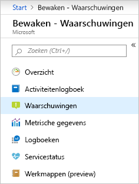
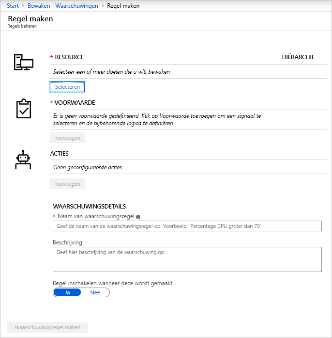
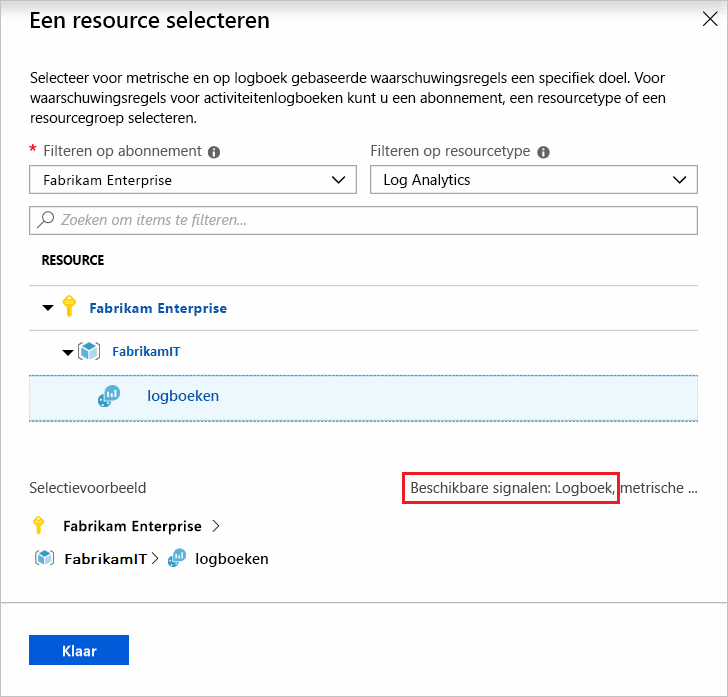
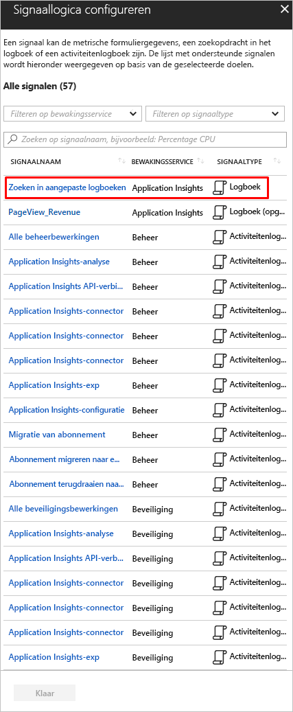
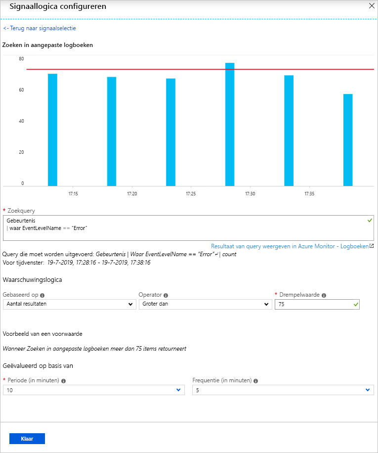
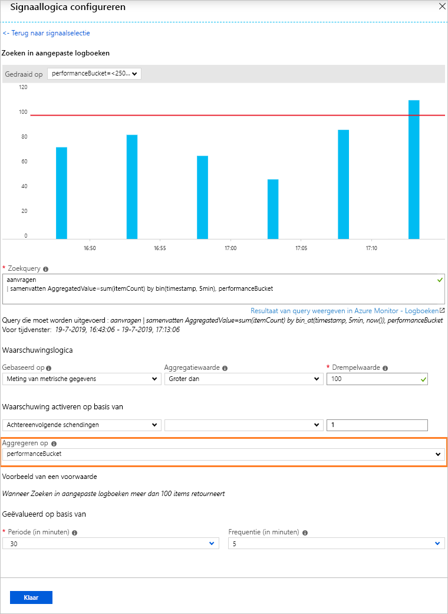
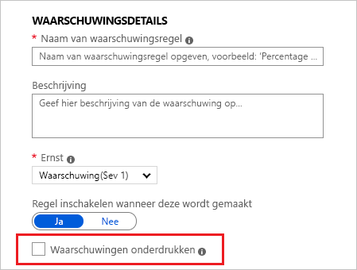
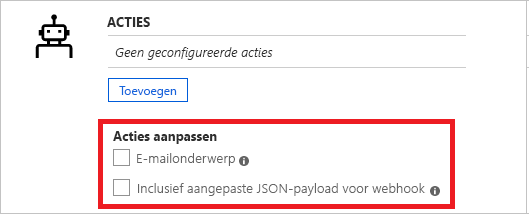
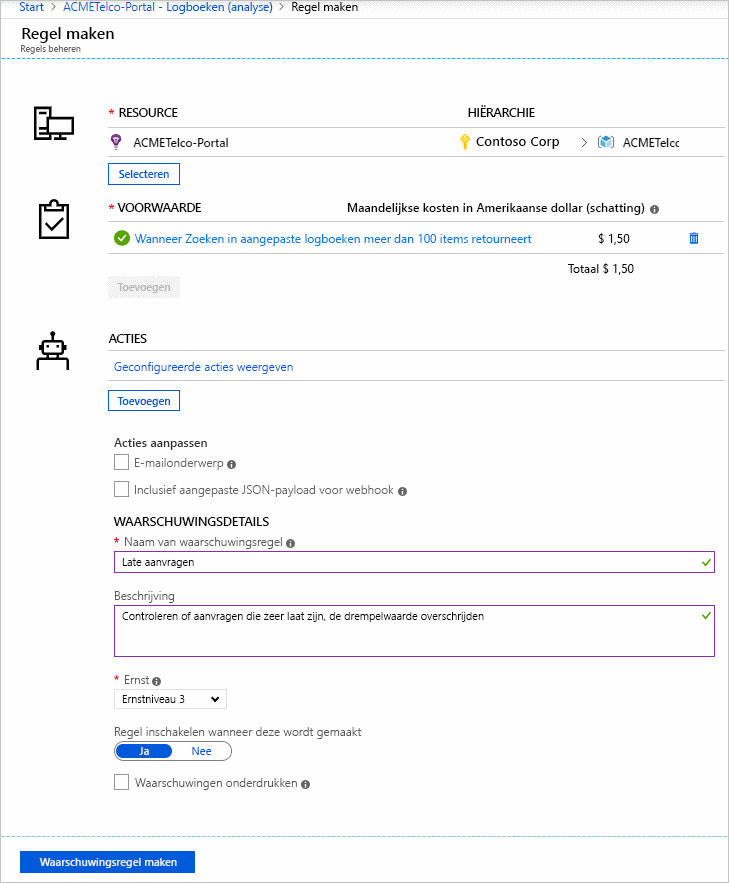
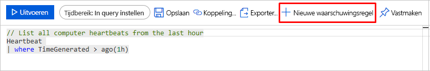

# <a name="create-view-and-manage-log-alerts-using-azure-monitor"></a>Logboekwaarschuwingen maken, weergeven en beheren met Azure Monitor

## <a name="overview"></a>Overzicht
In dit artikel ziet u hoe u logboekwaarschuwingen instelt met behulp van de waarschuwingsinterface in azure-portal. De definitie van een waarschuwingsregel bestaat uit drie delen:
- Doel: specifieke Azure-bron, die moet worden gecontroleerd
- Criteria: Specifieke voorwaarde of logica die, wanneer gezien in Signal, actie moet activeren
- Actie: Specifieke oproep verzonden naar een ontvanger van een melding - e-mail, SMS, webhook etc.

De term **Logboekwaarschuwingen** om waarschuwingen te beschrijven waarbij signaal een logboekquery is in een [loganalysewerkruimte](../learn/tutorial-viewdata.md) of [toepassingsstatistieken](../app/analytics.md). Meer informatie over functionaliteit, terminologie en typen vindt [u in Logboekwaarschuwingen - Overzicht](alerts-unified-log.md).

> [!NOTE]
> Populaire logboekgegevens uit [een Log Analytics-werkruimte](../../azure-monitor/learn/tutorial-viewdata.md) zijn nu ook beschikbaar op het metrische platform in Azure Monitor. Voor meer informatie, [metrische waarschuwing voor logboeken](alerts-metric-logs.md)

## <a name="managing-log-alerts-from-the-azure-portal"></a>Logboekwaarschuwingen beheren vanuit de Azure-portal

Gedetailleerde volgende is stapsgewijze handleiding voor het gebruik van logboekwaarschuwingen met behulp van de Azure-portalinterface.

### <a name="create-a-log-alert-rule-with-the-azure-portal"></a>Een logboekwaarschuwingsregel maken met de Azure-portal

1. Selecteer **in** de [portal](https://portal.azure.com/)Monitor en kies onder de monitorsectie - **kies Waarschuwingen**.

    

1. Selecteer de knop **Nieuwe waarschuwingsregel** om een nieuwe waarschuwing in Azure te maken.

    

1. De sectie Waarschuwing maken wordt weergegeven met de drie delen die bestaan uit: *Waarschuwingsvoorwaarde definiëren,* *Waarschuwingsdetails definiëren*en *Actiegroep definiëren*.

    

1. Definieer de waarschuwingsvoorwaarde met de koppeling **Resource selecteren** en geef het doel op door een resource te selecteren. Filter door het _abonnement_, _resourcetype_en vereiste _resource_te kiezen .

   > [!NOTE]
   > Voor het maken van een logboekwaarschuwing controleert u of het **logboeksignaal** beschikbaar is voor de geselecteerde bron voordat u verdergaat.
   >  

1. *Logboekwaarschuwingen:* Zorg ervoor dat **resourcetype** een analysebron is, zoals Log **resource** *Analytics* of *Application Insights* en signaaltype als **logboek,** en klik op *Gereed*. Gebruik vervolgens de knop **Criteria toevoegen** om de lijst met signaalopties weer te geven die beschikbaar zijn voor de resource en in de signaallijst **Aangepaste logboekzoekoptie** voor gekozen logboekmonitorservice zoals *Log Analytics* of *Application Insights*.

   

   > [!NOTE]
   > 
   > Waarschuwingslijsten kunnen analysequery importeren als signaaltype - **Logboek (opgeslagen query),** zoals te zien in bovenstaande afbeelding. Zo kunnen gebruikers uw query perfectioneren in Analytics en deze vervolgens opslaan voor toekomstig gebruik in waarschuwingen - meer details over het gebruik van query's die beschikbaar zijn bij [het gebruik van logboekquery in Azure Monitor](../log-query/log-query-overview.md) of gedeelde query in analyse van [toepassingsinzichten](../app/app-insights-overview.md).

1. *Logboekwaarschuwingen:* Als u bent geselecteerd, kan de query voor waarschuwingen worden vermeld in het veld **Query zoeken;** als de querysyntaxis onjuist is, wordt de fout in ROOD weergegeven. Als de syntaxis van de query juist is - Voor referentie worden historische gegevens van de opgegeven query weergegeven als een grafiek met optie om het tijdvenster van de afgelopen zes uur tot vorige week aan te passen.

    

   > [!NOTE]
   > 
   > Historische gegevensvisualisatie kan alleen worden weergegeven als de queryresultaten tijdsdetails bevatten. Als uw query resulteert in samengevatte gegevens of specifieke kolomwaarden, wordt hetzelfde weergegeven als een enkelvoudplot.
   > Voor het type metrische meting van logboekwaarschuwingen met toepassingsinzichten of [die is overgeschakeld naar een nieuwe API,](alerts-log-api-switch.md)u opgeven welke specifieke variabele de gegevens groepeert met de optie **Samenvoegen op;** zoals hieronder wordt geïllustreerd:
   > 
   > 

1. *Logboekwaarschuwingen:* Met de visualisatie op zijn plaats kan **waarschuwingslogica** worden geselecteerd uit de weergaveopties Voorwaarde, Aggregatie en ten slotte Drempelwaarde. Geef ten slotte in de logica de tijd op om te beoordelen op de opgegeven voorwaarde, met behulp van de optie **Periode.** Samen met hoe vaak Alert moet worden uitgevoerd door **Frequentie**te selecteren. **Logboekwaarschuwingen** kunnen worden gebaseerd op:
    - [Aantal records:](../../azure-monitor/platform/alerts-unified-log.md#number-of-results-alert-rules)er wordt een waarschuwing gemaakt als het aantal records dat door de query is geretourneerd groter is dan of kleiner is dan de opgegeven waarde.
    - [Metrische meting:](../../azure-monitor/platform/alerts-unified-log.md#metric-measurement-alert-rules)er wordt een waarschuwing gemaakt als elke *geaggregeerde waarde* in de resultaten de opgegeven drempelwaarde overschrijdt en deze wordt *gegroepeerd op* gekozen waarde. Het aantal inbreuken voor een waarschuwing is het aantal keren dat de drempelwaarde in de gekozen periode wordt overschreden. U totale inbreuken opgeven voor elke combinatie van inbreuken in de resultatenset of opeenvolgende inbreuken om te vereisen dat de inbreuken in opeenvolgende monsters moeten plaatsvinden.


1. Definieer als tweede stap een naam voor uw waarschuwing in het veld Naam van de **waarschuwingsregel** samen met een **beschrijving** met details voor de waarschuwing **en ernstwaarde** van de opgegeven opties. Deze gegevens worden hergebruikt in alle waarschuwingse-mails, meldingen of push die door Azure Monitor worden uitgevoerd. Bovendien kan de gebruiker ervoor kiezen om de waarschuwingsregel bij het maken onmiddellijk te activeren door de optie Inschakelen op de juiste manier te schakelen **bij het maken.**

    Alleen **voor logboekwaarschuwingen** is er extra functionaliteit beschikbaar in waarschuwingsdetails:

    - **Waarschuwingen onderdrukken:** Wanneer u onderdrukking inschakelt voor de waarschuwingsregel, worden acties voor de regel gedurende een bepaalde tijd uitgeschakeld nadat u een nieuwe waarschuwing hebt gemaakt. De regel wordt nog steeds uitgevoerd en maakt waarschuwingsrecords op voorwaarde dat aan de criteria wordt voldaan. Hiermee hebt u de tijd om het probleem te verhelpen zonder dubbele acties uit te voeren.

        

        > [!TIP]
        > Geef een suppress alert-waarde op die groter is dan de frequentie van de waarschuwing om ervoor te zorgen dat meldingen worden gestopt zonder overlapping

1. Geef als derde en laatste stap op of een **actiegroep** moet worden geactiveerd voor de waarschuwingsregel wanneer aan de waarschuwingsvoorwaarde is voldaan. U een bestaande actiegroep met waarschuwing kiezen of een nieuwe actiegroep maken. Volgens de geselecteerde actiegroep zal Azure, wanneer de waarschuwing wordt geactiveerd: e-mail(s) verzenden, SMS(s verzenden), Webhook(s bellen), remedialeren met Azure Runbooks, pushen naar uw ITSM-tool, enz. Meer informatie over [actiegroepen](action-groups.md).

    > [!NOTE]
    > Raadpleeg de [azure-abonnementsservicelimieten](../../azure-resource-manager/management/azure-subscription-service-limits.md) voor limieten voor Runbook-payloads die worden geactiveerd voor logboekwaarschuwingen via Azure-actiegroepen

    Voor **Logboekwaarschuwingen** is een extra functionaliteit beschikbaar om de standaardacties te overschrijven:

    - **E-mailmelding**: Overschrijft *e-mailonderwerp* in de e-mail, verzonden via actiegroep; als er een of meer e-mailacties bestaan in de genoemde actiegroep. U de hoofdtekst van de e-mail niet wijzigen en dit veld is **niet** voor e-mailadres.
    - **Aangepaste Json-payload opnemen:** overschrijft de webhook JSON die door actiegroepen wordt gebruikt; als er een of meer webhook-acties bestaan in de genoemde actiegroep. De gebruiker kan de indeling van JSON opgeven die moet worden gebruikt voor alle webhooks die zijn geconfigureerd in de bijbehorende actiegroep; Zie [webhook-actie voor Logboekwaarschuwingen voor](../../azure-monitor/platform/alerts-log-webhook.md)meer informatie over webhook-indelingen. De optie Webhook weergeven is beschikbaar om de indeling te controleren met behulp van voorbeeld-JSON-gegevens.

        


1. Als alle velden geldig zijn en met groene vinkje kan op de knop **Waarschuwingsregel maken** worden geklikt en wordt er een waarschuwing gemaakt in Azure Monitor - Waarschuwingen. Alle waarschuwingen kunnen worden bekeken via het dashboard voor waarschuwingen.

     

     Binnen een paar minuten is de waarschuwing actief en wordt geactiveerd zoals eerder beschreven.

Gebruikers kunnen ook hun analysequery in [log-analyses](../log-query/portals.md) afronden en vervolgens indrukken om een waarschuwing te maken via de knop 'Waarschuwing instellen' - en vervolgens instructies volgen vanaf stap 6 in de bovenstaande zelfstudie.

 

### <a name="view--manage-log-alerts-in-azure-portal"></a>Logboekwaarschuwingen in Azure-portal weergeven & beheren

1. Selecteer **in** de [portal](https://portal.azure.com/)Monitor en kies onder de monitorsectie - **kies Waarschuwingen**.

1. Het **waarschuwingsdashboard** wordt weergegeven - waarin alle Azure Alerts (inclusief logboekwaarschuwingen) worden weergegeven in een enkelvoudig bord; inclusief elk exemplaar van wanneer uw log alert regel heeft afgevuurd. Zie [Waarschuwingsbeheer](https://aka.ms/managealertinstances)voor meer informatie.
    > [!NOTE]
    > Log waarschuwingsregels bestaan uit aangepaste query-gebaseerde logica die door gebruikers en dus zonder een opgeloste status. Op grond waarvan elke keer dat aan de voorwaarden in de logalertregel wordt voldaan, wordt deze geactiveerd.

1. Selecteer de knop **Regels beheren** op de bovenste balk om naar de sectie regelbeheer te navigeren - waar alle waarschuwingsregels worden weergegeven; inclusief waarschuwingen die zijn uitgeschakeld.
    

## <a name="managing-log-alerts-using-azure-resource-template"></a>Logboekwaarschuwingen beheren met Azure Resource Template

Logboekwaarschuwingen in Azure Monitor `Microsoft.Insights/scheduledQueryRules/`zijn gekoppeld aan resourcetype . Zie [API-verwijzing voor geplande queryregels](https://docs.microsoft.com/rest/api/monitor/scheduledqueryrules/)voor meer informatie over dit brontype. Logboekwaarschuwingen voor Application Insights of Log Analytics kunnen worden gemaakt met behulp van [De API voor geplande queryregels](https://docs.microsoft.com/rest/api/monitor/scheduledqueryrules/).

> [!NOTE]
> Logboekwaarschuwingen voor Log Analytics kunnen ook worden beheerd met behulp van de verouderde [Log Analytics Alert API](api-alerts.md) en verouderde sjablonen van door Log Analytics opgeslagen [zoekopdrachten en waarschuwingen.](../insights/solutions-resources-searches-alerts.md) Zie [Overschakelen naar de nieuwe API voor logboekanalysewaarschuwingen voor](alerts-log-api-switch.md)meer informatie over het gebruik van de nieuwe Api voor ScheduledQueryRules die hier standaard wordt beschreven.


### <a name="sample-log-alert-creation-using-azure-resource-template"></a>Voorbeeldlogboekwaarschuwing maken met Azure Resource Template

Het volgende is de structuur voor [Het maken van geplande queryregels](https://docs.microsoft.com/rest/api/monitor/scheduledqueryrules/createorupdate) op basis van resourcesjabloon met behulp van standaardquery van het [logboekvan het type logboekwaarschuwing](alerts-unified-log.md#number-of-results-alert-rules)van het type resultaten, waarbij de voorbeeldgegevensset als variabelen zijn ingesteld.

```json
{
    "$schema": "https://schema.management.azure.com/schemas/2015-01-01/deploymentTemplate.json#",
    "contentVersion": "1.0.0.0",
    "parameters": {
    },
    "variables": {
        "alertLocation": "southcentralus",
        "alertName": "samplelogalert",
        "alertDescription": "Sample log search alert",
        "alertStatus": "true",
        "alertSource":{
            "Query":"requests",
            "SourceId": "/subscriptions/a123d7efg-123c-1234-5678-a12bc3defgh4/resourceGroups/myRG/providers/microsoft.insights/components/sampleAIapplication",
            "Type":"ResultCount"
        },
        "alertSchedule":{
            "Frequency": 15,
            "Time": 60
        },
        "alertActions":{
            "SeverityLevel": "4"
        },
        "alertTrigger":{
            "Operator":"GreaterThan",
            "Threshold":"1"
        },
        "actionGrp":{
            "ActionGroup": "/subscriptions/a123d7efg-123c-1234-5678-a12bc3defgh4/resourceGroups/myRG/providers/microsoft.insights/actiongroups/sampleAG",
            "Subject": "Customized Email Header",
            "Webhook": "{ \"alertname\":\"#alertrulename\", \"IncludeSearchResults\":true }"
        }
    },
    "resources":[ {
        "name":"[variables('alertName')]",
        "type":"Microsoft.Insights/scheduledQueryRules",
        "apiVersion": "2018-04-16",
        "location": "[variables('alertLocation')]",
        "properties":{
            "description": "[variables('alertDescription')]",
            "enabled": "[variables('alertStatus')]",
            "source": {
                "query": "[variables('alertSource').Query]",
                "dataSourceId": "[variables('alertSource').SourceId]",
                "queryType":"[variables('alertSource').Type]"
            },
            "schedule":{
                "frequencyInMinutes": "[variables('alertSchedule').Frequency]",
                "timeWindowInMinutes": "[variables('alertSchedule').Time]"
            },
            "action":{
                "odata.type": "Microsoft.WindowsAzure.Management.Monitoring.Alerts.Models.Microsoft.AppInsights.Nexus.DataContracts.Resources.ScheduledQueryRules.AlertingAction",
                "severity":"[variables('alertActions').SeverityLevel]",
                "aznsAction":{
                    "actionGroup":"[array(variables('actionGrp').ActionGroup)]",
                    "emailSubject":"[variables('actionGrp').Subject]",
                    "customWebhookPayload":"[variables('actionGrp').Webhook]"
                },
                "trigger":{
                    "thresholdOperator":"[variables('alertTrigger').Operator]",
                    "threshold":"[variables('alertTrigger').Threshold]"
                }
            }
        }
    } ]
}

```

Het voorbeeld json hierboven kan worden opgeslagen als (laten we zeggen) voorbeeldScheduledQueryRule.json voor het doel van deze wandeling door en kan worden geïmplementeerd met Azure [Resource Manager in Azure portal](../../azure-resource-manager/templates/deploy-portal.md#deploy-resources-from-custom-template).


### <a name="log-alert-with-cross-resource-query-using-azure-resource-template"></a>Logboekwaarschuwing met query met cross-resource met Azure Resource Template

Het volgende is de structuur voor [Het maken van geplande queryregels](https://docs.microsoft.com/rest/api/monitor/scheduledqueryrules/createorupdate) op basis van resourcesjabloon met behulp van de zoekquery met [kruisresourceslogboek](../../azure-monitor/log-query/cross-workspace-query.md) van de waarschuwing voor [het metrische meettype](../../azure-monitor/platform/alerts-unified-log.md#metric-measurement-alert-rules), waarbij de voorbeeldgegevensset als variabelen zijn ingesteld.

```json

{
    "$schema": "https://schema.management.azure.com/schemas/2015-01-01/deploymentTemplate.json#",
    "contentVersion": "1.0.0.0",
    "parameters": {
    },
    "variables": {
        "alertLocation": "Region Name for your Application Insights App or Log Analytics Workspace",
        "alertName": "sample log alert",
        "alertDescr": "Sample log search alert",
        "alertStatus": "true",
        "alertSource":{
            "Query":"union workspace(\"servicews\").Update, app('serviceapp').requests | summarize AggregatedValue = count() by bin(TimeGenerated,1h), Classification",
            "Resource1": "/subscriptions/a123d7efg-123c-1234-5678-a12bc3defgh4/resourceGroups/contosoRG/providers/microsoft.OperationalInsights/workspaces/servicews",
            "Resource2": "/subscriptions/a123d7efg-123c-1234-5678-a12bc3defgh4/resourceGroups/contosoRG/providers/microsoft.insights/components/serviceapp",
            "SourceId": "/subscriptions/a123d7efg-123c-1234-5678-a12bc3defgh4/resourceGroups/contosoRG/providers/microsoft.OperationalInsights/workspaces/servicews",
            "Type":"ResultCount"
        },
        "alertSchedule":{
            "Frequency": 15,
            "Time": 60
        },
        "alertActions":{
            "SeverityLevel": "4",
            "SuppressTimeinMin": 20
        },
        "alertTrigger":{
            "Operator":"GreaterThan",
            "Threshold":"1"
        },
        "metricMeasurement": {
            "thresholdOperator": "Equal",
            "threshold": "1",
            "metricTriggerType": "Consecutive",
            "metricColumn": "Classification"
        },
        "actionGrp":{
            "ActionGroup": "/subscriptions/a123d7efg-123c-1234-5678-a12bc3defgh4/resourceGroups/contosoRG/providers/microsoft.insights/actiongroups/sampleAG",
            "Subject": "Customized Email Header",
            "Webhook": "{ \"alertname\":\"#alertrulename\", \"IncludeSearchResults\":true }"
        }
    },
    "resources":[ {
        "name":"[variables('alertName')]",
        "type":"Microsoft.Insights/scheduledQueryRules",
        "apiVersion": "2018-04-16",
        "location": "[variables('alertLocation')]",
        "properties":{
            "description": "[variables('alertDescr')]",
            "enabled": "[variables('alertStatus')]",
            "source": {
                "query": "[variables('alertSource').Query]",
                "authorizedResources": "[concat(array(variables('alertSource').Resource1), array(variables('alertSource').Resource2))]",
                "dataSourceId": "[variables('alertSource').SourceId]",
                "queryType":"[variables('alertSource').Type]"
            },
            "schedule":{
                "frequencyInMinutes": "[variables('alertSchedule').Frequency]",
                "timeWindowInMinutes": "[variables('alertSchedule').Time]"
            },
            "action":{
                "odata.type": "Microsoft.WindowsAzure.Management.Monitoring.Alerts.Models.Microsoft.AppInsights.Nexus.DataContracts.Resources.ScheduledQueryRules.AlertingAction",
                "severity":"[variables('alertActions').SeverityLevel]",
                "throttlingInMin": "[variables('alertActions').SuppressTimeinMin]",
                "aznsAction":{
                    "actionGroup": "[array(variables('actionGrp').ActionGroup)]",
                    "emailSubject":"[variables('actionGrp').Subject]",
                    "customWebhookPayload":"[variables('actionGrp').Webhook]"
                },
                "trigger":{
                    "thresholdOperator":"[variables('alertTrigger').Operator]",
                    "threshold":"[variables('alertTrigger').Threshold]",
                    "metricTrigger":{
                        "thresholdOperator": "[variables('metricMeasurement').thresholdOperator]",
                        "threshold": "[variables('metricMeasurement').threshold]",
                        "metricColumn": "[variables('metricMeasurement').metricColumn]",
                        "metricTriggerType": "[variables('metricMeasurement').metricTriggerType]"
                    }
                }
            }
        }
    } ]
}

```

> [!IMPORTANT]
> Bij het gebruik van waarschuwing voor cross-resource query's in log, is het gebruik van [geautoriseerde Resources](https://docs.microsoft.com/rest/api/monitor/scheduledqueryrules/createorupdate#source) verplicht en moet de gebruiker toegang hebben tot de lijst met resources die zijn vermeld

Het voorbeeld json hierboven kan worden opgeslagen als (laten we zeggen) voorbeeldScheduledQueryRule.json voor het doel van deze wandeling door en kan worden geïmplementeerd met Azure [Resource Manager in Azure portal](../../azure-resource-manager/templates/deploy-portal.md#deploy-resources-from-custom-template).

## <a name="managing-log-alerts-using-powershell"></a>Logboekwaarschuwingen beheren met PowerShell

[!INCLUDE [updated-for-az](../../../includes/updated-for-az.md)]

Azure Monitor - [Api voor geplande queryregels](https://docs.microsoft.com/rest/api/monitor/scheduledqueryrules/) is een REST-API en volledig compatibel met Azure Resource Manager REST API. En PowerShell-cmdlets die hieronder worden vermeld, zijn beschikbaar om gebruik te maken van de [API voor geplande queryregels.](https://docs.microsoft.com/rest/api/monitor/scheduledqueryrules/)

1. [Nieuw-AzScheduledQueryRule:](https://docs.microsoft.com/powershell/module/az.monitor/new-azscheduledqueryrule) Powershell-cmdlet om een nieuwe logboekwaarschuwingsregel te maken.
1. [Set-AzScheduledQueryRule:](https://docs.microsoft.com/powershell/module/az.monitor/set-azscheduledqueryrule) Powershell-cmdlet om een bestaande logboekwaarschuwingsregel bij te werken.
1. [Nieuw-AzScheduledQueryRuleSource:](https://docs.microsoft.com/powershell/module/az.monitor/new-azscheduledqueryrulesource) Powershell-cmdlet om object te maken of bij te werken waarin bronparameters voor een logboekwaarschuwing worden opgegeven. Wordt gebruikt als invoer door de cmdlet [Nieuw-AzScheduledQueryRule](https://docs.microsoft.com/powershell/module/az.monitor/new-azscheduledqueryrule) en [Set-AzScheduledQueryRule.](https://docs.microsoft.com/powershell/module/az.monitor/set-azscheduledqueryrule)
1. [Nieuw-AzScheduledQueryRuleSchedule](https://docs.microsoft.com/powershell/module/az.monitor/New-AzScheduledQueryRuleSchedule): Powershell-cmdlet om object te maken of bij te werken waarin planningsparameters voor een logboekwaarschuwing worden opgegeven. Wordt gebruikt als invoer door de cmdlet [Nieuw-AzScheduledQueryRule](https://docs.microsoft.com/powershell/module/az.monitor/new-azscheduledqueryrule) en [Set-AzScheduledQueryRule.](https://docs.microsoft.com/powershell/module/az.monitor/set-azscheduledqueryrule)
1. [Nieuw-AzScheduledQueryRuleAlertingAction](https://docs.microsoft.com/powershell/module/az.monitor/New-AzScheduledQueryRuleAlertingAction) : Powershell-cmdlet om object te maken of bij te werken waarin actieparameters voor een logboekwaarschuwing worden opgegeven. Wordt gebruikt als invoer door de cmdlet [Nieuw-AzScheduledQueryRule](https://docs.microsoft.com/powershell/module/az.monitor/new-azscheduledqueryrule) en [Set-AzScheduledQueryRule.](https://docs.microsoft.com/powershell/module/az.monitor/set-azscheduledqueryrule)
1. [Nieuw-AzScheduledQueryRuleAznsActionGroup](https://docs.microsoft.com/powershell/module/az.monitor/new-azscheduledqueryruleaznsactiongroup) : Powershell-cmdlet om object te maken of bij te werken waarin actiegroepenparameters voor een logboekwaarschuwing worden opgegeven. Gebruikt als invoer door de cmdlet [Nieuw-AzScheduledQueryAlertingAction.](https://docs.microsoft.com/powershell/module/az.monitor/New-AzScheduledQueryRuleAlertingAction)
1. [Nieuw-AzScheduledQueryRuleTriggerCondition:](https://docs.microsoft.com/powershell/module/az.monitor/new-azscheduledqueryruletriggercondition) Powershell-cmdlet om object te maken of bij te werken waarin triggerconditieparameters voor logboekwaarschuwing worden opgegeven. Gebruikt als invoer door de cmdlet [Nieuw-AzScheduledQueryAlertingAction.](https://docs.microsoft.com/powershell/module/az.monitor/New-AzScheduledQueryRuleAlertingAction)
1. [Nieuw-AzScheduledQueryRuleLogMetricTrigger:](https://docs.microsoft.com/powershell/module/az.monitor/new-azscheduledqueryrulelogmetrictrigger) Powershell-cmdlet om object te maken of bij te werken met metrische triggerconditieparameters voor [waarschuwing voor het metrische meettype .](../../azure-monitor/platform/alerts-unified-log.md#metric-measurement-alert-rules) Gebruikt als input door de cmdlet [Nieuw-AzScheduledQueryRuleTriggerCondition.](https://docs.microsoft.com/powershell/module/az.monitor/new-azscheduledqueryruletriggercondition)
1. [Get-AzScheduledQueryRule:](https://docs.microsoft.com/powershell/module/az.monitor/get-azscheduledqueryrule) Powershell-cmdlet om bestaande logboekwaarschuwingsregels of een specifieke logboekwaarschuwingsregel weer te geven
1. [Update-AzScheduledQueryRule](https://docs.microsoft.com/powershell/module/az.monitor/update-azscheduledqueryrule) : Powershell-cmdlet om logboekwaarschuwingsregel in- of uit te schakelen
1. [Remove-AzScheduledQueryRule](https://docs.microsoft.com/powershell/module/az.monitor/remove-azscheduledqueryrule): Powershell-cmdlet om een bestaande logboekwaarschuwingsregel te verwijderen

> [!NOTE]
> ScheduledQueryRules PowerShell-cmdlets kunnen alleen regels beheren die zelf zijn gemaakt of azure-monitor - [API voor geplande queryregels .](https://docs.microsoft.com/rest/api/monitor/scheduledqueryrules/) Log alert regels gemaakt met behulp van legacy [Log Analytics Alert API](api-alerts.md) en legacy templates van Log Analytics opgeslagen [zoekopdrachten en waarschuwingen](../insights/solutions-resources-searches-alerts.md) kunnen worden beheerd met behulp van ScheduledQueryRules PowerShell cmdlets alleen na user [switches API voorkeur voor Log Analytics Alerts](alerts-log-api-switch.md).

Vervolgens worden de stappen voor het maken van een waarschuwingsregel voor voorbeeldlogboeken geïllustreerd met de powershell-cmdlets van scheduledQueryRules.
```powershell
$source = New-AzScheduledQueryRuleSource -Query 'Heartbeat | summarize AggregatedValue = count() by bin(TimeGenerated, 5m), _ResourceId' -DataSourceId "/subscriptions/a123d7efg-123c-1234-5678-a12bc3defgh4/resourceGroups/contosoRG/providers/microsoft.OperationalInsights/workspaces/servicews"

$schedule = New-AzScheduledQueryRuleSchedule -FrequencyInMinutes 15 -TimeWindowInMinutes 30

$metricTrigger = New-AzScheduledQueryRuleLogMetricTrigger -ThresholdOperator "GreaterThan" -Threshold 2 -MetricTriggerType "Consecutive" -MetricColumn "_ResourceId"

$triggerCondition = New-AzScheduledQueryRuleTriggerCondition -ThresholdOperator "LessThan" -Threshold 5 -MetricTrigger $metricTrigger

$aznsActionGroup = New-AzScheduledQueryRuleAznsActionGroup -ActionGroup "/subscriptions/a123d7efg-123c-1234-5678-a12bc3defgh4/resourceGroups/contosoRG/providers/microsoft.insights/actiongroups/sampleAG" -EmailSubject "Custom email subject" -CustomWebhookPayload "{ `"alert`":`"#alertrulename`", `"IncludeSearchResults`":true }"

$alertingAction = New-AzScheduledQueryRuleAlertingAction -AznsAction $aznsActionGroup -Severity "3" -Trigger $triggerCondition

New-AzScheduledQueryRule -ResourceGroupName "contosoRG" -Location "Region Name for your Application Insights App or Log Analytics Workspace" -Action $alertingAction -Enabled $true -Description "Alert description" -Schedule $schedule -Source $source -Name "Alert Name"
```

## <a name="managing-log-alerts-using-cli-or-api"></a>Logboekwaarschuwingen beheren met CLI of API

Azure Monitor - [Api voor geplande queryregels](https://docs.microsoft.com/rest/api/monitor/scheduledqueryrules/) is een REST-API en volledig compatibel met Azure Resource Manager REST API. Daarom kan het worden gebruikt via Powershell met behulp van Resource Manager-opdrachten voor Azure CLI.


> [!NOTE]
> Logboekwaarschuwingen voor Log Analytics kunnen ook worden beheerd met behulp van de verouderde [Log Analytics Alert API](api-alerts.md) en verouderde sjablonen van door Log Analytics opgeslagen [zoekopdrachten en waarschuwingen.](../insights/solutions-resources-searches-alerts.md) Zie [Overschakelen naar de nieuwe API voor logboekanalysewaarschuwingen voor](alerts-log-api-switch.md)meer informatie over het gebruik van de nieuwe Api voor ScheduledQueryRules die hier standaard wordt beschreven.

Logwaarschuwingen hebben momenteel geen speciale CLI-opdrachten. maar zoals hieronder geïllustreerd kan worden gebruikt via de opdracht CLI van Azure Resource Manager voor voorbeeldresourcesjabloon die eerder wordt weergegeven (voorbeeldScheduledQueryRule.json) in de sectie Resourcesjabloon:

```azurecli
az group deployment create --resource-group contosoRG --template-file sampleScheduledQueryRule.json
```

Bij een succesvolle bewerking wordt 201 geretourneerd om de nieuwe waarschuwingsregel te maken of 200 worden geretourneerd als een bestaande waarschuwingsregel is gewijzigd.

## <a name="next-steps"></a>Volgende stappen

* Meer informatie over [logboekwaarschuwingen in Azure-waarschuwingen](../../azure-monitor/platform/alerts-unified-log.md)
* [Webhook-acties begrijpen voor logboekwaarschuwingen](../../azure-monitor/platform/alerts-log-webhook.md)
* Meer informatie over [toepassingsinzichten](../../azure-monitor/app/analytics.md)
* Meer informatie over [logboekquery's](../log-query/log-query-overview.md).
