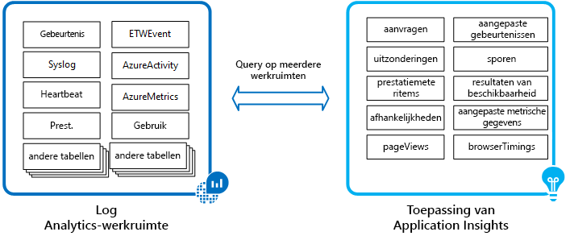
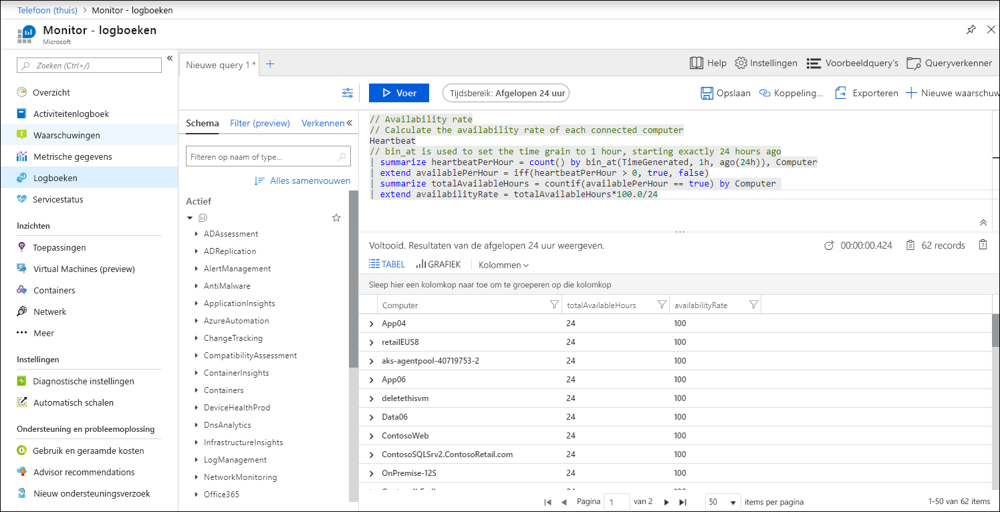
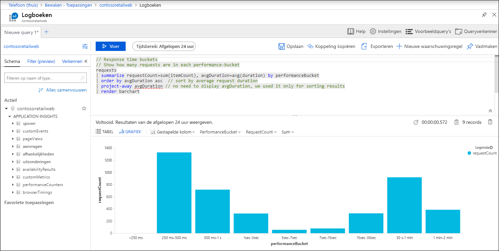

# Logboeken in Azure Monitor

> [!NOTE]
> Alle gegevens die door Azure Monitor worden verzameld, passen in een van de twee fundamentele typen, Metrics en Logs. In dit artikel worden logboeken beschreven. Raadpleeg [Metrische gegevens in Azure Monitor](data-platform-metrics.md) voor een gedetailleerde beschrijving van statistieken en naar [Monitoringgegevens die door Azure Monitor zijn verzameld](data-platform.md) voor een vergelijking van de twee.

Logboeken in Azure Monitor zijn vooral handig voor het uitvoeren van complexe analyses over gegevens uit verschillende bronnen. In dit artikel wordt beschreven hoe logboeken zijn gestructureerd in Azure Monitor, wat u met de gegevens doen en worden verschillende gegevensbronnen geïdentificeerd die gegevens opslaan in logboeken.

> [!NOTE]
> Het is belangrijk om onderscheid te maken tussen Azure Monitor Logs en bronnen van loggegevens in Azure. Gebeurtenissen op abonnementsniveau in Azure worden bijvoorbeeld geschreven naar een [activiteitenlogboek](platform-logs-overview.md) dat u weergeven in het menu Azure Monitor. De meeste bronnen schrijven operationele informatie naar een [resourcelogboek](platform-logs-overview.md) dat u naar verschillende locaties doorsturen. Azure Monitor Logs is een logboekgegevensplatform dat activiteitslogboeken en bronlogboeken verzamelt, samen met andere monitoringgegevens om diepgaande analyses te bieden over uw hele set resources.

## Wat zijn Azure Monitor Logs?

Logboeken in Azure Monitor bevatten verschillende soorten gegevens die zijn ingedeeld in records met verschillende sets eigenschappen voor elk type. Logboeken kunnen numerieke waarden bevatten, zoals Azure Monitor Metrics, maar bevatten meestal tekstgegevens met gedetailleerde beschrijvingen. Ze verschillen verder van metrische gegevens in die tijd dat ze variëren in hun structuur en vaak niet op regelmatige tijdstippen worden verzameld. Telemetrie zoals gebeurtenissen en traceringen worden naast prestatiegegevens opgeslagen in Azure Monitor Logs, zodat deze allemaal kunnen worden gecombineerd voor analyse.

Een veelvoorkomend type logboekvermelding is een gebeurtenis, die sporadisch wordt verzameld. Gebeurtenissen worden gemaakt door een toepassing of service en bevatten doorgaans voldoende informatie om zelf volledige context te bieden. Een gebeurtenis kan bijvoorbeeld aangeven dat een bepaalde resource is gemaakt of gewijzigd, een nieuwe host is gestart als reactie op meer verkeer of dat er een fout is gedetecteerd in een toepassing.

 Omdat de indeling van de gegevens kan variëren, kunnen toepassingen aangepaste logboeken maken met behulp van de structuur die ze nodig hebben. Metrische gegevens kunnen zelfs worden opgeslagen in logboeken om ze te combineren met andere monitoringgegevens voor trending en andere gegevensanalyse.

## Wat u doen met Azure Monitor Logs?
In de volgende tabel worden de verschillende manieren weergegeven waarop u Logboeken in Azure Monitor gebruiken.

|  |  |
|:---|:---|
| Analyseren | Gebruik [Log Analytics](../log-query/get-started-portal.md) in de Azure-portal om [logboekquery's](../log-query/log-query-overview.md) te schrijven en loggegevens interactief te analyseren met behulp van de krachtige Data Explorer-analyseengine. Gebruik de [analytics-console Application Insights](../app/analytics.md) in de Azure-portal om logboekquery's te schrijven en loggegevens op interactieve wijze te analyseren vanuit Application Insights. |
| Visualiseren | Queryresultaten vastmaken die worden weergegeven als tabellen of grafieken aan een [Azure-dashboard](../../azure-portal/azure-portal-dashboards.md). Maak een [werkmap](../app/usage-workbooks.md) om te combineren met meerdere sets gegevens in een interactief rapport.  Exporteer de resultaten van een query naar [Power BI](powerbi.md) om verschillende visualisaties te gebruiken en te delen met gebruikers buiten Azure. Exporteer de resultaten van een query naar [Grafana](grafana-plugin.md) om gebruik te maken van de dashboarding en te combineren met andere gegevensbronnen.|
| Waarschuwing | Configureer een [logboekwaarschuwingsregel](alerts-log.md) die een melding verzendt of [automatische actie](action-groups.md) onderneemt wanneer de resultaten van de query overeenkomen met een bepaald resultaat. Configureer een [metrische waarschuwingsregel](alerts-metric-logs.md) voor bepaalde logboekgegevenslogboeken die als metrische gegevens zijn geëxtraheerd. |
| Ophalen | Toegang tot logboekqueryresultaten van een opdrachtregel met [Azure CLI](/cli/azure/ext/log-analytics/monitor/log-analytics). Toegang tot logboekqueryresultaten van een opdrachtregel met [PowerShell-cmdlets](https://docs.microsoft.com/powershell/module/az.operationalinsights). Toegang tot logboekqueryresultaten van een aangepaste toepassing met [restapi](https://dev.loganalytics.io/). |
| Exporteren | Bouw een werkstroom om logboekgegevens op te halen en te kopiëren naar een externe locatie met behulp van [Logic Apps](~/articles/logic-apps/index.yml). |

## Hoe worden gegevens in Azure Monitor Logs gestructureerd?
Gegevens die worden verzameld door Azure Monitor Logs worden opgeslagen in een [log analytics-werkruimte.](../platform/design-logs-deployment.md) Elke werkruimte bevat meerdere tabellen die elke gegevens uit een bepaalde bron opslaan. Terwijl alle tabellen [een aantal gemeenschappelijke eigenschappen](log-standard-properties.md)delen, heeft elk een unieke set eigenschappen, afhankelijk van het soort gegevens dat het opslaat. Een nieuwe werkruimte heeft standaardtabellen en er worden meer tabellen toegevoegd door verschillende bewakingsoplossingen en andere services die naar de werkruimte schrijven.

Loggegevens van Application Insights gebruiken dezelfde Log Analytics-engine als werkruimten, maar worden afzonderlijk opgeslagen voor elke bewaakte toepassing. Elke toepassing heeft een standaardset tabellen om gegevens zoals toepassingsaanvragen, uitzonderingen en paginaweergaven te bewaren.

Logquery's gebruiken gegevens uit een log analytics-werkruimte of een Application Insights-toepassing. U een [query met meerdere bronnen](../log-query/cross-workspace-query.md) gebruiken om toepassingsgegevens samen met andere logboekgegevens te analyseren of query's te maken, waaronder meerdere werkruimten of toepassingen.

## Logboekquery's
Gegevens in Azure Monitor-logboeken worden opgehaald met behulp van een [logboekquery](../log-query/log-query-overview.md) die is geschreven met de [Kusto-querytaal,](../log-query/get-started-queries.md)waarmee u snel verzamelde gegevens ophalen, consolideren en analyseren. Gebruik [Log Analytics](../log-query/portals.md) om logboekquery's te schrijven en te testen in de Azure-portal. Hiermee u interactief met resultaten werken of deze vastmaken aan een dashboard om ze te bekijken met andere visualisaties.

Open [Log Analytics vanuit Application Insights](../app/analytics.md) om application insights-gegevens te analyseren.

U ook logboekgegevens ophalen met behulp van de [Api Log Analytics](https://dev.loganalytics.io/documentation/overview) en de Application Insights REST [API.](https://dev.applicationinsights.io/documentation/overview)

## Bronnen van Azure-monitorlogboeken
Azure Monitor kan logboekgegevens verzamelen uit verschillende bronnen, zowel binnen Azure als van on-premises bronnen. In de volgende tabellen worden de verschillende gegevensbronnen weergegeven die beschikbaar zijn uit verschillende bronnen die gegevens naar Azure Monitor-logboeken schrijven. Elk heeft een link naar details over elke vereiste configuratie.

### Azure-tenant en -abonnement

| Gegevens | Beschrijving |
|:---|:---|
| Azure Active Directory-controlelogboeken | Geconfigureerd via diagnostische instellingen voor elke map. Zie [Azure AD-logboeken integreren met Azure Monitor-logboeken](../../active-directory/reports-monitoring/howto-integrate-activity-logs-with-log-analytics.md).  |
| Activiteitenlogboeken | Afzonderlijk standaard opgeslagen en kan worden gebruikt voor near real-time waarschuwingen. Installeer activity log Analytics-oplossing om te schrijven naar de werkruimte Log Analytics. Zie [Azure-activiteitslogboeken verzamelen en analyseren in Logboekanalyse](activity-log-collect.md). |

### Azure-resources

| Gegevens | Beschrijving |
|:---|:---|
| Resourcediagnostiek | Diagnostische instellingen configureren om te schrijven naar diagnostische gegevens, inclusief statistieken naar een Log Analytics-werkruimte. Zie [Azure-bronlogboeken streamen naar Logboekanalyse](resource-logs-collect-workspace.md). |
| Bewakingsoplossingen | Monitoringoplossingen schrijven gegevens die ze verzamelen naar hun Log Analytics-werkruimte. Zie [Gegevensverzamelingsgegevens voor beheeroplossingen in Azure](../insights/solutions-inventory.md) voor een lijst met oplossingen. Zie [Bewakingsoplossingen in Azure Monitor](../insights/solutions.md) voor meer informatie over het installeren en gebruiken van oplossingen. |
| Metrische gegevens | Stuur platformstatistieken voor Azure Monitor-resources naar een Log Analytics-werkruimte om logboekgegevens voor langere perioden te bewaren en complexe analyses uit te voeren met andere gegevenstypen met behulp van de [Kusto-querytaal](/azure/kusto/query/). Zie [Azure-bronlogboeken streamen naar Logboekanalyse](resource-logs-collect-storage.md). |
| Azure-tabelopslag | Verzamel gegevens uit Azure-opslag waar sommige Azure-resources bewakingsgegevens schrijven. Zie [Azure blob-opslag gebruiken voor IIS en Azure-tabelopslag voor gebeurtenissen met Logboekanalyse](diagnostics-extension-logs.md). |

### Virtuele machines

| Gegevens | Beschrijving |
|:---|:---|
|  Agent-gegevensbronnen | Gegevensbronnen die zijn verzameld bij [Windows-](agent-windows.md) en [Linux-agents](../learn/quick-collect-linux-computer.md) bevatten gebeurtenissen, prestatiegegevens en aangepaste logboeken. Zie [Agent-gegevensbronnen in Azure Monitor](data-sources.md) voor een lijst met gegevensbronnen en details over de configuratie. |
| Bewakingsoplossingen | Monitoringoplossingen schrijven gegevens die ze verzamelen van agents naar hun Log Analytics-werkruimte. Zie [Gegevensverzamelingsgegevens voor beheeroplossingen in Azure](../insights/solutions-inventory.md) voor een lijst met oplossingen. Zie [Bewakingsoplossingen in Azure Monitor](../insights/solutions.md) voor meer informatie over het installeren en gebruiken van oplossingen. |
| System Center Operations Manager | Sluit de beheergroep Operations Manager aan op Azure Monitor om gebeurtenis- en prestatiegegevens van on-premises agents te verzamelen in logboeken. Zie [Operations Manager verbinden met Logboekanalyse](om-agents.md) voor meer informatie over deze configuratie. |

### Toepassingen

| Gegevens | Beschrijving |
|:---|:---|
| Verzoeken en uitzonderingen | Gedetailleerde gegevens over toepassingsaanvragen en uitzonderingen vindt u in de _tabellen Aanvragen,_ _PageViews_en _Exceptions._ Oproepen naar [externe componenten](../app/asp-net-dependencies.md) bevinden zich in de _afhankelijkheidstabel._ |
| Gebruik en prestaties | Prestaties voor de toepassing zijn beschikbaar in de _tabellen requests,_ _browserTimings_ en _performanceCounters._ Gegevens voor [aangepaste statistieken](../app/api-custom-events-metrics.md#trackevent) staan in de tabel _customMetrics._|
| Gegevens traceren | De resultaten van [gedistribueerde tracering](../app/distributed-tracing.md) worden opgeslagen in de _tracestabel._ |
| Beschikbaarheidstests | Overzichtsgegevens van [beschikbaarheidstests](../app/monitor-web-app-availability.md) worden opgeslagen in de _tabel beschikbaarheidResultaten._ Gedetailleerde gegevens van deze tests zijn in aparte opslag en toegankelijk vanuit Application Insights in de Azure-portal. |

### Inzichten

| Gegevens | Beschrijving |
|:---|:---|
| Azure Monitor voor containers | Voorraad- en prestatiegegevens verzameld door [Azure Monitor voor containers](../insights/container-insights-overview.md). Zie [Details voor het verzamelen](../insights/container-insights-log-search.md#container-records) van gegevens container voor een lijst met tabellen. |
| Azure Monitor voor virtuele machines | Kaart- en prestatiegegevens die zijn verzameld door [Azure Monitor voor VM's.](../insights/vminsights-overview.md) Zie [Logboeken van Azure Monitor voor VM's](../insights/vminsights-log-search.md) opvragen voor meer informatie over het opvragen van deze gegevens. |

### Aangepast telefoonnummer 

| Gegevens | Beschrijving |
|:---|:---|
| REST API | Schrijf gegevens naar een Log Analytics-werkruimte van elke REST-client. Zie [Logboekgegevens verzenden naar Azure Monitor met de HTTP Data Collector API](data-collector-api.md) voor meer informatie.
| Logische apps | Schrijf gegevens naar een Log Analytics-werkruimte vanuit een Logic App-werkstroom met de actie **Azure Log Analytics Data Collector.** |

### Beveiliging

| Gegevens | Beschrijving |
|:---|:---|
| Azure Security Center | [Azure Security Center](/azure/security-center/) slaat gegevens op die het verzamelt in een Log Analytics-werkruimte waar deze kunnen worden geanalyseerd met andere logboekgegevens. Zie [Gegevensverzameling in Azure Security Center](../../security-center/security-center-enable-data-collection.md) voor meer informatie over de configuratie van de werkruimte. |
| Azure Sentinel | [Azure Sentinel](/azure/sentinel/) slaat gegevens uit gegevensbronnen op in een Log Analytics-werkruimte. Zie [Gegevensbronnen verbinden](/azure/sentinel/connect-data-sources).  |

## Volgende stappen

- Meer informatie over het [Azure Monitor-gegevensplatform](data-platform.md).
- Meer informatie over [statistieken in Azure Monitor](data-platform-metrics.md).
- Meer informatie over de [bewakingsgegevens die beschikbaar zijn](data-sources.md) voor verschillende bronnen in Azure.
