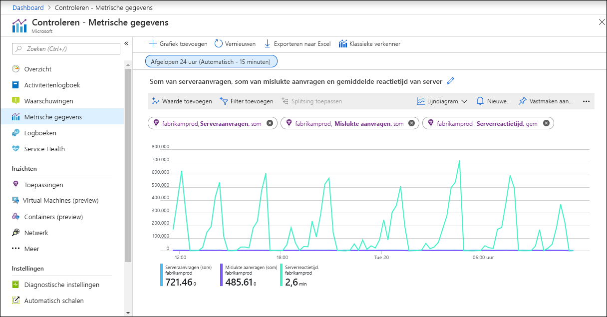

# Metrische gegevens in Azure Monitor

> [!NOTE]
> Het Azure Monitor-gegevens platform is gebaseerd op twee belang rijke gegevens typen: metrieken en Logboeken. In dit artikel worden metrische gegevens beschreven. Raadpleeg de [Logboeken in azure monitor](data-platform-logs.md) voor een gedetailleerde beschrijving van de logboeken en [Azure monitor gegevens platform](data-platform.md) voor een vergelijking van de twee.

Metrische gegevens in Azure Monitor zijn licht gewicht en kunnen bijna realtime-scenario's ondersteunen, waardoor ze vooral nuttig zijn voor waarschuwingen en snelle detectie van problemen. In dit artikel wordt beschreven hoe metrieken worden gestructureerd, wat u ermee kunt doen en identificeert u verschillende gegevens bronnen die gegevens in metrieken opslaan.

## Wat zijn metrische gegevens?
Metrische gegevens zijn numerieke waarden die verschillende aspecten van een systeem beschrijven op een bepaald tijdstip. Metrische gegevens worden met regel matige tussen pozen verzameld en zijn nuttig voor waarschuwingen omdat ze regel matig kunnen worden gesampled en een waarschuwing snel kan worden geactiveerd met relatief eenvoudige logica.

## Wat kunt u doen met Azure Monitor metrische gegevens?
De volgende tabel geeft een lijst van de verschillende manieren waarop u metrische gegevens in Azure Monitor kunt gebruiken.

|  |  |
|:---|:---|
| Analyseren | Met [metrische gegevens Verkenner](metrics-charts.md) kunt u de verzamelde metrische gegevens in een grafiek analyseren en de metrische gegevens van verschillende resources vergelijken. |
| Visualiseren | Een grafiek vastmaken aan een [Azure-dash board](../learn/tutorial-app-dashboards.md)vanuit de metrics Explorer. Een [werkmap](../platform/workbooks-overview.md) maken om te combi neren met meerdere gegevens sets in een interactief rapport. De resultaten van een query exporteren naar [Grafana](grafana-plugin.md) om gebruik te maken van Dash boards en combi neren met andere gegevens bronnen. |
| Waarschuwing | Configureer een [waarschuwings regel voor metrische gegevens](alerts-metric.md) die een melding verzendt of [geautomatiseerd actie](action-groups.md) onderneemt wanneer de metrische waarde een drempel overschrijdt. |
| Automatiseren |  Gebruik [automatisch schalen](autoscale-overview.md) om resources te verg Roten of te verkleinen op basis van een metrische waarde die een drempel overschrijdt. |
| Exporteren | U [kunt metrische gegevens naar Logboeken routeren](resource-logs-collect-storage.md) voor het analyseren van informatie in azure monitor metrieken samen met gegevens in azure monitor-logboeken en om meet waarden langer dan 93 dagen op te slaan. Meet gegevens streamen naar een [Event hub](stream-monitoring-data-event-hubs.md) om ze naar externe systemen te routeren. |
| Ophalen | Toegang krijgen tot metrische waarden van een opdracht regel met behulp van [Power shell-cmdlets](https://docs.microsoft.com/powershell/module/az.applicationinsights) Toegang krijgen tot meet waarden van aangepaste toepassing met behulp van [rest API](rest-api-walkthrough.md). Toegang krijgen tot meet waarden van een opdracht regel met behulp van [cli](/cli/azure/monitor/metrics). |
| Archiveren | [Archiveer](..//learn/tutorial-archive-data.md) de prestaties of de status geschiedenis van uw resource voor naleving, controle of offline rapportage. |

## Hoe worden gegevens in Azure Monitor meet waarden gestructureerd?
Gegevens die worden verzameld door Azure Monitor metrieken worden opgeslagen in een Data Base met een tijd reeks die is geoptimaliseerd voor het analyseren van gegevens met tijds tempel. Elke set metrische waarden is een tijd reeks met de volgende eigenschappen:

* Het tijdstip waarop de waarde is verzameld
* De resource waaraan de waarde is gekoppeld
* Een naam ruimte die fungeert als een categorie voor de metriek
* De naam van een metrische waarde
* De waarde zelf
* Sommige metrische gegevens kunnen meerdere dimensies hebben, zoals wordt beschreven in [multi-dimensionale metrische gegevens](#multi-dimensional-metrics). Aangepaste metrische gegevens kunnen Maxi maal 10 dimensies hebben.

## Multi-dimensionale metrische gegevens
Een van de uitdagingen van metrische gegevens is dat deze regel matig beperkte informatie bevat om context te bieden voor verzamelde waarden. Azure Monitor verhelpt deze uitdaging met multidimensionale metrische gegevens. Afmetingen van een metriek zijn naam/waarde-paren die aanvullende gegevens bevatten om de waarde van de metriek te beschrijven. Een metrische _beschik bare schijf ruimte_ kan bijvoorbeeld een dimensie hebben met de naam _station_ met de waarden _C:_, _D:_, waardoor het weer geven van de beschik bare schijf ruimte op alle stations of elk afzonderlijk station kan worden toegestaan.

In het onderstaande voor beeld ziet u twee gegevens sets voor een hypothetische metriek met de naam _netwerk doorvoer_. De eerste gegevensset heeft geen dimensies. De tweede gegevensset toont de waarden met twee dimensies, het _IP-adres_ en de _richting_:

### Netwerk doorvoer

| Tijdstempel     | Metrische waarde |
| ------------- |:-------------|
| 8/9/2017 8:14 | 1.331,8 kbps |
| 8/9/2017 8:15 | 1.141,4 kbps |
| 8/9/2017 8:16 | 1.110,2 kbps |

Deze niet-dimensionale metriek kan alleen een basis vraag beantwoorden zoals ' wat is de door Voer van mijn netwerk op een bepaald moment? '

### Netwerk doorvoer + twee dimensies ("IP" en "richting")

| Tijdstempel     | Dimensie ' IP '   | Dimensie "richting" | Metrische waarde|
| ------------- |:-----------------|:------------------- |:-----------|
| 8/9/2017 8:14 | IP = "192.168.5.2" | Direction = "verzenden"    | 646,5 kbps |
| 8/9/2017 8:14 | IP = "192.168.5.2" | Direction = "ontvangen" | 420,1 kbps |
| 8/9/2017 8:14 | IP = "10.24.2.15"  | Direction = "verzenden"    | 150,0 kbps |
| 8/9/2017 8:14 | IP = "10.24.2.15"  | Direction = "ontvangen" | 115,2 kbps |
| 8/9/2017 8:15 | IP = "192.168.5.2" | Direction = "verzenden"    | 515,2 kbps |
| 8/9/2017 8:15 | IP = "192.168.5.2" | Direction = "ontvangen" | 371,1 kbps |
| 8/9/2017 8:15 | IP = "10.24.2.15"  | Direction = "verzenden"    | 155,0 kbps |
| 8/9/2017 8:15 | IP = "10.24.2.15"  | Direction = "ontvangen" | 100,1 kbps |

Met deze metriek kunt u vragen beantwoorden zoals ' wat is de netwerk doorvoer voor elk IP-adres? ' en ' hoeveel gegevens zijn verzonden versus ontvangen? '. Multidimensionale meet waarden bevatten extra analytische en diagnostische waarde vergeleken met niet-dimensionale metrische gegevens.

## Interactie met Azure Monitor Metrics
Gebruik [Metrics Explorer](metrics-charts.md) om de gegevens in uw metrische data base interactief te analyseren en de waarden van meerdere metrieken in de loop van de tijd te bepalen. U kunt de grafieken vastmaken aan een dash board om ze te bekijken met andere visualisaties. U kunt ook metrische gegevens ophalen met behulp van de [Azure monitoring rest API](rest-api-walkthrough.md).

## Bronnen van Azure Monitor metrische gegevens
Er zijn drie basis bronnen voor metrische gegevens die worden verzameld door Azure Monitor. Zodra deze metrische gegevens worden verzameld in de data base van de Azure Monitor metriek, kunnen ze samen worden geëvalueerd, ongeacht de bron.

**Platform metrieken** worden gemaakt door Azure-resources en geven u inzicht in hun status en prestaties. Elk type resource maakt een [afzonderlijke set metrische gegevens](metrics-supported.md) zonder dat er configuratie is vereist. Metrische platform gegevens worden verzameld van Azure-resources met een frequentie van één minuut, tenzij anders aangegeven in de definitie van de metrische gegevens. 

De **metrische gegevens** van het gast besturingssysteem worden verzameld uit het gast besturingssysteem van een virtuele machine. Schakel de metrische gegevens voor het gast besturingssysteem in voor virtuele Windows-machines met [Windows diagnostische extensie (WAD)](../platform/diagnostics-extension-overview.md) en voor virtuele Linux-machines met [InfluxData-telegrafe-agent](https://www.influxdata.com/time-series-platform/telegraf/).

**Toepassings gegevens** worden gemaakt door Application Insights voor uw bewaakte toepassingen en helpen u bij het detecteren van prestatie problemen en het bijhouden van trends in de manier waarop uw toepassing wordt gebruikt. Dit geldt ook voor de _reactie tijd_ van de server en _browser uitzonderingen_.

**Aangepaste metrische gegevens** zijn metrische gegevens die u definieert naast de standaard metrieken die automatisch beschikbaar zijn. U kunt [aangepaste metrische gegevens definiëren in uw toepassing](../app/api-custom-events-metrics.md) die worden bewaakt door Application Insights of aangepaste metrische gegevens voor een Azure-service maken met behulp van de [API voor aangepaste metrische gegevens](metrics-store-custom-rest-api.md).

## Metrische gegevens bewaren
Voor de meeste resources in Azure worden metrische gegevens 93 dagen bewaard. Er zijn enkele uitzonde ringen:

**Metrische gegevens van het gast besturingssysteem**
-   **Klassieke waarden voor het besturings systeem**van de gast. Dit zijn prestatie meter items die worden verzameld door de [Windows diagnostische extensie (WAD)](../platform/diagnostics-extension-overview.md) of de [Linux Diagnostic extension (LAD)](../../virtual-machines/extensions/diagnostics-linux.md) en worden doorgestuurd naar een Azure-opslag account. Bewaar termijn voor deze metrische gegevens is 14 dagen.
-   De **metrische gegevens van het gast besturingssysteem worden verzonden naar Azure monitor metrische gegevens**. Dit zijn prestatie meter items die worden verzameld door de [Windows diagnostische extensie (WAD)](diagnostics-extension-overview.md) en worden verzonden naar de [gegevens Sink van Azure monitor](diagnostics-extension-overview.md#data-destinations), of via de [InfluxData-telegrafie-agent](https://www.influxdata.com/time-series-platform/telegraf/) op Linux-machines. De Bewaar periode voor deze metrische gegevens is 93 dagen.
-   De **metrische gegevens van het gast besturingssysteem die door log Analytics agent zijn verzameld**. Dit zijn prestatie meter items die worden verzameld door de Log Analytics-agent en worden verzonden naar een Log Analytics-werk ruimte. Het bewaren van deze metrische gegevens is 31 dagen en kan Maxi maal twee jaar worden verlengd.

**Metrische gegevens op basis van het logboek Application Insights**. 
- Achter de scène worden [metrische gegevens op basis van een logboek](../app/pre-aggregated-metrics-log-metrics.md) omgezet in logboek query's. De Bewaar periode komt overeen met het bewaren van gebeurtenissen in onderliggende Logboeken. Voor Application Insights bronnen worden logboeken gedurende 90 dagen bewaard.

> [!NOTE]
> U kunt [de metrische gegevens van het platform voor Azure monitor resources naar een log Analytics-werk ruimte verzenden voor een](resource-logs-collect-storage.md) lange termijn trending.

## Volgende stappen

- Meer informatie over het [Azure monitor-gegevens platform](data-platform.md).
- Meer informatie over [logboek gegevens in azure monitor](data-platform-logs.md).
- Meer informatie over de [beschik bare bewakings gegevens](data-sources.md) voor verschillende bronnen in Azure.
