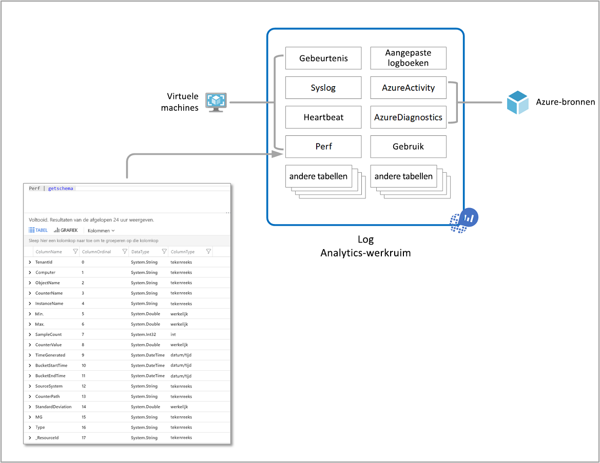
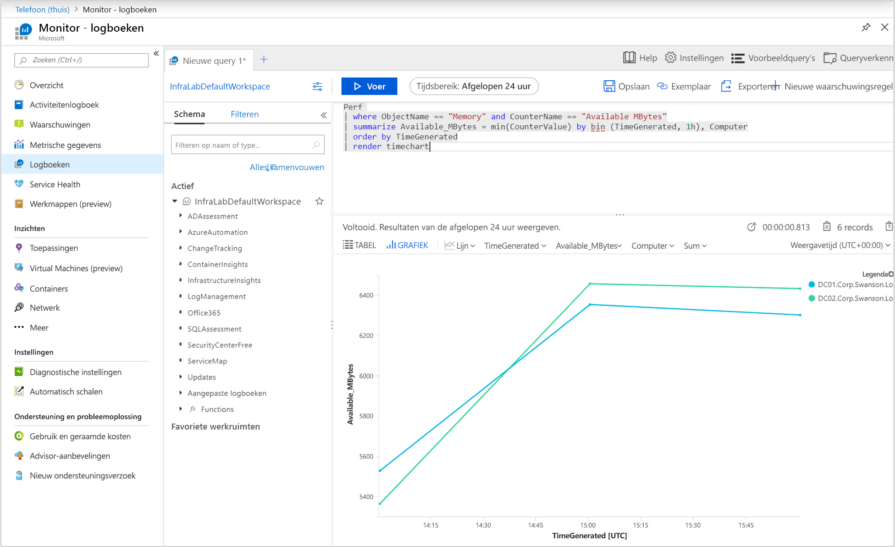
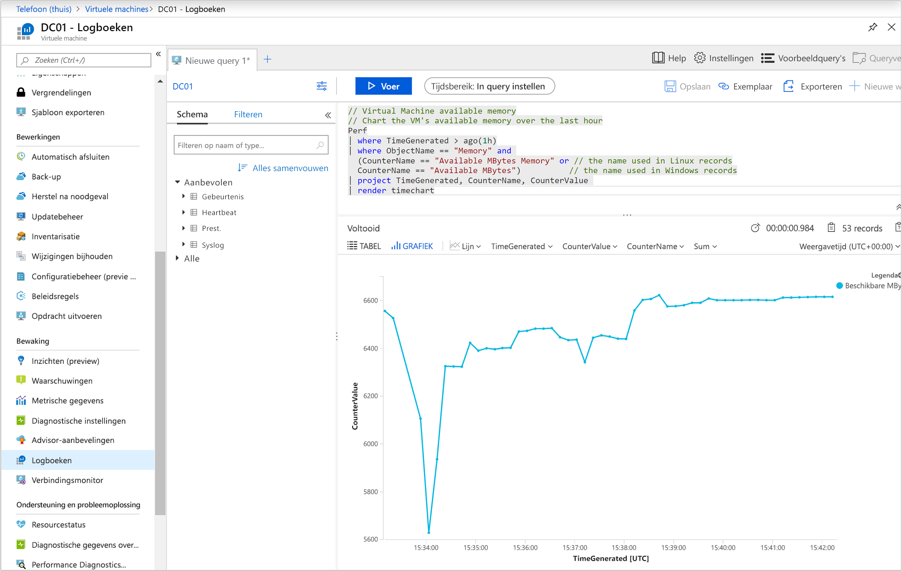
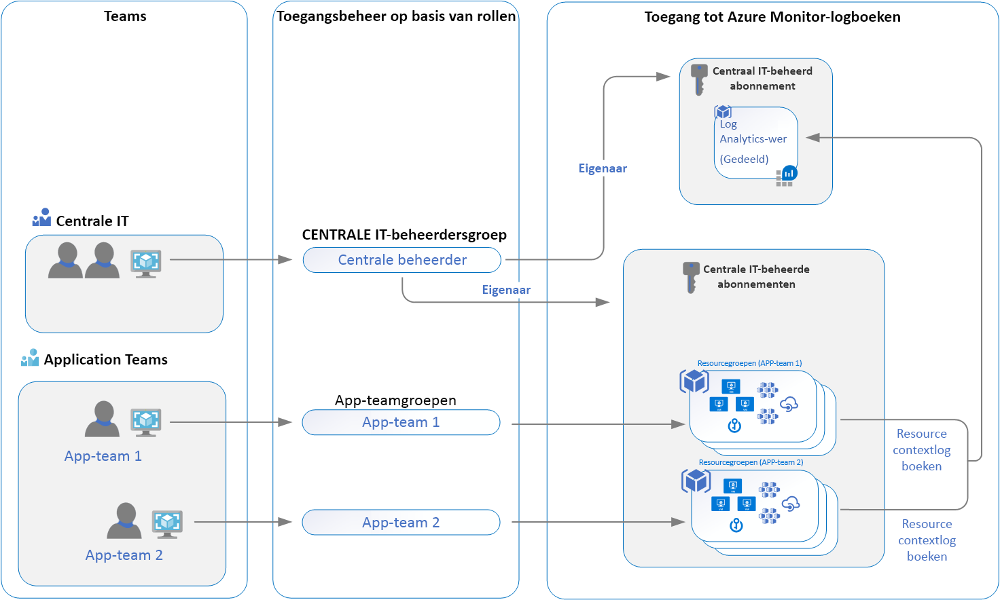

# <a name="designing-your-azure-monitor-logs-deployment"></a>Het ontwerpen van de implementatie van azure-monitorlogboeken

Azure Monitor slaat [logboekgegevens](data-platform-logs.md) op in een Log Analytics-werkruimte, een Azure-bron en een container waarin gegevens worden verzameld, samengevoegd en als beheergrens worden gebruikt. Hoewel u een of meer werkruimten in uw Azure-abonnement implementeren, zijn er verschillende overwegingen die u moet begrijpen om ervoor te zorgen dat uw eerste implementatie onze richtlijnen volgt om u een kosteneffectieve, beheersbare en schaalbare implementatie die voldoet aan de behoeften van uw organisatie.

Gegevens in een werkruimte worden ingedeeld in tabellen, die elk verschillende soorten gegevens opslaan en zijn eigen unieke set eigenschappen hebben op basis van de bron die de gegevens genereert. De meeste gegevensbronnen schrijven naar hun eigen tabellen in een Log Analytics-werkruimte.



Een werkruimte log Analytics biedt:

* Een geografische locatie voor gegevensopslag.
* Gegevensisolatie door verschillende gebruikers toegangsrechten te verlenen volgens een van onze aanbevolen ontwerpstrategieën.
* Ruimte voor configuratie van instellingen zoals [prijscategorie](https://docs.microsoft.com/azure/azure-monitor/platform/manage-cost-storage#changing-pricing-tier), [retentie](https://docs.microsoft.com/azure/azure-monitor/platform/manage-cost-storage#change-the-data-retention-period)en [gegevenslimieten](https://docs.microsoft.com/azure/azure-monitor/platform/manage-cost-storage#manage-your-maximum-daily-data-volume).

In dit artikel vindt u een gedetailleerd overzicht van de ontwerp- en migratieoverwegingen, het overzicht van toegangscontrole en een overzicht van de ontwerpimplementaties die u aanuw IT-organisatie aanbeveelt.


## <a name="important-considerations-for-an-access-control-strategy"></a>Belangrijke overwegingen voor een toegangscontrolestrategie

Het identificeren van het aantal werkruimten dat u nodig hebt, wordt beïnvloed door een of meer van de volgende vereisten:

* U bent een wereldwijd bedrijf en u hebt loggegevens nodig die in specifieke regio's zijn opgeslagen om redenen van gegevenssoevereiniteit of naleving.
* U gebruikt Azure en wilt kosten voor de overdracht van uitgaande gegevens voorkomen door een werkruimte in dezelfde regio te hebben als de Azure-resource die deze beheert.
* U beheert meerdere afdelingen of bedrijfsgroepen en u wilt dat elk hun eigen gegevens te zien, maar niet gegevens van anderen. Er is ook geen zakelijke vereiste voor een geconsolideerde cross-afdeling of bedrijfsgroepweergave.

IT-organisaties zijn vandaag gemodelleerd naar aanleiding van een gecentraliseerde, gedecentraliseerde, of een in-between hybride van beide structuren. Als gevolg hiervan worden de volgende implementatiemodellen voor werkruimtes vaak gebruikt om een van deze organisatiestructuren in kaart te brengen:

* **Gecentraliseerd**: Alle logboeken worden opgeslagen in een centrale werkruimte en beheerd door één team, waarbij Azure Monitor gedifferentieerde toegang per team biedt. In dit scenario is het eenvoudig te beheren, zoeken tussen resources en cross-correlate logs. De werkruimte kan aanzienlijk groeien, afhankelijk van de hoeveelheid gegevens die is verzameld uit meerdere bronnen in uw abonnement, met extra administratieve overhead om de toegangscontrole voor verschillende gebruikers te behouden. Dit model staat bekend als "hub en spoke".
* **Gedecentraliseerd**: elk team heeft zijn eigen werkruimte die is gemaakt in een resourcegroep die ze bezitten en beheren, en logboekgegevens worden per resource gescheiden. In dit scenario kan de werkruimte veilig worden gehouden en is toegangsbeheer consistent met toegang tot resources, maar is het moeilijk om logboeken te cross-correleren. Gebruikers die een brede weergave van veel bronnen nodig hebben, kunnen de gegevens niet op een zinvolle manier analyseren.
* **Hybride**: Nalevingsvereisten voor beveiligingscontroles maken dit scenario nog ingewikkelder omdat veel organisaties beide implementatiemodellen parallel implementeren. Dit resulteert vaak in een complexe, dure en moeilijk te onderhouden configuratie met hiaten in de dekking van logboeken.

Wanneer u de Log Analytics-agents gebruikt om gegevens te verzamelen, moet u het volgende begrijpen om de implementatie van uw agent te plannen:

* Als u gegevens van Windows-agents wilt verzamelen, u [elke agent configureren om te rapporteren aan een of meer werkruimten,](../../azure-monitor/platform/agent-windows.md)zelfs terwijl deze wordt gemeld aan een beheergroep van System Center Operations Manager. De Windows-agent kan maximaal vier werkruimten rapporteren.
* De Linux-agent ondersteunt geen multi-homing en kan alleen rapporteren aan één werkruimte.

Als u System Center Operations Manager 2012 R2 of hoger gebruikt:

* Elke beheergroep operations manager kan slechts met één werkruimte worden [verbonden.](../platform/om-agents.md) 
* Linux-computers die rapporteren aan een beheergroep, moeten zijn geconfigureerd om rechtstreeks te rapporteren aan een Log Analytics-werkruimte. Als uw Linux-computers al rechtstreeks naar een werkruimte rapporteren en u deze wilt controleren met Operations Manager, voert u deze stappen uit om te [rapporteren aan een beheergroep operations manager.](agent-manage.md#configure-agent-to-report-to-an-operations-manager-management-group) 
* U de Windows-agent Log Analytics op de Windows-computer installeren en deze laten rapporteren aan zowel Operations Manager die is geïntegreerd met een werkruimte als een andere werkruimte.

## <a name="access-control-overview"></a>Overzicht van toegangsbeheer

Met rbac (role-based access control) u gebruikers en groepen alleen de hoeveelheid toegang geven die ze nodig hebben om met monitoringgegevens in een werkruimte te werken. Hiermee u afstemmen op uw IT-organisatie-bedrijfsmodel met behulp van één werkruimte om verzamelde gegevens op te slaan die zijn ingeschakeld op al uw resources. U verleent bijvoorbeeld toegang tot uw team dat verantwoordelijk is voor infrastructuurservices die worden gehost op virtuele Azure-machines (VM's), en als gevolg daarvan hebben ze alleen toegang tot de logboeken die door de VM's worden gegenereerd. Dit is volgens ons nieuwe resource-context log model. De basis voor dit model is voor elke logboekrecord die wordt uitgestraald door een Azure-bron, deze wordt automatisch aan deze bron gekoppeld. Logboeken worden doorgestuurd naar een centrale werkruimte die scoping en RBAC respecteert op basis van de resources.

De gegevens waartoe een gebruiker toegang heeft, worden bepaald door een combinatie van factoren die in de volgende tabel worden vermeld. Elk wordt beschreven in de onderstaande secties.

| Factor | Beschrijving |
|:---|:---|
| [Toegangsmodus](#access-mode) | Methode die de gebruiker gebruikt om toegang te krijgen tot de werkruimte.  Hiermee definieert u het bereik van de beschikbare gegevens en de toegepaste toegangscontrolemodus. |
| [Toegangscontrolemodus](#access-control-mode) | Instellen op de werkruimte die bepaalt of machtigingen worden toegepast op werkruimte- of resourceniveau. |
| [Machtigingen](manage-access.md) | Machtigingen die worden toegepast op afzonderlijke of groepen gebruikers voor de werkruimte of resource. Hiermee bepaalt u tot welke gegevens de gebruiker toegang heeft. |
| [Tabelniveau RBAC](manage-access.md#table-level-rbac) | Optionele gedetailleerde machtigingen die van toepassing zijn op alle gebruikers, ongeacht hun toegangsmodus of toegangscontrolemodus. Hiermee bepaalt u welke gegevenstypen een gebruiker kan openen. |

## <a name="access-mode"></a>Toegangsmodus

De *toegangsmodus* verwijst naar hoe een gebruiker toegang krijgt tot een Log Analytics-werkruimte en definieert het bereik van gegevens waartoe hij toegang heeft. 

Gebruikers hebben twee opties voor toegang tot de gegevens:

* **Werkruimtecontext**: U alle logboeken in de werkruimte bekijken waar toe u toestemming hebt gegeven. Query's in deze modus worden beperkt tot alle gegevens in alle tabellen in de werkruimte. Dit is de toegangsmodus die wordt gebruikt wanneer logboeken worden geopend met de werkruimte als het bereik, zoals wanneer u **Logboeken** selecteert in het menu **Azure Monitor** in de Azure-portal.

    

* **Resourcecontext:** wanneer u toegang krijgt tot de werkruimte voor een bepaalde resource, resourcegroep of abonnement, zoals wanneer u **Logboeken** selecteert in een resourcemenu in de Azure-portal, u logboeken weergeven voor alleen resources in alle tabellen waartoe u toegang hebt. Query's in deze modus worden beperkt tot alleen gegevens die aan die bron zijn gekoppeld. Deze modus maakt ook korrelige RBAC.

    

    > [!NOTE]
    > Logboeken zijn alleen beschikbaar voor query's in resourcecontext als ze correct zijn gekoppeld aan de relevante bron. Momenteel zijn de volgende bronnen beperkingen:
    > - Computers buiten Azure
    > - Service Fabric
    > - Application Insights
    >
    > U testen of logboeken correct zijn gekoppeld aan hun resource door een query uit te voeren en de records te inspecteren waarin u geïnteresseerd bent. Als de juiste resource-id zich in de [eigenschap _ResourceId](log-standard-properties.md#_resourceid) bevindt, zijn gegevens beschikbaar voor resourcecentrische query's.

Azure Monitor bepaalt automatisch de juiste modus, afhankelijk van de context waaruit u de logboekzoekopdracht uitvoert. Het bereik wordt altijd weergegeven in het gedeelte linksboven van Log Analytics.

### <a name="comparing-access-modes"></a>Toegangsmodi vergelijken

In de volgende tabel worden de toegangsmodi samengevat:

| | Werkruimte-context | Resourcecontext |
|:---|:---|:---|
| Voor wie is elk model bedoeld? | Centrale administratie. Beheerders die het verzamelen van gegevens moeten configureren en gebruikers die toegang nodig hebben tot een breed scala aan bronnen. Momenteel ook vereist voor gebruikers die toegang moeten krijgen tot logboeken voor bronnen buiten Azure. | Toepassingsteams. Beheerders van Azure-resources die worden gecontroleerd. |
| Wat heeft een gebruiker nodig om logboeken te bekijken? | Machtigingen voor de werkruimte. Zie **Werkruimtemachtigingen** in [Toegang beheren met behulp van werkruimtemachtigingen](manage-access.md#manage-access-using-workspace-permissions). | Lees de toegang tot de bron. Zie **Resourcemachtigingen** in [Toegang beheren met Azure-machtigingen](manage-access.md#manage-access-using-azure-permissions). Machtigingen kunnen worden overgenomen (bijvoorbeeld van de brongroep met bevattende bron) of rechtstreeks aan de resource worden toegewezen. Toestemming voor de logboeken voor de resource wordt automatisch toegewezen. |
| Wat is de reikwijdte van machtigingen? | Werkruimte. Gebruikers met toegang tot de werkruimte kunnen alle logboeken in de werkruimte opvragen van tabellen waarvoor ze machtigingen hebben. Zie [Toegangsbeheer van de tabel](manage-access.md#table-level-rbac) | Azure-bron. De gebruiker kan logboeken opvragen voor specifieke bronnen, resourcegroepen of een abonnement waartoe ze toegang hebben vanuit elke werkruimte, maar kan geen logboeken voor andere bronnen opvragen. |
| Hoe kunnen gebruikers toegang krijgen tot logboeken? | <ul><li>**Logboeken starten vanuit** het menu **Azure Monitor.**</li></ul> <ul><li>**Logboeken starten** vanuit **Logboekanalyse-werkruimten**.</li></ul> <ul><li>Vanuit Azure [Monitor-werkmappen](../visualizations.md#workbooks).</li></ul> | <ul><li>**Logboeken starten vanuit** het menu voor de Azure-bron</li></ul> <ul><li>**Logboeken starten vanuit** het menu **Azure Monitor.**</li></ul> <ul><li>**Logboeken starten** vanuit **Logboekanalyse-werkruimten**.</li></ul> <ul><li>Vanuit Azure [Monitor-werkmappen](../visualizations.md#workbooks).</li></ul> |

## <a name="access-control-mode"></a>Toegangscontrolemodus

De *modus Toegangsbeheer* is een instelling voor elke werkruimte die bepaalt hoe machtigingen voor de werkruimte worden bepaald.

* **Werkruimtemachtigingen vereisen:** deze besturingselementmodus staat geen gedetailleerde RBAC toe. Als een gebruiker toegang heeft tot de werkruimte, moet hij of zij machtigingen krijgen voor de werkruimte of aan specifieke tabellen.

    Als een gebruiker toegang heeft tot de werkruimte-contextmodus, heeft deze toegang tot alle gegevens in een tabel waartoe hij toegang heeft gekregen. Als een gebruiker toegang heeft tot de werkruimte volgens de resourcecontextmodus, heeft hij of zij alleen toegang tot gegevens voor die bron in een tabel waartoe hij toegang heeft gekregen.

    Dit is de standaardinstelling voor alle werkruimten die vóór maart 2019 zijn gemaakt.

* **Resource- of werkruimtemachtigingen gebruiken:** met deze besturingselementmodus u RBAC in korrelvorm maken. Gebruikers kunnen alleen toegang krijgen tot gegevens die zijn `read` gekoppeld aan resources die ze kunnen weergeven door Azure-machtigingen toe te vragen. 

    Wanneer een gebruiker toegang krijgt tot de werkruimte-contextmodus, zijn werkruimtemachtigingen van toepassing. Wanneer een gebruiker toegang krijgt tot de werkruimte in de resourcecontextmodus, worden alleen resourcemachtigingen geverifieerd en worden werkruimtemachtigingen genegeerd. Schakel RBAC in voor een gebruiker door deze te verwijderen uit werkruimtemachtigingen en de toestemming voor hun resourcerechten te kunnen herkennen.

    Dit is de standaardinstelling voor alle werkruimten die na maart 2019 zijn gemaakt.

    > [!NOTE]
    > Als een gebruiker alleen resourcemachtigingen voor de werkruimte heeft, heeft hij alleen toegang tot de werkruimte met behulp van de resourcecontextmodus, ervan uitgaande dat de modus voor toegang van de werkruimte is ingesteld op **Resource- of werkruimtemachtigingen**gebruiken.

Zie [Toegangsbeheermodus](manage-access.md#configure-access-control-mode)configureren voor meer informatie over het wijzigen van de toegangscontrolemodus in de portal, met PowerShell of het gebruik van een resourcebeheersjabloon.

## <a name="ingestion-volume-rate-limit"></a>Innamevolumesnelheidlimiet

Azure Monitor is een grootschalige dataservice die duizenden klanten bedient die elke maand terabytes aan gegevens verzenden. De standaardinnamedrempel is ingesteld op **6 GB/min** per werkruimte. Dit is een geschatte waarde, omdat de werkelijke grootte kan variëren tussen gegevenstypen, afhankelijk van de loglengte en de compressieverhouding. Deze limiet is niet van toepassing op gegevens die worden verzonden vanuit agents of [Data Collector API.](data-collector-api.md)

Als u gegevens met een hoger tarief naar één werkruimte verzendt, worden sommige gegevens verwijderd en wordt elke 6 uur een gebeurtenis naar de *bewerkingstabel* in uw werkruimte verzonden terwijl de drempelwaarde nog steeds wordt overschreden. Als uw opnamevolume de tarieflimiet blijft overschrijden of als u verwacht deze binnenkort te bereiken, u een verhoging van uw werkruimte aanvragen door een ondersteuningsverzoek te openen.
 
Als u een melding wilt ontvangen over een dergelijke gebeurtenis in uw werkruimte, maakt u een [logboekwaarschuwingsregel](alerts-log.md) met de volgende query met waarschuwingslogica op basis van het aantal resultatenrasp dan nul.

``` Kusto
Operation
|where OperationCategory == "Ingestion"
|where Detail startswith "The rate of data crossed the threshold"
``` 


## <a name="recommendations"></a>Aanbevelingen



Dit scenario heeft betrekking op één werkruimteontwerp in uw IT-organisatieabonnement dat niet wordt beperkt door gegevenssoevereiniteit of naleving van de regelgeving, of die moet worden toegewezen aan de regio's waarin uw resources worden geïmplementeerd. Het biedt uw organisaties beveiligings- en IT-beheerteams de mogelijkheid om gebruik te maken van de verbeterde integratie met Azure access management en veiliger toegangsbeheer.

Alle resources, monitoringoplossingen en inzichten zoals Application Insights en Azure Monitor voor VM's, ondersteunende infrastructuur en toepassingen die door de verschillende teams worden onderhouden, zijn geconfigureerd om hun verzamelde logboekgegevens door te sturen naar de IT-organisaties gecentraliseerde gedeelde werkruimte. Gebruikers van elk team krijgen toegang tot logboeken voor bronnen waartoe ze toegang hebben gekregen.

Zodra u uw werkruimtearchitectuur hebt geïmplementeerd, u dit afdwingen op Azure-bronnen met [Azure Policy](../../governance/policy/overview.md). Het biedt een manier om beleid te definiëren en naleving van uw Azure-bronnen te garanderen, zodat ze al hun bronlogboeken naar een bepaalde werkruimte verzenden. Met Azure-virtuele machines of virtuele machineschaalsets u bijvoorbeeld bestaande beleidsregels gebruiken die de naleving van de werkruimte evalueren en resultaten rapporteren, of aanpassen om te herstellen als deze niet-compatibel zijn.  

## <a name="workspace-consolidation-migration-strategy"></a>Migratiestrategie voor werkruimteconsolidatie

Voor klanten die al meerdere werkruimten hebben geïmplementeerd en geïnteresseerd zijn in consolidatie naar het toegangsmodel voor resources- context, raden we u aan een incrementele benadering te kiezen om te migreren naar het aanbevolen toegangsmodel en u probeert dit niet te bereiken snel of agressief. Na een gefaseerde aanpak voor het plannen, migreren, valideren en terugtrekken na een redelijke tijdlijn, u ongeplande incidenten of onverwachte gevolgen voor uw cloudactiviteiten voorkomen. Als u om nalevings- of bedrijfsredenen geen beleid voor het bewaren van gegevens hebt, moet u de juiste tijdsduur beoordelen om gegevens in de werkruimte te bewaren waaruit u tijdens het proces migreert. Terwijl u resources opnieuw configureert om te rapporteren aan de gedeelde werkruimte, u de gegevens in de oorspronkelijke werkruimte nog steeds analyseren als dat nodig is. Als de migratie is voltooid, als u de mogelijkheid hebt om gegevens in de oorspronkelijke werkruimte te bewaren voor het einde van de bewaarperiode, verwijdert u deze niet.

Houd tijdens het plannen van uw migratie naar dit model rekening met het volgende:

* Begrijp aan welke branchevoorschriften en interne beleidsregels met betrekking tot gegevensbewaring u moet voldoen.
* Zorg ervoor dat uw toepassingsteams kunnen werken binnen de bestaande functionaliteit voor resourcecontext.
* Identificeer de toegang die wordt verleend aan resources voor uw toepassingsteams en test in een ontwikkelomgeving voordat u in productie implementeert.
* Configureer de werkruimte om **machtigingen voor resources of werkruimtes gebruiken**in te schakelen.
* Verwijder de toestemming voor toepassingsteams om de werkruimte te lezen en op te vragen.
* Schakel bewakingsoplossingen, Inzichten zoals Azure Monitor voor containers en/of Azure Monitor voor VM's, uw Automatiseringsaccount(s) en beheeroplossingen in, zoals Updatebeheer, VM's voor starten/stoppen, enz., die in de oorspronkelijke werkruimte zijn geïmplementeerd.

## <a name="next-steps"></a>Volgende stappen

Als u de beveiligingsmachtigingen en -besturingselementen wilt implementeren die in deze handleiding worden aanbevolen, controleert u [de toegang tot logboeken.](manage-access.md)
