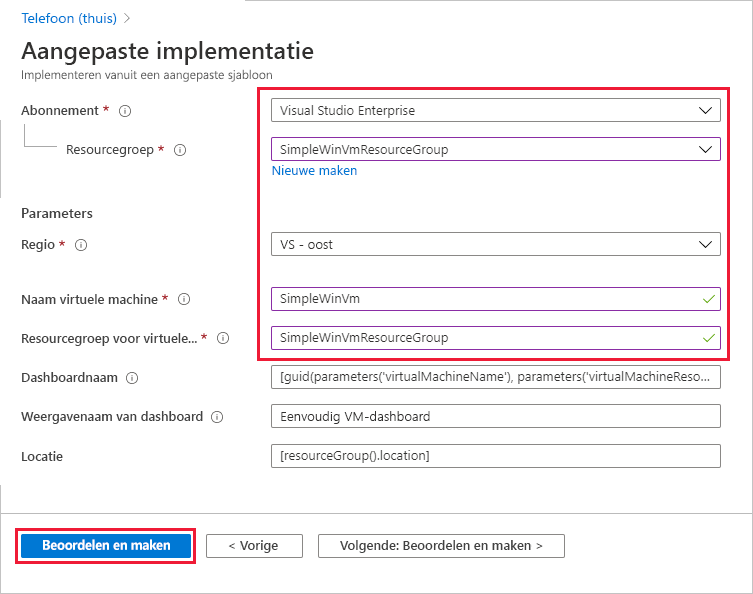
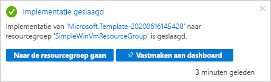
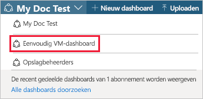
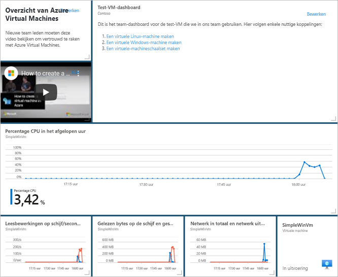
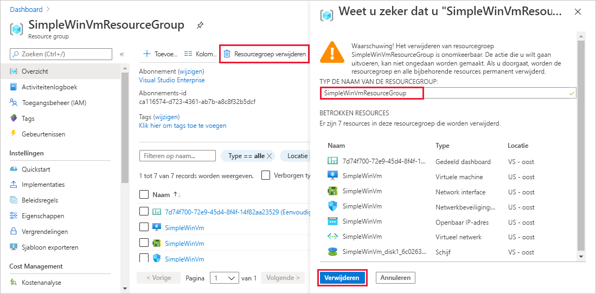

# <a name="quickstart-create-a-dashboard-in-the-azure-portal-by-using-an-arm-template"></a>Quickstart: Een dashboard maken in de Azure-portal met behulp van een ARM-sjabloon

Een dashboard in de Azure-portal is een gerichte en georganiseerde weergave van uw cloudresources. Deze quickstart is gericht op het implementeren van een ARM-sjabloon (Azure Resource Manager-sjabloon) voor het maken van een dashboard. Het dashboard toont de prestaties van een virtuele machine (VM), evenals een aantal statische gegevens en links.

[!INCLUDE [About Azure Resource Manager](../../includes/resource-manager-quickstart-introduction.md)]

Als uw omgeving voldoet aan de vereisten en u benkend bent met het gebruik van ARM-sjablonen, selecteert u de knop **Implementeren naar Azure**. De sjabloon wordt in Azure Portal geopend.

[](https://portal.azure.com/#create/Microsoft.Template/uri/https%3A%2F%2Fraw.githubusercontent.com%2FAzure%2Fazure-quickstart-templates%2Fmaster%2F101-azure-portal-dashboard%2Fazuredeploy.json)

## <a name="prerequisites"></a>Vereisten

- Als u nog geen abonnement op Azure hebt, maak dan een [gratis account](https://azure.microsoft.com/free/?WT.mc_id=A261C142F) aan voordat u begint.
- Een bestaande virtuele machine.

## <a name="create-a-virtual-machine"></a>Een virtuele machine maken

Het dashboard dat u in het volgende deel van deze quickstart maakt, vereist een bestaande VM. Volg deze stappen om een virtuele machine te maken.

1. Selecteer Cloud Shell in de Azure-portal.

    

1. Kopieer de volgende opdracht en voer deze in bij de opdrachtprompt om een resourcegroep te maken.

    ```powershell
    New-AzResourceGroup -Name SimpleWinVmResourceGroup -Location EastUS
    ```

    

1. Kopieer de volgende opdracht en voer deze in bij de opdrachtprompt om een VM te maken in de resourcegroep.

    ```powershell
    New-AzVm `
        -ResourceGroupName "SimpleWinVmResourceGroup" `
        -Name "SimpleWinVm" `
        -Location "East US" 
    ```

1. Voer een gebruikersnaam en wachtwoord in voor de VM. Dit is een nieuwe gebruikersnaam en nieuw wachtwoord. Het is bijvoorbeeld niet het account dat u gebruikt om u aan te melden bij Azure. Zie [gebruikersnaamvereisten](../virtual-machines/windows/faq.md#what-are-the-username-requirements-when-creating-a-vm) en [wachtwoordvereisten](../virtual-machines/windows/faq.md#what-are-the-password-requirements-when-creating-a-vm) voor meer informatie.

    De VM-implementatie wordt nu gestart en duurt doorgaans enkele minuten. Nadat de implementatie is voltooid, gaat u verder met de volgende sectie.

## <a name="review-the-template"></a>De sjabloon controleren

De sjabloon die in deze quickstart wordt gebruikt, komt uit [Azure-quickstartsjablonen](https://azure.microsoft.com/resources/templates/101-azure-portal-dashboard/). De sjabloon voor dit artikel is te lang om hier weer te geven. Als u de sjabloon wilt bekijken, raadpleegt u [azuredeploy.json](https://raw.githubusercontent.com/Azure/azure-quickstart-templates/master/101-azure-portal-dashboard/azuredeploy.json). Er is één Azure-resource gedefinieerd in de sjabloon [Microsoft.Portal/dashboards](/azure/templates/microsoft.portal/dashboards) - een dashboard maken in de Azure-portal.

## <a name="deploy-the-template"></a>De sjabloon implementeren

1. Selecteer de volgende afbeelding om u aan te melden bij Azure en een sjabloon te openen.

    [](https://portal.azure.com/#create/Microsoft.Template/uri/https%3A%2F%2Fraw.githubusercontent.com%2FAzure%2Fazure-quickstart-templates%2Fmaster%2F101-azure-portal-dashboard%2Fazuredeploy.json)

1. Selecteer of typ de volgende waarden en selecteer vervolgens **Bekijken en maken**.

    

    Gebruik de standaardwaarden om het dashboard te maken, tenzij er iets anders is aangegeven.

    * **Abonnement**: selecteer een Azure-abonnement.
    * **Resourcegroup**: selecteer **SimpleWinVmResourceGroup**.
    * **Locatie**: selecteer **VS - oost**.
    * **Naam van de virtuele machine**: voer **SimpleWinVm** in.
    * **Resourcegroep van virtuele machine**: voer **SimpleWinVmResourceGroup** in.

1. Selecteer **Maken** of **Kopen**. Nadat het dashboard is geïmplementeerd, ontvangt u een melding:

    

Voor het implementeren van de sjabloon wordt de Azure-portal gebruikt. Naast de Azure-portal kunt u ook Azure PowerShell, Azure CLI en REST API gebruiken. Zie [Sjablonen implementeren](../azure-resource-manager/templates/deploy-powershell.md) voor meer informatie over andere implementatiemethoden.

## <a name="review-deployed-resources"></a>Geïmplementeerde resources bekijken

Controleer of het dashboard is gemaakt en of u de gegevens van de virtuele machine kunt zien.

1. In de Azure-portal selecteert u **Dashboard**.

    

1. Op de dashboardpagina selecteert u **Eenvoudig VM-dashboard**.

    

1. Bekijk het dashboard dat door de ARM-sjabloon is gemaakt. U kunt zien dat een deel van de inhoud statisch is, maar er zijn ook grafieken waarin de prestaties van de virtuele machine worden weergegeven die u aan het begin hebt gemaakt.

    

## <a name="clean-up-resources"></a>Resources opschonen

Als u de virtuele machine en het bijbehorende dashboard wilt verwijderen, verwijdert u de resourcegroep waarin deze zich bevinden.

1. Zoek in de Azure-portal naar **SimpleWinVmResourceGroup** en selecteer deze in de zoekresultaten.

1. Op de pagina **SimpleWinVmResourceGroup** selecteert u **Resourcegroep verwijderen**, voert u de naam van de resourcegroep in om te bevestigen en selecteert u **Verwijderen**.

    

## <a name="next-steps"></a>Volgende stappen

Zie voor meer informatie over dashboards in de Azure-portal:

> [!div class="nextstepaction"]
> [Dashboards maken en delen in de Azure-portal](azure-portal-dashboards.md)