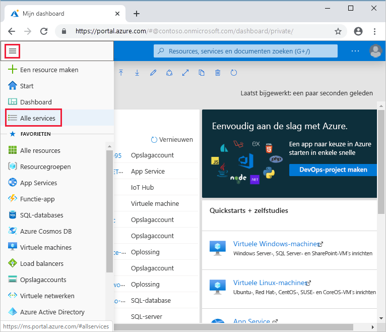
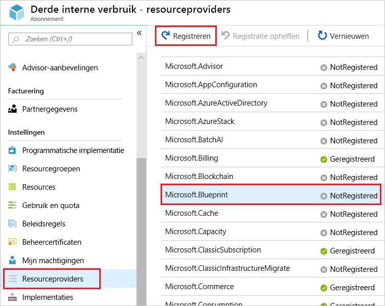
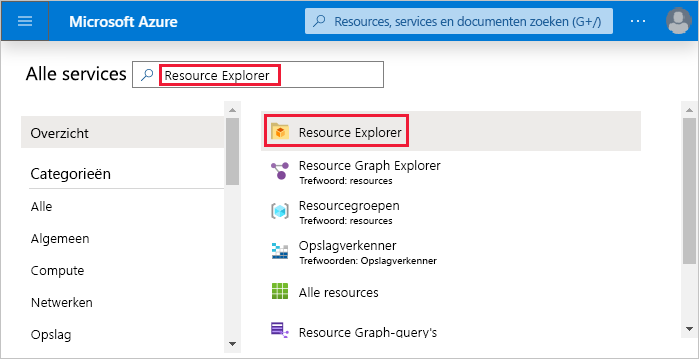
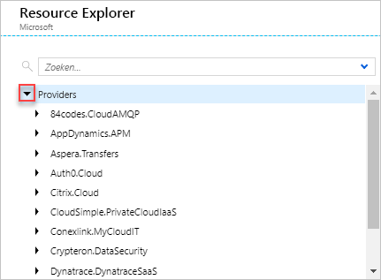
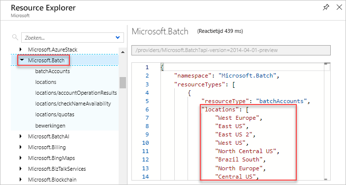

# <a name="azure-resource-providers-and-types"></a>Azure-resourceproviders en -typen

Bij het implementeren van resources moet u vaak informatie ophalen over de resourceproviders en -typen. Als u bijvoorbeeld sleutels en geheimen wilt opslaan, werkt u met de resourceprovider Microsoft.KeyVault. Deze resourceprovider biedt een resourcetype kluizen voor het maken van de sleutelkluis.

De naam van een resourcetype heeft deze syntaxis: **{resourceprovider}/{resourcetype}**. Het resourcetype voor een sleutelkluis is **Microsoft.keyvault\vaults**.

In dit artikel leert u het volgende:

* Alle resourceproviders in Azure weergeven
* De registratiestatus van een resourceprovider controleren
* Registreer een resourceprovider
* Resourcetypen voor een resourceprovider weergeven
* Geldige locaties voor een resourcetype weergeven
* Geldige API-versies voor een resourcetype weergeven

U deze stappen uitvoeren via de Azure-portal, Azure PowerShell of Azure CLI.

Zie [Resourceproviders voor Azure-services voor](azure-services-resource-providers.md)een lijst die resourceproviders aan Azure-services toeinziet.

## <a name="azure-portal"></a>Azure Portal

Ga als u alle resourceproviders en de registratiestatus voor uw abonnement weergeven:

1. Meld u aan bij [Azure Portal](https://portal.azure.com).
2. Selecteer **Alle services** in het menu van Azure Portal.

    

3. Voer in het vak **Alle services** **het abonnement**in en selecteer **Abonnementen**.
4. Selecteer het abonnement in de abonnementslijst om te bekijken.
5. Selecteer **Resourceproviders** en bekijk de lijst met beschikbare resourceproviders.

    

6. Als u een resourceprovider registreert, configureert u uw abonnement om met de resourceprovider te werken. De ruimte voor registratie is altijd het abonnement. Standaard worden veel resourceproviders automatisch geregistreerd. Het kan echter nodig zijn om sommige resourceproviders handmatig te registreren. Als u een resourceprovider wilt registreren, `/register/action` moet u toestemming hebben om de bewerking voor de resourceprovider uit te voeren. Deze bewerking is opgenomen in de rollen Inzender en Eigenaar. Als u een resourceprovider wilt registreren, selecteert u **Registreren**. In de vorige schermafbeelding wordt de koppeling **Register** gemarkeerd voor **Microsoft.Blueprint**.

    U een resourceprovider niet uitschrijven wanneer u nog resourcetypen van die resourceprovider in uw abonnement hebt.

Ga als volgende informatie voor een bepaalde resourceprovider naar informatie voor een bepaalde resourceprovider:

1. Meld u aan bij [Azure Portal](https://portal.azure.com).
2. Selecteer **Alle services** in het menu van Azure Portal.
3. Voer **resourceexplorer**in het vak **Alle services** in en selecteer **Resource Explorer**.

    

4. **Providers** uitvouwen door de pijl-rechts te selecteren.

    

5. Vouw een resourceprovider en resourcetype uit die u wilt weergeven.

    

6. Resourcemanager wordt in alle regio's ondersteund, maar de resources die u implementeert, worden mogelijk niet in alle regio's ondersteund. Bovendien kunnen er beperkingen zijn aan uw abonnement waardoor u bepaalde regio's die de bron ondersteunen niet gebruiken. De bronverkenner geeft geldige locaties weer voor het resourcetype.

    

7. De API-versie komt overeen met een versie van REST API-bewerkingen die worden vrijgegeven door de resourceprovider. Aangezien een resourceprovider nieuwe functies mogelijk maakt, brengt het een nieuwe versie van de REST API uit. De resourceverkenner geeft geldige API-versies weer voor het resourcetype.

    

## <a name="azure-powershell"></a>Azure PowerShell

[!INCLUDE [updated-for-az](../../../includes/updated-for-az.md)]

Gebruik het als u alle resourceproviders in Azure en de registratiestatus voor uw abonnement wilt weergeven:

```azurepowershell-interactive
Get-AzResourceProvider -ListAvailable | Select-Object ProviderNamespace, RegistrationState
```

Welke rendementen vergelijkbaar met:

```output
ProviderNamespace                RegistrationState
-------------------------------- ------------------
Microsoft.ClassicCompute         Registered
Microsoft.ClassicNetwork         Registered
Microsoft.ClassicStorage         Registered
Microsoft.CognitiveServices      Registered
...
```

Als u een resourceprovider registreert, configureert u uw abonnement om met de resourceprovider te werken. De ruimte voor registratie is altijd het abonnement. Standaard worden veel resourceproviders automatisch geregistreerd. Het kan echter nodig zijn om sommige resourceproviders handmatig te registreren. Als u een resourceprovider wilt registreren, `/register/action` moet u toestemming hebben om de bewerking voor de resourceprovider uit te voeren. Deze bewerking is opgenomen in de rollen Inzender en Eigenaar.

```azurepowershell-interactive
Register-AzResourceProvider -ProviderNamespace Microsoft.Batch
```

Welke rendementen vergelijkbaar met:

```output
ProviderNamespace : Microsoft.Batch
RegistrationState : Registering
ResourceTypes     : {batchAccounts, operations, locations, locations/quotas}
Locations         : {West Europe, East US, East US 2, West US...}
```

U een resourceprovider niet uitschrijven wanneer u nog resourcetypen van die resourceprovider in uw abonnement hebt.

Gebruik het volgende om informatie voor een bepaalde resourceprovider te bekijken:

```azurepowershell-interactive
Get-AzResourceProvider -ProviderNamespace Microsoft.Batch
```

Welke rendementen vergelijkbaar met:

```output
{ProviderNamespace : Microsoft.Batch
RegistrationState : Registered
ResourceTypes     : {batchAccounts}
Locations         : {West Europe, East US, East US 2, West US...}

...
```

Gebruik het als u de resourcetypen voor een resourceprovider wilt weergeven:

```azurepowershell-interactive
(Get-AzResourceProvider -ProviderNamespace Microsoft.Batch).ResourceTypes.ResourceTypeName
```

Welke rendementen:

```output
batchAccounts
operations
locations
locations/quotas
```

De API-versie komt overeen met een versie van REST API-bewerkingen die worden vrijgegeven door de resourceprovider. Aangezien een resourceprovider nieuwe functies mogelijk maakt, brengt het een nieuwe versie van de REST API uit.

Gebruik het als u de beschikbare API-versies voor een brontype wilt gebruiken:

```azurepowershell-interactive
((Get-AzResourceProvider -ProviderNamespace Microsoft.Batch).ResourceTypes | Where-Object ResourceTypeName -eq batchAccounts).ApiVersions
```

Welke rendementen:

```output
2017-05-01
2017-01-01
2015-12-01
2015-09-01
2015-07-01
```

Resourcemanager wordt in alle regio's ondersteund, maar de resources die u implementeert, worden mogelijk niet in alle regio's ondersteund. Bovendien kunnen er beperkingen zijn aan uw abonnement waardoor u bepaalde regio's die de bron ondersteunen niet gebruiken.

Gebruik de ondersteunde locaties voor een resourcetype om de ondersteunde locaties voor een resourcetype te krijgen.

```azurepowershell-interactive
((Get-AzResourceProvider -ProviderNamespace Microsoft.Batch).ResourceTypes | Where-Object ResourceTypeName -eq batchAccounts).Locations
```

Welke rendementen:

```output
West Europe
East US
East US 2
West US
...
```

## <a name="azure-cli"></a>Azure-CLI

Gebruik het als u alle resourceproviders in Azure en de registratiestatus voor uw abonnement wilt weergeven:

```azurecli
az provider list --query "[].{Provider:namespace, Status:registrationState}" --out table
```

Welke rendementen vergelijkbaar met:

```output
Provider                         Status
-------------------------------- ----------------
Microsoft.ClassicCompute         Registered
Microsoft.ClassicNetwork         Registered
Microsoft.ClassicStorage         Registered
Microsoft.CognitiveServices      Registered
...
```

Als u een resourceprovider registreert, configureert u uw abonnement om met de resourceprovider te werken. De ruimte voor registratie is altijd het abonnement. Standaard worden veel resourceproviders automatisch geregistreerd. Het kan echter nodig zijn om sommige resourceproviders handmatig te registreren. Als u een resourceprovider wilt registreren, `/register/action` moet u toestemming hebben om de bewerking voor de resourceprovider uit te voeren. Deze bewerking is opgenomen in de rollen Inzender en Eigenaar.

```azurecli
az provider register --namespace Microsoft.Batch
```

Dat geeft een bericht dat de registratie aan de gang is.

U een resourceprovider niet uitschrijven wanneer u nog resourcetypen van die resourceprovider in uw abonnement hebt.

Gebruik het volgende om informatie voor een bepaalde resourceprovider te bekijken:

```azurecli
az provider show --namespace Microsoft.Batch
```

Welke rendementen vergelijkbaar met:

```output
{
    "id": "/subscriptions/####-####/providers/Microsoft.Batch",
    "namespace": "Microsoft.Batch",
    "registrationsState": "Registering",
    "resourceTypes:" [
        ...
    ]
}
```

Gebruik het als u de resourcetypen voor een resourceprovider wilt weergeven:

```azurecli
az provider show --namespace Microsoft.Batch --query "resourceTypes[*].resourceType" --out table
```

Welke rendementen:

```output
Result
---------------
batchAccounts
operations
locations
locations/quotas
```

De API-versie komt overeen met een versie van REST API-bewerkingen die worden vrijgegeven door de resourceprovider. Aangezien een resourceprovider nieuwe functies mogelijk maakt, brengt het een nieuwe versie van de REST API uit.

Gebruik het als u de beschikbare API-versies voor een brontype wilt gebruiken:

```azurecli
az provider show --namespace Microsoft.Batch --query "resourceTypes[?resourceType=='batchAccounts'].apiVersions | [0]" --out table
```

Welke rendementen:

```output
Result
---------------
2017-05-01
2017-01-01
2015-12-01
2015-09-01
2015-07-01
```

Resourcemanager wordt in alle regio's ondersteund, maar de resources die u implementeert, worden mogelijk niet in alle regio's ondersteund. Bovendien kunnen er beperkingen zijn aan uw abonnement waardoor u bepaalde regio's die de bron ondersteunen niet gebruiken.

Gebruik de ondersteunde locaties voor een resourcetype om de ondersteunde locaties voor een resourcetype te krijgen.

```azurecli
az provider show --namespace Microsoft.Batch --query "resourceTypes[?resourceType=='batchAccounts'].locations | [0]" --out table
```

Welke rendementen:

```output
Result
---------------
West Europe
East US
East US 2
West US
...
```

## <a name="next-steps"></a>Volgende stappen

* Zie [Azure Resource Manager-sjablonen ontwerpen](../templates/template-syntax.md)voor meer informatie over het maken van Resource Manager-sjablonen. 
* Zie [Sjabloonverwijzing](/azure/templates/)als u de sjabloonschema's van de resourceprovider wilt weergeven.
* Zie [Resourceproviders voor Azure-services voor](azure-services-resource-providers.md)een lijst die resourceproviders aan Azure-services toeinziet.
* Zie [Azure REST API](/rest/api/)als u de bewerkingen voor een resourceprovider wilt weergeven.
