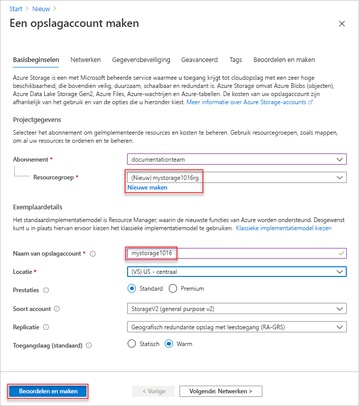
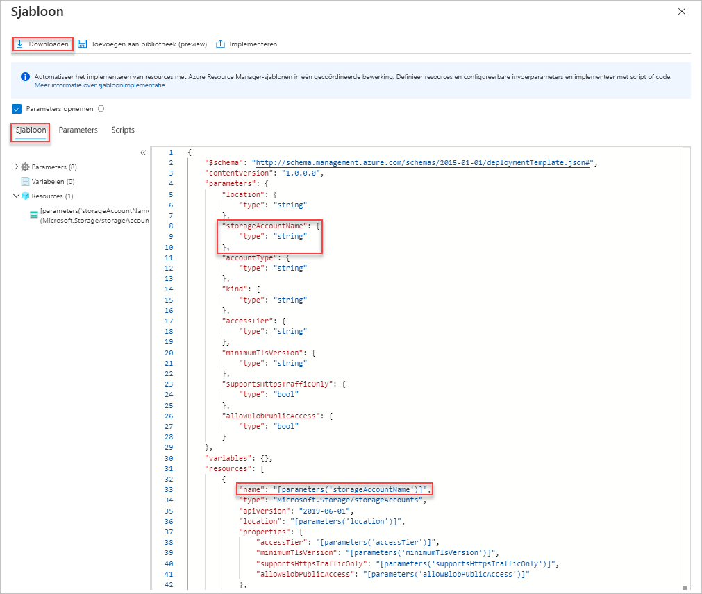
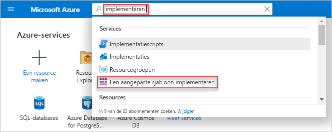

# <a name="quickstart-create-and-deploy-arm-templates-by-using-the-azure-portal"></a>Snelstartgids: ARM-sjablonen maken en implementeren met behulp van de Azure Portal

Meer informatie over het genereren van een Azure Resource Manager-sjabloon (ARM) met behulp van de Azure Portal en het proces voor het bewerken en implementeren van de sjabloon vanuit de portal. ARM-sjablonen zijn JSON-bestanden waarmee de resources worden gedefinieerd die u voor uw oplossing moet implementeren. Zie [overzicht van sjabloon implementatie](overview.md)voor meer informatie over de concepten van het implementeren en beheren van uw Azure-oplossingen.


Na het voltooien van de zelfstudie implementeert u een Azure Storage-account. Hetzelfde proces kan worden gebruikt voor het implementeren van andere Azure-resources.

Als u nog geen abonnement op Azure hebt, [Maak dan een gratis account](https://azure.microsoft.com/free/) aan voordat u begint.

## <a name="generate-a-template-using-the-portal"></a>Een sjabloon maken via de portal

Het maken van een ARM-sjabloon helemaal geen eenvoudige taak is, met name als u geen ervaring hebt met Azure-implementatie en u niet bekend bent met de JSON-indeling. Met behulp van de Azure-portal kunt u een resource configureren, bijvoorbeeld een Azure Storage-account. Voordat u de resource implementeert, kunt u uw configuratie exporteren naar een sjabloon. U kunt de sjabloon opslaan voor later gebruik.

Veel ervaren sjabloon ontwikkelaars gebruiken deze methode om sjablonen te genereren wanneer ze proberen om Azure-resources te implementeren die ze niet kennen. Zie [resource groepen exporteren naar sjablonen](../management/manage-resource-groups-portal.md#export-resource-groups-to-templates)voor meer informatie over het exporteren van sjablonen met behulp van de portal. De andere manier om een werk sjabloon te vinden, is vanuit [Azure Quick](https://azure.microsoft.com/resources/templates/)start-sjablonen.

1. Ga in een webbrowser naar de [Azure Portal](https://portal.azure.com) en meld u aan.
1. Selecteer in het menu Azure Portal de optie **een resource maken**.

    

1. Selecteer **opslag** > **opslag account**.

    
1. Voer de volgende informatie in:

    |Naam|Waarde|
    |----|----|
    |**Resourcegroep**|Selecteer **Nieuwe maken** en geef een resourcegroepnaam naar keuze op. In de schermafbeelding is de naam van de resourcegroep *mystorage1016rg*. Een resourcegroep is een container voor Azure-resources. Een resourcegroep maakt het gemakkelijker Azure-resources te beheren. |
    |**Naam**|geef uw opslagaccount een unieke naam. De naam van het opslag account moet uniek zijn binnen Azure en mag alleen kleine letters en cijfers bevatten. De naam moet tussen de 3 en 24 tekens lang zijn. Als er een fout bericht wordt weer gegeven met de melding ' de naam van het opslag account ' mystorage1016 ' is al aanwezig ', gebruikt ** &lt;u uw naam>opslag&lt;op de huidige datum in MMDD>**, bijvoorbeeld **johndolestorage1016**. Zie [naamgevings regels en beperkingen](/azure/architecture/best-practices/resource-naming)voor meer informatie.|

    Voor de overige eigenschappen kunt u de standaardwaarden gebruiken.

    

    > [!NOTE]
    > Sommige geëxporteerde sjablonen moeten worden bewerkt voordat u ze implementeren.

1. Selecteer **Controleren + maken** onderaan in het scherm. Selecteer in de volgende stap niet **maken** .
1. Selecteer **Een sjabloon voor automatisering downloaden** onderaan in het scherm. In de portal wordt de gegenereerde sjabloon weergegeven:

    

    In het hoofdvenster wordt de sjabloon getoond. Het is een JSON-bestand met zes elementen van het hoogste niveau: `schema`, `contentVersion`, `parameters`, `variables`, `resources` en `output`. Zie [inzicht krijgen in de structuur en syntaxis van arm-sjablonen](./template-syntax.md) voor meer informatie.

    Er zijn zes parameters gedefinieerd. Een van deze parameters heet **storageAccountName**. In het tweede gemarkeerde gedeelte van de bovenstaande schermopname ziet u hoe u in de sjabloon naar deze parameter kunt verwijzen. In het volgende gedeelte bewerkt u de sjabloon zodat er voor het opslagaccount gebruik wordt gemaakt van een gegenereerde naam.

    In de sjabloon is er één Azure-resource gedefinieerd. Het type is `Microsoft.Storage/storageAccounts`. Bekijk hoe de resource is gedefinieerd en wat de definitie structuur is.
1. Selecteer **downloaden** vanaf de bovenkant van het scherm.
1. Open het gedownloade zip-bestand en sla **sjabloon. json** op uw computer op. In het volgende gedeelte gebruikt u een implementatiehulpprogramma voor sjablonen om de sjabloon te bewerken.
1. Selecteer het tabblad **Parameter** om de waarden te bekijken die u voor de parameters hebt opgegeven. Schrijf deze waarden op. U hebt ze in het volgende gedeelte (bij het implementeren van de sjabloon) weer nodig.

    

    U kunt in deze zelf studie een Azure-opslag account maken met behulp van zowel het sjabloon bestand als het parameter bestand.

## <a name="edit-and-deploy-the-template"></a>De sjabloon bewerken en implementeren

U kunt de Azure-portal gebruiken om eenvoudige wijzigingen door te voeren in sjablonen. In deze snelstart gebruikt u het portalhulpprogramma *Sjabloonimplementatie*. In deze zelfstudie wordt *Sjabloonimplementatie* gebruikt, zodat u de hele zelfstudie kunt doen met behulp van één interface: de Azure-portal. Als u een complexere sjabloon wilt bewerken, kunt u het beste [Visual Studio code](quickstart-create-templates-use-visual-studio-code.md)gebruiken. Dit biedt uitgebreide bewerkings functies.

> [!IMPORTANT]
> De sjabloon implementatie biedt een interface voor het testen van eenvoudige sjablonen. Het is niet raadzaam om deze functie in productie te gebruiken. Sla uw sjablonen in plaats daarvan op in een Azure-opslag account of op een opslag plaats in de bron code, zoals GitHub.

Azure vereist dat elke Azure-service een unieke naam heeft. De implementatie mislukt als u de naam van een opslagaccount invoert dat al bestaat. Om dit probleem te vermijden, voegt u een aanroep naar de sjabloonfunctie `uniquestring()` toe aan de sjabloon om een unieke naam voor de opslagaccount te genereren.

1. Selecteer in het menu Azure Portal of op de **Introductie** pagina de optie **een resource maken**.
1. In **Marketplace doorzoeken** typt u **sjabloonimplementatie**. Druk vervolgens op **ENTER**.
1. Selecteer **Sjabloonimplementatie**.

    
1. Selecteer **Maken**.
1. Selecteer **Bouw uw eigen sjabloon in de editor**.
1. Selecteer **Bestand laden** en volg de instructies voor het laden van het bestand template.json dat u in het vorige gedeelte hebt gedownload.
1. Breng de volgende drie wijzigingen aan in de sjabloon:

    

   - Verwijder de para meter **storageAccountName** zoals weer gegeven in de vorige scherm afbeelding.
   - Voeg een variabele met de naam **storageAccountName** toe, zoals wordt weer gegeven in de vorige scherm afbeelding:

       ```json
       "storageAccountName": "[concat(uniqueString(subscription().subscriptionId), 'storage')]"
       ```

       Er worden hier twee sjabloonfuncties gebruikt: `concat()` en `uniqueString()`.
   - Werk het naamelement bij van de resource **Microsoft.Storage/storageAccounts** voor gebruik van de nieuw gedefinieerde variabele in plaats van de parameter:

       ```json
       "name": "[variables('storageAccountName')]",
       ```

     De uiteindelijke sjabloon moet er als volgt uitzien:

     ```json
     {
       "$schema": "https://schema.management.azure.com/schemas/2015-01-01/deploymentTemplate.json#",
       "contentVersion": "1.0.0.0",
       "parameters": {
           "location": {
               "type": "string"
           },
           "accountType": {
               "type": "string"
           },
           "kind": {
               "type": "string"
           },
           "accessTier": {
               "type": "string"
           },
           "supportsHttpsTrafficOnly": {
               "type": "bool"
           }
       },
       "variables": {
           "storageAccountName": "[concat(uniqueString(subscription().subscriptionId), 'storage')]"
       },
       "resources": [
           {
               "name": "[variables('storageAccountName')]",
               "type": "Microsoft.Storage/storageAccounts",
               "apiVersion": "2018-07-01",
               "location": "[parameters('location')]",
               "properties": {
                   "accessTier": "[parameters('accessTier')]",
                   "supportsHttpsTrafficOnly": "[parameters('supportsHttpsTrafficOnly')]"
               },
               "dependsOn": [],
               "sku": {
                   "name": "[parameters('accountType')]"
               },
               "kind": "[parameters('kind')]"
           }
       ],
       "outputs": {}
     }
     ```
1. Selecteer **Opslaan**.
1. Voer de volgende waarden in:

    |Naam|Waarde|
    |----|----|
    |**Resourcegroep**|Selecteer de naam van de resource groep die u in de laatste sectie hebt gemaakt. |
    |**Locatie**|Selecteer een locatie voor het opslag account. Bijvoorbeeld **VS - centraal**. |
    |**Account type**|voer voor deze snelstart **Standard_LRS** in. |
    |**Type**|voer voor deze snelstart **StorageV2** in. |
    |**Toegangs niveau**|voer voor deze snelstart **Dynamisch** in. |
    |**HTTPS-verkeer is alleen ingeschakeld**| Selecteer voor deze snelstart **true**. |
    |**Ik ga akkoord met de bovenstaande voor waarden**|uitgeschakeld|

    Dit is een schermafbeelding van een voorbeeldimplementatie:

    

1. Selecteer **Aankoop**.
1. Selecteer het belpictogram (meldingen) boven in het scherm om de implementatiestatus te zien. U ziet **Implementatie wordt uitgevoerd**. Wacht tot de implementatie is voltooid.

    

1. Selecteer **Ga naar de resourcegroep** in het deelvenster meldingen. U ziet een scherm dat vergelijkbaar is met:

    

    U ziet dat de status van de implementatie is voltooid en er slechts één opslagaccount in de resourcegroep is. De naam van het opslagaccount is een unieke tekenreeks gegenereerd door de sjabloon. Zie voor meer informatie over het gebruik van Azure storage-accounts [Snelstart: blobs uploaden, downloaden, en noteren met behulp van de Azure Portal](../../storage/blobs/storage-quickstart-blobs-portal.md).

## <a name="clean-up-resources"></a>Resources opschonen

Schoon de geïmplementeerd Azure-resources, wanneer u deze niet meer nodig hebt, op door de resourcegroep te verwijderen.

1. Selecteer **Resourcegroep** in het linkermenu van Azure Portal.
1. Voer de naam van de resourcegroep in het veld **Filter by name** in.
1. Selecteer de naam van de resourcegroep.  U ziet het opslagaccount in de resourcegroep.
1. Selecteer **Resourcegroep verwijderen** in het bovenste menu.

## <a name="next-steps"></a>Volgende stappen

In deze zelfstudie hebt u geleerd hoe u een sjabloon genereert in Azure Portal en hoe u de sjabloon via de portal implementeert. De gebruikte sjabloon in deze snelstart is een eenvoudige sjabloon met één Azure-resource. Als de sjabloon complex is, kunt u beter Visual Studio Code of Visual Studio gebruiken om de sjabloon te ontwikkelen. Zie voor meer informatie over het ontwikkelen van sjablonen onze nieuwe zelf studie reeks voor beginners:

> [!div class="nextstepaction"]
> [Zelfstudies voor beginners](./template-tutorial-create-first-template.md)