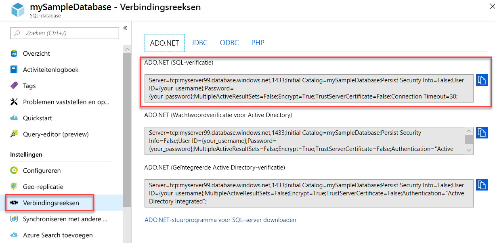

# <a name="quickstart-use-net-core-c-to-query-a-database-in-azure-sql-database-or-azure-sql-managed-instance"></a>Quickstart: .NET Core (C#) gebruiken om een query uit te voeren op een database in Azure SQL Database of Azure SQL Managed Instance
[!INCLUDE[appliesto-sqldb-sqlmi](../includes/appliesto-sqldb-sqlmi.md)]

In deze quickstart gebruikt u [.NET Core](https://www.microsoft.com/net/) en C#-code om verbinding te maken met een database. Vervolgens moet u een Transact-SQL-instructie uitvoeren om een query op gegevens uit te voeren.

> [!TIP]
> In de volgende Microsoft-leermodule leert u gratis [Een ASP.NET-toepassing ontwikkelen en configureren die een query uitvoert op een Azure SQL Database](https://docs.microsoft.com/learn/modules/develop-app-that-queries-azure-sql/)

## <a name="prerequisites"></a>Vereisten

U hebt het volgende nodig om deze quickstart te voltooien:

- Een Azure-account met een actief abonnement. [Gratis een account maken](https://azure.microsoft.com/free/?ref=microsoft.com&utm_source=microsoft.com&utm_medium=docs&utm_campaign=visualstudio)
- Een database. U kunt een van deze quickstarts gebruiken om een database te maken en vervolgens te configureren:

  | Bewerking | SQL Database | SQL Managed Instance | SQL Server op virtuele Azure-machine |
  |:--- |:--- |:---|:---|
  | Maken| [Portal](single-database-create-quickstart.md) | [Portal](../managed-instance/instance-create-quickstart.md) | [Portal](../virtual-machines/windows/sql-vm-create-portal-quickstart.md)
  || [CLI](scripts/create-and-configure-database-cli.md) | [CLI](https://medium.com/azure-sqldb-managed-instance/working-with-sql-managed-instance-using-azure-cli-611795fe0b44) |
  || [PowerShell](scripts/create-and-configure-database-powershell.md) | [PowerShell](../managed-instance/scripts/create-configure-managed-instance-powershell.md) | [PowerShell](../virtual-machines/windows/sql-vm-create-powershell-quickstart.md)
  | Configureren | [IP-firewallregel op serverniveau](firewall-create-server-level-portal-quickstart.md)| [Connectiviteit vanaf een VM](../managed-instance/connect-vm-instance-configure.md)|
  |||[Connectiviteit vanaf on-premises](../managed-instance/point-to-site-p2s-configure.md) | [Verbinding maken met een SQL Server-exemplaar](../virtual-machines/windows/sql-vm-create-portal-quickstart.md)
  |Gegevens laden|Adventure Works geladen volgens de quickstart|[Wide World Importers herstellen](../managed-instance/restore-sample-database-quickstart.md) | [Wide World Importers herstellen](../managed-instance/restore-sample-database-quickstart.md) |
  |||Adventure Works herstellen of importeren uit een [BACPAC](database-import.md)-bestand vanuit [GitHub](https://github.com/Microsoft/sql-server-samples/tree/master/samples/databases/adventure-works)| Adventure Works herstellen of importeren uit een [BACPAC](database-import.md)-bestand vanuit [GitHub](https://github.com/Microsoft/sql-server-samples/tree/master/samples/databases/adventure-works)|
  |||

  > [!IMPORTANT]
  > De scripts in dit artikel zijn geschreven voor gebruik met de Adventure Works-database. Met een met SQL beheerd exemplaar moet u de Adventure Works-database in een exemplaardatabase importeren of de scripts in dit artikel wijzigen zodat deze de Wide World Importers-database gebruiken.

- [.NET Core voor uw besturingssysteem](https://www.microsoft.com/net/core) moet zijn geïnstalleerd.

> [!NOTE]
> In deze snelstartgids wordt gebruik gemaakt van de *mySampleDatabase*-database. Als u een andere database wilt gebruiken, moet u de databaseverwijzingen wijzigen en de `SELECT`-query aanpassen in de C#-code.

## <a name="get-server-connection-information"></a>Serververbindingsgegevens ophalen

Haal de verbindingsgegevens op die u nodig hebt om verbinding te maken met de database in Azure SQL Database. U hebt de volledig gekwalificeerde servernaam of hostnaam, databasenaam en aanmeldingsgegevens nodig voor de volgende procedures.

1. Meld u aan bij de [Azure-portal](https://portal.azure.com/).

2. Navigeer naar de pagina **SQL Databases** of **SQL Managed Instances**.

3. Bekijk op de pagina **Overzicht** de volledig gekwalificeerde servernaam naast **Servernaam** voor de database in Azure SQL Database, of de volledig gekwalificeerde servernaam (of het IP-adres) naast **Host** voor een met Azure SQL beheerd exemplaar of SQL Server op een Azure-VM. Als u de servernaam of hostnaam wilt kopiëren, plaatst u de muisaanwijzer erboven en selecteert u het pictogram **Kopiëren**.

> [!NOTE]
> Zie [Verbinding met een SQL Server-exemplaar](../virtual-machines/windows/sql-vm-create-portal-quickstart.md#connect-to-sql-server) voor meer informatie over de verbinding van SQL Server op een Azure-VM.

## <a name="get-adonet-connection-information-optional---sql-database-only"></a>ADO.NET-verbindingsgegevens ophalen (optioneel - alleen SQL Database)

1. Navigeer naar de pagina **mySampleDatabase** en selecteer vervolgens onder **Instellingen** de optie **Verbindingsreeksen**.

2. Bekijk de volledige **ADO.NET**-verbindingsreeks.

    

3. Kopieer de **ADO.NET**-verbindingsreeks als u van plan bent om deze te gebruiken.
  
## <a name="create-a-new-net-core-project"></a>Een nieuw .NET Core-project maken

1. Open een opdrachtprompt en maak een map met de naam **sqltest**. Navigeer naar deze map en voer deze opdracht uit.

    ```cmd
    dotnet new console
    ```

    Met deze opdracht maakt u nieuwe app-projectbestanden, waaronder een eerste C#-codebestand (**Program.cs**), een XML-configuratiebestand (**sqltest.csproj**) en de benodigde binaire bestanden.

2. Open **sqltest.csproj** in een teksteditor en plak de volgende XML-code tussen de `<Project>`-tags. Met deze XML-code voegt u `System.Data.SqlClient` toe als een afhankelijkheid.

    ```xml
    <ItemGroup>
        <PackageReference Include="System.Data.SqlClient" Version="4.6.0" />
    </ItemGroup>
    ```

## <a name="insert-code-to-query-the-database-in-azure-sql-database"></a>Code invoegen om query's uit te voeren op de database in Azure SQL Database

1. Open **Program.cs** in een teksteditor.

2. Vervang de inhoud door de volgende code en voeg de juiste waarden toe voor de server, de database, de gebruikersnaam en het wachtwoord.

> [!NOTE]
> Als u een ADO.NET-verbindingsreeks wilt gebruiken, vervangt u de vier regels in de code waarmee de server, de database, de gebruikersnaam en het wachtwoord worden ingesteld door de onderstaande regel. Stel in de verbindingsreeks uw gebruikersnaam en wachtwoord in.
>
>    `builder.ConnectionString="<your_ado_net_connection_string>";`

```csharp
using System;
using System.Data.SqlClient;
using System.Text;

namespace sqltest
{
    class Program
    {
        static void Main(string[] args)
        {
            try 
            { 
                SqlConnectionStringBuilder builder = new SqlConnectionStringBuilder();

                builder.DataSource = "<your_server.database.windows.net>"; 
                builder.UserID = "<your_username>";            
                builder.Password = "<your_password>";     
                builder.InitialCatalog = "<your_database>";
         
                using (SqlConnection connection = new SqlConnection(builder.ConnectionString))
                {
                    Console.WriteLine("\nQuery data example:");
                    Console.WriteLine("=========================================\n");
                    
                    connection.Open();       
                    StringBuilder sb = new StringBuilder();
                    sb.Append("SELECT TOP 20 pc.Name as CategoryName, p.name as ProductName ");
                    sb.Append("FROM [SalesLT].[ProductCategory] pc ");
                    sb.Append("JOIN [SalesLT].[Product] p ");
                    sb.Append("ON pc.productcategoryid = p.productcategoryid;");
                    String sql = sb.ToString();

                    using (SqlCommand command = new SqlCommand(sql, connection))
                    {
                        using (SqlDataReader reader = command.ExecuteReader())
                        {
                            while (reader.Read())
                            {
                                Console.WriteLine("{0} {1}", reader.GetString(0), reader.GetString(1));
                            }
                        }
                    }                    
                }
            }
            catch (SqlException e)
            {
                Console.WriteLine(e.ToString());
            }
            Console.WriteLine("\nDone. Press enter.");
            Console.ReadLine(); 
        }
    }
}
```

## <a name="run-the-code"></a>De code uitvoeren

1. Voer in de prompt de volgende opdrachten uit.

   ```cmd
   dotnet restore
   dotnet run
   ```

2. Controleer of de bovenste twintig rijen worden geretourneerd.

   ```text
   Query data example:
   =========================================

   Road Frames HL Road Frame - Black, 58
   Road Frames HL Road Frame - Red, 58
   Helmets Sport-100 Helmet, Red
   Helmets Sport-100 Helmet, Black
   Socks Mountain Bike Socks, M
   Socks Mountain Bike Socks, L
   Helmets Sport-100 Helmet, Blue
   Caps AWC Logo Cap
   Jerseys Long-Sleeve Logo Jersey, S
   Jerseys Long-Sleeve Logo Jersey, M
   Jerseys Long-Sleeve Logo Jersey, L
   Jerseys Long-Sleeve Logo Jersey, XL
   Road Frames HL Road Frame - Red, 62
   Road Frames HL Road Frame - Red, 44
   Road Frames HL Road Frame - Red, 48
   Road Frames HL Road Frame - Red, 52
   Road Frames HL Road Frame - Red, 56
   Road Frames LL Road Frame - Black, 58
   Road Frames LL Road Frame - Black, 60
   Road Frames LL Road Frame - Black, 62

   Done. Press enter.
   ```

3. Kies **Enter** om het toepassingsvenster te sluiten.

## <a name="next-steps"></a>Volgende stappen

- [Aan de slag met .NET Core in Windows/Linux/macOS met behulp van de opdrachtregel ](/dotnet/core/tutorials/using-with-xplat-cli).
- Meer informatie over [verbinding maken met en een query uitvoeren in Azure SQL Database of Azure SQL Managed Instance, met behulp van .NET Framework en Visual Studio](connect-query-dotnet-visual-studio.md).  
- Meer informatie over [Uw eerste database ontwerpen met behulp van SSMS](design-first-database-tutorial.md) of [Een database ontwerpen en hiermee verbinding maken met behulp van C# en ADO.NET](design-first-database-csharp-tutorial.md).
- Raadpleeg de [.NET-documentatie](https://docs.microsoft.com/dotnet/) voor meer informatie over .NET.
