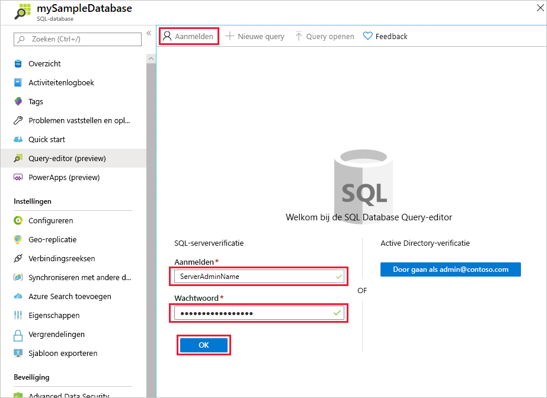
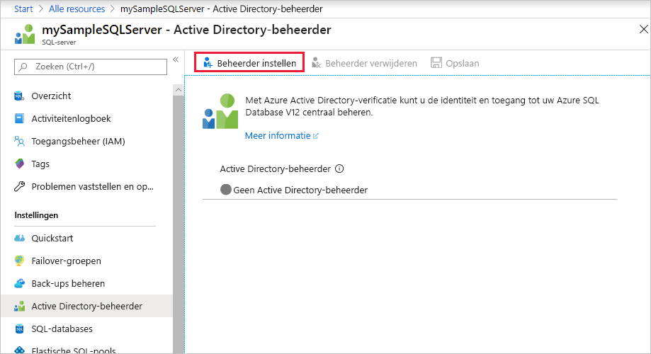
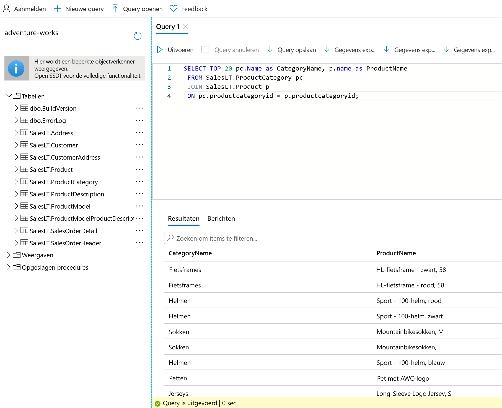

# <a name="quickstart-use-the-azure-portals-query-editor-preview-to-query-an-azure-sql-database"></a>Quickstart: De Query-editor (preview) van de Azure Portal gebruiken om een query uit te voeren op Azure SQL Database
[!INCLUDE[appliesto-sqldb](../includes/appliesto-sqldb.md)]

De Query-editor is een hulpprogramma in de Azure-portal voor het uitvoeren van SQL-query's op uw database in Azure SQL Database of uw datawarehouse in Azure Synapse Analytics. 

In deze snelstart gebruikt u de Query-editor om Transact-SQL-query's (T-SQL) uit te voeren op een database.

## <a name="prerequisites"></a>Vereisten

Voor het voltooien van deze snelstart is de voorbeelddatabase AdventureWorksLT vereist. Als u geen werkende kopie van de voorbeelddatabase AdventureWorksLT in SQL Database hebt, wordt er in de volgende snelstart snel een gemaakt:

- [Snelstart: Maak een afzonderlijke Azure SQL Database met de Azure Portal, PowerShell of Azure CLI](single-database-create-quickstart.md) 

### <a name="configure-network-settings"></a>Netwerkinstellingen configureren

Als u een van de volgende fouten ontvangt in de Query-editor: *De instellingen van uw lokale netwerk verhinderen mogelijk dat de Query-editor query's kan uitgeven. Klik hier voor instructies over het configureren van uw netwerkinstellingen*, of *Kan geen verbinding met de server tot stand brengen. Dit kan duiden op een probleem met uw lokale firewallconfiguratie of de proxy-instellingen van uw netwerk*, de volgende belangrijke informatie moet het probleem helpen oplossen:

> [!IMPORTANT]
> De Query-editor gebruikt de poorten 443 en 1443 om te communiceren. Zorg ervoor dat u het uitgaande HTTPS-verkeer op deze poorten hebt ingeschakeld. U moet ook [uw uitgaande IP-adres toevoegen aan de toegestane firewallregels van de server](firewall-create-server-level-portal-quickstart.md) voor toegang tot uw databases en datawarehouses.


## <a name="open-the-sql-database-query-editor"></a>De SQL Database Query-editor openen

1. Meld u aan bij de [Azure portal](https://portal.azure.com/) en selecteer de database waarvoor u een query wilt uitvoeren.

2. Selecteer in het menu **SQL database** **Query-editor (preview)** .

    


## <a name="establish-a-connection-to-the-database"></a>Verbinding met de database tot stand brengen

Zelfs al bent u aangemeld bij de portal, moet u nog steeds referenties opgeven voor toegang tot de database. U kunt verbinding maken met behulp van SQL-verificatie of Azure Active Directory om verbinding te maken met uw database.

### <a name="connect-using-sql-authentication"></a>Verbinding maken met behulp van SQL-verificatie

1. Voer op de pagina **Aanmeldings** onder **SQL Server-verificatie**een **Aanmelding** en **Wachtwoord** in voor een gebruiker die toegang heeft tot de database. Als u niet zeker bent, gebruikt u de aanmelding en het wachtwoord voor de Serverbeheerder van de server van de database.

    

2. Selecteer **OK**.


### <a name="connect-using-azure-active-directory"></a>Verbinding maken met Azure Active Directory

Als u een Azure Active Directory-beheerder (Azure AD) instelt, kunt u gebruikmaken van één identiteit om u aan te melden bij de Azure Portal en uw database. Als u verbinding wilt maken met uw database met behulp van Azure AD, volgt u de onderstaande stappen om een Azure AD-beheerder te configureren voor uw SQL Server-exemplaar.

> [!NOTE]
> * E-mailaccounts (bijvoorbeeld outlook.com, gmail.com, yahoo.com, enzovoort) worden nog niet ondersteund als Azure AD-beheerders. Kies een gebruiker die ofwel systeemeigen is gemaakt in de Azure AD ofwel federatief in de Azure AD.
> * Azure AD-beheerdersaanmelding werkt niet met accounts waarvoor tweeledige verificatie is ingeschakeld.

#### <a name="set-an-active-directory-admin-for-the-server"></a>Een Active Directory-beheerder voor de server instellen

1. Selecteer in de Azure portal uw SQL Server-exemplaar.

2. Selecteer in het menu **SQL-server** de optie **Active Directory-beheerder**.

3. Op de SQL Server **Active Directory-beheerder** paginawerkbalk selecteert u **Beheerder instellen** en kies de gebruiker of groep als uw Azure AD-beheerder.

    

4. Voer op de pagina **Beheerder toevoegen** in het zoekvak een gebruiker of groep in die u wilt zoeken, selecteer deze als beheerder en klik vervolgens op de knop **Selecteren**.

5. Selecteer op de paginawerkbalk SQL Server **Active Directory-beheerder** **Opslaan**.

### <a name="connect-to-the-database"></a>Verbinding maken met de database

6. Selecteer in het menu **SQL-server** **SQL-databases**en selecteer vervolgens uw database.

7. Selecteer in het menu **SQL database** **Query-editor (preview)** . Op de pagina **Aanmelding**, onder het label **Active Directory-verificatie**, wordt een bericht weergegeven met de melding dat u bent aangemeld als u een Azure AD-beheerder bent. Klik vervolgens op de knop **Doorgaan als** *\<your user or group ID>* . Als de pagina aangeeft dat u niet bent aangemeld, moet u de pagina mogelijk vernieuwen.

## <a name="query-a-database-in-sql-database"></a>Een query uitvoeren op een database in SQL Database

De volgende voorbeeld query's moeten worden uitgevoerd op basis van de voorbeelddatabase AdventureWorksLT.

### <a name="run-a-select-query"></a>Een query SELECT uitvoeren

1. Plak de volgende query in de Query-editor:

   ```sql
    SELECT TOP 20 pc.Name as CategoryName, p.name as ProductName
    FROM SalesLT.ProductCategory pc
    JOIN SalesLT.Product p
    ON pc.productcategoryid = p.productcategoryid;
   ```

2. Selecteer **Uitvoeren** en bekijk de uitvoer in het deelvenster **Resultaten**.

   

3. U kunt de query ook opslaan als een .sql-bestand of de geretourneerde gegevens exporteren als een .json-, csv- of xml-bestand.

### <a name="run-an-insert-query"></a>Een query INSERT uitvoeren

Voer de volgende T-SQL-instructie [INSERT](/sql/t-sql/statements/insert-transact-sql/) uit om een nieuw product toe in de `SalesLT.Product`tabel toe te voegen.

1. Vervang de vorige query door deze.

    ```sql
    INSERT INTO [SalesLT].[Product]
           ( [Name]
           , [ProductNumber]
           , [Color]
           , [ProductCategoryID]
           , [StandardCost]
           , [ListPrice]
           , [SellStartDate]
           )
    VALUES
           ('myNewProduct'
           ,123456789
           ,'NewColor'
           ,1
           ,100
           ,100
           ,GETDATE() );
   ```


2. Selecteer **Uitvoeren** om een nieuwe rij in te voegen in de tabel `Product`. Het deelvenster **Berichten** toont **Query voltooid: Betroffen rijen: 1**.


### <a name="run-an-update-query"></a>Een query UPDATE uitvoeren

Voer de volgende T-SQL-instructie [UPDATE](/sql/t-sql/queries/update-transact-sql/) uit om uw nieuwe product te wijzigen.

1. Vervang de vorige query door deze.

   ```sql
   UPDATE [SalesLT].[Product]
   SET [ListPrice] = 125
   WHERE Name = 'myNewProduct';
   ```

2. Selecteer **Uitvoeren** om de opgegeven rij in de tabel `Product` bij te werken. Het deelvenster **Berichten** toont **Query voltooid: Betroffen rijen: 1**.

### <a name="run-a-delete-query"></a>Een query DELETE uitvoeren

Gebruik de volgende T-SQL-instructie [DELETE](/sql/t-sql/statements/delete-transact-sql/) uit om uw nieuwe product te verwijderen.

1. Vervang de vorige query door deze:

   ```sql
   DELETE FROM [SalesLT].[Product]
   WHERE Name = 'myNewProduct';
   ```

2. Selecteer **Uitvoeren** om de opgegeven rij in de tabel `Product` te verwijderen. Het deelvenster **Berichten** toont **Query voltooid: Betroffen rijen: 1**.


## <a name="query-editor-considerations"></a>Overwegingen met betrekking tot de queryeditor

U moet enkele dingen weten voordat u met de queryeditor gaat werken.

* De Query-editor gebruikt de poorten 443 en 1443 om te communiceren. Zorg ervoor dat u het uitgaande HTTPS-verkeer op deze poorten hebt ingeschakeld. U moet ook uw uitgaande IP-adres toevoegen aan de toegestane firewallregels van de server voor toegang tot uw databases en datawarehouses.

* Als u een verbinding Private Link hebt, werkt de Query-editor zonder dat u het IP-adres van de client hoeft toe te voegen aan de firewall van de SQL Database.

* Wanneer u op **F5** drukt, wordt de pagina van de Query-editor vernieuwd en gaan query's waaraan wordt gewerkt, verloren.

* De query-editor biedt geen ondersteuning voor het maken van verbinding met de `master`-database.

* Er is een time-out van vijf minuten voor uitvoering van de query.

* De queryeditor ondersteunt alleen cilindrische projectie voor geografiegegevenstypen.

* Er is geen ondersteuning voor IntelliSense voor databasetabellen en -weergaven, maar de editor ondersteunt wel automatisch aanvullen op namen die al zijn getypt.


## <a name="next-steps"></a>Volgende stappen

Zie [Transact-SQL-verschillen oplossen tijdens migratie naar SQL Database](transact-sql-tsql-differences-sql-server.md) voor informatie over de Transact-SQL (T-SQL) die in Azure SQL-database wordt ondersteund.
