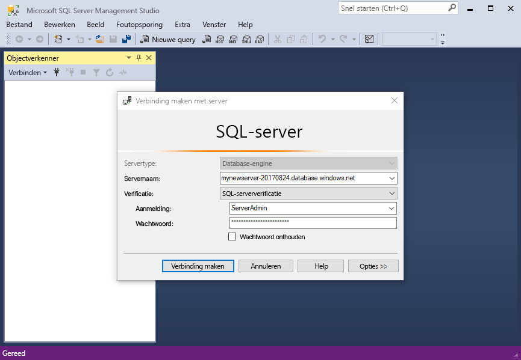
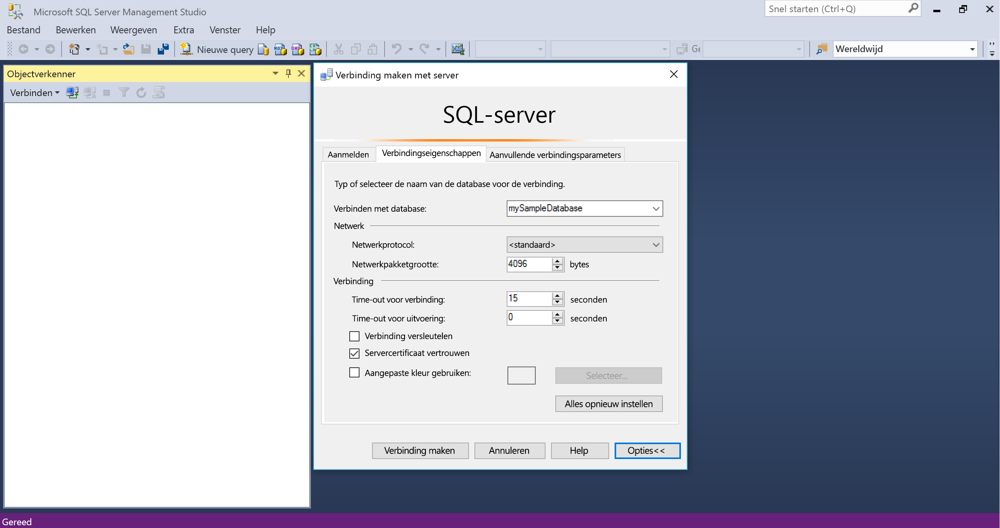
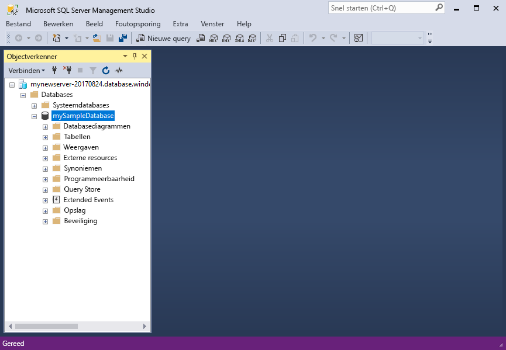
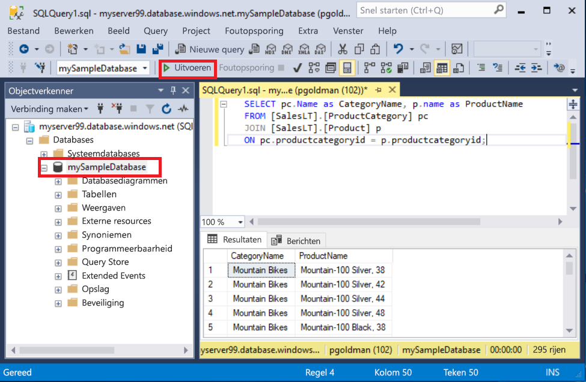
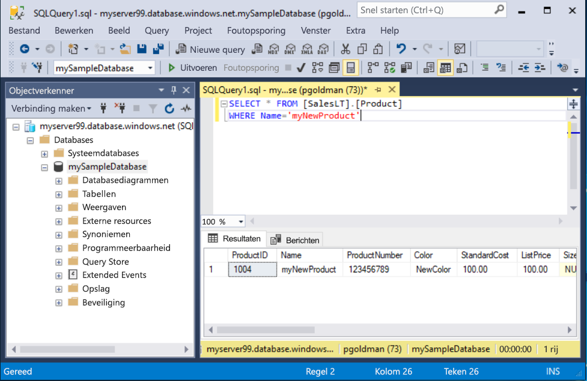

# <a name="quickstart-use-ssms-to-connect-to-and-query-azure-sql-database-or-azure-sql-managed-instance"></a>Quickstart: Verbinding maken met en query uitvoeren in Azure SQL Database of Azure SQL Managed Instance met behulp van SSMS
[!INCLUDE[appliesto-sqldb-sqlmi](../includes/appliesto-sqldb-sqlmi.md)]

In deze quickstart leert u hoe u SQL Server Management Studio (SSMS) kunt gebruiken om verbinding te maken met Azure SQL Database of Azure SQL Managed Instance en voert u enkele query's uit.

## <a name="prerequisites"></a>Vereisten

Om deze quickstart te voltooien, hebt u de volgende items nodig:

- [SQL Server Management Studio (SSMS)](/sql/ssms/download-sql-server-management-studio-ssms/).

- Een database in Azure SQL Database. U kunt een van deze quickstarts gebruiken om een database te maken en vervolgens te configureren in Azure SQL Database:

  | Bewerking | SQL Database | SQL Managed Instance | SQL Server op virtuele Azure-machine |
  |:--- |:--- |:---|:---|
  | Maken| [Portal](single-database-create-quickstart.md) | [Portal](../managed-instance/instance-create-quickstart.md) | [Portal](../virtual-machines/windows/sql-vm-create-portal-quickstart.md)
  || [CLI](scripts/create-and-configure-database-cli.md) | [CLI](https://medium.com/azure-sqldb-managed-instance/working-with-sql-managed-instance-using-azure-cli-611795fe0b44) |
  || [PowerShell](scripts/create-and-configure-database-powershell.md) | [PowerShell](../managed-instance/scripts/create-configure-managed-instance-powershell.md) | [PowerShell](../virtual-machines/windows/sql-vm-create-powershell-quickstart.md)
  | Configureren | [IP-firewallregel op serverniveau](firewall-create-server-level-portal-quickstart.md)| [Connectiviteit vanaf een VM](../managed-instance/connect-vm-instance-configure.md)|
  |||[Connectiviteit vanaf locatie](../managed-instance/point-to-site-p2s-configure.md) | [Verbinding maken met SQL Server](../virtual-machines/windows/sql-vm-create-portal-quickstart.md)
  |Gegevens laden|Adventure Works geladen volgens de quickstart|[Wide World Importers herstellen](../managed-instance/restore-sample-database-quickstart.md) | [Wide World Importers herstellen](../managed-instance/restore-sample-database-quickstart.md) |
  |||Adventure Works herstellen of importeren vanuit een [BACPAC](database-import.md)-bestand vanaf [GitHub](https://github.com/Microsoft/sql-server-samples/tree/master/samples/databases/adventure-works)| Adventure Works herstellen of importeren vanuit een [BACPAC](database-import.md)-bestand vanaf [GitHub](https://github.com/Microsoft/sql-server-samples/tree/master/samples/databases/adventure-works)|
  |||

  > [!IMPORTANT]
  > De scripts in dit artikel zijn geschreven voor gebruik met de Adventure Works-database. Met een beheerd exemplaar moet u de Adventure Works-database in een exemplaardatabase importeren of de scripts in dit artikel wijzigen zodat deze de Wide World Importers-database gebruiken.

Als u alleen enkele ad-hoc query's wilt uitvoeren zonder SSMS te installeren, raadpleegt u de [Quickstart: De Query-editor van de Azure Portal gebruiken om een query uit te voeren op een database in Azure SQL Database](connect-query-portal.md).

## <a name="get-server-connection-information"></a>Serververbindingsgegevens ophalen

Haal de verbindingsgegevens op die u nodig hebt om verbinding te maken met uw database. U hebt de volledig gekwalificeerde [server](logical-servers.md)naam of hostnaam, databasenaam en aanmeldingsgegevens nodig om de quickstart te voltooien.

1. Meld u aan bij de [Azure-portal](https://portal.azure.com/).

2. Navigeer naar de **database** of het **beheerde exemplaar** waarop u een query wilt uitvoeren.

3. Bekijk op de pagina **Overzicht** de volledig gekwalificeerde servernaam naast **Servernaam** voor een database in SQL Database, of de volledig gekwalificeerde servernaam (of IP-adres) naast **Host** voor een beheerd exemplaar in SQL Managed Instance of uw SQL Server-exemplaar op uw VM. Als u de servernaam of hostnaam wilt kopiëren, plaatst u de muisaanwijzer erboven en selecteert u het pictogram **Kopiëren**.

> [!NOTE]
> Zie [Verbinding met SQL Server](../virtual-machines/windows/sql-vm-create-portal-quickstart.md#connect-to-sql-server) op Azure VM voor meer informatie over de verbinding van SQL Server op Azure VM

## <a name="connect-to-your-database"></a>Verbinding maken met uw database

Maak een verbinding met de server in SSMS.

> [!IMPORTANT]
> Een server luistert op poort 1433. Om verbinding te maken met een server achter een firewall van het bedrijf, moet de firewall voor deze poort zijn geopend.

1. Open SQL Server Management Studio.

2. Het dialoogvenster **Verbinding maken met server** wordt geopend. Voer de volgende informatie in:

   | Instelling      | Voorgestelde waarde    | Beschrijving |
   | ------------ | ------------------ | ----------- |
   | **Servertype** | Database-engine | Vereiste waarde. |
   | **Servernaam** | De volledig gekwalificeerde servernaam | Zoals bijvoorbeeld: **servername.database.windows.net**. |
   | **Verificatie** | SQL Server-verificatie | In deze zelfstudie wordt gebruik gemaakt van SQL-verificatie. |
   | **Aanmelding** | Gebruikers-id voor het beheerdersaccount voor de server | De gebruikers-id van het serverbeheerdersaccount dat wordt gebruikt voor het maken van de server. |
   | **Wachtwoord** | Het wachtwoord voor het serverbeheerdersaccount | Het wachtwoord van het serverbeheerdersaccount dat wordt gebruikt voor het maken van de server. |
   ||||

     

3. Selecteer **Opties** in het dialoogvenster **Verbinding maken met server**. In de vervolgkeuzelijst **Verbinding maken met database** selecteert u **mySampleDatabase**. Het voltooien van de quickstart in het [gedeelte Vereisten](#prerequisites) maakt een AdventureWorksLT-database met de naam mySampleDatabase. Als uw werkende kopie van de AdventureWorks-database een andere naam heeft dan mySampleDatabase, selecteert u deze in plaats daarvan.

     

4. Selecteer **Verbinden**. Het venster Objectverkenner wordt geopend.

5. Als u de objecten van de database wilt weergeven, vouwt u **Databases** uit en vouwt u vervolgens uw databaseknooppunt uit.

     

## <a name="query-data"></a>Querygegevens

Voer deze Transact-SQL [SELECT](/sql/t-sql/queries/select-transact-sql/)-code uit om op categorie een query uit te voeren voor de twintig populairste producten.

1. Klik in Objectverkenner met de rechtermuisknop op **mySampleDatabase** en selecteer vervolgens **Nieuwe query**. Er wordt een nieuw queryvenster geopend dat is verbonden met uw database.

2. Plak in het queryvenster de volgende SQL-query:

   ```sql
   SELECT pc.Name as CategoryName, p.name as ProductName
   FROM [SalesLT].[ProductCategory] pc
   JOIN [SalesLT].[Product] p
   ON pc.productcategoryid = p.productcategoryid;
   ```

3. Selecteer op de werkbalk **Uitvoeren** om de query uit te voeren en gegevens op te halen uit de tabellen `Product` en `ProductCategory`.

    

### <a name="insert-data"></a>Gegevens invoegen

Voer deze Transact-SQL [INSERT](/sql/t-sql/statements/insert-transact-sql/)-code uit om een nieuw product te maken in de tabel `SalesLT.Product`.

1. Vervang de vorige query door deze.

   ```sql
   INSERT INTO [SalesLT].[Product]
           ( [Name]
           , [ProductNumber]
           , [Color]
           , [ProductCategoryID]
           , [StandardCost]
           , [ListPrice]
           , [SellStartDate] )
     VALUES
           ('myNewProduct'
           ,123456789
           ,'NewColor'
           ,1
           ,100
           ,100
           ,GETDATE() );
   ```

2. Selecteer **Uitvoeren** om een nieuwe rij in te voegen in de tabel `Product`. In het deelvenster **Berichten** wordt **(1 rij beïnvloedt)** weergegeven.

#### <a name="view-the-result"></a>Het resultaat weergeven

1. Vervang de vorige query door deze.

   ```sql
   SELECT * FROM [SalesLT].[Product]
   WHERE Name='myNewProduct'
   ```

2. Selecteer **Uitvoeren**. Het volgende resultaat verschijnt.

   

### <a name="update-data"></a>Gegevens bijwerken

Voer deze Transact-SQL [UPDATE](/sql/t-sql/queries/update-transact-sql?view=sql-server-ver15)-code uit om uw nieuwe product te wijzigen.

1. Vervang de vorige query door deze die de nieuwe record retourneert die u eerder hebt gemaakt:

   ```sql
   UPDATE [SalesLT].[Product]
   SET [ListPrice] = 125
   WHERE Name = 'myNewProduct';
   ```

2. Selecteer **Uitvoeren** om de opgegeven rij in de tabel `Product` bij te werken. In het deelvenster **Berichten** wordt **(1 rij beïnvloedt)** weergegeven.

### <a name="delete-data"></a>Gegevens verwijderen

Voer deze Transact-SQL [DELETE](/sql/t-sql/statements/delete-transact-sql/)-code uit om uw nieuwe product te verwijderen.

1. Vervang de vorige query door deze.

   ```sql
   DELETE FROM [SalesLT].[Product]
   WHERE Name = 'myNewProduct';
   ```

2. Selecteer **Uitvoeren** om de opgegeven rij in de tabel `Product` te verwijderen. In het deelvenster **Berichten** wordt **(1 rij beïnvloedt)** weergegeven.

## <a name="next-steps"></a>Volgende stappen

- Zie [SQL Server Management Studio ](/sql/ssms/sql-server-management-studio-ssms/) voor meer informatie over SSMS.
- Als u verbinding wilt maken en query's wilt uitvoeren met Azure Portal, raadpleegt u [Connect and query with the Azure Portal SQL query editor](connect-query-portal.md) (Verbinding maken en query's uitvoeren met de SQL-query-editor in Azure Portal).
- Zie [Verbinding maken en query's uitvoeren met Visual Studio Code](connect-query-vscode.md) als u verbinding wilt maken en query’s wilt uitvoeren met Visual Studio Code.
- Zie [Verbinding maken en query’s uitvoeren met .NET](connect-query-dotnet-visual-studio.md) als u verbinding wilt maken en query’s wilt uitvoeren met .NET.
- Zie [Verbinding maken en query's uitvoeren met PHP](connect-query-php.md) als u verbinding wilt maken en query's wilt uitvoeren met PHP.
- Zie [Verbinding maken en query's uitvoeren met Node.js](connect-query-nodejs.md) als u verbinding wilt maken en query's wilt uitvoeren met Node.js.
- Zie [Verbinding maken en query's uitvoeren met Java](connect-query-java.md) als u verbinding wilt maken en query's wilt uitvoeren met Java.
- Zie [Verbinding maken en query's uitvoeren met Python](connect-query-python.md) als u verbinding wilt maken en query's wilt uitvoeren met Python.
- Zie [Verbinding maken en query's uitvoeren met Ruby](connect-query-ruby.md) als u verbinding wilt maken en query's wilt uitvoeren met Ruby.
