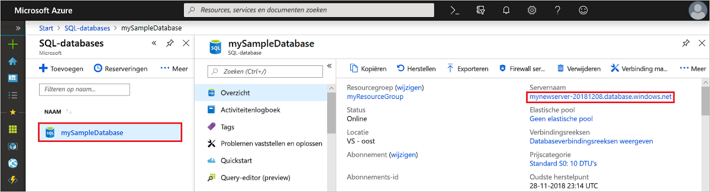

# Quickstart: Een firewallregel op serverniveau maken met behulp van de Azure Portal
[!INCLUDE[appliesto-sqldb](../includes/appliesto-sqldb.md)]

Deze quickstart beschrijft hoe u in Azure SQL Database een [firewallregel op serverniveau](firewall-configure.md) maakt met behulp van de Azure Portal, zodat u verbinding kunt maken met [logische SQL-servers](logical-servers.md), individuele databases en elastische pools en de bijbehorende databases. Een firewallregel is vereist om verbinding te maken vanaf andere Azure-resources en vanaf on-premises bronnen. Firewallregels op serverniveau zijn niet van toepassing op Azure SQL Managed Instance.

## Vereisten

Deze quickstart gebruikt de resources die zijn gemaakt in [Create a single database using the Azure portal](single-database-create-quickstart.md) (Een Azure SQL-database maken in de Azure-portal) als uitgangspunt.

## Aanmelden bij Azure Portal

Meld u aan bij de [Azure-portal](https://portal.azure.com/).

## Een IP-firewallregel op serverniveau maken

 SQL Database maakt een firewall op serverniveau voor individuele en pooldatabases. De firewall voorkomt dat clienttoepassingen verbinding maken met de server of met een individuele database of database in een pool, tenzij u een IP-firewallregel maakt om de firewall te openen. Voor een verbinding vanaf een IP-adres buiten Azure maakt u een firewallregel voor een specifiek IP-adres of bereik van adressen dat toegang mag hebben. Meer informatie over IP-firewallregels op server- en databaseniveau vindt u in [IP-firewallregels op server- en databaseniveau](firewall-configure.md).

> [!NOTE]
> Azure SQL Database communiceert via poort 1433. Als u verbinding probeert te maken vanuit een bedrijfsnetwerk, is uitgaand verkeer via poort 1433 mogelijk niet toegestaan vanwege de firewall van het netwerk. In dat geval kunt u alleen verbinding maken met uw server als uw IT-afdeling poort 1433 openstelt.
> [!IMPORTANT]
> De firewallregel 0.0.0.0 zorgt ervoor dat alle Azure-services voldoen worden aan de firewallregel op serverniveau en proberen om via de server verbinding te maken met een individuele database of pooldatabase.

Volg deze stappen om een IP-firewallregel op serverniveau te maken voor het IP-adres van de client en om connectiviteit via de Azure SQL Database-firewall alleen voor uw IP-adres toe te staan.

1. Wanneer de implementatie van de [database](#prerequisites) is voltooid, selecteert u **SQL-databases** in het menu links en kiest u **mySampleDatabase** op de pagina **SQL-databases**. De overzichtspagina voor uw database wordt geopend, met de volledig gekwalificeerde servernaam (zoals **mynewserver20170824.database.windows.net**) en opties voor verdere configuratie.

2. Kopieer deze volledig gekwalificeerde servernaam zodat u deze kunt gebruiken wanneer u in andere quickstarts verbinding maakt met de server en de bijbehorende databases.

   

3. Selecteer **Serverfirewall instellen** op de werkbalk. De pagina **Firewallinstellingen** voor de server wordt geopend.

   

4. Kies **IP van client toevoegen** op de werkbalk om uw huidige IP-adres toe te voegen aan een nieuwe IP-firewallregel op serverniveau. Een IP-firewallregel op serverniveau kan poort 1433 openen voor een individueel IP-adres of voor een bereik van IP-adressen.

   > [!IMPORTANT]
   > Voor alle Azure-services is standaard toegang via de Azure SQL Database-firewall ingeschakeld. Kies **Aan** op deze pagina als u toegang wilt inschakelen voor alle Azure-services.
   >

5. Selecteer **Opslaan**. Er wordt een IP-firewallregel op serverniveau gemaakt voor uw huidige IP-adres waarbij poort 1433 wordt geopend op de server.

6. Sluit de pagina **Firewallinstellingen**.

Nu kunt u SQL Server Management Studio of een ander hulpprogramma naar keuze gebruiken om vanaf dit IP-adres via het serverbeheerdersaccount dat eerder is gemaakt verbinding te maken met de server en de bijbehorende databases.

## Resources opschonen

Sla deze resources op als u verder wilt gaan met [Volgende stappen](#next-steps) en wilt leren hoe u op verschillende manieren verbinding kunt maken met uw database en deze kunt bevragen. Als u echter de resources wilt verwijderen die u hebt gemaakt in deze quickstart, voert u de volgende stappen uit.

1. Selecteer in het menu links in de Azure-portal **Resourcegroepen** en selecteer vervolgens **myResourceGroup**.
2. Selecteer op de pagina van uw resourcegroep de optie **Verwijderen**, typ **myResourceGroup** in het tekstvak en selecteer **Verwijderen**.

## Volgende stappen

- Nu u een database hebt, kunt u [verbinding maken met een hulpprogramma of taal naar keuze en daarmee query's uitvoeren](connect-query-content-reference-guide.md), waaronder
  - [Verbinding maken en query's uitvoeren met behulp van SQL Server Management Studio](connect-query-ssms.md)
  - [Verbinding maken en query's uitvoeren met behulp van Azure Data Studio](/sql/azure-data-studio/quickstart-sql-database?toc=/azure/sql-database/toc.json)
- Voor informatie over het ontwerpen van uw eerste database, het maken van tabellen en het invoegen van gegevens kunt u een van deze zelfstudies gebruiken:
  - [Uw eerste individuele database in Azure SQL Database ontwerpen met SSMS](design-first-database-tutorial.md)
  - [Een individuele database ontwerpen in Azure SQL Database en verbinden met C# en ADO.NET](design-first-database-csharp-tutorial.md)
