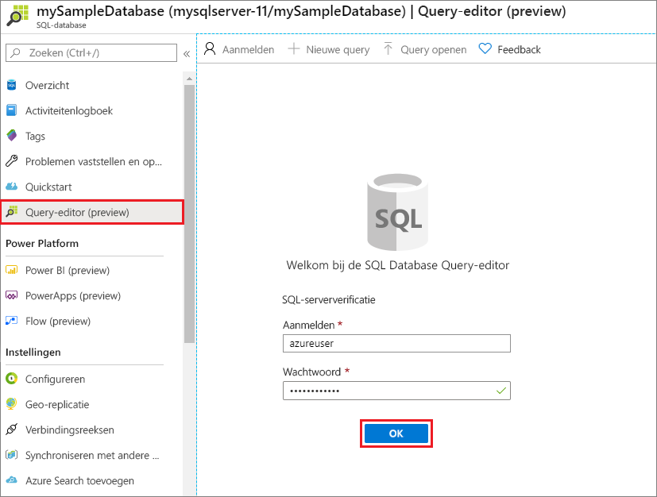
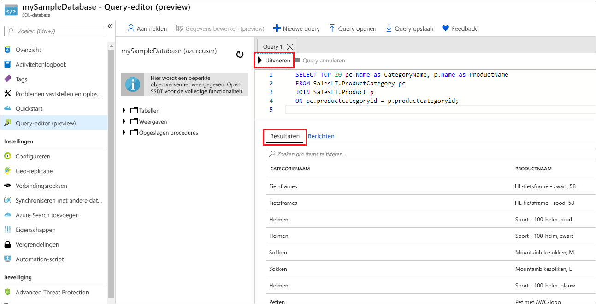

# <a name="quickstart-create-an-azure-sql-database-single-database"></a>Quickstart: Een individuele database maken in Azure SQL Database

In deze quickstart gebruikt u de Azure-portal, een PowerShell-script of een Azure CLI-script om één database in Azure SQL Database te maken. Voer daarna in de Azure Portal een query voor de database uit met de **Query-editor**.

Een [individuele database](single-database-overview.md) is de snelste en eenvoudigste optie voor Azure SQL Database. U beheert een individuele database binnen een [server](logical-servers.md), die zich binnen een [Azure-resourcegroep](../../azure-resource-manager/management/manage-resource-groups-portal.md) in een opgegeven Azure-regio bevindt. In deze quickstart maakt u een nieuwe resourcegroep en server voor de nieuwe database.

U kunt een individuele database maken in de *ingerichte* of *serverloze* berekeningslaag. Aan een ingerichte database is vooraf een vaste hoeveelheid berekeningsresources, inclusief CPU en geheugen, toegewezen, en de database maakt gebruik van een van de volgende twee [aankoopmodellen](purchasing-models.md). In deze quickstart wordt een ingerichte database gemaakt met het aankoopmodel [op basis van vCore](service-tiers-vcore.md), maar u kunt ook een aankoopmodel [op basis van DTU](service-tiers-dtu.md) kiezen.

De serverloze berekeningslaag is alleen beschikbaar in het aankoopmodel op basis van vCore en heeft een automatisch geschaald bereik van berekeningsresources, inclusief CPU en geheugen. Voor meer informatie over het maken van een individuele database in de serverloze berekeningslaag raadpleegt u [Een serverloze database maken](serverless-tier-overview.md#create-a-new-database-in-the-serverless-compute-tier).

## <a name="prerequisite"></a>Vereiste

- Een actief Azure-abonnement. Als u nog geen account hebt, kunt u [een gratis account maken](https://azure.microsoft.com/free/).

## <a name="create-a-single-database"></a>Een individuele database maken

[!INCLUDE [sql-database-create-single-database](../includes/sql-database-create-single-database.md)]

## <a name="query-the-database"></a>Een query uitvoeren op de database

Wanneer de database is gemaakt, kunt u de ingebouwde **Query-editor** in de Azure Portal gebruiken om verbinding te maken met de database en query's uit te voeren op de gegevens.

1. In de portal zoekt en selecteert u **SQL-databases** en selecteert u vervolgens uw database in de lijst.
1. Selecteer op de **SQL Database**-pagina voor uw database in het linkermenu de optie **Query-editor (preview)** .
1. Voer uw aanmeldgegevens als serverbeheerder in en selecteer **OK**.

   

1. Voer de volgende query in het deelvenster **Query-editor** in.

   ```sql
   SELECT TOP 20 pc.Name as CategoryName, p.name as ProductName
   FROM SalesLT.ProductCategory pc
   JOIN SalesLT.Product p
   ON pc.productcategoryid = p.productcategoryid;
   ```

1. Klik op **Uitvoeren** en bekijk de resultaten van de query in het deelvenster **Resultaten**.

   

1. Sluit de pagina **Query-editor** en selecteer **OK** wanneer u wordt gevraagd om uw niet-opgeslagen bewerkingen te verwijderen.

## <a name="clean-up-resources"></a>Resources opschonen

Bewaar de resourcegroep, server en individuele database als u verder wilt gaan met de volgende stappen en wilt leren hoe u op verschillende manieren verbinding kunt maken met uw database en query's kunt uitvoeren.

Wanneer u klaar bent met deze resources, kunt u de resourcegroep die u hebt gemaakt, verwijderen. U verwijdert daarmee ook de server en individuele database in die groep.

### <a name="the-azure-portal"></a>[Azure Portal](#tab/azure-portal)

Zo verwijdert u **myResourceGroup** en alle bijbehorende resources met behulp van de Azure Portal:

1. Selecteer in de Azure Portal **Resourcegroepen** en selecteer **myResourceGroup** in de lijst.
1. Selecteer **Resourcegroep verwijderen** op de pagina van de resourcegroep.
1. Typ *myResourceGroup* onder **Typ de naam van de resourcegroep** en selecteer **Verwijderen**.

### <a name="the-azure-cli"></a>[De Azure CLI](#tab/azure-cli)

Als u de resourcegroep inclusief alle resources wilt verwijderen, voert u de volgende Azure CLI-opdracht uit met de naam van uw resourcegroep:

```azurecli-interactive
az group delete --name <your resource group>
```

### <a name="powershell"></a>[PowerShell](#tab/azure-powershell)

Als u de resourcegroep inclusief alle resources wilt verwijderen, voert u de PowerShell-cmdlet uit met de naam van de resourcegroep:

```azurepowershell-interactive
Remove-AzResourceGroup -Name <your resource group>
```

---

## <a name="next-steps"></a>Volgende stappen

Verschillende hulpprogramma's en talen gebruiken om [verbinding te maken met en query's uit te voeren voor](connect-query-content-reference-guide.md) de database:
> [!div class="nextstepaction"]
> [Verbinding maken en query's uitvoeren met behulp van SQL Server Management Studio](connect-query-ssms.md)
>
> [Verbinding maken en query's uitvoeren met behulp van Azure Data Studio](/sql/azure-data-studio/quickstart-sql-database?toc=/azure/sql-database/toc.json)

Wilt u optimaliseren en op uw cloudverbruik besparen?

> [!div class="nextstepaction"]
> [Analyseer uw kosten met Cost Management](https://docs.microsoft.com/azure/cost-management-billing/costs/quick-acm-cost-analysis?WT.mc_id=costmanagementcontent_docsacmhorizontal_-inproduct-learn)
