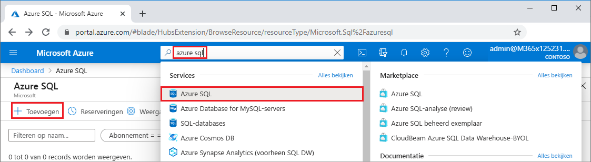
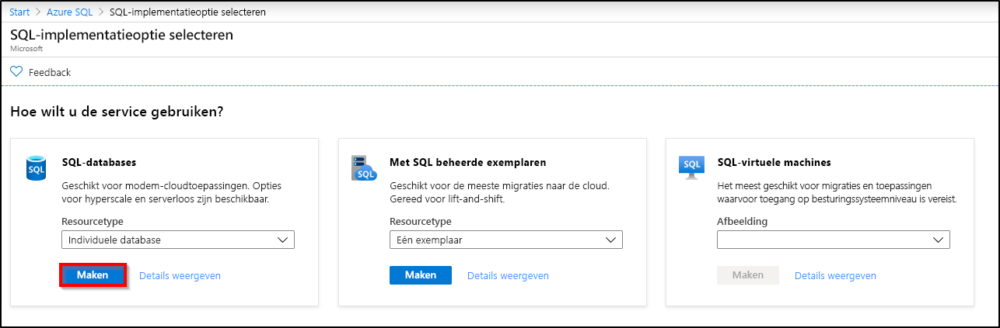
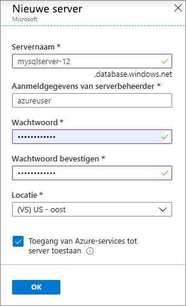
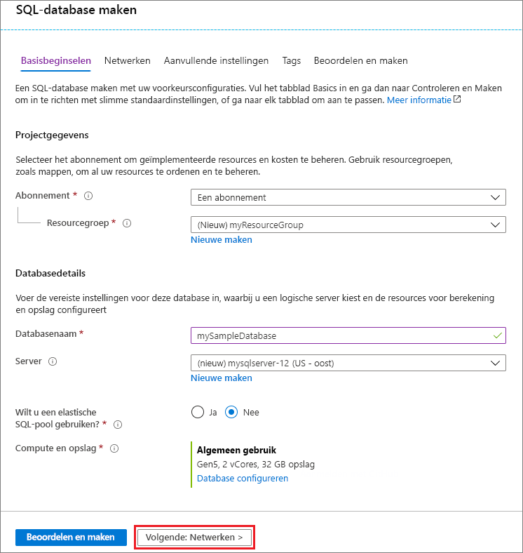
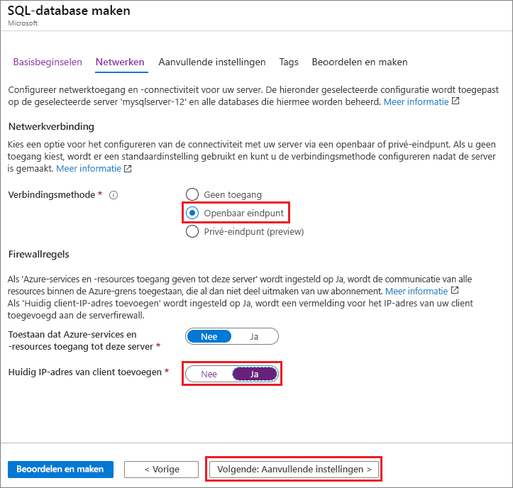
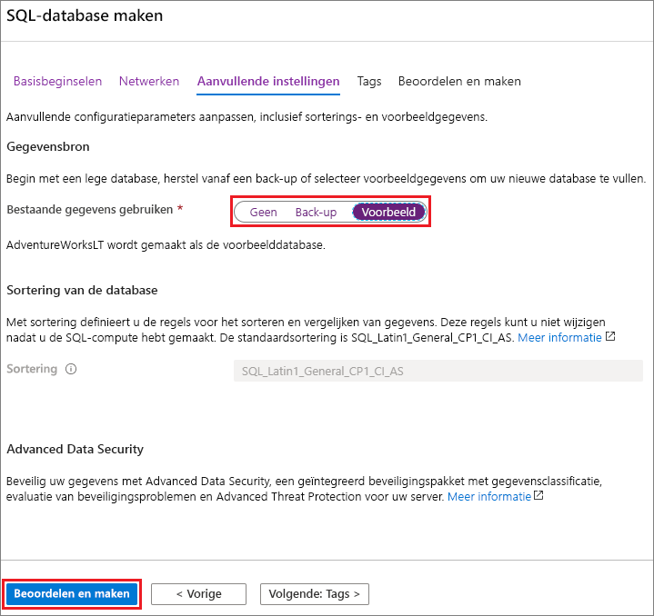

In deze stap maakt u een [logische SQL-server](../database/logical-servers.md) en een [individuele database](../database/single-database-overview.md) waarin AdventureWorksLT-voorbeeldgegevens worden gebruikt. U kunt de database maken met behulp van menu's en schermen in de Azure-portal, of met behulp van een Azure CLI- of PowerShell-script in Azure Cloud Shell.

Alle methoden omvatten het instellen van een firewallregel op serverniveau om het openbare IP-adres toe te staan van de computer die u gebruikt voor toegang tot de server. Zie [Een firewallregel maken op serverniveau](../database/firewall-create-server-level-portal-quickstart.md) voor meer informatie over het maken van firewallregels op serverniveau. U kunt ook firewallregels instellen op databaseniveau. Zie [Een firewallregel maken op databaseniveau](/sql/relational-databases/system-stored-procedures/sp-set-database-firewall-rule-azure-sql-database).

# <a name="portal"></a>[Portal](#tab/azure-portal)

Een resourcegroep, server en afzonderlijke database maken in de Azure-portal:

1. Meld u aan bij de [portal](https://portal.azure.com).
1. Zoek in de zoekbalk naar **Azure SQL** en selecteer deze optie.
1. Selecteer op de pagina **Azure SQL** de optie **Toevoegen**.

   

1. Selecteer op de pagina **SQL-implementatieoptie selecteren** de tegel **SQL-databases** met **Afzonderlijke database** onder **Resourcetype**. U kunt meer informatie over de verschillende databases bekijken door **Details weergeven** te selecteren.
1. Selecteer **Maken**.

   

1. Selecteer op het tabblad **Basisinformatie** van het formulier **SQL-database maken**, onder **Projectgegevens**, het juiste Azure **-abonnement** als dit nog niet is geselecteerd.
1. Selecteer onder **Resourcegroep** de optie **Nieuwe maken**, voer *myResourceGroup* in en selecteer **OK**.
1. Voer onder **Databasedetails**voor **Databasenaam** in: *mySampleDatabase*.
1. Selecteer voor **Server** de optie **Nieuwe maken**, en vul het formulier **Nieuwe server** als volgt in:
   - **Servernaam**: Voer *MySqlServer* in en wat extra tekens om de naam uniek te maken.
   - **Aanmeldgegevens van serverbeheerder**: Voer *azureuser* in.
   - **Wachtwoord**: Voer een wachtwoord in dat voldoet aan de vereisten en voer dit opnieuw in bij **Wachtwoord bevestigen**.
   - **Locatie**: Vervolgkeuzelijst en kies een locatie, zoals **(VS) VS - Oost**.

   Selecteer **OK**.

   

   Noteer de aanmeldgegevens en het wachtwoord van de server zodat u zich bij de server en bijbehorende databases kunt aanmelden. Als u uw aanmeldgegevens of wachtwoord vergeet, kunt u de aanmeldingsnaam ophalen of het wachtwoord opnieuw instellen op de pagina **SQL Server**, nadat de database is gemaakt. U kunt de pagina **SQL Server** openen door de servernaam te selecteren op de **Overzichtspagina** van de database.

1. Als u de standaardinstellingen opnieuw wilt configureren, selecteert u onder **Compute en opslag** de optie **Database configureren**.

   Op de pagina **Configureren** kunt u desgewenst het volgende doen:
   - Wijzig de **Compute-laag** van **Ingericht** in **Serverloos**.
   - Controleer en wijzig de instellingen voor **vCores** en **Maximale grootte van gegevens**.
   - Selecteer **Configuratie wijzigen** om de hardwaregeneratie te wijzigen.

   Nadat u eventuele wijzigingen hebt aangebracht, selecteert u **Toepassen**.

1. Selecteer **Volgende: Netwerken** onderaan de pagina.

   

1. Selecteer op het tabblad **Netwerken** onder **Verbindingsmethode** de optie **Openbaar eindpunt**.
1. Stel onder **Firewallregels** de optie **Huidig IP-adres van client toevoegen** in op **Ja**.
1. Selecteer **Volgende: Aanvullende instellingen** onderaan de pagina.

   
  
   Zie [Azure-services en -resources toegang verlenen tot deze server](../database/network-access-controls-overview.md) en [Een privé-eindpunt toevoegen](../database/private-endpoint-overview.md) voor meer informatie over firewallinstellingen.

1. Selecteer op het tabblad **Aanvullende instellingen**, in de sectie **Gegevensbron**, voor **Bestaande gegevens gebruiken**, de optie **Voorbeeld**.
1. Selecteer **Controleren en maken** onderaan de pagina.

   

1. Nadat u de instellingen hebt bekeken, selecteert u **Maken**.

# <a name="azure-cli"></a>[Azure-CLI](#tab/azure-cli)

U kunt in Azure een resourcegroep, server en afzonderlijke database maken met behulp van de Azure CLI (opdrachtregelinterface). Als u Azure Cloud Shell niet wilt gebruiken, kunt u [Azure CLI installeren](/cli/azure/install-azure-cli) op de computer.

Als u het volgende codevoorbeeld wilt uitvoeren in Azure Cloud Shell, selecteert u **Uitproberen** in de titelbalk van het codevoorbeeld. Wanneer Cloud Shell wordt geopend, selecteert u **Kopiëren** in de titelbalk van het codevoorbeeld, en plakt u het codevoorbeeld in het Cloud Shell-venster. Vervang in de code `<Subscription ID>` door uw Azure-abonnements-id, en vervang `0.0.0.0`, voor `$startip` en `$endip`, door het openbare IP-adres van de computer die u gebruikt.

Volg de prompts op het scherm om u aan te melden in Azure, en voer de code uit.

U kunt Azure Cloud Shell ook gebruiken in de Azure-portal door in de bovenste balk het pictogram Cloud Shell te selecteren.

   

De eerste keer dat u Cloud Shell gebruikt in de portal, selecteert u **Bash** in het dialoogvenster **Welkom**. In volgende sessies wordt Azure CLI gebruikt in een Bash-omgeving of u kunt **Bash** selecteren in de balk voor het Cloud Shell-besturingselement.

Met de volgende Azure CLI-code maakt u een resourcegroep, server, afzonderlijke database en IP-firewallregel op serverniveau voor toegang tot de server. Zorg ervoor dat u de namen van de gegenereerde resourcegroep en server vastlegt, zodat u deze resources later kunt beheren.

```azurecli-interactive
#!/bin/bash

# Sign in to Azure and set execution context (if necessary)
az login
az account set --subscription <Subscription ID>

# Set the resource group name and location for your server
resourceGroupName=myResourceGroup-$RANDOM
location=westus2

# Set an admin login and password for your database
adminlogin=azureuser
password=Azure1234567

# Set a server name that is unique to Azure DNS (<server_name>.database.windows.net)
servername=server-$RANDOM

# Set the ip address range that can access your database
startip=0.0.0.0
endip=0.0.0.0

# Create a resource group
az group create \
    --name $resourceGroupName \
    --location $location

# Create a server in the resource group
az sql server create \
    --name $servername \
    --resource-group $resourceGroupName \
    --location $location  \
    --admin-user $adminlogin \
    --admin-password $password

# Configure a server-level firewall rule for the server
az sql server firewall-rule create \
    --resource-group $resourceGroupName \
    --server $servername \
    -n AllowYourIp \
    --start-ip-address $startip \
    --end-ip-address $endip

# Create a gen5 2 vCore database in the server
az sql db create \
    --resource-group $resourceGroupName \
    --server $servername \
    --name mySampleDatabase \
    --sample-name AdventureWorksLT \
    --edition GeneralPurpose \
    --family Gen5 \
    --capacity 2 \
```

De voorgaande code maakt gebruik van de volgende Azure CLI-opdrachten:

| Opdracht | Beschrijving |
|---|---|
| [az account set](/cli/azure/account?view=azure-cli-latest#az-account-set) | Hiermee stelt u een abonnement in als het huidige actieve abonnement. |
| [az group create](/cli/azure/group#az-group-create) | Hiermee maakt u een resourcegroep waarin alle resources worden opgeslagen. |
| [az sql server create](/cli/azure/sql/server#az-sql-server-create) | Hiermee maakt u een server die als host fungeert voor databases en elastische pools. |
| [az sql server firewall-rule create](/cli/azure/sql/server/firewall-rule##az-sql-server-firewall-rule-create) | Hiermee maakt u een firewallregel op serverniveau. |
| [az sql db create](/cli/azure/sql/db#az-sql-db-create?view=azure-cli-latest) | Hiermee maakt u een database. |

Zie [Azure CLI-voorbeelden](../database/az-cli-script-samples-content-guide.md) voor meer Azure CLI-voorbeelden in Azure SQL Database.

# <a name="powershell"></a>[PowerShell](#tab/azure-powershell)

U kunt een resourcegroep, server en afzonderlijke database maken met behulp van Windows PowerShell. Als u Azure Cloud Shell niet wilt gebruiken, kunt u [de Azure PowerShell-module installeren](/powershell/azure/install-az-ps).

[!INCLUDE [updated-for-az](../../../includes/updated-for-az.md)]

Als u het volgende codevoorbeeld wilt uitvoeren in Azure Cloud Shell, selecteert u **Uitproberen** in de titelbalk van de code. Wanneer Cloud Shell wordt geopend, selecteert u **Kopiëren** in de titelbalk van het codevoorbeeld, en plakt u het codevoorbeeld in het Cloud Shell-venster. Vervang in de code `<Subscription ID>` door uw Azure-abonnements-id, en vervang `0.0.0.0`, voor `$startIp` en `$endIp`, door het openbare IP-adres van de computer die u gebruikt.

Volg de prompts op het scherm om u aan te melden in Azure, en voer de code uit.

U kunt Azure Cloud Shell ook gebruiken in de Azure-portal door in de bovenste balk het pictogram Cloud Shell te selecteren.

   

De eerste keer dat u Cloud Shell gebruikt vanuit de portal, selecteert u **PowerShell** in het dialoogvenster **Welkom**. In volgende sessies wordt PowerShell gebruikt, of u kunt dit selecteren in de balk voor het Cloud Shell-besturingselement.

Met de volgende PowerShell-code maakt u in Azure een resourcegroep, server, afzonderlijke database en firewallregel voor toegang tot de server. Zorg ervoor dat u de namen van de gegenereerde resourcegroep en server vastlegt, zodat u deze resources later kunt beheren.

   ```powershell-interactive
   # Set variables for your server and database
   $subscriptionId = '<SubscriptionID>'
   $resourceGroupName = "myResourceGroup-$(Get-Random)"
   $location = "West US"
   $adminLogin = "azureuser"
   $password = "Azure1234567"
   $serverName = "mysqlserver-$(Get-Random)"
   $databaseName = "mySampleDatabase"

   # The ip address range that you want to allow to access your server
   $startIp = "0.0.0.0"
   $endIp = "0.0.0.0"

   # Show randomized variables
   Write-host "Resource group name is" $resourceGroupName
   Write-host "Server name is" $serverName

   # Connect to Azure
   Connect-AzAccount

   # Set subscription ID
   Set-AzContext -SubscriptionId $subscriptionId

   # Create a resource group
   Write-host "Creating resource group..."
   $resourceGroup = New-AzResourceGroup -Name $resourceGroupName -Location $location -Tag @{Owner="SQLDB-Samples"}
   $resourceGroup

   # Create a server with a system wide unique server name
   Write-host "Creating primary server..."
   $server = New-AzSqlServer -ResourceGroupName $resourceGroupName `
      -ServerName $serverName `
      -Location $location `
      -SqlAdministratorCredentials $(New-Object -TypeName System.Management.Automation.PSCredential `
      -ArgumentList $adminLogin, $(ConvertTo-SecureString -String $password -AsPlainText -Force))
   $server

   # Create a server firewall rule that allows access from the specified IP range
   Write-host "Configuring firewall for primary server..."
   $serverFirewallRule = New-AzSqlServerFirewallRule -ResourceGroupName $resourceGroupName `
      -ServerName $serverName `
      -FirewallRuleName "AllowedIPs" -StartIpAddress $startIp -EndIpAddress $endIp
   $serverFirewallRule

   # Create General Purpose Gen4 database with 1 vCore
   Write-host "Creating a gen5 2 vCore database..."
   $database = New-AzSqlDatabase  -ResourceGroupName $resourceGroupName `
      -ServerName $serverName `
      -DatabaseName $databaseName `
      -Edition GeneralPurpose `
      -VCore 2 `
      -ComputeGeneration Gen5 `
      -MinimumCapacity 2 `
      -SampleName "AdventureWorksLT"
   $database
   ```

De voorgaande code maakt gebruik van de PowerShell-cmdlets:

| Opdracht | Opmerkingen |
|---|---|
| [New-AzResourceGroup](/powershell/module/az.resources/new-azresourcegroup) | Hiermee maakt u een resourcegroep waarin alle resources worden opgeslagen. |
| [New-AzSqlServer](/powershell/module/az.sql/new-azsqlserver) | Hiermee maakt u een server die als host fungeert voor databases en elastische pools. |
| [New-AzSqlServerFirewallRule](/powershell/module/az.sql/new-azsqlserverfirewallrule) | Hiermee maakt u een firewallregel voor een server. |
| [New-AzSqlDatabase](/powershell/module/az.sql/new-azsqldatabase) | Hiermee maakt u een database. |

Zie [Azure PowerShell-voorbeelden](../database/powershell-script-content-guide.md)voor meer Azure PowerShell-voorbeelden in Azure SQL Database.

---
