# Quickstart: Een beheerd exemplaar van SQL Managed Instance maken
[!INCLUDE[appliesto-sqlmi](../includes/appliesto-sqlmi.md)]

In deze quickstart leert u hoe u een beheerd exemplaar van [Azure SQL Managed Instance](sql-managed-instance-paas-overview.md) maakt in de Microsoft Azure-portal.

> [!IMPORTANT]
> Raadpleeg [Ondersteunde regio’s](resource-limits.md#supported-regions) en [Ondersteunde abonnementstypen](resource-limits.md#supported-subscription-types) voor de beperkingen.

## Een beheerd exemplaar maken

Volg de volgende stappen om een beheerd exemplaar te maken: 

### Aanmelden bij Azure Portal

Als u nog geen abonnement op Azure hebt, [maak dan een gratis account](https://azure.microsoft.com/free/).

1. Meld u aan bij de [Azure-portal](https://portal.azure.com/).
1. Selecteer **Azure SQL** in het linkermenu van de Microsoft Azure-portal. Als **Azure SQL** niet in de lijst staat, selecteert u **Alle services** en voert u vervolgens **Azure SQL** in het zoekvak in.
1. Selecteer **+ Toevoegen** om de pagina **SQL-implementatieoptie selecteren** te openen. U kunt aanvullende informatie over een met Azure SQL beheerd exemplaar bekijken door **Details weergeven** te selecteren op de tegel **SQL Managed Instance**.
1. Selecteer **Maken**.

   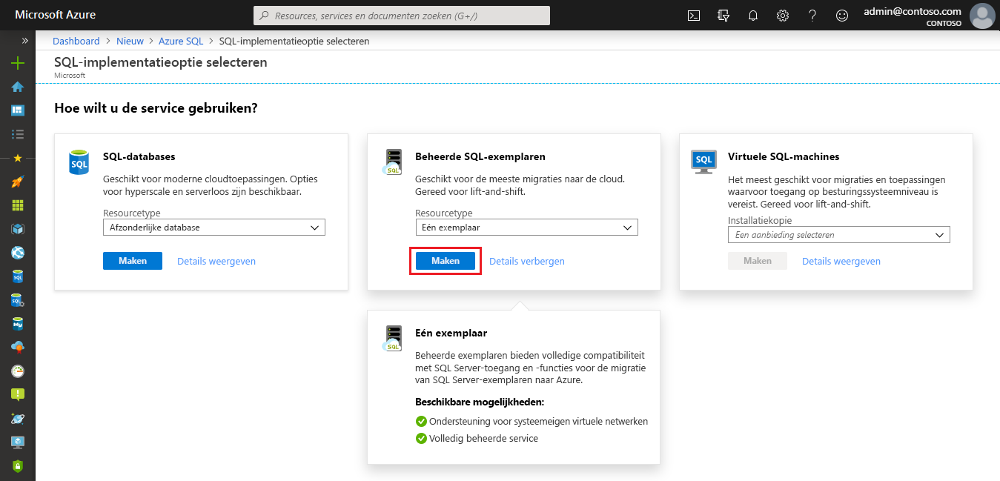

4. Gebruik de tabbladen in het inrichtingsformulier **Een met Azure SQL beheerd exemplaar maken** om vereiste en optionele informatie toe te voegen. In de volgende secties worden deze tabbladen in meer detail beschreven.

### Tabblad Basisbeginselen

- Vul verplichte gegevens in die vereist zijn op het tabblad **Basisbeginselen**. Dit is een set informatie die minimaal vereist is voor het inrichten van een beheerd exemplaar.

   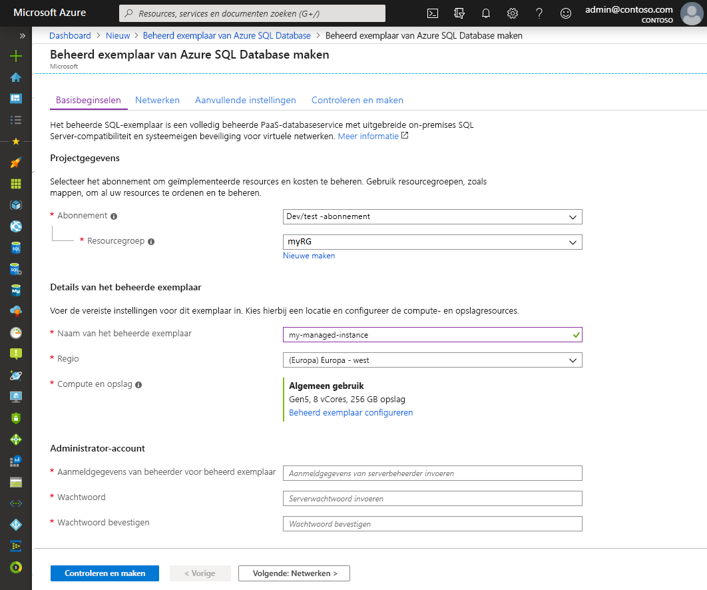

   Gebruik de onderstaande tabel als referentie voor informatie die op dit tabblad is vereist.

   | Instelling| Voorgestelde waarde | Beschrijving |
   | ------ | --------------- | ----------- |
   | **Abonnement** | Uw abonnement. | Een abonnement met toestemming voor het maken van nieuwe resources. |
   | **Resourcegroep** | een nieuwe of bestaande resourcegroep.|Zie [Naming conventions](/azure/architecture/best-practices/resource-naming) (Naamgevingsconventies) voor geldige resourcegroepnamen.|
   | **Naam van het beheerde exemplaar** | Een geldige naam.|Zie [Naming conventions](/azure/architecture/best-practices/resource-naming) (Naamgevingsconventies) voor geldige namen.|
   | **Regio** |De regio waarin u het beheerde exemplaar wilt maken.|Zie [Azure-regio's](https://azure.microsoft.com/regions/) voor informatie over regio's.|
   | **Beheerdersaanmeldgegevens voor het beheerde exemplaar** | Een geldige gebruikersnaam. | Zie [Naming conventions](/azure/architecture/best-practices/resource-naming) (Naamgevingsconventies) voor geldige namen. Maak geen gebruik van 'serverbeheerder' aangezien dit een rol is die op serverniveau is gereserveerd.|
   | **Wachtwoord** | Een geldig wachtwoord.| Het wachtwoord moet minstens 16 tekens lang zijn en moet voldoen aan de [gedefinieerde complexiteitsvereisten](../../virtual-machines/windows/faq.md#what-are-the-password-requirements-when-creating-a-vm).|

- Selecteer **Beheerd exemplaar configureren** om de grootte van reken- en opslagresources te bepalen en de prijscategorieën te controleren. Gebruik de schuifregelaars of tekstvakken om de hoeveelheid opslagruimte en het aantal virtuele kernen op te geven. Wanneer u klaar bent, selecteert u **Toepassen** om uw selectie op te slaan. 

   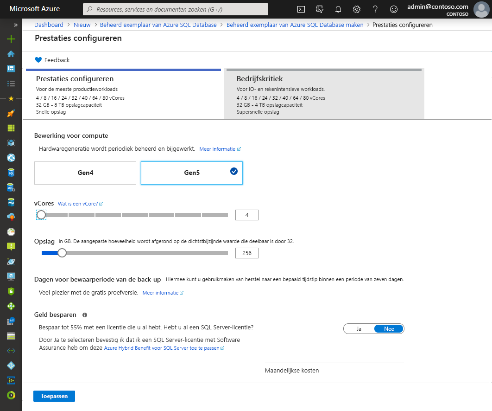

- Als u uw keuzes wilt bekijken voordat u een met SQL beheerd exemplaar maakt, selecteert u **Controleren en maken**. U kunt ook de netwerkopties configureren door te selecteren **Volgende: Netwerken**.

### Tabblad Netwerken

- Vul optionele informatie in op het tabblad **Netwerken**. Als u deze informatie weglaat, worden de standaardinstellingen toegepast door de portal.

   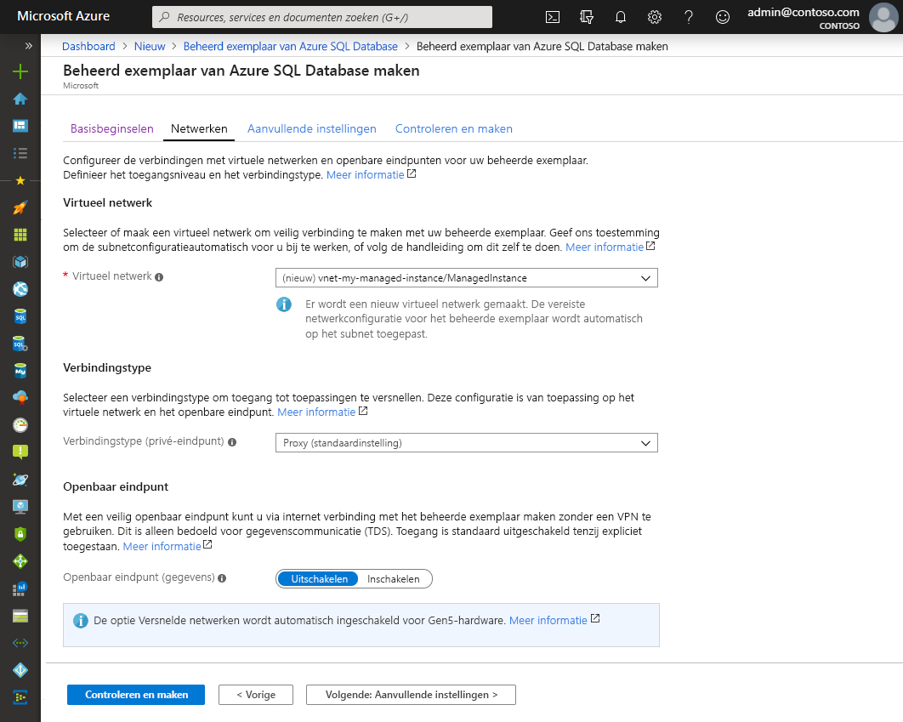

   Gebruik de onderstaande tabel als referentie voor informatie die op dit tabblad is vereist.

   | Instelling| Voorgestelde waarde | Beschrijving |
   | ------ | --------------- | ----------- |
   | **Virtueel netwerk** | Selecteer **Nieuw virtueel netwerk maken** of een geldig virtueel netwerk en subnet.| Als een netwerk/subnet niet beschikbaar is, moet het worden [gewijzigd om te voldoen aan de netwerkvereisten](vnet-existing-add-subnet.md) voordat u het als doel voor het nieuwe beheerde exemplaar kunt selecteren. Zie [Een virtueel netwerk configureren voor een met SQL beheerd exemplaar](connectivity-architecture-overview.md) voor informatie over de vereisten voor het configureren van de netwerkomgeving voor een met SQL beheerd exemplaar. |
   | **Verbindingstype** | Kies tussen het verbindingstype Proxy of Omleiding.|Zie [Verbindingstype voor Azure SQL Managed Instance](../database/connectivity-architecture.md#connection-policy) voor meer informatie over verbindingstypen.|
   | **Openbaar eindpunt**  | Selecteer **Inschakelen**. | Als u wilt dat een beheerd exemplaar toegankelijk is via het eindpunt voor openbare gegevens, moet u deze optie inschakelen. | 
   | **Toegang toestaan vanaf** (als **Openbaar eindpunt** is ingeschakeld) | Selecteer een van de opties.   |In de portal kunt u een beveiligingsgroep configureren met een openbaar eindpunt.     Selecteer op basis van uw scenario een van de volgende opties:   <ul> <li>**Azure-services**: We raden deze optie aan wanneer u verbinding maakt vanuit Power BI of een andere service voor meerdere tenants. </li> <li> **Internet**: Gebruik dit om te testen wanneer u snel een beheerd exemplaar wilt maken. Deze optie wordt niet aanbevolen in productieomgevingen. </li> <li> **Geen toegang**: Met deze optie maakt u de beveiligingsregel **Weigeren**. Wijzig deze regel om een beheerd exemplaar toegankelijk te maken via een openbaar eindpunt. </li> </ul>   Zie [Een met Azure SQL beheerd exemplaar veilig gebruiken met een openbaar eindpunt](public-endpoint-overview.md) voor meer informatie over de beveiliging van een openbaar eindpunt.|

- Als u uw keuzes wilt bekijken voordat u een beheerd exemplaar maakt, kunt u **Bekijken en maken** selecteren. U kunt ook meer aangepaste instellingen configureren door  **te selecteren. We gaan nu verder met: Aanvullende instellingen**.

### Aanvullende instellingen

- Vul optionele informatie in op het tabblad **Aanvullende instellingen**. Als u deze informatie weglaat, worden de standaardinstellingen toegepast door de portal.

   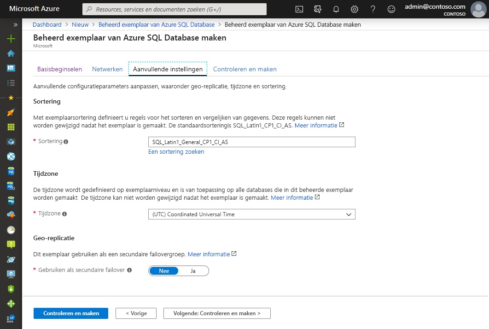

   Gebruik de onderstaande tabel als referentie voor informatie die op dit tabblad is vereist.

   | Instelling| Voorgestelde waarde | Beschrijving |
   | ------ | --------------- | ----------- |
   | **Sortering** | Kies de sortering die u wilt gebruiken voor uw beheerde exemplaar. Als u SQL Server-databases wilt migreren, moet u de bronsortering controleren met `SELECT SERVERPROPERTY(N'Collation')` en die waarde gebruiken.| Raadpleeg [De serversortering instellen of wijzigen](https://docs.microsoft.com/sql/relational-databases/collations/set-or-change-the-server-collation) voor informatie over sorteringen.|   
   | **Tijdzone** | Selecteer de tijdzone die het beheerde exemplaar moet gebruiken.|Zie [Tijdzones](timezones-overview.md) voor meer informatie.|
   | **Gebruiken als secundaire failover** | Selecteer **Ja**. | Schakel deze optie in als u het beheerde exemplaar wilt gebruiken als een secundaire failovergroep.|
   | **Primair met SQL beheerd exemplaar** (als **Gebruiken als secundaire failover** is ingesteld op **Ja**) | Kies een bestaand primair beheerd exemplaar dat wordt toegevoegd aan dezelfde DNS-zone met het beheerde exemplaar dat u nu maakt. | Met deze stap wordt de configuratie van de failovergroep na het maken ingeschakeld. Zie [Zelfstudie: een beheerd exemplaar aan een failovergroep toevoegen](failover-group-add-instance-tutorial.md).|

## Beoordelen en maken

1. Als u uw keuzes wilt bekijken voordat u een beheerd exemplaar maakt, kunt u **Bekijken en maken** selecteren.

   

1. Selecteer **Maken** om het inrichten van het beheerde exemplaar te starten.

> [!IMPORTANT]
> Het implementeren van een beheerd exemplaar is een langdurende bewerking. De implementatie van het eerste exemplaar in het subnet duurt doorgaans veel langer dan de implementatie in een subnet met bestaande beheerde exemplaren. Raadpleeg [Bewerkingen voor SQL Managed Instance-beheer](sql-managed-instance-paas-overview.md#management-operations) voor de gemiddelde inrichtingsduur.

## Implementatievoortgang bewaken

1. Selecteer het pictogram **Meldingen** om de status van de implementatie te bekijken.

   

1. Selecteer **Implementatie in uitvoering** in de melding om het SQL Managed Instance-venster te openen en de implementatievoortgang verder te bewaken. 

> [!TIP]
> Als u de webbrowser of het scherm met de implementatievoortgang hebt afgesloten, volgt u deze stappen om dit scherm weer te vinden:
> 1. Open in de Microsoft Azure-portal de resourcegroep (op het tabblad **Basisbeginselen**) waarin u een met SQL beheerd exemplaar gaat implementeren.
> 2. Selecteer **Implementaties**.
> 3. Selecteer de SQL Managed Instance-implementatie die wordt uitgevoerd.

> [!IMPORTANT]
> - Het maken van een SQL Managed Instance is een langlopende bewerking die enkele uren kan duren, afhankelijk van de specifieke omstandigheden. Zie [Duur van beheerbewerkingen](management-operations-overview.md#duration) voor gemiddelde tijden.
> - Het starten van het maken van een SQL Managed Instance kan worden vertraagd wanneer er andere intensieve bewerkingen actief zijn, zoals het uitvoeren van grote herstel- of schaalbewerkingen op andere beheerde exemplaren in hetzelfde subnet. Zie [Management operations cross-impact](management-operations-overview.md#management-operations-cross-impact) (Wederzijdse impact van beheerbewerkingen) voor meer informatie.
> - Als u de status van het maken van beheerde exemplaren wilt ophalen, moet u **leesrechten hebben** voor de resourcegroep. Als u deze machtigingen niet hebt of als deze zijn ingetrokken tijdens het maken van het beheerde exemplaar, is het met SQL beheerd exemplaar mogelijk niet zichtbaar in de lijst met implementaties voor resourcegroepen.
>

## Gemaakte resources weergeven

Na een geslaagde implementatie van het beheerde exemplaar kunt u de resources die zijn aangemaakt, als volgt bekijken:

1. Open de resourcegroep voor uw beheerde exemplaar. 

   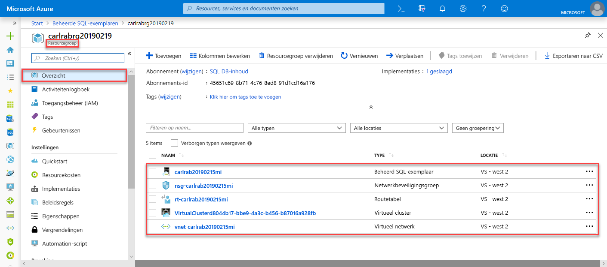

## Netwerkinstellingen weergeven en aanpassen

Als u de netwerkinstellingen wilt aanpassen, bekijkt u het volgende:

1. Selecteer de routetabel om de UDR (door de gebruiker gedefinieerde route) op te geven die voor u is gemaakt.

   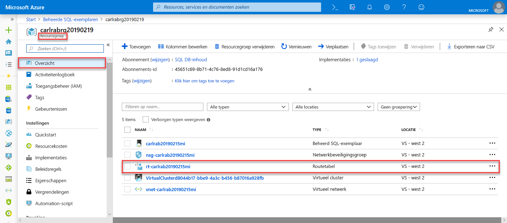

2. Bekijk de vermeldingen in de routetabel om verkeer vanuit en binnen het virtuele netwerk van het met SQL beheerde exemplaar door te sturen. Als u de routetabel handmatig maakt of configureert, moet u deze vermeldingen maken in de routetabel van het met SQL beheerde exemplaar.

   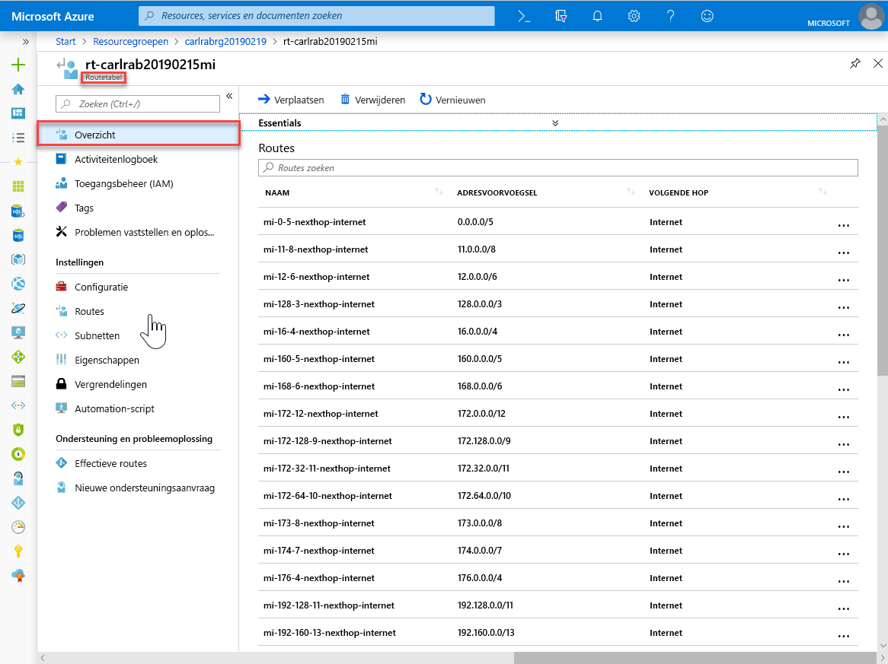

3. Ga terug naar de resourcegroep en selecteer de netwerkbeveiligingsgroep.

   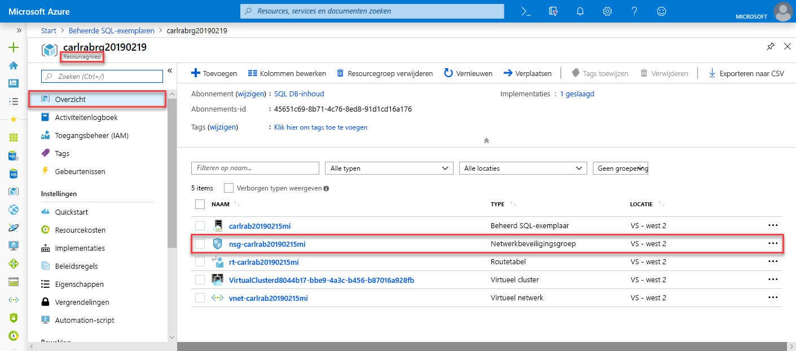

4. Bekijk de inkomende en uitgaande beveiligingsregels. 

   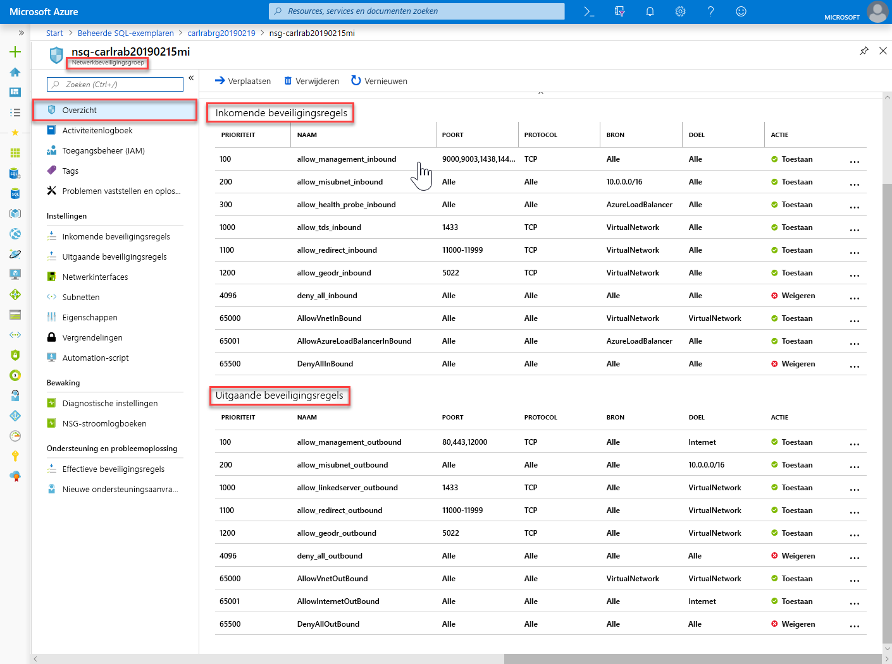

> [!IMPORTANT]
> Als u een openbaar eindpunt hebt geconfigureerd voor het met SQL beheerde exemplaar, moet u poorten openen voor netwerkverkeer dat verbindingen met SQL Managed Instance toestaat vanaf het openbaar internet. Zie [Een openbaar eindpunt configureren voor SQL Managed Instance](public-endpoint-configure.md#allow-public-endpoint-traffic-on-the-network-security-group) voor meer informatie.
>

## Details over de verbinding met SQL Managed Instance ophalen

Als u verbinding wilt maken met SQL Managed Instance, voert u de volgende stappen uit om de hostnaam en de FQDN (Fully Qualified Domain Name) op te halen:

1. Ga terug naar de resourcegroep en selecteer uw beheerde exemplaar.

   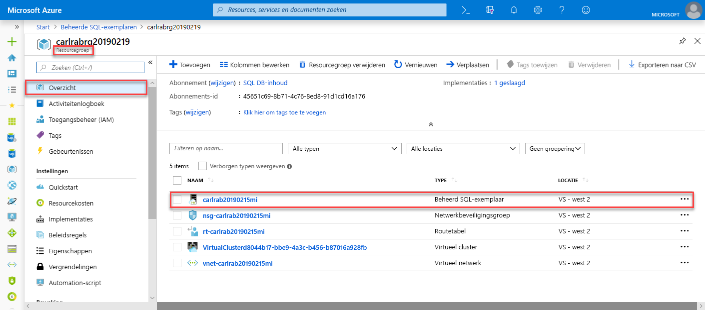

2. Ga naar het tabblad **Overzicht** en zoek de eigenschap **Host**. Kopieer de hostnaam voor het beheerde exemplaar voor gebruik in de volgende quickstart.

   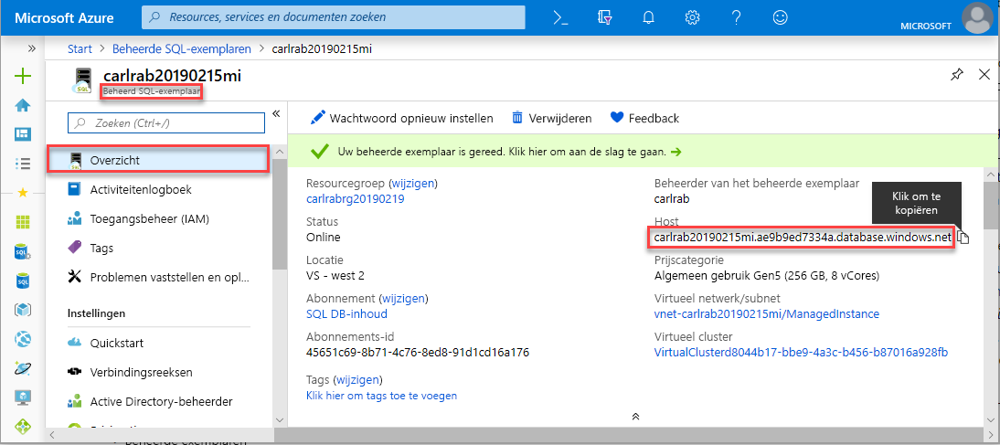

   De gekopieerde waarde vertegenwoordigt een FQDN die kan worden gebruikt om verbinding te maken met SQL Managed Instance. Deze is vergelijkbaar met het volgende voorbeeld: *uw_hostnaam.a1b2c3d4e5f6.database.windows.net*.

## Volgende stappen

Meer informatie over het verbinding maken met SQL Managed Instance:
- Zie [Uw toepassingen verbinden met SQL Managed Instance](connect-application-instance.md) voor een overzicht van de verbindingsopties voor toepassingen.
- Zie [Een verbinding vanaf een virtuele Azure-machine configureren](connect-vm-instance-configure.md) voor een quickstart over verbinding maken met SQL Managed Instance vanaf een virtuele Azure-machine.
- Zie [Een punt-naar-site-verbinding configureren](point-to-site-p2s-configure.md) voor een quickstart over verbinding maken met SQL Managed Instance vanaf een on-premises clientcomputer met behulp van een punt-naar-site-verbinding.

Volg de volgende stappen als u een bestaande SQL Server-database vanaf on-premises wilt herstellen naar een SQL Managed Instance: 
- Gebruik de [Azure Database Migration Service voor migratie](../../dms/tutorial-sql-server-to-managed-instance.md) om te herstellen vanuit een back-upbestand van de database. 
- Gebruik de [opdracht T-SQL RESTORE](restore-sample-database-quickstart.md) om te herstellen vanuit een back-upbestand van een database.

Zie [Azure SQL Managed Instance bewaken met Azure SQL-analyse](../../azure-monitor/insights/azure-sql.md) voor geavanceerde bewaking van de databaseprestaties in SQL Managed Instance, met ingebouwde intelligentie voor het oplossen van problemen.
