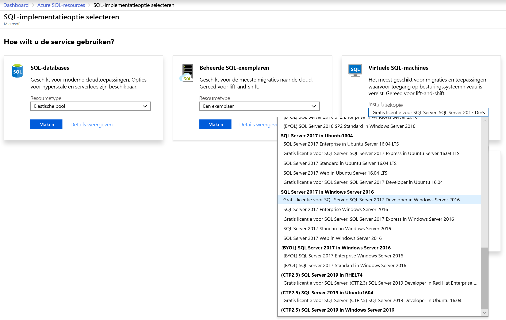
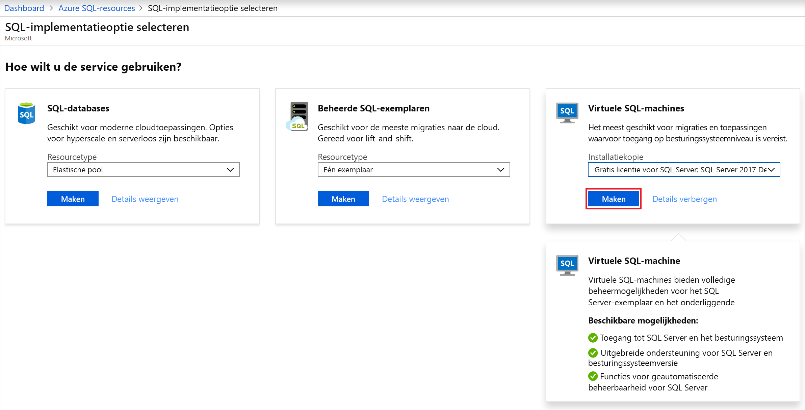
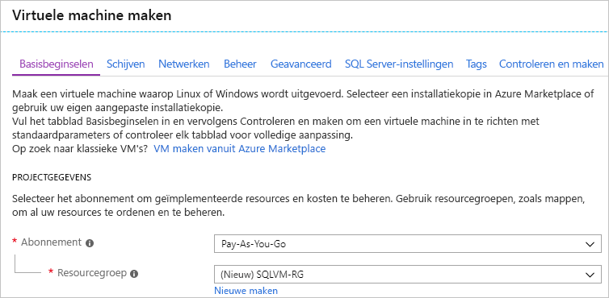
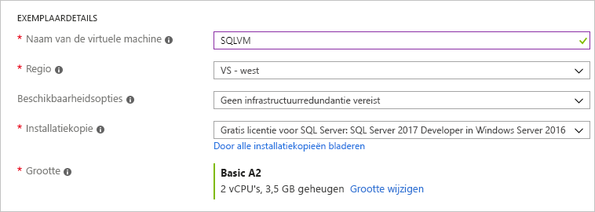
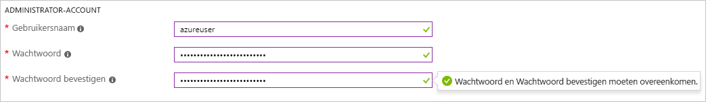
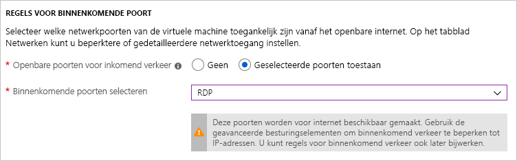
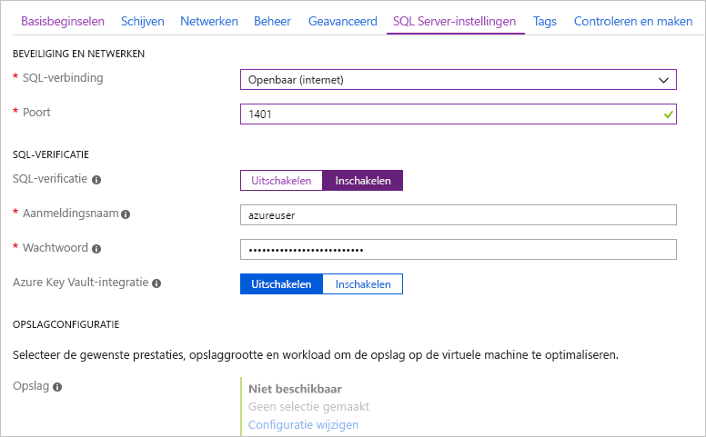
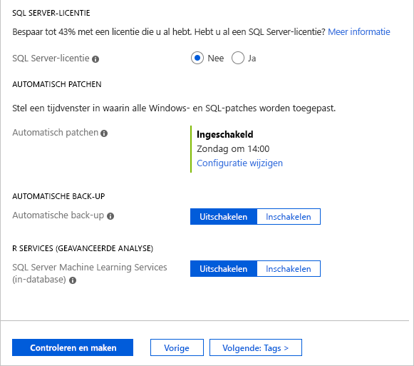
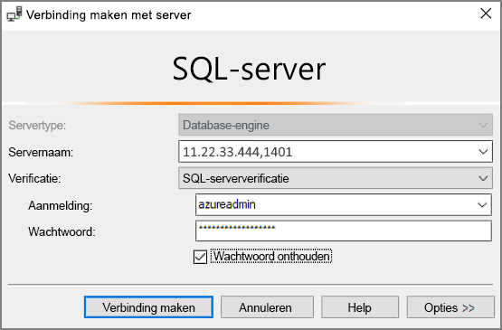

# Quickstart: SQL Server 2017 maken op een virtuele Windows-machine in Azure Portal

[!INCLUDE[appliesto-sqlvm](../../includes/appliesto-sqlvm.md)]

> [!div class="op_single_selector"]
> * [Windows](sql-vm-create-portal-quickstart.md)
> * [Linux](../linux/sql-vm-create-portal-quickstart.md)

In deze quickstart doorloopt u de stappen voor het maken van een virtuele SQL Server-machine in de Azure Portal.

  > [!TIP]
  > - Deze snelstartgids biedt een pad voor het snel inrichten van en verbinding maken met een SQL-VM. Meer informatie over andere inrichtingskeuzes voor SQL-VM's vindt u in [Inrichtingshandleiding voor SQL Server op Windows-VM's in de Azure Portal](create-sql-vm-portal.md).
  > - Als u vragen hebt over virtuele machines met SQL Server, raadpleegt u [Veelgestelde vragen](frequently-asked-questions-faq.md).

##  Een Azure-abonnement nemen

Als u nog geen abonnement op Azure hebt, maak dan een [gratis account](https://azure.microsoft.com/free/?WT.mc_id=A261C142F) aan voordat u begint.

##  Een installatiekopie selecteren voor uw virtuele SQL Server-machine

1. Meld u met uw account aan bij de [Azure Portal](https://portal.azure.com).

1. Selecteer **Azure SQL** in het menu aan de linkerzijde van de Azure Portal. Als **Azure SQL** niet in de lijst staat, selecteert u **Alle services** en typt u *Azure SQL* in het zoekvak.
1. Selecteer **+Toevoegen** om de pagina **SQL-implementatieoptie selecteren** te openen. U kunt aanvullende informatie weergeven door **Details weergeven** te selecteren op de tegel **Virtuele SQL-machines**.
1. Selecteer de installatiekopie met de naam **Gratis licentie voor SQL Server: SQL Server 2017 Developer op Windows Server 2016** in de vervolgkeuzelijst.

   

1. Selecteer **Maken**.

   

##  Algemene gegevens opgeven

Geef op het tabblad **Basisbeginselen** u de volgende gegevens op:

1. Selecteer uw Azure-abonnement in de sectie **Projectgegevens** en selecteer vervolgens **Nieuwe maken** om een nieuwe resourcegroep te maken. Typ _SQLVM-RG_ als naam.

   

1. Geef onder **Exemplaardetails** het volgende op:
    1. Typ _SQLVM_ als de **naam van de virtuele machine**. 
    1. Kies een locatie voor uw **Regio**. 
    1. Voor het doel van deze quickstart laat u **Beschikbaarheidsopties** ingesteld op _Geen infrastructuurredundantie vereist_. Zie [Beschikbaarheid](../../../virtual-machines/windows/availability.md) voor meer informatie over beschikbaarheidsopties. 
    1. Selecteer in de lijst **Installatiekopie** de optie _Gratis SQL Server-licentie: SQL Server 2017 Developer op Windows Server 2016_. 
    1. Kies **Grootte wijzigen** voor de **Grootte** van de virtuele machine en selecteer de aanbieding **A2 Basic**. Zorg dat u uw resources opschoont wanneer u ze niet meer nodig hebt, om te voorkomen dat er onverwachte kosten in rekening worden gebracht. 

   

1. Geef onder **Administrator-account** een gebruikersnaam op, bijvoorbeeld _azureuser_, en een wachtwoord. Het wachtwoord moet minstens 12 tekens lang zijn en moet voldoen aan de [gedefinieerde complexiteitsvereisten](../../../virtual-machines/windows/faq.md#what-are-the-password-requirements-when-creating-a-vm).

   

1. Kies onder **Regels voor binnenkomende poort** de optie **​​Geselecteerde poorten toestaan** en selecteer **RDP (3389)** in de vervolgkeuzelijst. 

   

## SQL Server-instellingen

Op het tabblad **SQL Server-instellingen** configureert u de volgende opties:

1. Selecteer onder **Netwerken en beveiliging** de optie _Openbaar (internet_) voor **SQL-connectiviteit** en wijzig de poort in `1401` om te voorkomen dat u in het openbare scenario een bekend poortnummer gebruikt. 
1. Selecteer onder **SQL-verificatie** de optie **Inschakelen**. De SQL-aanmeldingsgegevens zijn ingesteld op dezelfde combinatie van gebruikersnaam en wachtwoord als u voor de virtuele machine hebt geconfigureerd. Gebruik de standaardinstelling voor [**Azure Key Vault-integratie**](azure-key-vault-integration-configure.md). **Opslagconfiguratie** is niet beschikbaar voor de basisinstallatiekopie van de virtuele SQL Server-machine, maar in [Opslagconfiguratie](storage-configuration.md#new-vms) vindt u meer informatie over de beschikbare opties voor andere installatiekopieën.  

   

1. Wijzig indien nodig andere instellingen en selecteer vervolgens **Controleren en maken**. 

   

## De virtuele SQL Server-machine maken

Op het tabblad **Controleren en maken** controleert u het overzicht en selecteert u **Maken** om de SQL Server, de resourcegroep en de resources te maken die zijn opgegeven voor deze virtuele machine.

U kunt de implementatie bewaken vanuit Azure Portal. Met de knop **Meldingen** boven aan het scherm kunt u de algemene status van de implementatie weergeven. De implementatie kan enkele minuten duren. 

## Verbinding maken met SQL Server

1. Zoek in de portal het **openbare IP-adres** van uw SQL Server-VM in de sectie **Overzicht** van de eigenschappen van de virtuele machine.

1. Open [SQL Server Management Studio (SSMS)](/sql/ssms/download-sql-server-management-studio-ssms) op een andere computer die is verbonden met internet.

1. Bewerk in het dialoogvenster **Verbinding maken met server** of **Verbinding maken met Database-engine** de waarde voor **Servernaam**. Typ het openbare IP-adres van de virtuele machine. Typ nu een komma en vervolgens de aangepaste poort (**1401**) die u hebt opgegeven tijdens de configuratie van de nieuwe virtuele machine. Bijvoorbeeld `11.22.33.444,1401`.

1. Kies in het vak **Verificatie** **SQL Server-verificatie**.

1. Typ in het vak **Aanmelden** een geldige SQL-aanmeldingsnaam.

1. Typ in het vak **Wachtwoord** het wachtwoord van de aanmelding.

1. Selecteer **Verbinden**.

    

##  Vanaf een externe locatie aanmelden bij de virtuele machine

Doorloop de volgende stappen om via Extern bureaublad verbinding te maken met de virtuele SQL Server-machine:

[!INCLUDE [Connect to SQL Server VM with remote desktop](../../../../includes/virtual-machines-sql-server-remote-desktop-connect.md)]

Nadat u verbinding hebt gemaakt met de virtuele SQL Server-machine, kunt u SQL Server Management Studio starten en verbinding maken met Windows-verificatie met behulp van de lokale beheerdersreferenties. Als u SQL Server-verificatie inschakelt, kunt u ook verbinding maken met SQL-verificatie. Dit kan met behulp van de SQL-aanmeldingsnaam en het wachtwoord die u hebt geconfigureerd tijdens het inrichten.

Met toegang tot de machine kunt u rechtstreeks de instellingen voor de machine en de SQL Server wijzigen op basis van uw vereisten. U kunt bijvoorbeeld de firewallinstellingen configureren of de SQL Server-configuratie-instellingen wijzigen.

## Resources opschonen

Als het niet nodig is dat de virtuele SQL-machine continu wordt uitgevoerd, kunt u overbodige kosten voorkomen door de virtuele machine te stoppen wanneer deze niet in gebruik is. U kunt ook alle resources die aan de virtuele machine zijn gekoppeld, definitief verwijderen. Dit doet u door in de portal de gekoppelde resourcegroep te verwijderen. Hiermee verwijdert u ook de virtuele machine zelf definitief. Bedenk dus van tevoren goed of u dit wel wilt. Raadpleeg [Manage Azure resources through portal](../../../azure-resource-manager/management/manage-resource-groups-portal.md) (Azure-resources via de portal beheren) voor meer informatie.

## Volgende stappen

In deze quickstart hebt u een virtuele SQL Server 2017-machine gemaakt in Azure Portal. Raadpleeg het volgende artikel voor meer informatie over hoe u uw gegevens migreert naar de nieuwe SQL-server.

> [!div class="nextstepaction"]
> [Een database migreren naar een SQL-VM](migrate-to-vm-from-sql-server.md)
