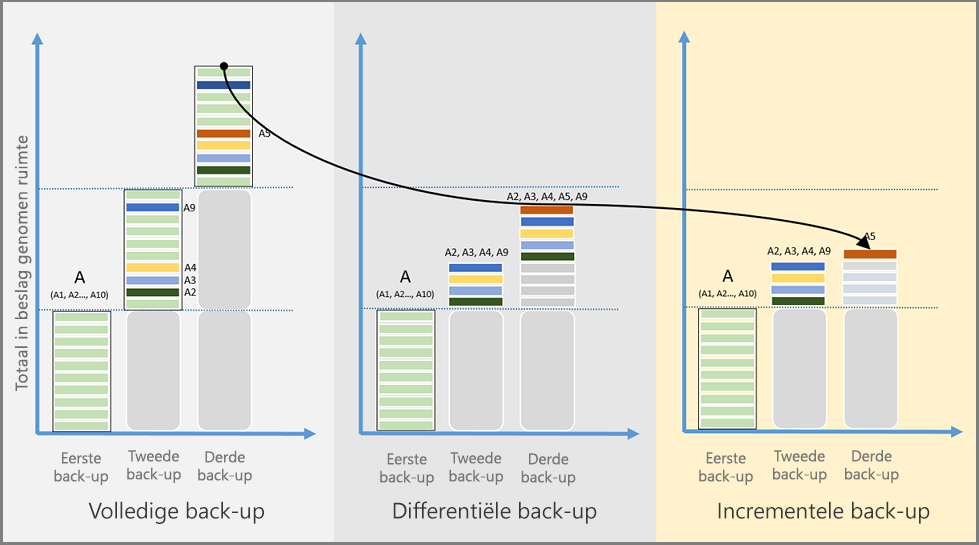
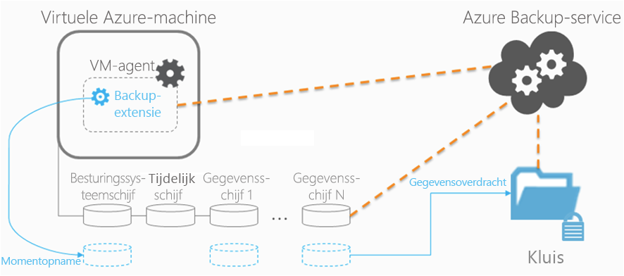
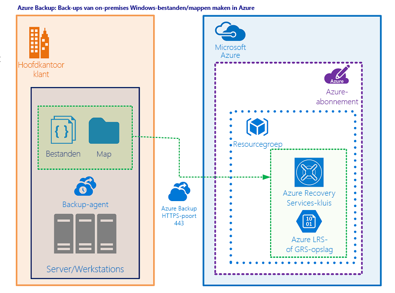
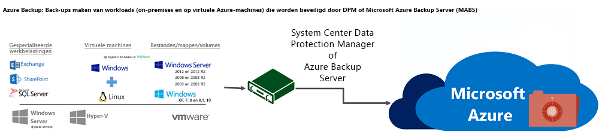

# Azure Backup-architectuur en -componenten

U de [Azure Backup-service](backup-overview.md) gebruiken om een back-up te maken van gegevens naar het Microsoft Azure-cloudplatform. In dit artikel worden azure back-uparchitectuur, componenten en processen samengevat.

## Wat doet Azure Backup?

Azure Backup maakt een back-up van de gegevens, machinestatus en workloads die worden uitgevoerd op on-premises machines en VM-exemplaren (Azure. Er zijn een aantal Azure Backup-scenario's.

## Hoe werkt Azure Backup?

U een back-up maken van machines en gegevens met behulp van een aantal methoden:

- **Back-up on-premises machines:**
  - U back-ups maken met on-premises Windows-machines rechtstreeks naar Azure met behulp van de MARS-agent (Azure Backup Microsoft Backup Services). Linux-machines worden niet ondersteund.
  - U back-ups maken van on-premises machines naar een back-upserver - of System Center Data Protection Manager (DPM) of Microsoft Azure Backup Server (MABS). U vervolgens een back-up maken van de back-upserver naar een vault van Recovery Services in Azure.

- **Back-ups maken van Azure VM's:**
  - U rechtstreeks back-ups maken van Azure VM's. Azure Backup installeert een back-upextensie voor de Azure VM-agent die op de VM wordt uitgevoerd. Deze extensie maakt een back-up van de hele VM.
  - U een back-up maken van specifieke bestanden en mappen op de Azure VM door de MARS-agent uit te voeren.
  - U een back-up maken van Azure VM's naar de MABS die in Azure wordt uitgevoerd, en u vervolgens een back-up maken van de MABS naar een vault van Recovery Services.

Meer informatie over [wat u maken van een back-up](backup-overview.md) en over ondersteunde [back-upscenario's.](backup-support-matrix.md)

## Waar wordt een back-up van gegevens gemaakt?

Azure Backup slaat back-upgegevens op in een vault van Recovery Services. Een kluis is een entiteit met onlineopslag in Azure die wordt gebruikt om gegevens vast te houden, zoals back-ups, herstelpunten en back-upbeleid.

Vaults van Recovery Services hebben de volgende functies:

- Kluizen maken het eenvoudig om uw back-upgegevens te ordenen, terwijl de overhead van het beheer wordt geminimaliseerd.
- In elk Azure-abonnement u maximaal 500 kluizen maken.
- U back-upitems in een kluis controleren, waaronder Azure VM's en on-premises machines.
- U kluistoegang beheren met [Azure-role-based access control (RBAC).](https://docs.microsoft.com/azure/role-based-access-control/role-assignments-portal)
- U geeft op hoe gegevens in de kluis worden gerepliceerd voor redundantie:
  - **Lokaal redundante opslag (LRS)**: Om te beschermen tegen storingen in een datacenter, u LRS gebruiken. LRS repliceert gegevens naar een opslagschaaleenheid. [Meer informatie](https://docs.microsoft.com/azure/storage/common/storage-redundancy-lrs).
  - **Geo-redundante opslag (GRS)**: Om te beschermen tegen regio-brede storingen, u GRS gebruiken. GRS repliceert uw gegevens naar een secundaire regio. [Meer informatie](https://docs.microsoft.com/azure/storage/common/storage-redundancy-grs).
  - Standaard gebruiken Vaults van Recovery Services GRS.

## Back-upagents

Azure Backup biedt verschillende back-ups, afhankelijk van het type machine dat een back-up maakt:

**Agent** | **Details**
--- | ---
**MARS-agent** | <ul><li>Wordt uitgevoerd op afzonderlijke on-premises Windows Server-machines om een back-up te maken van bestanden, mappen en de systeemstatus.</li> <li>Wordt uitgevoerd op Azure VM's om een back-up te maken van bestanden, mappen en de systeemstatus.</li> <li>Wordt uitgevoerd op DPM/MABS-servers om een back-up te maken van de lokale DPM/MABS-opslagschijf naar Azure.</li></ul>
**Azure VM-extensie** | Wordt uitgevoerd op Azure VM's om een back-up te maken van een kluis.

## Back-uptypen

In de volgende tabel worden de verschillende typen back-ups uitgelegd en wanneer deze worden gebruikt:

**Back-uptype** | **Details** | **Gebruik**
--- | --- | ---
**Volledig** | Een volledige back-up bevat de volledige gegevensbron. Neemt meer netwerkbandbreedte dan differentiële of incrementele back-ups. | Gebruikt voor de eerste back-up.
**Differentiële** |  Een differentiële back-up slaat de blokken op die zijn gewijzigd sinds de eerste volledige back-up. Gebruikt een kleinere hoeveelheid netwerk en opslag en bewaart geen overbodige kopieën van ongewijzigde gegevens.   Inefficiënt omdat gegevensblokken die ongewijzigd zijn tussen latere back-ups worden overgedragen en opgeslagen. | Niet gebruikt door Azure Backup.
**Incrementeel** | Een incrementele back-up slaat alleen de blokken met gegevens op die zijn gewijzigd sinds de vorige back-up. Hoge opslag- en netwerkefficiëntie.    Met incrementele back-up, is er geen noodzaak om aan te vullen met volledige back-ups. | Gebruikt door DPM/MABS voor schijfback-ups en gebruikt in alle back-ups van Azure. Niet gebruikt voor SQL Server-back-up.

## SQL Server-back-uptypen

In de volgende tabel worden de verschillende typen back-ups uitgelegd die worden gebruikt voor SQL Server-databases en hoe vaak deze worden gebruikt:

**Back-uptype** | **Details** | **Gebruik**
--- | --- | ---
**Volledige back-up** | Bij een volledige back-up wordt er een back-up van de hele database gemaakt. Het bevat alle gegevens in een specifieke database of in een set bestandsgroepen of bestanden. Een volledige back-up bevat ook voldoende logboeken om die gegevens te herstellen. | U kunt maximaal één volledige back-up per dag activeren.   U ervoor kiezen om een volledige back-up te maken op een dagelijkse of wekelijkse interval.
**Differentiële back-up** | Een differentiële back-up is gebaseerd op de meest recente, vorige back-up met volledige gegevens.   Het legt alleen de gegevens vast die zijn gewijzigd sinds de volledige back-up. |  U kunt maximaal één differentiële back-up per dag activeren.   U kunt niet zowel een volledige back-up als een differentiële back-up configureren op dezelfde dag.
**Back-up van transactielogboeken** | Met een logboekback-up kunt u herstel naar een bepaald tijdstip uitvoeren, tot op een specifieke seconde. | U kunt maximaal elke 15 minuten een back-up van het transactielogboek configureren.

### Vergelijking van back-uptypen

Opslagverbruik, hersteltijddoelstelling (RTO) en netwerkverbruik variëren voor elk type back-up. In de volgende afbeelding ziet u een vergelijking van de back-uptypen:

- Gegevensbron A bestaat uit 10 opslagblokken, A1-A10, waarvan maandelijks een back-up wordt ondersteund.
- Blokken A2, A3, A4 en A9 zijn in de eerste maand gewijzigd, en blok A5 is de maand erna gewijzigd.
- Voor differentiële back-ups worden in de tweede maand gewijzigde blokken A2, A3, A4 en A9 geback-upt. In de derde maand wordt er opnieuw een back-up gemaakt van dezelfde blokken en van het gewijzigde blok A5. Van de gewijzigde blokken worden back-ups gemaakt totdat de volgende volledige back-up wordt uitgevoerd.
- Voor incrementele back-ups worden in de tweede maand de blokken A2, A3, A4 en A9 gemarkeerd als gewijzigd en overgedragen. In het derde maand wordt alleen gewijzigd blok A5 gemarkeerd als gemarkeerd en overgedragen.

## Back-upfuncties

In de volgende tabel worden de ondersteunde functies voor de verschillende typen back-ups samengevat:

**Functie** | **Directe back-up van bestanden en mappen (met MARS-agent)** | **Azure VM-back-up** | **Machines of apps met DPM/MABS**
--- | --- | --- | ---
Back-up naar kluis | ![Ja][green] | ![Ja][green] | ![Ja][green]
Een back-up maken naar de DPM/MABS-schijf en vervolgens naar Azure | | | ![Ja][green]
Gegevens comprimeren die zijn verzonden voor back-up | ![Ja][green] | Er wordt geen compressie gebruikt bij het overbrengen van gegevens. Opslag wordt iets opgeblazen, maar de restauratie gaat sneller.  | ![Ja][green]
Incrementele back-up uitvoeren |![Ja][green] |![Ja][green] |![Ja][green]
Back-ups van gededupliceerdschijven | | | ![Gedeeltelijk][yellow]   Alleen voor DPM/MABS-servers die on-premises worden geïmplementeerd.

## Essentiële back-upbeleid

- Per kluis wordt een back-upbeleid gemaakt.
- Er kan een back-upbeleid worden gemaakt voor de back-up van volgende workloads
  - Azure VM
  - SQL in Azure VM
  - Azure-bestandsshare
- Aan veel resources kan een beleid worden toegewezen. Een Azure VM-back-upbeleid kan worden gebruikt om veel Azure VM's te beschermen.
- Een beleid bestaat uit twee componenten
  - Planning: Wanneer neemt u de back-up
  - Retentie: Hoe lang elke back-up moet worden behouden.
- Schema kan worden gedefinieerd als "dagelijks" of "wekelijks" met een specifiek tijdstip.
- Retentie kan worden gedefinieerd voor "dagelijks", "wekelijks", "maandelijks", "jaarlijks" back-uppunten.
- "wekelijks" verwijst naar een back-up op een bepaalde dag van de week, "maandelijks" betekent een back-up op een bepaalde dag van de maand en "jaarlijks" verwijst naar een back-up op een bepaalde dag van het jaar.
- Retentie voor "maandelijkse", "jaarlijkse" back-uppunten wordt aangeduid als "LongTermRetention".
- Wanneer een kluis wordt gemaakt, wordt ook een beleid voor Azure VM-backs met de naam 'Standaardbeleid' gemaakt en kan het worden gebruikt om back-ups van Azure VM's te maken.

## Architectuur: ingebouwde Azure VM Backup

1. Wanneer u een back-up inschakelt voor een Azure VM, wordt een back-up uitgevoerd volgens het schema dat u opgeeft.
1. Tijdens de eerste back-up wordt een back-upextensie op de VM geïnstalleerd als de VM wordt uitgevoerd.
    - Voor Windows VM's is de VMSnapshot-extensie geïnstalleerd.
    - Voor Linux VM's is de VMSnapshot Linux extensie geïnstalleerd.
1. De extensie maakt een momentopname op opslagniveau.
    - Voor Windows VM's die worden uitgevoerd, coördineert Back-up met de Windows Volume Shadow Copy Service (VSS) om een app-consistente momentopname van de VM te maken. Back-up maakt standaard volledige VSS-back-ups. Als Back-up geen momentopname voor app-consistent kan maken, wordt er een momentopname voor bestand nodig.
    - Voor Linux VM's maakt Backup een momentopname voor bestand. Voor app-consistente momentopnamen moet u vooraf/post-scripts handmatig aanpassen.
    - Back-up wordt geoptimaliseerd door een back-up te maken van elke VM-schijf parallel. Voor elke schijf die een back-up maakt, leest Azure Backup de blokken op schijf en worden alleen de gewijzigde gegevens opgeslagen.
1. Nadat de momentopname is gemaakt, worden de gegevens overgebracht naar de kluis.
    - Alleen blokken gegevens die sinds de laatste back-up zijn gewijzigd, worden gekopieerd.
    - Gegevens zijn niet versleuteld. Azure Backup kan een back-up maken van Azure VM's die zijn versleuteld met Azure Disk Encryption.
    - Momentopnamegegevens worden mogelijk niet onmiddellijk naar de kluis gekopieerd. Op piekmomenten kan de back-up enkele uren duren. De totale back-uptijd voor een VM is minder dan 24 uur voor het dagelijkse back-upbeleid.
1. Nadat de gegevens naar de kluis zijn verzonden, wordt een herstelpunt gemaakt. Snapshots worden standaard twee dagen bewaard voordat ze worden verwijderd. Deze functie maakt herstelbewerking van deze momentopnamen mogelijk, waardoor de hersteltijden worden afgebroken. Het vermindert de tijd die nodig is om gegevens uit de kluis te transformeren en terug te kopiëren. Zie [Azure Backup Instant Restore Capability](https://docs.microsoft.com/azure/backup/backup-instant-restore-capability).

U hoeft geen expliciete internetverbinding toe te staan om een back-up van uw Azure VM's te maken.

## Architectuur: directe back-up van on-premises Windows Server-machines of Azure VM-bestanden of -mappen

1. Als u het scenario wilt instellen, downloadt en installeert u de MARS-agent op de machine. Vervolgens selecteert u wat u wilt back-ups maken, wanneer back-ups worden uitgevoerd en hoe lang deze in Azure worden bewaard.
1. De eerste back-up wordt uitgevoerd volgens uw back-upinstellingen.
1. De MARS-agent gebruikt VSS om een point-in-time momentopname te maken van de volumes die zijn geselecteerd voor back-up.
    - De MARS-agent gebruikt alleen de schrijfbewerking van het Windows-systeem om de momentopname vast te leggen.
    - Omdat de agent geen vss-schrijvers van toepassing gebruikt, worden er geen app-consistente momentopnamen vastgelegd.
1. Nadat u de momentopname met VSS hebt gemaakt, maakt de MARS-agent een virtuele harde schijf (VHD) in de cachemap die u hebt opgegeven toen u de back-up configureerde. De agent slaat ook checksums op voor elk gegevensblok.
1. Incrementele back-ups worden uitgevoerd volgens het schema dat u opgeeft, tenzij u een on-demand back-up uitvoert.
1. In incrementele back-ups worden gewijzigde bestanden geïdentificeerd en wordt een nieuwe VHD gemaakt. De VHD wordt gecomprimeerd en versleuteld, en dan wordt het naar de kluis verzonden.
1. Nadat de incrementele back-up is voltooid, wordt de nieuwe VHD samengevoegd met de VHD die is gemaakt na de eerste replicatie. Deze samengevoegde VHD biedt de nieuwste status die moet worden gebruikt voor vergelijking voor doorlopende back-up.

## Architectuur: back-ups maken van DPM/MABS

1. U installeert de DPM- of MABS-beveiligingsagent op machines die u wilt beschermen. Vervolgens voegt u de machines toe aan een DPM-beveiligingsgroep.
    - Om on-premises machines te beschermen, moet de DPM- of MABS-server zich on-premises bevinden.
    - Om Azure VM's te beschermen, moet de MABS-server zich in Azure bevinden en wordt uitgevoerd als een Azure VM.
    - Met DPM/MABS u back-upvolumes, shares, bestanden en mappen beveiligen. U ook de systeemstatus van een machine (bare metal) beschermen en u specifieke apps beveiligen met app-bewuste back-upinstellingen.
1. Wanneer u beveiliging instelt voor een machine of app in DPM/MABS, selecteert u een back-up te maken naar de lokale MABS/DPM-schijf voor opslag op korte termijn en naar Azure voor onlinebescherming. U geeft ook op wanneer de back-up naar lokale DPM/MABS-opslag moet worden uitgevoerd en wanneer de online back-up naar Azure moet worden uitgevoerd.
1. Er wordt een back-up van de schijf van de beveiligde werkbelasting gemaakt naar de lokale MABS/DPM-schijven, volgens de door u opgegeven planning.
1. De DPM/MABS-schijven worden naar de kluis geback-upt door de MARS-agent die op de DPM/MABS-server wordt uitgevoerd.

## Azure VM-opslag

Azure VM's gebruiken schijven om hun besturingssysteem, apps en gegevens op te slaan. Elke Azure VM heeft ten minste twee schijven: een schijf voor het besturingssysteem en een tijdelijke schijf. Azure VM's kunnen ook gegevensschijven voor app-gegevens bevatten. Schijven worden opgeslagen als VHD's.

- VHD's worden opgeslagen als paginablobs in standaard- of premium opslagaccounts in Azure:
  - **Standaardopslag:** Betrouwbare, goedkope schijfondersteuning voor VM's met workloads die niet gevoelig zijn voor latentie. Standaardopslag kan gebruik maken van standaard SSD-schijven (Solid State Drive) of standaard harde schijfschijven (HDD's).
  - **Premium opslag:** Krachtige schijfondersteuning. Maakt gebruik van premium SSD-schijven.
- Er zijn verschillende prestatielagen voor schijven:
  - **Standaard HDD-schijf:** Ondersteund door HDD's en gebruikt voor kosteneffectieve opslag.
  - **Standaard SSD-schijf:** Combineert elementen van premium SSD-schijven en standaard HDD-schijven. Biedt consistentere prestaties en betrouwbaarheid dan HDD, maar nog steeds kosteneffectief.
  - **Premium SSD schijf:** Ondersteund door SSD's en biedt krachtige en lage latentie voor VM's waarop I/O-intensieve workloads worden uitgevoerd.
- Schijven kunnen worden beheerd of niet beheerd:
  - **Niet-beheerde schijven:** Traditioneel type schijven dat door VM's wordt gebruikt. Voor deze schijven maakt u uw eigen opslagaccount aan en geeft u dit op wanneer u de schijf maakt. Vervolgens moet u uitzoeken hoe u de opslagresources voor uw VM's maximaliseren.
  - **Beheerde schijven:** Azure maakt en beheert de opslagaccounts voor u. U geeft de schijfgrootte en prestatielaag op en Azure maakt beheerde schijven voor u. Terwijl u schijven toevoegt en VM's schaalt, verwerkt Azure de opslagaccounts.

Zie de volgende artikelen voor meer informatie over schijfopslag en de beschikbare schijftypen voor VM's:

- [Azure beheerde schijven voor Windows VM's](../virtual-machines/windows/managed-disks-overview.md)
- [Azure beheerde schijven voor Linux VM's](../virtual-machines/linux/managed-disks-overview.md)
- [Beschikbare schijftypen voor VM's](../virtual-machines/windows/disks-types.md)

### Back-ups maken en Azure VM's herstellen met premium opslag

U een back-up maken van Azure VM's met behulp van premium opslag met Azure Backup:

- Tijdens het proces van back-ups van VM's met premium opslag, maakt de Back-upservice een tijdelijke faseringslocatie, genaamd *AzureBackup,* in het opslagaccount. De grootte van de faseringslocatie is gelijk aan de grootte van de momentopname van het herstelpunt.
- Zorg ervoor dat het premium opslagaccount voldoende vrije ruimte heeft om de tijdelijke halteplaats te huisvesten. Zie [Schaalbaarheidsdoelen voor blob-opslagaccounts voor premium pagina's](../storage/blobs/scalability-targets-premium-page-blobs.md)voor meer informatie . Wijzig de faseringslocatie niet.
- Nadat de back-uptaak is voltooid, wordt de faseringslocatie verwijderd.
- De prijs van de opslag die wordt gebruikt voor de halteplaats is in overeenstemming met [de prijzen voor premium opslag](../virtual-machines/windows/disks-types.md#billing).

Wanneer u Azure VM's herstelt met behulp van premium opslag, u deze herstellen naar premium- of standaardopslag. Normaal gesproken zou u ze herstellen naar premium opslag. Maar als u slechts een subset van bestanden van de VM nodig hebt, kan het kosteneffectief zijn om ze te herstellen naar standaardopslag.

### Back-ups maken en beheerde schijven herstellen

U een back-up maken van Azure VM's met beheerde schijven:

- U maakt een back-up van VM's met beheerde schijven op dezelfde manier als elke andere Azure-vm. U de vm rechtstreeks vanuit de instellingen van de virtuele machine een back-up maken of u back-ups voor VM's inschakelen in de kluis Van Herstelservices.
- U kunt back-ups maken van virtuele machines op beheerde schijven via RestorePoint-verzamelingen die zijn gebouwd boven op beheerde schijven.
- Azure Backup ondersteunt ook back-ups van VM's met beheerde schijven die zijn versleuteld met Azure Disk Encryption.

Wanneer u VM's herstelt met beheerde schijven, u herstellen naar een volledige virtuele machine met beheerde schijven of naar een opslagaccount:

- Tijdens het herstelproces verwerkt Azure de beheerde schijven. Als u de optie opslagaccount gebruikt, beheert u het opslagaccount dat tijdens het herstelproces is gemaakt.
- Als u een versleutelde beheerde vm herstelt, controleert u of de sleutels en geheimen van de vm in de sleutelkluis bestaan voordat u het herstelproces start.

## Volgende stappen

- Bekijk de ondersteuningsmatrix voor [meer informatie over ondersteunde functies en beperkingen voor back-upscenario's.](backup-support-matrix.md)
- Back-up instellen voor een van deze scenario's:
  - [Back-ups maken van Azure VM's](backup-azure-arm-vms-prepare.md).
  - [Rechtstreeks een back-up maken van Windows-machines](tutorial-backup-windows-server-to-azure.md), zonder een back-upserver.
  - [MABS instellen](backup-azure-microsoft-azure-backup.md) voor het maken van een back-up naar Azure, en vervolgens een back-up van workloads naar MABS maken.
  - [DPM instellen](backup-azure-dpm-introduction.md) voor het maken van een back-up naar Azure, en vervolgens een back-up van workloads naar DPM maken.

[green]: ./media/backup-architecture/green.png
[yellow]: ./media/backup-architecture/yellow.png
[red]: ./media/backup-architecture/red.png
