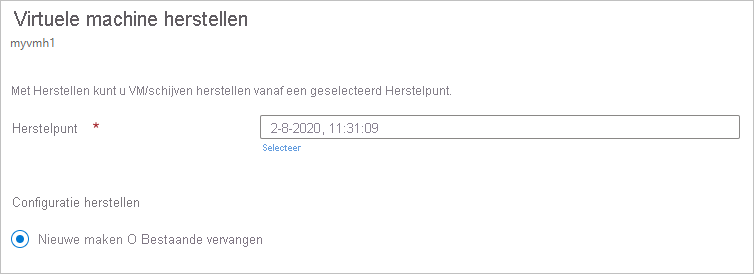
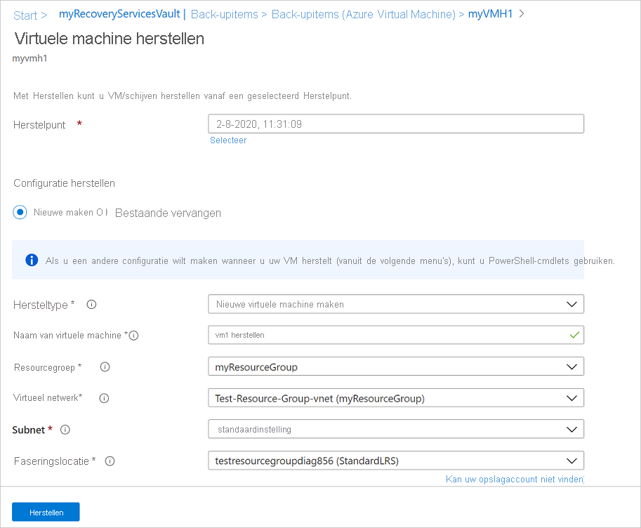
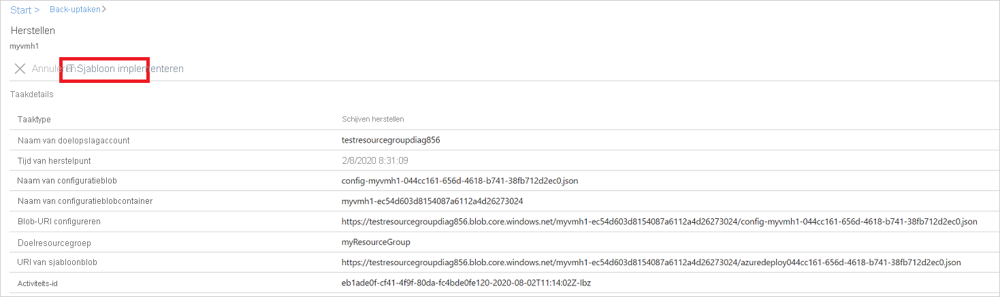
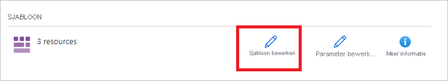
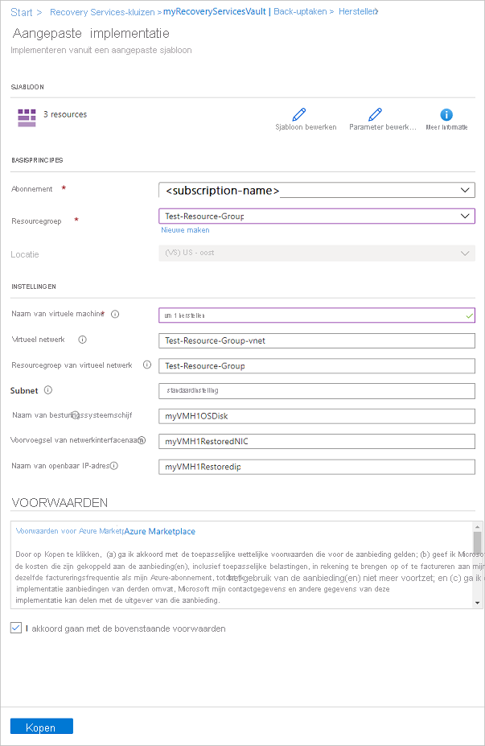
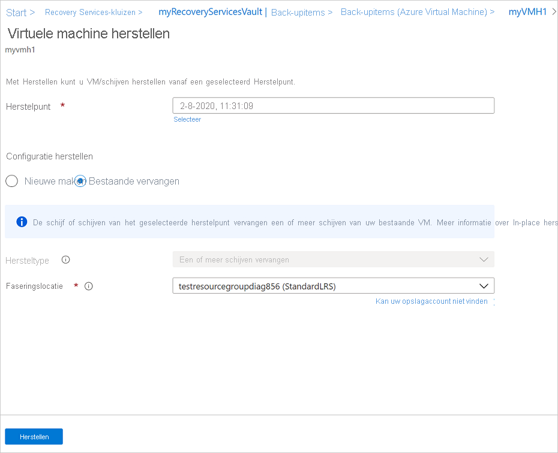
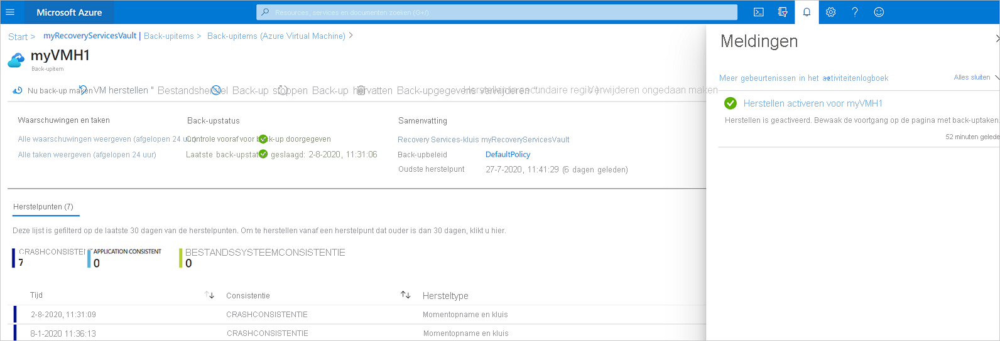
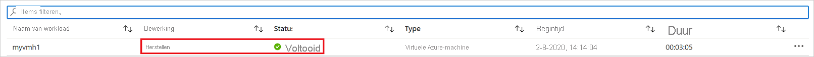

# <a name="how-to-restore-azure-vm-data-in-azure-portal"></a>Azure VM-gegevens herstellen in Azure Portal

In dit artikel wordt beschreven hoe u Azure VM-gegevens terugzet van de herstel punten die zijn opgeslagen in [Azure Backup](backup-overview.md) Recovery Services kluizen.

## <a name="restore-options"></a>Herstelopties

Azure Backup biedt een aantal manieren om een virtuele machine te herstellen.

**Optie voor terugzetten** | **Details**
--- | ---
**Een nieuwe virtuele machine maken** | Maakt en haalt snel een standaard-VM op die vanaf een herstel punt actief is.<br/><br/> U kunt een naam opgeven voor de virtuele machine, de resource groep en het virtuele netwerk (VNet) selecteren waarin deze wordt geplaatst en een opslag account opgeven voor de herstelde VM. De nieuwe virtuele machine moet in dezelfde regio worden gemaakt als de bron-VM.<br><br>Als het herstellen van een virtuele machine mislukt omdat een Azure VM-SKU niet beschikbaar is in de opgegeven regio van Azure of als gevolg van andere problemen, worden de schijven in de opgegeven resource groep door Azure Backup nog steeds hersteld.
**Schijf herstellen** | Hiermee wordt een VM-schijf teruggezet, die vervolgens kan worden gebruikt om een nieuwe virtuele machine te maken.<br/><br/> Azure Backup biedt een sjabloon waarmee u een virtuele machine kunt aanpassen en maken. <br/><br> De herstel taak genereert een sjabloon die u kunt downloaden en gebruiken om aangepaste VM-instellingen op te geven en om een virtuele machine te maken.<br/><br/> De schijven worden gekopieerd naar de resource groep die u opgeeft.<br/><br/> U kunt de schijf ook koppelen aan een bestaande virtuele machine of een nieuwe virtuele machine maken met behulp van Power shell.<br/><br/> Deze optie is handig als u de virtuele machine wilt aanpassen, configuratie-instellingen wilt toevoegen die niet aanwezig zijn op het moment van de back-up of instellingen toevoegen die moeten worden geconfigureerd met de sjabloon of Power shell.
**Bestaande schijf vervangen** | U kunt een schijf herstellen en gebruiken om een schijf op de bestaande virtuele machine te vervangen.<br/><br/> De huidige VM moet bestaan. Als deze is verwijderd, kan deze optie niet worden gebruikt.<br/><br/> Azure Backup maakt een moment opname van de bestaande virtuele machine voordat de schijf wordt vervangen en slaat deze op in de faserings locatie die u opgeeft. Bestaande schijven die zijn verbonden met de virtuele machine, worden vervangen door het geselecteerde herstel punt.<br/><br/> De moment opname wordt gekopieerd naar de kluis en bewaard in overeenstemming met het Bewaar beleid. <br/><br/> Na de vervangen schijf bewerking wordt de oorspronkelijke schijf in de resource groep bewaard. U kunt ervoor kiezen om de oorspronkelijke schijven hand matig te verwijderen als ze niet nodig zijn. <br/><br/>Bestaande vervangen wordt ondersteund voor niet-versleutelde beheerde Vm's, waaronder Vm's [die zijn gemaakt met behulp van aangepaste installatie kopieën](https://azure.microsoft.com/resources/videos/create-a-custom-virtual-machine-image-in-azure-resource-manager-with-powershell/). Het wordt niet ondersteund voor klassieke Vm's.<br/><br/> Als het herstel punt meer of minder schijven heeft dan de huidige virtuele machine, wordt in het aantal schijven in het herstel punt alleen de VM-configuratie weer gegeven.<br><br> Bestaande vervangen wordt ook ondersteund voor Vm's met gekoppelde resources, zoals door de [gebruiker toegewezen beheerde identiteit](../active-directory/managed-identities-azure-resources/overview.md) of [Key Vault](../key-vault/general/overview.md).
**Kruis regio (secundaire regio)** | Het terugzetten van meerdere regio's kan worden gebruikt om virtuele Azure-machines in de secundaire regio te herstellen. Dit is een [Azure-gekoppelde regio](../best-practices-availability-paired-regions.md#what-are-paired-regions).<br><br> U kunt alle virtuele machines van Azure voor het geselecteerde herstel punt herstellen als de back-up wordt uitgevoerd in de secundaire regio.<br><br> Deze functie is beschikbaar voor de volgende opties:<br> <li> [Een VM maken](#create-a-vm): <br> <li> [Schijven herstellen](#restore-disks) <br><br> De optie [bestaande schijven vervangen](#replace-existing-disks) wordt momenteel niet ondersteund.<br><br> Machtigingen<br> De herstel bewerking op de secundaire regio kan worden uitgevoerd met back-upbeheerders en app-beheerders.

> [!NOTE]
> U kunt ook specifieke bestanden en mappen op een virtuele Azure-machine herstellen. [Meer informatie](backup-azure-restore-files-from-vm.md).

## <a name="storage-accounts"></a>Opslagaccounts

Enkele details over opslag accounts:

- **VM maken**: wanneer u een nieuwe virtuele machine maakt, wordt de virtuele machine opgenomen in het opslag account dat u opgeeft.
- **Schijf herstellen**: wanneer u een schijf herstelt, wordt de schijf gekopieerd naar het opslag account dat u opgeeft. De herstel taak genereert een sjabloon die u kunt downloaden en gebruiken om aangepaste VM-instellingen op te geven. Deze sjabloon wordt opgenomen in het opgegeven opslag account.
- **Schijf vervangen**: wanneer u een schijf vervangt in een bestaande virtuele machine, maakt Azure Backup een moment opname van de bestaande virtuele machine voordat de schijf wordt vervangen. De moment opname wordt ook als achtergrond proces gekopieerd naar de Recovery Services kluis via gegevens overdracht. Zodra de momentopname fase is voltooid, wordt de bewerking schijven vervangen echter geactiveerd. Nadat de schijf is vervangen, blijven de schijven van de bron-VM van Azure in de opgegeven resource groep voor uw bewerking staan en worden de Vhd's opgeslagen in het opgegeven opslag account. U kunt ervoor kiezen deze Vhd's en schijven te verwijderen of te behouden.
- **Locatie van opslag account**: het opslag account moet zich in dezelfde regio bevinden als de kluis. Alleen deze accounts worden weer gegeven. Als de locatie geen opslag accounts bevat, moet u er een maken.
- **Opslag type**: Blob Storage wordt niet ondersteund.
- **Opslag redundantie**: zone redundante opslag (ZRS) wordt niet ondersteund. De gegevens over replicatie en redundantie voor het account worden tussen haakjes weer gegeven na de account naam.
- **Premium-opslag**:
  - Wanneer u niet-Premium Vm's herstelt, worden Premium-opslag accounts niet ondersteund.
  - Premium Storage-accounts die zijn geconfigureerd met netwerk regels worden niet ondersteund bij het herstellen van beheerde Vm's.

## <a name="before-you-start"></a>Voordat u begint

Als u een virtuele machine wilt herstellen (een nieuwe virtuele machine maken), moet u ervoor zorgen dat u over de juiste toegangs [machtigingen](backup-rbac-rs-vault.md#mapping-backup-built-in-roles-to-backup-management-actions) voor Azure op basis van rollen (Azure RBAC) beschikt voor de bewerking VM herstellen.

Als u geen machtigingen hebt, kunt u [een schijf herstellen](#restore-disks)en nadat de schijf is hersteld, kunt u [de sjabloon](#use-templates-to-customize-a-restored-vm) die is gegenereerd als onderdeel van de herstel bewerking, gebruiken om een nieuwe virtuele machine te maken.

## <a name="select-a-restore-point"></a>Selecteer een herstel punt

1. Selecteer **Back-upitems**  >  **Azure virtual machine**in de kluis die is gekoppeld aan de virtuele machine die u wilt herstellen.
1. Selecteer een virtuele machine. Standaard worden in het VM-dash board herstel punten van de afgelopen 30 dagen weer gegeven. U kunt herstel punten ouder dan 30 dagen weer geven of filteren om herstel punten te vinden op basis van datums, peri Oden en verschillende soorten consistentie van moment opnamen.
1. Als u de virtuele machine wilt herstellen, selecteert u **VM herstellen**.

    

1. Selecteer een herstel punt dat voor het herstel moet worden gebruikt.

## <a name="choose-a-vm-restore-configuration"></a>Een configuratie voor het herstellen van VM'S kiezen

1. Selecteer een terugzet optie in **virtuele machine herstellen**:
    - **Nieuwe maken**: gebruik deze optie als u een nieuwe virtuele machine wilt maken. U kunt een virtuele machine maken met eenvoudige instellingen, of een schijf herstellen en een aangepaste virtuele machine maken.
    - **Bestaande vervangen**: gebruik deze optie als u de schijven op een bestaande virtuele machine wilt vervangen.

        

1. Geef de instellingen voor de geselecteerde terugzet optie op.

## <a name="create-a-vm"></a>Een virtuele machine maken

Als een van de [Opties voor terugzetten](#restore-options)kunt u snel een virtuele machine maken met de basis instellingen van een herstel punt.

1. In **virtuele machine herstellen**  >  **nieuwe**  >  **herstel type**maken selecteert u **een virtuele machine maken**.
1. Geef in naam van de **virtuele machine**een VM op die niet voor komt in het abonnement.
1. Selecteer in **resource groep**een bestaande resource groep voor de nieuwe virtuele machine of maak een nieuwe met een wereld wijd unieke naam. Als u een naam toewijst die al bestaat, wijst Azure de groep dezelfde naam als de virtuele machine toe.
1. Selecteer in **virtueel netwerk**het VNet waarin de virtuele machine wordt geplaatst. Alle VNets die aan het abonnement zijn gekoppeld, worden weer gegeven. Selecteer het subnet. Het eerste subnet is standaard geselecteerd.
1. Geef in **faserings locatie**het opslag account voor de virtuele machine op. [Meer informatie](#storage-accounts).

    

1. Selecteer **herstellen** om de herstel bewerking te activeren.

## <a name="restore-disks"></a>Schijven herstellen

Als een van de [Opties voor terugzetten](#restore-options)kunt u een schijf maken op basis van een herstel punt. Vervolgens kunt u met de schijf een van de volgende acties uitvoeren:

- Gebruik de sjabloon die tijdens de herstel bewerking is gegenereerd om de instellingen aan te passen en VM-implementatie te activeren. U bewerkt de standaard sjabloon instellingen en verzendt de sjabloon voor de implementatie van de virtuele machine.
- De [herstelde schijven koppelen](../virtual-machines/windows/attach-managed-disk-portal.md) aan een bestaande virtuele machine.
- [Maak een nieuwe virtuele machine](./backup-azure-vms-automation.md#create-a-vm-from-restored-disks) op basis van de herstelde schijven met behulp van Power shell.

1. Selecteer in **configuratie herstellen**  >  **nieuwe**  >  **herstel type**maken de optie **schijven herstellen**.
1. Selecteer in **resource groep**een bestaande resource groep voor de herstelde schijven of maak een nieuw item met een wereld wijd unieke naam.
1. Geef bij **faserings locatie**het opslag account op waarnaar de vhd's moeten worden gekopieerd. [Meer informatie](#storage-accounts).

    

1. Selecteer **herstellen** om de herstel bewerking te activeren.

Als uw virtuele machine gebruikmaakt van beheerde schijven en u de optie **virtuele machine maken** selecteert, gebruikt Azure Backup niet het opgegeven opslag account. In het geval van **herstel schijven** en **direct terugzetten**wordt het opslag account alleen gebruikt voor het opslaan van de sjabloon. Beheerde schijven worden gemaakt in de opgegeven resource groep.
Als uw virtuele machine gebruikmaakt van niet-beheerde schijven, worden deze hersteld als blobs naar het opslag account.

### <a name="use-templates-to-customize-a-restored-vm"></a>Sjablonen gebruiken om een herstelde VM aan te passen

Nadat de schijf is hersteld, gebruikt u de sjabloon die is gegenereerd als onderdeel van de herstel bewerking om een nieuwe virtuele machine aan te passen en te maken:

1. Selecteer in **back-uptaken**de relevante herstel taak.

1. Selecteer in **herstellen**de optie **sjabloon implementeren** om de implementatie van een sjabloon te initiëren.

    

1. Als u de VM-instelling die in de sjabloon is opgenomen wilt aanpassen, selecteert u **sjabloon bewerken**. Als u meer aanpassingen wilt toevoegen, selecteert u **para meters bewerken**.
    - Meer [informatie](../azure-resource-manager/templates/deploy-portal.md#deploy-resources-from-custom-template) over het implementeren van resources vanuit een aangepaste sjabloon.
    - [Meer informatie](../azure-resource-manager/templates/template-syntax.md) over het ontwerpen van sjablonen.

   

1. Voer de aangepaste waarden voor de virtuele machine in, accepteer de **voor waarden** en selecteer **aanschaffen**.

   

## <a name="replace-existing-disks"></a>Bestaande schijven vervangen

Als een van de [Opties voor terugzetten](#restore-options)kunt u een bestaande VM-schijf vervangen door het geselecteerde herstel punt. Alle terugzet opties [bekijken](#restore-options) .

1. Selecteer in **configuratie herstellen**de optie **bestaande vervangen**.
1. Selecteer in **type herstel**de optie **schijf/s vervangen**. Dit is het herstel punt dat wordt gebruikt om bestaande VM-schijven te vervangen.
1. Geef bij **faserings locatie**op waar moment opnamen van de huidige beheerde schijven moeten worden opgeslagen tijdens het herstel proces. [Meer informatie](#storage-accounts).

   

## <a name="cross-region-restore"></a>Meerdere regio's herstellen

Als een van de [Opties voor terugzetten](#restore-options)met behulp van cross Region Restore (CRR) kunt u virtuele Azure-machines herstellen in een secundaire regio, een Azure-gekoppelde regio.

Lees de [sectie voordat u begint](./backup-create-rs-vault.md#set-cross-region-restore)om het onderdeel tijdens de preview-periode onboarding uit te voeren.

Als u wilt zien of CRR is ingeschakeld, volgt u de instructies in [herstel van meerdere regio's configureren](backup-create-rs-vault.md#configure-cross-region-restore)

### <a name="view-backup-items-in-secondary-region"></a>Back-upitems in secundaire regio weer geven

Als CRR is ingeschakeld, kunt u de back-upitems in de secundaire regio weer geven.

1. Ga vanuit de portal naar **Recovery Services kluis**  >  **Back-upitems**
1. Selecteer **secundaire regio** om de items in de secundaire regio weer te geven.

    

    

### <a name="restore-in-secondary-region"></a>Herstellen in secundaire regio

De gebruikers ervaring voor het herstellen van de secundaire regio is vergelijkbaar met de gebruikers ervaring voor het herstellen van de primaire regio. Wanneer u details in het configuratie venster voor herstellen configureert om uw herstel te configureren, wordt u gevraagd om alleen para meters van secundaire regio's op te geven.


>[!NOTE]
>Het virtuele netwerk in de secundaire regio moet uniek worden toegewezen en kan niet worden gebruikt voor andere virtuele machines in die resource groep.


- Als u een virtuele machine wilt herstellen en maken, raadpleegt u [een virtuele machine maken](#create-a-vm).
- Raadpleeg [schijven herstellen](#restore-disks)als u de schijf wilt herstellen.

>[!NOTE]
>
>- Nadat de herstel bewerking is geactiveerd en in de fase voor gegevens overdracht, kan de herstel taak niet worden geannuleerd.
>- De functie voor het terugzetten van meerdere regio's herstelt CMK (door de klant beheerde sleutels) ingeschakelde Azure-Vm's waarvoor geen back-up is gemaakt in een CMK ingeschakeld Recovery Services kluis als niet-CMK ingeschakelde virtuele machines in de secundaire regio.
>- De Azure-rollen die nodig zijn voor het herstellen van de secundaire regio, zijn hetzelfde als die in de primaire regio.

### <a name="monitoring-secondary-region-restore-jobs"></a>Taken voor het herstellen van secundaire regio's bewaken

1. Ga vanuit de portal naar **Recovery Services kluis**  >  **back-uptaken**
1. Selecteer **secundaire regio** om de items in de secundaire regio weer te geven.

    

## <a name="restoring-unmanaged-vms-and-disks-as-managed"></a>Onbeheerde Vm's en schijven herstellen als beheerd

U hebt de mogelijkheid om [onbeheerde schijven](../storage/common/storage-disaster-recovery-guidance.md#azure-unmanaged-disks) te herstellen als [beheerde schijven](../virtual-machines/managed-disks-overview.md) tijdens het herstellen. Standaard worden de niet-beheerde Vm's/schijven teruggezet als onbeheerde Vm's/schijven. Als u echter kiest voor het herstellen als beheerde Vm's/schijven, is dit nu mogelijk. Deze herstel bewerkingen worden niet geactiveerd vanuit de momentopname fase, maar alleen vanuit de kluis fase. Deze functie is niet beschikbaar voor niet-beheerde versleutelde Vm's.


## <a name="restore-vms-with-special-configurations"></a>Vm's herstellen met speciale configuraties

Er zijn een aantal algemene scenario's waarin u mogelijk Vm's moet herstellen.

**Scenario** | **Hulp**
--- | ---
**Vm's herstellen met voor deel voor hybride gebruik** | Als een virtuele Windows-machine gebruikmaakt van [hybride licenties voor voor delen (hub)](../virtual-machines/windows/hybrid-use-benefit-licensing.md), herstelt u de schijven en maakt u een nieuwe virtuele machine met behulp van de meegeleverde sjabloon (waarbij **licentie type** is ingesteld op **Windows_Server**) of Power shell.  Deze instelling kan ook worden toegepast nadat de virtuele machine is gemaakt.
**Vm's herstellen tijdens een nood geval in azure Data Center** | Als de kluis gebruikmaakt van GRS en het primaire Data Center voor de virtuele machine uitvalt, Azure Backup ondersteunt het herstellen van back-ups van virtuele machines naar het gekoppelde Data Center. Selecteer een opslag account in het gekoppelde Data Center en herstel als normaal. Azure Backup gebruikt de compute-service in de gekoppelde regio om de herstelde VM te maken. Meer [informatie](/azure/architecture/resiliency/recovery-loss-azure-region) over de flexibiliteit van data centers.<br><br> Als de kluis gebruikmaakt van GRS, kunt u de nieuwe functie, [meerdere regio's herstellen](#cross-region-restore)kiezen. Zo kunt u een tweede regio in volledige of gedeeltelijke storings scenario's herstellen, of zelfs als er helemaal geen onderbreking is.
**VM van één domein controller herstellen in één domein** | Herstel de VM, zoals elke andere virtuele machine. Opmerking:<br/><br/> Vanuit een Active Directory perspectief is de virtuele machine van Azure net als elke andere virtuele machine.<br/><br/> Directory Services Restore Mode (DSRM) is ook beschikbaar, dus alle Active Directory herstel scenario's zijn levensvatbaar. Meer [informatie](#post-restore-steps) over het maken van back-ups en het herstellen van overwegingen voor gevirtualiseerde domein controllers.
**Meerdere Vm's van domein controllers in één domein herstellen** | Als andere domein controllers in hetzelfde domein kunnen worden bereikt via het netwerk, kan de domein controller worden hersteld, zoals elke VM. Als het de laatste domein controller in het domein is, of als er een herstel in een geïsoleerd netwerk is uitgevoerd, gebruikt u een [forest recovery](/windows-server/identity/ad-ds/manage/ad-forest-recovery-single-domain-in-multidomain-recovery).
**Meerdere domeinen in één forest herstellen** | We raden u aan een [forest-herstel](/windows-server/identity/ad-ds/manage/ad-forest-recovery-single-domain-in-multidomain-recovery)uit te voeren.
**Bare-metal terugzet bewerking** | Het belangrijkste verschil tussen Azure Vm's en on-premises Hyper visors is dat er geen VM-console beschikbaar is in Azure. Een-console is vereist voor bepaalde scenario's, zoals het herstellen met behulp van een Bare-Metal Recovery (BMR)-type back-up. Het terugzetten van de VM vanuit de kluis is echter een volledige vervanging van BMR.
**Vm's herstellen met speciale netwerk configuraties** | Speciale netwerk configuraties zijn Vm's met behulp van interne of externe taak verdeling, met behulp van meerdere NIC'S of meerdere gereserveerde IP-adressen. U herstelt deze Vm's met behulp van de [optie schijf herstellen](#restore-disks). Met deze optie maakt u een kopie van de Vhd's naar het opgegeven opslag account en kunt u vervolgens een virtuele machine maken met een [intern](../load-balancer/load-balancer-get-started-ilb-arm-ps.md) of [extern](../load-balancer/quickstart-create-standard-load-balancer-powershell.md) Load Balancer, [meerdere nic's](../virtual-machines/windows/multiple-nics.md)of [meerdere gereserveerde IP-adressen](../virtual-network/virtual-network-multiple-ip-addresses-powershell.md), in overeenstemming met uw configuratie.
**Netwerk beveiligings groep (NSG) op NIC/subnet** | Azure VM Backup ondersteunt het maken van back-ups en het herstellen van NSG-informatie op vnet-, subnet-en NIC-niveau.
**Met zone vastgemaakte Vm's** | Als u een back-up maakt van een virtuele machine van Azure die is vastgemaakt aan een zone (met Azure Backup), kunt u deze herstellen in dezelfde zone als waarin deze is vastgemaakt. [Meer informatie](../availability-zones/az-overview.md)
**Herstel de virtuele machine in een beschikbaarheidsset** | Wanneer u een virtuele machine herstelt vanuit de portal, is er geen optie om een beschikbaarheidsset te kiezen. Een herstelde VM heeft geen beschikbaarheidsset. Als u de optie schijf herstellen gebruikt, kunt u [een beschikbaarheidsset opgeven](../virtual-machines/windows/tutorial-availability-sets.md) wanneer u een virtuele machine van de schijf maakt met behulp van de meegeleverde sjabloon of Power shell.
**Speciale Vm's herstellen, zoals SQL-Vm's** | Als u een back-up van een SQL-VM maakt met behulp van Azure VM backup en vervolgens de optie VM herstellen gebruikt of een virtuele machine maakt na het herstellen van schijven, moet de zojuist gemaakte virtuele machine zijn geregistreerd bij de SQL-provider zoals [hier](../azure-sql/virtual-machines/windows/sql-vm-resource-provider-register.md?tabs=azure-cli%2Cbash)wordt vermeld. Hiermee wordt de herstelde VM geconverteerd naar een SQL-VM.

## <a name="track-the-restore-operation"></a>De herstel bewerking bijhouden

Nadat u de herstel bewerking hebt geactiveerd, maakt de back-upservice een taak voor tracering. Azure Backup worden meldingen over de taak weer gegeven in de portal. Als ze niet zichtbaar zijn, selecteert u het **meldingen** symbool en selecteert u vervolgens **meer gebeurtenissen in het activiteiten logboek** om de status van het herstel proces weer te geven.



 Volg de volgende stappen om de herstel bewerking te volgen:

1. Selecteer de Hyper Link meldingen om de bewerkingen voor de taak weer te geven. U kunt ook **back-uptaken**in de kluis selecteren en vervolgens de relevante VM selecteren.

    

1. Als u de voortgang van de herstel bewerking wilt controleren, selecteert u een herstel taak met de status **in uitvoering**. Hiermee wordt de voortgangs balk weer gegeven, die informatie over de voortgang van de herstel bewerking weergeeft:

    - **Geschatte tijd van herstellen**: de tijd die nodig is om de herstel bewerking te volt ooien. Wanneer de bewerking wordt uitgevoerd, wordt de tijd die nodig is om de herstel bewerking te volt ooien, gereduceerd en bereikt.
    - Het **percentage van de herstel bewerking**. Toont het percentage van de herstel bewerking dat is uitgevoerd.
    - **Aantal overgebrachte bytes**: als u een nieuwe VM maakt, worden de bytes weer gegeven die zijn overgedragen voor het totale aantal bytes dat moet worden overgedragen.

## <a name="post-restore-steps"></a>Stappen na herstel

Er zijn een aantal dingen die u moet weten na het herstellen van een virtuele machine:

- Uitbrei dingen die aanwezig zijn tijdens de back-upconfiguratie, worden geïnstalleerd, maar niet ingeschakeld. Als er een probleem wordt weer geven, installeert u de uitbrei dingen opnieuw.
- Als de back-up van de virtuele machine een statisch IP-adres heeft, heeft de herstelde VM een dynamisch IP-adres om een conflict te voor komen. U kunt [een statisch IP-adres toevoegen aan de herstelde VM](/powershell/module/az.network/set-aznetworkinterfaceipconfig#description).
- Een herstelde VM heeft geen beschikbaarheidsset. Als u de optie schijf herstellen gebruikt, kunt u [een beschikbaarheidsset opgeven](../virtual-machines/windows/tutorial-availability-sets.md) wanneer u een virtuele machine van de schijf maakt met behulp van de meegeleverde sjabloon of Power shell.
- Als u een Linux-distributie op basis van Cloud-init gebruikt, zoals Ubuntu, om veiligheids redenen wordt het wacht woord na het herstellen geblokkeerd. Gebruik de VMAccess-extensie op de herstelde VM om [het wacht woord opnieuw](../virtual-machines/troubleshooting/reset-password.md)in te stellen. U kunt het beste SSH-sleutels gebruiken voor deze distributies, dus u hoeft het wacht woord niet opnieuw in te stellen na het herstellen.
- Als u na het herstellen geen toegang hebt tot een virtuele machine omdat de virtuele machine een verbroken relatie met de domein controller heeft, volgt u de onderstaande stappen om de virtuele machine te openen:
  - Koppel de besturingssysteem schijf als een gegevens schijf aan een herstelde VM.
  - Installeer de VM-agent hand matig als de Azure agent niet meer reageert door deze [koppeling](../virtual-machines/troubleshooting/install-vm-agent-offline.md)te volgen.
  - Toegang tot seriële console inschakelen op VM om opdracht regel toegang tot de virtuele machine toe te staan

  ```cmd
    bcdedit /store <drive letter>:\boot\bcd /enum
    bcdedit /store <VOLUME LETTER WHERE THE BCD FOLDER IS>:\boot\bcd /set {bootmgr} displaybootmenu yes
    bcdedit /store <VOLUME LETTER WHERE THE BCD FOLDER IS>:\boot\bcd /set {bootmgr} timeout 5
    bcdedit /store <VOLUME LETTER WHERE THE BCD FOLDER IS>:\boot\bcd /set {bootmgr} bootems yes
    bcdedit /store <VOLUME LETTER WHERE THE BCD FOLDER IS>:\boot\bcd /ems {<<BOOT LOADER IDENTIFIER>>} ON
    bcdedit /store <VOLUME LETTER WHERE THE BCD FOLDER IS>:\boot\bcd /emssettings EMSPORT:1 EMSBAUDRATE:115200
    ```

  - Wanneer de virtuele machine opnieuw wordt opgebouwd Azure Portal om de lokale beheerders account en het wacht woord opnieuw in te stellen
  - Seriële console Access en CMD gebruiken om de VM uit het domein te ontkoppelen

    ```cmd
    cmd /c "netdom remove <<MachineName>> /domain:<<DomainName>> /userD:<<DomainAdminhere>> /passwordD:<<PasswordHere>> /reboot:10 /Force"
    ```

- Zodra de VM is ontkoppeld en opnieuw is gestart, kunt u met behulp van de lokale beheerders referenties van RDP naar de VM gaan en de VM opnieuw toevoegen aan het domein.

## <a name="backing-up-restored-vms"></a>Back-ups maken van herstelde Vm's

- Als u een virtuele machine hebt hersteld naar dezelfde resource groep met dezelfde naam als de oorspronkelijke back-up van de virtuele machine, wordt de back-up na het herstellen voortgezet op de virtuele machine.
- Als u de VM hebt hersteld naar een andere resource groep of als u een andere naam hebt opgegeven voor de herstelde VM, moet u een back-up instellen voor de herstelde VM.

## <a name="next-steps"></a>Volgende stappen

- Als u problemen ondervindt tijdens het herstel proces, [raadpleegt](backup-azure-vms-troubleshoot.md#restore) u veelvoorkomende problemen en fouten.
- Meer informatie over het [beheren van virtuele machines](backup-azure-manage-vms.md) nadat de virtuele machine is hersteld
