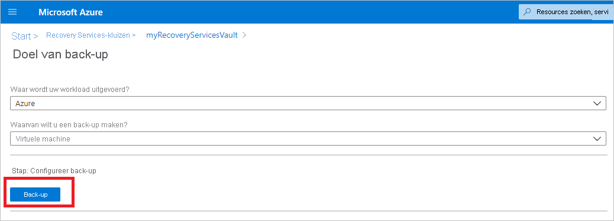
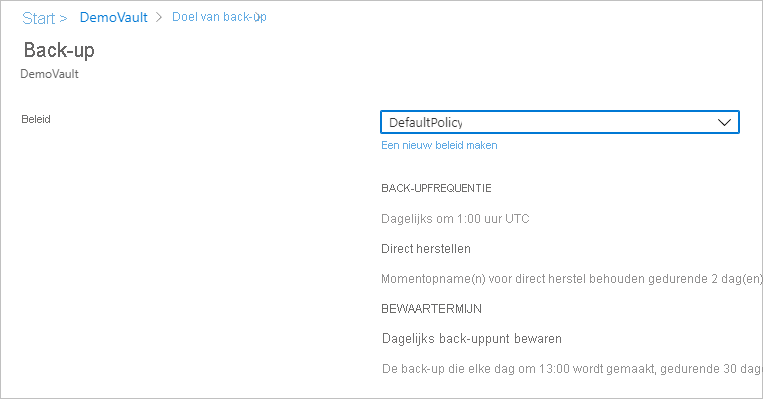
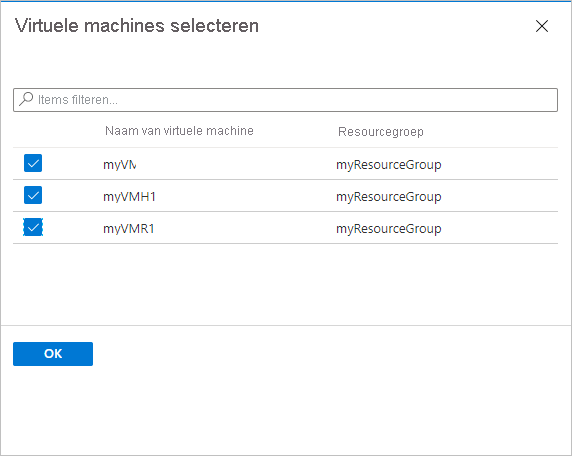
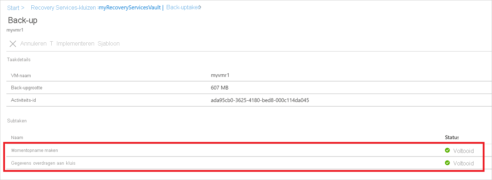

# Back-ups maken van virtuele Azure-machines in een Recovery Services kluis

In dit artikel wordt beschreven hoe u back-ups maakt van virtuele Azure-machines in een Recovery Services kluis, met behulp van de [Azure backup](backup-overview.md) -service.

In dit artikel leert u het volgende:

> [!div class="checklist"]
>
> * Virtuele Azure-machines voorbereiden.
> * Maak een kluis.
> * Virtuele machines detecteren en een back-upbeleid configureren.
> * Schakel back-ups voor virtuele Azure-machines in.
> * De eerste back-up uitvoeren.

> [!NOTE]
> In dit artikel wordt beschreven hoe u een kluis instelt en Vm's selecteert waarvan u een back-up wilt maken. Het is handig als u een back-up wilt maken van meerdere Vm's. U kunt ook rechtstreeks vanuit de VM-instellingen [een back-up maken van één Azure-VM](backup-azure-vms-first-look-arm.md) .

## Voordat u begint

* [Bekijk](backup-architecture.md#architecture-built-in-azure-vm-backup) de Azure VM-back-uparchitectuur.
* [Meer informatie over](backup-azure-vms-introduction.md) Back-ups van Azure-VM'S en de uitbrei ding van back-ups.
* [Raadpleeg de ondersteunings matrix](backup-support-matrix-iaas.md) voordat u een back-up configureert.

Daarnaast zijn er een aantal dingen die u in bepaalde omstandigheden mogelijk moet doen:

* **Installeer de VM-agent op de VM**: Azure backup maakt back-ups van virtuele Azure-machines door een uitbrei ding te installeren in de Azure VM-agent die op de computer wordt uitgevoerd. Als uw virtuele machine is gemaakt op basis van een installatie kopie van Azure Marketplace, wordt de agent geïnstalleerd en uitgevoerd. Als u een aangepaste VM maakt of een on-premises machine migreert, moet u [de agent mogelijk hand matig installeren](#install-the-vm-agent).

[!INCLUDE [How to create a Recovery Services vault](../../includes/backup-create-rs-vault.md)]

### Opslag replicatie wijzigen

Standaard gebruiken kluizen de [geo-redundante opslag (GRS)](../storage/common/storage-redundancy.md#geo-redundant-storage).

* Als de kluis uw primaire back-upmechanisme is, raden we u aan GRS te gebruiken.
* U kunt [lokaal redundante opslag (LRS)](../storage/common/storage-redundancy.md#locally-redundant-storage) gebruiken voor een goedkopere optie.
* [Zone-redundante opslag (ZRS)](../storage/common/storage-redundancy.md#zone-redundant-storage) repliceert uw gegevens in [beschikbaarheids zones](https://docs.microsoft.com/azure/availability-zones/az-overview#availability-zones), waarbij de gegevens locatie en tolerantie in dezelfde regio worden gegarandeerd.

Wijzig het type opslag replicatie als volgt:

1. Selecteer in de nieuwe kluis **Eigenschappen** in de sectie **instellingen** .
2. In **Eigenschappen**, onder **back-upconfiguratie**, selecteert u **bijwerken**.
3. Selecteer het type opslag replicatie en selecteer **Opslaan**.

      

> [!NOTE]
   > U kunt het type opslag replicatie niet wijzigen nadat de kluis is ingesteld en back-upitems bevat. Als u dit wilt doen, moet u de kluis opnieuw maken.

## Een back-upbeleid Toep assen

Configureer een back-upbeleid voor de kluis.

1. Selecteer in de kluis **+ back-up** in de sectie **overzicht** .

   

1. **Backup Goal**  >  **Waar wordt uw werk belasting uitgevoerd?** Selecteer **Azure**. In **waarvan wilt u een back-up maken?** Selecteer **virtuele machine**  >   **OK**. Hiermee wordt de VM-extensie in de kluis geregistreerd.

   

1. Selecteer in **back-upbeleid**het beleid dat u aan de kluis wilt koppelen.
    * Het standaard beleid maakt eenmaal per dag een back-up van de VM. De dagelijkse back-ups worden 30 dagen bewaard. Moment opnamen voor direct herstel worden twee dagen bewaard.

      

    * Als u het standaard beleid niet wilt gebruiken, selecteert u **nieuwe maken**en maakt u een aangepast beleid zoals beschreven in de volgende procedure.

1. Selecteer onder **Virtuele machines** de optie **Toevoegen**.

      

1. Het deelvenster **Virtuele machines selecteren** wordt geopend. Selecteer de virtuele machines waarvan u een back-up wilt maken met behulp van het beleid. Selecteer vervolgens **OK**.

   * De geselecteerde Vm's worden gevalideerd.
   * U kunt alleen Vm's in dezelfde regio als de kluis selecteren.
   * Er kan alleen een back-up van virtuele machines worden gemaakt in één kluis.

     

    >[!NOTE]
    > Alle virtuele machines in dezelfde regio en hetzelfde abonnement als de kluis zijn beschikbaar voor het configureren van de back-up. Bij het configureren van de back-up kunt u bladeren naar de naam van de virtuele machine en de bijbehorende resource groep, ook al hebt u niet de vereiste machtiging voor deze Vm's. Als de virtuele machine de status zacht verwijderd heeft, wordt deze niet weer gegeven in deze lijst. Als u de virtuele machine opnieuw moet beveiligen, moet u wachten totdat de tijdelijke verwijderings periode verloopt of verwijdert u de virtuele machine uit de lijst met voorlopig verwijderde items. Zie [het artikel voorlopig verwijderen voor vm's](soft-delete-virtual-machines.md#soft-delete-for-vms-using-azure-portal)voor meer informatie.

1. Selecteer **back-up inschakelen**in **back-up**. Hiermee wordt het beleid geïmplementeerd voor de kluis en de virtuele machines en wordt de back-upextensie geïnstalleerd op de VM-agent die wordt uitgevoerd op de virtuele machine van Azure.

Na het inschakelen van back-up:

* De back-upservice installeert de back-upextensie, ongeacht of de virtuele machine wordt uitgevoerd.
* Een eerste back-up wordt uitgevoerd in overeenstemming met uw back-upschema.
* Houd bij het uitvoeren van back-ups rekening met het volgende:
  * Een virtuele machine die wordt uitgevoerd, heeft de grootste kans om een toepassings consistent herstel punt vast te leggen.
  * Maar zelfs als de virtuele machine is uitgeschakeld, wordt er een back-up van gemaakt. Een dergelijke virtuele machine wordt ook wel een offline-VM genoemd. In dit geval wordt het herstel punt vastlopen consistent.
* Expliciete uitgaande verbinding is niet vereist voor het toestaan van back-ups van virtuele Azure-machines.

### Aangepast beleid maken

Als u hebt geselecteerd voor het maken van een nieuw back-upbeleid, vult u de beleids instellingen in.

1. Geef in **beleids naam**een beschrijvende naam op.
2. Geef in **back-upschema**op wanneer back-ups moeten worden gemaakt. U kunt dagelijks of wekelijks back-ups maken voor Azure-Vm's.
3. Geef in **direct terugzetten**op hoe lang u moment opnamen lokaal wilt behouden voor direct terugzetten.
    * Wanneer u een back-up van VM-schijven herstelt, worden deze vanuit het netwerk gekopieerd naar de opslag locatie voor herstel. Met direct terugzetten kunt u lokaal opgeslagen moment opnamen gebruiken die zijn gemaakt tijdens een back-uptaak, zonder te wachten tot back-upgegevens worden overgebracht naar de kluis.
    * U kunt moment opnamen voor direct terugzetten tussen een en vijf dagen bewaren. Twee dagen is de standaard instelling.
4. Geef in **Bewaar termijn**op hoe lang u uw dagelijkse of wekelijkse back-uppunten wilt houden.
5. Geef bij het **bewaren van maandelijks back-uppunt** en **bewaren van jaarlijks back-uppunt**op of u maandelijks of jaarlijks een back-up wilt houden van uw dagelijkse of wekelijkse back-ups.
6. Selecteer **OK** om het beleid op te slaan.

    

> [!NOTE]
   > Azure Backup biedt geen ondersteuning voor automatische aanpassing van de klok voor zomer-en winter wijzigingen voor back-ups van Azure-VM'S. Wanneer er wijzigingen optreden, moet u het back-upbeleid hand matig aanpassen.

## De eerste back-up activeren

De eerste back-up wordt uitgevoerd volgens de planning, maar u kunt deze als volgt direct uitvoeren:

1. Selecteer **Back-upitems**in het menu kluis.
2. Selecteer in **Back-upitems**de optie **Azure virtual machine**.
3. Selecteer in de lijst **Back-upitems** de weglatings tekens (...).
4. Selecteer **Nu back-up**.
5. In **Nu back-up**kunt u het besturings element kalender gebruiken om de laatste dag te selecteren dat het herstel punt moet worden bewaard. Selecteer vervolgens **OK**.
6. De portal meldingen bewaken. U kunt de voortgang van de taak in het kluis dashboard controleren > **back-uptaken**worden  >  **uitgevoerd**. Afhankelijk van de grootte van de virtuele machine kan het maken van de eerste back-up even duren.

## Status van back-uptaak controleren

De details van de back-uptaak voor elke VM-back-up bestaan uit twee fasen: de **momentopname** fase, gevolgd door de fase **gegevens overdragen naar de kluis** . 
De momentopname fase garandeert de beschik baarheid van een herstel punt dat is opgeslagen samen met de schijven voor **onmiddellijke herstel** bewerkingen en is Maxi maal vijf dagen beschikbaar, afhankelijk van de retentie van de moment opname die door de gebruiker is geconfigureerd. Bij het overdragen van gegevens naar de kluis wordt een herstel punt in de kluis gemaakt voor lange termijn retentie. Het overdragen van gegevens naar de kluis begint alleen wanneer de fase van de moment opname is voltooid.

  

Er worden twee **subtaken** uitgevoerd op de back-end, een voor front-end back-uptaak die kan worden gecontroleerd in het detail venster met de **back-uptaak** , zoals hieronder wordt vermeld:

  

De **overdracht van gegevens naar de kluis** fase kan meerdere dagen duren, afhankelijk van de grootte van de schijven, het verloop per schijf en verschillende andere factoren.

De taak status kan variëren, afhankelijk van de volgende scenario's:

**Snapshot** | **Gegevens overdragen aan de kluis** | **Taak status**
--- | --- | ---
Voltooid | Actief | Actief
Voltooid | Overgeslagen | Voltooid
Voltooid | Voltooid | Voltooid
Voltooid | Mislukt | Voltooid met waarschuwing
Mislukt | Mislukt | Mislukt

Met deze mogelijkheid kunnen twee back-ups voor dezelfde virtuele machine parallel worden uitgevoerd, maar in beide fase (moment opname, gegevens overdragen naar de kluis) kan slechts één subtaak worden uitgevoerd. In gevallen waarin een back-uptaak wordt uitgevoerd en de back-up van de volgende dag mislukt, wordt deze voor komen met deze ontkoppelings functionaliteit. De back-ups van volgende dagen kunnen de moment opname hebben voltooid, terwijl het **overdragen van gegevens naar de kluis** wordt overgeslagen als de back-uptaak van een eerdere dag wordt uitgevoerd.
Het incrementele herstel punt dat in de kluis is gemaakt, legt alle verloop van het meest recente herstel punt dat in de kluis is gemaakt, vast. Er zijn geen kosten voor de gebruiker.

## Optionele stappen

### De VM-agent installeren

Azure Backup maakt back-ups van virtuele Azure-machines door een uitbrei ding te installeren in de Azure VM-agent die op de computer wordt uitgevoerd. Als uw virtuele machine is gemaakt op basis van een installatie kopie van Azure Marketplace, wordt de agent geïnstalleerd en uitgevoerd. Als u een aangepaste VM maakt of een on-premises machine migreert, moet u de agent mogelijk hand matig installeren, zoals in de tabel wordt samenvatten.

**VM** | **Details**
--- | ---
**Windows** | 1. [down load en installeer](https://go.microsoft.com/fwlink/?LinkID=394789&clcid=0x409) het MSI-bestand van de agent.   2. Installeer met beheerders machtigingen op de computer.   3. Controleer de installatie. Klik in *C:\WindowsAzure\Packages* op de virtuele machine met de rechter muisknop op **WaAppAgent.exe**  >  **Eigenschappen**. Op het tabblad **Details** moet de **product versie** 2.6.1198.718 of hoger zijn.   Als u de agent bijwerkt, moet u ervoor zorgen dat er geen back-upbewerkingen worden uitgevoerd en [installeert u de agent opnieuw](https://go.microsoft.com/fwlink/?LinkID=394789&clcid=0x409).
**Linux** | Installeer met behulp van een RPM-of een DEB-pakket vanuit de pakket opslagplaats van uw distributie. Dit is de aanbevolen methode voor het installeren en upgraden van de Azure Linux-agent. Alle [gewaarmerkte distributie providers](../virtual-machines/linux/endorsed-distros.md) integreren het Azure Linux-agent pakket in hun installatie kopieën en opslag plaatsen. De agent is beschikbaar op [github](https://github.com/Azure/WALinuxAgent), maar we raden niet aan om te installeren.   Als u de agent bijwerkt, zorg er dan voor dat er geen back-upbewerkingen worden uitgevoerd en werk de binaire bestanden bij.

## Volgende stappen

* Los eventuele problemen met [Azure VM-agents](backup-azure-troubleshoot-vm-backup-fails-snapshot-timeout.md) of [back-ups van Azure VM](backup-azure-vms-troubleshoot.md)op.
* [Herstellen](backup-azure-arm-restore-vms.md) Azure-Vm's.
