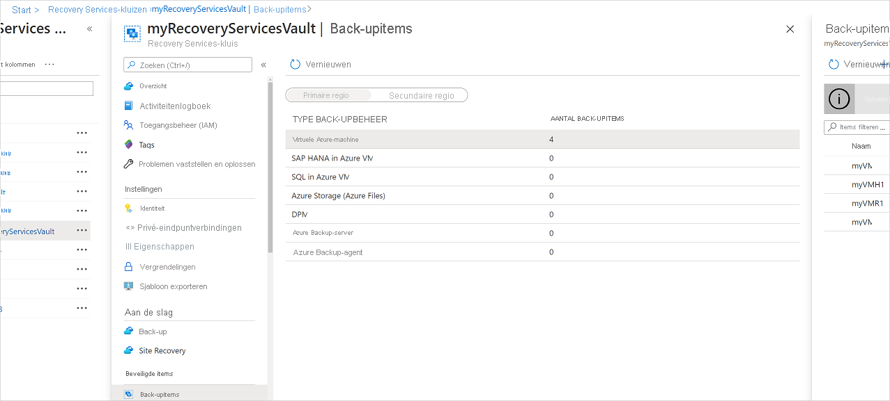
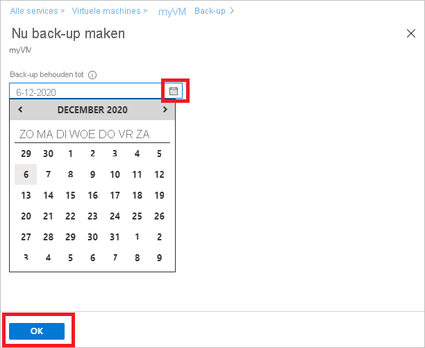
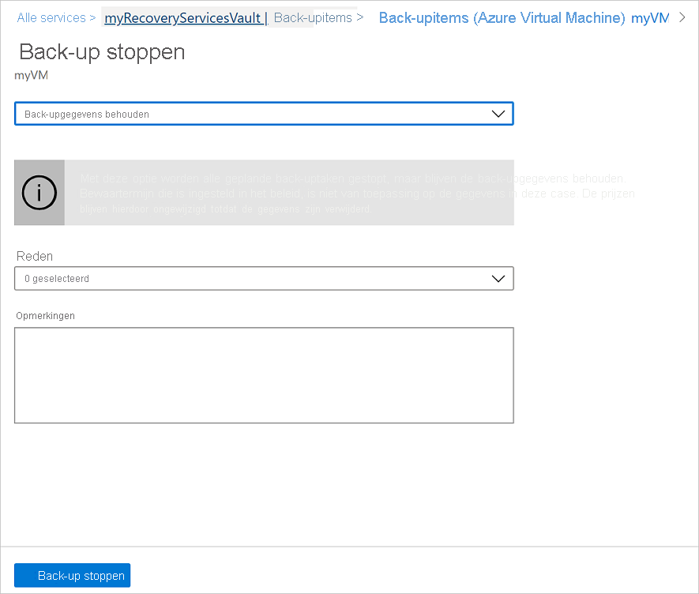
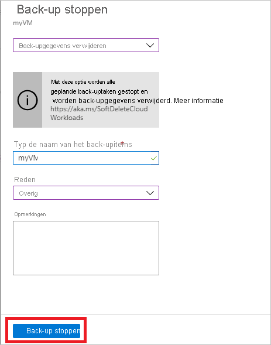

# Azure VM-back-ups beheren met Azure Backup-service

In dit artikel wordt beschreven hoe u virtuele Azure-machines (VM's) beheert waarvan een back-up wordt gemaakt met behulp van de [Azure Backup-service](backup-overview.md). In het artikel wordt ook een overzicht gegeven van de back-upgegevens die u vinden op het dashboard van de kluis.

In de Azure-portal biedt het vault dashboard van Recovery Services toegang tot kluisgegevens, waaronder:

* De nieuwste back-up, dat is ook de nieuwste herstelpunt.
* Het back-upbeleid.
* De totale grootte van alle back-upmomentopnamen.
* Het aantal VM's dat is ingeschakeld voor back-ups.

U back-ups beheren met behulp van het dashboard en door te boren naar afzonderlijke VM's. Als u apparaatback-ups wilt starten, opent u de kluis op het dashboard.

## VM's weergeven op het dashboard

Ga als u vm's op het dashboard van de kluis bekijken:

1. Meld u aan bij [Azure Portal](https://portal.azure.com/).
2. Selecteer **Bladeren**in het menu Hub . Typ in de lijst met resources **Recovery Services**. Terwijl u typt, wordt de lijst gefilterd op basis van uw invoer. Selecteer **kluizen van Recovery Services**.

    

3. Voor gebruiksgemak klikt u met de rechtermuisknop op de kluis en selecteert **u Vastmaken aan het dashboard.**
4. Open het dashboard van de kluis.

    

5. Selecteer azure **virtuele machines**op de tegel **Back-upitems** .

    

6. In het deelvenster **Back-upitems** u de lijst met beveiligde VM's weergeven. In dit voorbeeld beschermt de kluis één virtuele machine: demoback-up.  

    

7. Vanuit het dashboard van het kluisitem wijzigt u back-upbeleid, voert u een on-demand back-up uit, stopt of hervat u de beveiliging van VM's, verwijdert u back-upgegevens, bekijkt u herstelpunten en voert u een herstel uit.

    

## Back-upbeleid voor een virtuele machine beheren

Ga als lid van het back-upbeleid:

1. Meld u aan bij [Azure Portal](https://portal.azure.com/). Open het dashboard van de kluis.
2. Selecteer azure **virtuele machines**op de tegel **Back-upitems** .

    

3. In het deelvenster **Back-upitems** u de lijst met beveiligde VM's en de laatste back-upstatus bekijken met de laatste herstelpuntentijd.

    

4. In het dashboard van het kluisitem u een back-upbeleid selecteren.

   * Als u van beleid wilt wisselen, selecteert u een ander beleid en selecteert u **Opslaan**. Het nieuwe beleid wordt onmiddellijk op de kluis toegepast.

     

## Een on-demand back-up uitvoeren

U een on-demand back-up van een vm uitvoeren nadat u de beveiliging ervan hebt ingesteld. Houd rekening met deze details:

* Als de eerste back-up in behandeling is, maakt on-demand back-up een volledige kopie van de VM in de kluis Van Herstelservices.
* Als de eerste back-up is voltooid, verzendt een on-demand back-up alleen wijzigingen van de vorige momentopname naar de kluis van Herstelservices. Dat wil zeggen, latere back-ups zijn altijd incrementeel.
* Het bewaarbereik voor een on-demand back-up is de bewaarwaarde die u opgeeft wanneer u de back-up activeert.

Ga als u een back-up op aanvraag activeren:

1. Selecteer [vault item dashboard](#view-vms-on-the-dashboard) **back-upitem**onder Beveiligd item onder **Beveiligd item**.

    

2. Selecteer Azure Virtual **Machine** **in back-upbeheertype**. Het deelvenster **Back-upitem (Azure Virtual Machine)** wordt weergegeven.
3. Selecteer een VM en selecteer **Nu back-up** om een on-demand back-up te maken. Het deelvenster **Back-up nu** wordt weergegeven.
4. Geef in het veld **Back-upbehouden tot** op, geef een datum op waarop de back-up moet worden behouden.

    

5. Selecteer **OK** om de back-uptaak uit te voeren.

Als u de voortgang van de taak wilt bijhouden, selecteert u op het kluisdashboard de tegel **Back-uptaken.**

## Stoppen met het beveiligen van een VM

Er zijn twee manieren om te stoppen met het beschermen van een VM:

* **Stop de beveiliging en bewaar back-upgegevens.** Met deze optie worden alle toekomstige back-uptaken gestopt om uw VM te beschermen; De Azure Backup-service behoudt echter de herstelpunten waarvan een back-up is gemaakt.  U moet betalen om de herstelpunten in de kluis te bewaren (zie [Azure Backup-prijzen](https://azure.microsoft.com/pricing/details/backup/) voor meer informatie). U de VM indien nodig herstellen. Als u besluit de VM-beveiliging te hervatten, u de *optie Back-up hervatten* gebruiken.
* **Stop de beveiliging en verwijder back-upgegevens**. Met deze optie worden alle toekomstige back-uptaken gestopt om uw VM te beschermen en worden alle herstelpunten verwijderd. U de vm niet herstellen of de *optie Back-up hervatten* niet gebruiken.

>[!NOTE]
>Als u een gegevensbron verwijdert zonder back-ups te stoppen, mislukken nieuwe back-ups. Oude herstelpunten verlopen volgens het beleid, maar een laatste herstelpunt wordt altijd bewaard totdat u de back-ups stopt en de gegevens verwijdert.
>

### Beveiliging stoppen en back-upgegevens bewaren

Ga als lid van de beveiliging en bewaar gegevens van een vm:

1. Selecteer **Back-up stoppen**op [het dashboard van het kluisitem](#view-vms-on-the-dashboard).
2. Kies **Back-upgegevens behouden**en bevestig uw selectie indien nodig. Voeg desgevraagd een opmerking toe. Als u niet zeker bent van de naam van het item, houdt u de plaats boven het uitroepteken om de naam weer te geven.

    

Een melding laat u weten dat de back-uptaken zijn gestopt.

### Beveiliging stoppen en back-upgegevens verwijderen

Ga als lid van de beveiliging en verwijder gegevens van een vm:

1. Selecteer **Back-up stoppen**op [het dashboard van het kluisitem](#view-vms-on-the-dashboard).
2. Kies **Back-upgegevens verwijderen**en bevestig uw selectie indien nodig. Voer de naam van het back-upitem in en voeg desgevraagd een opmerking toe.

    

## Hervatting van de beveiliging van een virtuele machine

Als u de optie Beveiliging stoppen hebt gekozen en de optie [Back-upgegevens behoudt](#stop-protection-and-retain-backup-data) tijdens de VM-beveiliging stoppen, u **Back-up hervatten**gebruiken. Deze optie is niet beschikbaar als u [De beveiliging stoppen kiest en back-upgegevens optie verwijdert](#stop-protection-and-delete-backup-data) of [Back-upgegevens verwijderen](#delete-backup-data).

Ga als lid van het NIEUWE GEOMIErij van een virtuele machine:

1. Selecteer **back-up hervatten**op [het dashboard van het kluisitem](#view-vms-on-the-dashboard).

2. Volg de stappen in [Back-upbeleid beheren](#manage-backup-policy-for-a-vm) om het beleid voor de vm toe te wijzen. U hoeft het oorspronkelijke beveiligingsbeleid van de VM niet te kiezen.
3. Nadat u het back-upbeleid op de VM hebt toegepast, ziet u het volgende bericht:

    

## Back-upgegevens verwijderen

Er zijn twee manieren om de back-upgegevens van een VM te verwijderen:

* Selecteer in het dashboard met kluisitems de optie Back-up stoppen en volg de instructies voor [Beveiliging stoppen en back-upgegevens verwijderen.](#stop-protection-and-delete-backup-data)

  

* Selecteer Back-upgegevens verwijderen in het dashboard met kluisitems. Deze optie is ingeschakeld als u ervoor had gekozen om de beveiliging te stoppen en de optie [back-upgegevens te behouden](#stop-protection-and-retain-backup-data) tijdens de VM-beveiliging stoppen

  

  * Selecteer **back-upgegevens verwijderen**op het [dashboard met kluisitems](#view-vms-on-the-dashboard).
  * Typ de naam van het back-upitem om te bevestigen dat u de herstelpunten wilt verwijderen.

    

  * Als u de back-upgegevens voor het item wilt verwijderen, selecteert u **Verwijderen**. Een meldingbericht laat u weten dat de back-upgegevens zijn verwijderd.

Om uw gegevens te beschermen, bevat Azure Backup de functie soft delete. Met soft delete, zelfs nadat de back-up (alle herstelpunten) van een VM is verwijderd, worden de back-upgegevens 14 extra dagen bewaard. Zie voor meer informatie [de soft delete-documentatie](https://docs.microsoft.com/azure/backup/backup-azure-security-feature-cloud).

  > [!NOTE]
  > Wanneer u back-upgegevens verwijdert, verwijdert u alle bijbehorende herstelpunten. U geen specifieke herstelpunten kiezen om te verwijderen.

### Back-upitem waarvan de primaire gegevensbron niet meer bestaat

* Als Azure VM's die zijn geconfigureerd voor Azure-back-up worden verwijderd of verplaatst zonder de beveiliging te stoppen, mislukken zowel geplande back-uptaken als on demand (ad-hoc) back-uptaken met de fout UserErrorVmNotFoundV2. De back-uppre-check wordt alleen als kritiek weergegeven voor mislukte back-uptaken op aanvraag (mislukte geplande taken worden niet weergegeven).
* Deze back-upitems blijven actief in het systeem dat vasthoudt aan het back-up- en bewaarbeleid dat door de gebruiker is ingesteld. De back-upgegevens voor deze Azure VM's worden bewaard volgens het bewaarbeleid. De verlopen herstelpunten (behalve het laatste herstelpunt) worden gereinigd volgens het bewaarbereik dat is ingesteld in het back-upbeleid.
* Gebruikers wordt aangeraden om de back-upitems te verwijderen waar de primaire gegevensbron niet meer bestaat om extra kosten te voorkomen, als het back-upitem/de back-upvoor de verwijderingsbronnen niet langer nodig is omdat het laatste herstelpunt voor altijd wordt bewaard en de gebruiker wordt in rekening gebracht volgens de toepasselijke back-upprijzen.

## Volgende stappen

* Meer informatie over het [maken van back-ups van Azure VM's vanuit de instellingen van de VM.](backup-azure-vms-first-look-arm.md)
* Meer informatie over het [herstellen van VM's.](backup-azure-arm-restore-vms.md)
* Meer informatie over het [bewaken van Azure VM-back-ups](backup-azure-monitor-vms.md).
