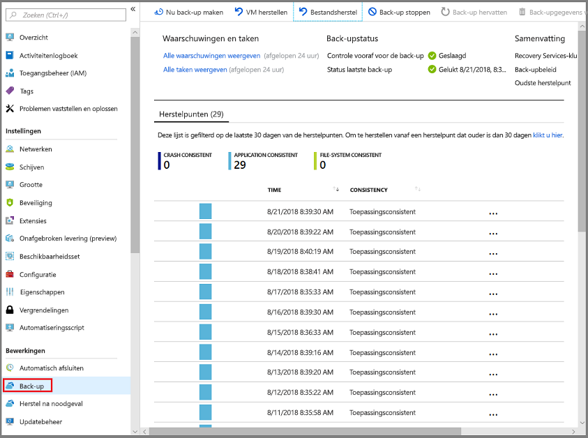
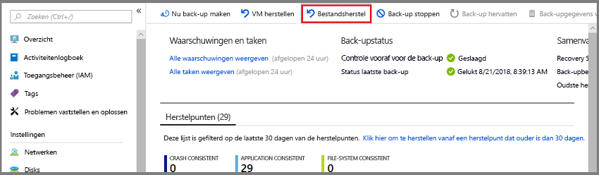
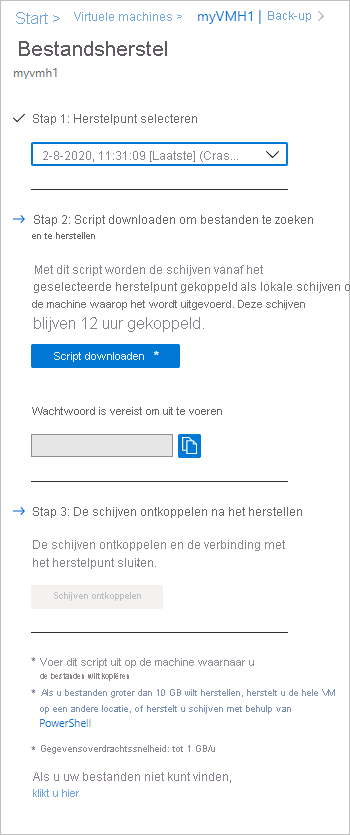
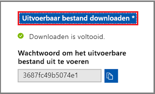
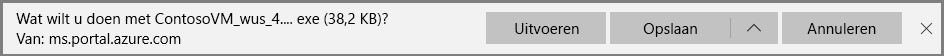
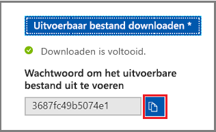
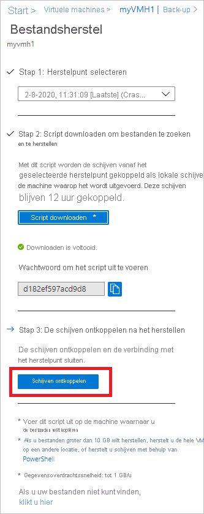
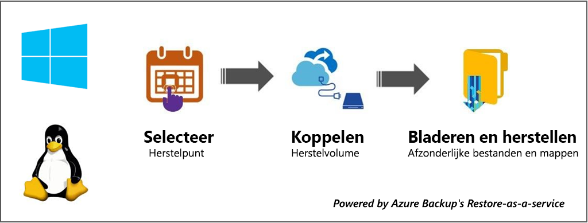

# <a name="recover-files-from-azure-virtual-machine-backup"></a>Bestanden herstellen vanuit back-up van virtuele Azure-machine

Azure Backup biedt de mogelijkheid om [Azure virtual machines (vm's) en schijven](./backup-azure-arm-restore-vms.md) van back-ups van Azure-vm's, ook wel herstel punten genoemd, te herstellen. In dit artikel wordt uitgelegd hoe u bestanden en mappen kunt herstellen vanuit een back-up van een Azure-VM. Het terugzetten van bestanden en mappen is alleen beschikbaar voor virtuele Azure-machines die zijn geïmplementeerd met het Resource Manager-model en die zijn beveiligd met een Recovery Services-kluis.

> [!NOTE]
> Deze functie is beschikbaar voor virtuele Azure-machines die zijn geïmplementeerd met het Resource Manager-model en die zijn beveiligd met een Recovery Services kluis.
> Bestands herstel van een versleutelde back-up van een virtuele machine wordt niet ondersteund.
>

## <a name="mount-the-volume-and-copy-files"></a>Het volume koppelen en bestanden kopiëren

Als u bestanden of mappen van het herstel punt wilt herstellen, gaat u naar de virtuele machine en kiest u het gewenste herstel punt.

1. Meld u aan bij de [Azure Portal](https://portal.Azure.com) en klik in het linkerdeel venster op **virtuele machines**. Selecteer in de lijst met virtuele machines de virtuele machine om het dash board van de virtuele machine te openen.

2. Klik in het menu van de virtuele machine op **back-up** om het back-updashboard te openen.

    

3. Klik in het menu back-updashboard op **bestands herstel**.

    

    Het menu **bestands herstel** wordt geopend.

    

4. Selecteer in de vervolg keuzelijst **herstel punt selecteren** het herstel punt dat de gewenste bestanden bevat. Het meest recente herstel punt is standaard al geselecteerd.

5. Als u de software wilt downloaden die wordt gebruikt om bestanden van het herstel punt te kopiëren, klikt u op **uitvoerbaar bestand downloaden** (voor Windows Azure-vm's) of het **Download script** (voor virtuele Linux-machines wordt een python-script gegenereerd).

    

    Azure downloadt het uitvoer bare bestand of script naar de lokale computer.

    

    Om het uitvoer bare bestand of script als beheerder uit te voeren, wordt u geadviseerd om de gedownloade bestanden op uw computer op te slaan.

6. Het uitvoer bare bestand of script is beveiligd met een wacht woord en vereist een wacht woord. Klik in het menu **bestands herstel** op de knop kopiëren om het wacht woord in het geheugen te laden.

    

7. Zorg ervoor dat [u de juiste computer hebt](#selecting-the-right-machine-to-run-the-script) om het script uit te voeren. Als de juiste computer dezelfde computer is waarop u het script hebt gedownload, kunt u door gaan naar de download sectie. Klik vanaf de download locatie (meestal de map *down loads* ) met de rechter muisknop op het uitvoer bare bestand of script en voer dit uit met beheerders referenties. Wanneer u hierom wordt gevraagd, typt u het wacht woord of plakt u het wacht woord uit het geheugen en drukt u op **Enter**. Zodra het geldige wacht woord is ingevoerd, maakt het script verbinding met het herstel punt.

    

8. Voor Linux-machines wordt een python-script gegenereerd. Eén moet het script downloaden en kopiëren naar de relevante/compatibele Linux-server. Mogelijk moet u de machtigingen wijzigen om deze uit te voeren met ```chmod +x <python file name>``` . Voer vervolgens het python-bestand uit met ```./<python file name>``` .

Raadpleeg de sectie [toegangs vereisten](#access-requirements) om te controleren of het script is uitgevoerd.

### <a name="identifying-volumes"></a>Volumes identificeren

#### <a name="for-windows"></a>Voor Windows

Wanneer u het uitvoer bare bestand uitvoert, koppelt het besturings systeem de nieuwe volumes en worden er stationsletters toegewezen. U kunt Windows Verkenner of bestanden Verkenner gebruiken om deze stations te doorzoeken. De stationsletters die aan de volumes zijn toegewezen, mogen niet dezelfde letters als de oorspronkelijke virtuele machine zijn. De naam van het volume blijft echter behouden. Als het volume op de oorspronkelijke virtuele machine bijvoorbeeld ' gegevens schijf (E: `\` ) ' is, kan dat volume als "gegevens schijf (" wille keurige letter ":) op de lokale computer worden aangesloten `\` . Blader door alle volumes die worden vermeld in de uitvoer van het script totdat u uw bestanden of map vindt.  

   

#### <a name="for-linux"></a>Voor Linux

In Linux worden de volumes van het herstel punt gekoppeld aan de map waarin het script wordt uitgevoerd. De gekoppelde schijven, volumes en de bijbehorende koppel paden worden dienovereenkomstig weer gegeven. Deze koppel paden zijn zichtbaar voor gebruikers die toegang hebben tot toegangs rechten op hoofd niveau. Blader door de volumes die worden vermeld in de script uitvoer.

  

## <a name="closing-the-connection"></a>De verbinding sluiten

Nadat u de bestanden hebt geïdentificeerd en deze naar een lokale opslag locatie hebt gekopieerd, moet u de extra schijven verwijderen (of ontkoppelen). Als u de stations wilt ontkoppelen, klikt u in het menu **bestands herstel** in de Azure Portal op **schijven ontkoppelen**.



Zodra de schijven zijn ontkoppeld, ontvangt u een bericht. Het kan enkele minuten duren voordat de verbinding is vernieuwd, zodat u de schijven kunt verwijderen.

Nadat de verbinding met het herstel punt in Linux is verbroken, worden de bijbehorende koppel paden niet automatisch door het besturings systeem verwijderd. De koppel paden bestaan als ' zwevende ' volumes en zijn zichtbaar, maar er treedt een fout op wanneer u de bestanden opent/schrijft. Ze kunnen hand matig worden verwijderd. Het script, wanneer dit wordt uitgevoerd, identificeert alle volumes die bestaan uit eerdere herstel punten en ruimt deze op bij toestemming.

## <a name="selecting-the-right-machine-to-run-the-script"></a>De juiste computer selecteren om het script uit te voeren

Als het script is gedownload, is de volgende stap het controleren of de computer waarop u het script wilt uitvoeren, de juiste machine is. Hieronder vindt u de vereisten waaraan moet worden voldaan op de computer.

### <a name="original-backed-up-machine-versus-another-machine"></a>Oorspronkelijke back-up van de computer versus een andere machine

1. Als de back-upcomputer een grote schijf-VM is, dat wil zeggen het aantal schijven is groter dan 16 schijven of elke schijf groter is dan 4 TB, moet het script **worden uitgevoerd op een andere computer** en moeten aan [deze vereisten](#file-recovery-from-virtual-machine-backups-having-large-disks) worden voldaan.
1. Zelfs als de back-upcomputer geen grote schijf-VM is, kan het script in [deze scenario's](#special-configurations) niet worden uitgevoerd op dezelfde back-upvm.

### <a name="os-requirements-on-the-machine"></a>Vereisten voor het besturings systeem op de computer

De computer waarop het script moet worden uitgevoerd, moet voldoen aan [deze vereisten van het besturings systeem](#system-requirements).

### <a name="access-requirements-for-the-machine"></a>Toegangs vereisten voor de computer

De computer waarop het script moet worden uitgevoerd, moet voldoen aan [deze toegangs vereisten](#access-requirements).

## <a name="special-configurations"></a>Speciale configuraties

### <a name="dynamic-disks"></a>Dynamische schijven

Als de beveiligde Azure-VM volumes heeft met een of beide van de volgende kenmerken, kunt u het uitvoer bare script niet uitvoeren op dezelfde VM.

- Volumes die meerdere schijven omvatten (spanned en striped volumes)
- Fout tolerante volumes (gespiegelde en RAID-5-volumes) op dynamische schijven

Voer in plaats daarvan het uitvoer bare script uit op een andere computer met een compatibel besturings systeem.

### <a name="windows-storage-spaces"></a>Windows-opslagruimten

Windows-opslag ruimten is een Windows-technologie waarmee u opslag kunt virtualiseren. Met Windows-opslag ruimten kunt u industrie-standaard schijven groeperen in opslag groepen. Vervolgens gebruikt u de beschik bare ruimte in deze opslag groepen om virtuele schijven te maken, opslag ruimten genoemd.

Als de beveiligde Azure-VM gebruikmaakt van Windows-opslag ruimten, kunt u het uitvoer bare script niet uitvoeren op dezelfde VM. Voer in plaats daarvan het uitvoer bare script uit op een andere computer met een compatibel besturings systeem.

### <a name="lvmraid-arrays"></a>LVM/RAID-matrices

In Linux worden Logical Volume Manager (LVM) en/of software RAID-matrices gebruikt voor het beheren van logische volumes op meerdere schijven. Als de beveiligde virtuele Linux-machine gebruikmaakt van LVM-en/of RAID-matrices, kunt u het script niet uitvoeren op dezelfde VM. Voer in plaats daarvan het script uit op een andere computer met een compatibel besturings systeem en dat het bestands systeem van de beveiligde virtuele machine ondersteunt.

De volgende script uitvoer geeft de LVM-en/of RAID-matrix schijven en de volumes met het partitie type weer.

   

Als u deze partities online wilt brengen, voert u de opdrachten uit in de volgende secties.

#### <a name="for-lvm-partitions"></a>Voor LVM-partities

De namen van de volume groepen onder een fysiek volume weer geven:

```bash
#!/bin/bash
pvs <volume name as shown above in the script output>
```

Een lijst met alle logische volumes, namen en hun paden in een volume groep:

```bash
#!/bin/bash
lvdisplay <volume-group-name from the pvs commands results>
```

De ```lvdisplay``` opdracht geeft ook aan of de volume groepen actief zijn. Als de volume groep is gemarkeerd als inactief, moet deze opnieuw worden geactiveerd om te worden gekoppeld. Als de volume groep wordt weer gegeven als inactief, gebruikt u de volgende opdracht om deze te activeren.

```bash
#!/bin/bash
vgchange –a y  <volume-group-name from the pvs commands results>
```

Nadat de naam van de volume groep actief is, voert ```lvdisplay``` u de opdracht eenmaal meer uit om alle relevante kenmerken weer te geven.

De logische volumes koppelen aan het pad naar keuze:

```bash
#!/bin/bash
mount <LV path from the lvdisplay cmd results> </mountpath>
```

#### <a name="for-raid-arrays"></a>Voor RAID-matrices

De volgende opdracht geeft details weer over alle RAID-schijven:

```bash
#!/bin/bash
mdadm –detail –scan
```

 De relevante RAID-schijf wordt weer gegeven als`/dev/mdm/<RAID array name in the protected VM>`

Gebruik de opdracht mount als de RAID-schijf fysieke volumes heeft:

```bash
#!/bin/bash
mount [RAID Disk Path] [/mountpath]
```

Als er een andere LVM in de RAID-schijf is geconfigureerd, gebruikt u de voor gaande procedure voor LVM-partities, maar gebruikt u de volume naam in plaats van de naam van de RAID-schijf.

## <a name="system-requirements"></a>Systeemvereisten

### <a name="for-windows-os"></a>Voor Windows-besturings systeem

In de volgende tabel ziet u de compatibiliteit tussen server-en computer besturingssystemen. Wanneer u bestanden herstelt, kunt u geen bestanden herstellen naar een eerdere of toekomstige besturingssysteem versie. U kunt bijvoorbeeld een bestand van een Windows Server 2016-VM niet herstellen naar Windows Server 2012 of een Windows 8-computer. U kunt bestanden herstellen van een virtuele machine naar hetzelfde besturings systeem van de server of naar het compatibele client besturingssysteem.

|Server-besturings systeem | Compatibel client besturingssysteem  |
| --------------- | ---- |
| Windows Server 2019    | Windows 10 |
| Windows Server 2016    | Windows 10 |
| Windows Server 2012 R2 | Windows 8.1 |
| Windows Server 2012    | Windows 8  |
| Windows Server 2008 R2 | Windows 7   |

### <a name="for-linux-os"></a>Voor Linux-besturings systeem

In Linux moet het besturings systeem van de computer die wordt gebruikt om bestanden te herstellen, ondersteuning bieden voor het bestands systeem van de beveiligde virtuele machine. Wanneer u een computer selecteert om het script uit te voeren, moet u ervoor zorgen dat de computer een compatibel besturings systeem heeft en een van de versies gebruikt die in de volgende tabel zijn geïdentificeerd:

|Linux-besturings systeem | Versies  |
| --------------- | ---- |
| Ubuntu | 12,04 en hoger |
| CentOS | 6,5 en hoger  |
| RHEL | 6,7 en hoger |
| Debian | 7 en hoger |
| Oracle Linux | 6,4 en hoger |
| SLES | 12 en hoger |
| openSUSE | 42,2 en hoger |

> [!NOTE]
> Er zijn enkele problemen gevonden in het uitvoeren van het script voor bestands herstel op computers met SLES 12 SP4 OS en we onderzoeken met het SLES-team.
> Op dit moment is het uitvoeren van het script voor bestands herstel op computers met SLES 12 SP2 en SP3 OS-versies actief.
>

Het script vereist ook python-en bash-onderdelen om het herstel punt veilig uit te voeren en te verbinden.

|Onderdeel | Versie  |
| --------------- | ---- |
| bash | 4 en hoger |
| python | 2.6.6 en hoger  |
| TLS | 1,2 moet worden ondersteund  |

## <a name="access-requirements"></a>Vereisten voor toegang

Als u het script uitvoert op een computer met beperkte toegang, controleert u of er toegang is tot:

- `download.microsoft.com`
- Url's van de Recovery service (geo-naam verwijst naar de regio waar de Recovery service-kluis zich bevindt)
  - `https://pod01-rec2.geo-name.backup.windowsazure.com`(Voor open bare Azure-geografische gebieden)
  - `https://pod01-rec2.geo-name.backup.windowsazure.cn`(Voor Azure China 21Vianet)
  - `https://pod01-rec2.geo-name.backup.windowsazure.us`(Voor Azure Amerikaanse overheid)
  - `https://pod01-rec2.geo-name.backup.windowsazure.de`(Voor Azure Duitsland)
- Uitgaande poorten 53 (DNS), 443, 3260

> [!NOTE]
>
> - De naam van het gedownloade script bestand krijgt de **geo-naam** die in de URL moet worden ingevuld. Voor exampple: de gedownloade script naam begint met \' VMname \' \_ \' Geoname \' _ \' GUID \' , zoals *ContosoVM_wcus_12345678*
> - De URL zou <https://pod01-rec2.wcus.backup.windowsazure.com> "
>

Voor Linux is voor het script de onderdelen open-iscsi en lshw vereist om verbinding te maken met het herstel punt. Als de onderdelen niet bestaan op de computer waarop het script wordt uitgevoerd, vraagt het script om toestemming om de onderdelen te installeren. Geef toestemming om de benodigde onderdelen te installeren.

De toegang tot `download.microsoft.com` is vereist voor het downloaden van onderdelen die worden gebruikt voor het bouwen van een beveiligd kanaal tussen de computer waarop het script wordt uitgevoerd en de gegevens in het herstel punt.

## <a name="file-recovery-from-virtual-machine-backups-having-large-disks"></a>Bestands herstel van back-ups van virtuele machines met grote schijven

In deze sectie wordt uitgelegd hoe u bestands herstel kunt uitvoeren vanaf back-ups van virtuele Azure-machines met meer dan 16 schijven en elke schijf grootte is groter dan 32 TB.

Omdat bestands herstel proces alle schijven van de back-up koppelt, worden de volgende actie punten aanbevolen wanneer een groot aantal schijven (>16) of grote schijven (> 32 TB elk) wordt gebruikt:

- Bewaar een afzonderlijke herstel server (virtuele machines van Azure VM D2v3) voor bestands herstel. U kunt dat alleen gebruiken voor bestands herstel en het vervolgens uitschakelen wanneer dat niet vereist is. Het terugzetten op de oorspronkelijke machine wordt niet aanbevolen, omdat het aanzienlijke gevolgen heeft voor de VM zelf.
- Voer vervolgens het script opnieuw uit om te controleren of de bestands herstel bewerking is gelukt.
- Als het proces voor bestands herstel vastloopt (de schijven zijn nooit gekoppeld of ze zijn gekoppeld, maar er worden geen volumes weer gegeven), voert u de volgende stappen uit.
  - Als de Restore-server een Windows-VM is:
    - Zorg ervoor dat het besturings systeem WS 2012 of hoger is.
    - Zorg ervoor dat de register sleutels zijn ingesteld zoals hieronder wordt beschreven op de Restore-server en zorg ervoor dat u de server opnieuw opstart. Het getal naast de GUID kan variëren van 0001-0005. In het volgende voor beeld is het 0004. Navigeer door het pad naar de register sleutel tot het gedeelte para meters.

    

```registry
- HKEY_LOCAL_MACHINE\SYSTEM\CurrentControlSet\Services\Disk\TimeOutValue – change this from 60 to 1200
- HKEY_LOCAL_MACHINE\SYSTEM\ControlSet001\Control\Class\{4d36e97b-e325-11ce-bfc1-08002be10318}\0003\Parameters\SrbTimeoutDelta – change this from 15 to 1200
- HKEY_LOCAL_MACHINE\SYSTEM\ControlSet001\Control\Class\{4d36e97b-e325-11ce-bfc1-08002be10318}\0003\Parameters\EnableNOPOut – change this from 0 to 1
- HKEY_LOCAL_MACHINE\SYSTEM\ControlSet001\Control\Class\{4d36e97b-e325-11ce-bfc1-08002be10318}\0003\Parameters\MaxRequestHoldTime - change this from 60 to 1200
```

- Als de Restore-server een virtuele Linux-machine is:
  - Wijzig de instelling in het bestand/etc/iscsi/iscsid.conf in:
    - node. verbonden [0]. Timeo. noop_out_timeout = 5 naar node. verbonden [0]. Timeo. noop_out_timeout = 30
- Nadat u de bovenstaande wijziging hebt aangebracht, voert u het script opnieuw uit. Met deze wijzigingen is het zeer waarschijnlijk dat de bestands herstel slaagt.
- Telkens wanneer een gebruiker een script downloadt, initieert Azure Backup het proces van het voorbereiden van het herstel punt voor down loads. Bij grote schijven neemt dit proces veel tijd in beslag. Als er opeenvolgende bursts van aanvragen zijn, gaat de voor bereiding van het doel naar een down load Spiral. Daarom is het raadzaam om een script te downloaden vanuit Portal/Power shell/CLI, te wachten gedurende 20-30 minuten (een heuristiek) en het vervolgens uit te voeren. Op dit moment wordt verwacht dat het doel gereed is voor verbinding vanuit het script.
- Nadat het bestand is hersteld, gaat u terug naar de portal en klikt u op **schijven ontkoppelen** voor herstel punten waar u geen volumes meer kunt koppelen. In wezen worden bestaande processen/sessies opgeschoond en wordt de kans op herstel verbeterd.

## <a name="troubleshooting"></a>Problemen oplossen

Als u problemen ondervindt tijdens het herstellen van bestanden van de virtuele machines, raadpleegt u de volgende tabel voor meer informatie.

| Fout bericht/scenario | Mogelijke oorzaak | Aanbevolen actie |
| ------------------------ | -------------- | ------------------ |
| Exe-uitvoer: *uitzonde ring opgetreden tijdens het verbinden met het doel* | Het script kan geen toegang krijgen tot het herstel punt    | Controleer of de computer [voldoet aan de vorige toegangs vereisten](#access-requirements). |  
| Exe-uitvoer: *het doel is al aangemeld via een iSCSI-sessie.* | Het script is al uitgevoerd op dezelfde computer en de stations zijn gekoppeld | De volumes van het herstel punt zijn al gekoppeld. Ze kunnen niet worden gekoppeld met dezelfde stationsletters van de oorspronkelijke VM. Blader door alle beschik bare volumes in de Verkenner van het bestand. |
| Exe-uitvoer: *Dit script is ongeldig omdat de schijven zijn ontkoppeld via de portal of de limiet van 12 uur is overschreden. Down load een nieuw script uit de portal.* |    De schijven zijn ontkoppeld van de portal of de limiet van 12 uur is overschreden | Deze specifieke exe is nu ongeldig en kan niet worden uitgevoerd. Als u de bestanden van het herstel punt in de tijd wilt openen, gaat u naar de portal voor een nieuw exe-bestand.|
| Op de computer waarop het exe-programma wordt uitgevoerd: de nieuwe volumes worden niet ontkoppeld nadat u op de knop ontkoppelen hebt geklikt | De iSCSI-initiator op de computer reageert niet/de verbinding met het doel wordt vernieuwd en de cache wordt onderhouden. |  Nadat u op **ontkoppelen**hebt geklikt, wacht u een paar minuten. Als de nieuwe volumes niet worden ontkoppeld, bladert u door alle volumes. Door alle volumes te bladeren, zorgt u ervoor dat de initiator de verbinding vernieuwt. het volume wordt ontkoppeld met een fout bericht dat de schijf niet beschikbaar is.|
| Exe-uitvoer: het script wordt uitgevoerd, maar nieuwe volumes gekoppeld wordt niet weer gegeven in de script uitvoer |    Dit is een tijdelijke fout    | De volumes zijn al gekoppeld. Open Explorer om te bladeren. Als u dezelfde computer gebruikt voor het uitvoeren van scripts elke keer, overweeg dan om de computer opnieuw op te starten en de lijst moet worden weer gegeven in de volgende exe-uitvoeringen. |
| Specifiek voor Linux: de gewenste volumes kunnen niet worden weer gegeven | Het besturings systeem van de computer waarop het script wordt uitgevoerd, herkent het onderliggende bestands systeem van de beveiligde virtuele machine mogelijk niet | Controleer of het herstel punt vastloopt en consistent is. Als het bestand consistent is, voert u het script uit op een andere computer waarvan het besturings systeem het bestands systeem van de beveiligde VM herkent. |
| Windows-specifiek: de gewenste volumes kunnen niet worden weer gegeven | De schijven zijn mogelijk gekoppeld, maar de volumes zijn niet geconfigureerd | Zoek in het scherm schijf beheer de extra schijven die zijn gerelateerd aan het herstel punt. Als een van deze schijven een offline status heeft, kunt u deze online brengen door met de rechter muisknop op de schijf te klikken en op **online**te klikken.|

## <a name="security"></a>Beveiliging

In deze sectie worden de verschillende beveiligings maatregelen beschreven die worden uitgevoerd voor de implementatie van bestands herstel vanuit Azure VM-back-ups.

### <a name="feature-flow"></a>Functie stroom

Deze functie is gebouwd om toegang te krijgen tot de VM-gegevens zonder dat u de hele VM of VM-schijven en het minimum aantal stappen hoeft te herstellen. Toegang tot VM-gegevens wordt verzorgd door een script (waarmee het herstel volume wordt gekoppeld wanneer dit wordt uitgevoerd, zoals hieronder wordt weer gegeven) en het vormt de hoek steen van alle beveiligings implementaties:

  

### <a name="security-implementations"></a>Beveiligings implementaties

#### <a name="select-recovery-point-who-can-generate-script"></a>Herstel punt selecteren (wie kan een script genereren)

Het script biedt toegang tot VM-gegevens. het is dus belang rijk om te reguleren wie het in de eerste plaats kan genereren. U moet zich aanmelden bij de Azure Portal en RBAC- [machtigingen](backup-rbac-rs-vault.md#mapping-backup-built-in-roles-to-backup-management-actions) hebben voor het genereren van het script.

Bestands herstel heeft hetzelfde machtigings niveau nodig als vereist voor het terugzetten van de VM en het terugzetten van schijven. Met andere woorden, alleen geautoriseerde gebruikers kunnen de VM-gegevens weer geven om het script te kunnen genereren.

Het gegenereerde script is ondertekend met het officiële micro soft-certificaat voor de Azure Backup service. Als u knoeit met het script, betekent dit dat de hand tekening wordt verbroken en dat elke poging om het script uit te voeren is gemarkeerd als een potentieel risico van het besturings systeem.

#### <a name="mount-recovery-volume-who-can-run-script"></a>Herstel volume koppelen (wie kan script uitvoeren)

Alleen een beheerder kan het script uitvoeren en het moet worden uitgevoerd in de modus met verhoogde bevoegdheden. Het script voert alleen een vooraf gegenereerde reeks stappen uit en accepteert geen invoer van een externe bron.

Om het script uit te voeren, is een wacht woord vereist dat alleen wordt weer gegeven voor de geautoriseerde gebruiker op het moment van de generatie van het script in de Azure Portal of Power shell/CLI. Dit is om ervoor te zorgen dat de geautoriseerde gebruiker die het script downloadt ook verantwoordelijk is voor het uitvoeren van het script.

#### <a name="browse-files-and-folders"></a>Zoeken in bestanden en mappen

Voor het bladeren door bestanden en mappen gebruikt het script de iSCSI-initiator op de computer en maakt verbinding met het herstel punt dat is geconfigureerd als een iSCSI-doel. Hier kunt u scenario's Voorst Ellen waarbij een van beide onderdelen probeert te imiteren/vervalsen.

We gebruiken een wederzijdse CHAP-verificatie mechanisme zodat elk onderdeel de andere verifieert. Dit betekent dat het zeer moeilijk is om verbinding te maken met het iSCSI-doel en om een vervalst doel te verbinden met de computer waarop het script wordt uitgevoerd.

De gegevens stroom tussen de Recovery-service en de machine wordt beveiligd door een beveiligde TLS-tunnel te bouwen via TCP ([tls 1,2 moet worden ondersteund](#system-requirements) op de computer waarop het script wordt uitgevoerd).

Een bestands Access Control lijst (ACL) die aanwezig is in de bovenliggende/back-up van de virtuele machine, blijft ook behouden in het gekoppelde bestands systeem.

Het script geeft alleen-lezen toegang tot een herstel punt en is slechts 12 uur geldig. Als u de toegang eerder wilt verwijderen, meldt u zich aan bij Azure Portal/Power shell/CLI en voert u de **ontkoppelde schijven** uit voor dat specifieke herstel punt. Het script wordt onmiddellijk ongeldig gemaakt.

## <a name="next-steps"></a>Volgende stappen

- Raadpleeg de sectie [probleem oplossing](#troubleshooting) voor problemen bij het herstellen van bestanden
- Meer informatie over het [herstellen van bestanden via Power shell](https://docs.microsoft.com/azure/backup/backup-azure-vms-automation#restore-files-from-an-azure-vm-backup)
- Meer informatie over het [herstellen van bestanden via Azure cli](https://docs.microsoft.com/azure/backup/tutorial-restore-files)
- Meer informatie over het [beheren van back-ups](https://docs.microsoft.com/azure/backup/backup-azure-manage-vms) nadat de VM is hersteld
