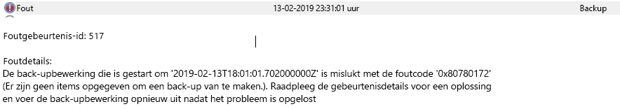

# <a name="troubleshooting-backup-failures-on-azure-virtual-machines"></a>Back-upfouten op virtuele machines van Azure oplossen

U kunt fouten oplossen die zijn opgetreden tijdens het gebruik van Azure Backup met de onderstaande informatie:

## <a name="backup"></a>Backup

In deze sectie wordt de back-upbewerking voor de virtuele machine van Azure beschreven.

### <a name="basic-troubleshooting"></a>Eenvoudige probleemoplossing

* Zorg ervoor dat de VM-agent (WA-agent) de [meest recente versie](./backup-azure-arm-vms-prepare.md#install-the-vm-agent)is.
* Zorg ervoor dat de versie van het Windows-of Linux-VM-besturings systeem wordt ondersteund. Raadpleeg de [IaaS VM backup-ondersteunings matrix](./backup-support-matrix-iaas.md).
* Controleer of er geen andere back-upservice wordt uitgevoerd.
  * Om ervoor te zorgen dat er geen problemen zijn met de uitbrei ding van de moment opname, [verwijdert u de uitbrei dingen om opnieuw te laden](./backup-azure-troubleshoot-vm-backup-fails-snapshot-timeout.md).
* Controleer of de virtuele machine verbinding met internet heeft.
  * Zorg ervoor dat de andere back-upservice niet wordt uitgevoerd.
* `Services.msc`Controleer of de **Windows Azure Guest agent** -service wordt **uitgevoerd**. Als de **Windows Azure Guest agent** -service ontbreekt, installeert u deze vanuit een back-up van [virtuele Azure-machines in een Recovery Services kluis](./backup-azure-arm-vms-prepare.md#install-the-vm-agent).
* In het **gebeurtenis logboek** kunnen back-upfouten worden weer gegeven die afkomstig zijn van andere back-upproducten, bijvoorbeeld Windows Server back-up, en niet door Azure backup. Gebruik de volgende stappen om te bepalen of het probleem met Azure Backup:
  * Als er een fout is opgetreden bij de **back-upbewerking** in de gebeurtenis bron of het bericht, controleert u of de back-ups van de Azure IaaS VM zijn geslaagd en of er een herstel punt is gemaakt met het gewenste type moment opname.
  * Als Azure Backup werkt, wordt het probleem waarschijnlijk veroorzaakt door een andere back-upoplossing.
  * Hier volgt een voor beeld van een Logboeken fout 517 waarbij Azure Backup goed werkte, maar ' Windows Server Back-up ' is mislukt:<br>
    
  * Als Azure Backup is mislukt, zoekt u naar de bijbehorende fout code in de sectie veelvoorkomende fouten in VM-back-ups in dit artikel.

## <a name="common-issues"></a>Algemene problemen

Hier volgen enkele veelvoorkomende problemen met back-upfouten op virtuele machines van Azure.

### <a name="vmrestorepointinternalerror---antivirus-configured-in-the-vm-is-restricting-the-execution-of-backup-extension"></a>VMRestorePointInternalError-anti virus dat in de virtuele machine is geconfigureerd, beperkt de uitvoering van de back-upextensie

Fout code: VMRestorePointInternalError

Als er op het moment van de back-up de **Logboeken toepassings logboeken** de naam van het fout bericht van de toepassing worden weer gegeven **: IaaSBcdrExtension.exe** vervolgens bevestigd dat de in de virtuele machine geconfigureerde antivirus de uitvoering van de back-upextensie beperkt.
U kunt dit probleem oplossen door de onderstaande mappen in de antivirus configuratie uit te sluiten en de back-upbewerking opnieuw uit te voeren.

* `C:\Packages\Plugins\Microsoft.Azure.RecoveryServices.VMSnapshot`
* `C:\WindowsAzure\Logs\Plugins\Microsoft.Azure.RecoveryServices.VMSnapshot`

### <a name="copyingvhdsfrombackupvaulttakinglongtime---copying-backed-up-data-from-vault-timed-out"></a>CopyingVHDsFromBackUpVaultTakingLongTime: er is een time-out opgetreden bij het kopiëren van back-ups van gegevens

Fout code: CopyingVHDsFromBackUpVaultTakingLongTime <br/>
Fout bericht: er is een time-out opgetreden tijdens het kopiëren van de back-upgegevens

Dit kan gebeuren als gevolg van tijdelijke opslag fouten of onvoldoende opslag account-IOPS voor de back-upservice om binnen de time-outperiode gegevens over te dragen naar de kluis. Configureer VM-back-ups met behulp van deze [Aanbevolen procedures](backup-azure-vms-introduction.md#best-practices) en voer de back-upbewerking opnieuw uit.

### <a name="usererrorvmnotindesirablestate---vm-is-not-in-a-state-that-allows-backups"></a>UserErrorVmNotInDesirableState: VM is niet in een status die back-ups toestaat

Fout code: UserErrorVmNotInDesirableState <br/>
Fout bericht: de VM heeft geen status die back-ups mogelijk maakt.<br/>

De back-upbewerking is mislukt, omdat de VM de status Mislukt heeft. Voor een geslaagde back-up moet de VM de status Actief, Gestopt of Gestopt (toewijzing opgeheven) hebben.

* Als de virtuele machine zich in een tijdelijke status bevindt tussen het **uitvoeren** en **Afsluiten**, wacht u totdat de status is gewijzigd. Activeer vervolgens de back-uptaak.
* Als de virtuele machine een virtuele Linux-machine is en **gebruikmaakt van de** Security Enhanced Linux kernel-module, sluit u het pad van de Azure Linux-agent uit het beveiligings beleid uit en zorgt u ervoor dat de back-upextensie is geïnstalleerd.

### <a name="usererrorfsfreezefailed---failed-to-freeze-one-or-more-mount-points-of-the-vm-to-take-a-file-system-consistent-snapshot"></a>UserErrorFsFreezeFailed: een of meer koppel punten van de virtuele machine kunnen niet worden geblokkeerd om een consistente moment opname van het bestands systeem te maken

Fout code: UserErrorFsFreezeFailed <br/>
Fout bericht: kan een of meer koppel punten van de VM niet blok keren om een consistente moment opname van het bestands systeem te maken.

* Ontkoppelen van de apparaten waarvoor de status van het bestands systeem niet is opgeschoond, met behulp van de **umount** opdracht.
* Voer een consistentie controle van het bestands systeem op deze apparaten uit met behulp van de **fsck** -opdracht.
* Koppel de apparaten opnieuw en voer de back-upbewerking opnieuw uit.</ol>

### <a name="extensionsnapshotfailedcom--extensioninstallationfailedcom--extensioninstallationfailedmdtc---extension-installationoperation-failed-due-to-a-com-error"></a>ExtensionSnapshotFailedCOM/ExtensionInstallationFailedCOM/ExtensionInstallationFailedMDTC-extensie is niet geïnstalleerd/bewerking mislukt vanwege een COM+-fout

Fout code: ExtensionSnapshotFailedCOM <br/>
Fout bericht: de momentopname bewerking is mislukt vanwege een COM+-fout

Fout code: ExtensionInstallationFailedCOM  <br/>
Fout bericht: de installatie van de extensie of de bewerking is mislukt vanwege een COM+-fout

Fout code: ExtensionInstallationFailedMDTC <br/>
Fout bericht: de installatie van de extensie is mislukt met de fout ' COM+ kan niet communiceren met de micro soft-Distributed Transaction Coordinator <br/>

De back-upbewerking is mislukt vanwege een probleem met de Windows service **com+-systeem** toepassing.  Volg deze stappen om dit probleem op te lossen:

* Probeer de Windows service **com+-systeem toepassing** te starten/opnieuw te starten (vanaf een opdracht prompt met verhoogde bevoegdheid **-net start COMSysApp**).
* Zorg ervoor dat **Distributed Transaction Coordinator** service wordt uitgevoerd als **netwerk service** account. Als dat niet het geval is, wijzigt u deze in uitvoeren als **netwerk service** account en start u **com+-systeem toepassing**opnieuw.
* Als de service niet opnieuw kan worden gestart, installeert u **Distributed Transaction Coordinator** -service opnieuw door de volgende stappen uit te voeren:
  * Stop de MSDTC-service
  * Open een opdrachtprompt (cmd)
  * Voer de opdracht `msdtc -uninstall` uit
  * Voer de opdracht `msdtc -install` uit
  * Start de MSDTC-service
* Start de Windows service **com+-systeem toepassing**. Nadat de **com+-systeem toepassing** is gestart, wordt een back-uptaak geactiveerd vanuit het Azure Portal.</ol>

### <a name="extensionfailedvsswriterinbadstate---snapshot-operation-failed-because-vss-writers-were-in-a-bad-state"></a>ExtensionFailedVssWriterInBadState-momentopname bewerking is mislukt omdat de status van de VSS-schrijvers ongeldig was

Fout code: ExtensionFailedVssWriterInBadState <br/>
Fout bericht: de momentopname bewerking is mislukt, omdat de status van de VSS-schrijvers ongeldig is.

Deze fout treedt op omdat de VSS-schrijvers een slechte status hebben. Azure Backup extensies communiceren met VSS-schrijvers om moment opnamen van de schijven te maken. Volg deze stappen om dit probleem op te lossen:

Herstart de VSS-schrijvers die een slechte status hebben.
- Voer uit vanaf een opdracht prompt met verhoogde bevoegdheid ```vssadmin list writers``` .
- De uitvoer bevat alle VSS-schrijvers en hun status. Voor elke VSS Writer met een status die niet **[1] stabiel**is, start u de service van de betreffende VSS Writer opnieuw. 
- Als u de service opnieuw wilt starten, voert u de volgende opdrachten uit vanaf een opdracht prompt met verhoogde bevoegdheid:

 ```net stop serviceName``` <br>
 ```net start serviceName```

> [!NOTE]
> Het opnieuw starten van sommige services kan invloed hebben op uw productie omgeving. Zorg ervoor dat het goedkeurings proces wordt gevolgd en dat de service opnieuw wordt gestart op de geplande downtime.
 
   
Als het probleem niet is opgelost door de VSS-schrijvers opnieuw op te starten, wordt het probleem nog steeds persistent gemaakt als gevolg van een time-out.
- Voer de volgende opdracht uit vanaf een opdracht prompt met verhoogde bevoegdheid (als beheerder) om te voor komen dat de threads worden gemaakt voor BLOB-moment opnamen.

```console
REG ADD "HKLM\SOFTWARE\Microsoft\BcdrAgentPersistentKeys" /v SnapshotWithoutThreads /t REG_SZ /d True /f
```

### <a name="extensionfailedvssserviceinbadstate---snapshot-operation-failed-due-to-vss-volume-shadow-copy-service-in-bad-state"></a>ExtensionFailedVssServiceInBadState-momentopname bewerking is mislukt omdat de VSS-service (Volume Shadow Copy) een ongeldige status heeft

Fout code: ExtensionFailedVssServiceInBadState <br/>
Fout bericht: de momentopname bewerking is mislukt omdat de VSS-service (Volume Shadow Copy) een ongeldige status heeft.

Deze fout treedt op omdat de VSS-service een ongeldige status heeft. Azure Backup extensies communiceren met de VSS-service om moment opnamen van de schijven te maken. Volg deze stappen om dit probleem op te lossen:

Start de VSS-service (Volume Shadow Copy) opnieuw.
- Navigeer naar Services. msc en start de Volume Shadow Copy-service opnieuw.<br>
of<br>
- Voer de volgende opdrachten uit vanaf een opdracht prompt met verhoogde bevoegdheid:

 ```net stop VSS``` <br>
 ```net start VSS```

 
Als het probleem zich blijft voordoen, start u de VM opnieuw op met de geplande uitval tijd.

### <a name="usererrorskunotavailable---vm-creation-failed-as-vm-size-selected-is-not-available"></a>Het maken van een UserErrorSkuNotAvailable-VM is mislukt omdat de geselecteerde VM-grootte niet beschikbaar is

Fout code: UserErrorSkuNotAvailable-fout bericht: het maken van de VM is mislukt omdat de geselecteerde VM-grootte niet beschikbaar is. 
 
Deze fout treedt op omdat de grootte van de virtuele machine die tijdens de herstel bewerking is geselecteerd, niet wordt ondersteund. <br>

Gebruik de optie [schijven herstellen](https://docs.microsoft.com/azure/backup/backup-azure-arm-restore-vms#restore-disks) tijdens de herstel bewerking om dit probleem op te lossen. Gebruik deze schijven om een VM te maken op basis van de lijst met [beschik bare ondersteunde VM-grootten](https://docs.microsoft.com/azure/backup/backup-support-matrix-iaas#vm-compute-support) met behulp van [Power shell-cmdlets](https://docs.microsoft.com/azure/backup/backup-azure-vms-automation#create-a-vm-from-restored-disks).

### <a name="usererrormarketplacevmnotsupported---vm-creation-failed-due-to-market-place-purchase-request-being-not-present"></a>Het maken van een UserErrorMarketPlaceVMNotSupported-VM is mislukt omdat de markt plaatsings aanvraag niet aanwezig is

Fout code: UserErrorMarketPlaceVMNotSupported-fout bericht: het maken van de virtuele machine is mislukt omdat de aankoop aanvraag voor de markt plaats niet aanwezig is. 
 
Azure Backup ondersteunt het maken van back-ups en het herstellen van Vm's die beschikbaar zijn in azure Marketplace. Deze fout treedt op wanneer u een virtuele machine probeert te herstellen (met een specifieke instelling voor het abonnement/de uitgever) die niet meer beschikbaar is in azure Marketplace, kunt u [hier meer informatie](https://docs.microsoft.com/legal/marketplace/participation-policy#offering-suspension-and-removal)vinden.
- U kunt dit probleem oplossen door de optie [schijven herstellen](https://docs.microsoft.com/azure/backup/backup-azure-arm-restore-vms#restore-disks) te gebruiken tijdens de herstel bewerking en vervolgens [Power shell](https://docs.microsoft.com/azure/backup/backup-azure-vms-automation#create-a-vm-from-restored-disks) -of [Azure cli](https://docs.microsoft.com/azure/backup/tutorial-restore-disk) -CMDLETS te gebruiken om de virtuele machine te maken met de meest recente Marketplace-informatie die overeenkomt met de virtuele machine.
- Als de uitgever geen Marketplace-informatie heeft, kunt u de gegevens schijven gebruiken om uw gegevens op te halen en kunt u deze koppelen aan een bestaande virtuele machine.

### <a name="extensionconfigparsingfailure--failure-in-parsing-the-config-for-the-backup-extension"></a>ExtensionConfigParsingFailure-fout bij het parseren van de configuratie voor de back-upextensie

Fout code: ExtensionConfigParsingFailure<br/>
Fout bericht: fout bij het parseren van de configuratie voor de back-upextensie.

Deze fout treedt op als gevolg van gewijzigde machtigingen voor de map **MachineKeys** : **%systemdrive%\programdata\microsoft\crypto\rsa\machinekeys**.
Voer de volgende opdracht uit en controleer of de machtigingen voor de map **MachineKeys** standaard zijn: `icacls %systemdrive%\programdata\microsoft\crypto\rsa\machinekeys` .

Standaard machtigingen zijn als volgt:

* Iedereen: (R, W)
* BUILTIN\Administrators: (F)

Als u de machtigingen in de map **MachineKeys** ziet die afwijkt van de standaard instellingen, voert u de volgende stappen uit om machtigingen te corrigeren, het certificaat te verwijderen en de back-up te activeren:

1. Herstel machtigingen op de **MachineKeys** -map. Als u de beveiligings eigenschappen van Explorer en geavanceerde beveiligings instellingen in de map gebruikt, stelt u de machtigingen weer in op de standaard waarden. Verwijder alle gebruikers objecten, behalve de standaard instellingen uit de Directory, en zorg ervoor dat de machtiging **iedereen** als volgt speciale toegang heeft:

   * Map weer geven/gegevens lezen
   * Kenmerken lezen
   * Uitgebreide kenmerken lezen
   * Bestanden maken/gegevens schrijven
   * Mappen maken/gegevens toevoegen
   * Schrijf kenmerken
   * Uitgebreide kenmerken schrijven
   * Lees machtigingen
2. Alle certificaten verwijderen waarnaar wordt **uitgegeven in** is het klassieke implementatie model of de **Windows Azure CRP-certificaat Generator**:

   * [Certificaten op een lokale computer console openen](/dotnet/framework/wcf/feature-details/how-to-view-certificates-with-the-mmc-snap-in).
   * Onder **persoonlijke**  >  **certificaten**verwijdert u alle certificaten waarbij **uitgegeven aan** is het klassieke implementatie model of de **Windows Azure CRP-certificaat Generator**.
3. Activeer een VM-back-uptaak.

### <a name="extensionstuckindeletionstate---extension-state-is-not-supportive-to-backup-operation"></a>De ExtensionStuckInDeletionState-extensie status is geen ondersteuning voor de back-upbewerking

Fout code: ExtensionStuckInDeletionState <br/>
Fout bericht: de extensie status is geen ondersteuning voor de back-upbewerking

De back-upbewerking is mislukt vanwege een inconsistente status van de back-upextensie. Volg deze stappen om dit probleem op te lossen:

* Zorg ervoor dat de gastagent geïnstalleerd en responsief is
* Ga vanuit het Azure Portal naar de **Virtual Machine**  >  extensies van**alle instellingen**  >  **Extensions** van de virtuele machine
* Selecteer de back-upextensie VmSnapshot of VmSnapshotLinux en selecteer **verwijderen**.
* Voer de back-upbewerking opnieuw uit nadat u de back-upextensie hebt verwijderd
* De volgende back-upbewerking installeert de nieuwe extensie in de gewenste status

### <a name="extensionfailedsnapshotlimitreachederror---snapshot-operation-failed-as-snapshot-limit-is-exceeded-for-some-of-the-disks-attached"></a>ExtensionFailedSnapshotLimitReachedError-momentopname bewerking mislukt omdat de limiet voor moment opnamen is overschreden voor een aantal gekoppelde schijven

Fout code: ExtensionFailedSnapshotLimitReachedError  <br/>
Fout bericht: de momentopname bewerking is mislukt omdat de limiet voor moment opnamen is overschreden voor een aantal gekoppelde schijven

De momentopname bewerking is mislukt omdat de limiet voor de moment opname is overschreden voor sommige van de gekoppelde schijven. Voer de volgende stappen uit om het probleem te verhelpen en voer de bewerking vervolgens opnieuw uit.

* Verwijder de schijven die niet vereist zijn voor de schijf-BLOB-moment opnamen. Zorg ervoor dat u geen schijf-blobs verwijdert. Alleen moment opname-blobs moeten worden verwijderd.
* Als de functie voor het voorlopig verwijderen van VM-opslag accounts is ingeschakeld, moet u de Bewaar periode voor tijdelijke verwijdering configureren zodat de bestaande moment opnamen kleiner zijn dan het maximum aantal dat is toegestaan op elk gewenst moment.
* Als Azure Site Recovery is ingeschakeld op de back-up van de virtuele machine, voert u de volgende stappen uit:

  * Zorg ervoor dat de waarde van **isanysnapshotfailed** is ingesteld op False in/etc/Azure/vmbackup.conf
  * Plan Azure Site Recovery op een ander tijdstip, zodat de back-upbewerking geen conflict veroorzaakt.

### <a name="extensionfailedtimeoutvmnetworkunresponsive---snapshot-operation-failed-due-to-inadequate-vm-resources"></a>ExtensionFailedTimeoutVMNetworkUnresponsive-momentopname bewerking is mislukt vanwege onvoldoende VM-resources

Fout code: ExtensionFailedTimeoutVMNetworkUnresponsive<br/>
Fout bericht: de momentopname bewerking is mislukt vanwege onvoldoende VM-resources.

De back-upbewerking op de virtuele machine is mislukt vanwege een vertraging in netwerk aanroepen tijdens het uitvoeren van de momentopname bewerking. U kunt dit probleem oplossen door stap 1 uit te voeren. Als het probleem zich blijft voordoen, probeert u stappen 2 en 3.

**Stap 1**: een moment opname maken via de host

Voer de volgende opdracht uit vanaf een opdracht prompt met verhoogde bevoegdheden:

```console
REG ADD "HKLM\SOFTWARE\Microsoft\BcdrAgentPersistentKeys" /v SnapshotMethod /t REG_SZ /d firstHostThenGuest /f
REG ADD "HKLM\SOFTWARE\Microsoft\BcdrAgentPersistentKeys" /v CalculateSnapshotTimeFromHost /t REG_SZ /d True /f
```

Deze opdracht zorgt ervoor dat de momentopnamen worden gemaakt via host in plaats van Guest. Probeer de back-upbewerking opnieuw.

**Stap 2**: Probeer het back-upschema te wijzigen in een keer wanneer de virtuele machine minder belasting heeft (zoals minder CPU of IOps)

**Stap 3**: Probeer [de grootte van de virtuele machine te verg Roten](https://azure.microsoft.com/blog/resize-virtual-machines/) en voer de bewerking opnieuw uit

### <a name="320001-resourcenotfound---could-not-perform-the-operation-as-vm-no-longer-exists--400094-bcmv2vmnotfound---the-virtual-machine-doesnt-exist--an-azure-virtual-machine-wasnt-found"></a>320001, ResourceNotFound: kan de bewerking niet uitvoeren omdat de VM niet meer bestaat/400094, BCMV2VMNotFound-de virtuele machine bestaat niet/er is geen virtuele machine van Azure gevonden

Fout code: 320001, ResourceNotFound <br/> Fout bericht: kan de bewerking niet uitvoeren omdat de VM niet meer bestaat. <br/> <br/> Fout code: 400094, BCMV2VMNotFound <br/> Fout bericht: de virtuele machine bestaat niet <br/>
Een virtuele machine van Azure is niet gevonden.

Deze fout treedt op wanneer de primaire virtuele machine wordt verwijderd, maar er door het back-upbeleid wordt gezocht naar een virtuele machine waarvan een back-up moet worden gemaakt. Voer de volgende stappen uit om deze fout op te lossen:

* Maak de virtuele machine opnieuw met dezelfde naam en dezelfde naam voor de resource groep, naam van **Cloud service**,<br>of
* Stop de beveiliging van de virtuele machine met of zonder de back-upgegevens te verwijderen. Zie [beveiliging van virtuele machines stoppen](backup-azure-manage-vms.md#stop-protecting-a-vm)voor meer informatie.</li></ol>

### <a name="usererrorbcmpremiumstoragequotaerror---could-not-copy-the-snapshot-of-the-virtual-machine-due-to-insufficient-free-space-in-the-storage-account"></a>UserErrorBCMPremiumStorageQuotaError-kan de moment opname van de virtuele machine niet kopiëren omdat het opslag account onvoldoende beschik bare ruimte heeft

Fout code: UserErrorBCMPremiumStorageQuotaError<br/> Fout bericht: kan de moment opname van de virtuele machine niet kopiëren omdat het opslag account onvoldoende beschik bare ruimte heeft

 Voor Premium-Vm's in VM-back-upstack v1 wordt de moment opname naar het opslag account gekopieerd. Met deze stap zorgt u ervoor dat het verkeer voor back-upbeheer, dat werkt op de moment opname, het aantal IOPS dat beschikbaar is voor de toepassing niet beperkt met Premium-schijven. <br><br>We raden u aan om slechts 50 procent, 17,5 TB, van de totale opslag account ruimte toe te wijzen. Vervolgens kan de Azure Backup-service de moment opname naar het opslag account kopiëren en gegevens van deze gekopieerde locatie in het opslag account naar de kluis overdragen.

### <a name="380008-azurevmoffline---failed-to-install-microsoft-recovery-services-extension-as-virtual-machine--is-not-running"></a>380008, AzureVmOffline-kan de micro soft Recovery Services-uitbrei ding niet installeren omdat de virtuele machine niet actief is

Fout code: 380008, AzureVmOffline <br/> Fout bericht: kan de micro soft Recovery Services-uitbrei ding niet installeren omdat de virtuele machine niet actief is

De VM-agent is een vereiste voor de Azure Recovery Services-extensie. Installeer de Azure virtual machine agent en start de registratie bewerking opnieuw. <br> <ol> <li>Controleer of de VM-agent correct is geïnstalleerd. <li>Zorg ervoor dat de vlag op de configuratie van de virtuele machine juist is ingesteld.</ol> Lees meer informatie over het installeren van de VM-agent en het valideren van de installatie van de VM-agent.

### <a name="extensionsnapshotbitlockererror---the-snapshot-operation-failed-with-the-volume-shadow-copy-service-vss-operation-error"></a>ExtensionSnapshotBitlockerError-de momentopname bewerking is mislukt met de fout van de bewerkings Volume Shadow Copy Service (VSS)

Fout code: ExtensionSnapshotBitlockerError <br/> Fout bericht: de momentopname bewerking is mislukt vanwege een fout in de Volume Shadow Copy Service (VSS)-bewerking **Dit station is vergrendeld door BitLocker-stationsversleuteling. U moet dit station ontgrendelen via het configuratie scherm.**

Schakel BitLocker uit voor alle stations op de VM en controleer of het VSS-probleem is opgelost.

### <a name="vmnotindesirablestate---the-vm-isnt-in-a-state-that-allows-backups"></a>VmNotInDesirableState: de VM bevindt zich niet in een status waarin back-ups zijn toegestaan

Fout code: VmNotInDesirableState <br/> Fout bericht: de VM bevindt zich niet in een status waarin back-ups zijn toegestaan.

* Als de virtuele machine zich in een tijdelijke status bevindt tussen het **uitvoeren** en **Afsluiten**, wacht u totdat de status is gewijzigd. Activeer vervolgens de back-uptaak.
* Als de virtuele machine een virtuele Linux-machine is en **gebruikmaakt van de** Security Enhanced Linux kernel-module, sluit u het pad van de Azure Linux-agent uit het beveiligings beleid uit en zorgt u ervoor dat de back-upextensie is geïnstalleerd.

* De VM-agent is niet aanwezig op de virtuele machine: <br>Installeer de vereiste onderdelen en de VM-agent. Start vervolgens de bewerking opnieuw. | Meer informatie over de installatie van de [VM-agent en het valideren](#vm-agent)van de installatie van de VM-agent.

### <a name="extensionsnapshotfailednosecurenetwork---the-snapshot-operation-failed-because-of-failure-to-create-a-secure-network-communication-channel"></a>ExtensionSnapshotFailedNoSecureNetwork-de momentopname bewerking is mislukt vanwege een fout bij het maken van een beveiligd kanaal voor netwerk communicatie

Fout code: ExtensionSnapshotFailedNoSecureNetwork <br/> Fout bericht: de momentopname bewerking is mislukt vanwege een fout bij het maken van een beveiligd kanaal voor netwerk communicatie.

* Open de REGI ster-editor door **regedit.exe** in een verhoogde modus uit te voeren.
* Alle versies van de .NET Framework in uw systeem identificeren. Ze bevinden zich in de hiërarchie van register sleutel **HKEY_LOCAL_MACHINE \Software\Microsoft**.
* Voor elke .NET Framework die in de register sleutel aanwezig is, voegt u de volgende sleutel toe: <br> **Schusestrongcrypto toe "= dword: 00000001**. </ol>

### <a name="extensionvcredistinstallationfailure---the-snapshot-operation-failed-because-of-failure-to-install-visual-c-redistributable-for-visual-studio-2012"></a>ExtensionVCRedistInstallationFailure-de momentopname bewerking is mislukt vanwege een fout bij het installeren van Visual C++ Redistributable voor Visual Studio 2012

Fout code: ExtensionVCRedistInstallationFailure <br/> Fout bericht: de momentopname bewerking is mislukt vanwege een fout bij het installeren van Visual C++ Redistributable voor Visual Studio 2012.

* Ga naar `C:\Packages\Plugins\Microsoft.Azure.RecoveryServices.VMSnapshot\agentVersion` en installeer vcredist2013_x64.<br/>Zorg ervoor dat de waarde van de register sleutel die de service-installatie toestaat, is ingesteld op de juiste waarde. Stel de **begin** waarde in **HKEY_LOCAL_MACHINE \system\currentcontrolset\services\msiserver** in op **3** en niet **4**. <br><br>Als u nog steeds problemen ondervindt met de installatie, start u de installatie service opnieuw door **Msiexec/unregister** gevolgd door **Msiexec/register** vanaf een opdracht prompt met verhoogde bevoegdheid uit te voeren.
* Controleer het gebeurtenis logboek om te controleren of u merkt problemen hebt. Bijvoorbeeld: *product: micro soft Visual C++ 2013 x64 mini maal runtime-12.0.21005--error 1401. de sleutel kan niet worden gemaakt: Software\Classes.  Systeem fout 5.  Controleer of u voldoende toegangs rechten voor deze sleutel hebt of neem contact op met het ondersteunings personeel.* <br><br> Zorg ervoor dat de beheerder of het gebruikers account voldoende machtigingen heeft om de register sleutel **HKEY_LOCAL_MACHINE \Software\Classes**bij te werken. Geef voldoende machtigingen op en start de Windows Azure-gast agent opnieuw.<br><br> <li> Als er antivirus producten aanwezig zijn, moet u ervoor zorgen dat ze beschikken over de juiste uitsluitings regels voor het toestaan van de installatie.

### <a name="usererrorrequestdisallowedbypolicy---an-invalid-policy-is-configured-on-the-vm-which-is-preventing-snapshot-operation"></a>UserErrorRequestDisallowedByPolicy: er is een ongeldig beleid geconfigureerd op de VM, waardoor de momentopnamebewerking niet kan worden uitgevoerd

Fout code: UserErrorRequestDisallowedByPolicy <BR> Fout bericht: er is een ongeldig beleid geconfigureerd op de VM, waardoor er geen momentopname bewerking kan worden uitgevoerd.

Als u een Azure Policy hebt dat de [Tags in uw omgeving bepaalt](../governance/policy/tutorials/govern-tags.md), kunt u overwegen om het beleid te wijzigen van een [geweigerd effect](../governance/policy/concepts/effects.md#deny) op een [wijzigings effect](../governance/policy/concepts/effects.md#modify)of door de resource groep hand matig te maken volgens het [naamgevings schema dat door Azure Backup wordt vereist](./backup-during-vm-creation.md#azure-backup-resource-group-for-virtual-machines).

## <a name="jobs"></a>Taken

| Foutdetails | Tijdelijke oplossing |
| --- | --- |
| Annulering wordt niet ondersteund voor dit taak type: <br>Wacht tot de taak is voltooid. |Geen |
| De taak heeft een niet-Annuleer bare status: <br>Wacht tot de taak is voltooid. <br>**or**<br> De geselecteerde taak heeft een niet-Annuleer bare status: <br>Wacht tot de taak is voltooid. |Het is waarschijnlijk dat de taak bijna is voltooid. Wacht tot de taak is voltooid.|
| De taak kan niet worden geannuleerd omdat deze niet wordt uitgevoerd: <br>Annulering wordt alleen ondersteund voor taken die worden uitgevoerd. Probeer een taak die in voortgang is te annuleren. |Deze fout treedt op vanwege een tijdelijke status. Wacht een minuut en voer de annulerings bewerking opnieuw uit. |
| De back-up kan de taak niet annuleren: <br>Wacht tot de taak is voltooid. |Geen |

## <a name="restore"></a>Herstellen

| Foutdetails | Tijdelijke oplossing |
| --- | --- |
| Het herstellen is mislukt vanwege een interne cloud fout. |<ol><li>De Cloud service waarnaar u wilt herstellen, is geconfigureerd met DNS-instellingen. U kunt het volgende controleren: <br>**$Deployment = Get-Azure-servicenaam "servicenaam"-sleuf "productie" Get-AzureDns-DnsSettings $Deployment. DnsSettings**.<br>Als het **adres** is geconfigureerd, worden de DNS-instellingen geconfigureerd.<br> <li>De Cloud service waarnaar u wilt herstellen, is geconfigureerd met **ReservedIP**, en bestaande vm's in de Cloud service hebben de status gestopt. U kunt controleren of een Cloud service een IP-adres heeft gereserveerd met behulp van de volgende Power shell-cmdlets: **$Deployment = Get-Azure-ServiceName "servicenaam"-sleuf "Production" $DEP. ReservedIPName**. <br><li>U probeert een virtuele machine met de volgende speciale netwerk configuraties te herstellen in dezelfde Cloud service: <ul><li>Virtuele machines onder load balancer configuratie, intern en extern.<li>Virtuele machines met meerdere gereserveerde Ip's. <li>Virtuele machines met meerdere Nic's. </ul><li>Selecteer een nieuwe Cloud service in de gebruikers interface of Zie [herstel overwegingen](backup-azure-arm-restore-vms.md#restore-vms-with-special-configurations) voor vm's met speciale netwerk configuraties.</ol> |
| De geselecteerde DNS-naam wordt al gebruikt: <br>Geef een andere DNS-naam op en probeer het opnieuw. |Deze DNS-naam verwijst naar de naam van de Cloud service, meestal eindigt op **. cloudapp.net**. Deze naam moet uniek zijn. Als u deze fout ontvangt, moet u tijdens het herstellen een andere VM-naam kiezen. <br><br> Deze fout wordt alleen weer gegeven voor gebruikers van de Azure Portal. De herstel bewerking via Power shell slaagt omdat hiermee alleen de schijven worden hersteld en de virtuele machine niet wordt gemaakt. De fout wordt weer wanneer de virtuele machine expliciet door u is gemaakt nadat de bewerking voor het terugzetten van de schijf is uitgevoerd. |
| De opgegeven virtuele-netwerk configuratie is niet juist: <br>Geef een andere virtuele-netwerk configuratie op en probeer het opnieuw. |Geen |
| De opgegeven Cloud service maakt gebruik van een gereserveerde IP die niet overeenkomt met de configuratie van de virtuele machine die wordt hersteld: <br>Geef een andere Cloud service op die geen gereserveerd IP-adres gebruikt. Of kies een ander herstel punt waarvan u wilt herstellen. |Geen |
| De limiet voor het aantal invoer eindpunten voor de Cloud service is bereikt: <br>Voer de bewerking opnieuw uit door een andere Cloud service op te geven of door een bestaand eind punt te gebruiken. |Geen |
| De Recovery Services kluis en het doel-opslag account bevinden zich in twee verschillende regio's: <br>Zorg ervoor dat het opslag account dat is opgegeven in de herstel bewerking zich in dezelfde Azure-regio bevindt als uw Recovery Services kluis. |Geen |
| Het opslag account dat is opgegeven voor de herstel bewerking, wordt niet ondersteund: <br>Alleen Basic-of Standard-opslag accounts met lokaal redundante of geo-redundante replicatie-instellingen worden ondersteund. Selecteer een ondersteund opslag account. |Geen |
| Het type opslag account dat is opgegeven voor de herstel bewerking is niet online: <br>Zorg ervoor dat het opslag account dat is opgegeven in de herstel bewerking online is. |Deze fout kan optreden vanwege een tijdelijke fout in Azure Storage of vanwege een storing. Kies een ander opslag account. |
| Het quotum voor de resource groep is bereikt: <br>Verwijder enkele resource groepen uit het Azure Portal of neem contact op met de ondersteuning van Azure om de limieten te verhogen. |Geen |
| Het geselecteerde subnet bestaat niet: <br>Selecteer een bestaand subnet. |Geen |
| De back-upservice heeft geen toestemming voor toegang tot resources in uw abonnement. |Om deze fout op te lossen, moet u eerst schijven terugzetten met behulp van de stappen in [back-ups van schijven herstellen](backup-azure-arm-restore-vms.md#restore-disks). Gebruik vervolgens de Power shell-stappen in [een VM maken van herstelde schijven](backup-azure-vms-automation.md#restore-an-azure-vm). |

## <a name="backup-or-restore-takes-time"></a>Back-up of herstel kost tijd

Als uw back-up meer dan 12 uur duurt of als de herstel bewerking langer dan 6 uur duurt, raadpleegt u [Aanbevolen procedures](backup-azure-vms-introduction.md#best-practices)en [prestatie overwegingen](backup-azure-vms-introduction.md#backup-performance)

## <a name="vm-agent"></a>VM-agent

### <a name="set-up-the-vm-agent"></a>De VM-agent instellen

Normaal gesp roken is de VM-agent al aanwezig in de Vm's die zijn gemaakt in de Azure-galerie. Virtuele machines die zijn gemigreerd vanuit on-premises data centers, hebben geen VM-agent geïnstalleerd. Voor deze Vm's moet de VM-agent expliciet worden geïnstalleerd.

#### <a name="windows-vms---set-up-the-agent"></a>Windows-Vm's: Stel de agent in

* Download en installeer de [agent-MSI](https://go.microsoft.com/fwlink/?LinkID=394789&clcid=0x409). U hebt beheerders bevoegdheden nodig om de installatie te volt ooien.
* Voor virtuele machines die zijn gemaakt met behulp van het klassieke implementatie model, [werkt u de eigenschap VM](../virtual-machines/troubleshooting/install-vm-agent-offline.md#use-the-provisionguestagent-property-for-classic-vms) bij om aan te geven dat de agent is geïnstalleerd. Deze stap is niet vereist voor het Azure Resource Manager van virtuele machines.

#### <a name="linux-vms---set-up-the-agent"></a>Linux-Vm's: de agent instellen

* Installeer de nieuwste versie van de agent vanuit de distributie opslagplaats. Raadpleeg de [opslag plaats](https://github.com/Azure/WALinuxAgent)van de Linux-agent voor meer informatie over de pakket naam.
* Voor virtuele machines die zijn gemaakt met behulp van het klassieke implementatie model, [werkt u de VM-eigenschap](../virtual-machines/troubleshooting/install-vm-agent-offline.md#use-the-provisionguestagent-property-for-classic-vms) bij en controleert u of de agent is geïnstalleerd. Deze stap is niet vereist voor virtuele machines van Resource Manager.

### <a name="update-the-vm-agent"></a>De VM-agent bijwerken

#### <a name="windows-vms---update-the-agent"></a>Windows-Vm's: de agent bijwerken

* Als u de VM-agent wilt bijwerken, installeert u de [binaire bestanden](https://go.microsoft.com/fwlink/?LinkID=394789&clcid=0x409)van de VM-agent opnieuw. Voordat u de agent bijwerkt, moet u ervoor zorgen dat er geen back-upbewerkingen worden uitgevoerd tijdens de VM-agent update.

#### <a name="linux-vms---update-the-agent"></a>Linux-Vm's: de agent bijwerken

* Als u de Linux VM-agent wilt bijwerken, volgt u de instructies in het artikel [de Linux VM-agent bijwerken](../virtual-machines/extensions/update-linux-agent.md?toc=/azure/virtual-machines/linux/toc.json).

    > [!NOTE]
    > Gebruik altijd de distributie opslagplaats om de agent bij te werken.

    Down load de agent code niet van GitHub. Als de meest recente agent niet beschikbaar is voor uw distributie, neemt u contact op met de distributie ondersteuning voor instructies voor het verkrijgen van de nieuwste agent. U kunt ook de meest recente informatie over [Windows Azure Linux-agents](https://github.com/Azure/WALinuxAgent/releases) in de GitHub-opslag plaats controleren.

### <a name="validate-vm-agent-installation"></a>Installatie van VM-agent valideren

Controleer de versie van de VM-agent op Windows-Vm's:

1. Meld u aan bij de virtuele machine van Azure en navigeer naar de map **C:\WindowsAzure\Packages**. U vindt het **WaAppAgent.exe** -bestand.
2. Klik met de rechter muisknop op het bestand en ga naar **Eigenschappen**. Selecteer vervolgens het tabblad **Details** . Het veld **product versie** moet 2.6.1198.718 of hoger zijn.

## <a name="troubleshoot-vm-snapshot-issues"></a>Problemen met VM-schaduwkopie oplossen

VM-back-up is afhankelijk van het uitgeven van momentopname opdrachten aan onderliggende opslag. Als u geen toegang hebt tot opslag of vertragingen tijdens het uitvoeren van een taak voor een moment opname, kan de back-uptaak mislukken. De volgende voor waarden kunnen leiden tot een fout in een moment opname taak:

* **Vm's met SQL Server back-up die is geconfigureerd, kunnen een vertraging voor de taak moment opname veroorzaken**. Standaard maakt VM-back-up een volledige VSS-back-up op Windows-Vm's. Vm's met SQL Server, met SQL Server back-up geconfigureerd, kunnen vertragingen in moment opnamen ondervinden. Als de vertraging van moment opnamen back-upfouten veroorzaken, stelt u de volgende register sleutel in:

   ```console
   [HKEY_LOCAL_MACHINE\SOFTWARE\MICROSOFT\BCDRAGENT]
   "USEVSSCOPYBACKUP"="TRUE"
   ```

* **De status van de virtuele machine wordt onjuist gerapporteerd, omdat de VM is afgesloten in RDP**. Als u het extern bureau blad hebt gebruikt om de virtuele machine af te sluiten, controleert u of de VM-status in de portal juist is. Als de status niet juist is, gebruikt u de optie voor **Afsluiten** in het dash board van de portal-VM om de virtuele machine af te sluiten.
* **Als meer dan vier vm's dezelfde Cloud service delen, verspreidt u de virtuele machines over meerdere back-upbeleid**. Spreid de back-uptijden zodat er niet meer dan vier VM-back-ups tegelijk worden gestart. Probeer de start tijden in het beleid met ten minste een uur te scheiden.
* **De virtuele machine wordt uitgevoerd op een hoog CPU-of geheugen niveau**. Als de virtuele machine wordt uitgevoerd op een hoog geheugen of CPU-gebruik, meer dan 90 procent, wordt uw momentopname taak in de wachtrij geplaatst en vertraagd. Er is uiteindelijk een time-out opgegaan. Als dit probleem optreedt, probeert u een back-up op aanvraag uit te voeren.

## <a name="networking"></a>Netwerken

DHCP moet zijn ingeschakeld in de gast voor het werken met IaaS VM-back-up. Als u een statisch privé IP-adres nodig hebt, configureert u dit via de Azure Portal of Power shell. Zorg ervoor dat de DHCP-optie in de virtuele machine is ingeschakeld.
Meer informatie over het instellen van een statisch IP-adres via Power shell:

* [Een statisch intern IP-adres toevoegen aan een bestaande virtuele machine](/powershell/module/az.network/set-aznetworkinterfaceipconfig#description)
* [De toewijzings methode wijzigen voor een privé-IP-adres dat is toegewezen aan een netwerk interface](../virtual-network/virtual-networks-static-private-ip-arm-ps.md#change-the-allocation-method-for-a-private-ip-address-assigned-to-a-network-interface)
