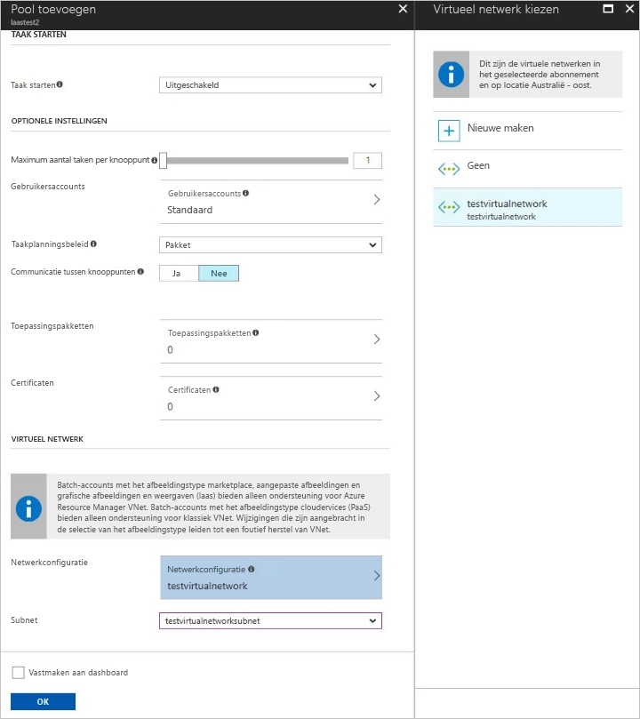
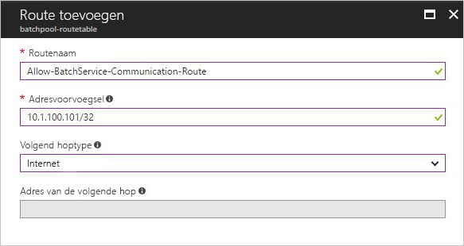

# Een Azure Batch-groep maken in een virtueel netwerk

Wanneer u een Azure Batch-groep maakt, u de groep inrichten in een subnet van een [Virtueel Azure-netwerk](../virtual-network/virtual-networks-overview.md) (VNet) dat u opgeeft. In dit artikel wordt uitgelegd hoe u een batchpool in een VNet instelt. 

## Waarom een VNet gebruiken?

Een Azure Batch-groep heeft instellingen waarmee compute nodes met elkaar kunnen communiceren, bijvoorbeeld om taken met meerdere instanties uit te voeren. Voor deze instellingen is geen aparte VNet vereist. De knooppunten kunnen echter standaard niet communiceren met virtuele machines die geen deel uitmaken van de batchgroep, zoals een licentieserver of een bestandsserver. Als u de groepcomputenodes veilig wilt laten communiceren met andere virtuele machines of met een on-premises netwerk, u de groep inrichten in een subnet van een Azure VNet. 

## Vereisten

* **Verificatie**. Het gebruik van een Azure VNet vereist dat de Batch-client-API gebruikmaakt van Azure Active Directory-verificatie (AD). Azure Batch-ondersteuning voor Azure AD wordt beschreven in [Oplossingen van Batch-service verifiëren met Active Directory](batch-aad-auth.md). 

* **Een Azure VNet**. Zie de volgende sectie voor VNet-vereisten en -configuratie. Als u een VNet vooraf met een of meer subnetten wilt voorbereiden, u de Azure-portal, Azure PowerShell, de Azure Command-Line Interface (CLI) of andere methoden gebruiken.  
  * Zie Een virtueel netwerk maken als u een VNet op basis van Azure Resource Manager wilt [maken.](../virtual-network/manage-virtual-network.md#create-a-virtual-network) Een VNet op basis van Resource Manager wordt aanbevolen voor nieuwe implementaties en wordt alleen ondersteund op groepen in de configuratie van de virtuele machine.
  * Zie Een virtueel netwerk [(klassiek) maken met meerdere subnetten](../virtual-network/create-virtual-network-classic.md)als u een klassieke VNet wilt maken. Een klassieke VNet wordt alleen ondersteund op pools in de Cloud Services-configuratie.

## Vereisten voor VNet

[!INCLUDE [batch-virtual-network-ports](../../includes/batch-virtual-network-ports.md)]

## Een pool maken met een VNet in de portal

Zodra u uw VNet hebt gemaakt en er een subnet aan hebt toegewezen, u een batchgroep maken met dat VNet. Volg deze stappen om een groep te maken vanuit de Azure-portal: 

1. Ga in Azure Portal naar uw Batch-account. Dit account moet zich in hetzelfde abonnement en dezelfde regio bevinden als de resourcegroep die de VNet bevat die u wilt gebruiken. 
2. Selecteer in het venster **Instellingen** aan de linkerkant het **menu-item Groeping.**
3. Selecteer **in** het venster Pools de opdracht **Toevoegen.**
4. Selecteer **in** het venster Groep toevoegen de optie die u wilt gebruiken in de vervolgkeuzelijst **Afbeeldingstype.** 
5. Selecteer de juiste **Uitgever/Aanbieding/Sku** voor uw aangepaste afbeelding.
6. Geef de resterende vereiste instellingen op, waaronder de **grootte van knooppunt,** **speciale knooppunten voor doel**en knooppunten met lage **prioriteit,** evenals de gewenste optionele instellingen.
7. Selecteer **in Virtueel netwerk**het virtuele netwerk en subnet dat u wilt gebruiken.
  
   

## Door de gebruiker gedefinieerde routes voor gedwongen tunneling

Mogelijk hebt u vereisten in uw organisatie om internetgebonden verkeer van het subnet terug te leiden naar uw on-premises locatie voor inspectie en logboekregistratie. Mogelijk hebt u gedwongen tunneling voor de subnetten in uw VNet ingeschakeld. 

Als u ervoor wilt zorgen dat uw gegevensknooppunten voor de Azure Batch-groep-groep werken in een VNet dat gedwongen tunneling heeft ingeschakeld, moet u de volgende [door de gebruiker gedefinieerde routes](../virtual-network/virtual-networks-udr-overview.md) voor dat subnet toevoegen:

* De batchservice moet communiceren met rekenknooppunten voor het plannen van gegevens. Als u deze communicatie wilt inschakelen, voegt u een door de gebruiker gedefinieerde route toe voor elk IP-adres dat wordt gebruikt door de Batch-service in het gebied waar uw Batch-account bestaat. Zie [Servicetags in on-premises](../virtual-network/service-tags-overview.md) voor meer informatie over het verkrijgen van de lijst met IP-adressen van de Batch-service

* Zorg ervoor dat uitgaand verkeer naar Azure Storage `<account>.table.core.windows.net` `<account>.queue.core.windows.net`(met `<account>.blob.core.windows.net`name URL's van het formulier en ) niet wordt geblokkeerd via uw on-premises netwerktoestel.

Wanneer u een door de gebruiker gedefinieerde route toevoegt, definieert u de route voor elk gerelateerd batch-IP-adresvoorvoegsel en stelt u **Het volgende hoptype** in op **internet**. Zie het volgende voorbeeld:

## Volgende stappen

- Zie [Grootschalige parallelle rekenoplossingen ontwikkelen met Batch](batch-api-basics.md)voor een diepgaand overzicht van Batch.
- Zie Een door de gebruiker gedefinieerde [route maken - Azure-portal](../virtual-network/tutorial-create-route-table-portal.md)voor meer informatie over het maken van een door de gebruiker gedefinieerde route.
