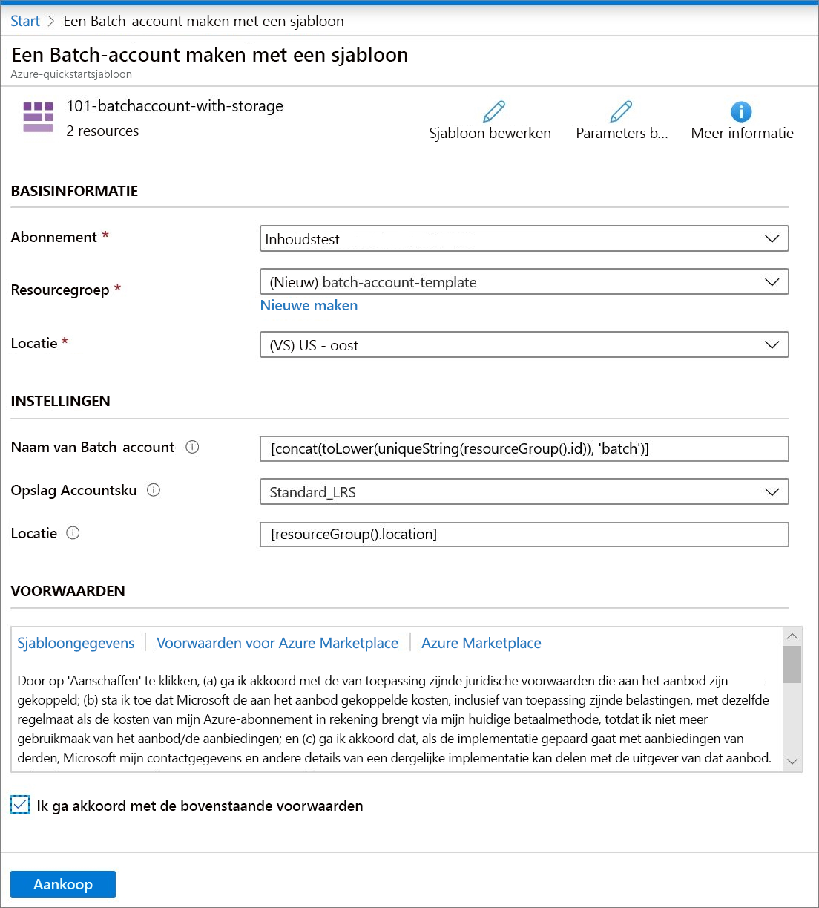

# Quickstart: een Batch-account maken met een Azure Resource Manager-sjabloon

U hebt een Batch-account nodig om rekenresources (pools met rekenknooppunten) en Batch-taken te maken. Als u een Azure Storage-account koppelt aan uw Batch-account, kunt u toepassingen implementeren en invoer- en uitvoergegevens voor de meeste workloads uit de praktijk opslaan. In deze quickstart wordt beschreven hoe u een Azure Resource Manager-sjabloon gebruikt om een Batch-account te maken, inclusief opslag. Nadat u deze snelstartgids hebt voltooid, begrijpt u de belangrijkste principes van de Batch-service en bent u er klaar voor om Batch op grotere schaal te gebruiken voor meer realistische workloads.

[!INCLUDE [About Azure Resource Manager](../../includes/resource-manager-quickstart-introduction.md)]

## Vereisten

U hebt een actief Azure-abonnement nodig.

- [!INCLUDE [quickstarts-free-trial-note](../../includes/quickstarts-free-trial-note.md)]

## Create a storage account

### De sjabloon controleren

De sjabloon die in deze quickstart wordt gebruikt, komt uit [Azure-quickstart-sjablonen](https://azure.microsoft.com/resources/templates/101-batchaccount-with-storage/).

:::code language="json" source="~/quickstart-templates/101-batchaccount-with-storage/azuredeploy.json" range="1-80" highlight="36-69":::

Er worden twee Azure-resources gedefinieerd in de sjabloon:

- [Microsoft.Storage/storageAccounts](https://docs.microsoft.com/azure/templates/microsoft.storage/storageaccounts): Hiermee maakt u een opslagaccount.
- [Microsoft.Batch/batchAccounts](https://docs.microsoft.com/azure/templates/microsoft.batch/batchaccounts): Hiermee maakt u een Batch-account.

### De sjabloon implementeren

1. Selecteer de volgende afbeelding om u aan te melden bij Azure en een sjabloon te openen. De sjabloon maakt een Azure Batch-account en een opslagaccount.

   

1. Typ of selecteer de volgende waarden.

   

   - **Abonnement**: selecteer een Azure-abonnement.
   - **Resourcegroep**: selecteer **Nieuwe maken**, geef een unieke naam op voor de resourcegroep en klik op **OK**.
   - **Locatie**: selecteer een locatie. Bijvoorbeeld **VS - centraal**.
   - **Naam van Batch-account**: Laat de standaardwaarde staan.
   - **Opslagaccountsku**: selecteer een type opslagaccount. Bijvoorbeeld **Standard_LRS**.
   - **Locatie**: wijzig de standaardlocatie zodat de resources zich op dezelfde locatie bevinden als de resourcegroep.
   - Ik ga akkoord met de bovenstaande voorwaarden: **Selecteren**.

1. Selecteer **Aankoop**.

Na enkele minuten ziet u een melding dat het Batch-account is gemaakt.

In dit voorbeeld wordt Azure Portal gebruikt voor de implementatie van de sjabloon. Naast Azure Portal kunt u ook de Azure PowerShell, Azure CLI en REST API gebruiken. Zie [Sjablonen implementeren](../azure-resource-manager/templates/deploy-powershell.md) voor meer informatie over andere implementatiemethoden.

## De implementatie valideren

U kunt de implementatie valideren in Azure Portal door te navigeren naar de resourcegroep die u hebt gemaakt. Controleer in het scherm **Overzicht** dat het Batch-account en het opslagaccount aanwezig zijn.

## Resources opschonen

Als u van plan bent om verder te gaan met volgende [zelfstudies](./tutorial-parallel-dotnet.md), kunt u deze resources intact laten. Als u ze niet meer nodig hebt, kunt u [de resourcegroep verwijderen](../azure-resource-manager/management/delete-resource-group.md?tabs=azure-portal#delete-resource-group), waardoor ook het Batch-account en het opslagaccount die u hebt gemaakt, worden verwijderd.

## Volgende stappen

In deze quickstart hebt u een Batch-account en een opslagaccount gemaakt. Voor meer informatie over Azure Batch gaat u naar de Azure Batch-zelfstudies.

> [!div class="nextstepaction"]
> [Azure Batch-zelfstudies](./tutorial-parallel-dotnet.md)
