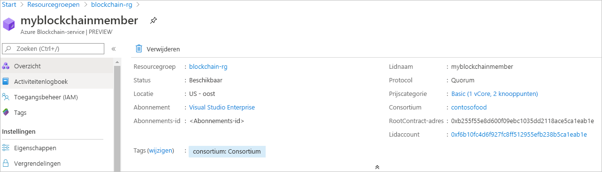

# Quickstart: Een Azure Blockchain Service-lid maken met behulp van een ARM-sjabloon

In deze quickstart implementeert u een nieuw blockchain-lid en -consortium in Azure Blockchain Service met behulp van een Azure Resource Manager-sjabloon (ARM-sjabloon). Een lid van de Azure Blockchain Service is een blockchain-knooppunt in een privé-blockchain-netwerk van een consortium. Bij het inrichten van een lid kunt u een consortium-netwerk maken of het lid aan een netwerk toevoegen. U hebt voor een consortium-netwerk ten minste één lid nodig. Het aantal blockchain-leden dat deelnemers nodig hebben, is afhankelijk van uw scenario. Consortium-deelnemers kunnen een of meer blockchain-leden hebben of ze kunnen leden delen met andere deelnemers. Zie [Azure Blockchain Service-consortium](consortium.md) voor meer informatie over consortiums.

[!INCLUDE [About Azure Resource Manager](../../../includes/resource-manager-quickstart-introduction.md)]

Als uw omgeving voldoet aan de vereisten en u benkend bent met het gebruik van ARM-sjablonen, selecteert u de knop **Implementeren naar Azure**. De sjabloon wordt in Azure Portal geopend.

## Vereisten

Als u nog geen Azure-abonnement hebt, maakt u een [gratis account](https://azure.microsoft.com/free/) voordat u begint.

## De sjabloon controleren

De sjabloon die in deze quickstart wordt gebruikt, komt uit [Azure-snelstartsjablonen](https://azure.microsoft.com/resources/templates/201-blockchain-asaservice/).

:::code language="json" source="~/quickstart-templates/201-blockchain-asaservice/azuredeploy.json" range="1-84" highlight="52-80":::

Azure-resources die in de sjabloon zijn gedefinieerd:

* [**Microsoft.Blockchain/blockchainMembers**](/azure/templates/microsoft.blockchain/blockchainmembers)

## De sjabloon implementeren

1. Selecteer de volgende koppeling om u aan te melden bij Azure en open een sjabloon.

    

1. Geef de instellingen voor het lid van de Azure Blockchain-service op.

    Instelling | Beschrijving
    --------|------------
    Abonnement | Selecteer het Azure-abonnement dat u wilt gebruiken voor uw service. Als u meerdere abonnementen hebt, kiest u het abonnement waarin u wordt gefactureerd voor de resource.
    Resourcegroep | U kunt een nieuwe resourcegroepnaam maken of een bestaande naam uit uw abonnement kiezen.
    Locatie | Kies een locatie om het lid te maken. Alle leden van het consortium moeten zich op dezelfde locatie bevinden. Beschikbare locaties voor de implementatie zijn *westeurope, eastus, southeastasia, westeurope, northeurope, westus2* en *japaneast*.
    Lidnaam | Kies een unieke naam voor het lid van de Azure Blockchain Service. De blockchain-naam mag alleen kleine letters en cijfers bevatten. Het eerste teken moet een letter zijn. De waarde moet minimaal 2 en maximaal 20 tekens lang zijn.
    Consortium-naam | Voer een unieke naam in. Zie [Azure Blockchain Service-consortium](consortium.md) voor meer informatie over consortiums.
    Wachtwoord voor lid | Het wachtwoord van het lidaccount wordt gebruikt voor het versleutelen van de persoonlijke sleutel voor het Ethereum-account dat voor het lid wordt gemaakt. U gebruikt het lidaccount en het wachtwoord van het lidaccount voor het beheer van consortiums.
    SKU-categorie | De prijscategorie voor de nieuwe service. Kies tussen de categorieën **Standard** en **Basic**. Gebruik de categorie *Basic* voor ontwikkeling, tests en het testen van concepten. Gebruik de categorie *Standard* voor implementaties van productiekwaliteit. U moet de categorie *Standard* ook gebruiken als u Blockchain Data Manager gebruikt of een groot aantal privé transacties verzendt. Wanneer een lid is gemaakt, kan de prijscategorie niet meer worden gewijzigd van Basic in Standard en andersom.
    SKU-naam | De knooppuntconfiguratie en kosten voor uw nieuwe service.

1. Selecteer **Aankoop** om de sjabloon te implementeren.

  Hier wordt de Azure Portal gebruikt om de sjabloon te implementeren. U kunt ook Azure PowerShell, Azure CLI en REST API gebruiken. Zie [Sjablonen implementeren](../../azure-resource-manager/templates/deploy-powershell.md) voor meer informatie over andere implementatiemethoden.

## Geïmplementeerde resources bekijken

U kunt de Azure-portal gebruiken om de details van het geïmplementeerde lid van Azure Blockchain Service weer te geven. Ga in de portal naar de resourcegroep met uw Azure Blockchain Service-lid. Selecteer het blockchain-lid dat u hebt gemaakt.

## Resources opschonen

U kunt voor de volgende quickstart of zelfstudie het blockchain-lid gebruiken dat u hebt gemaakt. Als u ze niet meer nodig hebt, kunt u alle resources die u voor de quickstart hebt gemaakt, verwijderen door de resourcegroep te verwijderen.

Zo verwijdert u de resourcegroep:

1. Ga in de Azure Portal naar **Resourcegroep** in het linkernavigatievenster en selecteer de resourcegroep die u wilt verwijderen.
2. Selecteer **Resourcegroep verwijderen**. Controleer de verwijdering door de naam van de resourcegroep in te voeren en **Verwijderen** te selecteren.

## Volgende stappen

In deze quickstart hebt u een lid van de Azure Blockchain Service en een nieuw consortium geïmplementeerd. Probeer de volgende quickstart om de Azure Blockchain Development Kit voor Ethereum te gebruiken om een koppeling te maken met een lid van de Azure Block Chain Service.

> [!div class="nextstepaction"]
> [Visual Studio Code gebruiken om verbinding te maken met Azure Blockchain Service](connect-vscode.md)