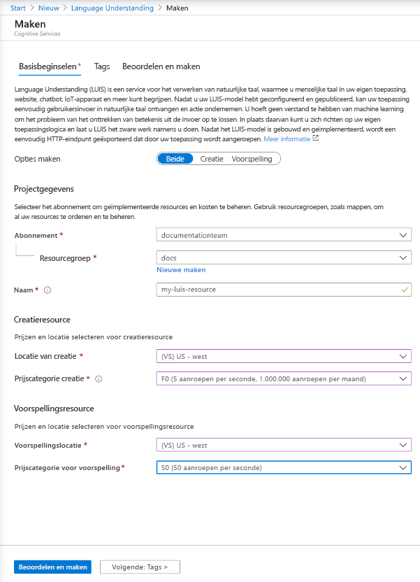

## LUIS-resources maken in Azure Portal

1. Gebruik [deze koppeling](https://ms.portal.azure.com/#create/Microsoft.CognitiveServicesLUISAllInOne) om te beginnen met het maken van LUIS-resources in Azure Portal.

1. Geef alle vereiste instellingen op:

    |Name|Doel|
    |--|--|
    |Abonnementsnaam| Het abonnement dat wordt gefactureerd voor de resource.|
    |Resourcegroep| Een aangepaste resourcegroepnaam die u kiest of maakt. Met resourcegroepen kunt u Azure-resources groeperen voor toegang en beheer.|
    |Name| Een door u gekozen aangepaste naam die wordt gebruikt als het aangepaste subdomein voor uw ontwerp- en voorspellingseindpuntquery's.|
    |Locatie van creatie|De regio die aan uw model is gekoppeld.|
    |Prijscategorie creatie|De prijscategorie bepaalt het maximale aantal transacties per seconde en maand.|
    |Runtime-locatie|De regio die is gekoppeld aan de gepubliceerde voorspellingseindpuntruntime.|
    |Prijscategorie runtime|De prijscategorie bepaalt het maximale aantal transacties per seconde en maand.|

    > [!div class="mx-imgBorder"]
    > 

1. Klik op **Controleren + maken** en wacht totdat de resource is gemaakt.
1. Nadat beide resources zijn gemaakt, selecteert u, terwijl u zich nog steeds in Azure Portal bevindt, de nieuwe ontwerpresource en vervolgens **Quickstarts** om de **eindpunt-URL** en **sleutel** voor creatie te verkrijgen, zodat u ontwerpen met behulp van een programma kunt uitvoeren.

> [!TIP]
> Als u de resources wilt gebruiken in de LUIS-portal [moet u de resources](../luis-how-to-azure-subscription.md#assign-an-authoring-resource-in-the-luis-portal-for-all-apps) toewijzen.