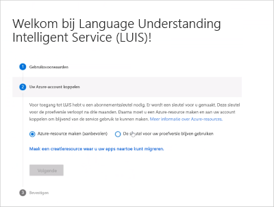
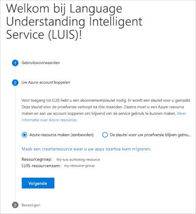
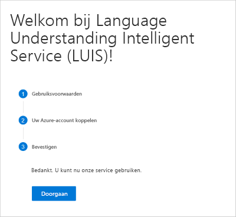

## Aanmelden bij de LUIS-Portal

Een nieuwe gebruiker aan LUIS moet deze procedure volgen:

1. Meld u aan bij de [Luis-Portal](https://www.luis.ai), selecteer uw land/regio en ga akkoord met de gebruiks voorwaarden. Als u in plaats daarvan **mijn apps** ziet, bestaat er al een Luis-resource en gaat u verder met het maken van een app. Voor ondersteunde regio's gaat u naar [ontwerp-en publicatie regio's en de bijbehorende sleutels](https://docs.microsoft.com/azure/cognitive-services/luis/luis-reference-regions).

1. Selecteer **Azure-resource maken** en selecteer vervolgens **een ontwerp bron maken om uw apps naar te migreren.**

    

1. Vul de Details voor de resource in.

    

    Wanneer **u een nieuwe ontwerp bron maakt**, geeft u de volgende informatie op:

    * **Resource naam** : een door u gekozen aangepaste naam, die wordt gebruikt als onderdeel van de URL voor uw ontwerp-en Voorspellings eindpunt query's.
    * **Tenant** : de Tenant waaraan uw Azure-abonnement is gekoppeld.
    * **Abonnements naam** : het abonnement dat wordt gefactureerd voor de resource.
    * **Resource groep** : de naam van een aangepaste resource groep die u kiest of maakt. Met resource groepen kunt u Azure-resources groeperen voor toegang en beheer.
    * **Locatie** : de locatie keuze is gebaseerd op de selectie van de **resource groep** .
    * **Prijs categorie** : de prijs categorie bepaalt de maximale trans actie per seconde en maand.

1. Er wordt een samen vatting weer gegeven van de resource die moet worden gemaakt. Selecteer **Volgende**.

    

1. Bevestig door **door gaan**te selecteren.

    
