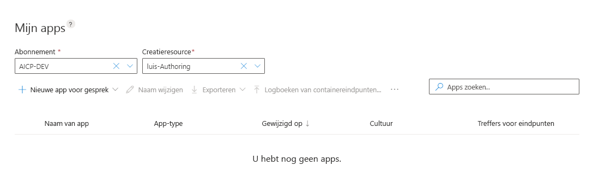

# Een nieuwe LUIS-app maken in de LUIS-Portal
Er zijn een aantal manieren om een LUIS-app te maken. U kunt een LUIS-app maken in de LUIS-portal of via de LUIS-ontwerp- [api's](developer-reference-resource.md).

[!INCLUDE [Uses preview portal](includes/uses-portal-preview.md)]

## Met behulp van de portal LUIS

U kunt op verschillende manieren een nieuwe app maken in de preview-portal:

* Beginnen met een lege app en intenties, uitingen en entiteiten te maken.
* Begin met een lege app en voeg een [vooraf gebouwd domein](luis-how-to-use-prebuilt-domains.md)toe.
* Importeer een LUIS-app uit een `.lu`-of `.json`-bestand dat al de intenties, uitingen en entiteiten bevat.

## Met behulp van de API's voor ontwerpen
U kunt een nieuwe app maken met de authoring API's in een aantal manieren:

* [Toepassing toevoegen](https://westeurope.dev.cognitive.microsoft.com/docs/services/luis-programmatic-apis-v3-0-preview/operations/5890b47c39e2bb052c5b9c2f) : begin met een lege app en maak intents, uitingen en entiteiten.
* [Vooraf gebouwde toepassing toevoegen](https://westeurope.dev.cognitive.microsoft.com/docs/services/luis-programmatic-apis-v3-0-preview/operations/59104e515aca2f0b48c76be5) : begin met een vooraf gebouwd domein, met inbegrip van intenties, uitingen en entiteiten.  

 

[!INCLUDE [Sign in to LUIS](./includes/sign-in-process.md)]

## Nieuwe app maken in LUIS

1. Selecteer uw abonnement op **mijn apps** pagina en ontwerp de resource en vervolgens **+ maken**. Als u een gratis proef versie gebruikt, leert u hoe u [een ontwerp bron maakt](luis-how-to-azure-subscription.md#create-resources-in-the-azure-portal).

    

1. Voer in het dialoog venster de naam van uw toepassing in, bijvoorbeeld `Pizza Tutorial`.

    

1. Kies uw toepassings cultuur en selecteer vervolgens **gereed**. De beschrijving en Voorspellings bron zijn op dit moment optioneel. U kunt op elk gewenst moment instellen in het gedeelte **beheren** van de portal.

    > [!NOTE]
    > De cultuur kan niet worden gewijzigd nadat de toepassing is gemaakt. 

    Nadat de app is gemaakt, wordt in de LUIS-Portal de lijst met **intenties** weer gegeven met de `None` opzet die u al voor u hebt gemaakt. U hebt nu een lege app. 
    
    > [!div class="mx-imgBorder"]
    > 

## Andere acties beschikbaar

De context werkbalk bevat andere acties:

* Naam van app wijzigen
* Importeren uit een bestand met behulp van `.lu` of `.json`
* App exporteren als `.lu` (voor [LUDown](https://github.com/microsoft/botbuilder-tools/tree/master/packages/Ludown)), `.json`of `.zip` (voor [Luis-container](luis-container-howto.md))
* Container-eindpunt logboeken importeren om eind punt uitingen te controleren
* Eindpunt logboeken exporteren als `.csv`voor offline analyse
* App verwijderen

## Volgende stappen

Als het ontwerp van uw app de detectie van de opzet bevat, [maakt u nieuwe intenties](luis-how-to-add-intents.md)en voegt u bijvoorbeeld uitingen toe. Als het ontwerp van uw app alleen gegevens extractie is, voegt u bijvoorbeeld uitingen toe aan de geen intentie, vervolgens [maakt u entiteiten](luis-how-to-add-example-utterances.md)en labelt u het voor beeld uitingen met deze entiteiten. 
