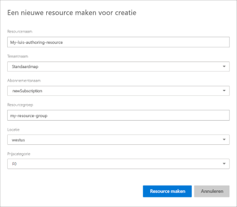

# <a name="steps-to-migrate-to-the-azure-authoring-resource"></a>Stappen om te migreren naar de Azure-ontwerpbron

Migreer vanuit de LUIS-portal (Language Understanding) alle apps die u bezit om de Azure-ontwerpbron te gebruiken.

## <a name="prerequisites"></a>Vereisten

* **Optioneel**maak je een back-up van de apps uit de lijst met apps van de LUIS-portal door elke app te exporteren of de [export-API](https://westus.dev.cognitive.microsoft.com/docs/services/5890b47c39e2bb17b84a55ff/operations/5890b47c39e2bb052c5b9c40)te gebruiken.
* **Sla eventueel**de lijst van elke medewerker van elke app op. Alle bijdragers kunnen een e-mail ontvangen als onderdeel van het migratieproces.
* **Vereist,** u moet een [Azure-abonnement](https://azure.microsoft.com/free/)hebben. Voor een deel van het abonnementsproces is wel factureringsgegevens vereist. U echter gratis (F0)-prijsniveaus gebruiken wanneer u LUIS gebruikt. U uiteindelijk vinden dat u een betaalde laag nodig hebt, omdat uw gebruik toeneemt.

Als u geen Azure-abonnement hebt, [meldt u zich aan](https://azure.microsoft.com/free/).

## <a name="access-the-migration-process"></a>Toegang tot het migratieproces

Wekelijks wordt u gevraagd uw apps te migreren. U dit venster annuleren zonder te migreren. Als u wilt migreren vóór de volgende geplande periode, u het migratieproces starten vanuit het **Azure-pictogram** op de bovenste gereedschapsbalk van de LUIS-portal.

> [!div class="mx-imgBorder"]
> 

## <a name="app-owner-begins-the-migration-process"></a>App-eigenaar begint het migratieproces

Het migratieproces is beschikbaar als u eigenaar bent van LUIS-apps.

1. Meld u aan bij [luis portal](https://www.luis.ai) en ga akkoord met de gebruiksvoorwaarden.
1. Met het pop-upvenster migratie u de migratie voortzetten of later migreren. Selecteer **Nu migreren**. Als u ervoor kiest om later te migreren, hebt u 9 maanden de tijd om te migreren naar de nieuwe ontwerpsleutel in Azure.

    

1. Als een van uw apps bijdragers is, wordt u gevraagd **een e-mail** te sturen waarin u hen op de hoogte stelt van de migratie. Dit is een optionele stap.

    Zodra u uw account naar Azure hebt gemigreerd, zijn uw apps niet langer beschikbaar voor bijdragers.

    Voor elke medewerker en app wordt de standaarde-mailtoepassing geopend met een licht opgemaakte e-mail. U de e-mail bewerken voordat u deze verzendt.

    De e-mailsjabloon bevat de exacte app-id en de naam van de app.

    ```html
    Dear Sir/Madam,

    I will be migrating my LUIS account to Azure. Consequently, you will no longer have access to the following app:

    App Id: <app-ID-omitted>
    App name: Human Resources

    Thank you
    ```

1. Kies ervoor om een LUIS-ontwerpbron te maken door te selecteren om een bestaande ontwerpbron te gebruiken of om een nieuwe ontwerpbron te maken.

    > [!div class="mx-imgBorder"]
    > 

1. Voer in het volgende venster de gegevens van de bronsleutel in. Nadat u de gegevens hebt ingevoerd, selecteert u **Resource maken**. U 10 gratis ontwerpbronnen per regio hebben, per abonnement.

    

    Geef **bij het maken van een nieuwe ontwerpbron**de volgende informatie:

    * **Resourcenaam** - een aangepaste naam die u kiest, die wordt gebruikt als onderdeel van de URL voor uw ontwerp- en voorspellingseindpuntquery's.
    * **Tenant** - de tenant waarmee uw Azure-abonnement is gekoppeld.
    * **Abonnementsnaam** - het abonnement dat in rekening wordt gebracht voor de resource.
    * **Resourcegroep** - een aangepaste resourcegroepnaam die u kiest of maakt. Met resourcegroepen u Azure-bronnen groeperen voor toegang en beheer.
    * **Locatie** - de locatiekeuze is gebaseerd op de selectie van de **resourcegroep.**
    * **Prijscategorie** - de prijscategorie bepaalt de maximale transactie per seconde en maand.

1. Valideer uw ontwerpbron en **migreer nu**.

    

1. Wanneer de ontwerpbron wordt gemaakt, wordt het succesbericht weergegeven. Selecteer **Sluiten** om het pop-upvenster te sluiten.

    

    In de lijst **Mijn apps** worden de apps weergegeven die zijn gemigreerd naar de nieuwe bron voor het ontwerpen.

    U hoeft de sleutel van de ontwerpbron niet te kennen om uw apps in de LUIS-portal te blijven bewerken. Als u van plan bent uw apps programmatisch te bewerken, hebt u de belangrijkste waarden voor het ontwerpen nodig. Deze waarden worden weergegeven op de pagina **> Azure-bronnen beheren** in de LUIS-portal en zijn ook beschikbaar in de Azure-portal op de **pagina Sleutels van** de bron.

1. Voordat u toegang krijgt tot uw apps, selecteert u de bron voor het schrijven van abonnementen en LUIS om de apps te bekijken die u maken.

    


## <a name="app-contributor-begins-the-migration-process"></a>App-bijdrager begint het migratieproces

Volg dezelfde stappen als de eigenaar van de app voor migratie. Het proces creëert een nieuwe `LUIS.Authoring`authoring resource van soort .

U moet uw account migreren om als bijdrager te worden toegevoegd aan gemigreerde apps die eigendom zijn van anderen.

## <a name="after-the-migration-process-add-contributors-to-your-authoring-resource"></a>Voeg na het migratieproces bijdragers toe aan uw auteursrechtbron

[!INCLUDE [Manage contributors for the Azure authoring resource for language understanding](./includes/manage-contributors-authoring-resource.md)]

Meer informatie over [het toevoegen van bijdragers](luis-how-to-collaborate.md).

## <a name="troubleshooting-errors-with-the-migration-process"></a>Fouten oplossen met het migratieproces

Als u `MissingSubscriptionRegistration` tijdens het migratieproces een fout ontvangt in de LUIS-portal met een rode meldingsbalk, maakt u een cognitive service-bron in de [Azure-portal](luis-how-to-azure-subscription.md#create-resources-in-the-azure-portal) of [Azure CLI.](luis-how-to-azure-subscription.md#create-resources-in-azure-cli) Meer informatie over [de oorzaken van deze fout](../../azure-resource-manager/templates/error-register-resource-provider.md#cause).

## <a name="next-steps"></a>Volgende stappen


* Concepten [concepts](luis-concept-keys.md) over authoring en runtime-toetsen bekijken
* Controleren [hoe u sleutels toewijst](luis-how-to-azure-subscription.md) en [bijdragers](luis-how-to-collaborate.md) toevoegen
