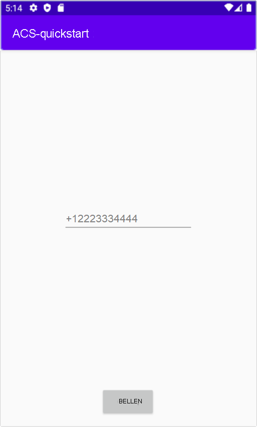

[!INCLUDE [Emergency Calling Notice](../../../includes/emergency-calling-notice-include.md)]
## <a name="prerequisites"></a>Vereisten

- Een Azure-account met een actief abonnement. [Gratis een account maken](https://azure.microsoft.com/free/?WT.mc_id=A261C142F) 
- Een geïmplementeerde Communication Services-resource. [Een Communication Services maken](../../create-communication-resource.md).
- Een telefoonnummer dat is verkregen in de Communication Services-resource. [Een telefoonnummer aanvragen](../../telephony-sms/get-phone-number.md).
- Een `User Access Token` om de aanroepende client in te schakelen. Voor meer informatie over het [verkrijgen van een `User Access Token`](../../access-tokens.md)
- Voltooi de quickstart om [aan de slag te gaan met het toevoegen van aanroepen aan uw toepassing](../getting-started-with-calling.md)

### <a name="prerequisite-check"></a>Controle van vereisten

- Als u de telefoonnummers wilt weergeven die zijn gekoppeld aan uw Communication Services-resource, meldt u zich aan bij [Azure Portal](https://portal.azure.com/), zoekt u uw Communication Services-resource en opent u het tabblad **telefoonnummers** vanuit het navigatiedeelvenster aan de linkerkant.

## <a name="setting-up"></a>Instellen

### <a name="add-pstn-functionality-to-your-app"></a>PSTN-functionaliteit aan uw app toevoegen

Voeg het type `PhoneNumber` aan uw app toe door **MainActivity.java** te wijzigen:


```java
import com.azure.android.communication.common.PhoneNumber;
```

<!--
> [!TBD]
> Namespace based on input from Komivi Agbakpem. But it does not correlates with other use namespaces in Calling Quickstart. E.g: "com.azure.communication.calling.CommunicationUser" or "com.azure.communication.common.client.CommunicationUserCredential". Double-chek this.
-->

## <a name="start-a-call-to-phone"></a>Een telefoongesprek starten

Geef het telefoonnummer op dat u hebt verkregen in de Communication Services-resource. Dit wordt gebruikt om de oproep te starten:

> [!WARNING]
> Houd er rekening mee dat telefoonnummers moeten worden opgegeven in de internationale standaardindeling E.164. (bijvoorbeeld: +12223334444)

Wijzig de gebeurtenis-handler `startCall()` in **MainActivity.java**, zodat deze telefoongesprekken verwerkt:

```java
    private void startCall() {
        EditText calleePhoneView = findViewById(R.id.callee_id);
        String calleePhone = calleePhoneView.getText().toString();
        PhoneNumber callerPhone = new PhoneNumber("+12223334444");
        StartCallOptions options = new StartCallOptions();
        options.setAlternateCallerId(callerPhone);
        options.setVideoOptions(new VideoOptions(null));
        call = agent.call(
                getApplicationContext(),
                new PhoneNumber[] {new PhoneNumber(calleePhone)},
                options);
    }
```

## <a name="launch-the-app-and-call-the-echo-bot"></a>De app starten en de Echo-bot aanroepen

De app kan nu worden gestart met behulp van de knop App uitvoeren op de werkbalk (Shift + F10). U kunt een oproep naar een telefoonnummer plaatsen door een telefoonnummer op te geven in het toegevoegde tekstveld en te klikken op de knop **BELLEN**.
> [!WARNING]
> Houd er rekening mee dat telefoonnummers moeten worden opgegeven in de internationale standaardindeling E.164. (bijvoorbeeld: +12223334444)


