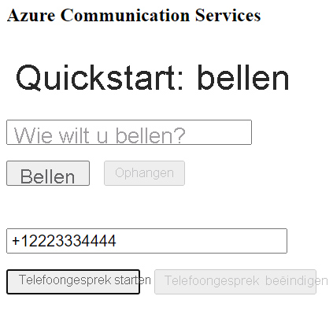

[!INCLUDE [Emergency Calling Notice](../../../includes/emergency-calling-notice-include.md)]
## <a name="prerequisites"></a>Vereisten

- Een Azure-account met een actief abonnement. [Gratis een account maken](https://azure.microsoft.com/free/?WT.mc_id=A261C142F) 
- Een geïmplementeerde Communication Services-resource. [Een Communication Services maken](../../create-communication-resource.md).
- Een telefoonnummer dat is verkregen in de Communication Services-resource. [Een telefoonnummer aanvragen](../../telephony-sms/get-phone-number.md).
- Een `User Access Token` om de aanroepende client in te schakelen. Voor meer informatie over het [verkrijgen van een `User Access Token`](../../access-tokens.md)
- Voltooi de quickstart om [aan de slag te gaan met het toevoegen van aanroepen aan uw toepassing](../getting-started-with-calling.md)

### <a name="prerequisite-check"></a>Controle van vereisten

- Als u de telefoonnummers wilt weergeven die zijn gekoppeld aan uw Communication Services-resource, meldt u zich aan bij [Azure Portal](https://portal.azure.com/), zoekt u uw Communication Services-resource en opent u het tabblad **telefoonnummers** vanuit het navigatiedeelvenster aan de linkerkant.
- U kunt uw app bouwen en uitvoeren met de clientbibliotheek voor oproepen voor Javascript in Azure Communication Services:

```console
npx webpack-dev-server --entry ./client.js --output bundle.js
```

## <a name="setting-up"></a>Instellen

### <a name="add-pstn-functionality-to-your-app"></a>PSTN-functionaliteit aan uw app toevoegen

Breid uw indeling uit met besturingselementen voor het kiezen van een telefoonnummer.

Plaats deze code aan het einde van de sectie `<body />` van **index.html**, vóór `<script />`-tags:

```html
<input 
  id="callee-phone-input"
  type="text"
  placeholder="Phone number you would like to dial"
  style="margin-bottom:1em; width: 230px;"
/>
<div>
  <button id="call-phone-button" type="button">
    Start Phone Call
  </button>
  &nbsp;
  <button id="hang-up-phone-button" type="button" disabled="true">
    Hang Up Phone Call
  </button>
</div>
```

Breid uw toepassingslogica uit met functionaliteit voor telefonie.

Voeg deze code toe aan **client.js**:

```javascript
const calleePhoneInput = document.getElementById("callee-phone-input");
const callPhoneButton = document.getElementById("call-phone-button");
const hangUpPhoneButton = document.getElementById("hang-up-phone-button");
```

## <a name="start-a-call-to-phone"></a>Een telefoongesprek starten

Geef het telefoonnummer op dat u hebt verkregen in de Communication Services-resource die wordt gebruikt om het gesprek te starten:
> [!WARNING]
> Houd er rekening mee dat telefoonnummers moeten worden opgegeven in de internationale standaardindeling E.164. (bijvoorbeeld: +12223334444)

Voeg een gebeurtenis-handler toe om een aanroep te initiëren naar het telefoonnummer dat u hebt ingevoerd toen u op `callPhoneButton` klikte:


```javascript
callPhoneButton.addEventListener("click", () => {
  // start a call to phone
  const phoneToCall = calleePhoneInput.value;
  call = callAgent.call(
    [{phoneNumber: phoneToCall}], { alternateCallerId: {phoneNumber: '+18336528005'}
  });

  // toggle button states
  hangUpPhoneButton.disabled = false;
  callPhoneButton.disabled = true;
});
```

## <a name="end-a-call-to-phone"></a>Een telefoongesprek beëindigen

Voeg een gebeurtenis-listener toe om de huidige oproep te beëindigen wanneer op de `hangUpPhoneButton` wordt geklikt:

```javascript
hangUpPhoneButton.addEventListener("click", () => {
  // end the current call
  call.hangUp({
    forEveryone: true
  });

  // toggle button states
  hangUpPhoneButton.disabled = true;
  callPhoneButton.disabled = false;
});
```

De eigenschap `forEveryone` beëindigt de oproep voor alle deelnemers aan de oproep.

## <a name="run-the-code"></a>De code uitvoeren

Gebruik de `webpack-dev-server` om uw app te bouwen en uit te voeren. Voer de volgende opdracht uit om de toepassingshost op een lokale webserver te bundelen:


```console
npx webpack-dev-server --entry ./client.js --output bundle.js
```

Open uw browser en ga naar `http://localhost:8080/`. U ziet nu het volgende:




U kunt een oproep naar een echt telefoonnummer plaatsen door een telefoonnummer op te geven in het toegevoegde tekstveld en te klikken op de knop **Telefoongesprek starten**.

> [!WARNING]
> Houd er rekening mee dat telefoonnummers moeten worden opgegeven in de internationale standaardindeling E.164. (bijvoorbeeld: +12223334444)
