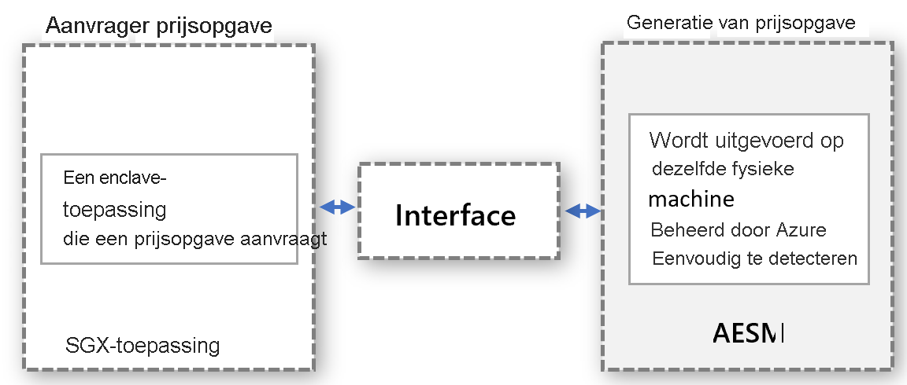

# <a name="platform-software-management-with-sgx-quote-helper-daemon-set"></a>Platformsoftwarebeheer met helper-DaemonSet voor SGX-offerte

Voor [Enclavetoepassingen](confidential-computing-enclaves.md) die externe attestation uitvoeren, is een gegenereerde offerte vereist. Deze offerte voorziet in een cryptografisch bewijs van de identiteit en de status van de toepassing en de omgeving waarin de enclave wordt uitgevoerd. Voor het genereren van de offerte zijn vertrouwde softwareonderdelen van Platform Software Components (PSW) van Intel vereist.

## <a name="overview"></a>Overzicht
 
Intel ondersteunt twee attestation-modi voor het genereren van de offerte:
- **in-proc**: de vertrouwde softwareonderdelen worden gehost binnen het proces van de enclavetoepassing

- **out-of-proc**: de vertrouwde softwareonderdelen worden gehost buiten de enclavetoepassing.
 
SGX-toepassingen die zijn gebouwd met behulp van de Open Enclave SDK, maken standaard gebruik van de attestation-modus in-proc. Op SGX gebaseerde toepassingen kunnen out-of-proc worden uitgevoerd. Hiervoor is extra hosting nodig en moeten de vereiste onderdelen, zoals Architectural Enclave Service Manager (AESM), buiten de toepassing beschikbaar worden gemaakt.

Het gebruik van deze functie wordt **sterk aanbevolen**, omdat deze de uptime van uw enclave-apps verbetert tijdens updates van het Intel-platform of het DCAP-stuurprogramma.

## <a name="why-and-what-are-the-benefits-of-out-of-proc"></a>Wat zijn de voordelen van out-of-proc, en waarom?

-   Er zijn geen updates vereist voor de onderdelen van PSW voor het genereren van de offerte voor elke containertoepassing: Bij out-of-proc hoeven containereigenaren geen updates binnen hun container te beheren. Containereigenaren maken in plaats daarvan gebruik van de door de provider verschafte interface waarmee de gecentraliseerde service buiten de container wordt aangeroepen. Deze wordt bijgewerkt en beheerd door de provider.

-   U hoeft zich geen zorgen te maken dat de attestation mislukt vanwege verouderde PSW-onderdelen: Het genereren van de offerte wordt uitgevoerd met de vertrouwde softwareonderdelen: Quoting Enclave (QE) en Provisioning Certificate Enclave (PCE), die deel uitmaken van de Trusted Computing Base (TCB). Deze softwareonderdelen moeten up-to-date zijn om aan de attestation-vereisten te blijven voldoen. Omdat de provider de updates voor deze onderdelen beheert, hoeven klanten zich niet bezig te houden met attestation-fouten als gevolg van verouderde onderdelen van de vertrouwde software in hun container.

-   Beter gebruik van EPC-geheugen: in de attestation-modus in-proc, moet elke enclavetoepassing het exemplaar van QE en PCE voor externe attestation instantiëren. Met out-of-proc hoeven deze enclaves niet door de container te worden gehost, en wordt er ook geen enclavegeheugen uit het quotum van de container gebruikt.

-   Bescherming tegen kernel-afdwinging: wanneer het SGX-stuurprogramma wordt gestreamd naar de Linux-kernel, wordt er een hogere bevoegdheid voor een enclave afgedwongen. Met deze bevoegdheid kan de enclave PCE aanroepen, waardoor de enclavetoepassing die wordt uitgevoerd in de modus in-proc, wordt verbroken. Enclaves krijgen deze machtiging standaard niet. Voor het verlenen van deze bevoegdheid aan een enclavetoepassing moeten wijzigingen in het installatieproces van de toepassing worden aangebracht. Dit wordt gemakkelijk verwerkt bij het out-of-proc model omdat de provider van de service die out-of-proc aanvragen verwerkt, ervoor zorgt dat de service met deze bevoegdheid wordt geïnstalleerd.

-   Geen controle op compatibiliteit met eerdere versies van PSW en DCAP nodig. Updates van onderdelen van PSW voor het genereren van offerten worden door de provider gecontroleerd op compatibiliteit met eerdere versies vóór de updates worden toegepast. Dit helpt bij het afhandelen en verhelpen van compatibiliteitsproblemen voordat u updates voor vertrouwelijke workloads implementeert.

## <a name="how-does-the-out-of-proc-attestation-mode-work-for-confidential-workloads-scenario"></a>Hoe werkt de attestation-modus out-of-proc voor het scenario met vertrouwelijke workloads?

Het ontwerp op hoog niveau volgt het model waarbij het aanvragen en genereren van de offerte afzonderlijk worden uitgevoerd, maar op dezelfde fysieke computer. Het genereren van offerten wordt centraal geregeld en verwerkt offerteaanvragen van alle entiteiten. De interface moet correct gedefinieerd en detecteerbaar zijn om entiteiten offerten te kunnen laten aanvragen.



Het bovenstaande abstractiemodel is van toepassing op het scenario met vertrouwelijke workloads door gebruik te maken van de al beschikbare AESM-service. AESM is in een container geïmplementeerd als een DaemonSet in het Kubernetes-cluster. Kubernetes garandeert één exemplaar van een AESM-servicecontainer, verpakt in een pod, die op elk agentknooppunt moet worden geïmplementeerd. De nieuwe daemonset SGX Quote heeft een afhankelijkheid van de daemonset sgx-device-plugin, omdat de AESM-servicecontainer EPC-geheugen zou aanvragen van sgx-device-plugin voor het starten van QE- en PCE-enclaves.

Elke container moet worden ingeschreven voor het gebruik van out-of-proc offertegeneratie door de omgevingsvariabele **SGX_AESM_ADDR=1** in te stellen tijdens het maken. De container moet ook het pakket libsgx-quote-ex bevatten waarmee de aanvraag wordt omgeleid naar de standaard Unix-domeinsocket

Een toepassing kan nog steeds de in-proc attestation als voorheen gebruiken, maar in-proc en out-of-proc kunnen niet tegelijkertijd worden gebruikt in een toepassing. De out-of-proc infrastructuur is standaard beschikbaar en verbruikt resources.

## <a name="sample-implementation"></a>Voorbeeld van een implementatie

Het onderstaande docker-bestand is een voorbeeld van een Open Enclave-toepassing. Stel de omgevingsvariabele SGX_AESM_ADDR = 1 in het docker-bestand of het implementatiebestand in. Volg het onderstaande voorbeeld voor het docker-bestand en het yaml-bestand met implementatiedetails. 

  > [!Note] 
  > De **libsgx-quote-ex-** van Intel moet worden verpakt in de toepassingscontainer voor een goede werking van out-of-proc attestation.
    
```yaml
# Refer to Intel_SGX_Installation_Guide_Linux for detail
FROM ubuntu:18.04 as sgx_base
RUN apt-get update && apt-get install -y \
    wget \
    gnupg

# Add the repository to sources, and add the key to the list of
# trusted keys used by the apt to authenticate packages
RUN echo "deb [arch=amd64] https://download.01.org/intel-sgx/sgx_repo/ubuntu bionic main" | tee /etc/apt/sources.list.d/intel-sgx.list \
    && wget -qO - https://download.01.org/intel-sgx/sgx_repo/ubuntu/intel-sgx-deb.key | apt-key add -
# Add Microsoft repo for az-dcap-client
RUN echo "deb [arch=amd64] https://packages.microsoft.com/ubuntu/18.04/prod bionic main" | tee /etc/apt/sources.list.d/msprod.list \
    && wget -qO - https://packages.microsoft.com/keys/microsoft.asc | apt-key add -

FROM sgx_base as sgx_sample
RUN apt-get update && apt-get install -y \
    clang-7 \
    libssl-dev \
    gdb \
    libprotobuf10 \
    libsgx-dcap-ql \
    libsgx-quote-ex \
    az-dcap-client \
    open-enclave
WORKDIR /opt/openenclave/share/openenclave/samples/remote_attestation
RUN . /opt/openenclave/share/openenclave/openenclaverc \
    && make build
# this sets the flag for out of proc attestation mode. alternatively you can set this flag on the deployment files
ENV SGX_AESM_ADDR=1 

CMD make run
```
U kunt de attestion-modus out-of-proc ook instellen in het yaml-bestand van de implementatie, zoals hieronder wordt weergegeven

```yaml
apiVersion: batch/v1
kind: Job
metadata:
  name: sgx-test
spec:
  template:
    spec:
      containers:
      - name: sgxtest
        image: <registry>/<repository>:<version>
        env:
        - name: SGX_AESM_ADDR
          value: 1
        resources:
          limits:
            kubernetes.azure.com/sgx_epc_mem_in_MiB: 10
        volumeMounts:
        - name: var-run-aesmd
          mountPath: /var/run/aesmd
      restartPolicy: "Never"
      volumes:
      - name: var-run-aesmd
        hostPath:
          path: /var/run/aesmd
```

## <a name="next-steps"></a>Volgende stappen
[Vertrouwelijke knooppunten (DCsv2-serie) inrichten in AKS](./confidential-nodes-aks-get-started.md)

[Quickstart-voorbeelden van vertrouwelijke containers](https://github.com/Azure-Samples/confidential-container-samples)

[DCsv2 SKU-lijst](https://docs.microsoft.com/azure/virtual-machines/dcv2-series)

<!-- LINKS - external -->
[Azure Attestation]: https://docs.microsoft.com/en-us/azure/attestation/


<!-- LINKS - internal -->
[DC Virtual Machine]: /confidential-computing/virtual-machine-solutions