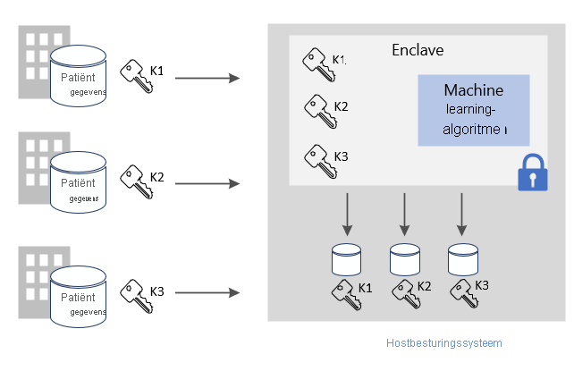
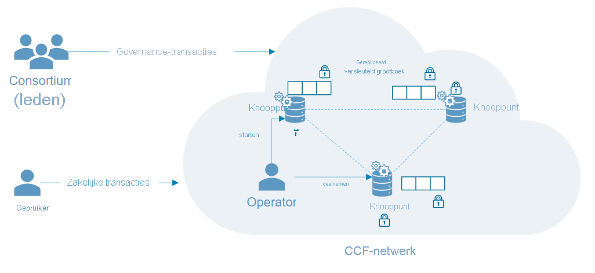

# Veelvoorkomende scenario's voor Azure Confidential Computing

Dit artikel biedt een overzicht van een aantal veelvoorkomende scenario's voor Azure Confidential Computing. De aanbevelingen in dit artikel dienen als uitgangspunt bij het ontwikkelen van uw toepassing met behulp van Confidential Computing-services en -frameworks. 

Na het lezen van dit artikel kunt u de volgende vragen beantwoorden:

- Noem enkele scenario's voor Azure Confidential Computing.
- Wat zijn de voordelen van het gebruik van Azure Confidential Computing voor scenario's van meerdere partijen?
- Wat zijn de voordelen van het gebruik van Azure Confidential Computing in een blockchainnetwerk?

## Beveiligde berekeningen met meerdere partijen
Met Azure Confidential Computing kunt u gegevens van meerdere bronnen verwerken zonder dat de invoergegevens aan andere partijen worden blootgesteld. Dit type beveiligde berekening maakt veel scenario's mogelijk, zoals het voorkomen van witwassen, fraudedetectie en veilige analyse van gezondheidsgegevens.

Meerdere bronnen kunnen gegevens uploaden naar één enclave in een virtuele machine. Eén partij vertelt de enclave de berekening of verwerking van de gegevens uit te voeren. Geen enkele partij (ook niet de partij die de analyse uitvoert) heeft feitelijk inzage in de gegevens van de andere partij; gegevens die naar de enclave zijn geüpload. 

Bij het beveiligd uitvoeren van berekeningen met meerdere partijen gaan de versleutelde gegevens naar de enclave. De enclave ontsleutelt de gegevens met behulp van een sleutel, voert de analyse uit, haalt een resultaat op en stuurt een versleuteld resultaat terug dat een partij met de aangewezen sleutel kan ontsleutelen. 

**Gegevens in gebruik beveiligen**: 
- Gebruik een virtuele machine (VM) van de DCsv2-serie in Azure waarbij Intel SGX-ondersteuning is ingeschakeld. Deze VM's worden ingeschakeld met TEE's (Trusted Execution Environments) waarmee gedeelten van de gegevens en code van uw toepassing worden beveiligd en geïsoleerd.
- Gebruik een enclave-compatibele SDK om een enclave te maken binnen de virtuele machine. Binnen de enclave zijn de gegevens voor niemand zichtbaar, zelfs niet voor de VM-provider. De gegevens in de enclave worden hardwarematig versleuteld.
    - U kunt bijvoorbeeld de [OE SDK](https://github.com/openenclave/openenclave) gebruiken voor verwerking aan de serverzijde. 

**Gegevens tijdens de overdracht beveiligen** 
- Gebruik bevestigde TLS als een beveiligd kanaal om de veiligheid van gegevens tijdens overdracht te garanderen
- De client garandeert dat de gegevens alleen naar dezelfde server worden verzonden, die door de enclave wordt beveiligd. 

**Data-at-rest beschermen**
- Gebruik beveiligde en veilige gegevensarchieven om de beveiliging van data-at-rest te garanderen 

### Witwassen van anti geld
In dit voorbeeld van een beveiligde berekening met meerdere partijen, delen meerdere banken gegevens met elkaar zonder persoonlijke gegevens van hun klanten bloot te stellen. Banken voeren van tevoren overeengekomen analyses uit van de verzameling gecombineerde, gevoelige gegevens. Dankzij analyse van de geaggregeerde gegevensset kan de geldstroom van één gebruiker tussen meerdere banken worden gedetecteerd, zonder dat de banken toegang hebben tot elkaars gegevens.

Confidential Computing stelt deze financiële instellingen in staat sneller fraude te detecteren, witwasscenario's aan te pakken, het aantal fout-positieven te verminderen en door te gaan met het leren op basis van grotere gegevenssets. 

### Ontwikkeling van medicijnen in de gezondheidszorg
Associaties van gezondheidsinstellingen dragen gegevenssets over de gezondheid van particulieren bij voor de training van een ML-model. Elke faciliteit ziet alleen de eigen gegevensset. Geen enkele andere faciliteit of zelfs de cloudprovider kan het gegevens- of trainingsmodel zien. 

Alle faciliteiten profiteren van het gebruik van het getrainde model. Door het model te maken op basis van meer gegevens, is het model nauwkeuriger geworden. Elke faciliteit die heeft bijgedragen aan de training van het model, kan hiervan gebruikmaken en nuttige resultaten krijgen. 

## Blockchain

Een blockchainnetwerk is een gedecentraliseerd netwerk van knooppunten. Deze knooppunten worden uitgevoerd en onderhouden door operators of validaties die de integriteit willen waarborgen en consensus bereiken betreffende de status van het netwerk. De knooppunten zelf zijn replica's van grootboeken en worden gebruikt voor het bijhouden van blockchaintransacties. Elk knooppunt bevat een volledige kopie van de transactiegeschiedenis, waardoor integriteit en beschikbaarheid in een gedistribueerd netwerk worden gewaarborgd.

Op Confidential Computing opgebouwde blockchaintechnologieën kunnen gebruikmaken van op hardware gebaseerde privacy om vertrouwelijkheid van gegevens en beveiligde berekeningen mogelijk te maken. In sommige gevallen wordt het hele grootboek versleuteld om de toegang tot gegevens te waarborgen. De transactie zelf kan soms plaatsvinden in een rekenmodule in de enclave binnen het knooppunt.

### Confidential Consortium Framework (CCF)
[CCF](https://www.microsoft.com/research/project/confidential-consortium-framework/) is een voorbeeld van een gedistribueerd blockchainframework dat is opgebouwd op Azure Confidential Computing. Dit framework, aangestuurd door Microsoft Research, maakt gebruik van de kracht van TEE's (Trusted Execution Environments) om een netwerk te creëren van externe enclaves ter verificatie. Knooppunten kunnen worden uitgevoerd op virtuele machines van Azure ([DCsv2-serie](confidential-computing-enclaves.md)) en profiteren van de infrastructuur van de enclave. Via verificatieprotocollen kunnen gebruikers van de blockchain de integriteit van één CCF-knooppunt verifiëren, en effectief het hele netwerk verifiëren. 

In de CCF bestaat het gedecentraliseerde grootboek uit vastgelegde wijzigingen in een archief met sleutelwaarden dat op alle netwerkknooppunten wordt gerepliceerd. Op elk van deze knooppunten wordt een transactie-engine uitgevoerd die via TLS kan worden geactiveerd door gebruikers van de blockchain. Wanneer u een eindpunt activeert, muteert u het archief met sleutelwaarden. Voordat de versleutelde wijziging wordt vastgelegd in het gedecentraliseerde grootboek, moet hierover overeenstemming worden bereikt door een bepaald aantal knooppunten om consensus te bereiken. 

## Volgende stappen
[Implementeer](quick-create-marketplace.md) een virtuele machine uit de DCsv2-serie.

