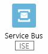
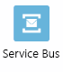

# Connectors voor Azure Logic Apps

Connectors bieden snel toegang vanuit Azure Logic Apps naar gebeurtenissen, gegevens en acties in andere apps, services, systemen, protocollen en platformen. Door connectors in uw logische apps te gebruiken, vergroot u de mogelijkheden voor uw cloud- en on-premises apps om taken uit te voeren met de gegevens die u maakt en die u al hebt.

Hoewel Logic Apps [honderden connectors](https://docs.microsoft.com/connectors)biedt, worden in dit artikel de *populaire en veelgebruikte* connectors beschreven die worden gebruikt door duizenden apps en miljoenen uitvoeringen voor het verwerken van gegevens en informatie. Als u wilt zoeken naar de volledige lijst met connectors en de referentie gegevens van elke connector, zoals triggers, acties en limieten, raadpleegt u de referentie pagina's van de connector onder [connectors Overview](https://docs.microsoft.com/connectors)(Engelstalig). Meer informatie over [Triggers en acties](#triggers-actions), [Logic apps prijs model](../logic-apps/logic-apps-pricing.md)en [Logic apps prijs informatie](https://azure.microsoft.com/pricing/details/logic-apps/).

> [!TIP]
> Als u wilt integreren met een service of API die geen connector heeft, kunt u de service rechtstreeks aanroepen via een protocol zoals HTTP of een [aangepaste connector](#custom)maken.

## Connector typen

Connectors zijn beschikbaar als ingebouwde triggers en acties of als beheerde connectors.

* [**Ingebouwde**](#built-ins): ingebouwde triggers en acties zijn "native" voor het Azure Logic apps en u helpen u bij het uitvoeren van deze taken voor uw Logic apps:

  * Uitvoeren op aangepaste en geavanceerde schema's.

  * De werk stroom van uw logische app organiseren en beheren, bijvoorbeeld lussen en voor waarden, en ook werken met variabelen en gegevens bewerkingen.

  * Communiceren met andere eind punten.

  * Aanvragen ontvangen en erop reageren.

  * Roep Azure functions, Azure API Apps (Web Apps), uw eigen Api's die worden beheerd en gepubliceerd met Azure API Management en geneste Logic apps die aanvragen kunnen ontvangen.

* [**Beheerde connectors**](#managed-api-connectors): geïmplementeerd en beheerd door micro soft, bieden deze connectors triggers en acties voor toegang tot Cloud Services, on-premises systemen of beide, waaronder Office 365, Azure Blob Storage, SQL Server, Dynamics, Sales Force, share point en meer. Sommige connectors ondersteunen specifiek business-to-Business (B2B)-communicatie scenario's en vereisen een [integratie account](../logic-apps/logic-apps-enterprise-integration-create-integration-account.md) dat is gekoppeld aan uw logische app. Voordat u bepaalde connectors gebruikt, moet u mogelijk eerst verbindingen maken, die worden beheerd door Azure Logic Apps.

  Als u bijvoorbeeld gebruikmaakt van micro soft BizTalk Server, kunnen uw logische apps verbinding maken met en communiceren met uw BizTalk Server met behulp van de [BizTalk Server on-premises connector](#on-premises-connectors). U kunt vervolgens BizTalk-achtige bewerkingen in uw Logic apps uitbreiden of uitvoeren met behulp van de [connectors voor het integratie account](#integration-account-connectors).

  Connectors worden geclassificeerd als Standard of ENTER prise. [Enter prise-connectors](#enterprise-connectors) bieden toegang tot bedrijfs systemen zoals SAP, IBM MQ en IBM 3270 voor extra kosten. Als u wilt bepalen of een connector Standard of ENTER prise is, raadpleegt u de technische details van de referentie pagina van elke connector onder [connectors Overview](https://docs.microsoft.com/connectors)(Engelstalig).

  U kunt connectors ook identificeren met behulp van deze categorieën, hoewel sommige connectors meerdere categorieën kunnen passeren. SAP is bijvoorbeeld een Enter prise-connector en een on-premises connector:

  | Connectors | Beschrijving |
  |---|---|
  | [**Beheerde connectors**](#managed-api-connectors) | Maak Logic apps die gebruikmaken van services zoals Azure Blob Storage, Office 365, Dynamics, Power BI, OneDrive, Sales Force, share point online en nog veel meer. |
  | [**On-premises connectors**](#on-premises-connectors) | Nadat u de [on-premises gegevens gateway][gateway-doc]hebt geïnstalleerd en ingesteld, kunnen deze connectors uw Logic apps gebruiken om toegang te krijgen tot on-premises systemen zoals SQL Server, share Point Server, Oracle DB, bestands shares en anderen. |
  | [**Integratieaccountconnectoren**](#integration-account-connectors) | Deze connectors zijn beschikbaar wanneer u een integratie account maakt en valideert XML, platte bestanden coderen en decoderen en B2B-berichten (Business-to-Business) met AS2-, EDIFACT-en X12-protocollen verwerkt. |
  |||

  > [!IMPORTANT]
  > Als u de Gmail-connector wilt gebruiken, kunnen alleen bedrijfsaccounts van G Suite deze connector zonder beperking in logische apps gebruiken. Als u een Gmail-consumentenaccount hebt, kunt u deze connector alleen gebruiken met specifieke door Google goedgekeurde services, of u kunt [een Google-client-app maken voor verificatie bij uw Gmail-connector](https://docs.microsoft.com/connectors/gmail/#authentication-and-bring-your-own-application). Zie [Beleid voor gegevensbeveiliging en privacybeleid voor Google-connectors in Azure Logic Apps](../connectors/connectors-google-data-security-privacy-policy.md) voor meer informatie.

### Verbinding maken vanuit een integratie service omgeving

Voor Logic apps die directe toegang tot resources in een virtueel Azure-netwerk nodig hebben, kunt u een geïsoleerde [integratie service omgeving (ISE)](../logic-apps/connect-virtual-network-vnet-isolated-environment-overview.md) maken waar u uw Logic apps op toegewezen bronnen kunt bouwen, implementeren en uitvoeren. Wanneer u in de ontwerp functie voor logische apps door de connectors bladert die u wilt gebruiken voor Logic app in een ISE, wordt er een **kern** label weer gegeven op ingebouwde triggers en acties, terwijl het label **ISE** op enkele connectors wordt weer gegeven:

* **Core**: ingebouwde triggers en acties met dit label worden uitgevoerd in dezelfde ISE als uw logische apps, bijvoorbeeld:

  

* **ISE**: beheerde connectors met dit label worden uitgevoerd in dezelfde ISE als uw logische apps, bijvoorbeeld:

  

  Als u een on-premises systeem hebt dat is verbonden met een virtueel Azure-netwerk, biedt een ISE uw Logic apps rechtstreeks toegang tot dat systeem zonder de [on-premises gegevens gateway](../logic-apps/logic-apps-gateway-connection.md). In plaats daarvan kunt u de **ISE** -connector van dat systeem gebruiken als deze beschikbaar is, een http-actie of een [aangepaste connector](#custom). Voor on-premises systemen zonder **ISE** -connectors gebruikt u de on-premises gegevens gateway. Zie [ISE-connectors](#ise-connectors)als u beschik bare ISE-connectors wilt bekijken.

* Alle andere connectors zonder het label **core** of **ISE** , die u kunt blijven gebruiken, voert u uit in de wereld wijde multi tenant-Logic apps service, bijvoorbeeld:

  

Logic apps die worden uitgevoerd in een ISE en hun connectors, ongeacht waar deze connectors worden uitgevoerd, volgt een vast prijs plan versus het prijs plan op basis van verbruik. Ga voor meer informatie naar deze pagina's:

* [Prijsmodel voor logische apps](../logic-apps/logic-apps-pricing.md)
* [Prijs informatie voor Logic Apps](https://azure.microsoft.com/pricing/details/logic-apps/)
* [Verbinding maken met virtuele Azure-netwerken vanuit Azure Logic Apps](../logic-apps/connect-virtual-network-vnet-isolated-environment.md)

## Ingebouwd

Logic Apps biedt ingebouwde triggers en acties zodat u werk stromen op basis van een planning kunt maken, uw logische apps kunnen helpen communiceren met andere apps en services, de werk stroom beheren via uw Logic apps en gegevens beheren of bewerken.

[![API-pictogram ][schedule-icon]  **schema**][schedule-doc] 

- Voer een logische app uit op een opgegeven terugkeer patroon, variërend van de Basic-naar-geavanceerde planning met de [ **terugkeer patroon** trigger][schedule-recurrence-doc].
- Voer een logische app uit die gegevens in doorlopende segmenten moet afhandelen met de [ **verschuivende venster** trigger][schedule-sliding-window-doc].
- Pauzeer uw logische app voor een opgegeven duur met de [ **vertragings** actie][schedule-delay-doc].
- Pauzeer uw logische app tot de opgegeven datum en tijd met de [ **vertraging tot** actie][schedule-delay-until-doc].

[![API-pictogram ][batch-icon]  **batch**][batch-doc]

- Berichten in batches verwerken met de trigger voor **batch berichten** .
- Logische apps aanroepen die bestaande batch triggers hebben met de actie **berichten verzenden naar batch** .

[![API ][http-icon]  **-pictogram http**][http-doc]

HTTP- of HTTPS-eindpunten aanroepen met triggers en acties voor HTTP. Andere HTTP-triggers en-acties zijn onder andere [http + Swagger][http-swagger-doc] en [http + webhook][http-webhook-doc].

[![API-pictogram ][http-request-icon]  **aanvraag**][http-request-doc]

- Maak uw logische app aanroepen van andere apps of services, Activeer Event Grid bron gebeurtenissen of Activeer reacties op antwoorden op Azure Security Center waarschuwingen met de **aanvraag** trigger. 
- Antwoorden verzenden naar een app of service met de **reactie** actie.

[![API-pictogram ][azure-api-management-icon]  **Azure API   Management**][azure-api-management-doc]

Roep triggers en acties aan die zijn gedefinieerd door de eigen API's die u beheert en publiceert met Azure API Management.

[![API-pictogram ][azure-app-services-icon]  **Azure-app   Services**][azure-app-services-doc]

Roep Azure API-apps of Web-apps aan, die worden gehost in Azure App Service. De triggers en acties die door deze apps worden gedefinieerd, worden weer gegeven als andere triggers voor de eerste klasse en acties wanneer Swagger is opgenomen. |

[![API-pictogram ][azure-logic-apps-icon]  **Azure Logic   apps**][nested-logic-app-doc]

Roep andere logische apps aan die beginnen met de **aanvraag** trigger.

### Code uitvoeren vanuit Logic apps

Logic Apps biedt ingebouwde acties voor het uitvoeren van uw eigen code in de werk stroom van uw logische app:

[![API-pictogram ][azure-functions-icon]  **Azure functions**][azure-functions-doc]

Azure functions aanroepen waarmee aangepaste code fragmenten (C# of Node.js) uit uw Logic apps worden uitgevoerd.

[![Inline API-pictogram ][inline-code-icon]  **Inline code**][inline-code-doc]

Voeg java script-code fragmenten toe en voer deze uit vanuit uw Logic apps.

### Werk stroom beheren

Logic Apps biedt ingebouwde acties voor het structureren en beheren van de acties in de werk stroom van uw logische app:

[![Ingebouwde pictogram ][condition-icon]  **voorwaarde**][condition-doc]

Evalueer een voor waarde en voer verschillende acties uit op basis van het feit of de voor waarde waar of onwaar is.

[![Ingebouwd pictogram ][for-each-icon]  **voor elk**][for-each-doc]

Voer dezelfde acties uit op elk item in een matrix.

[![Ingebouwd pictogram ][scope-icon]  **bereik**][scope-doc]

Groepeer acties in *bereiken*die hun eigen status krijgen nadat de acties in het bereik zijn uitgevoerd.

[![Ingebouwde pictogram ][switch-icon]  **Switch**][switch-doc]

Groepeer acties in *gevallen*, waaraan unieke waarden worden toegewezen, met uitzonde ring van de standaard situatie. Voer alleen die aanvraag uit waarvan de toegewezen waarde overeenkomt met het resultaat van een expressie, object of token. Als er geen overeenkomsten bestaan, voert u het standaard hoofdletter gebruik uit.

[![Het ingebouwde pictogram ][terminate-icon]  **beëindigen**][terminate-doc]

Stop een actieve werk stroom voor logische apps.

[![Ingebouwd pictogram ][until-icon]  **tot**][until-doc]

Herhaal acties totdat de opgegeven voor waarde waar is of een andere status is gewijzigd.

### Gegevens beheren of bewerken

Logic Apps biedt ingebouwde acties voor het werken met gegevens uitvoer en de bijbehorende indelingen:

[![Ingebouwde pictogram ][data-operations-icon]  **gegevens bewerkingen**][data-operations-doc]

Bewerkingen uitvoeren met gegevens:

- **Opstellen**: Maak één uitvoer van meerdere invoer met verschillende typen.
- **CSV-tabel maken**: Maak een tabel met door komma's gescheiden waarden (CSV) van een matrix met JSON-objecten.
- **HTML-tabel maken**: een HTML-tabel maken op basis van een matrix met JSON-objecten.
- **Filter matrix**: Maak een matrix van items in een andere matrix die aan uw criteria voldoen.
- **Samen voegen**: een teken reeks maken van alle items in een matrix en deze items scheiden met het opgegeven scheidings teken.
- **JSON parseren**: Maak gebruikers vriendelijke tokens van eigenschappen en hun waarden in JSON-inhoud zodat u deze eigenschappen in uw werk stroom kunt gebruiken.
- **Select**: Maak een matrix met JSON-objecten door items of waarden in een andere matrix te transformeren en deze items aan de opgegeven eigenschappen toe te wijzen.

![Ingebouwd pictogram][date-time-icon]

**Datum en tijd**

Bewerkingen uitvoeren met tijds tempels:

- **Toevoegen aan tijd**: Voeg het opgegeven aantal eenheden toe aan een tijds tempel.
- **Tijd zone converteren**: Converteer een tijds tempel van de bron tijdzone naar de doel tijdzone.
- **Huidige tijd**: de huidige tijds tempel wordt geretourneerd als een teken reeks.
- **Toekomstige tijd ophalen**: retourneert de huidige tijds tempel plus de opgegeven tijds eenheden.
- **Vorige tijd ophalen**: retourneert de huidige tijds tempel min de opgegeven tijds eenheden.
- **Aftrekken van tijd**: Trek een aantal tijds eenheden af van een tijds tempel.

[![Ingebouwde pictogram ][variables-icon]  **variabelen**][variables-doc]

Bewerkingen uitvoeren met variabelen:

- **Toevoegen aan matrix variabele**: een waarde invoegen als laatste item in een matrix die is opgeslagen door een variabele.
- **Toevoegen aan teken reeks variabele**: Voeg een waarde toe als het laatste teken in een teken reeks die is opgeslagen door een variabele.
- **Variabele verlagen**: Hiermee verkleint u een variabele met een constante waarde.
- **Toename van variabele**: Verhoog een variabele met een constante waarde.
- **Variabele initialiseren**: een variabele maken en het gegevens type en de begin waarde declareren.
- **Set-variabele**: wijs een andere waarde toe aan een bestaande variabele.

## Beheerde connectors

Logic Apps biedt deze populaire standaard connectors voor het automatiseren van taken, processen en werk stromen met deze services of systemen:

[![API-pictogram ][azure-service-bus-icon]  **Azure service bus**][azure-service-bus-doc]

Beheer asynchrone berichten, sessies en abonnementen op onderwerpen met behulp van de meest gebruikte connector in Logic Apps.

[![API-pictogram ][sql-server-icon]  **SQL Server**][sql-server-doc]

Maak verbinding met uw SQL Server on-premises of een Azure SQL Database in de Cloud, zodat u records kunt beheren, opgeslagen procedures uitvoert of query's uitvoert.

[![API-pictogram ][azure-blob-storage-icon]  **Azure Blob-   opslag**][azure-blob-storage-doc]

Maak verbinding met uw opslag account zodat u blob-inhoud kunt maken en beheren.

[![API-pictogram ][office-365-outlook-icon]  **Office 365   Outlook**][office-365-outlook-doc]

Maak verbinding met uw e-mail account voor Office 365 zodat u e-mail berichten, taken, agenda-items en vergaderingen, contact personen, aanvragen en meer kunt maken en beheren.

[![API ][sftp-ssh-icon]  **-pictogram SFTP-SSH**][sftp-ssh-doc]

Verbinding maken met SFTP-servers die u via het internet kunt openen met behulp van SSH, zodat u met uw bestanden en mappen kunt werken.

[![API ][sharepoint-online-icon]  **-pictogram share point   online**][sharepoint-online-doc]

Maak verbinding met share point online, zodat u bestanden, bijlagen, mappen en meer kunt beheren.

[![API-pictogram ][dynamics-365-icon]  **Dynamics   365**][dynamics-365-doc]

Maak verbinding met uw Dynamics 365-account zodat u records, items en meer kunt maken en beheren.

[![API-pictogram ][azure-queues-icon]  **Azure-   wacht rijen**][azure-queues-doc]

Maak verbinding met uw Azure Storage-account zodat u wacht rijen en berichten kunt maken en beheren

[![API ][ftp-icon]  **-pictogram FTP**][ftp-doc]

Verbinding maken met FTP-servers die u vanaf internet kunt gebruiken zodat u kunt werken met uw bestanden en mappen.

[![][file-system-icon] **Bestands   systeem** van API-pictogram][file-system-doc]

Maak verbinding met uw on-premises bestands share, zodat u bestanden kunt maken en beheren.

[![API-pictogram ][azure-event-hubs-icon]  **Azure Event hubs**][azure-event-hubs-doc]

Gebeurtenissen gebruiken en publiceren via een event hub. U kunt bijvoorbeeld uitvoer van uw logische app ophalen met Event Hubs en de uitvoer vervolgens verzenden naar een realtime analytics-provider.

[![API-pictogram ][azure-event-grid-icon]  **Azure Event**   **grid**][azure-event-grid-doc]

Gebeurtenissen bewaken die zijn gepubliceerd door een Event Grid, bijvoorbeeld wanneer Azure-resources of bronnen van derden worden gewijzigd.

[![API-pictogram ][salesforce-icon]  **Sales Force**][salesforce-doc]

Maak verbinding met uw Sales Force-account zodat u items zoals records, taken, objecten en meer kunt maken en beheren.

[![API-pictogram ][twitter-icon]  **Twitter**][twitter-doc]

Maak verbinding met uw Twitter-account zodat u tweets, volgers, uw tijd lijn en meer kunt beheren. Sla uw tweets op in SQL, Excel of SharePoint.

## On-premises connectors

Hier volgen enkele veelgebruikte standaard-connectors die Logic Apps biedt voor toegang tot gegevens en resources in on-premises systemen. Voordat u een verbinding met een on-premises systeem kunt maken, moet u eerst [een on-premises gegevens gateway downloaden, installeren en instellen][gateway-doc]. Deze gateway biedt een beveiligd communicatie kanaal zonder dat u de benodigde netwerk infrastructuur hoeft in te stellen.

[![API-pictogram ][biztalk-server-icon]  **BizTalk**   **Server**][biztalk-server-doc]

[![][file-system-icon] **Bestands   systeem** van API-pictogram][file-system-doc]

[![API-pictogram ][ibm-db2-icon]  **IBM DB2**][ibm-db2-doc]

[![API-pictogram ][ibm-informix-icon]  **IBM**   **Informix**][ibm-informix-doc]

[![API-pictogram ][mysql-icon]  **MySQL**][mysql-doc]

[![API-pictogram ][oracle-db-icon]  **Oracle DB**][oracle-db-doc]

[![API-pictogram ][postgre-sql-icon]  **postgresql**][postgre-sql-doc]

[![API ][sharepoint-server-icon]  **-pictogram share point   Server**][sharepoint-server-doc]

[![API-pictogram ][sql-server-icon]  **SQL   Server**][sql-server-doc]

[![API-pictogram ][teradata-icon]  **Teradata**][teradata-doc]

## Integratieaccountconnectoren

Logic Apps biedt standaard connectors voor het bouwen van Business-to-Business (B2B)-oplossingen met uw Logic apps wanneer u een [integratie account](../logic-apps/logic-apps-enterprise-integration-create-integration-account.md)maakt en betaalt dat beschikbaar is via de Enterprise Integration Pack (EIP) in Azure. Met dit account kunt u B2B-artefacten maken en opslaan, zoals handels partners, overeenkomsten, kaarten, schema's, certificaten, enzovoort. Als u deze artefacten wilt gebruiken, koppelt u uw Logic apps aan uw integratie account. Als u momenteel BizTalk Server gebruikt, zijn deze connectors mogelijk al bekend.

[![API-pictogram ][as2-icon]  **AS2-   decodering**][as2-doc]

[![API-pictogram ][as2-icon]  **AS2-   code ring**][as2-doc]

[![API-pictogram ][edifact-icon]  **EDIFACT-   decodering**][edifact-decode-doc]

[![API-pictogram ][edifact-icon]  **EDIFACT-   code ring**][edifact-encode-doc]

[![API-pictogram ][flat-file-decode-icon]  **platte bestands   codering**][flat-file-decode-doc]

[![API-pictogram ][flat-file-encode-icon]  **platte bestands   codering**][flat-file-encode-doc]

[![][integration-account-icon] **Integratie   account** API-pictogram][integration-account-doc]

[![API-pictogram ][liquid-icon]  **liquide**   **trans formaties**][json-liquid-transform-doc]

[![API-pictogram ][x12-icon]  **X12-   decodering**][x12-decode-doc]

[![API-pictogram ][x12-icon]  **X12-   code ring**][x12-encode-doc]

[![API ][xml-transform-icon]  **-pictogram XML-**   **trans formaties**][xml-transform-doc]

[![API ][xml-validate-icon]  **-pictogram XML-   validatie**][xml-validate-doc]

## Bedrijfsconnectoren

Logic Apps biedt deze zakelijke connectors voor toegang tot bedrijfs systemen, zoals SAP en IBM MQ:

[![API-pictogram ][ibm-3270-icon]  **IBM 3270**][ibm-3270-doc]

[![API-pictogram ][ibm-mq-icon]  **IBM MQ**][ibm-mq-doc]

[![API-pictogram ][sap-icon]  **SAP**][sap-connector-doc]

## ISE-connectors

Voor Logic apps die u maakt en voert een geïsoleerde [integratie service omgeving (ISE)](#integration-service-environment), identificeert de Logic app Designer ingebouwde triggers en acties die worden uitgevoerd in uw ISE met behulp van het **kern** label. Beheerde connectors die worden uitgevoerd in een ISE, worden het label **ISE** weer gegeven, terwijl Connect oren die worden uitgevoerd in de globale multi tenant-Logic apps service, geen van beide labels weer geven. In deze lijst ziet u de connectors die momenteel ISE-versies hebben:

[![API-pictogram ][as2-icon]  **AS2**][as2-doc]

[![API-pictogram ][azure-automation-icon]  **Azure   Automation**][azure-automation-doc]

[![API-pictogram ][azure-blob-storage-icon]  **Azure Blob-   opslag**][azure-blob-storage-doc]

[![API-pictogram ][azure-cosmos-db-icon]  **Azure Cosmos   db**][azure-cosmos-db-doc]

[![API-pictogram ][azure-event-hubs-icon]  **Azure event   hubs**][azure-event-hubs-doc]

[![API-pictogram ][azure-event-grid-icon]  **Azure event   grid**][azure-event-grid-doc]

[![API-pictogram ][azure-file-storage-icon]  **Azure file   Storage**][azure-file-storage-doc]

[![API-pictogram ][azure-key-vault-icon]  **Azure-sleutel   kluis**][azure-key-vault-doc]

[![API-pictogram ][azure-monitor-logs-icon]  **Azure monitor   Logboeken**][azure-monitor-logs-doc]

[![API-pictogram ][azure-service-bus-icon]  **Azure service   bus**][azure-service-bus-doc]

[![API-pictogram ][azure-sql-data-warehouse-icon]  **Azure SQL data   Warehouse**][azure-sql-data-warehouse-doc]

[![API-pictogram ][azure-table-storage-icon]  **Azure-tabel   opslag**][azure-table-storage-doc]

[![API-pictogram ][azure-queues-icon]  **Azure-   wacht rijen**][azure-queues-doc]

[![API-pictogram ][edifact-icon]  **EDIFACT**][edifact-doc]

[![][file-system-icon] **Bestands   systeem** van API-pictogram][file-system-doc]

[![API ][ftp-icon]  **-pictogram FTP**][ftp-doc]

[![API-pictogram ][ibm-3270-icon]  **IBM 3270**][ibm-3270-doc]

[![API-pictogram ][ibm-db2-icon]  **IBM DB2**][ibm-db2-doc]

[![API-pictogram ][ibm-mq-icon]  **IBM MQ**][ibm-mq-doc]

[![API-pictogram ][sap-icon]  **SAP**][sap-connector-doc]

[![API ][sftp-ssh-icon]  **-pictogram SFTP-SSH**][sftp-ssh-doc]

[![API ][smtp-icon]  **-pictogram SMTP**][smtp-doc]

[![API-pictogram ][sql-server-icon]  **SQL   Server**][sql-server-doc]

[![API-pictogram ][x12-icon]  **X12**][x12-doc]

Raadpleeg de volgende onderwerpen voor meer informatie:

* [Toegang tot Azure Virtual Network-bronnen vanuit Azure Logic Apps](../logic-apps/connect-virtual-network-vnet-isolated-environment-overview.md)
* [Prijsmodel voor logische apps](../logic-apps/logic-apps-pricing.md)
* [Verbinding maken met virtuele Azure-netwerken vanuit Azure Logic Apps](../logic-apps/connect-virtual-network-vnet-isolated-environment.md)

## Triggers en actie typen

Connectors kunnen *Triggers*, *acties*of beide bieden. Een *trigger* is de eerste stap in elke logische app, die meestal de gebeurtenis specificeert waarmee de trigger wordt geactiveerd en de logische app wordt uitgevoerd. De FTP-connector heeft bijvoorbeeld een trigger waarmee uw logische app wordt gestart wanneer een bestand wordt toegevoegd of gewijzigd. Sommige triggers controleren regel matig op de opgegeven gebeurtenis of gegevens en worden geactiveerd wanneer ze de opgegeven gebeurtenis of gegevens detecteren. Andere triggers wachten zich onmiddellijk wanneer een specifieke gebeurtenis plaatsvindt of wanneer er nieuwe gegevens beschikbaar zijn. Triggers geven ook de vereiste gegevens door aan uw logische app. Uw logische app kan deze gegevens lezen en gebruiken in de werk stroom. De Twitter-connector heeft bijvoorbeeld een trigger, ' wanneer een nieuwe tweet wordt gepost ', waarmee de inhoud van de Tweet wordt door gegeven aan de werk stroom van uw logische app.

Wanneer een trigger wordt geactiveerd, wordt door Azure Logic Apps een exemplaar van uw logische app gemaakt en worden de *acties* in de werk stroom van de logische app uitgevoerd. Acties zijn de stappen die de trigger volgen en taken uitvoeren in de werk stroom van uw logische app. U kunt bijvoorbeeld een logische app maken die klant gegevens ophaalt uit een SQL database en die gegevens in latere acties verwerken.

Hier volgen de algemene soorten triggers die Azure Logic Apps biedt:

* *Terugkeer patroon trigger*: deze trigger wordt uitgevoerd volgens een opgegeven schema en is niet nauw verbonden met een bepaalde service of systeem.

* *Polling trigger*: met deze trigger wordt regel matig een specifieke service of een systeem op basis van de opgegeven planning pollen, wordt gecontroleerd of er nieuwe gegevens zijn en of er een specifieke gebeurtenis is opgetreden. Als er nieuwe gegevens beschikbaar zijn of als de specifieke gebeurtenis is opgetreden, maakt en voert de trigger een nieuw exemplaar van uw logische app uit. Dit kan nu de gegevens gebruiken die als invoer worden door gegeven.

* *Push trigger*: deze trigger wacht op nieuwe gegevens of voor een gebeurtenis die moet worden uitgevoerd. Wanneer er nieuwe gegevens beschikbaar zijn of wanneer de gebeurtenis plaatsvindt, maakt en voert de trigger een nieuw exemplaar van uw logische app uit. Dit kan nu de gegevens gebruiken die als invoer worden door gegeven.

## Connector configuratie

De triggers en acties van elke connector bieden hun eigen eigenschappen die u kunt configureren. Voor veel connectors moet u eerst een *verbinding* met de doel service of het systeem maken en verificatie referenties of andere configuratie gegevens opgeven voordat u een trigger of actie in uw logische app kunt gebruiken. U moet bijvoorbeeld een verbinding met een Twitter-account voor toegang tot gegevens toestaan of namens u posten.

Voor connectors die gebruikmaken van Azure Active Directory (Azure AD) OAuth, wordt een verbinding gemaakt bij het aanmelden bij de service, zoals Office 365, Sales Force of GitHub, waarbij uw toegangs token is [versleuteld](../security/fundamentals/encryption-overview.md) en veilig wordt opgeslagen in een Azure-geheim archief. Andere connectors, zoals FTP en SQL, vereisen een verbinding met configuratie details, zoals het server adres, de gebruikers naam en het wacht woord. Deze gegevens over de configuratie van de verbinding zijn ook versleuteld en veilig opgeslagen. Meer informatie over [versleuteling in azure](../security/fundamentals/encryption-overview.md).

Verbindingen hebben toegang tot de doel service of het systeem zolang de service of het systeem dit toestaat. Voor services die gebruikmaken van Azure AD OAuth-verbindingen, zoals Office 365 en Dynamics, Azure Logic Apps de toegangs tokens voor onbepaalde tijd vernieuwd. Andere services hebben mogelijk beperkingen op hoe lang Azure Logic Apps een token kan gebruiken zonder te vernieuwen. Over het algemeen worden met sommige acties alle toegangs tokens ongeldig, zoals het wijzigen van uw wacht woord.

## Aangepaste Api's en connectors

Als u Api's wilt aanroepen waarmee aangepaste code wordt uitgevoerd of die niet beschikbaar zijn als connectors, kunt u het Logic Apps platform uitbreiden door [aangepaste API apps te maken](../logic-apps/logic-apps-create-api-app.md). U kunt ook [aangepaste connectors maken](../logic-apps/custom-connector-overview.md) voor rest-of SOAP-api's, zodat deze api's beschikbaar *zijn voor elke* logische app in uw Azure-abonnement. Als u aangepaste API Apps of connectors openbaar wilt maken zodat iedereen deze kan gebruiken in azure, kunt u [connectors voor micro soft-certificering verzenden](../logic-apps/custom-connector-submit-certification.md).

> [!NOTE]
> Logic apps die u in een [Integration service Environment (ISE)](../logic-apps/connect-virtual-network-vnet-isolated-environment-overview.md) implementeert en uitvoert, hebben rechtstreeks toegang tot resources in een virtueel Azure-netwerk. Als u aangepaste connectors hebt die de on-premises gegevens gateway nodig hebben en u deze connectors buiten een ISE hebt gemaakt, kunnen logische apps in een ISE ook deze connectors gebruiken.
>
> Aangepaste connectors die zijn gemaakt in een ISE werken niet met de on-premises gegevens gateway. Deze connectors hebben echter rechtstreeks toegang tot on-premises gegevens bronnen die zijn verbonden met een virtueel Azure-netwerk dat als host fungeert voor de ISE. Logic apps in een ISE hebben daarom waarschijnlijk niet de gegevens gateway nodig bij het communiceren met deze resources.
>
> Zie [verbinding maken met virtuele Azure-netwerken vanuit Azure Logic apps](../logic-apps/connect-virtual-network-vnet-isolated-environment.md)voor meer informatie over het maken van ISEs.

## Maken van verbindingen blok keren

Als uw organisatie geen verbinding met specifieke bronnen kan maken met behulp van hun connectors in Azure Logic Apps, kunt u [de mogelijkheid blok keren om deze verbindingen](../logic-apps/block-connections-connectors.md) voor specifieke connectors in de werk stromen van logische apps te gebruiken met behulp van [Azure Policy](../governance/policy/overview.md). Zie voor meer informatie [blok keren verbindingen die zijn gemaakt door specifieke connectors in azure Logic apps](../logic-apps/block-connections-connectors.md).

## Volgende stappen

* De [volledige connector lijst](https://docs.microsoft.com/connectors) weer geven
* [Een logische app maken](../logic-apps/quickstart-create-first-logic-app-workflow.md)
* [Aangepaste connectors maken voor Logic apps](https://docs.microsoft.com/connectors/custom-connectors/)
* [Aangepaste API's maken voor logische apps](../logic-apps/logic-apps-create-api-app.md)

<!-- Built-ins icons -->
[azure-api-management-icon]: ./media/apis-list/azure-api-management.png
[azure-app-services-icon]: ./media/apis-list/azure-app-services.png
[azure-functions-icon]: ./media/apis-list/azure-functions.png
[azure-logic-apps-icon]: ./media/apis-list/azure-logic-apps.png
[batch-icon]: ./media/apis-list/batch.png
[condition-icon]: ./media/apis-list/condition.png
[data-operations-icon]: ./media/apis-list/data-operations.png
[date-time-icon]: ./media/apis-list/date-time.png
[for-each-icon]: ./media/apis-list/for-each-loop.png
[http-icon]: ./media/apis-list/http.png
[http-request-icon]: ./media/apis-list/request.png
[http-response-icon]: ./media/apis-list/response.png
[http-swagger-icon]: ./media/apis-list/http-swagger.png
[http-webhook-icon]: ./media/apis-list/http-webhook.png
[inline-code-icon]: ./media/apis-list/inline-code.png
[schedule-icon]: ./media/apis-list/recurrence.png
[scope-icon]: ./media/apis-list/scope.png
[switch-icon]: ./media/apis-list/switch.png
[terminate-icon]: ./media/apis-list/terminate.png
[until-icon]: ./media/apis-list/until.png
[variables-icon]: ./media/apis-list/variables.png

<!--Managed connector icons-->
[appfigures-icon]: ./media/apis-list/appfigures.png
[asana-icon]: ./media/apis-list/asana.png
[azure-automation-icon]: ./media/apis-list/azure-automation.png
[azure-blob-storage-icon]: ./media/apis-list/azure-blob-storage.png
[azure-cognitive-services-text-analytics-icon]: ./media/apis-list/azure-cognitive-services-text-analytics.png
[azure-cosmos-db-icon]: ./media/apis-list/azure-cosmos-db.png
[azure-data-lake-icon]: ./media/apis-list/azure-data-lake.png
[azure-document-db-icon]: ./media/apis-list/azure-document-db.png
[azure-event-grid-icon]: ./media/apis-list/azure-event-grid.png
[azure-event-grid-publish-icon]: ./media/apis-list/azure-event-grid-publish.png
[azure-event-hubs-icon]: ./media/apis-list/azure-event-hubs.png
[azure-file-storage-icon]: ./media/apis-list/azure-file-storage.png
[azure-key-vault-icon]: ./media/apis-list/azure-key-vault.png
[azure-ml-icon]: ./media/apis-list/azure-ml.png
[azure-monitor-logs-icon]: ./media/apis-list/azure-monitor-logs.png
[azure-queues-icon]: ./media/apis-list/azure-queues.png
[azure-resource-manager-icon]: ./media/apis-list/azure-resource-manager.png
[azure-service-bus-icon]: ./media/apis-list/azure-service-bus.png
[azure-sql-data-warehouse-icon]: ./media/apis-list/azure-sql-data-warehouse.png
[azure-table-storage-icon]: ./media/apis-list/azure-table-storage.png
[basecamp-3-icon]: ./media/apis-list/basecamp.png
[bitbucket-icon]: ./media/apis-list/bitbucket.png
[bitly-icon]: ./media/apis-list/bitly.png
[biztalk-server-icon]: ./media/apis-list/biztalk.png
[blogger-icon]: ./media/apis-list/blogger.png
[box-icon]: ./media/apis-list/box.png
[campfire-icon]: ./media/apis-list/campfire.png
[common-data-service-icon]: ./media/apis-list/common-data-service.png
[dropbox-icon]: ./media/apis-list/dropbox.png
[dynamics-365-icon]: ./media/apis-list/dynamics-crm-online.png
[dynamics-365-financials-icon]: ./media/apis-list/dynamics-365-financials.png
[dynamics-365-operations-icon]: ./media/apis-list/dynamics-365-operations.png
[easy-redmine-icon]: ./media/apis-list/easyredmine.png
[facebook-icon]: ./media/apis-list/facebook.png
[file-system-icon]: ./media/apis-list/file-system.png
[ftp-icon]: ./media/apis-list/ftp.png
[github-icon]: ./media/apis-list/github.png
[google-calendar-icon]: ./media/apis-list/google-calendar.png
[google-drive-icon]: ./media/apis-list/google-drive.png
[google-sheets-icon]: ./media/apis-list/google-sheet.png
[google-tasks-icon]: ./media/apis-list/google-tasks.png
[hipchat-icon]: ./media/apis-list/hipchat.png
[ibm-3270-icon]: ./media/apis-list/ibm-3270.png
[ibm-db2-icon]: ./media/apis-list/ibm-db2.png
[ibm-informix-icon]: ./media/apis-list/ibm-informix.png
[ibm-mq-icon]: ./media/apis-list/ibm-mq.png
[insightly-icon]: ./media/apis-list/insightly.png
[instagram-icon]: ./media/apis-list/instagram.png
[instapaper-icon]: ./media/apis-list/instapaper.png
[jira-icon]: ./media/apis-list/jira.png
[mailchimp-icon]: ./media/apis-list/mailchimp.png
[mandrill-icon]: ./media/apis-list/mandrill.png
[mysql-icon]: ./media/apis-list/mysql.png
[office-365-outlook-icon]: ./media/apis-list/office-365.png
[office-365-users-icon]: ./media/apis-list/office-365-users.png
[onedrive-icon]: ./media/apis-list/onedrive.png
[onedrive-for-business-icon]: ./media/apis-list/onedrive-business.png
[oracle-db-icon]: ./media/apis-list/oracle-db.png
[outlook.com-icon]: ./media/apis-list/outlook.png
[pagerduty-icon]: ./media/apis-list/pagerduty.png
[pinterest-icon]: ./media/apis-list/pinterest.png
[postgre-sql-icon]: ./media/apis-list/postgre-sql.png
[project-online-icon]: ./media/apis-list/projecton-line.png
[redmine-icon]: ./media/apis-list/redmine.png
[rss-icon]: ./media/apis-list/rss.png
[salesforce-icon]: ./media/apis-list/salesforce.png
[sap-icon]: ./media/apis-list/sap.png
[send-grid-icon]: ./media/apis-list/sendgrid.png
[sftp-ssh-icon]: ./media/apis-list/sftp.png
[sharepoint-online-icon]: ./media/apis-list/sharepoint-online.png
[sharepoint-server-icon]: ./media/apis-list/sharepoint-server.png
[slack-icon]: ./media/apis-list/slack.png
[smartsheet-icon]: ./media/apis-list/smartsheet.png
[smtp-icon]: ./media/apis-list/smtp.png
[sparkpost-icon]: ./media/apis-list/sparkpost.png
[sql-server-icon]: ./media/apis-list/sql.png
[teradata-icon]: ./media/apis-list/teradata.png
[todoist-icon]: ./media/apis-list/todoist.png
[trello-icon]: ./media/apis-list/trello.png
[twilio-icon]: ./media/apis-list/twilio.png
[twitter-icon]: ./media/apis-list/twitter.png
[vimeo-icon]: ./media/apis-list/vimeo.png
[visual-studio-team-services-icon]: ./media/apis-list/visual-studio-team-services.png
[wordpress-icon]: ./media/apis-list/wordpress.png
[yammer-icon]: ./media/apis-list/yammer.png
[youtube-icon]: ./media/apis-list/youtube.png

<!-- Enterprise Integration Pack icons -->
[as2-icon]: ./media/apis-list/as2.png
[edifact-icon]: ./media/apis-list/edifact.png
[flat-file-encode-icon]: ./media/apis-list/flat-file-encoding.png
[flat-file-decode-icon]: ./media/apis-list/flat-file-decoding.png
[integration-account-icon]: ./media/apis-list/integration-account.png
[liquid-icon]: ./media/apis-list/liquid-transform.png
[x12-icon]: ./media/apis-list/x12.png
[xml-validate-icon]: ./media/apis-list/xml-validation.png
[xml-transform-icon]: ./media/apis-list/xsl-transform.png

<!--Other doc links-->
[gateway-doc]: ../logic-apps/logic-apps-gateway-connection.md "Verbinding maken met on-premises gegevensbronnen vanuit logische apps met on-premises gegevensgateway"

<!--Built-in doc links-->
[azure-api-management-doc]: ../api-management/get-started-create-service-instance.md "Een Azure API Management service-exemplaar maken voor het beheren en publiceren van uw Api's"
[azure-app-services-doc]: ../logic-apps/logic-apps-custom-hosted-api.md "Logische apps integreren met App Service API Apps."
[azure-functions-doc]: ../logic-apps/logic-apps-azure-functions.md "Logische apps integreren met Azure Functions"
[batch-doc]: ../logic-apps/logic-apps-batch-process-send-receive-messages.md "Berichten in groepen of als batches verwerken"
[condition-doc]: ../logic-apps/logic-apps-control-flow-conditional-statement.md "Een voor waarde evalueren en verschillende acties uitvoeren op basis van het feit of de voor waarde waar of onwaar is"
[for-each-doc]: ../logic-apps/logic-apps-control-flow-loops.md#foreach-loop "Dezelfde acties uitvoeren op elk item in een matrix"
[http-doc]: ./connectors-native-http.md "HTTP-of HTTPS-eind punten vanuit uw Logic apps aanroepen"
[http-request-doc]: ./connectors-native-reqres.md "HTTP-aanvragen ontvangen in uw Logic apps"
[http-response-doc]: ./connectors-native-reqres.md "Reageren op HTTP-aanvragen van uw logische apps"
[http-swagger-doc]: ./connectors-native-http-swagger.md "REST-eind punten aanroepen vanuit uw Logic apps"
[http-webhook-doc]: ./connectors-native-webhook.md "Wachten op specifieke gebeurtenissen van HTTP-of HTTPS-eind punten"
[inline-code-doc]: ../logic-apps/logic-apps-add-run-inline-code.md "Java script-code fragmenten toevoegen en uitvoeren vanuit uw Logic apps"
[nested-logic-app-doc]: ../logic-apps/logic-apps-http-endpoint.md "Logische apps integreren met geneste werkstromen"
[query-doc]: ../logic-apps/logic-apps-perform-data-operations.md#filter-array-action "Matrices selecteren en filteren met behulp van de queryactie."
[schedule-doc]: ../logic-apps/concepts-schedule-automated-recurring-tasks-workflows.md "Logische apps uitvoeren op basis van een planning"
[schedule-delay-doc]: ./connectors-native-delay.md "Uitvoering van de volgende actie vertragen"
[schedule-delay-until-doc]: ./connectors-native-delay.md "Uitvoering van de volgende actie vertragen"
[schedule-recurrence-doc]:  ./connectors-native-recurrence.md "Logische apps uitvoeren in een terugkerend schema"
[schedule-sliding-window-doc]: ./connectors-native-sliding-window.md "Logische apps uitvoeren die gegevens moeten verwerken in aaneengesloten segmenten"
[scope-doc]: ../logic-apps/logic-apps-control-flow-run-steps-group-scopes.md "Acties in groepen indelen, die hun eigen status krijgen nadat de acties in de groep zijn uitgevoerd"
[switch-doc]: ../logic-apps/logic-apps-control-flow-switch-statement.md "Organiseer acties in cases, waaraan unieke waarden worden toegewezen. Voer alleen de aanvraag uit waarvan de waarde overeenkomt met het resultaat van een expressie, object of token. Als er geen overeenkomsten bestaan, voert u de standaard case uit"
[terminate-doc]: ../logic-apps/logic-apps-workflow-actions-triggers.md#terminate-action "Een actieve werk stroom voor uw logische app stoppen of annuleren"
[until-doc]: ../logic-apps/logic-apps-control-flow-loops.md#until-loop "Acties herhalen totdat de opgegeven voor waarde waar is of een andere status is gewijzigd"
[data-operations-doc]: ../logic-apps/logic-apps-perform-data-operations.md "Gegevens bewerkingen uitvoeren zoals het filteren van matrices of het maken van CSV-en HTML-tabellen"
[variables-doc]: ../logic-apps/logic-apps-create-variables-store-values.md "Bewerkingen uitvoeren met variabelen, zoals initialiseren, instellen, verhogen, verlagen en toevoegen aan een teken reeks-of matrix variabele"

<!--Managed connector doc links-->
[azure-automation-doc]: https://docs.microsoft.com/connectors/azureautomation/ "Automation-taken voor uw Cloud en on-premises infra structuur maken en beheren"
[azure-blob-storage-doc]: ./connectors-create-api-azureblobstorage.md "Bestanden in uw blobcontainer beheren met Azure Blob Storage-container."
[azure-cosmos-db-doc]: https://docs.microsoft.com/connectors/documentdb/ "Verbinding maken met Azure Cosmos DB zodat u toegang hebt tot documenten en opgeslagen procedures"
[azure-event-grid-doc]: ../event-grid/monitor-virtual-machine-changes-event-grid-logic-app.md "Gebeurtenissen bewaken die zijn gepubliceerd door een Event Grid, bijvoorbeeld wanneer Azure-resources of bronnen van derden worden gewijzigd"
[azure-event-hubs-doc]: ./connectors-create-api-azure-event-hubs.md "Verbinding maken met Azure Event Hubs zodat u gebeurtenissen kunt ontvangen en verzenden tussen Logic apps en Event Hubs"
[azure-file-storage-doc]: https://docs.microsoft.com/connectors/azurefile/ "Maak verbinding met uw Azure Storage-account zodat u bestanden kunt maken, bijwerken, ophalen en verwijderen"
[azure-key-vault-doc]: https://docs.microsoft.com/connectors/keyvault/ "Verbinding maken met uw Azure Key Vault zodat u uw geheimen en sleutels kunt beheren"
[azure-monitor-logs-doc]: https://docs.microsoft.com/connectors/azuremonitorlogs/ "Query's uitvoeren op Azure Monitor-Logboeken in Log Analytics-werk ruimten en Application Insights onderdelen"
[azure-queues-doc]: https://docs.microsoft.com/connectors/azurequeues/ "Maak verbinding met uw Azure Storage-account zodat u wacht rijen en berichten kunt maken en beheren"
[azure-service-bus-doc]: ./connectors-create-api-servicebus.md "Berichten van Service Bus-wacht rijen en-onderwerpen verzenden en berichten van Service Bus wachtrijen en abonnementen ontvangen"
[azure-sql-data-warehouse-doc]: https://docs.microsoft.com/connectors/sqldw/ "Verbinding maken met Azure SQL Data Warehouse zodat u uw gegevens kunt bekijken"
[azure-table-storage-doc]: https://docs.microsoft.com/connectors/azuretables/ "Maak verbinding met uw Azure Storage-account zodat u tabellen en meer kunt maken, bijwerken en opvragen."
[biztalk-server-doc]: https://docs.microsoft.com/connectors/biztalk/ "Maak verbinding met uw BizTalk Server zodat u op BizTalk gebaseerde toepassingen naast elkaar kunt uitvoeren met Azure Logic Apps"
[box-doc]: ./connectors-create-api-box.md "Vak verbinden met. Uw bestanden uploaden, ophalen, verwijderen, weer geven, en meer"
[dropbox-doc]: ./connectors-create-api-dropbox.md "Verbinding maken met Dropbox. Uw bestanden uploaden, ophalen, verwijderen, weer geven, en meer"
[dynamics-365-doc]: ./connectors-create-api-crmonline.md "Verbinding maken met Dynamics CRM Online zodat u kunt werken met CRM Online-gegevens"
[facebook-doc]: ./connectors-create-api-facebook.md "Verbinding maken met Facebook. Een bericht op een tijd lijn plaatsen, een pagina-feed ophalen en meer"
[file-system-doc]: ../logic-apps/logic-apps-using-file-connector.md "Verbinding maken met een on-premises bestandssysteem"
[ftp-doc]: ./connectors-create-api-ftp.md "Verbinding maken met een FTP-/FTPS-server voor FTP-taken, zoals het uploaden, ophalen en verwijderen van bestanden, en meer."
[github-doc]: ./connectors-create-api-github.md "Verbinding maken met GitHub en problemen bijhouden"
[google-calendar-doc]: ./connectors-create-api-googlecalendar.md "Maakt verbinding met Google Calendar en kan agenda beheren"
[google-drive-doc]: ./connectors-create-api-googledrive.md "Verbinding maken met Google Drive zodat u met uw gegevens kunt werken"
[google-sheets-doc]: ./connectors-create-api-googlesheet.md "Verbinding maken met Google spread sheets zodat u uw bladen kunt aanpassen"
[google-tasks-doc]: ./connectors-create-api-googletasks.md "Hiermee maakt u verbinding met Google tasks zodat u uw taken kunt beheren"
[ibm-3270-doc]: ./connectors-run-3270-apps-ibm-mainframe-create-api-3270.md "Verbinding maken met 3270-apps op IBM-mainframes"
[ibm-db2-doc]: ./connectors-create-api-db2.md "Verbinding maken met IBM DB2 in de Cloud of on-premises. Een rij bijwerken, een tabel ophalen en meer"
[ibm-informix-doc]: ./connectors-create-api-informix.md "Verbinding maken met Informix in de Cloud of on-premises. Een rij lezen, de tabellen weer geven en meer"
[ibm-mq-doc]: ./connectors-create-api-mq.md "Verbinding maken met IBM MQ on-premises of in azure om berichten te verzenden en te ontvangen"
[instagram-doc]: ./connectors-create-api-instagram.md "Verbinding maken met Insta gram. Gebeurtenissen activeren of actie ondernemen"
[mailchimp-doc]: ./connectors-create-api-mailchimp.md "Maak verbinding met uw MailChimp-account. E-mail berichten beheren en automatiseren"
[mandrill-doc]: ./connectors-create-api-mandrill.md "Verbinding maken met Mandrill voor communicatie"
[mysql-doc]: https://docs.microsoft.com/connectors/mysql/ "Verbinding maken met uw on-premises MySQL-data base, zodat u gegevens kunt lezen en schrijven"
[office-365-outlook-doc]: ./connectors-create-api-office365-outlook.md "Maak verbinding met uw Office 365-account zodat u e-mail berichten kunt verzenden en ontvangen, uw agenda en contact personen beheren, en meer"
[office-365-users-doc]: ./connectors-create-api-office365-users.md
[onedrive-doc]: ./connectors-create-api-onedrive.md "Maak verbinding met uw persoonlijke micro soft OneDrive, zodat u bestanden kunt uploaden, verwijderen, weer geven en meer"
[onedrive-for-business-doc]: ./connectors-create-api-onedriveforbusiness.md "Maak verbinding met uw zakelijke micro soft OneDrive zodat u uw bestanden kunt uploaden, verwijderen, weer geven en meer"
[oracle-db-doc]: ./connectors-create-api-oracledatabase.md "Verbinding maken met een Oracle-data base zodat u rijen kunt toevoegen, invoegen, verwijderen en meer"
[outlook.com-doc]: ./connectors-create-api-outlook.md "Verbinding maken met uw Outlook-postvak zodat u uw e-mail, agenda's, contact personen en meer kunt beheren"
[postgre-sql-doc]: https://docs.microsoft.com/connectors/postgresql/ "Verbinding maken met uw PostgreSQL-data base zodat u gegevens uit tabellen kunt lezen"
[project-online-doc]: ./connectors-create-api-projectonline.md "Verbinding maken met micro soft project online zodat u uw projecten, taken, resources en meer kunt beheren"
[rss-doc]: ./connectors-create-api-rss.md "Feed-items publiceren en ophalen, bewerkingen activeren wanneer een nieuw item wordt gepubliceerd in een RSS-feed"
[salesforce-doc]: ./connectors-create-api-salesforce.md "Maak verbinding met uw Sales Force-account. Accounts, leads, verkoop kansen en meer beheren"
[sap-connector-doc]: ../logic-apps/logic-apps-using-sap-connector.md "Verbinding maken met een on-premises SAP-systeem"
[sendgrid-doc]: ./connectors-create-api-sendgrid.md "Verbinding maken met SendGrid. E-mail verzenden en ontvangers lijsten beheren"
[sftp-ssh-doc]: ./connectors-sftp-ssh.md "Maak verbinding met uw SFTP-account via SSH. Bestanden uploaden, ophalen, verwijderen en meer"
[sharepoint-server-doc]: ./connectors-create-api-sharepointserver.md "Verbinding maken met share point on-premises server. Documenten, lijst items en meer beheren"
[sharepoint-online-doc]: ./connectors-create-api-sharepointonline.md "Verbinding maken met share point online. Documenten, lijst items en meer beheren"
[slack-doc]: ./connectors-create-api-slack.md "Verbinding maken met toegestane vertraging en berichten plaatsen in vertragings kanalen"
[smtp-doc]: ./connectors-create-api-smtp.md "Verbinding maken met een SMTP-server en e-mail met bijlagen verzenden"
[sparkpost-doc]: ./connectors-create-api-sparkpost.md "Maakt verbinding met SparkPost voor communicatie"
[sql-server-doc]: ./connectors-create-api-sqlazure.md "Verbinding maken met Azure SQL Database of SQL Server. Vermeldingen in een SQL database tabel maken, bijwerken, ophalen en verwijderen"
[teradata-doc]: https://docs.microsoft.com/connectors/teradata/ "Verbinding maken met uw Teradata-Data Base voor het lezen van gegevens uit tabellen"
[trello-doc]: ./connectors-create-api-trello.md "Verbinding maken met Trello. Beheer uw projecten en Organiseer alles met iedereen"
[twilio-doc]: ./connectors-create-api-twilio.md "Verbinding maken met Twilio. Berichten verzenden en ontvangen, beschik bare nummers ophalen, binnenkomende telefoon nummers beheren en meer"
[twitter-doc]: ./connectors-create-api-twitter.md "Verbinding maken met Twitter. Tijd lijnen ophalen, tweets plaatsen en meer"
[yammer-doc]: ./connectors-create-api-yammer.md "Verbinding maken met Yammer. Berichten posten, nieuwe berichten ophalen en meer"
[youtube-doc]: ./connectors-create-api-youtube.md "Verbinding maken met YouTube. Uw Video's en kanalen beheren"

<!--Enterprise Intregation Pack doc links-->
[as2-doc]: ../logic-apps/logic-apps-enterprise-integration-as2.md "Berichten coderen en decoderen die gebruikmaken van het AS2-Protocol"
[edifact-doc]: ../logic-apps/logic-apps-enterprise-integration-edifact.md "Berichten coderen en decoderen die gebruikmaken van het EDIFACT-Protocol"
[edifact-decode-doc]: ../logic-apps/logic-apps-enterprise-integration-EDIFACT-decode.md "Berichten decoderen die gebruikmaken van het EDIFACT-Protocol"
[edifact-encode-doc]: ../logic-apps/logic-apps-enterprise-integration-EDIFACT-encode.md "Berichten coderen die gebruikmaken van het EDIFACT-Protocol"
[flat-file-decode-doc]:../logic-apps/logic-apps-enterprise-integration-flatfile.md "Meer informatie over Enter prise Integration-plat bestand"
[flat-file-encode-doc]:../logic-apps/logic-apps-enterprise-integration-flatfile.md "Meer informatie over Enter prise Integration-plat bestand"
[integration-account-doc]: ../logic-apps/logic-apps-enterprise-integration-metadata.md "Meta gegevens voor integratie-account artefacten beheren"
[json-liquid-transform-doc]: ../logic-apps/logic-apps-enterprise-integration-liquid-transform.md "JSON transformeren met vloeistof sjablonen"
[x12-doc]: ../logic-apps/logic-apps-enterprise-integration-x12.md "Berichten coderen en decoderen die gebruikmaken van het X12-Protocol"
[x12-decode-doc]: ../logic-apps/logic-apps-enterprise-integration-X12-decode.md "Berichten decoderen die gebruikmaken van het X12-Protocol"
[x12-encode-doc]: ../logic-apps/logic-apps-enterprise-integration-X12-encode.md "Berichten coderen die gebruikmaken van het X12-Protocol"
[xml-transform-doc]: ../logic-apps/logic-apps-enterprise-integration-transform.md "XML-berichten transformeren"
[xml-validate-doc]: ../logic-apps/logic-apps-enterprise-integration-xml-validation.md "XML-berichten valideren"
