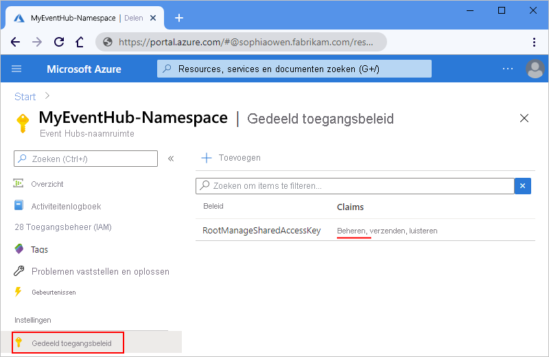
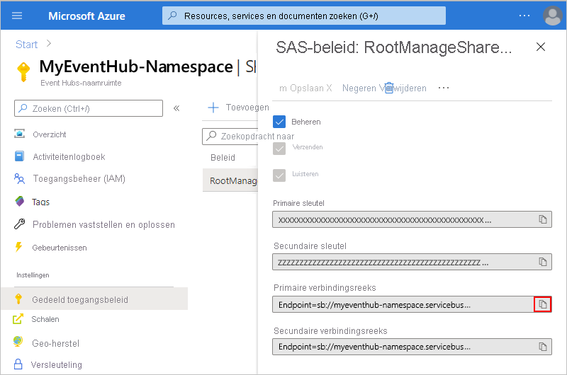
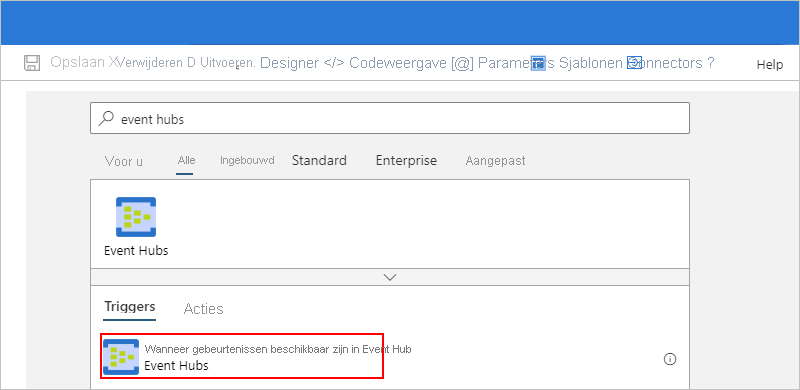
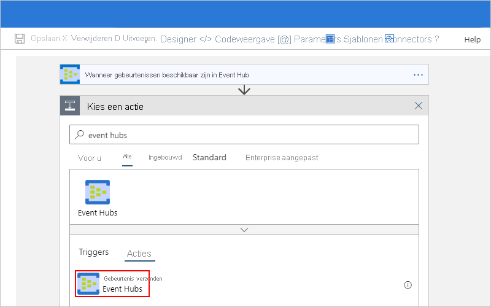
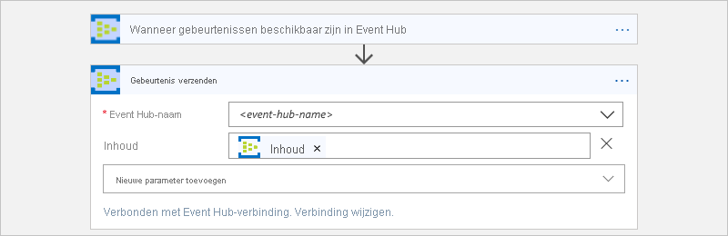
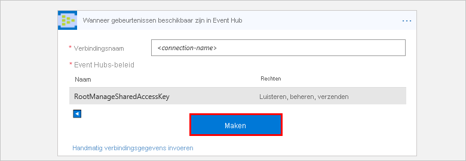

# Gebeurtenissen bewaken, ontvangen en verzenden met Azure Event Hubs en Azure Logic Apps

In dit artikel wordt beschreven hoe u gebeurtenissen die naar [azure Event hubs](../event-hubs/event-hubs-about.md) worden verzonden, kunt bewaken en beheren vanuit een logische app met de Azure Event hubs-connector. Op die manier kunt u logische apps maken waarmee taken en werkstromen worden geautomatiseerd voor het controleren, verzenden en ontvangen van gebeurtenissen vanuit uw Event Hub. Zie de naslag informatie voor [Azure Event hubs-connector](/connectors/eventhubs/)voor connector-specifieke technische gegevens </a> .

## Vereisten

* Een Azure-abonnement. Als u nog geen abonnement op Azure hebt, [registreer u dan nu voor een gratis Azure-account](https://azure.microsoft.com/free/). 

* Een [Azure Event hubs-naam ruimte en Event hub](../event-hubs/event-hubs-create.md)

* De logische app waar u toegang wilt krijgen tot uw event hub. Als u uw logische app wilt starten met een Azure Event Hubs-trigger, hebt u een [lege logische app](../logic-apps/quickstart-create-first-logic-app-workflow.md)nodig.
Als u geen ervaring hebt met Logic apps, raadpleegt u [Wat is Azure Logic apps](../logic-apps/logic-apps-overview.md) en [Quick Start: uw eerste logische app maken](../logic-apps/quickstart-create-first-logic-app-workflow.md).

## Controleer de machtigingen en ontvang connection string

Als u ervoor wilt zorgen dat uw logische app toegang heeft tot uw event hub, controleert u uw machtigingen en haalt u de connection string voor uw Event Hubs naam ruimte op.

1. Meld u aan bij [Azure Portal](https://portal.azure.com).

1. Ga naar uw Event Hubs *naam ruimte*, niet een specifieke Event hub. 

1. Selecteer in het menu naam ruimte onder **instellingen**de optie **beleid voor gedeelde toegang**. Onder **claims**controleert u of u machtigingen voor het **beheren** van die naam ruimte hebt.

   

1. Als u de verbindings gegevens later hand matig wilt invoeren, haalt u de connection string voor uw Event Hubs naam ruimte op.

   1. Kies onder **beleid**de optie **RootManageSharedAccessKey**.

   1. Zoek de connection string van uw primaire sleutel. Kies de knop kopiëren en sla de connection string op voor later gebruik.

      

      > [!TIP]
      > Als u wilt controleren of uw connection string is gekoppeld aan uw Event Hubs naam ruimte of met een specifieke Event Hub, moet u ervoor zorgen dat de connection string geen `EntityPath`   para meter heeft. Als u deze para meter vindt, is het connection string voor een specifieke Event hub-entiteit en is het niet de juiste teken reeks voor gebruik met uw logische app.

1. Ga nu verder met [het toevoegen van een event hubs trigger](#add-trigger) of [het toevoegen van een event hubs actie](#add-action).

## Azure Event Hubs-trigger toevoegen

In Azure Logic Apps moet elke logische app beginnen met een [trigger](../logic-apps/logic-apps-overview.md#logic-app-concepts), die wordt geactiveerd wanneer een bepaalde gebeurtenis plaatsvindt of wanneer aan een bepaalde voor waarde wordt voldaan. Telkens wanneer de trigger wordt geactiveerd, maakt de Logic Apps-Engine een exemplaar van een logische app en begint de werk stroom van uw app uit te voeren.

In dit voor beeld ziet u hoe u een werk stroom van een logische app kunt starten wanneer er nieuwe gebeurtenissen naar uw event hub worden verzonden. 

> [!NOTE]
> Alle Event hub-triggers zijn *lange polling* triggers, wat betekent dat de trigger alle gebeurtenissen verwerkt en vervolgens 30 seconden per partitie wacht om meer gebeurtenissen weer te geven in uw event hub. Dus als de trigger is ingesteld met vier partities, kan deze vertraging tot twee minuten duren voordat de trigger de polling van alle partities heeft voltooid. Als er geen gebeurtenissen binnen deze vertraging worden ontvangen, wordt de trigger wordt uitgevoerd. Anders wordt het lezen van gebeurtenissen voortgezet totdat de Event hub leeg is. De volgende trigger poll wordt uitgevoerd op basis van het terugkeer interval dat u opgeeft in de eigenschappen van de trigger.

1. Maak in de Azure Portal of Visual Studio een lege logische app, waarmee Logic Apps Designer wordt geopend. In dit voor beeld wordt de Azure Portal gebruikt.

1. Voer in het zoekvak ' event hubs ' in als uw filter. Selecteer in de lijst triggers deze trigger: **wanneer gebeurtenissen beschikbaar zijn in Event hub-Event hubs**

   

1. Als u wordt gevraagd om de verbindings gegevens, [maakt u de Event hubs verbinding nu](#create-connection). 

1. Geef in de trigger informatie op over de Event hub die u wilt bewaken. Open de lijst **nieuwe para meter toevoegen** voor meer eigenschappen. Als u een para meter selecteert, wordt die eigenschap toegevoegd aan de trigger kaart.

   

   | Eigenschap | Vereist | Beschrijving |
   |----------|----------|-------------|
   | **Event Hub-naam** | Ja | De naam van de Event hub die u wilt bewaken |
   | **Inhoudstype** | Nee | Het inhouds type van de gebeurtenis. De standaardwaarde is `application/octet-stream`. |
   | **Naam van consumentengroep** | Nee | De [naam van de Event hub-consumenten groep](../event-hubs/event-hubs-features.md#consumer-groups) die moet worden gebruikt voor het lezen van gebeurtenissen. Als niet wordt opgegeven, wordt de standaard Consumer groep gebruikt. |
   | **Maximum aantal gebeurtenissen** | Nee | Het maximum aantal gebeurtenissen. De trigger retourneert tussen één en het aantal gebeurtenissen dat door deze eigenschap is opgegeven. |
   | **Interval** | Ja | Een positief geheel getal dat aangeeft hoe vaak de werk stroom wordt uitgevoerd op basis van de frequentie |
   | **Frequentie** | Ja | De tijds eenheid voor het terugkeer patroon |
   ||||

   **Aanvullende eigenschappen**

   | Eigenschap | Vereist | Beschrijving |
   |----------|----------|-------------|
   | **Inhouds schema** | Nee | Het JSON-inhouds schema voor de gebeurtenissen die moeten worden gelezen vanuit de Event hub. Als u bijvoorbeeld het inhouds schema opgeeft, kunt u de logische app alleen activeren voor de gebeurtenissen die overeenkomen met het schema. |
   | **Minimale partitie sleutel** | Nee | Voer de minimale [partitie](../event-hubs/event-hubs-features.md#partitions) -id in die u wilt lezen. Standaard worden alle partities gelezen. |
   | **Maximum partitie sleutel** | Nee | Voer de maximale [partitie](../event-hubs/event-hubs-features.md#partitions) -id in die u wilt lezen. Standaard worden alle partities gelezen. |
   | **Tijdzone** | Nee | Is alleen van toepassing wanneer u een start tijd opgeeft, omdat deze trigger geen UTC-offset accepteert. Selecteer de tijd zone die u wilt Toep assen. 
Zie [terugkerende taken en werk stromen maken en uitvoeren met Azure Logic apps](../connectors/connectors-native-recurrence.md)voor meer informatie. |
   | **Begintijd** | Nee | Geef een begin tijd op in deze notatie: 
JJJJ-MM-DDTuu: mm: SS als u een tijd zone selecteert
-of-
JJJJ-MM-DDTuu: mm: ssZ als u geen tijd zone selecteert
Zie [terugkerende taken en werk stromen maken en uitvoeren met Azure Logic apps](../connectors/connectors-native-recurrence.md)voor meer informatie. |
   ||||

1. Wanneer u klaar bent, kiest u **Opslaan**op de werk balk van de ontwerp functie.

1. Ga nu verder met het toevoegen van een of meer acties aan uw logische app voor de taken die u wilt uitvoeren met de trigger resultaten. 

   Als u bijvoorbeeld gebeurtenissen wilt filteren op basis van een specifieke waarde, zoals een categorie, kunt u een voor waarde toevoegen zodat de actie **gebeurtenis verzenden** alleen de gebeurtenissen verzendt die aan uw voor waarde voldoen. 

## Azure Event Hubs actie toevoegen

In Azure Logic Apps is een [actie](../logic-apps/logic-apps-overview.md#logic-app-concepts) een stap in uw werk stroom die volgt op een trigger of een andere actie. Voor dit voor beeld begint de logische app met een Event Hubs trigger waarmee wordt gecontroleerd op nieuwe gebeurtenissen in uw event hub.

1. Open in de Azure Portal of Visual Studio uw logische app in Logic Apps Designer. In dit voor beeld wordt de Azure Portal gebruikt.

1. Kies **nieuwe stap**onder de trigger of actie.

   Als u een actie wilt toevoegen tussen de bestaande stappen, plaatst u de muis aanwijzer op de verbindings pijl. 
   Kies het plus teken ( **+** ) dat wordt weer gegeven en selecteer vervolgens **een actie toevoegen**.

1. Voer in het zoekvak ' event hubs ' in als uw filter.
Selecteer in de lijst acties deze actie: **gebeurtenis verzenden-Event hubs**

   

1. Als u wordt gevraagd om de verbindings gegevens, [maakt u de Event hubs verbinding nu](#create-connection). 

1. Geef in de actie informatie op over de gebeurtenissen die u wilt verzenden. Open de lijst **nieuwe para meter toevoegen** voor meer eigenschappen. Als u een para meter selecteert, wordt deze eigenschap aan de actie kaart toegevoegd.

   

   | Eigenschap | Vereist | Beschrijving |
   |----------|----------|-------------|
   | **Event Hub-naam** | Ja | De Event hub waarnaar u de gebeurtenis wilt verzenden |
   | **Inhoud** | Nee | De inhoud voor de gebeurtenis die u wilt verzenden |
   | **Eigenschappen** | Nee | De app-eigenschappen en-waarden die moeten worden verzonden |
   | **Partitiesleutel** | Nee | De [partitie](../event-hubs/event-hubs-features.md#partitions) -id voor het verzenden van de gebeurtenis |
   ||||

   U kunt bijvoorbeeld de uitvoer van uw Event Hubs trigger naar een andere Event hub verzenden:

   

1. Wanneer u klaar bent, kiest u **Opslaan**op de werk balk van de ontwerp functie.

## Verbinding maken met uw event hub

[!INCLUDE [Create connection general intro](../../includes/connectors-create-connection-general-intro.md)] 

1. Wanneer u wordt gevraagd om de verbindings gegevens, geeft u de volgende gegevens op:

   | Eigenschap | Vereist | Waarde | Beschrijving |
   |----------|----------|-------|-------------|
   | **Verbindingsnaam** | Ja | <*verbindings naam*> | De naam die voor uw verbinding moet worden gemaakt |
   | **Event Hubs naam ruimte** | Ja | <*gebeurtenis-hubs-naam ruimte*> | Selecteer de Event Hubs naam ruimte die u wilt gebruiken. |
   |||||  

   Bijvoorbeeld:

   

   Als u de connection string hand matig wilt invoeren, selecteert u **hand matig verbindings gegevens invoeren**. 
   Meer informatie [over het vinden van uw Connection String](#permissions-connection-string).

2. Selecteer het Event Hubs-beleid dat u wilt gebruiken, als dit nog niet is geselecteerd. Kies **Maken**.

   

3. Nadat u de verbinding hebt gemaakt, gaat u door met [Event hubs trigger toevoegen](#add-trigger) of [Event hubs actie toevoegen](#add-action).

## Connector-verwijzing

Zie de [referentie pagina van de connector](/connectors/eventhubs/)voor technische details, zoals triggers, acties en limieten, zoals beschreven in het Swagger-bestand van de connector.

> [!NOTE]
> Voor Logic apps in een [Integration service Environment (ISE)](../logic-apps/connect-virtual-network-vnet-isolated-environment-overview.md), maakt de ISE-versie van deze connector gebruik van de [ISE-bericht limieten](../logic-apps/logic-apps-limits-and-config.md#message-size-limits) in plaats daarvan.

## Volgende stappen

* Meer informatie over andere [Logic apps-connectors](../connectors/apis-list.md)
