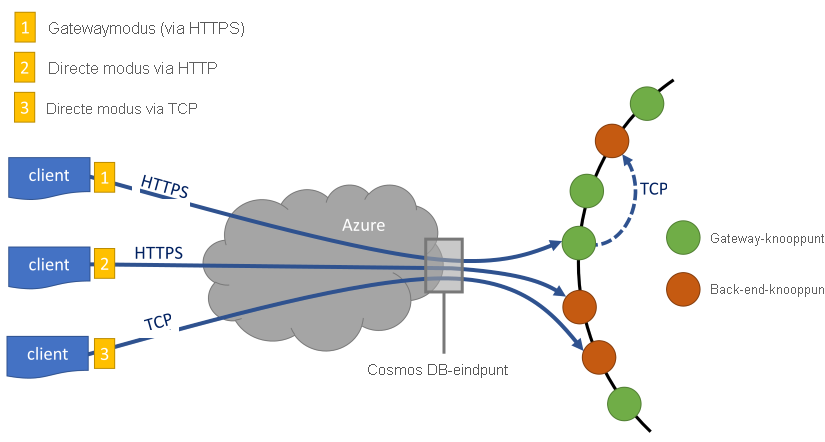
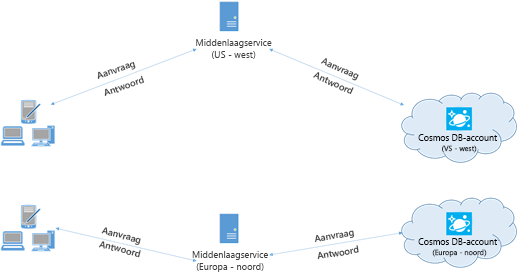

# <a name="performance-tips-for-azure-cosmos-db-and-net"></a>Tips voor betere prestaties voor Azure Cosmos DB en .NET

> [!div class="op_single_selector"]
> * [Async Java](performance-tips-async-java.md)
> * [Java](performance-tips-java.md)
> * [.NET](performance-tips.md)
> 

Azure Cosmos DB is een snelle en flexibele gedistribueerde data base die naadloos kan worden geschaald met gegarandeerde latentie en door voer. U hoeft geen grote architectuur wijzigingen aan te brengen of complexe code te schrijven om uw data base te schalen met Azure Cosmos DB. Omhoog en omlaag schalen is net zo eenvoudig als het maken van één API-aanroep. Zie voor meer informatie [over het inrichten van container doorvoer](how-to-provision-container-throughput.md) of [het inrichten van de doorvoer capaciteit van de data base](how-to-provision-database-throughput.md). Omdat Azure Cosmos DB echter via netwerk aanroepen wordt geopend, zijn er optimalisaties aan de client zijde die u kunt uitvoeren om de prestaties van de [SQL .NET SDK](sql-api-sdk-dotnet-standard.md)te verbeteren.

Als u daarom vraagt hoe u de prestaties van mijn Data Base kunt verbeteren? Houd rekening met de volgende opties:

## <a name="hosting-recommendations"></a>Aanbevelingen hosten

1.  **Gebruik Windows 64-bits in plaats van Linux of Windows 32 host processing voor query-intensieve werk belastingen.**

    Windows 64-bits host verwerking wordt aanbevolen voor betere prestaties. De SQL SDK bevat een systeem eigen ServiceInterop. dll om query's lokaal te parseren en te optimaliseren, en wordt alleen ondersteund op het Windows x64-platform. Voor Linux en andere niet-ondersteunde platforms waarbij het ServiceInterop. dll-bestand niet beschikbaar is, wordt er een extra netwerk aanroep naar de gateway uitgevoerd om de geoptimaliseerde query te verkrijgen. De volgende typen toepassingen hebben een 32-bits hostproces als standaard, dus als u deze wilt wijzigen in 64-bits, voert u deze stappen uit op basis van het type van uw toepassing:

    - Voor uitvoer bare toepassingen kunt u dit doen door het [platform doel](https://docs.microsoft.com/visualstudio/ide/how-to-configure-projects-to-target-platforms?view=vs-2019) in te stellen op **x64** in het venster **project eigenschappen** op het tabblad **opbouwen** .

    - Voor test projecten op basis van VSTest kunt u dit doen door **test** instellingen te selecteren->**tests**->**standaard processor architectuur als x64**uit te voeren in de menu optie van **Visual Studio test** .

    - Voor lokaal geïmplementeerde ASP.NET-webtoepassingen kunt u dit doen door de **64-bits versie van IIS Express voor websites en projecten**te controleren, onder **extra**->**opties**->**projecten en oplossingen**->- **webprojecten**.

    - Voor ASP.NET-webtoepassingen die zijn geïmplementeerd op Azure, kunt u dit doen door het **platform als 64-bit** te kiezen in de **Toepassings instellingen** op de Azure Portal.

    > [!NOTE] 
    > Visual Studio gebruikt standaard nieuwe projecten voor elke CPU. Het is raadzaam om het project in te stellen op x64 om te voor komen dat het wordt overgeschakeld naar x86. Elk CPU-project kan eenvoudig overschakelen naar x86 als een afhankelijkheid wordt toegevoegd die alleen x86 is.<br/>
    > ServiceInterop. dll moet zich in dezelfde map bevindt als de SDK-dll wordt uitgevoerd vanaf. U moet dit alleen doen voor gebruikers die hand matig omgaan-dll's hebben of aangepaste build/Deployment-systemen hebben.
    
2. **Garbage Collection aan de server zijde inschakelen (GC)**

    Het verminderen van de frequentie van garbagecollection kan in sommige gevallen helpen. Stel in .NET [gcServer](https://msdn.microsoft.com/library/ms229357.aspx) in op waar.

3. **Uw client opschalen-workload**

    Als u test met hoge doorvoer niveaus (> 50.000 RU/s), kan de client toepassing het knel punt worden als gevolg van de machine die op CPU-of netwerk gebruik uitvalt. Als u dit punt bereikt, kunt u het Azure Cosmos DB-account nog verder pushen door uw client toepassingen op meerdere servers te schalen.

    > [!NOTE] 
    > Hoog CPU-gebruik kan leiden tot grotere latentie en time-outuitzonderingen voor aanvragen.

## <a name="networking"></a>Netwerken
<a id="direct-connection"></a>

1. **Verbindings beleid: modus directe verbinding gebruiken**

    Hoe een client verbinding maakt met Azure Cosmos DB is belangrijk voor de prestaties, in het bijzonder wat betreft de latentie aan de clientzijde. Er zijn twee belang rijke configuratie-instellingen beschikbaar voor het configureren van het beleid voor client verbindingen: de verbindings *modus* en het verbindings *protocol*.  De twee beschik bare modi zijn:

   * Gateway modus
      
     De gateway modus wordt op alle SDK-platforms ondersteund en is de geconfigureerde standaard instelling voor de [SDK van micro soft. Azure. DocumentDB](sql-api-sdk-dotnet.md). Als uw toepassing wordt uitgevoerd in een bedrijfs netwerk met strikte firewall beperkingen, is de gateway modus de beste keuze, omdat deze gebruikmaakt van de standaard HTTPS-poort en een enkel eind punt. De verhoudingen van de prestaties zijn echter wel dat de gateway modus een extra netwerk-hop omvat elke keer dat gegevens worden gelezen of geschreven naar Azure Cosmos DB. Als gevolg hiervan biedt de directe modus betere prestaties vanwege minder netwerk-hops. De modus gateway verbinding wordt ook aanbevolen wanneer u toepassingen uitvoert in omgevingen met een beperkt aantal socket verbindingen. 

     Wanneer u de SDK gebruikt in Azure Functions, met name in het [verbruiks abonnement](../azure-functions/functions-scale.md#consumption-plan), moet u mindful van de huidige [limieten in verbindingen](../azure-functions/manage-connections.md). In dat geval kan de gateway modus worden aanbevolen als u ook werkt met andere HTTP-clients binnen uw Azure Functions-toepassing.

   * Directe modus

     Directe modus ondersteunt connectiviteit via TCP-protocol en is de standaard connectiviteits modus als u [micro soft. Azure. Cosmos/.net v3 SDK](sql-api-sdk-dotnet-standard.md)gebruikt.

     Bij gebruik van de gateway modus maakt Cosmos DB gebruik van poort 443 en poorten 10250, 10255 en 10256 wanneer u de API van Azure Cosmos DB gebruikt voor MongoDB. De 10250-poort is gekoppeld aan een standaard MongoDB-instantie zonder geo-replicatie en 10255/10256-poorten zijn gekoppeld aan het MongoDB-exemplaar met geo-replicatie functionaliteit. Wanneer u TCP in directe modus gebruikt, moet u, naast de gateway poorten, ervoor zorgen dat het poort bereik tussen 10000 en 20000 open is, omdat Azure Cosmos DB dynamische TCP-poorten gebruikt. Als deze poorten niet zijn geopend en u TCP probeert te gebruiken, ontvangt u een fout melding dat de 503-Service niet beschikbaar is. De volgende tabel toont de connectiviteits modi die beschikbaar zijn voor verschillende Api's en de gebruiker van de service poorten voor elke API:

     |Verbindings modus  |Ondersteund protocol  |Ondersteunde Sdk's  |API/service poort  |
     |---------|---------|---------|---------|
     |Gateway  |   HTTPS    |  Alle SDK'S    |   SQL(443), Mongo(10250, 10255, 10256), Table(443), Cassandra(10350), Graph(443)    |
     |Direct    |     TCP    |  .NET SDK    | Poorten binnen 10000-20000-bereik |

     Azure Cosmos DB biedt een eenvoudig en open REST-programmeer model via HTTPS. Daarnaast biedt het een efficiënt TCP-protocol, dat ook wordt doorzocht in het communicatie model en dat beschikbaar is via de .NET-client-SDK. TCP-protocol gebruikt SSL voor initiële verificatie en het versleutelen van verkeer. Gebruik, indien mogelijk, het TCP-protocol voor de beste prestaties.

     Voor SDK V3 wordt de connectiviteits modus geconfigureerd tijdens het maken van het CosmosClient-exemplaar als onderdeel van de CosmosClientOptions moet u er rekening mee houden dat de directe modus de standaard instelling is.

     ```csharp
     var serviceEndpoint = new Uri("https://contoso.documents.net");
     var authKey = "your authKey from the Azure portal";
     CosmosClient client = new CosmosClient(serviceEndpoint, authKey,
     new CosmosClientOptions
     {
        ConnectionMode = ConnectionMode.Gateway // ConnectionMode.Direct is the default
     });
     ```

     Voor de micro soft. Azure. DocumentDB SDK wordt de connectiviteits modus geconfigureerd tijdens de constructie van het DocumentClient-exemplaar met de para meter Connection Policy. Als de directe modus wordt gebruikt, kan het protocol ook worden ingesteld binnen de para meter Connection Policy.

     ```csharp
     var serviceEndpoint = new Uri("https://contoso.documents.net");
     var authKey = "your authKey from the Azure portal";
     DocumentClient client = new DocumentClient(serviceEndpoint, authKey,
     new ConnectionPolicy
     {
        ConnectionMode = ConnectionMode.Direct, //ConnectionMode.Gateway is the default
        ConnectionProtocol = Protocol.Tcp
     });
     ```

     Omdat TCP alleen wordt ondersteund in de directe modus, wordt het HTTPS-protocol gebruikt om te communiceren met de gateway en de protocol waarde in het Connection Policy wordt genegeerd als de gateway modus wordt gebruikt.

     

2. **Open async aanroepen om opstart latentie bij eerste aanvraag te voor komen**

    De eerste aanvraag heeft standaard een hogere latentie omdat de routerings tabel van het adres moet worden opgehaald. Wanneer u de [SDK v2](sql-api-sdk-dotnet.md)gebruikt om deze opstart latentie bij de eerste aanvraag te vermijden, moet u openasync () eenmaal tijdens de initialisatie aanroepen als volgt.

        await client.OpenAsync();

    > [!NOTE] 
    > Bij de methode openasync worden aanvragen gegenereerd voor het verkrijgen van de routerings tabel van het adres voor alle containers in het account. Voor accounts met veel containers, maar de toepassing daarvan een subset hiervan, zou er een onnodige hoeveelheid verkeer worden gegenereerd waardoor de initialisatie traag wordt. Het is dus mogelijk dat de methode openasync niet nuttig is in dit scenario, omdat het opstarten van toepassingen wordt vertraagd.

   <a id="same-region"></a>
3. **Termijnen-clients in dezelfde Azure-regio voor prestaties**

    Als dat mogelijk is, plaatst u toepassingen die Azure Cosmos DB aanroepen, in dezelfde regio als de Azure Cosmos-data base. Voor een benadering van een vergelijking worden de aanroepen naar Azure Cosmos DB binnen dezelfde regio binnen 1-2 MS uitgevoerd, maar de latentie tussen de West-en Oost kust van de VS is > 50 MS. Deze latentie kan waarschijnlijk variëren van aanvraag om aan te vragen, afhankelijk van de route die door de aanvraag wordt door gegeven aan de limiet van de client naar de grens van het Azure-Data Center. De laagst mogelijke latentie wordt bereikt door ervoor te zorgen dat de aanroepende toepassing zich in dezelfde Azure-regio bevindt als het ingerichte Azure Cosmos DB-eind punt. Zie [Azure-regio's](https://azure.microsoft.com/regions/#services)voor een lijst met beschik bare regio's.

    
   <a id="increase-threads"></a>

4. **Aantal threads/taken verhogen**

    Omdat aanroepen naar Azure Cosmos DB via het netwerk worden gemaakt, moet u mogelijk de mate van parallellisme van uw aanvragen variëren, zodat de client toepassing zeer weinig tijd nodig heeft om te wachten tussen aanvragen. Als u bijvoorbeeld gebruikt. De [parallelle bibliotheek](https://msdn.microsoft.com//library/dd460717.aspx)van de taak van het net maakt u in de volg orde van de taken die worden gelezen of geschreven naar Azure Cosmos db.

5. **Versneld netwerken inschakelen**

   Om latentie en CPU-jitter te verminderen, wordt aangeraden de virtuele machines van de client versneld netwerken in te scha kelen. Zie het artikel [een virtuele Windows-machine maken met versneld netwerken](../virtual-network/create-vm-accelerated-networking-powershell.md) of [een virtuele Linux-machine maken met versneld netwerken](../virtual-network/create-vm-accelerated-networking-cli.md) artikelen om versneld netwerken in te scha kelen.


## <a name="sdk-usage"></a>SDK-gebruik
1. **De meest recente SDK installeren**

    De Azure Cosmos DB Sdk's worden voortdurend verbeterd om de beste prestaties te leveren. Raadpleeg de [Azure Cosmos DB SDK](sql-api-sdk-dotnet-standard.md) -pagina's om de meest recente SDK te bepalen en verbeteringen te bekijken.

2. **Stream-Api's gebruiken**

    De [.NET SDK v3](sql-api-sdk-dotnet-standard.md) bevat stream-api's die gegevens kunnen ontvangen en retour neren zonder serialisatie. 

    De toepassingen in de middelste laag die niet rechtstreeks gebruikmaken van de reacties van de SDK, maar door sturen naar andere toepassings lagen, kunnen profiteren van de stream-Api's. Zie de voor beelden van [artikel beheer](https://github.com/Azure/azure-cosmos-dotnet-v3/blob/master/Microsoft.Azure.Cosmos.Samples/Usage/ItemManagement) voor voor beeld van stroom verwerking.

3. **Een singleton Azure Cosmos DB-client gebruiken voor de levens duur van uw toepassing**

    Elk DocumentClient-en CosmosClient-exemplaar is thread-safe en voert efficiënt verbindings beheer en adres caching uit wanneer deze in de directe modus worden uitgevoerd. Als u efficiënt verbindings beheer en betere prestaties wilt toestaan door de SDK-client, wordt u aangeraden één exemplaar per AppDomain te gebruiken voor de levens duur van de toepassing.

   <a id="max-connection"></a>

4. **System.Net MaxConnections per host verg Roten met de gateway modus**

    Azure Cosmos DB aanvragen worden gedaan via HTTPS/REST wanneer de gateway modus wordt gebruikt, en deze worden onderhevig aan de standaard verbindings limiet per hostnaam of IP-adres. Mogelijk moet u het MaxConnections instellen op een hogere waarde (100-1000) zodat de client bibliotheek meerdere gelijktijdige verbindingen met Azure Cosmos DB kan gebruiken. In de .NET SDK 1.8.0 en hoger is de standaard waarde voor [ServicePointManager. DefaultConnectionLimit](https://msdn.microsoft.com/library/system.net.servicepointmanager.defaultconnectionlimit.aspx) 50 en u kunt de waarde wijzigen door de [documenten. client. Connection Policy. MaxConnectionLimit](https://msdn.microsoft.com/library/azure/microsoft.azure.documents.client.connectionpolicy.maxconnectionlimit.aspx) in te stellen op een hogere waarde.

5. **Parallelle query's voor gepartitioneerde verzamelingen afstemmen**

     De SQL .NET SDK-versie 1.9.0 en hoger ondersteunen parallelle query's, waarmee u een gepartitioneerde verzameling parallel kunt doorzoeken. Zie [code voorbeelden](https://github.com/Azure/azure-documentdb-dotnet/blob/master/samples/code-samples/Queries/Program.cs) met betrekking tot het werken met de sdk's voor meer informatie. Parallelle query's zijn ontworpen om de latentie en door Voer van query's te verbeteren ten opzichte van hun serieel equivalent. Parallelle query's bieden twee para meters die gebruikers kunnen afstemmen op hun vereisten, (a) MaxDegreeOfParallelism: om het maximum aantal partities te beheren, kan een query parallel worden uitgevoerd en (b) MaxBufferedItemCount: om het aantal vooraf opgehaalde resultaten.

    (a) ***afstemmings graad van parallelle uitvoering\:*** parallelle query werkt door meerdere partities parallel te doorzoeken. Gegevens uit een afzonderlijke partitie worden echter serieel opgehaald ten opzichte van de query. Als u de `MaxDegreeOfParallelism` in [SDK v2](sql-api-sdk-dotnet.md) of `MaxConcurrency` in [SDK v3](sql-api-sdk-dotnet-standard.md) instelt op het aantal partities, is de maximale kans op het bereiken van de meest uitvoerende query, op voor waarde dat alle andere systeem omstandigheden hetzelfde blijven. Als u het aantal partities niet weet, kunt u de mate van parallelle uitvoering instellen op een hoog nummer, en het systeem kiest het minimum (aantal partities, door de gebruiker opgegeven invoer) als de mate van parallelle uitvoering.

    Het is belang rijk te weten dat parallelle query's de beste voor delen opleveren als de gegevens gelijkmatig worden verdeeld over alle partities met betrekking tot de query. Als de gepartitioneerde verzameling zodanig is gepartitioneerd dat alle of een meerderheid van de gegevens die door een query zijn geretourneerd, in een paar partities is geconcentreerd (één partitie in het ergste geval), wordt de prestaties van de query door deze partities beïnvloed.

    (b) ***tuning MaxBufferedItemCount\:*** parallel query is ontworpen om de resultaten vooraf op te halen terwijl de huidige batch met resultaten door de client wordt verwerkt. Het vooraf ophalen helpt bij de algehele latentie verbetering van een query. MaxBufferedItemCount is de para meter om het aantal vooraf opgehaalde resultaten te beperken. Als u MaxBufferedItemCount instelt op het verwachte aantal geretourneerde resultaten (of een hoger getal), kan de query het maximale voor deel ontvangen van vooraf ophalen.

    Het vooraf ophalen van werkt op dezelfde manier, ongeacht de mate van parallellisme, en er is één buffer voor de gegevens van alle partities.  

6. **Uitstel implementeren met RetryAfter-intervallen**

    Tijdens prestatie tests moet u de belasting verg Roten tot een klein aantal aanvragen wordt beperkt. Als deze beperking is ingesteld, moet de client toepassing uitstel op een vertraging voor het door de server opgegeven interval voor nieuwe pogingen. Door de uitstel te respecteren, zorgt u ervoor dat u de minimale hoeveelheid tijd die wacht tussen nieuwe pogingen. Ondersteuning voor het beleid voor opnieuw proberen is opgenomen in versie 1.8.0 en hoger van de SQL [.net](sql-api-sdk-dotnet.md) en [Java](sql-api-sdk-java.md), versie 1.9.0 en hoger van het [node. js](sql-api-sdk-node.md) en [python](sql-api-sdk-python.md), en alle ondersteunde versies van de [.net core](sql-api-sdk-dotnet-core.md) sdk's. Voor meer informatie, [RetryAfter](https://msdn.microsoft.com/library/microsoft.azure.documents.documentclientexception.retryafter.aspx).
    
    Met versie 1,19 en hoger van de .NET SDK is er een mechanisme voor het vastleggen van aanvullende diagnostische gegevens en het oplossen van latentie problemen, zoals wordt weer gegeven in het volgende voor beeld. U kunt de diagnostische teken reeks registreren voor aanvragen met een hogere lees latentie. De vastgelegde diagnostische teken reeks helpt u inzicht te krijgen in het aantal keren dat u 429s voor een bepaalde aanvraag hebt geobserveerd.
    ```csharp
    ResourceResponse<Document> readDocument = await this.readClient.ReadDocumentAsync(oldDocuments[i].SelfLink);
    readDocument.RequestDiagnosticsString 
    ```

7. **Document-Uri's in cache opslaan voor minder lees latentie**

    Cache waar mogelijk document-Uri's voor de beste Lees prestaties. U moet logica definiëren om de resource-ID in de cache op te slaan wanneer u de resource maakt. Zoek opdrachten op basis van resource-id's zijn sneller dan zoek acties op basis van namen, zodat de prestaties worden verbeterd in de cache. 

   <a id="tune-page-size"></a>
8. **De pagina grootte voor query's/feeds voor betere prestaties afstemmen**

   Bij het uitvoeren van een bulk Lees bewerking van documenten met behulp van de functie voor lees bewerkingen (bijvoorbeeld ReadDocumentFeedAsync) of bij het uitgeven van een SQL-query, worden de resultaten op een gesegmenteerde manier geretourneerd als de resultatenset te groot is. Standaard worden resultaten geretourneerd in delen van 100 items of 1 MB, waarbij de limiet eerst wordt bereikt.

   Om het aantal netwerk round trips te verminderen dat vereist is om alle toepasselijke resultaten op te halen, kunt u de pagina grootte verg Roten met de aanvraag header [x-MS-Max-item-Count](https://docs.microsoft.com/rest/api/cosmos-db/common-cosmosdb-rest-request-headers) tot 1000. In gevallen waarin u slechts enkele resultaten wilt weer geven, bijvoorbeeld als uw gebruikers interface of toepassings-API slechts tien resultaten per keer retourneert, kunt u ook de pagina grootte verkleinen tot 10 om de door Voer voor lees bewerkingen en query's te verminderen.

   > [!NOTE] 
   > De eigenschap maxItemCount mag niet alleen worden gebruikt voor het pagineren. Het is de belangrijkste manier om de prestaties van query's te verbeteren door het maximum aantal geretourneerde items op één pagina te verminderen.  

   U kunt ook de pagina grootte instellen met behulp van de beschik bare Azure Cosmos DB Sdk's. Met de eigenschap [MaxItemCount](/dotnet/api/microsoft.azure.documents.client.feedoptions.maxitemcount?view=azure-dotnet) in FeedOptions kunt u het maximum aantal items instellen dat in de opsommings bewerking moet worden geretourneerd. Als `maxItemCount` is ingesteld op-1, zoekt de SDK automatisch de meest optimale waarde, afhankelijk van de grootte van het document. Bijvoorbeeld:
    
   ```csharp
    IQueryable<dynamic> authorResults = client.CreateDocumentQuery(documentCollection.SelfLink, "SELECT p.Author FROM Pages p WHERE p.Title = 'About Seattle'", new FeedOptions { MaxItemCount = 1000 });
   ```
    
   Wanneer een query wordt uitgevoerd, worden de resulterende gegevens verzonden binnen een TCP-pakket. Als u een te lage waarde voor `maxItemCount`opgeeft, is het aantal trips dat nodig is voor het verzenden van de gegevens in het TCP-pakket hoog. Dit is van invloed op de prestaties. Als u niet zeker weet welke waarde voor `maxItemCount` eigenschap moet worden ingesteld, kunt u deze het beste instellen op-1 en de SDK de standaard waarde laten kiezen. 

9. **Aantal threads/taken verhogen**

    Zie het [aantal threads/taken](#increase-threads) in de sectie netwerken verg Roten.

## <a name="indexing-policy"></a>Indexeringsbeleid
 
1. **Niet-gebruikte paden uitsluiten van indexering voor snellere schrijfbewerkingen**

    Met het indexerings beleid van Cosmos DB kunt u ook opgeven welke document paden moeten worden opgenomen of uitgesloten van indexeren door gebruik te maken van indexerings paden (IndexingPolicy. IncludedPaths en IndexingPolicy. ExcludedPaths). Het gebruik van indexerings paden biedt verbeterde schrijf prestaties en een lagere index opslag voor scenario's waarin de query patronen vooraf bekend zijn, aangezien index kosten direct worden gecorreleerd aan het aantal unieke paden dat is geïndexeerd.  De volgende code laat bijvoorbeeld zien hoe u een volledige sectie van de documenten (een substructuur) kunt uitsluiten van indexering met behulp van het Joker teken ' * '.

    ```csharp
    var collection = new DocumentCollection { Id = "excludedPathCollection" };
    collection.IndexingPolicy.IncludedPaths.Add(new IncludedPath { Path = "/*" });
    collection.IndexingPolicy.ExcludedPaths.Add(new ExcludedPath { Path = "/nonIndexedContent/*");
    collection = await client.CreateDocumentCollectionAsync(UriFactory.CreateDatabaseUri("db"), excluded);
    ```

    Zie [Azure Cosmos DB Indexing policies](index-policy.md)(Engelstalig) voor meer informatie.

## <a name="throughput"></a>Doorvoer
<a id="measure-rus"></a>

1. **Meten en afstemmen voor lagere aanvraag eenheden/tweede gebruik**

    Azure Cosmos DB biedt een uitgebreide set database bewerkingen, waaronder relationele en hiërarchische query's met Udf's, opgeslagen procedures en triggers, die allemaal op de documenten in een database verzameling worden uitgevoerd. De kosten die gepaard gaan met elke bewerking hangen af van de CPU, de IO en het geheugen, vereist om de bewerking uit te voeren. In plaats van te denken over en het beheren van hardwarebronnen, kunt u een aanvraag eenheid (RU) beschouwen als een enkele maat eenheid voor de resources die nodig zijn om verschillende database bewerkingen uit te voeren en een toepassings aanvraag te onderhouden.

    De door Voer is ingericht op basis van het aantal ingestelde [aanvraag eenheden](request-units.md) voor elke container. Het verbruik van de aanvraag eenheid wordt geëvalueerd als een rente per seconde. Toepassingen die het aantal ingerichte aanvraag eenheden voor hun container overschrijden, zijn beperkt tot het aantal onder het ingerichte niveau voor de container daalt. Als voor uw toepassing een hogere door Voer is vereist, kunt u de door Voer verhogen door extra aanvraag eenheden in te richten. 

    De complexiteit van een query is van invloed op het aantal aanvraag eenheden dat voor een bewerking wordt verbruikt. Het aantal predikaten, de aard van de predikaten, het aantal Udf's en de grootte van de bron gegevens sets beïnvloeden de kosten van de query bewerkingen.

    Als u de overhead van een bewerking (maken, bijwerken of verwijderen) wilt meten, inspecteert u de [x-MS-Request-](https://docs.microsoft.com/rest/api/cosmos-db/common-cosmosdb-rest-response-headers) factuurkop (of de equivalente eigenschap RequestCharge in ResourceResponse\<t > of FeedResponse\<t > in de .NET SDK) om het aantal aanvraag eenheden te meten dat door deze bewerkingen wordt verbruikt.

    ```csharp
    // Measure the performance (request units) of writes
    ResourceResponse<Document> response = await client.CreateDocumentAsync(collectionSelfLink, myDocument);
    Console.WriteLine("Insert of document consumed {0} request units", response.RequestCharge);
    // Measure the performance (request units) of queries
    IDocumentQuery<dynamic> queryable = client.CreateDocumentQuery(collectionSelfLink, queryString).AsDocumentQuery();
    while (queryable.HasMoreResults)
         {
              FeedResponse<dynamic> queryResponse = await queryable.ExecuteNextAsync<dynamic>();
              Console.WriteLine("Query batch consumed {0} request units", queryResponse.RequestCharge);
         }
    ```             

    De aanvraag kosten die in deze header worden geretourneerd, zijn een fractie van uw ingerichte door Voer (bijvoorbeeld 2000 RUs/seconde). Als de voor gaande query bijvoorbeeld 1000 1 KB-documenten retourneert, zijn de kosten van de bewerking 1000. Binnen één seconde voldoet de server slechts twee aanvragen voordat de volgende aanvragen worden beperkt. Zie [aanvraag eenheden](request-units.md) en de [reken eenheid voor aanvragen](https://www.documentdb.com/capacityplanner)voor meer informatie.
<a id="429"></a>
2. **Aantal verwerkings frequenties/aanvragen afhandelen te groot**

    Wanneer een client de gereserveerde door Voer voor een account probeert te overschrijden, is er geen prestatie vermindering op de server en wordt er geen gebruik van de doorvoer capaciteit meer dan het gereserveerde niveau. De-server preventief de aanvraag met RequestRateTooLarge (HTTP-status code 429) beëindigen en retourneert de header [x-MS-after-MS](https://docs.microsoft.com/rest/api/cosmos-db/common-cosmosdb-rest-response-headers) , waarmee de hoeveelheid tijd in milliseconden wordt aangegeven dat de gebruiker moet wachten voordat de aanvraag opnieuw wordt geprobeerd.

        HTTP Status 429,
        Status Line: RequestRateTooLarge
        x-ms-retry-after-ms :100

    De Sdk's ondervangen dit antwoord impliciet, respecteert de door de server opgegeven nieuwe poging na de header en voert de aanvraag opnieuw uit. Tenzij uw account gelijktijdig wordt geopend door meerdere clients, zal de volgende poging slagen.

    Als u meer dan één client cumulatief op dezelfde manier hebt uitgevoerd, is het standaard aantal nieuwe pogingen dat momenteel is ingesteld op 9 intern door de client mogelijk niet voldoende. in dit geval genereert de client een DocumentClientException met de status code 429 naar de toepassing. Het standaard aantal nieuwe pogingen kan worden gewijzigd door de RetryOptions in te stellen voor het Connection Policy-exemplaar. Standaard wordt de DocumentClientException met de status code 429 geretourneerd na een cumulatieve wacht tijd van 30 seconden als de aanvraag boven het aanvraag aantal blijft. Dit gebeurt zelfs wanneer het huidige aantal nieuwe pogingen kleiner is dan het maximum aantal nieuwe pogingen. Dit is de standaard waarde van 9 of een door de gebruiker gedefinieerd getal.

    Hoewel het gedrag voor automatische pogingen helpt om de flexibiliteit en bruikbaarheid voor de meeste toepassingen te verbeteren, is het mogelijk om conflicteert bij het uitvoeren van benchmarks voor prestaties, met name bij het meten van latentie.  De door de client waargenomen latentie krijgt een waarschuwing als het experiment de server beperking bereikt en zorgt ervoor dat de client-SDK op de achtergrond opnieuw probeert. Om latentie pieken te voor komen tijdens prestatie experimenten, meet u de kosten die worden geretourneerd door elke bewerking en zorgt u ervoor dat aanvragen onder het gereserveerde aanvraag tarief vallen. Zie [aanvraag eenheden](request-units.md)voor meer informatie.
3. **Ontwerpen voor kleinere documenten voor een hogere door Voer**

    De aanvraag kosten (d.w.z. kosten voor aanvraag verwerking) van een bepaalde bewerking worden rechtstreeks gecorreleerd aan de grootte van het document. Bewerkingen voor grote documenten kosten meer dan bewerkingen voor kleine documenten.

## <a name="next-steps"></a>Volgende stappen
Zie [prestaties en schalen testen met Azure Cosmos DB](performance-testing.md)voor een voorbeeld toepassing die wordt gebruikt om Azure Cosmos DB te evalueren voor scenario's met hoge prestaties op een aantal client computers.

Zie [partitioneren en schalen in azure Cosmos DB](partition-data.md)voor meer informatie over het ontwerpen van uw toepassing voor schaal baarheid en hoge prestaties.
