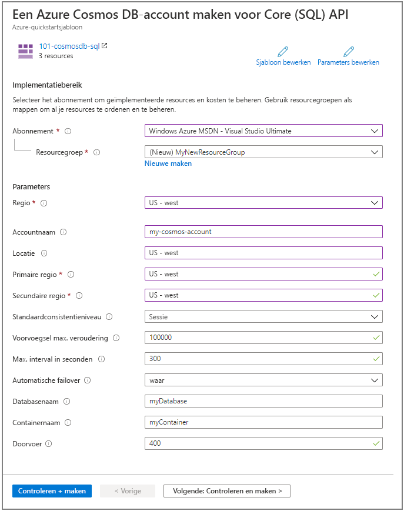

# <a name="quickstart-create-an-azure-cosmos-db-and-a-container-by-using-azure-resource-manager-template"></a>Snelstartgids: een Azure Cosmos DB en een container maken met behulp van Azure Resource Manager sjabloon

Azure Cosmos DB is de wereldwijd gedistribueerde multimodel-databaseservice van Microsoft. U kunt Azure Cosmos DB gebruiken om snel sleutel/waarde-data bases, document databases en grafiek databases te maken en op te vragen. Deze Snelstartgids is gericht op het proces van het implementeren van een resource manager-sjabloon voor het maken van een Azure Cosmos-data base en een container in die data base. U kunt later gegevens opslaan in deze container.

[!INCLUDE [About Azure Resource Manager](../../includes/resource-manager-quickstart-introduction.md)]

Als u nog geen abonnement op Azure hebt, maak dan een [gratis account](https://azure.microsoft.com/free/?WT.mc_id=A261C142F) aan voordat u begint.

## <a name="prerequisites"></a>Vereisten

Een Azure-abonnement of gratis Azure Cosmos DB proef account

- [!INCLUDE [quickstarts-free-trial-note](../../includes/quickstarts-free-trial-note.md)]

- [!INCLUDE [cosmos-db-emulator-docdb-api](../../includes/cosmos-db-emulator-docdb-api.md)]

## <a name="create-an-azure-cosmos-account-database-container"></a>Een Azure Cosmos-account,-Data Base,-container maken

### <a name="review-the-template"></a>De sjabloon controleren

De sjabloon die in deze Quick Start wordt gebruikt, is afkomstig uit [Azure Quick](https://azure.microsoft.com/resources/templates/101-cosmosdb-create/)start-sjablonen.

:::code language="json" source="~/quickstart-templates/101-cosmosdb-create/azuredeploy.json":::

Er zijn drie Azure-resources gedefinieerd in de sjabloon:

* [Micro soft. DocumentDB/databaseAccounts](/azure/templates/microsoft.documentdb/databaseaccounts): Maak een Azure Cosmos-account.

* [Micro soft. DocumentDB/databaseAccounts/sqlDatabases](/azure/templates/microsoft.documentdb/databaseaccounts/sqldatabases): een Azure Cosmos-data base maken.

* [Micro soft. DocumentDB/databaseAccounts/sqlDatabases/containers](/azure/templates/microsoft.documentdb/databaseaccounts/sqldatabases/containers): Maak een Azure Cosmos-container.

Meer Azure Cosmos DB sjabloon voorbeelden vindt u in de Quick Start- [sjabloon galerie](https://azure.microsoft.com/resources/templates/?resourceType=Microsoft.Documentdb).

### <a name="deploy-the-template"></a>De sjabloon implementeren

1. Selecteer de volgende afbeelding om u aan te melden bij Azure en een sjabloon te openen. Met de sjabloon maakt u een Azure Cosmos-account, een Data Base en een container.

   <a href="https://portal.azure.com/#create/Microsoft.Template/uri/https%3A%2F%2Fraw.githubusercontent.com%2FAzure%2Fazure-quickstart-templates%2Fmaster%2F101-cosmosdb-create%2Fazuredeploy.json"></a>

2. Typ of selecteer de volgende waarden.

   

    Tenzij deze is opgegeven, gebruikt u de standaard waarden om de Azure Cosmos-resources te maken.

    * **Abonnement**: selecteer een Azure-abonnement.
    * **Resource groep**: Selecteer **nieuwe maken**, voer een unieke naam in voor de resource groep en klik vervolgens op **OK**.
    * **Locatie**: selecteer een locatie.  Bijvoorbeeld **VS - centraal**.
    * **Account naam**: Voer een naam in voor het Azure Cosmos-account. Het moet wereld wijd uniek zijn.
    * **Locatie**: Geef een locatie op waar u uw Azure Cosmos-account wilt maken. Het Azure Cosmos-account kan zich op dezelfde locatie bevindt als de resource groep.
    * **Primaire regio**: de primaire replica regio voor het Azure Cosmos-account.
    * **Secundaire regio**: de secundaire replica regio voor het Azure Cosmos-account.
    * **Database naam**: de naam van de Azure Cosmos-data base.
    * **Container naam**: de naam van de Azure Cosmos-container.
    * **Door Voer**: de door Voer voor de container, minimale doorvoer waarde is 400 ru/s.
    * **Ik ga akkoord met de bovenstaande voorwaarden**: selecteer dit.

3. Selecteer **Aankoop**. Nadat het Azure Cosmos-account is geïmplementeerd, ontvangt u een melding:

   

De Azure Portal wordt gebruikt voor het implementeren van de sjabloon. Naast de Azure Portal, kunt u ook de Azure PowerShell, Azure CLI en REST API gebruiken. Zie voor meer informatie over andere implementatie methoden [sjablonen implementeren](../azure-resource-manager/templates/deploy-powershell.md).

## <a name="validate-the-deployment"></a>De implementatie valideren

U kunt de Azure Portal gebruiken om het Azure Cosmos-account, de data base en de container te controleren, of door het volgende Azure CLI-of Azure PowerShell-script te gebruiken om het gemaakte geheim weer te geven.

# <a name="cli"></a>[CLI](#tab/CLI)

```azurecli-interactive
echo "Enter your Azure Cosmos account name:" &&
read cosmosAccountName &&
echo "Enter the resource group where the Azure Cosmos account exists:" &&
read resourcegroupName &&
az cosmosdb show -g $resourcegroupName -n $cosmosAccountName
```

# <a name="powershell"></a>[PowerShell](#tab/PowerShell)

```azurepowershell-interactive
$resourceGroupName = Read-Host -Prompt "Enter the resource group name where your Azure Cosmos account exists"
(Get-AzResource -ResourceType "Microsoft.DocumentDB/databaseAccounts" -ResourceGroupName $resourceGroupName).Name
 Write-Host "Press [ENTER] to continue..."
```

---

## <a name="clean-up-resources"></a>Resources opschonen

Als u van plan bent om verder te gaan met de volgende en zelf studies, kunt u deze resources in plaats daarvan blijven gebruiken.
Als u deze niet meer nodig hebt, verwijdert u de resource groep, waarmee het Azure Cosmos-account en de gerelateerde resources worden verwijderd. De resource groep verwijderen met behulp van Azure CLI of Azure Power shell:

# <a name="cli"></a>[CLI](#tab/CLI)

```azurecli-interactive
echo "Enter the Resource Group name:" &&
read resourceGroupName &&
az group delete --name $resourceGroupName &&
echo "Press [ENTER] to continue ..."
```

# <a name="powershell"></a>[PowerShell](#tab/PowerShell)

```azurepowershell-interactive
$resourceGroupName = Read-Host -Prompt "Enter the Resource Group name"
Remove-AzResourceGroup -Name $resourceGroupName
Write-Host "Press [ENTER] to continue..."
```

---

## <a name="next-steps"></a>Volgende stappen

In deze Quick Start hebt u een Azure Cosmos-account, een Data Base en een container gemaakt met behulp van een Azure Resource Manager sjabloon en de implementatie gevalideerd. Ga verder met de volgende artikelen voor meer informatie over Azure Cosmos DB en Azure Resource Manager.

- Een [overzicht van Azure Cosmos DB](introduction.md) lezen
- Meer informatie over [Azure Resource Manager](../azure-resource-manager/management/overview.md)
- Andere [Azure Cosmos DB Resource Manager-sjablonen](resource-manager-samples.md) ophalen