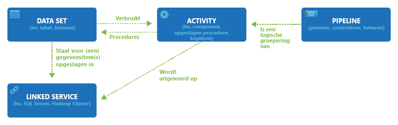

# <a name="datasets-in-azure-data-factory"></a>Gegevens sets in Azure Data Factory
> [!div class="op_single_selector" title1="Selecteer de versie van Data Factory service die u gebruikt:"]
> * [Versie 1:](v1/data-factory-create-datasets.md)
> * [Huidige versie](concepts-datasets-linked-services.md)

In dit artikel wordt beschreven welke gegevens sets zijn, hoe ze worden gedefinieerd in JSON-indeling en hoe ze worden gebruikt in Azure Data Factory pijp lijnen.

Als u geen ervaring hebt met Data Factory, raadpleegt u [Introduction to Azure Data Factory](introduction.md) voor een overzicht.

## <a name="overview"></a>Overzicht
Een gegevensfactory kan één of meer pijplijnen hebben. Een **pijp lijn** is een logische groep **activiteiten** die samen een taak uitvoeren. Met activiteiten in een pijplijn definieert u welk acties moeten worden uitgevoerd voor uw gegevens. Nu is een **gegevensset** een benoemde weer gave van gegevens waarmee u de gegevens die u in uw **activiteiten** wilt gebruiken als invoer en uitvoer, eenvoudigweg wijst of ernaar verwijst. Met gegevenssets worden gegevens binnen andere gegevensarchieven geïdentificeerd, waaronder tabellen, bestanden, mappen en documenten. Een Azure Blob-gegevensset benoemt bijvoorbeeld de blobcontainer en -map in de Blob-opslag van waaruit de activiteit de gegevens moet lezen.

Voordat u een gegevensset maakt, moet u een [**gekoppelde service**](concepts-linked-services.md) maken om uw gegevens archief te koppelen aan de Data Factory. Gekoppelde services zijn te vergelijken met verbindingsreeksen, die de verbindingsinformatie bevatten die Data Factory nodig heeft om verbinding te maken met externe bronnen. U kunt het op deze manier nadenken. de gegevensset vertegenwoordigt de structuur van de gegevens in de gekoppelde gegevens archieven en de gekoppelde service definieert de verbinding met de gegevens bron. Een Azure Storage gekoppelde service koppelt bijvoorbeeld een opslag account aan de data factory. Een Azure Blob-gegevensset vertegenwoordigt de BLOB-container en de map in dat Azure-opslag account die de invoer-blobs bevat die moeten worden verwerkt.

Hier volgt een voorbeeld scenario. Als u gegevens wilt kopiëren van Blob-opslag naar een SQL database, maakt u twee gekoppelde services: Azure Storage en Azure SQL Database. Maak vervolgens twee gegevens sets: Azure Blob-gegevensset (die verwijst naar de Azure Storage gekoppelde service) en de gegevensset van de Azure SQL-tabel (die verwijst naar de Azure SQL Database gekoppelde service). De Azure Storage-en Azure SQL Database gekoppelde services bevatten verbindings reeksen die Data Factory in runtime gebruiken om respectievelijk verbinding te maken met uw Azure Storage en Azure SQL Database. De Azure Blob-gegevensset bevat de BLOB en BLOB-map die de invoer-blobs in uw Blob-opslag bevat. De gegevensset van de Azure SQL-tabel geeft de SQL-tabel in de SQL database aan waarnaar de gegevens moeten worden gekopieerd.

In het volgende diagram ziet u de relaties tussen pijp lijn, activiteit, gegevensset en gekoppelde service in Data Factory:




## <a name="dataset-json"></a>JSON van gegevensset
Een gegevensset in Data Factory wordt gedefinieerd in de volgende JSON-indeling:

```json
{
    "name": "<name of dataset>",
    "properties": {
        "type": "<type of dataset: AzureBlob, AzureSql etc...>",
        "linkedServiceName": {
                "referenceName": "<name of linked service>",
                "type": "LinkedServiceReference",
        },
        "structure": [
            {
                "name": "<Name of the column>",
                "type": "<Name of the type>"
            }
        ],
        "typeProperties": {
            "<type specific property>": "<value>",
            "<type specific property 2>": "<value 2>",
        }
    }
}
```
In de volgende tabel worden de eigenschappen in de bovenstaande JSON beschreven:

Eigenschap | Description | Vereist |
-------- | ----------- | -------- |
name | De naam van de gegevensset. Zie [Azure Data Factory naamgevings regels](naming-rules.md). |  Ja |
type | Het type van de gegevensset. Geef een van de typen op die worden ondersteund door Data Factory (bijvoorbeeld: AzureBlob, AzureSqlTable). <br/><br/>Zie [type gegevensset](#dataset-type)voor meer informatie. | Ja |
structure | Schema van de gegevensset. Zie [DataSet schema](#dataset-structure-or-schema)voor meer informatie. | Nee |
typeProperties | De type-eigenschappen verschillen voor elk type (bijvoorbeeld: Azure Blob, Azure SQL-tabel). Zie [type gegevensset](#dataset-type)voor meer informatie over de ondersteunde typen en hun eigenschappen. | Ja |

### <a name="data-flow-compatible-dataset"></a>Met gegevens stroom compatibele gegevensset


Zie [ondersteunde typen gegevensset](#dataset-type) voor een lijst met typen gegevensset die compatibel zijn met de [gegevens stroom](concepts-data-flow-overview.md) . Gegevens sets die compatibel zijn met de data transport, hebben gedetailleerde gegevensset definities voor trans formaties nodig. De JSON-definitie is dus iets anders. In plaats van een _structure_ -eigenschap hebben gegevens sets die compatibel zijn met de gegevensstroom, een _schema_ -eigenschap.

In gegevens stroom worden gegevens sets gebruikt in bron-en Sink-trans formaties. In de gegevens sets worden de basis gegevens schema's gedefinieerd. Als uw gegevens geen schema hebben, kunt u schema-drift gebruiken voor uw bron en Sink. Het schema in de gegevensset vertegenwoordigt het fysieke gegevens type en de vorm.

Als u het schema van de gegevensset definieert, krijgt u de gerelateerde gegevens typen, gegevens indelingen, bestands locatie en verbindings gegevens van de bijbehorende gekoppelde service. Meta gegevens uit de gegevens sets worden weer gegeven in de bron transformatie als bron *projectie*. De projectie in de bron transformatie vertegenwoordigt de gegevens stroom gegevens met gedefinieerde namen en typen.

Wanneer u het schema van een gegevensstroom gegevensset importeert, selecteert u de knop **schema importeren** en kiest u importeren uit de bron of van een lokaal bestand. In de meeste gevallen importeert u het schema rechtstreeks vanuit de bron. Maar als u al een lokaal schema bestand (een Parquet-bestand of CSV met headers) hebt, kunt u Data Factory door sturen om het schema op dat bestand te baseren.


```json
{
    "name": "<name of dataset>",
    "properties": {
        "type": "<type of dataset: AzureBlob, AzureSql etc...>",
        "linkedServiceName": {
                "referenceName": "<name of linked service>",
                "type": "LinkedServiceReference",
        },
        "schema": [
            {
                "name": "<Name of the column>",
                "type": "<Name of the type>"
            }
        ],
        "typeProperties": {
            "<type specific property>": "<value>",
            "<type specific property 2>": "<value 2>",
        }
    }
}
```

In de volgende tabel worden de eigenschappen in de bovenstaande JSON beschreven:

Eigenschap | Description | Vereist |
-------- | ----------- | -------- |
name | De naam van de gegevensset. Zie [Azure Data Factory naamgevings regels](naming-rules.md). |  Ja |
type | Het type van de gegevensset. Geef een van de typen op die worden ondersteund door Data Factory (bijvoorbeeld: AzureBlob, AzureSqlTable). <br/><br/>Zie [type gegevensset](#dataset-type)voor meer informatie. | Ja |
Schema | Schema van de gegevensset. Zie [Data flow compatibele gegevens sets](#dataset-type)voor meer informatie. | Nee |
typeProperties | De type-eigenschappen verschillen voor elk type (bijvoorbeeld: Azure Blob, Azure SQL-tabel). Zie [type gegevensset](#dataset-type)voor meer informatie over de ondersteunde typen en hun eigenschappen. | Ja |


## <a name="dataset-example"></a>Gegevensset-voor beeld
In het volgende voor beeld vertegenwoordigt de gegevensset een tabel met de naam MyTable in een SQL database.

```json
{
    "name": "DatasetSample",
    "properties": {
        "type": "AzureSqlTable",
        "linkedServiceName": {
                "referenceName": "MyAzureSqlLinkedService",
                "type": "LinkedServiceReference",
        },
        "typeProperties":
        {
            "tableName": "MyTable"
        },
    }
}

```
Houd rekening met de volgende punten:

- type wordt ingesteld op AzureSqlTable.
- de eigenschap TableName type (specifiek voor het type AzureSqlTable) is ingesteld op MyTable.
- linkedServiceName verwijst naar een gekoppelde service van het type AzureSqlDatabase, die wordt gedefinieerd in het volgende JSON-code fragment.

## <a name="dataset-type"></a>Type gegevensset
Er zijn veel verschillende typen gegevens sets, afhankelijk van de gegevensopslag die u gebruikt. U kunt de lijst met opgeslagen gegevens die worden ondersteund door Data Factory, vinden in het [overzichts](connector-overview.md) artikel van de connector. Klik op een gegevens Archief voor informatie over het maken van een gekoppelde service en een gegevensset voor het gegevens archief.

In het voor beeld in de vorige sectie is het type gegevensset ingesteld op **AzureSqlTable**. Op dezelfde manier wordt voor een Azure Blob-gegevensset het type gegevensset ingesteld op **AzureBlob**, zoals wordt weer gegeven in de volgende JSON:

```json
{
    "name": "AzureBlobInput",
    "properties": {
        "type": "AzureBlob",
        "linkedServiceName": {
                "referenceName": "MyAzureStorageLinkedService",
                "type": "LinkedServiceReference",
        },

        "typeProperties": {
            "fileName": "input.log",
            "folderPath": "adfgetstarted/inputdata",
            "format": {
                "type": "TextFormat",
                "columnDelimiter": ","
            }
        }
    }
}
```

## <a name="dataset-structure-or-schema"></a>Structuur of schema van gegevensset
De **sectie** gegevens sets of het **schema** (compatibel met data flow) is optioneel. Hiermee wordt het schema van de gegevensset gedefinieerd door een verzameling namen en gegevens typen van kolommen te bevatten. U kunt de sectie structure gebruiken om type gegevens op te geven die worden gebruikt voor het converteren van typen en het toewijzen van kolommen van de bron naar het doel.

Elke kolom in de structuur bevat de volgende eigenschappen:

Eigenschap | Description | Vereist
-------- | ----------- | --------
name | De naam van de kolom. | Ja
type | Het gegevens type van de kolom. Data Factory ondersteunt de volgende tussenliggende gegevens typen als toegestane waarden: **Int16, Int32, Int64, single, double, Decimal, byte [], Boolean, String, GUID, datetime, date time offset en time span** | Nee
culture | . Op netgebaseerde cultuur die moet worden gebruikt wanneer het type een .NET-type is: `Datetime` of `Datetimeoffset`. De standaardwaarde is `en-us`. | Nee
format | Indelings teken reeks die moet worden gebruikt wanneer het type een .NET-type is: `Datetime` of `Datetimeoffset`. Raadpleeg de [aangepaste datum-en tijd notatie teken reeksen](https://docs.microsoft.com/dotnet/standard/base-types/custom-date-and-time-format-strings) voor het opmaken van DateTime. | Nee

### <a name="example"></a>Voorbeeld
In het volgende voor beeld zijn de gegevens van de bron-Blob in CSV-indeling en bevatten ze drie kolommen: GebruikersID, name en lastlogindate. Ze zijn van het type Int64, teken reeks en datum/tijd met een aangepaste datum/tijd-indeling die de dag van de week afgekort Franse namen gebruikt.

Definieer de structuur van de BLOB-gegevensset als volgt in combi natie met de type definities voor de kolommen:

```json
"structure":
[
    { "name": "userid", "type": "Int64"},
    { "name": "name", "type": "String"},
    { "name": "lastlogindate", "type": "Datetime", "culture": "fr-fr", "format": "ddd-MM-YYYY"}
]
```

### <a name="guidance"></a>Richtlijnen

De volgende richt lijnen helpen u te begrijpen wanneer u structuur informatie moet toevoegen en wat u in de sectie **structure** moet toevoegen. Meer informatie over hoe data factory bron gegevens toewijst aan Sink en wanneer u structuur gegevens van [schema en type toewijzing](copy-activity-schema-and-type-mapping.md)opgeeft.

- **Voor sterke schema gegevens bronnen**geeft u de sectie structuur alleen op als u wilt dat bron kolommen van de kaart worden gefilterd en de namen ervan niet hetzelfde zijn. In dit soort gestructureerde gegevens bronnen worden gegevens schema's en typen informatie opgeslagen samen met de gegevens zelf. Voor beelden van gestructureerde gegevens bronnen zijn SQL Server, Oracle en Azure SQL Database.<br/><br/>Als type-informatie is al beschikbaar voor gestructureerde gegevens bronnen, moet u geen type gegevens opgeven wanneer u de sectie structure insluit.
- **Voor geen/zwak schema gegevens bronnen, zoals tekst bestand in Blob Storage**, neemt u structuur op wanneer de gegevensset een invoer is voor een Kopieer activiteit en gegevens typen van de bron-gegevensset moeten worden geconverteerd naar systeem eigen typen voor de sink. En neem structuur op als u bron kolommen wilt toewijzen aan Sink-kolommen.

## <a name="create-datasets"></a>Gegevenssets maken
U kunt gegevens sets maken met behulp van een van deze hulpprogram ma's of Sdk's: [.net API](quickstart-create-data-factory-dot-net.md), [power shell](quickstart-create-data-factory-powershell.md), [REST API](quickstart-create-data-factory-rest-api.md), Azure Resource Manager sjabloon en Azure Portal

## <a name="current-version-vs-version-1-datasets"></a>Huidige versie versus gegevens sets van versie 1

Hier volgen enkele verschillen tussen Data Factory en Data Factory gegevens sets van versie 1:

- De eigenschap external wordt niet ondersteund in de huidige versie. Het wordt vervangen door een [trigger](concepts-pipeline-execution-triggers.md).
- De eigenschappen beleid en beschik baarheid worden niet ondersteund in de huidige versie. De begin tijd voor een pijp lijn is afhankelijk van [Triggers](concepts-pipeline-execution-triggers.md).
- Bereik gegevens sets (gegevens sets die zijn gedefinieerd in een pijp lijn) worden niet ondersteund in de huidige versie.

## <a name="next-steps"></a>Volgende stappen
Raadpleeg de volgende zelf studie voor stapsgewijze instructies voor het maken van pijp lijnen en gegevens sets met behulp van een van deze hulpprogram ma's of Sdk's.

- [Snelstartgids: een gegevensfactory maken met .NET](quickstart-create-data-factory-dot-net.md)
- [Snelstartgids: een data factory maken met Power shell](quickstart-create-data-factory-powershell.md)
- [Snelstartgids: een data factory maken met behulp van REST API](quickstart-create-data-factory-rest-api.md)
- [Snelstartgids: een data factory maken met behulp van Azure Portal](quickstart-create-data-factory-portal.md)
