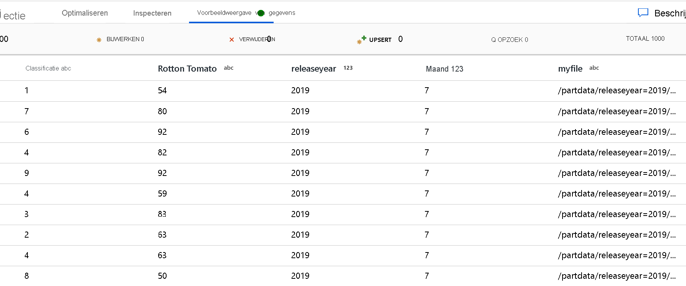
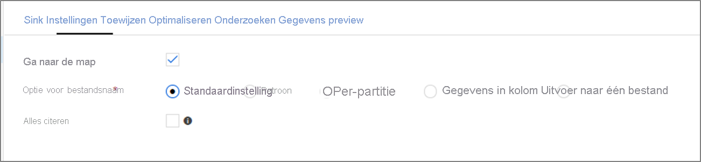

# <a name="copy-and-transform-data-in-azure-blob-storage-by-using-azure-data-factory"></a>Gegevens kopiëren en transformeren in Azure Blob-opslag met behulp van Azure Data Factory

> [!div class="op_single_selector" title1="Selecteer de versie van Data Factory service die u gebruikt:"]
> * [Versie 1:](v1/data-factory-azure-blob-connector.md)
> * [Huidige versie](connector-azure-blob-storage.md)

[!INCLUDE[appliesto-adf-asa-md](includes/appliesto-adf-asa-md.md)]

In dit artikel wordt beschreven hoe u de Kopieer activiteit in Azure Data Factory kunt gebruiken om gegevens van en naar Azure Blob-opslag te kopiëren. Ook wordt beschreven hoe u de gegevens stroom activiteit gebruikt om gegevens te transformeren in Azure Blob-opslag. Lees het [artikel Inleiding](introduction.md)voor meer informatie over Azure Data Factory.

>[!TIP]
>Zie [Azure Data Factory gebruiken om gegevens van uw data Lake of Data Warehouse te migreren naar Azure](data-migration-guidance-overview.md)voor meer informatie over een migratie scenario voor een Data Lake of een Data Warehouse.

## <a name="supported-capabilities"></a>Ondersteunde mogelijkheden

Deze Azure Blob Storage-connector wordt ondersteund voor de volgende activiteiten:

- [Kopieer activiteit](copy-activity-overview.md) met een [ondersteunde bron/Sink-matrix](copy-activity-overview.md)
- [Gegevens stroom toewijzen](concepts-data-flow-overview.md)
- [Activiteit Lookup](control-flow-lookup-activity.md)
- [GetMetadata-activiteit](control-flow-get-metadata-activity.md)
- [Activiteit verwijderen](delete-activity.md)

Voor de Kopieer activiteit ondersteunt deze Blob Storage-connector het volgende:

- Blobs kopiëren naar en van Azure Storage-accounts voor algemeen gebruik en warme/cool Blob Storage. 
- Blobs kopiëren met behulp van een account sleutel, een service voor Shared Access Signature (SAS), een service-principal of beheerde identiteiten voor Azure-resource verificaties.
- Het kopiëren van blobs uit blok-, toevoeg-of pagina-blobs en het kopiëren van gegevens naar alleen blok-blobs.
- Blobs worden als zodanig gekopieerd of blobs worden geparseerd of gegenereerd met [ondersteunde bestands indelingen en compressie-codecs](supported-file-formats-and-compression-codecs.md).
- [Meta gegevens van het bestand behouden tijdens het kopiëren](#preserving-metadata-during-copy).

>[!IMPORTANT]
>Als u de optie **vertrouwde micro soft-Services toegang geven tot dit opslag account hebt** ingeschakeld in azure Storage Firewall-instellingen en de Azure Integration runtime wilt gebruiken om verbinding te maken met de Blob-opslag, moet u [beheerde identiteits verificatie](#managed-identity)gebruiken.

## <a name="get-started"></a>Aan de slag

[!INCLUDE [data-factory-v2-connector-get-started](../../includes/data-factory-v2-connector-get-started.md)]

De volgende secties bevatten informatie over eigenschappen die worden gebruikt voor het definiëren van Data Factory entiteiten die specifiek zijn voor Blob Storage.

## <a name="linked-service-properties"></a>Eigenschappen van gekoppelde service

Deze Blob Storage-connector ondersteunt de volgende verificatie typen. Raadpleeg de bijbehorende gedeelten voor meer informatie.

- [Verificatie van account sleutel](#account-key-authentication)
- [Verificatie van de Shared Access-hand tekening](#shared-access-signature-authentication)
- [Service-Principal-verificatie](#service-principal-authentication)
- [Beheerde identiteiten voor Azure-resource verificatie](#managed-identity)

>[!NOTE]
>Wanneer u poly base gebruikt voor het laden van gegevens in azure Synapse Analytics (voorheen SQL Data Warehouse), als uw bron of faserings-Blob-opslag is geconfigureerd met een Azure Virtual Network-eind punt, moet u beheerde identiteits verificatie gebruiken zoals vereist is door poly base. U moet ook de zelf-hostende Integration runtime met versie 3,18 of hoger gebruiken. Zie de sectie [beheerde identiteits verificatie](#managed-identity) voor meer vereisten voor configuratie.

>[!NOTE]
>Azure HDInsight-en Azure Machine Learning-activiteiten bieden alleen ondersteuning voor verificatie die gebruikmaakt van sleutels van Azure Blob-opslag accounts.

### <a name="account-key-authentication"></a>Verificatie van account sleutel

Data Factory ondersteunt de volgende eigenschappen voor de verificatie van de sleutel van het opslag account:

| Eigenschap | Beschrijving | Vereist |
|:--- |:--- |:--- |
| type | De eigenschap **type** moet worden ingesteld op **AzureBlobStorage** (aanbevolen) of **opslag** (Zie de volgende opmerkingen). |Yes |
| Verbindings | Geef de gegevens op die nodig zijn om verbinding te maken met opslag voor de **Connections Tring** -eigenschap. <br/> U kunt ook de account sleutel in Azure Key Vault plaatsen en de `accountKey` configuratie uit de Connection String halen. Zie voor meer informatie de volgende voor beelden en de [referenties van de winkel in azure Key Vault](store-credentials-in-key-vault.md) artikel. |Yes |
| connectVia | De [Integration runtime](concepts-integration-runtime.md) die moet worden gebruikt om verbinding te maken met het gegevens archief. U kunt de Azure Integration runtime of de zelf-hostende Integration runtime gebruiken (als uw gegevens archief zich in een particulier netwerk bevindt). Als deze eigenschap niet is opgegeven, gebruikt de service de standaard Azure Integration runtime. |No |

>[!NOTE]
>Een secundair Blob service-eind punt wordt niet ondersteund wanneer u account sleutel verificatie gebruikt. U kunt andere verificatie typen gebruiken.

>[!NOTE]
>Als u de gekoppelde service van het type ' opslag ' gebruikt, wordt deze nog steeds ondersteund. We raden u echter aan het nieuwe gekoppelde service type ' AzureBlobStorage ' te gebruiken.

**Voorbeeld:**

```json
{
    "name": "AzureBlobStorageLinkedService",
    "properties": {
        "type": "AzureBlobStorage",
        "typeProperties": {
            "connectionString": "DefaultEndpointsProtocol=https;AccountName=<accountname>;AccountKey=<accountkey>"
        },
        "connectVia": {
            "referenceName": "<name of Integration Runtime>",
            "type": "IntegrationRuntimeReference"
        }
    }
}
```

**Voor beeld: Sla de account sleutel op in Azure Key Vault**

```json
{
    "name": "AzureBlobStorageLinkedService",
    "properties": {
        "type": "AzureBlobStorage",
        "typeProperties": {
            "connectionString": "DefaultEndpointsProtocol=https;AccountName=<accountname>;",
            "accountKey": { 
                "type": "AzureKeyVaultSecret", 
                "store": { 
                    "referenceName": "<Azure Key Vault linked service name>", 
                    "type": "LinkedServiceReference" 
                }, 
                "secretName": "<secretName>" 
            }
        },
        "connectVia": {
            "referenceName": "<name of Integration Runtime>",
            "type": "IntegrationRuntimeReference"
        }            
    }
}
```

### <a name="shared-access-signature-authentication"></a>Verificatie van de Shared Access-hand tekening

Een SAS (een handtekening voor gedeelde toegang) biedt gedelegeerde toegang tot resources in uw opslagaccount. U kunt een gedeelde hand tekening voor toegang gebruiken om een opgegeven periode een client met beperkte machtigingen te verlenen aan objecten in uw opslag account. 

U hoeft de toegangs sleutels van uw account niet te delen. De Shared Access-hand tekening is een URI die in de query parameters omvat alle informatie die nodig is voor geverifieerde toegang tot een opslag resource. Om toegang te krijgen tot opslag resources met de hand tekening voor gedeelde toegang, hoeft de client alleen de gedeelde toegangs handtekening door te geven aan de juiste constructor of methode. 

Zie voor meer informatie over hand tekeningen voor gedeelde toegang, [Shared Access Signatures: inzicht in het model voor de Shared Access-hand tekening](../storage/common/storage-dotnet-shared-access-signature-part-1.md).

> [!NOTE]
>- Data Factory ondersteunt nu zowel *gedeelde toegangs handtekeningen van services* als *hand tekeningen voor gedeelde toegang van accounts*. Zie voor meer informatie over gedeelde toegangs handtekeningen [beperkte toegang verlenen tot Azure storage-resources met behulp van hand tekeningen voor gedeelde toegang](../storage/common/storage-sas-overview.md).
>- In latere configuratie van de gegevensset is het mappad het absolute pad vanaf het niveau van de container. U moet een uitlijning configureren met het pad in de SAS-URI.

Data Factory ondersteunt de volgende eigenschappen voor het gebruik van verificatie met een gedeelde toegangs handtekening:

| Eigenschap | Beschrijving | Vereist |
|:--- |:--- |:--- |
| type | De eigenschap **type** moet worden ingesteld op **AzureBlobStorage** (aanbevolen) of **opslag** (Zie de volgende opmerking). |Yes |
| sasUri | Geef de URI van de Shared Access-hand tekening op voor de opslag resources, zoals BLOB of container. <br/>Markeer dit veld als **SecureString** om het veilig op te slaan in Data Factory. U kunt ook de SAS-token in Azure Key Vault plaatsen om automatische rotatie te gebruiken en het token gedeelte te verwijderen. Voor meer informatie raadpleegt u de volgende voor beelden en [slaat u referenties op in azure Key Vault](store-credentials-in-key-vault.md). |Yes |
| connectVia | De [Integration runtime](concepts-integration-runtime.md) die moet worden gebruikt om verbinding te maken met het gegevens archief. U kunt de Azure Integration runtime of de zelf-hostende Integration runtime gebruiken (als uw gegevens archief zich in een particulier netwerk bevindt). Als deze eigenschap niet is opgegeven, gebruikt de service de standaard Azure Integration runtime. |No |

>[!NOTE]
>Als u de gekoppelde service van het type ' opslag ' gebruikt, wordt deze nog steeds ondersteund. We raden u echter aan het nieuwe gekoppelde service type ' AzureBlobStorage ' te gebruiken.

**Voorbeeld:**

```json
{
    "name": "AzureBlobStorageLinkedService",
    "properties": {
        "type": "AzureBlobStorage",
        "typeProperties": {
            "sasUri": {
                "type": "SecureString",
                "value": "<SAS URI of the Azure Storage resource e.g. https://<accountname>.blob.core.windows.net/?sv=<storage version>&st=<start time>&se=<expire time>&sr=<resource>&sp=<permissions>&sip=<ip range>&spr=<protocol>&sig=<signature>>"
            }
        },
        "connectVia": {
            "referenceName": "<name of Integration Runtime>",
            "type": "IntegrationRuntimeReference"
        }
    }
}
```

**Voor beeld: Sla de account sleutel op in Azure Key Vault**

```json
{
    "name": "AzureBlobStorageLinkedService",
    "properties": {
        "type": "AzureBlobStorage",
        "typeProperties": {
            "sasUri": {
                "type": "SecureString",
                "value": "<SAS URI of the Azure Storage resource without token e.g. https://<accountname>.blob.core.windows.net/>"
            },
            "sasToken": { 
                "type": "AzureKeyVaultSecret", 
                "store": { 
                    "referenceName": "<Azure Key Vault linked service name>", 
                    "type": "LinkedServiceReference" 
                }, 
                "secretName": "<secretName with value of SAS token e.g. ?sv=<storage version>&st=<start time>&se=<expire time>&sr=<resource>&sp=<permissions>&sip=<ip range>&spr=<protocol>&sig=<signature>>" 
            }
        },
        "connectVia": {
            "referenceName": "<name of Integration Runtime>",
            "type": "IntegrationRuntimeReference"
        }
    }
}
```

Houd rekening met de volgende punten wanneer u een URI voor een Shared Access-hand tekening maakt:

- Stel de juiste lees-en schrijf machtigingen voor objecten in op basis van de manier waarop de gekoppelde service (lezen, schrijven, lezen/schrijven) wordt gebruikt in uw data factory.
- Stel de **verloop tijd** op de juiste wijze in. Zorg ervoor dat de toegang tot opslag objecten niet verloopt binnen de actieve periode van de pijp lijn.
- De URI moet worden gemaakt in de juiste container of BLOB op basis van de behoefte. Met een URI van een Shared Access Signature naar een BLOB kan Data Factory toegang krijgen tot die specifieke blob. Met een URI voor Shared Access Signature naar een BLOB storage-container kan Data Factory de blobs in die container door lopen. Als u later toegang wilt bieden tot meer of minder objecten of als u de URI van de Shared Access-hand tekening wilt bijwerken, moet u de gekoppelde service bijwerken met de nieuwe URI.

### <a name="service-principal-authentication"></a>Verificatie van service-principal

Zie [toegang tot Azure Storage verifiëren met behulp van Azure Active Directory](../storage/common/storage-auth-aad.md)voor algemene informatie over Azure Storage Service-Principal-verificatie.

Voer de volgende stappen uit om Service-Principal-verificatie te gebruiken:

1. Registreer een toepassings entiteit in Azure Active Directory (Azure AD) door [uw toepassing te registreren bij een Azure AD-Tenant](../storage/common/storage-auth-aad-app.md#register-your-application-with-an-azure-ad-tenant). Noteer deze waarden, die u gebruikt om de gekoppelde service te definiëren:

    - Toepassings-id
    - Toepassings sleutel
    - Tenant-id

2. Verleen de service-principal de juiste machtiging in Azure Blob-opslag. Zie [Manage access rights to Azure Storage Data with RBAC](../storage/common/storage-auth-aad-rbac.md)(Engelstalig) voor meer informatie over de rollen.

    - Ken **als bron**, in **toegangs beheer (IAM)**, ten minste de rol **Storage BLOB data Reader** .
    - Ken **als Sink**, in **toegangs beheer (IAM)**, ten minste de rol van **BLOB voor gegevens opslag** .

Deze eigenschappen worden ondersteund voor een gekoppelde Azure Blob Storage-service:

| Eigenschap | Beschrijving | Vereist |
|:--- |:--- |:--- |
| type | De eigenschap **type** moet worden ingesteld op **AzureBlobStorage**. |Yes |
| Serviceendpoint toegevoegd | Geef het Azure Blob Storage-service-eind punt met het patroon van op `https://<accountName>.blob.core.windows.net/` . |Yes |
| accountKind | Geef het type van uw opslag account op. Toegestane waarden zijn: **Storage** (algemeen gebruik v1), **StorageV2** (algemeen gebruik v2), **BlobStorage**of **BlockBlobStorage**. <br/> Wanneer u een gekoppelde Azure Blob-service gebruikt in de gegevens stroom, wordt beheerde identiteits-of Service-Principal-verificatie niet ondersteund als het account type leeg of opslag is. Geef het juiste account soort op, kies een andere verificatie of werk uw opslag account bij naar algemeen gebruik v2. |No |
| servicePrincipalId | Geef de client-ID van de toepassing op. | Yes |
| servicePrincipalKey | Geef de sleutel van de toepassing op. Markeer dit veld als **SecureString** om het veilig op te slaan in Data Factory, of om te [verwijzen naar een geheim dat is opgeslagen in azure Key Vault](store-credentials-in-key-vault.md). | Yes |
| tenant | Geef de Tenant gegevens op (domein naam of Tenant-ID) waaronder uw toepassing zich bevindt. Haal de waarde op door de muis aanwijzer boven de rechter bovenhoek van de Azure Portal te klikken. | Yes |
| azureCloudType | Voor Service-Principal-verificatie geeft u het type van de Azure-cloud omgeving op waarvoor uw Azure Active Directory-toepassing is geregistreerd. <br/> Toegestane waarden zijn **AzurePublic**, **AzureChina**, **AzureUsGovernment**en **AzureGermany**. De cloud omgeving van de data factory wordt standaard gebruikt. | No |
| connectVia | De [Integration runtime](concepts-integration-runtime.md) die moet worden gebruikt om verbinding te maken met het gegevens archief. U kunt de Azure Integration runtime of de zelf-hostende Integration runtime gebruiken (als uw gegevens archief zich in een particulier netwerk bevindt). Als deze eigenschap niet is opgegeven, gebruikt de service de standaard Azure Integration runtime. |No |

>[!NOTE]
>Service-Principal-verificatie wordt alleen ondersteund door de gekoppelde service van het type ' AzureBlobStorage ', niet de vorige gekoppelde service van het type ' opslag '.

**Voorbeeld:**

```json
{
    "name": "AzureBlobStorageLinkedService",
    "properties": {
        "type": "AzureBlobStorage",
        "typeProperties": {            
            "serviceEndpoint": "https://<accountName>.blob.core.windows.net/",
            "accountKind": "StorageV2",
            "servicePrincipalId": "<service principal id>",
            "servicePrincipalKey": {
                "type": "SecureString",
                "value": "<service principal key>"
            },
            "tenant": "<tenant info, e.g. microsoft.onmicrosoft.com>" 
        },
        "connectVia": {
            "referenceName": "<name of Integration Runtime>",
            "type": "IntegrationRuntimeReference"
        }
    }
}
```

### <a name="managed-identities-for-azure-resource-authentication"></a><a name="managed-identity"></a> Beheerde identiteiten voor Azure-resource verificatie

Een data factory kan worden gekoppeld aan een [beheerde identiteit voor Azure-resources](data-factory-service-identity.md)die deze specifieke Data Factory vertegenwoordigt. U kunt deze beheerde identiteit rechtstreeks gebruiken voor de verificatie van Blob-opslag. Dit is vergelijkbaar met het gebruik van uw eigen service-principal. Hiermee kan deze toegewezen Factory toegang krijgen tot gegevens en deze kopiëren van of naar Blob Storage.

Zie [toegang tot Azure Storage verifiëren met behulp van Azure Active Directory](../storage/common/storage-auth-aad.md)voor algemene informatie over Azure Storage-verificatie. Voer de volgende stappen uit om beheerde identiteiten te gebruiken voor Azure-resource verificatie:

1. [Haal Data Factory beheerde identiteits gegevens](data-factory-service-identity.md#retrieve-managed-identity) op door de waarde van de beheerde ID-object-id die samen met uw fabriek is gegenereerd, te kopiëren.

2. Ken de machtiging Managed Identity toe aan Azure Blob Storage. Zie [Manage access rights to Azure Storage Data with RBAC](../storage/common/storage-auth-aad-rbac.md)(Engelstalig) voor meer informatie over de rollen.

    - Ken **als bron**, in **toegangs beheer (IAM)**, ten minste de rol **Storage BLOB data Reader** .
    - Ken **als Sink**, in **toegangs beheer (IAM)**, ten minste de rol van **BLOB voor gegevens opslag** .

>[!IMPORTANT]
>Als u poly base gebruikt voor het laden van gegevens uit Blob Storage (als een bron of als fase ring) in azure Synapse Analytics (voorheen SQL Data Warehouse), moet u, wanneer u beheerde identiteits verificatie gebruikt voor Blobopslag, ervoor zorgen dat u ook de stappen 1 en 2 in [deze richt lijnen](../azure-sql/database/vnet-service-endpoint-rule-overview.md#impact-of-using-vnet-service-endpoints-with-azure-storage)volgt. Met deze stappen wordt de server geregistreerd bij Azure AD en wordt de rol voor BLOB-gegevens voor opslag toegewezen aan uw server. Data Factory de rest afhandelt. Als u Blob Storage hebt geconfigureerd met een Azure Virtual Network-eind punt, moet u de beheerde identiteits verificatie gebruiken zoals vereist door poly Base om poly Base te gebruiken voor het laden van gegevens.

Deze eigenschappen worden ondersteund voor een gekoppelde Azure Blob Storage-service:

| Eigenschap | Beschrijving | Vereist |
|:--- |:--- |:--- |
| type | De eigenschap **type** moet worden ingesteld op **AzureBlobStorage**. |Yes |
| Serviceendpoint toegevoegd | Geef het Azure Blob Storage-service-eind punt met het patroon van op `https://<accountName>.blob.core.windows.net/` . |Yes |
| accountKind | Geef het type van uw opslag account op. Toegestane waarden zijn: **Storage** (algemeen gebruik v1), **StorageV2** (algemeen gebruik v2), **BlobStorage**of **BlockBlobStorage**. <br/> Wanneer u een gekoppelde Azure Blob-service gebruikt in de gegevens stroom, wordt beheerde identiteits-of Service-Principal-verificatie niet ondersteund als het account type leeg of opslag is. Geef het juiste account soort op, kies een andere verificatie of werk uw opslag account bij naar algemeen gebruik v2. |No |
| connectVia | De [Integration runtime](concepts-integration-runtime.md) die moet worden gebruikt om verbinding te maken met het gegevens archief. U kunt de Azure Integration runtime of de zelf-hostende Integration runtime gebruiken (als uw gegevens archief zich in een particulier netwerk bevindt). Als deze eigenschap niet is opgegeven, gebruikt de service de standaard Azure Integration runtime. |No |

> [!NOTE]
> Beheerde identiteiten voor Azure-resource authenticatie worden alleen ondersteund door de gekoppelde service van het type ' AzureBlobStorage ', niet aan de vorige gekoppelde service van het type ' opslag '.

**Voorbeeld:**

```json
{
    "name": "AzureBlobStorageLinkedService",
    "properties": {
        "type": "AzureBlobStorage",
        "typeProperties": {            
            "serviceEndpoint": "https://<accountName>.blob.core.windows.net/",
            "accountKind": "StorageV2" 
        },
        "connectVia": {
            "referenceName": "<name of Integration Runtime>",
            "type": "IntegrationRuntimeReference"
        }
    }
}
```

## <a name="dataset-properties"></a>Eigenschappen van gegevensset

Zie het artikel [gegevens sets](concepts-datasets-linked-services.md) voor een volledige lijst met secties en eigenschappen die beschikbaar zijn voor het definiëren van gegevens sets. 

[!INCLUDE [data-factory-v2-file-formats](../../includes/data-factory-v2-file-formats.md)] 

De volgende eigenschappen worden ondersteund voor Azure Blob-opslag onder `location` instellingen in een gegevensset op basis van een indeling:

| Eigenschap   | Beschrijving                                                  | Vereist |
| ---------- | ------------------------------------------------------------ | -------- |
| type       | De eigenschap **type** van de locatie in de gegevensset moet worden ingesteld op **AzureBlobStorageLocation**. | Yes      |
| container  | De BLOB-container.                                          | Yes      |
| folderPath | Het pad naar de map onder de opgegeven container. Als u een Joker teken wilt gebruiken om de map te filteren, slaat u deze instelling over en geeft u op dat in de bron instellingen voor de activiteit. | No       |
| fileName   | De bestands naam onder de opgegeven container en mappad. Als u Joker tekens wilt gebruiken om bestanden te filteren, slaat u deze instelling over en geeft u op dat in de bron instellingen voor de activiteit. | No       |

**Voorbeeld:**

```json
{
    "name": "DelimitedTextDataset",
    "properties": {
        "type": "DelimitedText",
        "linkedServiceName": {
            "referenceName": "<Azure Blob Storage linked service name>",
            "type": "LinkedServiceReference"
        },
        "schema": [ < physical schema, optional, auto retrieved during authoring > ],
        "typeProperties": {
            "location": {
                "type": "AzureBlobStorageLocation",
                "container": "containername",
                "folderPath": "folder/subfolder"
            },
            "columnDelimiter": ",",
            "quoteChar": "\"",
            "firstRowAsHeader": true,
            "compressionCodec": "gzip"
        }
    }
}
```

## <a name="copy-activity-properties"></a>Eigenschappen van de kopieeractiviteit

Zie het artikel [pijp lijnen](concepts-pipelines-activities.md) voor een volledige lijst met secties en eigenschappen die beschikbaar zijn voor het definiëren van activiteiten. In deze sectie vindt u een lijst met eigenschappen die door de Blob Storage-bron en-Sink worden ondersteund.

### <a name="blob-storage-as-a-source-type"></a>Blob-opslag als bron type

[!INCLUDE [data-factory-v2-file-formats](../../includes/data-factory-v2-file-formats.md)] 

De volgende eigenschappen worden ondersteund voor Azure Blob-opslag onder `storeSettings` instellingen in een op indeling gebaseerde Kopieer Bron:

| Eigenschap                 | Beschrijving                                                  | Vereist                                      |
| ------------------------ | ------------------------------------------------------------ | --------------------------------------------- |
| type                     | De eigenschap **type** onder `storeSettings` moet worden ingesteld op **AzureBlobStorageReadSettings**. | Yes                                           |
| ***Zoek de bestanden die moeten worden gekopieerd:*** |  |  |
| OPTIE 1: statisch pad<br> | Kopiëren uit de opgegeven container of map of het pad naar het bestand dat is opgegeven in de gegevensset. Als u alle blobs uit een container of map wilt kopiëren, moet u ook opgeven `wildcardFileName` als `*` . |  |
| OPTIE 2: BLOB-voor voegsel<br>-voor voegsel | Voor voegsel voor de BLOB-naam onder de opgegeven container geconfigureerd in een gegevensset om bron-blobs te filteren. Blobs waarvan de naam begint met `container_in_dataset/this_prefix` zijn geselecteerd. Er wordt gebruikgemaakt van het filter aan de service zijde voor Blob Storage, dat betere prestaties levert dan een filter voor joker tekens. | No                                                          |
| OPTIE 3: Joker teken<br>- wildcardFolderPath | Het mappad met Joker tekens onder de opgegeven container die is geconfigureerd in een gegevensset om bron mappen te filteren. <br>Toegestane joker tekens zijn: `*` (komt overeen met nul of meer tekens) en `?` (komt overeen met nul of één teken). Gebruik `^` om te escapen als uw mapnaam een Joker teken of een spatie in bevat. <br>Bekijk meer voor beelden in [map-en bestands filter voorbeelden](#folder-and-file-filter-examples). | No                                            |
| OPTIE 3: Joker teken<br>- wildcardFileName | De bestands naam met Joker tekens onder de opgegeven container en mappad (of pad naar de map met Joker tekens) om bron bestanden te filteren. <br>Toegestane joker tekens zijn: `*` (komt overeen met nul of meer tekens) en `?` (komt overeen met nul of één teken). Gebruik `^` dit om te escapen als uw mapnaam een Joker teken of escape tekens bevat in. Bekijk meer voor beelden in [map-en bestands filter voorbeelden](#folder-and-file-filter-examples). | Yes |
| OPTIE 4: een lijst met bestanden<br>- fileListPath | Hiermee wordt aangegeven dat een opgegeven bestandenset moet worden gekopieerd. Wijs naar een tekst bestand met een lijst met bestanden die u wilt kopiëren, één bestand per regel, het relatieve pad naar het pad dat is geconfigureerd in de gegevensset.<br/>Wanneer u deze optie gebruikt, geeft u geen bestands naam op in de gegevensset. Meer voor beelden vindt u in [voor beelden van bestands lijsten](#file-list-examples). |No |
| ***Aanvullende instellingen:*** |  | |
| recursieve | Geeft aan of de gegevens recursief worden gelezen uit de submappen of alleen vanuit de opgegeven map. Houd er rekening mee dat wanneer **recursief** is ingesteld op **True** en de Sink een archief op basis van bestanden is, een lege map of submap niet wordt gekopieerd of gemaakt bij de sink. <br>Toegestane waarden zijn **True** (standaard) en **Onwaar**.<br>Deze eigenschap is niet van toepassing wanneer u configureert `fileListPath` . |No |
| deleteFilesAfterCompletion | Hiermee wordt aangegeven of de binaire bestanden uit het bron archief worden verwijderd nadat naar het doel archief is verplaatst. Het verwijderen van bestanden is per bestand, dus wanneer de Kopieer activiteit mislukt, ziet u dat er al een aantal bestanden naar het doel is gekopieerd en verwijderd uit de bron, terwijl andere nog steeds in het bron archief blijven staan. <br/>Deze eigenschap is alleen geldig in een scenario met binaire kopieën, waarbij gegevens bron archieven blob, ADLS Gen1, ADLS Gen2, S3, Google Cloud Storage, file, Azure file, SFTP of FTP zijn. De standaard waarde is False. |No |
| modifiedDatetimeStart    | Bestanden worden gefilterd op basis van het kenmerk: laatst gewijzigd. <br>De bestanden worden geselecteerd als het tijdstip van de laatste wijziging binnen het tijds bereik ligt tussen `modifiedDatetimeStart` en `modifiedDatetimeEnd` . De tijd wordt toegepast op een UTC-tijd zone met de notatie "2018-12-01T05:00:00Z". <br> De eigenschappen kunnen **Null**zijn, wat betekent dat er geen bestands kenmerk filter op de gegevensset wordt toegepast.  Wanneer `modifiedDatetimeStart` heeft een datum/tijd `modifiedDatetimeEnd` -waarde, maar is **Null**, worden de bestanden waarvan het kenmerk laatst gewijzigd is groter dan of gelijk aan de datum/tijd-waarde, geselecteerd.  Wanneer `modifiedDatetimeEnd` heeft een datum/tijd `modifiedDatetimeStart` -waarde, maar is **Null**, worden de bestanden waarvan het kenmerk laatst gewijzigd is kleiner dan de datum/tijd-waarde, geselecteerd.<br/>Deze eigenschap is niet van toepassing wanneer u configureert `fileListPath` . | No                                            |
| modifiedDatetimeEnd      | Hetzelfde als hierboven.                                               | No                                            |
| enablePartitionDiscovery | Geef voor bestanden die zijn gepartitioneerd op of de partities moeten worden geparseerd uit het bestandspad en voeg deze toe als aanvullende bron kolommen.<br/>Toegestane waarden zijn **False** (standaard) en **waar**. | No                                            |
| partitionRootPath | Wanneer partitie detectie is ingeschakeld, geeft u het absolute hoofdpad op om gepartitioneerde mappen te lezen als gegevens kolommen.<br/><br/>Als deze niet is opgegeven, wordt standaard<br/>-Als u het bestandspad in de gegevensset of lijst met bestanden op de bron gebruikt, is het basispad het pad dat is geconfigureerd in de gegevensset.<br/>-Wanneer u filter voor de map met Joker tekens gebruikt, is het pad van de partitie hoofdmap het pad vóór het eerste Joker teken.<br/>-Als u voor voegsel gebruikt, is het pad van de partitie hoofdmap een subpad voor het laatste/. <br/><br/>Als u bijvoorbeeld het pad in gegevensset configureert als ' hoofdmap/map/jaar = 2020/maand = 08/dag = 27 ':<br/>-Als u basispad opgeeft als ' hoofdmap/map/jaar = 2020 ', worden met de Kopieer activiteit nog twee kolommen `month` en `day` met de waarde ' 08 ' en ' 27 ' gegenereerd, naast de kolommen in de bestanden.<br/>-Als het basispad niet is opgegeven, wordt er geen extra kolom gegenereerd. | No                                            |
| maxConcurrentConnections | Het aantal gelijktijdige verbindingen met de opslag. Geef alleen op wanneer u gelijktijdige verbindingen met het gegevens archief wilt beperken. | No                                            |

> [!NOTE]
> Voor Parquet/gescheiden tekst indeling wordt het **BlobSource** -type voor de bron van de Kopieer activiteit die in de volgende sectie wordt vermeld, nog steeds ondersteund voor compatibiliteit met eerdere versies. We raden u aan om het nieuwe model te gebruiken totdat de Data Factory ontwerp interface voor het genereren van deze nieuwe typen is gewijzigd.

**Voorbeeld:**

```json
"activities":[
    {
        "name": "CopyFromBlob",
        "type": "Copy",
        "inputs": [
            {
                "referenceName": "<Delimited text input dataset name>",
                "type": "DatasetReference"
            }
        ],
        "outputs": [
            {
                "referenceName": "<output dataset name>",
                "type": "DatasetReference"
            }
        ],
        "typeProperties": {
            "source": {
                "type": "DelimitedTextSource",
                "formatSettings":{
                    "type": "DelimitedTextReadSettings",
                    "skipLineCount": 10
                },
                "storeSettings":{
                    "type": "AzureBlobStorageReadSettings",
                    "recursive": true,
                    "wildcardFolderPath": "myfolder*A",
                    "wildcardFileName": "*.csv"
                }
            },
            "sink": {
                "type": "<sink type>"
            }
        }
    }
]
```

### <a name="blob-storage-as-a-sink-type"></a>Blob-opslag als Sink-type

[!INCLUDE [data-factory-v2-file-sink-formats](../../includes/data-factory-v2-file-sink-formats.md)] 

De volgende eigenschappen worden ondersteund voor Azure Blob-opslag onder `storeSettings` instellingen in een op indeling gebaseerde kopie-Sink:

| Eigenschap                 | Beschrijving                                                  | Vereist |
| ------------------------ | ------------------------------------------------------------ | -------- |
| type                     | De eigenschap **type** onder `storeSettings` moet worden ingesteld op **AzureBlobStorageWriteSettings**. | Yes      |
| copyBehavior             | Hiermee wordt het Kopieer gedrag gedefinieerd wanneer de bron bestanden van een gegevens archief op basis van een bestand zijn.<br/><br/>Toegestane waarden zijn:<br/><b>-PreserveHierarchy (standaard instelling)</b>: behoudt de bestands hiërarchie in de doelmap. Het relatieve pad van het bron bestand naar de bronmap is identiek aan het relatieve pad van het doel bestand naar de doelmap.<br/><b>-FlattenHierarchy</b>: alle bestanden in de bronmap bevinden zich in het eerste niveau van de doelmap. De doel bestanden hebben automatisch gegenereerde namen. <br/><b>-MergeFiles</b>: alle bestanden van de bronmap worden samengevoegd met één bestand. Als de naam van het bestand of de blob is opgegeven, is de naam van het samengevoegde bestand de opgegeven naam. Anders is het een automatisch gegenereerde bestands naam. | No       |
| blockSizeInMB | Geef de blok grootte in mega bytes op die wordt gebruikt om gegevens te schrijven om blobs te blok keren. Meer informatie [over blok-blobs](https://docs.microsoft.com/rest/api/storageservices/understanding-block-blobs--append-blobs--and-page-blobs#about-block-blobs). <br/>De toegestane waarde ligt *tussen 4 MB en 100 MB*. <br/>Standaard bepaalt Data Factory automatisch de blok grootte op basis van het type en de gegevens van het bron archief. Voor niet-binaire kopieën in Blob Storage is de standaard blok grootte 100 MB zodat deze past in (Maxi maal) 4,95 TB aan gegevens. Het is mogelijk niet optimaal wanneer uw gegevens niet groot zijn, met name wanneer u de zelf-hostende Integration runtime gebruikt met slechte netwerk verbindingen die leiden tot time-out bij de bewerking of prestatie problemen. U kunt expliciet een blok grootte opgeven, terwijl u zeker weet dat `blockSizeInMB*50000` de gegevens moeten worden opgeslagen. Anders mislukt de uitvoering van de Kopieer activiteit. | No |
| maxConcurrentConnections | Het aantal gelijktijdige verbindingen met de opslag. Geef alleen op wanneer u gelijktijdige verbindingen met het gegevens archief wilt beperken. | No       |

**Voorbeeld:**

```json
"activities":[
    {
        "name": "CopyFromBlob",
        "type": "Copy",
        "inputs": [
            {
                "referenceName": "<input dataset name>",
                "type": "DatasetReference"
            }
        ],
        "outputs": [
            {
                "referenceName": "<Parquet output dataset name>",
                "type": "DatasetReference"
            }
        ],
        "typeProperties": {
            "source": {
                "type": "<source type>"
            },
            "sink": {
                "type": "ParquetSink",
                "storeSettings":{
                    "type": "AzureBlobStorageWriteSettings",
                    "copyBehavior": "PreserveHierarchy"
                }
            }
        }
    }
]
```

### <a name="folder-and-file-filter-examples"></a>Voor beelden van map-en bestands filter

In deze sectie wordt het resulterende gedrag van het mappad en de bestands naam met Joker teken filters beschreven.

| folderPath | fileName | recursieve | De structuur van de bronmap en het filter resultaat ( **vetgedrukte** bestanden worden opgehaald)|
|:--- |:--- |:--- |:--- |
| `container/Folder*` | (leeg, standaard instelling gebruiken) | false | container<br/>&nbsp;&nbsp;&nbsp;&nbsp;Mapa<br/>&nbsp;&nbsp;&nbsp;&nbsp;&nbsp;&nbsp;&nbsp;&nbsp;**File1.csv**<br/>&nbsp;&nbsp;&nbsp;&nbsp;&nbsp;&nbsp;&nbsp;&nbsp;**File2.jsop**<br/>&nbsp;&nbsp;&nbsp;&nbsp;&nbsp;&nbsp;&nbsp;&nbsp;Subfolder1<br/>&nbsp;&nbsp;&nbsp;&nbsp;&nbsp;&nbsp;&nbsp;&nbsp;&nbsp;&nbsp;&nbsp;&nbsp;File3.csv<br/>&nbsp;&nbsp;&nbsp;&nbsp;&nbsp;&nbsp;&nbsp;&nbsp;&nbsp;&nbsp;&nbsp;&nbsp;File4.jsop<br/>&nbsp;&nbsp;&nbsp;&nbsp;&nbsp;&nbsp;&nbsp;&nbsp;&nbsp;&nbsp;&nbsp;&nbsp;File5.csv<br/>&nbsp;&nbsp;&nbsp;&nbsp;AnotherFolderB<br/>&nbsp;&nbsp;&nbsp;&nbsp;&nbsp;&nbsp;&nbsp;&nbsp;File6.csv |
| `container/Folder*` | (leeg, standaard instelling gebruiken) | true | container<br/>&nbsp;&nbsp;&nbsp;&nbsp;Mapa<br/>&nbsp;&nbsp;&nbsp;&nbsp;&nbsp;&nbsp;&nbsp;&nbsp;**File1.csv**<br/>&nbsp;&nbsp;&nbsp;&nbsp;&nbsp;&nbsp;&nbsp;&nbsp;**File2.jsop**<br/>&nbsp;&nbsp;&nbsp;&nbsp;&nbsp;&nbsp;&nbsp;&nbsp;Subfolder1<br/>&nbsp;&nbsp;&nbsp;&nbsp;&nbsp;&nbsp;&nbsp;&nbsp;&nbsp;&nbsp;&nbsp;&nbsp;**File3.csv**<br/>&nbsp;&nbsp;&nbsp;&nbsp;&nbsp;&nbsp;&nbsp;&nbsp;&nbsp;&nbsp;&nbsp;&nbsp;**File4.jsop**<br/>&nbsp;&nbsp;&nbsp;&nbsp;&nbsp;&nbsp;&nbsp;&nbsp;&nbsp;&nbsp;&nbsp;&nbsp;**File5.csv**<br/>&nbsp;&nbsp;&nbsp;&nbsp;AnotherFolderB<br/>&nbsp;&nbsp;&nbsp;&nbsp;&nbsp;&nbsp;&nbsp;&nbsp;File6.csv |
| `container/Folder*` | `*.csv` | false | container<br/>&nbsp;&nbsp;&nbsp;&nbsp;Mapa<br/>&nbsp;&nbsp;&nbsp;&nbsp;&nbsp;&nbsp;&nbsp;&nbsp;**File1.csv**<br/>&nbsp;&nbsp;&nbsp;&nbsp;&nbsp;&nbsp;&nbsp;&nbsp;File2.jsop<br/>&nbsp;&nbsp;&nbsp;&nbsp;&nbsp;&nbsp;&nbsp;&nbsp;Subfolder1<br/>&nbsp;&nbsp;&nbsp;&nbsp;&nbsp;&nbsp;&nbsp;&nbsp;&nbsp;&nbsp;&nbsp;&nbsp;File3.csv<br/>&nbsp;&nbsp;&nbsp;&nbsp;&nbsp;&nbsp;&nbsp;&nbsp;&nbsp;&nbsp;&nbsp;&nbsp;File4.jsop<br/>&nbsp;&nbsp;&nbsp;&nbsp;&nbsp;&nbsp;&nbsp;&nbsp;&nbsp;&nbsp;&nbsp;&nbsp;File5.csv<br/>&nbsp;&nbsp;&nbsp;&nbsp;AnotherFolderB<br/>&nbsp;&nbsp;&nbsp;&nbsp;&nbsp;&nbsp;&nbsp;&nbsp;File6.csv |
| `container/Folder*` | `*.csv` | true | container<br/>&nbsp;&nbsp;&nbsp;&nbsp;Mapa<br/>&nbsp;&nbsp;&nbsp;&nbsp;&nbsp;&nbsp;&nbsp;&nbsp;**File1.csv**<br/>&nbsp;&nbsp;&nbsp;&nbsp;&nbsp;&nbsp;&nbsp;&nbsp;File2.jsop<br/>&nbsp;&nbsp;&nbsp;&nbsp;&nbsp;&nbsp;&nbsp;&nbsp;Subfolder1<br/>&nbsp;&nbsp;&nbsp;&nbsp;&nbsp;&nbsp;&nbsp;&nbsp;&nbsp;&nbsp;&nbsp;&nbsp;**File3.csv**<br/>&nbsp;&nbsp;&nbsp;&nbsp;&nbsp;&nbsp;&nbsp;&nbsp;&nbsp;&nbsp;&nbsp;&nbsp;File4.jsop<br/>&nbsp;&nbsp;&nbsp;&nbsp;&nbsp;&nbsp;&nbsp;&nbsp;&nbsp;&nbsp;&nbsp;&nbsp;**File5.csv**<br/>&nbsp;&nbsp;&nbsp;&nbsp;AnotherFolderB<br/>&nbsp;&nbsp;&nbsp;&nbsp;&nbsp;&nbsp;&nbsp;&nbsp;File6.csv |

### <a name="file-list-examples"></a>Voor beelden van bestands lijst

In deze sectie wordt het resulterende gedrag van het gebruik van een bestands lijst pad in de bron van de Kopieer activiteit beschreven.

Stel dat u de volgende structuur van de bronmap hebt en de bestanden vet wilt kopiëren:

| Voorbeeld bron structuur                                      | Inhoud in FileListToCopy.txt                             | Data Factory configuratie                                            |
| ------------------------------------------------------------ | --------------------------------------------------------- | ------------------------------------------------------------ |
| container<br/>&nbsp;&nbsp;&nbsp;&nbsp;Mapa<br/>&nbsp;&nbsp;&nbsp;&nbsp;&nbsp;&nbsp;&nbsp;&nbsp;**File1.csv**<br/>&nbsp;&nbsp;&nbsp;&nbsp;&nbsp;&nbsp;&nbsp;&nbsp;File2.jsop<br/>&nbsp;&nbsp;&nbsp;&nbsp;&nbsp;&nbsp;&nbsp;&nbsp;Subfolder1<br/>&nbsp;&nbsp;&nbsp;&nbsp;&nbsp;&nbsp;&nbsp;&nbsp;&nbsp;&nbsp;&nbsp;&nbsp;**File3.csv**<br/>&nbsp;&nbsp;&nbsp;&nbsp;&nbsp;&nbsp;&nbsp;&nbsp;&nbsp;&nbsp;&nbsp;&nbsp;File4.jsop<br/>&nbsp;&nbsp;&nbsp;&nbsp;&nbsp;&nbsp;&nbsp;&nbsp;&nbsp;&nbsp;&nbsp;&nbsp;**File5.csv**<br/>&nbsp;&nbsp;&nbsp;&nbsp;Metagegevensarchiefmethode<br/>&nbsp;&nbsp;&nbsp;&nbsp;&nbsp;&nbsp;&nbsp;&nbsp;FileListToCopy.txt | File1.csv<br>Subfolder1/File3.csv<br>Subfolder1/File5.csv | **In gegevensset:**<br>Verpakking `container`<br>-Mappad: `FolderA`<br><br>**Bron van Kopieer activiteit:**<br>-Pad naar bestands lijst: `container/Metadata/FileListToCopy.txt` <br><br>Het pad naar de bestands lijst verwijst naar een tekst bestand in hetzelfde gegevens archief dat een lijst bevat met bestanden die u wilt kopiëren, één bestand per regel, met het relatieve pad naar het pad dat is geconfigureerd in de gegevensset. |

### <a name="some-recursive-and-copybehavior-examples"></a>Enkele recursieve en copyBehavior-voor beelden

In deze sectie wordt het resulterende gedrag van de Kopieer bewerking voor verschillende combi Naties van **recursieve** en **copyBehavior** waarden beschreven.

| recursieve | copyBehavior | Structuur van bronmap | Resulterende doel |
|:--- |:--- |:--- |:--- |
| true |preserveHierarchy | Map1<br/>&nbsp;&nbsp;&nbsp;&nbsp;Bestand1<br/>&nbsp;&nbsp;&nbsp;&nbsp;Bestand2<br/>&nbsp;&nbsp;&nbsp;&nbsp;Subfolder1<br/>&nbsp;&nbsp;&nbsp;&nbsp;&nbsp;&nbsp;&nbsp;&nbsp;File3<br/>&nbsp;&nbsp;&nbsp;&nbsp;&nbsp;&nbsp;&nbsp;&nbsp;File4<br/>&nbsp;&nbsp;&nbsp;&nbsp;&nbsp;&nbsp;&nbsp;&nbsp;File5 | De doelmap, map1, wordt gemaakt met dezelfde structuur als de bron:<br/><br/>Map1<br/>&nbsp;&nbsp;&nbsp;&nbsp;Bestand1<br/>&nbsp;&nbsp;&nbsp;&nbsp;Bestand2<br/>&nbsp;&nbsp;&nbsp;&nbsp;Subfolder1<br/>&nbsp;&nbsp;&nbsp;&nbsp;&nbsp;&nbsp;&nbsp;&nbsp;File3<br/>&nbsp;&nbsp;&nbsp;&nbsp;&nbsp;&nbsp;&nbsp;&nbsp;File4<br/>&nbsp;&nbsp;&nbsp;&nbsp;&nbsp;&nbsp;&nbsp;&nbsp;File5 |
| true |flattenHierarchy | Map1<br/>&nbsp;&nbsp;&nbsp;&nbsp;Bestand1<br/>&nbsp;&nbsp;&nbsp;&nbsp;Bestand2<br/>&nbsp;&nbsp;&nbsp;&nbsp;Subfolder1<br/>&nbsp;&nbsp;&nbsp;&nbsp;&nbsp;&nbsp;&nbsp;&nbsp;File3<br/>&nbsp;&nbsp;&nbsp;&nbsp;&nbsp;&nbsp;&nbsp;&nbsp;File4<br/>&nbsp;&nbsp;&nbsp;&nbsp;&nbsp;&nbsp;&nbsp;&nbsp;File5 | De doelmap, map1, wordt gemaakt met de volgende structuur: <br/><br/>Map1<br/>&nbsp;&nbsp;&nbsp;&nbsp;automatisch gegenereerde naam voor bestand1<br/>&nbsp;&nbsp;&nbsp;&nbsp;automatisch gegenereerde naam voor Bestand2<br/>&nbsp;&nbsp;&nbsp;&nbsp;automatisch gegenereerde naam voor File3<br/>&nbsp;&nbsp;&nbsp;&nbsp;automatisch gegenereerde naam voor File4<br/>&nbsp;&nbsp;&nbsp;&nbsp;automatisch gegenereerde naam voor File5 |
| true |mergeFiles | Map1<br/>&nbsp;&nbsp;&nbsp;&nbsp;Bestand1<br/>&nbsp;&nbsp;&nbsp;&nbsp;Bestand2<br/>&nbsp;&nbsp;&nbsp;&nbsp;Subfolder1<br/>&nbsp;&nbsp;&nbsp;&nbsp;&nbsp;&nbsp;&nbsp;&nbsp;File3<br/>&nbsp;&nbsp;&nbsp;&nbsp;&nbsp;&nbsp;&nbsp;&nbsp;File4<br/>&nbsp;&nbsp;&nbsp;&nbsp;&nbsp;&nbsp;&nbsp;&nbsp;File5 | De doelmap, map1, wordt gemaakt met de volgende structuur: <br/><br/>Map1<br/>&nbsp;&nbsp;&nbsp;&nbsp;De inhoud van bestand1 + Bestand2 + File3 + File4 + File5 worden samengevoegd met een bestand met een automatisch gegenereerde bestands naam. |
| false |preserveHierarchy | Map1<br/>&nbsp;&nbsp;&nbsp;&nbsp;Bestand1<br/>&nbsp;&nbsp;&nbsp;&nbsp;Bestand2<br/>&nbsp;&nbsp;&nbsp;&nbsp;Subfolder1<br/>&nbsp;&nbsp;&nbsp;&nbsp;&nbsp;&nbsp;&nbsp;&nbsp;File3<br/>&nbsp;&nbsp;&nbsp;&nbsp;&nbsp;&nbsp;&nbsp;&nbsp;File4<br/>&nbsp;&nbsp;&nbsp;&nbsp;&nbsp;&nbsp;&nbsp;&nbsp;File5 | De doelmap, map1, wordt gemaakt met de volgende structuur: <br/><br/>Map1<br/>&nbsp;&nbsp;&nbsp;&nbsp;Bestand1<br/>&nbsp;&nbsp;&nbsp;&nbsp;Bestand2<br/><br/>Subfolder1 met File3, File4 en File5 is niet opgehaald. |
| false |flattenHierarchy | Map1<br/>&nbsp;&nbsp;&nbsp;&nbsp;Bestand1<br/>&nbsp;&nbsp;&nbsp;&nbsp;Bestand2<br/>&nbsp;&nbsp;&nbsp;&nbsp;Subfolder1<br/>&nbsp;&nbsp;&nbsp;&nbsp;&nbsp;&nbsp;&nbsp;&nbsp;File3<br/>&nbsp;&nbsp;&nbsp;&nbsp;&nbsp;&nbsp;&nbsp;&nbsp;File4<br/>&nbsp;&nbsp;&nbsp;&nbsp;&nbsp;&nbsp;&nbsp;&nbsp;File5 | De doelmap, map1, wordt gemaakt met de volgende structuur: <br/><br/>Map1<br/>&nbsp;&nbsp;&nbsp;&nbsp;automatisch gegenereerde naam voor bestand1<br/>&nbsp;&nbsp;&nbsp;&nbsp;automatisch gegenereerde naam voor Bestand2<br/><br/>Subfolder1 met File3, File4 en File5 is niet opgehaald. |
| false |mergeFiles | Map1<br/>&nbsp;&nbsp;&nbsp;&nbsp;Bestand1<br/>&nbsp;&nbsp;&nbsp;&nbsp;Bestand2<br/>&nbsp;&nbsp;&nbsp;&nbsp;Subfolder1<br/>&nbsp;&nbsp;&nbsp;&nbsp;&nbsp;&nbsp;&nbsp;&nbsp;File3<br/>&nbsp;&nbsp;&nbsp;&nbsp;&nbsp;&nbsp;&nbsp;&nbsp;File4<br/>&nbsp;&nbsp;&nbsp;&nbsp;&nbsp;&nbsp;&nbsp;&nbsp;File5 | De doelmap, map1, wordt gemaakt met de volgende structuur:<br/><br/>Map1<br/>&nbsp;&nbsp;&nbsp;&nbsp;De inhoud van bestand1 + Bestand2 wordt samengevoegd met een bestand met een automatisch gegenereerde bestands naam. automatisch gegenereerde naam voor bestand1<br/><br/>Subfolder1 met File3, File4 en File5 is niet opgehaald. |

## <a name="preserving-metadata-during-copy"></a>Meta gegevens behouden tijdens kopiëren

Wanneer u bestanden kopieert vanuit Amazon S3, Azure Blob Storage of Azure Data Lake Storage Gen2 naar Azure Data Lake Storage Gen2 of Azure Blob-opslag, kunt u ervoor kiezen om de meta gegevens van het bestand te behouden, samen met de gegevens. Meer informatie over het [bewaren van meta gegevens](copy-activity-preserve-metadata.md#preserve-metadata).

## <a name="mapping-data-flow-properties"></a>Eigenschappen van gegevens stroom toewijzen

Wanneer u gegevens transformeert in de toewijzing van gegevens stromen, kunt u bestanden lezen en schrijven vanuit Azure Blob-opslag in de volgende indelingen:
* [Avro](format-avro.md#mapping-data-flow-properties)
* [Tekst met scheidings tekens](format-delimited-text.md#mapping-data-flow-properties)
* [Delta](format-delta.md#mapping-data-flow-properties)
* [Excel](format-excel.md#mapping-data-flow-properties)
* [JSON](format-json.md#mapping-data-flow-properties)
* [Parquet](format-parquet.md#mapping-data-flow-properties)

Specifieke instellingen bevinden zich in de documentatie voor die indeling. Zie [bron transformatie in toewijzing van gegevens stroom](data-flow-source.md) en [sink-trans formatie in gegevens stroom toewijzen](data-flow-sink.md)voor meer informatie.

### <a name="source-transformation"></a>Bron transformatie

In bron transformatie kunt u lezen uit een container, map of afzonderlijk bestand in Azure Blob Storage. Gebruik het tabblad **bron opties** om te beheren hoe de bestanden worden gelezen. 


**Joker tekens:** Als u een Joker teken gebruikt, wordt Data Factory een lus door lopen van elke overeenkomende map en elk bestand in één bron transformatie. Dit is een efficiënte manier om meerdere bestanden binnen één stroom te verwerken. Voeg meerdere Joker teken patronen toe met het plus teken dat wordt weer gegeven wanneer u de muis aanwijzer over uw bestaande patroon voor joker tekens houdt.

Kies in uw bron container een reeks bestanden die overeenkomen met een patroon. Er kan alleen een container worden opgegeven in de gegevensset. Het pad naar uw Joker teken moet daarom ook uw mappad van de hoofdmap bevatten.

Voor beelden van joker tekens:

* ```*``` Vertegenwoordigt een wille keurige set tekens.
* ```**``` Recursief nesten van mappen.
* ```?``` Eén teken vervangen.
* ```[]``` Komt overeen met een of meer tekens tussen de haakjes.

* ```/data/sales/**/*.csv``` Hiermee worden alle CSV-bestanden opgehaald onder/Data/Sales.
* ```/data/sales/20??/**/``` Hiermee worden alle bestanden in de twintigste eeuw opgehaald.
* ```/data/sales/*/*/*.csv``` Hiermee worden CSV-bestanden twee niveaus onder/Data/Sales.
* ```/data/sales/2004/*/12/[XY]1?.csv``` Hiermee worden alle CSV-bestanden in december 2004, beginnend met X of Y, voorafgegaan door een getal van twee cijfers.

Basispad **:** Als u gepartitioneerde mappen in de bestands bron met een ```key=value``` indeling (bijvoorbeeld) hebt `year=2019` , kunt u het hoogste niveau van die partitie mappen structuur toewijzen aan een kolom naam in de gegevens stroom van de gegevens stroom.

Stel eerst een Joker teken in om alle paden op te nemen van de gepartitioneerde mappen plus de blad bestanden die u wilt lezen.


Gebruik de instelling **basis pad partitie** om te definiëren wat het hoogste niveau van de mappen structuur is. Wanneer u de inhoud van uw gegevens bekijkt via een voor beeld van de gegevens, ziet u dat Data Factory de opgeloste partities in elk van uw mapniveau gaat toevoegen.



**Lijst met bestanden:** Dit is een bestandenset. Maak een tekst bestand met een lijst met relatieve padgegevens die moeten worden verwerkt. Wijs dit tekst bestand aan.

**Kolom voor het opslaan van de bestands naam:** Sla de naam van het bron bestand op in een kolom in uw gegevens. Voer hier een nieuwe kolom naam in om de teken reeks voor de bestands naam op te slaan.

**Na voltooiing:** U kunt niets doen met het bron bestand nadat de gegevens stroom is uitgevoerd, het bron bestand te verwijderen of het bron bestand te verplaatsen. De paden voor de verplaatsing zijn relatief.

Als u bron bestanden naar een andere locatie wilt verplaatsen, selecteert u eerst verplaatsen voor bestands bewerking. Stel vervolgens de map uit. Als u geen joker tekens gebruikt voor uw pad, is de instelling van ' van ' dezelfde map als de bronmap.

Als u een bronpad met Joker teken hebt, ziet de syntaxis er als volgt uit:

```/data/sales/20??/**/*.csv```

U kunt ' van ' opgeven als:

```/data/sales```

En u kunt "aan" opgeven als:

```/backup/priorSales```

In dit geval worden alle bestanden die zijn gebrond onder/Data/Sales verplaatst naar/backup/priorSales.

> [!NOTE]
> Bestands bewerkingen worden alleen uitgevoerd wanneer u de gegevens stroom start vanuit een pijplijn uitvoering (een uitvoering van een pijp lijn of uitvoering) die gebruikmaakt van de activiteit gegevens stroom uitvoeren in een pijp lijn. Bestands bewerkingen *worden niet* uitgevoerd in de modus voor fout opsporing van gegevens stromen.

**Filteren op laatst gewijzigd:** U kunt filteren op de bestanden die u verwerkt door een datum bereik op te geven wanneer ze voor het laatst zijn gewijzigd.  Alle datums/tijden zijn in UTC. 

### <a name="sink-properties"></a>Eigenschappen van Sink

In de Sink-trans formatie kunt u schrijven naar een container of een map in Azure Blob-opslag. Gebruik het tabblad **instellingen** om te beheren hoe de bestanden worden geschreven.



**De map wissen:** Hiermee wordt bepaald of de doelmap wordt gewist voordat de gegevens worden geschreven.

**Optie Bestands naam:** Hiermee wordt bepaald hoe de doel bestanden in de doelmap worden genoemd. De opties voor de bestands naam zijn:
   * **Standaard**: Spark toestaan om bestanden een naam te geven op basis van de standaard waarden van een deel.
   * **Patroon**: Voer een patroon in voor het inventariseren van de uitvoer bestanden per partitie. Bijvoorbeeld: **leningen [n]. CSV** maakt loans1.csv, loans2.csv, enzovoort.
   * **Per partitie**: Voer één bestands naam per partitie in.
   * **Als gegevens in kolom**: Stel het uitvoer bestand in op de waarde van een kolom. Het pad is relatief ten opzichte van de container gegevensset, niet de doelmap. Als u een pad naar een map in uw gegevensset hebt, wordt deze overschreven.
   * **Uitvoer naar één bestand**: de gepartitioneerde uitvoer bestanden combi neren in één bestand met een naam. Het pad is relatief ten opzichte van de map DataSet. Houd er rekening mee dat de samenvoeg bewerking mogelijk kan mislukken op basis van de knooppunt grootte. Deze optie wordt niet aanbevolen voor grote gegevens sets.

**Alle aanhalings tekens:** Bepaalt of alle waarden tussen aanhalings tekens worden geplaatst.

## <a name="lookup-activity-properties"></a>Eigenschappen van opzoek activiteit

Controleer de [opzoek activiteit](control-flow-lookup-activity.md)voor meer informatie over de eigenschappen.

## <a name="getmetadata-activity-properties"></a>Eigenschappen van GetMetadata-activiteit

Als u meer wilt weten over de eigenschappen, controleert u de [GetMetadata-activiteit](control-flow-get-metadata-activity.md). 

## <a name="delete-activity-properties"></a>Eigenschappen van activiteit verwijderen

Als u meer wilt weten over de eigenschappen, controleert u de [activiteit verwijderen](delete-activity.md).

## <a name="legacy-models"></a>Verouderde modellen

>[!NOTE]
>De volgende modellen worden nog steeds ondersteund voor achterwaartse compatibiliteit. We raden u aan het nieuwe model te gebruiken dat eerder is beschreven. De gebruikers interface voor het Data Factory-ontwerp is overgeschakeld op het genereren van het nieuwe model.

### <a name="legacy-dataset-model"></a>Verouderd gegevensset-model

| Eigenschap | Beschrijving | Vereist |
|:--- |:--- |:--- |
| type | De eigenschap **type** van de DataSet moet worden ingesteld op **AzureBlob**. |Yes |
| folderPath | Pad naar de container en map in Blob Storage. <br/><br/>Een Joker teken filter wordt ondersteund voor het pad, met uitzonde ring van container naam. Toegestane joker tekens zijn: `*` (komt overeen met nul of meer tekens) en `?` (komt overeen met nul of één teken). Gebruik `^` dit om te escapen als uw mapnaam een Joker teken of escape tekens bevat in. <br/><br/>Een voor beeld is: myblobcontainer/myblobfolder/. Bekijk meer voor beelden in [map-en bestands filter voorbeelden](#folder-and-file-filter-examples). |Ja voor de activiteit kopiëren of opzoeken, geen voor de activiteit GetMetadata |
| fileName | De naam of het Joker teken filter voor de blobs onder de opgegeven waarde voor **FolderPath** . Als u geen waarde opgeeft voor deze eigenschap, wijst de gegevensset naar alle blobs in de map. <br/><br/>Voor het filter zijn toegestane joker tekens: `*` (komt overeen met nul of meer tekens) en `?` (komt overeen met nul of één teken).<br/>-Voor beeld 1: `"fileName": "*.csv"`<br/>-Voor beeld 2: `"fileName": "???20180427.txt"`<br/>Gebruik `^` dit om te escapen als uw bestands naam een Joker teken of escape tekens bevat in.<br/><br/>Als er geen **Bestands naam** is opgegeven voor een uitvoer-gegevensset en **preserveHierarchy** niet is opgegeven in de Sink van de activiteit, genereert de Kopieer activiteit automatisch de naam van de blob met het volgende patroon: "*gegevens. [ Run ID-GUID van activiteit]. [GUID if FlattenHierarchy]. [indeling indien geconfigureerd]. [compressie indien geconfigureerd]*". Bijvoorbeeld: "Data.0a405f8a-93ff-4c6f-b3be-f69616f1df7a.txt. gz". <br/><br/>Als u van een bron in tabel vorm kopieert met behulp van een tabel naam in plaats van een query, is het naam patroon '*[tabel naam]. [ indeling]. [compressie indien geconfigureerd]*". Bijvoorbeeld: "MyTable.csv". |No |
| modifiedDatetimeStart | Bestanden worden gefilterd op basis van het kenmerk: laatst gewijzigd. De bestanden worden geselecteerd als het tijdstip van de laatste wijziging binnen het tijds bereik ligt tussen `modifiedDatetimeStart` en `modifiedDatetimeEnd` . De tijd wordt toegepast op de UTC-tijd zone in de notatie "2018-12-01T05:00:00Z". <br/><br/> Houd er rekening mee dat het inschakelen van deze instelling van invloed is op de algehele prestaties van de verplaatsing van gegevens wanneer u grote hoeveel heden bestanden wilt filteren. <br/><br/> De eigenschappen kunnen **Null**zijn, wat betekent dat er geen bestands kenmerk filter op de gegevensset wordt toegepast.  Wanneer `modifiedDatetimeStart` heeft een datum/tijd `modifiedDatetimeEnd` -waarde, maar is **Null**, worden de bestanden waarvan het kenmerk laatst gewijzigd is groter dan of gelijk aan de datum/tijd-waarde, geselecteerd.  Wanneer `modifiedDatetimeEnd` heeft een datum/tijd `modifiedDatetimeStart` -waarde, maar is **Null**, worden de bestanden waarvan het kenmerk laatst gewijzigd is kleiner dan de datum/tijd-waarde, geselecteerd.| No |
| modifiedDatetimeEnd | Bestanden worden gefilterd op basis van het kenmerk: laatst gewijzigd. De bestanden worden geselecteerd als het tijdstip van de laatste wijziging binnen het tijds bereik ligt tussen `modifiedDatetimeStart` en `modifiedDatetimeEnd` . De tijd wordt toegepast op de UTC-tijd zone in de notatie "2018-12-01T05:00:00Z". <br/><br/> Houd er rekening mee dat het inschakelen van deze instelling van invloed is op de algehele prestaties van de verplaatsing van gegevens wanneer u grote hoeveel heden bestanden wilt filteren. <br/><br/> De eigenschappen kunnen **Null**zijn, wat betekent dat er geen bestands kenmerk filter op de gegevensset wordt toegepast.  Wanneer `modifiedDatetimeStart` heeft een datum/tijd `modifiedDatetimeEnd` -waarde, maar is **Null**, worden de bestanden waarvan het kenmerk laatst gewijzigd is groter dan of gelijk aan de datum/tijd-waarde, geselecteerd.  Wanneer `modifiedDatetimeEnd` heeft een datum/tijd `modifiedDatetimeStart` -waarde, maar is **Null**, worden de bestanden waarvan het kenmerk laatst gewijzigd is kleiner dan de datum/tijd-waarde, geselecteerd.| No |
| indeling | Als u bestanden wilt kopiëren als zich bevindt tussen archieven op basis van bestanden (binaire kopie), slaat u de sectie opmaak in zowel de definitie van de invoer-als uitvoer gegevensset over.<br/><br/>Als u bestanden wilt parseren of genereren met een specifieke indeling, worden de volgende typen bestands indelingen ondersteund: **TextFormat**, **JsonFormat**, **Avro Format**, **OrcFormat**en **ParquetFormat**. Stel de eigenschap **type** onder **indeling** in op een van deze waarden. Zie de secties [tekst indeling](supported-file-formats-and-compression-codecs-legacy.md#text-format), [JSON-indeling](supported-file-formats-and-compression-codecs-legacy.md#json-format), [Avro](supported-file-formats-and-compression-codecs-legacy.md#avro-format)-indeling, [Orc-indeling](supported-file-formats-and-compression-codecs-legacy.md#orc-format)en [Parquet-indeling](supported-file-formats-and-compression-codecs-legacy.md#parquet-format) voor meer informatie. |Nee (alleen voor het scenario binair kopiëren) |
| compressie | Geef het type en compressie niveau voor de gegevens op. Zie [ondersteunde bestands indelingen en compressie-codecs](supported-file-formats-and-compression-codecs-legacy.md#compression-support)voor meer informatie.<br/>Ondersteunde typen zijn **gzip**, **Deflate**, **bzip2**en **ZipDeflate**.<br/>Ondersteunde niveaus zijn **optimaal** en **snelst**. |No |

>[!TIP]
>Als u alle blobs in een map wilt kopiëren, geeft u alleen **FolderPath** op.<br>Als u één blob met een opgegeven naam wilt kopiëren, geeft u **FolderPath** op voor het deel van de map en de **Bestands** naam van de bestands namen.<br>Als u een subset van blobs onder een map wilt kopiëren, geeft u **FolderPath** op voor het deel van de map en de **Bestands naam** met een Joker teken filter. 

**Voorbeeld:**

```json
{
    "name": "AzureBlobDataset",
    "properties": {
        "type": "AzureBlob",
        "linkedServiceName": {
            "referenceName": "<Azure Blob storage linked service name>",
            "type": "LinkedServiceReference"
        },
        "typeProperties": {
            "folderPath": "mycontainer/myfolder",
            "fileName": "*",
            "modifiedDatetimeStart": "2018-12-01T05:00:00Z",
            "modifiedDatetimeEnd": "2018-12-01T06:00:00Z",
            "format": {
                "type": "TextFormat",
                "columnDelimiter": ",",
                "rowDelimiter": "\n"
            },
            "compression": {
                "type": "GZip",
                "level": "Optimal"
            }
        }
    }
}
```

### <a name="legacy-source-model-for-the-copy-activity"></a>Verouderd bron model voor de Kopieer activiteit

| Eigenschap | Beschrijving | Vereist |
|:--- |:--- |:--- |
| type | De eigenschap **type** van de bron van de Kopieer activiteit moet zijn ingesteld op **BlobSource**. |Yes |
| recursieve | Geeft aan of de gegevens recursief worden gelezen uit de submappen of alleen vanuit de opgegeven map. Houd er rekening mee dat wanneer **recursief** is ingesteld op **True** en de Sink een archief op basis van bestanden is, een lege map of submap niet wordt gekopieerd of gemaakt bij de sink.<br/>Toegestane waarden zijn **True** (standaard) en **Onwaar**. | No |
| maxConcurrentConnections | Het aantal gelijktijdige verbindingen met de opslag. Geef alleen op wanneer u gelijktijdige verbindingen met het gegevens archief wilt beperken. | No |

**Voorbeeld:**

```json
"activities":[
    {
        "name": "CopyFromBlob",
        "type": "Copy",
        "inputs": [
            {
                "referenceName": "<Azure Blob input dataset name>",
                "type": "DatasetReference"
            }
        ],
        "outputs": [
            {
                "referenceName": "<output dataset name>",
                "type": "DatasetReference"
            }
        ],
        "typeProperties": {
            "source": {
                "type": "BlobSource",
                "recursive": true
            },
            "sink": {
                "type": "<sink type>"
            }
        }
    }
]
```

### <a name="legacy-sink-model-for-the-copy-activity"></a>Verouderd Sink-model voor de Kopieer activiteit

| Eigenschap | Beschrijving | Vereist |
|:--- |:--- |:--- |
| type | De eigenschap **type** van de Sink voor kopieer activiteiten moet worden ingesteld op **BlobSink**. |Yes |
| copyBehavior | Hiermee wordt het Kopieer gedrag gedefinieerd wanneer de bron bestanden van een gegevens archief op basis van een bestand zijn.<br/><br/>Toegestane waarden zijn:<br/><b>-PreserveHierarchy (standaard instelling)</b>: behoudt de bestands hiërarchie in de doelmap. Het relatieve pad van het bron bestand naar de bronmap is identiek aan het relatieve pad van het doel bestand naar de doelmap.<br/><b>-FlattenHierarchy</b>: alle bestanden in de bronmap bevinden zich in het eerste niveau van de doelmap. De doel bestanden hebben automatisch gegenereerde namen. <br/><b>-MergeFiles</b>: alle bestanden van de bronmap worden samengevoegd met één bestand. Als de naam van het bestand of de blob is opgegeven, is de naam van het samengevoegde bestand de opgegeven naam. Anders is het een automatisch gegenereerde bestands naam. | No |
| maxConcurrentConnections | Het aantal gelijktijdige verbindingen met de opslag. Geef alleen op wanneer u gelijktijdige verbindingen met het gegevens archief wilt beperken. | No |

**Voorbeeld:**

```json
"activities":[
    {
        "name": "CopyToBlob",
        "type": "Copy",
        "inputs": [
            {
                "referenceName": "<input dataset name>",
                "type": "DatasetReference"
            }
        ],
        "outputs": [
            {
                "referenceName": "<Azure Blob output dataset name>",
                "type": "DatasetReference"
            }
        ],
        "typeProperties": {
            "source": {
                "type": "<source type>"
            },
            "sink": {
                "type": "BlobSink",
                "copyBehavior": "PreserveHierarchy"
            }
        }
    }
]
```

## <a name="next-steps"></a>Volgende stappen

Zie [ondersteunde gegevens archieven](copy-activity-overview.md#supported-data-stores-and-formats)voor een lijst met gegevens archieven die de Kopieer activiteit in Data Factory ondersteunt als bronnen en Sinks.
