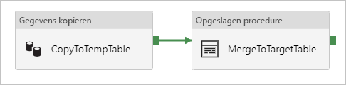
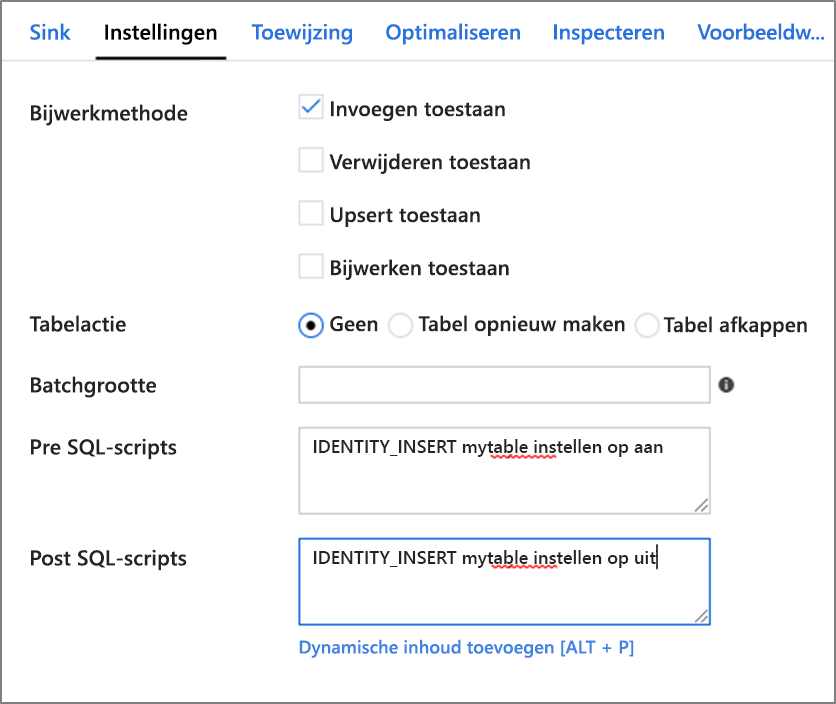

# <a name="copy-and-transform-data-in-azure-sql-database-by-using-azure-data-factory"></a>Gegevens in Azure SQL Database kopiëren en transformeren met behulp van Azure Data Factory

> [!div class="op_single_selector" title1="Selecteer de versie van Azure Data Factory die u gebruikt:"]
>
> - [Versie 1:](v1/data-factory-azure-sql-connector.md)
> - [Huidige versie](connector-azure-sql-database.md)

[!INCLUDE[appliesto-adf-asa-md](includes/appliesto-adf-asa-md.md)]

In dit artikel wordt beschreven hoe u de Kopieer activiteit in Azure Data Factory kunt gebruiken om gegevens te kopiëren van en naar Azure SQL Database, en om gegevens in Azure SQL Database te transformeren met behulp van gegevens stromen. Lees het [artikel Inleiding](introduction.md)voor meer informatie over Azure Data Factory.

## <a name="supported-capabilities"></a>Ondersteunde mogelijkheden

Deze Azure SQL Database-Connector wordt ondersteund voor de volgende activiteiten:

- De tabel [copy-activiteit](copy-activity-overview.md) met een [ondersteunde bron/Sink-matrix](copy-activity-overview.md)
- [Gegevens stroom toewijzen](concepts-data-flow-overview.md)
- [Activiteit Lookup](control-flow-lookup-activity.md)
- [GetMetadata-activiteit](control-flow-get-metadata-activity.md)

Voor kopieer activiteit ondersteunt deze Azure SQL Database-Connector de volgende functies:

- Kopiëren van gegevens met behulp van SQL-verificatie en Azure Active Directory (Azure AD) verificatie van het toepassings token met een service-principal of beheerde identiteiten voor Azure-resources.
- Als bron, waarbij gegevens worden opgehaald met behulp van een SQL-query of een opgeslagen procedure. U kunt er ook voor kiezen om een parallelle kopie te kopiëren van een Azure SQL Database bron. Zie de sectie [parallelle kopie van SQL database](#parallel-copy-from-sql-database) voor meer informatie.
- Als sink wordt er automatisch een doel tabel gemaakt als deze niet bestaat op basis van het bron schema. het toevoegen van gegevens aan een tabel of het aanroepen van een opgeslagen procedure met aangepaste logica tijdens het kopiëren.

>[!NOTE]
> Azure SQL Database [Always encrypted](https://docs.microsoft.com/sql/relational-databases/security/encryption/always-encrypted-database-engine?view=azuresqldb-current) wordt nu niet ondersteund door deze connector. U kunt een [algemene ODBC-Connector](connector-odbc.md) en een SQL Server ODBC-stuur programma gebruiken via een zelf-hostende Integration runtime. Meer informatie over het [gebruik van always encrypted](#using-always-encrypted) sectie. 

> [!IMPORTANT]
> Als u gegevens kopieert met behulp van de Azure Integration runtime, configureert u een [firewall regel op server niveau](https://docs.microsoft.com/azure/sql-database/sql-database-firewall-configure) zodat Azure-Services toegang hebben tot de server.
> Als u gegevens kopieert met behulp van een zelf-hostende Integration runtime, moet u de firewall zo configureren dat het juiste IP-bereik is toegestaan. Dit bereik bevat het IP-adres van de computer dat wordt gebruikt om verbinding te maken met Azure SQL Database.

## <a name="get-started"></a>Aan de slag

[!INCLUDE [data-factory-v2-connector-get-started](../../includes/data-factory-v2-connector-get-started.md)]

De volgende secties bevatten informatie over eigenschappen die worden gebruikt voor het definiëren van Azure Data Factory entiteiten die specifiek zijn voor een Azure SQL Database-Connector.

## <a name="linked-service-properties"></a>Eigenschappen van gekoppelde service

Deze eigenschappen worden ondersteund voor een Azure SQL Database gekoppelde service:

| Eigenschap | Beschrijving | Vereist |
|:--- |:--- |:--- |
| type | De eigenschap **type** moet worden ingesteld op **AzureSqlDatabase**. | Ja |
| Verbindings | Geef de gegevens op die nodig zijn om verbinding te maken met het Azure SQL Database-exemplaar voor de **Connections Tring** -eigenschap. <br/>U kunt ook een wacht woord of Service-Principal-sleutel in Azure Key Vault plaatsen. Als de SQL-verificatie wordt uitgevoerd, haalt u de `password` configuratie uit het Connection String. Zie voor meer informatie het JSON-voor beeld dat volgt op de tabel en [referenties opslaan in azure Key Vault](store-credentials-in-key-vault.md). | Ja |
| servicePrincipalId | Geef de client-ID van de toepassing op. | Ja, wanneer u Azure AD-verificatie gebruikt met een Service-Principal |
| servicePrincipalKey | Geef de sleutel van de toepassing op. Markeer dit veld als **SecureString** om het veilig op te slaan in azure Data Factory of om te [verwijzen naar een geheim dat is opgeslagen in azure Key Vault](store-credentials-in-key-vault.md). | Ja, wanneer u Azure AD-verificatie gebruikt met een Service-Principal |
| tenant | Geef de Tenant gegevens op, zoals de domein naam of Tenant-ID, waaronder uw toepassing zich bevindt. U kunt deze ophalen door de muis in de rechter bovenhoek van de Azure Portal aan te wijzen. | Ja, wanneer u Azure AD-verificatie gebruikt met een Service-Principal |
| azureCloudType | Voor Service-Principal-verificatie geeft u het type van de Azure-cloud omgeving op waarvoor uw AAD-toepassing is geregistreerd. <br/> Toegestane waarden zijn **AzurePublic**, **AzureChina**, **AzureUsGovernment**en **AzureGermany**. De cloud omgeving van de data factory wordt standaard gebruikt. | Nee |
| connectVia | Deze [Integration runtime](concepts-integration-runtime.md) wordt gebruikt om verbinding te maken met het gegevens archief. U kunt de Azure Integration runtime of een zelf-hostende Integration runtime gebruiken als uw gegevens archief zich in een particulier netwerk bevindt. Als dat niet is opgegeven, wordt de standaard Azure Integration runtime gebruikt. | Nee |

Raadpleeg de volgende secties over respectievelijk de vereisten en JSON-voor beelden voor verschillende verificatie typen:

- [SQL-verificatie](#sql-authentication)
- [Verificatie van Azure AD-toepassings token: Service-Principal](#service-principal-authentication)
- [Verificatie van Azure AD-toepassings tokens: beheerde identiteiten voor Azure-resources](#managed-identity)

>[!TIP]
>Als u op een fout met de fout code ' UserErrorFailedToConnectToSqlServer ' en een bericht ziet dat de sessie limiet voor de data base XXX is en is bereikt, voegt u toe `Pooling=false` aan uw Connection String en probeert u het opnieuw.

### <a name="sql-authentication"></a>SQL-verificatie

**Voor beeld: SQL-verificatie gebruiken**

```json
{
    "name": "AzureSqlDbLinkedService",
    "properties": {
        "type": "AzureSqlDatabase",
        "typeProperties": {
            "connectionString": "Data Source=tcp:<servername>.database.windows.net,1433;Initial Catalog=<databasename>;User ID=<username>@<servername>;Password=<password>;Trusted_Connection=False;Encrypt=True;Connection Timeout=30"
        },
        "connectVia": {
            "referenceName": "<name of Integration Runtime>",
            "type": "IntegrationRuntimeReference"
        }
    }
}
```

**Voor beeld: wacht woord in Azure Key Vault**

```json
{
    "name": "AzureSqlDbLinkedService",
    "properties": {
        "type": "AzureSqlDatabase",
        "typeProperties": {
            "connectionString": "Data Source=tcp:<servername>.database.windows.net,1433;Initial Catalog=<databasename>;User ID=<username>@<servername>;Trusted_Connection=False;Encrypt=True;Connection Timeout=30",
            "password": {
                "type": "AzureKeyVaultSecret",
                "store": {
                    "referenceName": "<Azure Key Vault linked service name>",
                    "type": "LinkedServiceReference"
                },
                "secretName": "<secretName>"
            }
        },
        "connectVia": {
            "referenceName": "<name of Integration Runtime>",
            "type": "IntegrationRuntimeReference"
        }
    }
}
```

### <a name="service-principal-authentication"></a>Verificatie van service-principal

Voer de volgende stappen uit om een Azure AD-toepassings token verificatie op basis van een service-principal te gebruiken:

1. [Maak een Azure Active Directory-toepassing](../active-directory/develop/howto-create-service-principal-portal.md#register-an-application-with-azure-ad-and-create-a-service-principal) vanuit de Azure Portal. Noteer de naam van de toepassing en de volgende waarden die de gekoppelde service definiëren:

    - Toepassings-id
    - Toepassings sleutel
    - Tenant-id

2. [Richt een Azure Active Directory beheerder](../azure-sql/database/authentication-aad-configure.md#provision-azure-ad-admin-sql-database) in voor uw server op de Azure portal als u dit nog niet hebt gedaan. De Azure AD-beheerder moet een Azure AD-gebruiker of Azure AD-groep zijn, maar kan geen Service-Principal zijn. Deze stap wordt uitgevoerd. in de volgende stap kunt u een Azure AD-identiteit gebruiken om een Inge sloten database gebruiker voor de service-principal te maken.

3. [Maak Inge sloten database gebruikers](../azure-sql/database/authentication-aad-configure.md#create-contained-users-mapped-to-azure-ad-identities) voor de Service-Principal. Maak verbinding met de data base van of naar waarnaar u gegevens wilt kopiëren met behulp van hulpprogram ma's als SQL Server Management Studio, met een Azure AD-identiteit die ten minste een machtiging voor een gebruiker heeft gewijzigd. Voer de volgende T-SQL uit:
  
    ```sql
    CREATE USER [your application name] FROM EXTERNAL PROVIDER;
    ```

4. Verleen de Service-Principal machtigingen die voor SQL-gebruikers of anderen gelden. Voer de volgende code uit. Zie [dit document](https://docs.microsoft.com/sql/relational-databases/system-stored-procedures/sp-addrolemember-transact-sql?view=sql-server-2017)voor meer opties.

    ```sql
    ALTER ROLE [role name] ADD MEMBER [your application name];
    ```

5. Een Azure SQL Database gekoppelde service configureren in Azure Data Factory.

#### <a name="linked-service-example-that-uses-service-principal-authentication"></a>Voor beeld van een gekoppelde service die gebruikmaakt van Service-Principal-verificatie

```json
{
    "name": "AzureSqlDbLinkedService",
    "properties": {
        "type": "AzureSqlDatabase",
        "typeProperties": {
            "connectionString": "Data Source=tcp:<servername>.database.windows.net,1433;Initial Catalog=<databasename>;Connection Timeout=30",
            "servicePrincipalId": "<service principal id>",
            "servicePrincipalKey": {
                "type": "SecureString",
                "value": "<service principal key>"
            },
            "tenant": "<tenant info, e.g. microsoft.onmicrosoft.com>"
        },
        "connectVia": {
            "referenceName": "<name of Integration Runtime>",
            "type": "IntegrationRuntimeReference"
        }
    }
}
```

### <a name="managed-identities-for-azure-resources-authentication"></a><a name="managed-identity"></a>Beheerde identiteiten voor Azure-bronnen verificatie

Een data factory kan worden gekoppeld aan een [beheerde identiteit voor Azure-resources](data-factory-service-identity.md) die de specifieke Data Factory vertegenwoordigt. U kunt deze beheerde identiteit voor Azure SQL Database authenticatie gebruiken. De aangewezen Factory heeft toegang tot en kopiëren van gegevens van of naar uw data base met behulp van deze identiteit.

Voer de volgende stappen uit om beheerde identiteits verificatie te gebruiken.

1. [Richt een Azure Active Directory beheerder](../azure-sql/database/authentication-aad-configure.md#provision-azure-ad-admin-sql-database) in voor uw server op de Azure portal als u dit nog niet hebt gedaan. De Azure AD-beheerder kan een Azure AD-gebruiker of een Azure AD-groep zijn. Als u de groep toewijst met beheerde identiteit een beheerdersrol, slaat u stap 3 en 4 over. De beheerder heeft volledige toegang tot de data base.

2. [Inge sloten database gebruikers maken](../azure-sql/database/authentication-aad-configure.md#create-contained-users-mapped-to-azure-ad-identities) voor de Azure Data Factory beheerde identiteit. Maak verbinding met de data base van of naar waarnaar u gegevens wilt kopiëren met behulp van hulpprogram ma's als SQL Server Management Studio, met een Azure AD-identiteit die ten minste een machtiging voor een gebruiker heeft gewijzigd. Voer de volgende T-SQL uit:
  
    ```sql
    CREATE USER [your Data Factory name] FROM EXTERNAL PROVIDER;
    ```

3. Verleen de Data Factory beheerde identiteit de benodigde machtigingen zoals u dat normaal doet voor SQL-gebruikers en anderen. Voer de volgende code uit. Zie [dit document](https://docs.microsoft.com/sql/relational-databases/system-stored-procedures/sp-addrolemember-transact-sql?view=sql-server-2017)voor meer opties.

    ```sql
    ALTER ROLE [role name] ADD MEMBER [your Data Factory name];
    ```

4. Een Azure SQL Database gekoppelde service configureren in Azure Data Factory.

**Voorbeeld**

```json
{
    "name": "AzureSqlDbLinkedService",
    "properties": {
        "type": "AzureSqlDatabase",
        "typeProperties": {
            "connectionString": "Data Source=tcp:<servername>.database.windows.net,1433;Initial Catalog=<databasename>;Connection Timeout=30"
        },
        "connectVia": {
            "referenceName": "<name of Integration Runtime>",
            "type": "IntegrationRuntimeReference"
        }
    }
}
```

## <a name="dataset-properties"></a>Eigenschappen van gegevensset

Zie [gegevens sets](https://docs.microsoft.com/azure/data-factory/concepts-datasets-linked-services)voor een volledige lijst met secties en eigenschappen die beschikbaar zijn voor het definiëren van gegevens sets.

De volgende eigenschappen worden ondersteund voor Azure SQL Database-gegevensset:

| Eigenschap | Beschrijving | Vereist |
|:--- |:--- |:--- |
| type | De eigenschap **type** van de DataSet moet worden ingesteld op **AzureSqlTable**. | Ja |
| schema | De naam van het schema. |Nee voor bron, ja voor Sink  |
| table | De naam van de tabel/weer gave. |Nee voor bron, ja voor Sink  |
| tableName | De naam van de tabel/weer gave met schema. Deze eigenschap wordt ondersteund voor achterwaartse compatibiliteit. Gebruik en voor nieuwe werk `schema` belasting `table` . | Nee voor bron, ja voor Sink |

### <a name="dataset-properties-example"></a>Voor beeld van eigenschappen van gegevensset

```json
{
    "name": "AzureSQLDbDataset",
    "properties":
    {
        "type": "AzureSqlTable",
        "linkedServiceName": {
            "referenceName": "<Azure SQL Database linked service name>",
            "type": "LinkedServiceReference"
        },
        "schema": [ < physical schema, optional, retrievable during authoring > ],
        "typeProperties": {
            "schema": "<schema_name>",
            "table": "<table_name>"
        }
    }
}
```

## <a name="copy-activity-properties"></a>Eigenschappen van de kopieeractiviteit

Voor een volledige lijst met secties en eigenschappen die beschikbaar zijn voor het definiëren van activiteiten, Zie [pijp lijnen](concepts-pipelines-activities.md). In deze sectie vindt u een lijst met eigenschappen die worden ondersteund door de Azure SQL Database bron en Sink.

### <a name="azure-sql-database-as-the-source"></a>Azure SQL Database als bron

>[!TIP]
>Als u gegevens van Azure SQL Database efficiënt wilt laden met behulp van gegevens partitioneren, kunt u meer informatie uit de [parallelle kopie van SQL database](#parallel-copy-from-sql-database).

Als u gegevens wilt kopiëren uit Azure SQL Database, worden de volgende eigenschappen ondersteund in de sectie **bron** van de Kopieer activiteit:

| Eigenschap | Beschrijving | Vereist |
|:--- |:--- |:--- |
| type | De eigenschap **type** van de bron van de Kopieer activiteit moet zijn ingesteld op **AzureSqlSource**. Het type SqlSource wordt nog steeds ondersteund voor compatibiliteit met eerdere versies. | Ja |
| sqlReaderQuery | Deze eigenschap maakt gebruik van de aangepaste SQL-query om gegevens te lezen. Een voorbeeld is `select * from MyTable`. | Nee |
| sqlReaderStoredProcedureName | De naam van de opgeslagen procedure waarmee gegevens uit de bron tabel worden gelezen. De laatste SQL-instructie moet een instructie SELECT in de opgeslagen procedure zijn. | Nee |
| storedProcedureParameters | Para meters voor de opgeslagen procedure.<br/>Toegestane waarden zijn naam-of waardeparen. De namen en het hoofdletter gebruik van para meters moeten overeenkomen met de namen en de behuizing van de opgeslagen procedure parameters. | Nee |
| isolationLevel | Hiermee geeft u het vergrendelings gedrag van de trans actie voor de SQL-bron op. De toegestane waarden zijn: **ReadCommitted**, **ReadUncommitted**, **RepeatableRead**, **Serializable**, **snap shot**. Als u niets opgeeft, wordt het standaard isolatie niveau van de data base gebruikt. Raadpleeg [dit document](https://docs.microsoft.com/dotnet/api/system.data.isolationlevel) voor meer informatie. | Nee |
| partitionOptions | Hiermee geeft u de opties voor gegevens partities op die worden gebruikt voor het laden van gegevens uit Azure SQL Database. <br>Toegestane waarden zijn: **geen** (standaard), **PhysicalPartitionsOfTable** en **DynamicRange**.<br>Wanneer een partitie optie is ingeschakeld (dat wil zeggen, niet `None` ), is de mate van parallelle uitvoering om gegevens van een Azure SQL database gelijktijdig te laden, bepaald door de [`parallelCopies`](copy-activity-performance-features.md#parallel-copy) instelling van de Kopieer activiteit. | Nee |
| partitionSettings | Geef de groep van de instellingen voor het partitioneren van gegevens op. <br>Toep assen wanneer de partitie optie niet is `None` . | Nee |
| ***Onder `partitionSettings` :*** | | |
| partitionColumnName | Geef de naam op van de bron kolom **in geheel getal of datum/tijd-type** dat wordt gebruikt voor het partitioneren van het bereik voor parallelle kopieën. Als u niets opgeeft, wordt de index of de primaire sleutel van de tabel automatisch gedetecteerd en gebruikt als de partitie kolom.<br>Toep assen wanneer de partitie optie is `DynamicRange` . Als u een query gebruikt om de bron gegevens op te halen, Hook `?AdfDynamicRangePartitionCondition ` in de component WHERE. Zie de sectie [parallel kopiëren van SQL database](#parallel-copy-from-sql-database) voor een voor beeld. | Nee |
| partitionUpperBound | De maximum waarde van de partitie kolom voor het splitsen van het partitie bereik. Deze waarde wordt gebruikt om de partitie stride te bepalen, niet voor het filteren van de rijen in de tabel. Alle rijen in het tabel-of query resultaat worden gepartitioneerd en gekopieerd. Als deze optie niet is opgegeven, wordt de waarde automatisch gedetecteerd met de Kopieer activiteit.  <br>Toep assen wanneer de partitie optie is `DynamicRange` . Zie de sectie [parallel kopiëren van SQL database](#parallel-copy-from-sql-database) voor een voor beeld. | Nee |
| partitionLowerBound | De minimum waarde van de partitie kolom voor het splitsen van een partitie bereik. Deze waarde wordt gebruikt om de partitie stride te bepalen, niet voor het filteren van de rijen in de tabel. Alle rijen in het tabel-of query resultaat worden gepartitioneerd en gekopieerd. Als deze optie niet is opgegeven, wordt de waarde automatisch gedetecteerd met de Kopieer activiteit.<br>Toep assen wanneer de partitie optie is `DynamicRange` . Zie de sectie [parallel kopiëren van SQL database](#parallel-copy-from-sql-database) voor een voor beeld. | Nee |

**Punten om te noteren:**

- Als **sqlReaderQuery** is opgegeven voor **AzureSqlSource**, voert de Kopieer activiteit deze query uit op basis van de Azure SQL database bron om de gegevens op te halen. U kunt ook een opgeslagen procedure opgeven door **sqlReaderStoredProcedureName** en **storedProcedureParameters** op te geven als voor de opgeslagen procedure para meters worden gebruikt.
- Als u **sqlReaderQuery** of **sqlReaderStoredProcedureName**niet opgeeft, worden de kolommen die zijn gedefinieerd in de sectie ' Structure ' van de JSON van de gegevensset gebruikt voor het maken van een query. De query `select column1, column2 from mytable` wordt uitgevoerd op basis van Azure SQL database. Als de definitie van de gegevensset niet de structuur ' Structure ' bevat, worden alle kolommen geselecteerd in de tabel.

#### <a name="sql-query-example"></a>Voor beeld van SQL-query

```json
"activities":[
    {
        "name": "CopyFromAzureSQLDatabase",
        "type": "Copy",
        "inputs": [
            {
                "referenceName": "<Azure SQL Database input dataset name>",
                "type": "DatasetReference"
            }
        ],
        "outputs": [
            {
                "referenceName": "<output dataset name>",
                "type": "DatasetReference"
            }
        ],
        "typeProperties": {
            "source": {
                "type": "AzureSqlSource",
                "sqlReaderQuery": "SELECT * FROM MyTable"
            },
            "sink": {
                "type": "<sink type>"
            }
        }
    }
]
```

#### <a name="stored-procedure-example"></a>Voorbeeld van een opgeslagen procedure

```json
"activities":[
    {
        "name": "CopyFromAzureSQLDatabase",
        "type": "Copy",
        "inputs": [
            {
                "referenceName": "<Azure SQL Database input dataset name>",
                "type": "DatasetReference"
            }
        ],
        "outputs": [
            {
                "referenceName": "<output dataset name>",
                "type": "DatasetReference"
            }
        ],
        "typeProperties": {
            "source": {
                "type": "AzureSqlSource",
                "sqlReaderStoredProcedureName": "CopyTestSrcStoredProcedureWithParameters",
                "storedProcedureParameters": {
                    "stringData": { "value": "str3" },
                    "identifier": { "value": "$$Text.Format('{0:yyyy}', <datetime parameter>)", "type": "Int"}
                }
            },
            "sink": {
                "type": "<sink type>"
            }
        }
    }
]
```

### <a name="stored-procedure-definition"></a>Definitie van opgeslagen procedure

```sql
CREATE PROCEDURE CopyTestSrcStoredProcedureWithParameters
(
    @stringData varchar(20),
    @identifier int
)
AS
SET NOCOUNT ON;
BEGIN
     select *
     from dbo.UnitTestSrcTable
     where dbo.UnitTestSrcTable.stringData != stringData
    and dbo.UnitTestSrcTable.identifier != identifier
END
GO
```

### <a name="azure-sql-database-as-the-sink"></a>Azure SQL Database als Sink

> [!TIP]
> Meer informatie over het ondersteunde schrijf gedrag, configuraties en aanbevolen procedures voor het [laden van gegevens in Azure SQL database](#best-practice-for-loading-data-into-azure-sql-database).

Als u gegevens wilt kopiëren naar Azure SQL Database, worden de volgende eigenschappen ondersteund in het gedeelte **sink** van Kopieer activiteit:

| Eigenschap | Beschrijving | Vereist |
|:--- |:--- |:--- |
| type | De eigenschap **type** van de Sink voor kopieer activiteiten moet worden ingesteld op **AzureSqlSink**. Het type SqlSink wordt nog steeds ondersteund voor compatibiliteit met eerdere versies. | Ja |
| preCopyScript | Geef een SQL-query op voor het uitvoeren van de Kopieer activiteit voordat u gegevens naar Azure SQL Database schrijft. Het wordt slechts één keer per Kopieer bewerking aangeroepen. Gebruik deze eigenschap om de vooraf geladen gegevens op te schonen. | Nee |
| tableOption | Hiermee wordt aangegeven of [de Sink-tabel automatisch](copy-activity-overview.md#auto-create-sink-tables) moet worden gemaakt als deze niet bestaat op basis van het bron schema. <br>Het automatisch maken van tabellen wordt niet ondersteund wanneer Sink de opgeslagen procedure specificeert. <br>Toegestane waarden zijn: `none` (standaard), `autoCreate` . | Nee |
| sqlWriterStoredProcedureName | De naam van de opgeslagen procedure die definieert hoe bron gegevens in een doel tabel worden toegepast. <br/>Deze opgeslagen procedure wordt *per batch aangeroepen*. Voor bewerkingen die slechts één keer worden uitgevoerd en niets te doen met bron gegevens, bijvoorbeeld verwijderen of afkappen, gebruikt u de `preCopyScript` eigenschap.<br>Bekijk het voor beeld van [het aanroepen van een opgeslagen procedure vanuit een SQL-Sink](#invoke-a-stored-procedure-from-a-sql-sink). | Nee |
| storedProcedureTableTypeParameterName |De parameter naam van het tabel type dat is opgegeven in de opgeslagen procedure.  |Nee |
| sqlWriterTableType |De naam van het tabel type dat moet worden gebruikt in de opgeslagen procedure. Met de Kopieer activiteit worden de gegevens in een tijdelijke tabel met dit tabel type beschikbaar gemaakt. Met de opgeslagen procedure code kunt u vervolgens de gegevens samen voegen die worden gekopieerd met bestaande gegevens. |Nee |
| storedProcedureParameters |Para meters voor de opgeslagen procedure.<br/>Toegestane waarden zijn naam-en waardeparen. Namen en hoofdletter gebruik van para meters moeten overeenkomen met de namen en de behuizing van de opgeslagen procedure parameters. | Nee |
| writeBatchSize | Het aantal rijen dat *per batch*in de SQL-tabel moet worden ingevoegd.<br/> De toegestane waarde is een **geheel getal** (aantal rijen). Standaard bepaalt Azure Data Factory dynamisch de juiste Batch grootte op basis van de Rijgrootte. | Nee |
| writeBatchTimeout | De wacht tijd waarna de batch INSERT-bewerking moet worden voltooid voordat er een time-out optreedt.<br/> De toegestane waarde is **time span**. Een voor beeld is ' 00:30:00 ' (30 minuten). | Nee |
| disableMetricsCollection | Data Factory verzamelt metrische gegevens, zoals Azure SQL Database Dtu's voor het optimaliseren van Kopieer prestaties en aanbevelingen. Als u zich zorgen maakt over dit gedrag, geeft u `true` op dat u deze functie wilt uitschakelen. | Nee (standaard instelling `false` ) |

**Voor beeld 1: gegevens toevoegen**

```json
"activities":[
    {
        "name": "CopyToAzureSQLDatabase",
        "type": "Copy",
        "inputs": [
            {
                "referenceName": "<input dataset name>",
                "type": "DatasetReference"
            }
        ],
        "outputs": [
            {
                "referenceName": "<Azure SQL Database output dataset name>",
                "type": "DatasetReference"
            }
        ],
        "typeProperties": {
            "source": {
                "type": "<source type>"
            },
            "sink": {
                "type": "AzureSqlSink",
                "tableOption": "autoCreate",
                "writeBatchSize": 100000
            }
        }
    }
]
```

**Voor beeld 2: een opgeslagen procedure aanroepen tijdens het kopiëren**

Meer informatie over [het aanroepen van een opgeslagen procedure vanuit een SQL-Sink](#invoke-a-stored-procedure-from-a-sql-sink).

```json
"activities":[
    {
        "name": "CopyToAzureSQLDatabase",
        "type": "Copy",
        "inputs": [
            {
                "referenceName": "<input dataset name>",
                "type": "DatasetReference"
            }
        ],
        "outputs": [
            {
                "referenceName": "<Azure SQL Database output dataset name>",
                "type": "DatasetReference"
            }
        ],
        "typeProperties": {
            "source": {
                "type": "<source type>"
            },
            "sink": {
                "type": "AzureSqlSink",
                "sqlWriterStoredProcedureName": "CopyTestStoredProcedureWithParameters",
                "storedProcedureTableTypeParameterName": "MyTable",
                "sqlWriterTableType": "MyTableType",
                "storedProcedureParameters": {
                    "identifier": { "value": "1", "type": "Int" },
                    "stringData": { "value": "str1" }
                }
            }
        }
    }
]
```

## <a name="parallel-copy-from-sql-database"></a>Parallelle kopie van SQL database

De Azure SQL Database-Connector in de Kopieer activiteit biedt ingebouwde gegevens partities voor het parallel kopiëren van gegevens. U kunt opties voor gegevens partities vinden op het tabblad **bron** van de Kopieer activiteit.


Wanneer u gepartitioneerde kopie inschakelt, voert Kopieer activiteit parallelle query's uit op uw Azure SQL Database bron om gegevens per partitie te laden. De parallelle graad wordt bepaald door de [`parallelCopies`](copy-activity-performance-features.md#parallel-copy) instelling in de Kopieer activiteit. Als u bijvoorbeeld hebt ingesteld `parallelCopies` op vier, worden met Data Factory gelijktijdig vier query's gegenereerd en uitgevoerd op basis van uw opgegeven partitie optie en instellingen, en met elke query wordt een deel van de gegevens opgehaald uit uw Azure SQL database.

U wordt aangeraden om parallelle kopieën in te scha kelen met gegevens partities met name wanneer u grote hoeveel heden gegevens uit uw Azure SQL Database laadt. Hieronder vindt u de aanbevolen configuraties voor verschillende scenario's. Bij het kopiëren van gegevens naar gegevens opslag op basis van een bestand kunt u het beste naar een map schrijven als meerdere bestanden (Geef alleen de mapnaam op). in dat geval is de prestaties beter dan het schrijven naar één bestand.

| Scenario                                                     | Aanbevolen instellingen                                           |
| ------------------------------------------------------------ | ------------------------------------------------------------ |
| Volledige belasting van een grote tabel met fysieke partities.        | **Partitie optie**: fysieke partities van tabel. <br><br/>Tijdens de uitvoering worden de fysieke partities automatisch door Data Factory gedetecteerd en worden de gegevens gekopieerd op partities. |
| Volledige belasting van een grote tabel, zonder fysieke partities, met een geheel getal of datum/tijd-kolom voor het partitioneren van gegevens. | **Partitie opties**: partitie met dynamisch bereik.<br>**Partitie kolom** (optioneel): Geef de kolom op die wordt gebruikt om gegevens te partitioneren. Als u niets opgeeft, wordt de kolom index of primaire sleutel gebruikt.<br/>De **bovengrens van partities** en * * onderste gebonden partitie * * (optioneel): Geef op of u de partitie stride wilt bepalen. Dit is niet voor het filteren van de rijen in de tabel, alle rijen in de tabel worden gepartitioneerd en gekopieerd. Indien niet opgegeven, kopieer activiteit automatische detectie van de waarden.<br><br>Als uw partitie kolom ' ID ' bijvoorbeeld waarden bereik van 1 tot 100 heeft en u de ondergrens instelt op 20 en de bovengrens als 80, met parallelle kopie als 4, Data Factory worden gegevens opgehaald met vier partities-Id's in bereik <= 20, [21, 50], [51, 80] en >= 81, respectievelijk. |
| Laad een grote hoeveelheid gegevens met behulp van een aangepaste query, zonder fysieke partities, terwijl een kolom met een geheel getal of datum/tijd is voor het partitioneren van gegevens. | **Partitie opties**: partitie met dynamisch bereik.<br>**Query**: `SELECT * FROM <TableName> WHERE ?AdfDynamicRangePartitionCondition AND <your_additional_where_clause>` .<br>**Partitie kolom**: Geef de kolom op die wordt gebruikt om gegevens te partitioneren.<br>De **bovengrens** van de partitie en de **ondergrens** van de partitie (optioneel): Geef op of u de partitie-stride wilt bepalen. Dit is niet voor het filteren van de rijen in de tabel, alle rijen in het query resultaat worden gepartitioneerd en gekopieerd. Als deze optie niet is opgegeven, wordt de waarde automatisch gedetecteerd met de Kopieer activiteit.<br><br>Tijdens de uitvoering wordt Data Factory vervangen `?AdfRangePartitionColumnName` door de werkelijke kolom naam en het waardebereik voor elke partitie, en verzonden naar Azure SQL database. <br>Als uw partitie kolom ' ID ' bijvoorbeeld waarden bereik van 1 tot 100 heeft en u de ondergrens instelt op 20 en de bovengrens als 80, met parallelle kopie als 4, Data Factory worden gegevens opgehaald met vier partities-Id's in bereik <= 20, [21, 50], [51, 80] en >= 81, respectievelijk. |

Aanbevolen procedures voor het laden van gegevens met de optie partitie:

1. Kies een onderscheidende kolom als partitie kolom (zoals primaire sleutel of unieke sleutel) om te voor komen dat gegevens scheef trekken. 
2. Als de tabel een ingebouwde partitie heeft, gebruikt u partitie optie fysieke partities van tabel om betere prestaties te krijgen.  
3. Als u Azure Integration Runtime gebruikt om gegevens te kopiëren, kunt u grotere '[Data Integration units (DIU)](copy-activity-performance-features.md#data-integration-units)' (>4) instellen om meer computer bronnen te gebruiken. Controleer de toepasselijke scenario's.
4. "[Mate van kopiëren van parallellisme](copy-activity-performance-features.md#parallel-copy)" bepalen van de partitie nummers, het instellen van dit getal dat te groot is, voor de prestaties, het is raadzaam om dit aantal in te stellen als (DIU of het aantal zelf-hostende IR-knoop punten) * (2 tot 4).

**Voor beeld: volledige belasting van een grote tabel met fysieke partities**

```json
"source": {
    "type": "AzureSqlSource",
    "partitionOption": "PhysicalPartitionsOfTable"
}
```

**Voor beeld: query met een dynamische bereik partitie**

```json
"source": {
    "type": "AzureSqlSource",
    "query": "SELECT * FROM <TableName> WHERE ?AdfDynamicRangePartitionCondition AND <your_additional_where_clause>",
    "partitionOption": "DynamicRange",
    "partitionSettings": {
        "partitionColumnName": "<partition_column_name>",
        "partitionUpperBound": "<upper_value_of_partition_column (optional) to decide the partition stride, not as data filter>",
        "partitionLowerBound": "<lower_value_of_partition_column (optional) to decide the partition stride, not as data filter>"
    }
}
```

## <a name="best-practice-for-loading-data-into-azure-sql-database"></a>Aanbevolen procedure voor het laden van gegevens in Azure SQL Database

Wanneer u gegevens naar Azure SQL Database kopieert, hebt u mogelijk een ander schrijf gedrag nodig:

- [Toevoegen](#append-data): mijn bron gegevens hebben alleen nieuwe records.
- [Upsert](#upsert-data): mijn bron gegevens hebben zowel toevoegingen als updates.
- [Overschrijven](#overwrite-the-entire-table): Ik wil elke keer een hele dimensie tabel opnieuw laden.
- [Schrijven met aangepaste logica](#write-data-with-custom-logic): Ik heb extra verwerking nodig vóór de laatste invoeging in de doel tabel.

Raadpleeg de respectieve gedeelten over het configureren van Azure Data Factory en aanbevolen procedures.

### <a name="append-data"></a>Gegevens toevoegen

Het toevoegen van gegevens is het standaard gedrag van deze Azure SQL Database Sink-connector. Azure Data Factory voert een bulksgewijze invoer uit om uw tabel efficiënt te schrijven. U kunt de bron en Sink dienovereenkomstig configureren in de Kopieer activiteit.

### <a name="upsert-data"></a>Upsert-gegevens

**Optie 1:** Wanneer u een grote hoeveelheid gegevens te kopiëren hebt, kunt u alle records bulksgewijs laden in een faserings tabel met behulp van de Kopieer activiteit en vervolgens een opgeslagen procedure-activiteit uitvoeren om een instructie [Merge](https://docs.microsoft.com/sql/t-sql/statements/merge-transact-sql?view=azuresqldb-current) of insert/update toe te passen in één afbeelding. 

De Kopieer activiteit biedt momenteel geen systeem eigen ondersteuning voor het laden van gegevens in een tijdelijke data base-tabel. Er is een geavanceerde manier om deze in te stellen met een combi natie van meerdere activiteiten. Raadpleeg [Azure SQL database scenario's voor bulksgewijs Upsert optimaliseren](https://github.com/scoriani/azuresqlbulkupsert). Hieronder ziet u een voor beeld van het gebruik van een permanente tabel als fase ring.

In Azure Data Factory kunt u bijvoorbeeld een pijp lijn maken met een **Kopieer activiteit** die is gekoppeld aan een **opgeslagen procedure activiteit**. De eerste kopie kopieert gegevens uit uw bron archief naar een Azure SQL Database faserings tabel, bijvoorbeeld **UpsertStagingTable**, als de tabel naam in de gegevensset. Vervolgens roept de laatste een opgeslagen procedure aan om bron gegevens van de faserings tabel samen te voegen in de doel tabel en de faserings tabel op te schonen.



Definieer in uw data base een opgeslagen procedure met SAMENVOEG logica, zoals in het volgende voor beeld, dat verwijst naar de vorige opgeslagen procedure activiteit. Stel dat het doel de **marketing** tabel is met drie kolommen: **ProfileID**, **State**en **Category**. Voer de upsert uit op basis van de kolom **ProfileID** .

```sql
CREATE PROCEDURE [dbo].[spMergeData]
AS
BEGIN
   MERGE TargetTable AS target
   USING UpsertStagingTable AS source
   ON (target.[ProfileID] = source.[ProfileID])
   WHEN MATCHED THEN
      UPDATE SET State = source.State
    WHEN NOT matched THEN
       INSERT ([ProfileID], [State], [Category])
      VALUES (source.ProfileID, source.State, source.Category);
    TRUNCATE TABLE UpsertStagingTable
END
```

**Optie 2:** U kunt ervoor kiezen om [een opgeslagen procedure binnen de Kopieer activiteit](#invoke-a-stored-procedure-from-a-sql-sink)aan te roepen. Met deze benadering wordt elke batch (zoals bepaald door de `writeBatchSize` eigenschap) in de bron tabel uitgevoerd in plaats van bulksgewijs invoegen als de standaard benadering in de Kopieer activiteit.

**Optie 3:** U kunt [toewijzings gegevens stroom](#sink-transformation) gebruiken die ingebouwde methoden voor INSERT/upsert/update biedt.

### <a name="overwrite-the-entire-table"></a>De volledige tabel overschrijven

U kunt de eigenschap **preCopyScript** in de Sink van de Kopieer activiteit configureren. In dit geval voert Azure Data Factory voor elke Kopieer activiteit die wordt uitgevoerd eerst het script uit. Vervolgens wordt de kopie uitgevoerd om de gegevens in te voegen. Als u bijvoorbeeld de volledige tabel wilt overschrijven met de meest recente gegevens, geeft u een script op om eerst alle records te verwijderen voordat u de nieuwe gegevens uit de bron laadt.

### <a name="write-data-with-custom-logic"></a>Gegevens schrijven met aangepaste logica

De stappen voor het schrijven van gegevens met aangepaste logica zijn vergelijkbaar met die in de sectie [Upsert-gegevens](#upsert-data) . Wanneer u extra verwerking wilt Toep assen voordat de laatste invoeging van bron gegevens in de doel tabel, kunt u laden naar een faserings tabel en vervolgens de opgeslagen procedure-activiteit aanroepen of een opgeslagen procedure aanroepen in Sink voor kopieer activiteiten om gegevens toe te passen of door toewijzing van gegevens stroom te gebruiken.

## <a name="invoke-a-stored-procedure-from-a-sql-sink"></a><a name="invoke-a-stored-procedure-from-a-sql-sink"></a>Een opgeslagen procedure aanroepen vanuit een SQL-Sink

Wanneer u gegevens naar Azure SQL Database kopieert, kunt u ook een door de gebruiker opgegeven opgeslagen procedure met aanvullende para meters voor elke batch van de bron tabel configureren en aanroepen. De functie opgeslagen procedure maakt gebruik van [para meters met tabel waarden](https://msdn.microsoft.com/library/bb675163.aspx).

U kunt een opgeslagen procedure gebruiken wanneer ingebouwde Kopieer mechanismen het doel niet behouden. Een voor beeld hiervan is wanneer u een extra verwerking wilt Toep assen vóór het uiteindelijke invoegen van bron gegevens in de doel tabel. Sommige extra verwerkings voorbeelden zijn wanneer u kolommen wilt samen voegen, aanvullende waarden wilt opzoeken en in meer dan één tabel wilt invoegen.

In het volgende voor beeld ziet u hoe u een opgeslagen procedure gebruikt om een upsert te maken in een tabel in Azure SQL Database. Stel dat de invoer gegevens en de provinciale **marketing** tabel drie kolommen hebben: **ProfileID**, **State**en **Category**. Voer de upsert uit op basis van de kolom **ProfileID** en pas deze alleen toe voor een specifieke categorie met de naam ProductA.

1. Definieer in uw data base het tabel type met de naam **sqlWriterTableType**. Het schema van het tabel type is hetzelfde als het schema dat wordt geretourneerd door de invoer gegevens.

    ```sql
    CREATE TYPE [dbo].[MarketingType] AS TABLE(
        [ProfileID] [varchar](256) NOT NULL,
        [State] [varchar](256) NOT NULL,
        [Category] [varchar](256) NOT NULL
    )
    ```

2. Definieer in uw data base de opgeslagen procedure met de naam **sqlWriterStoredProcedureName**. De invoer gegevens van de opgegeven bron worden verwerkt en samen voegingen in de uitvoer tabel. De parameter naam van het tabel type in de opgeslagen procedure is hetzelfde als **TableName** gedefinieerd in de gegevensset.

    ```sql
    CREATE PROCEDURE spOverwriteMarketing @Marketing [dbo].[MarketingType] READONLY, @category varchar(256)
    AS
    BEGIN
    MERGE [dbo].[Marketing] AS target
    USING @Marketing AS source
    ON (target.ProfileID = source.ProfileID and target.Category = @category)
    WHEN MATCHED THEN
        UPDATE SET State = source.State
    WHEN NOT MATCHED THEN
        INSERT (ProfileID, State, Category)
        VALUES (source.ProfileID, source.State, source.Category);
    END
    ```

3. In Azure Data Factory definieert u de sectie **SQL-Sink** in de Kopieer activiteit als volgt:

    ```json
    "sink": {
        "type": "AzureSqlSink",
        "sqlWriterStoredProcedureName": "spOverwriteMarketing",
        "storedProcedureTableTypeParameterName": "Marketing",
        "sqlWriterTableType": "MarketingType",
        "storedProcedureParameters": {
            "category": {
                "value": "ProductA"
            }
        }
    }
    ```

## <a name="mapping-data-flow-properties"></a>Eigenschappen van gegevens stroom toewijzen

Wanneer gegevens worden getransformeerd in de toewijzing van gegevens stromen, kunt u tabellen lezen en ernaar schrijven vanuit Azure SQL Database. Zie voor meer informatie de [bron transformatie](data-flow-source.md) en [sink-trans](data-flow-sink.md) formatie in gegevens stromen toewijzen.

### <a name="source-transformation"></a>Bron transformatie

Instellingen die specifiek zijn voor Azure SQL Database, zijn beschikbaar op het tabblad **bron opties** van de bron transformatie.

**Invoer:** Selecteer of u uw bron op een tabel (equivalent van) wilt aanwijzen ```Select * from <table-name>``` of voer een aangepaste SQL-query in.

**Query**: als u in het invoer veld query selecteert, voert u een SQL-query in voor uw bron. Deze instelling overschrijft elke tabel die u in de gegevensset hebt gekozen. **Order by** -componenten worden hier niet ondersteund, maar u kunt een volledige Select from-instructie instellen. U kunt ook door de gebruiker gedefinieerde tabel functies gebruiken. **Select * from udfGetData ()** is een UDF in SQL die een tabel retourneert. Met deze query wordt een bron tabel geproduceerd die u in uw gegevens stroom kunt gebruiken. Het gebruik van query's is ook een uitstekende manier om rijen te verminderen voor het testen of voor Zoek opdrachten.

- SQL-voor beeld:```Select * from MyTable where customerId > 1000 and customerId < 2000```

**Batch grootte**: Voer een batch grootte in om grote hoeveel heden gegevens in Lees bewerkingen te segmenteren.

**Isolatie niveau**: de standaard waarde voor SQL-bronnen in de toewijzings gegevens stroom is niet-vastgelegd. U kunt het isolatie niveau hier wijzigen in een van deze waarden:

- Doorgevoerde lezen
- Lezen niet-doorgevoerd
- Herhaal bare Lees bewerking
- Serializable
- Geen (isolatie niveau negeren)


### <a name="sink-transformation"></a>Sink-trans formatie

Instellingen die specifiek zijn voor Azure SQL Database, zijn beschikbaar op het tabblad **instellingen** van de Sink-trans formatie.

**Update methode:** Hiermee wordt bepaald welke bewerkingen zijn toegestaan voor uw database bestemming. De standaard instelling is alleen invoegen toestaan. Als u rijen wilt bijwerken, upsert of verwijderen, moet u een alter-Row trans formatie voor deze acties labelen. Voor updates, upsert en verwijderen moet een sleutel kolom of-kolommen worden ingesteld om te bepalen welke rij moet worden gewijzigd.


De kolom naam die u als de sleutel opgeeft, wordt gebruikt door ADF als onderdeel van de volgende update, upsert, verwijderen. Daarom moet u een kolom kiezen die in de Sink-toewijzing voor komt. Als u de waarde niet naar deze sleutel kolom wilt schrijven, klikt u op "sleutel kolommen overs Laan".

**Tabel actie:** Hiermee wordt bepaald of alle rijen van de doel tabel opnieuw moeten worden gemaakt of verwijderd voordat er wordt geschreven.

- Geen: er wordt geen actie uitgevoerd voor de tabel.
- Opnieuw maken: de tabel wordt verwijderd en opnieuw gemaakt. Vereist als er dynamisch een nieuwe tabel wordt gemaakt.
- Afkappen: alle rijen uit de doel tabel worden verwijderd.

**Batch grootte**: bepaalt hoeveel rijen er worden geschreven in elke Bucket. Grotere batch grootten verbeteren de compressie en Optima Lise ring van het geheugen, maar er zijn geen uitzonde ringen in het geheugen bij het opslaan van gegevens.

**SQL-scripts vooraf en post**: Voer SQL-scripts met meerdere regels in die moeten worden uitgevoerd vóór (vóór verwerking) en nadat (na verwerking) gegevens naar uw Sink-Data Base worden geschreven



## <a name="data-type-mapping-for-azure-sql-database"></a>Toewijzing van gegevens type voor Azure SQL Database

Wanneer gegevens worden gekopieerd van of naar Azure SQL Database, worden de volgende toewijzingen gebruikt van Azure SQL Database gegevens typen om tussenliggende gegevens typen te Azure Data Factory. Zie [schema en gegevens type toewijzingen](copy-activity-schema-and-type-mapping.md)voor meer informatie over hoe de Kopieer activiteit het bron schema en het gegevens type aan de Sink koppelt.

| Azure SQL Database gegevens type | Azure Data Factory tussentijds gegevens type |
|:--- |:--- |
| bigint |Int64 |
| binair |Byte [] |
| bit |Booleaans |
| char |Teken reeks, char [] |
| date |DateTime |
| Datum/tijd |DateTime |
| datetime2 |DateTime |
| Date time offset |Date time offset |
| Decimal |Decimal |
| FILESTREAM-kenmerk (varbinary (max)) |Byte [] |
| Float |Dubbel |
| image |Byte [] |
| int |Int32 |
| money |Decimal |
| nchar |Teken reeks, char [] |
| ntext |Teken reeks, char [] |
| numeriek |Decimal |
| nvarchar |Teken reeks, char [] |
| werkelijk |Enkelvoudig |
| rowversion |Byte [] |
| smalldatetime |DateTime |
| smallint |Int16 |
| smallmoney |Decimal |
| sql_variant |Object |
| tekst |Teken reeks, char [] |
| tijd |TimeSpan |
| tijdstempel |Byte [] |
| tinyint |Byte |
| uniqueidentifier |Guid |
| varbinary |Byte [] |
| varchar |Teken reeks, char [] |
| xml |Tekenreeks |

>[!NOTE]
> Voor gegevens typen die worden toegewezen aan het type van de decimale waarde, wordt op dat moment de functie voor het kopiëren van de precisie ondersteund tot 28. Als u gegevens hebt die een grotere precisie hebben dan 28, kunt u overwegen om te converteren naar een teken reeks in SQL-query.

## <a name="lookup-activity-properties"></a>Eigenschappen van opzoek activiteit

Controleer de [opzoek activiteit](control-flow-lookup-activity.md)voor meer informatie over de eigenschappen.

## <a name="getmetadata-activity-properties"></a>Eigenschappen van GetMetadata-activiteit

Als u meer wilt weten over de eigenschappen, controleert u de [GetMetadata-activiteit](control-flow-get-metadata-activity.md)

## <a name="using-always-encrypted"></a>Always Encrypted gebruiken

Wanneer u gegevens kopieert van/naar Azure SQL Database met [Always encrypted](https://docs.microsoft.com/sql/relational-databases/security/encryption/always-encrypted-database-engine?view=azuresqldb-current), gebruikt u de [algemene ODBC-Connector](connector-odbc.md) en SQL Server ODBC-stuur programma via zelf-hostende Integration runtime. Deze Azure SQL Database-connector biedt geen ondersteuning voor Always Encrypted nu. 

Met name:

1. Stel een zelf-hostende Integration Runtime in als u er nog geen hebt. Zie [zelf-hostende Integration runtime](create-self-hosted-integration-runtime.md) artikel voor meer informatie.

2. Down load hier het 64-bits ODBC-stuur programma voor SQL Server en Installeer [Dit](https://docs.microsoft.com/sql/connect/odbc/download-odbc-driver-for-sql-server?view=azuresqldb-current)op de Integration runtime machine. Meer informatie over hoe dit stuur programma kan [Always encrypted gebruiken met het ODBC-stuur programma voor SQL Server](https://docs.microsoft.com/sql/connect/odbc/using-always-encrypted-with-the-odbc-driver?view=azuresqldb-current#using-the-azure-key-vault-provider).

3. Maak een gekoppelde service met een ODBC-type om verbinding te maken met uw SQL database. Raadpleeg de volgende voor beelden:

    - SQL- **verificatie**gebruiken: Geef de ODBC-Connection String op onder en selecteer **basis** verificatie om de gebruikers naam en het wacht woord in te stellen.

        ```
        Driver={ODBC Driver 17 for SQL Server};Server=<serverName>;Database=<databaseName>;ColumnEncryption=Enabled;KeyStoreAuthentication=KeyVaultClientSecret;KeyStorePrincipalId=<servicePrincipalKey>;KeyStoreSecret=<servicePrincipalKey>
        ```

    - **Data Factory beheerde identiteits verificatie**gebruiken: 

        1. Volg dezelfde [vereisten](#managed-identity) voor het maken van een database gebruiker voor de beheerde identiteit en het verlenen van de juiste rol in uw data base.
        2. Geef in gekoppelde service de ODBC-connection string op onder en selecteer **anonieme** verificatie als de connection string zelf aangeeft `Authentication=ActiveDirectoryMsi` .

        ```
        Driver={ODBC Driver 17 for SQL Server};Server=<serverName>;Database=<databaseName>;ColumnEncryption=Enabled;KeyStoreAuthentication=KeyVaultClientSecret;KeyStorePrincipalId=<servicePrincipalKey>;KeyStoreSecret=<servicePrincipalKey>; Authentication=ActiveDirectoryMsi;
        ```

4. Maak de gegevensset en kopieer activiteit met het ODBC-type dienovereenkomstig. Meer informatie in het artikel over [ODBC-connectors](connector-odbc.md) .

## <a name="next-steps"></a>Volgende stappen

Zie [ondersteunde gegevens archieven en-indelingen](copy-activity-overview.md#supported-data-stores-and-formats)voor een lijst met gegevens archieven die worden ondersteund als bronnen en sinks op basis van de Kopieer activiteit in azure Data Factory.
