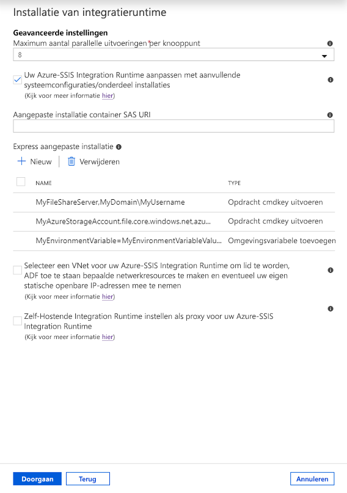

# <a name="create-an-azure-ssis-integration-runtime-in-azure-data-factory"></a>Een runtime voor Azure-SSIS-integratie maken in Azure Data Factory

[!INCLUDE[appliesto-adf-xxx-md](includes/appliesto-adf-xxx-md.md)]

In dit artikel vindt u stappen voor het inrichten van een SSIS-runtime (Azure-SQL Server Integration Services) (IR) in Azure Data Factory. Een Azure-SSIS IR ondersteunt:

- Uitvoeren van pakketten die zijn geïmplementeerd in de SSIS-catalogus (SSISDB) die worden gehost door een Azure SQL Database-server of een beheerde instantie (Project Deployment Model).
- Uitvoeren van pakketten die zijn geïmplementeerd in bestandssystemen, bestandsshares of Azure Files (Package Deployment Model). 

Nadat een Azure-SSIS IR is ingericht, u vertrouwde hulpprogramma's gebruiken om uw pakketten in Azure te implementeren en uit te voeren. Deze hulpprogramma's omvatten SQL Server Data Tools (SSDT), SQL Server `dtinstall`Management `dtutil`Studio `dtexec`(SSMS) en command-line tools zoals , en .

In [de zelfstudie Provisioning Azure-SSIS IR](tutorial-create-azure-ssis-runtime-portal.md) ziet u hoe u een Azure-SSIS IR maakt via de Azure-portal of de Data Factory-app. De zelfstudie laat ook zien hoe u optioneel een Azure SQL Database-server of beheerde instantie gebruiken om SSISDB te hosten. In dit artikel wordt uitgebreid met de zelfstudie en wordt beschreven hoe u deze optionele taken uitvoeren:

- Gebruik een Azure SQL Database-server met IP-firewallregels/eindpunten voor virtuele netwerkservices of een beheerde instantie met privéeindpunt om SSISDB te hosten. Als voorwaarde moet u virtuele netwerkmachtigingen en -instellingen configureren voor uw Azure-SSIS IR om lid te worden van een virtueel netwerk.

- Azure Active Directory-verificatie (Azure AD) gebruiken met de beheerde identiteit voor uw gegevensfabriek om verbinding te maken met een Azure SQL Database-server of beheerde instantie. Als voorwaarde moet u de beheerde identiteit voor uw gegevensfabriek toevoegen als een databasegebruiker die een SSISDB-exemplaar kan maken.

- Sluit uw Azure-SSIS IR aan bij een virtueel netwerk of configureer een zelf gehoste IR als proxy voor uw Azure-SSIS IR om on-premises toegang te krijgen tot gegevens.

In dit artikel ziet u hoe u een Azure-SSIS IR indient met behulp van de Azure-portal, Azure PowerShell en een Azure Resource Manager-sjabloon.

## <a name="prerequisites"></a>Vereisten

[!INCLUDE [updated-for-az](../../includes/updated-for-az.md)]

- **Azure-abonnement**. Als je nog geen abonnement hebt, kun je een [gratis proefaccount](https://azure.microsoft.com/pricing/free-trial/) aanmaken.

- **Azure SQL Database-server of beheerde instantie (optioneel)**. Als u nog geen databaseserver hebt, maakt u die in Azure Portal voordat u begint. Data Factory maakt op zijn beurt een SSISDB-exemplaar op deze databaseserver. 

  Het wordt aangeraden om de databaseserver in dezelfde Azure-regio te maken als de Integration Runtime. Met deze configuratie kan de uitvoering van de integratieruntime worden opgeslagen in SSISDB zonder Azure-regio's te overschrijden.

  Houd rekening met deze punten:

  - Op basis van de geselecteerde databaseserver kan de SSISDB-instantie namens u worden gemaakt als één database, als onderdeel van een elastische groep of in een beheerde instantie. Het kan toegankelijk zijn in een openbaar netwerk of door lid te worden van een virtueel netwerk. Zie de [sectie Enkele database van Een Azure SQL Database, elastische pool en beheerde instantie](#comparison-of-a-sql-database-single-database-elastic-pool-and-managed-instance) vergelijken in dit artikel voor richtlijnen voor het kiezen van het type databaseserver om SSISDB te hosten. 
  
    Als u een Azure SQL Database-server met IP-firewallregels/eindpunten voor virtuele netwerkservices of een beheerde instantie met privéeindpunt gebruikt om SSISDB te hosten, of als u toegang nodig hebt tot on-premises gegevens zonder een zelf gehoste IR te configureren, moet u uw Azure-SSIS IR aansluiten bij een virtueel netwerk. Zie [Een Azure-SSIS IR deelnemen aan een virtueel netwerk](https://docs.microsoft.com/azure/data-factory/join-azure-ssis-integration-runtime-virtual-network)voor meer informatie.

  - Controleer of de instelling **Toegang tot Azure-services toestaan** is ingeschakeld voor de databaseserver. Deze instelling is niet van toepassing wanneer u een Azure SQL Database-server gebruikt met IP-firewallregels/eindpunten voor virtuele netwerkservices of een beheerde instantie met privéeindpunt om SSISDB te hosten. Zie [Secure your Azure SQL database](../sql-database/sql-database-security-tutorial.md#create-firewall-rules) (Azure SQL-database beveiligen) voor meer informatie. Zie [New-AzSqlServerFirewallRule](/powershell/module/az.sql/new-azsqlserverfirewallrule)om deze instelling in te schakelen met PowerShell.

  - Voeg het IP-adres van de clientmachine of een reeks IP-adressen die het IP-adres van de clientmachine bevat, toe aan de lijst met client-IP-adres in de firewall-instellingen voor de databaseserver. Zie [Overzicht van firewallregels op Azure SQL Database-serverniveau en -databaseniveau](../sql-database/sql-database-firewall-configure.md) voor meer informatie.

  - U verbinding maken met de databaseserver door SQL-verificatie te gebruiken met uw serverbeheerdersreferenties of door Azure AD-verificatie te gebruiken met de beheerde identiteit voor uw gegevensfabriek. Voor dit laatste moet u de beheerde identiteit van uw gegevensfabriek toevoegen aan een Azure AD-groep met toegangsmachtigingen voor de databaseserver. Zie [Azure AD-verificatie inschakelen voor een Azure-SSIS IR voor](https://docs.microsoft.com/azure/data-factory/enable-aad-authentication-azure-ssis-ir)meer informatie.

  - Controleer of uw databaseserver nog geen SSISDB-exemplaar heeft. De inrichting van een Azure-SSIS IR biedt geen ondersteuning voor het gebruik van een bestaand SSISDB-exemplaar.

- **Azure Resource Manager virtueel netwerk (optioneel).** U moet een virtueel Azure Resource Manager-netwerk hebben als ten minste één van de volgende voorwaarden waar is:
  - U host SSISDB op een Azure SQL Database-server met IP-firewallregels/eindpunten voor virtuele netwerkservices of een beheerde instantie met privéeindpunt.
  - U wilt verbinding maken met on-premises gegevensarchieven van SSIS-pakketten die worden uitgevoerd op uw Azure-SSIS IR zonder een zelf gehoste IR te configureren.

- **Azure PowerShell (optioneel)**. Volg de instructies in [Het installeren en configureren van Azure PowerShell](/powershell/azure/install-az-ps)als u een PowerShell-script wilt uitvoeren om uw Azure-SSIS IR in te richten.

### <a name="regional-support"></a>Regionale ondersteuning

Zie [Gegevensfabriek en SSIS IR beschikbaarheid per regio](https://azure.microsoft.com/global-infrastructure/services/?products=data-factory&regions=all)voor een lijst met Azure-regio's en een Azure-SSIS IR.

### <a name="comparison-of-a-sql-database-single-database-elastic-pool-and-managed-instance"></a>Vergelijking van een enkele database van SQL Database, een elastische pool en beheerde instantie

In de volgende tabel worden bepaalde functies van een Azure SQL Database-server en beheerde instantie vergeleken met betrekking tot Azure-SSIR IR:

| Functie | Enkele database/elastische groep| Beheerd exemplaar |
|---------|--------------|------------------|
| **Planning** | De SQL Server Agent is niet beschikbaar.<br/><br/>Zie [Een pakketuitvoering plannen in een datafabriekpijplijn](https://docs.microsoft.com/sql/integration-services/lift-shift/ssis-azure-schedule-packages?view=sql-server-2017#activity).| De agent Beheerde instantie is beschikbaar. |
| **Verificatie** | U een SSISDB-exemplaar maken met een opgenomen databasegebruiker die een Azure AD-groep vertegenwoordigt met de beheerde identiteit van uw gegevensfabriek als lid in de **db_owner** rol.<br/><br/>Zie [Azure AD-verificatie inschakelen om een SSISDB-exemplaar te maken op een Azure SQL Database-server.](enable-aad-authentication-azure-ssis-ir.md#enable-azure-ad-on-azure-sql-database) | U een SSISDB-exemplaar maken met een opgenomen databasegebruiker die de beheerde identiteit van uw gegevensfabriek vertegenwoordigt. <br/><br/>Zie [Azure AD-verificatie inschakelen om een SSISDB-exemplaar te maken in een azure SQL Database-beheerde instantie](enable-aad-authentication-azure-ssis-ir.md#enable-azure-ad-on-azure-sql-database-managed-instance). |
| **Servicelaag** | Wanneer u een Azure-SSIS IR maakt met uw Azure SQL Database-server, u de servicelaag voor SSISDB selecteren. Er zijn meerdere servicelagen. | Wanneer u een Azure-SSIS IR maakt met uw beheerde instantie, u de servicelaag voor SSISDB niet selecteren. Alle databases in uw beheerde instantie delen dezelfde bron die aan die instantie is toegewezen. |
| **Virtueel netwerk** | Uw Azure-SSIS IR kan lid worden van een virtueel Azure Resource Manager-netwerk als u een Azure SQL Database-server met IP-firewallregels/eindpunten voor virtuele netwerkservice gebruikt. | Uw Azure-SSIS IR kan lid worden van een virtueel Azure Resource Manager-netwerk als u een beheerde instantie met privéeindpunt gebruikt. Het virtuele netwerk is vereist wanneer u geen openbaar eindpunt voor uw beheerde instantie inschakelt.<br/><br/>Als u uw Azure-SSIS IR aansluit bij hetzelfde virtuele netwerk als uw beheerde instantie, controleert u of uw Azure-SSIS IR zich in een ander subnet bevindt dan uw beheerde instantie. Als u uw Azure-SSIS IR aansluit bij een ander virtueel netwerk dan uw beheerde instantie, raden we u aan een virtuele netwerkpeering of een netwerk-naar-netwerkverbinding te maken. Zie [Uw toepassing verbinden met een azure SQL Database-beheerde instantie](../sql-database/sql-database-managed-instance-connect-app.md). |
| **Gedistribueerde transacties** | Deze functie wordt ondersteund door elastische transacties. Msdtc-transacties (Microsoft Distributed Transaction Coordinator) worden niet ondersteund. Als uw SSIS-pakketten MSDTC gebruiken om gedistribueerde transacties te coördineren, u overwegen te migreren naar elastische transacties voor Azure SQL Database. Zie [Gedistribueerde transacties over clouddatabases voor](../sql-database/sql-database-elastic-transactions-overview.md)meer informatie. | Wordt niet ondersteund. |
| | | |

## <a name="use-the-azure-portal-to-create-an-integration-runtime"></a>De Azure-portal gebruiken om een runtime voor integratie te maken

In deze sectie gebruikt u de Azure-portal, met name de gebruikersinterface (UI) of de app Data Factory, om een Azure-SSIS IR te maken.

### <a name="create-a-data-factory"></a>Een gegevensfactory maken

Als u uw gegevensfabriek wilt maken via de Azure-portal, volgt u de stapsgewijze instructies in [Een gegevensfabriek maken via de gebruikersinterface.](https://docs.microsoft.com/azure/data-factory/quickstart-create-data-factory-portal#create-a-data-factory) Selecteer **Vastmaken aan** het dashboard terwijl u dit doet, zodat u snel toegang krijgen na het maken ervan. 

Nadat uw gegevensfabriek is gemaakt, opent u de overzichtspagina in de Azure-portal. Selecteer de tegel **Auteur & monitor** om de pagina Laten **beginnen** op een apart tabblad te openen. Daar u uw Azure-SSIS IR blijven maken.   

### <a name="provision-an-azure-ssis-integration-runtime"></a>Een Azure-SSIS-integratieruntime inrichten

1. Selecteer op de pagina **Aan de slag** de tegel **SSIS-integratieruntime configureren**.

   

1. Voer in het gedeelte **Algemene instellingen** van het deelvenster Instellingen voor **integratie runtime-instellingen** de volgende stappen uit.

   

   1. Voer bij **Naam** de naam van de integratieruntime in.

   1. Voer bij **beschrijving** de beschrijving van de integratieruntime in.

   1. Selecteer bij **Locatie** de locatie voor de integratieruntime. Alleen ondersteunde locaties worden weergegeven. We raden u aan dezelfde locatie van uw databaseserver te selecteren voor het hosten van SSISDB.

   1. Selecteer **voor knooppuntgrootte**de grootte van het knooppunt in uw runtimecluster voor integratie. Alleen ondersteunde knooppuntgrootten worden weergegeven. Selecteer een grote knooppuntgrootte (opschalen) als u veel rekenintensieve of geheugenintensieve pakketten wilt uitvoeren.

   1. Selecteer bij **Aantal knooppunten** het aantal knooppunten in het integratieruntimecluster. Alleen ondersteunde knooppuntaantallen worden weergegeven. Selecteer een groot cluster met veel knooppunten (uitschalen) als u veel pakketten parallel wilt uitvoeren.

   1. Selecteer voor **Edition/License**de SQL Server-editie voor uw inburgeringsruntime: Standard of Enterprise. Selecteer Enterprise als u geavanceerde functies wilt gebruiken in uw inburgeringsruntime.

   1. Selecteer voor **geld besparen**de azure hybrid benefit-optie voor uw ingebruiksruntime voor integratie: **ja** of **nee.** Selecteer **Ja** als u uw eigen SQL Server-licentie met Software Assurance wilt meenemen om te profiteren van kostenbesparingen bij hybride gebruik.

   1. Selecteer **Next**.

1. Voer in de sectie **SQL-instellingen** de volgende stappen uit.

   

   1. Schakel het selectievakje **SSIS-catalogus (SSISDB) maken dat wordt gehost door Azure SQL Database server/Managed Instance in om het selectievakje Projecten/pakketten/omgevingen/uitvoeringslogboeken op te slaan** om het implementatiemodel te kiezen voor pakketten die op uw Azure-SSIS IR moeten worden uitgevoerd. U kiest het ProjectDeployment-model waarbij pakketten worden geïmplementeerd in SSISDB dat wordt gehost door uw databaseserver, of het pakketimplementatiemodel waarbij pakketten worden geïmplementeerd in bestandssystemen, bestandsshares of Azure-bestanden. 
    
      Als u het selectievakje inschakelt, moet u uw eigen databaseserver meenemen om het SSISDB-exemplaar te hosten dat we namens u maken en beheren.
   
      1. Selecteer bij **Abonnement** het Azure-abonnement dat uw databaseserver heeft voor het hosten van SSISDB. 

      1. Selecteer bij **Locatie** de locatie van uw databaseserver voor het hosten van SSISDB. We raden u aan dezelfde locatie van uw integratieruntime te selecteren. 

      1. Selecteer bij het **Eindpunt voor de Catalog-databaseserver** het eindpunt van uw databaseserver voor het hosten van SSISDB. 
    
         Op basis van de geselecteerde databaseserver kan de SSISDB-instantie namens u worden gemaakt als één database, als onderdeel van een elastische groep of in een beheerde instantie. Het kan toegankelijk zijn in een openbaar netwerk of door lid te worden van een virtueel netwerk. Zie de [sectie Enkele database van Een Azure SQL Database, elastische pool en beheerde instantie](#comparison-of-a-sql-database-single-database-elastic-pool-and-managed-instance) vergelijken in dit artikel voor richtlijnen voor het kiezen van het type databaseserver om SSISDB te hosten. 
    
         Als u een Azure SQL Database-server selecteert met IP-firewallregels/eindpunten voor virtuele netwerkservices of een beheerde instantie met een privéeindpunt om SSISDB te hosten, of als u toegang nodig hebt tot on-premises gegevens zonder een zelf gehoste IR te configureren, moet u uw Azure-SSIS IR aansluiten bij een virtueel netwerk. Zie [Een Azure-SSIS IR deelnemen aan een virtueel netwerk](https://docs.microsoft.com/azure/data-factory/join-azure-ssis-integration-runtime-virtual-network)voor meer informatie. 

      1. Schakel het selectievakje **AAD-verificatie gebruiken met de beheerde identiteit voor uw ADF** in om de verificatiemethode voor uw databaseserver te kiezen om SSISDB te hosten. U kiest SQL-verificatie of Azure AD-verificatie met de beheerde identiteit voor uw gegevensfabriek. 
    
         Als u het selectievakje inschakelt, moet u de beheerde identiteit van uw gegevensfabriek toevoegen aan een Azure AD-groep met toegangsmachtigingen aan uw databaseserver. Zie [Azure AD-verificatie inschakelen voor een Azure-SSIS IR voor](https://docs.microsoft.com/azure/data-factory/enable-aad-authentication-azure-ssis-ir)meer informatie. 

      1. Voer voor **gebruikersnaam voor beheerders**de SQL-verificatiegebruikersnaam in voor uw databaseserver om SSISDB te hosten. 

      1. Voer voor **beheerderswachtwoord**het SQL-verificatiewachtwoord in voor uw databaseserver om SSISDB te hosten. 

      1. Selecteer **voor Catalog Database Service Tier**de servicelaag voor uw databaseserver om SSISDB te hosten. Selecteer de laag Basic, Standard of Premium of selecteer een elastische poolnaam. 

      1. Selecteer **Testverbinding**. Als de test is geslaagd, selecteert u **Volgende**. 

1. Voer in de sectie **Geavanceerde instellingen** de volgende stappen uit.

   

   1. Selecteer **voor maximale parallelle uitvoeringen per knooppunt**het maximum aantal pakketten dat gelijktijdig per knooppunt in uw runtimecluster voor integratie moet worden uitgevoerd. Alleen ondersteunde pakketaantallen worden weergegeven. Selecteer een laag getal als u meer dan één kern wilt gebruiken om één groot pakket uit te voeren dat reken- of geheugenintensief is. Selecteer een hoog getal als u een of meer kleine pakketten in één kern wilt uitvoeren.

   1. Schakel het selectievakje **Runtime voor Azure-SSIS-integratie aanpassen met extra systeemconfiguraties/componentinstallaties** in om te kiezen of u aangepaste standaard-/expres-instellingen wilt toevoegen aan uw Azure-SSIS IR. Zie [Aangepaste installatie voor een Azure-SSIS IR voor](https://docs.microsoft.com/azure/data-factory/how-to-configure-azure-ssis-ir-custom-setup)meer informatie.

      Voer de volgende stappen uit als u het selectievakje inschakelt.

      
   
      1. Voer voor **Aangepaste installatiecontainer SAS URI**de SAS URI van uw container in waar u scripts en bijbehorende bestanden opslaat voor standaard aangepaste instellingen.

      1. Selecteer voor **aangepaste instelling Express**de optie **Nieuw** om het **aangepaste installatiepaneel Express toevoegen** te openen en selecteer vervolgens alle typen onder het vervolgkeuzemenu express aangepast **instellingstype,** bijvoorbeeld **Opdracht Cmdkey uitvoeren,** **Omgevingsvariabele toevoegen,** **Component met licentie installeren,** enz.

         Als u het type **component met installatie selecteert,** u vervolgens geïntegreerde onderdelen van onze ISV-partners selecteren onder het vervolgkeuzemenu **Componentnaam** en voert u indien nodig de productlicentiesleutel in die u bij hen hebt gekocht in het veld **Licentiesleutel.**
  
         Uw aangepaste express-instellingen worden weergegeven in de sectie **Geavanceerde instellingen.** Als u ze wilt verwijderen, u de selectievakjes selecteren en vervolgens **Verwijderen**selecteren.

   1. Schakel **het selectievakje Een VNet selecteren in voor uw Azure-SSIS-integratieruntime om lid te worden, ADF in staat te stellen bepaalde netwerkbronnen te maken en optioneel uw eigen statische openbare IP-adressen mee** te nemen om te kiezen of u wilt deelnemen aan uw inlooptijd voor integratie naar een virtueel netwerk. 

      Selecteer deze als u een Azure SQL Database-server gebruikt met IP-firewallregels/eindpunten voor virtuele netwerkservices of een beheerde instantie met privéeindpunt om SSISDB te hosten, of als u toegang nodig hebt tot on-premises gegevens (dat wil zeggen dat u on-premises gegevensbronnen of -bestemmingen in uw SSIS-pakketten hebt) zonder een zelf gehoste IR te configureren. Zie [Azure-SSIS IR aansluiten bij een virtueel netwerk](https://docs.microsoft.com/azure/data-factory/join-azure-ssis-integration-runtime-virtual-network)voor meer informatie. 

      Voer de volgende stappen uit als u het selectievakje inschakelt.

      

      1. Selecteer **bij Abonnement**het Azure-abonnement met uw virtuele netwerk.

      1. Voor **Locatie**is dezelfde locatie van uw intredetijd voor integratie geselecteerd.

      1. Selecteer **bij Type**het type van uw virtuele netwerk: klassiek of Azure Resource Manager. We raden u aan een virtueel Azure Resource Manager-netwerk te selecteren, omdat klassieke virtuele netwerken binnenkort worden afgeschaft.

      1. Selecteer voor **VNet-naam**de naam van uw virtuele netwerk. Het moet dezelfde zijn die wordt gebruikt voor uw Azure SQL Database-server met eindpunten voor virtuele netwerkservices of beheerde instantie met privéeindpunt om SSISDB te hosten. Of het moet dezelfde zijn die is aangesloten op uw on-premises netwerk. Anders kan het elk virtueel netwerk zijn om uw eigen statische openbare IP-adressen voor Azure-SSIS IR mee te nemen.

      1. Selecteer **bij Subnet Name**de naam van subnet voor uw virtuele netwerk. Het moet dezelfde zijn die wordt gebruikt voor uw Azure SQL Database-server met eindpunten voor virtuele netwerkservice om SSISDB te hosten. Of het moet een ander subnet zijn dan het subnet dat wordt gebruikt voor uw beheerde instantie met privéeindpunt om SSISDB te hosten. Anders kan het elk subnet zijn om uw eigen statische openbare IP-adressen voor Azure-SSIS IR mee te nemen.

      1. Schakel het selectievakje **Statische openbare IP-adressen voor uw Azure-SSIS-integratieruntime meenemen** in om te kiezen of u uw eigen statische openbare IP-adressen wilt meenemen voor Azure-SSIS IR, zodat u ze op de firewall voor uw gegevensbronnen toestaan.

         Voer de volgende stappen uit als u het selectievakje inschakelt.

         1. Selecteer **voor het eerste statische openbare IP-adres**het eerste statische openbare IP-adres dat voldoet aan de vereisten voor uw Azure-SSIS IR. Als u geen nieuwe koppeling hebt, klikt u op Nieuwe koppeling **maken** om statische openbare IP-adressen op azure-portal te maken en klik vervolgens hier op de vernieuwingsknop, zodat u ze selecteren.
      
         1. Selecteer **voor tweede statische openbare IP-adres**het tweede statische openbare IP-adres dat voldoet aan de vereisten voor uw Azure-SSIS IR. Als u geen nieuwe koppeling hebt, klikt u op Nieuwe koppeling **maken** om statische openbare IP-adressen op azure-portal te maken en klik vervolgens hier op de vernieuwingsknop, zodat u ze selecteren.

   1. Schakel het selectievakje **Runtime voor zelfgehoste integratie instellen als proxy voor uw Azure-SSIS-integratieruntime** in om te kiezen of u een zelf gehoste IR wilt configureren als proxy voor uw Azure-SSIS IR. Zie [Een zelfgehoste IR instellen als proxy voor](https://docs.microsoft.com/azure/data-factory/self-hosted-integration-runtime-proxy-ssis)meer informatie. 

      Voer de volgende stappen uit als u het selectievakje inschakelt.

      

      1. Selecteer **voor Self-Hosted Integration Runtime**uw bestaande zelfgehoste IR als proxy voor Azure-SSIS IR.

      1. Selecteer voor **Gekoppelde service voor tijdelijke opslag**uw bestaande Azure Blob-opslaggekoppelde service of maak een nieuwe service voor fasering.

      1. Geef voor **Staging Path**een blobcontainer op in het geselecteerde Azure Blob-opslagaccount of laat deze leeg om een standaardcontainer te gebruiken voor fasering.

   1. Selecteer **VNet-validatie** > **doorgaan**. 

1. Bekijk **in** de sectie Overzicht alle inrichtingsinstellingen, bookmark de aanbevolen documentatiekoppelingen en selecteer **Voltooien** om de aanmaak van uw inburgeringsruntime te starten.

   > [!NOTE]
   > Zonder aangepaste insteltijd moet dit proces binnen 5 minuten zijn voltooid. Maar het kan 20-30 minuten duren voordat de Azure-SSIS IR lid is van een virtueel netwerk.
   >
   > Als u SSISDB gebruikt, maakt de Data Factory-service verbinding met uw databaseserver om SSISDB voor te bereiden. Het configureert ook machtigingen en instellingen voor uw virtuele netwerk, indien opgegeven, en voegt uw Azure-SSIS IR toe aan het virtuele netwerk.
   > 
   > Wanneer u een Azure-SSIS IR indient, worden ook Access Redistributable en Azure Feature Pack voor SSIS geïnstalleerd. Deze componenten bieden connectiviteit met Excel-bestanden, Access-bestanden en verschillende Azure-gegevensbronnen, naast de gegevensbronnen die ingebouwde componenten al ondersteunen. Zie [Aangepaste installatie voor een Azure-SSIS IR voor](how-to-configure-azure-ssis-ir-custom-setup.md)informatie over andere onderdelen die u installeren.

1. Ga op het tabblad **Verbindingen** indien nodig naar **Integratieruntimes**. Selecteer **Vernieuwen** om de status te vernieuwen.

   

1. Gebruik de koppelingen in de kolom **Acties** om de integratieruntime te stoppen/starten, te bewerken of te verwijderen. Gebruik de laatste koppeling om JSON-code weer te geven voor de integratieruntime. De knoppen Bewerken en Verwijderen zijn alleen beschikbaar wanneer de IR is gestopt.

   

### <a name="azure-ssis-integration-runtimes-in-the-portal"></a>Azure SSIS-integratieruntimes in de portal

1. Schakel in de gebruikersinterface van Azure Data Factory over naar het tabblad **Bewerken** en selecteer **Verbindingen**. Ga vervolgens over naar het tabblad **Programma's voor integratie** om bestaande werktijden voor integratie in uw gegevensfabriek weer te geven.

   

1. Selecteer **Nieuw** om een nieuwe Azure-SSIS IR te maken.

   

1. Selecteer **in** het deelvenster Instellingen voor uitvoering van de integratie de **bestaande SSIS-pakketten optillen en verschuiven om uit te voeren in Azure-tegel** en selecteer **Volgende**.

   

1. Zie de runtimesectie van Azure [SSIS IR indeeren](#provision-an-azure-ssis-integration-runtime) voor de resterende stappen om een Azure-SSIS IR in te stellen.

## <a name="use-azure-powershell-to-create-an-integration-runtime"></a>Azure PowerShell gebruiken om een runtime voor integratie te maken

In deze sectie gebruikt u Azure PowerShell om een Azure-SSIS IR te maken.

### <a name="create-variables"></a>Variabelen maken

Kopieer en plak het volgende script. Geef waarden op voor de variabelen. 

```powershell
### Azure Data Factory info
# If your input contains a PSH special character like "$", precede it with the escape character "`" - for example, "`$"
$SubscriptionName = "[your Azure subscription name]"
$ResourceGroupName = "[your Azure resource group name]"
# Data factory name - must be globally unique
$DataFactoryName = "[your data factory name]"
# For supported regions, see https://azure.microsoft.com/global-infrastructure/services/?products=data-factory&regions=all
$DataFactoryLocation = "EastUS"

### Azure-SSIS integration runtime info - This is a Data Factory compute resource for running SSIS packages.
$AzureSSISName = "[your Azure-SSIS IR name]"
$AzureSSISDescription = "[your Azure-SSIS IR description]"
# For supported regions, see https://azure.microsoft.com/global-infrastructure/services/?products=data-factory&regions=all
$AzureSSISLocation = "EastUS"
# For supported node sizes, see https://azure.microsoft.com/pricing/details/data-factory/ssis/
$AzureSSISNodeSize = "Standard_D8_v3"
# 1-10 nodes are currently supported
$AzureSSISNodeNumber = 2
# Azure-SSIS IR edition/license info: Standard or Enterprise
$AzureSSISEdition = "Standard" # Standard by default, whereas Enterprise lets you use advanced features on your Azure-SSIS IR
# Azure-SSIS IR hybrid usage info: LicenseIncluded or BasePrice
$AzureSSISLicenseType = "LicenseIncluded" # LicenseIncluded by default, whereas BasePrice lets you bring your own on-premises SQL Server license with Software Assurance to earn cost savings from Azure Hybrid Benefit option
# For a Standard_D1_v2 node, up to 4 parallel executions per node are supported. For other nodes, up to (2 x number of cores) are currently supported.
$AzureSSISMaxParallelExecutionsPerNode = 8
# Custom setup info: Standard/express custom setups
$SetupScriptContainerSasUri = "" # OPTIONAL to provide a SAS URI of blob container for standard custom setup where your script and its associated files are stored
$ExpressCustomSetup = "[RunCmdkey|SetEnvironmentVariable|SentryOne.TaskFactory|oh22is.SQLPhonetics.NET|oh22is.HEDDA.IO|KingswaySoft.IntegrationToolkit|KingswaySoft.ProductivityPack|Theobald.XtractIS or leave it empty]" # OPTIONAL to configure an express custom setup without script
# Virtual network info: Classic or Azure Resource Manager
$VnetId = "[your virtual network resource ID or leave it empty]" # REQUIRED if you use an Azure SQL Database server with IP firewall rules/virtual network service endpoints or a managed instance with private endpoint to host SSISDB, or if you require access to on-premises data without configuring a self-hosted IR. We recommend an Azure Resource Manager virtual network, because classic virtual networks will be deprecated soon.
$SubnetName = "[your subnet name or leave it empty]" # WARNING: Use the same subnet as the one used for your Azure SQL Database server with virtual network service endpoints, or a different subnet from the one used for your managed instance with a private endpoint
# Public IP address info: OPTIONAL to provide two standard static public IP addresses with DNS name under the same subscription and in the same region as your virtual network
$FirstPublicIP = "[your first public IP address resource ID or leave it empty]"
$SecondPublicIP = "[your second public IP address resource ID or leave it empty]"

### SSISDB info
$SSISDBServerEndpoint = "[your Azure SQL Database server name.database.windows.net or managed instance name.DNS prefix.database.windows.net or managed instance name.public.DNS prefix.database.windows.net,3342 or leave it empty if you do not use SSISDB]" # WARNING: If you use SSISDB, ensure that there's no existing SSISDB on your database server, so we can prepare and manage one on your behalf
# Authentication info: SQL or Azure AD
$SSISDBServerAdminUserName = "[your server admin username for SQL authentication or leave it empty for Azure AD authentication]"
$SSISDBServerAdminPassword = "[your server admin password for SQL authentication or leave it empty for Azure AD authentication]"
# For the basic pricing tier, specify "Basic," not "B." For standard, premium, and elastic pool tiers, specify "S0," "S1," "S2," "S3," etc. See https://docs.microsoft.com/azure/sql-database/sql-database-resource-limits-database-server.
$SSISDBPricingTier = "[Basic|S0|S1|S2|S3|S4|S6|S7|S9|S12|P1|P2|P4|P6|P11|P15|…|ELASTIC_POOL(name = <elastic_pool_name>) for Azure SQL Database server or leave it empty for managed instance]"

### Self-hosted integration runtime info - This can be configured as a proxy for on-premises data access 
$DataProxyIntegrationRuntimeName = "" # OPTIONAL to configure a proxy for on-premises data access 
$DataProxyStagingLinkedServiceName = "" # OPTIONAL to configure a proxy for on-premises data access 
$DataProxyStagingPath = "" # OPTIONAL to configure a proxy for on-premises data access 
```

### <a name="sign-in-and-select-a-subscription"></a>Aanmelden en een abonnement selecteren

Voeg het volgende script toe om u aan te melden en selecteer uw Azure-abonnement.

```powershell
Connect-AzAccount
Select-AzSubscription -SubscriptionName $SubscriptionName
```

### <a name="validate-the-connection-to-database-server"></a>De verbinding met de databaseserver valideren

Voeg het volgende script toe om uw Azure SQL Database-server of beheerde instantie te valideren.

```powershell
# Validate only if you use SSISDB and you don't use virtual network or Azure AD authentication
if(![string]::IsNullOrEmpty($SSISDBServerEndpoint))
{
    if([string]::IsNullOrEmpty($VnetId) -and [string]::IsNullOrEmpty($SubnetName))
    {
        if(![string]::IsNullOrEmpty($SSISDBServerAdminUserName) -and ![string]::IsNullOrEmpty($SSISDBServerAdminPassword))
        {
            $SSISDBConnectionString = "Data Source=" + $SSISDBServerEndpoint + ";User ID=" + $SSISDBServerAdminUserName + ";Password=" + $SSISDBServerAdminPassword
            $sqlConnection = New-Object System.Data.SqlClient.SqlConnection $SSISDBConnectionString;
            Try
            {
                $sqlConnection.Open();
            }
            Catch [System.Data.SqlClient.SqlException]
            {
                Write-Warning "Cannot connect to your Azure SQL Database server, exception: $_";
                Write-Warning "Please make sure the server you specified has already been created. Do you want to proceed? [Y/N]"
                $yn = Read-Host
                if(!($yn -ieq "Y"))
                {
                    Return;
                }
            }
        }
    }
}
```

### <a name="configure-the-virtual-network"></a>Het virtuele netwerk configureren

Voeg het volgende script toe om automatisch virtuele netwerkmachtigingen en -instellingen te configureren voor de runtime van uw Azure-SSIS-integratie om lid te worden.

```powershell
# Make sure to run this script against the subscription to which the virtual network belongs
if(![string]::IsNullOrEmpty($VnetId) -and ![string]::IsNullOrEmpty($SubnetName))
{
    # Register to the Azure Batch resource provider
    $BatchApplicationId = "ddbf3205-c6bd-46ae-8127-60eb93363864"
    $BatchObjectId = (Get-AzADServicePrincipal -ServicePrincipalName $BatchApplicationId).Id
    Register-AzResourceProvider -ProviderNamespace Microsoft.Batch
    while(!(Get-AzResourceProvider -ProviderNamespace "Microsoft.Batch").RegistrationState.Contains("Registered"))
    {
    Start-Sleep -s 10
    }
    if($VnetId -match "/providers/Microsoft.ClassicNetwork/")
    {
        # Assign the VM contributor role to Microsoft.Batch
        New-AzRoleAssignment -ObjectId $BatchObjectId -RoleDefinitionName "Classic Virtual Machine Contributor" -Scope $VnetId
    }
}
```

### <a name="create-a-resource-group"></a>Een resourcegroep maken

Maak een [Azure-brongroep](../azure-resource-manager/management/overview.md) met de opdracht [Nieuw-AzResourceGroep.](/powershell/module/az.resources/new-azresourcegroup) Een resourcegroep is een logische container waarin Azure-resources worden geïmplementeerd en groepsgewijs worden beheerd.

Als uw resourcegroep al bestaat, hoeft u deze code niet naar het script te kopiëren. 

```powershell
New-AzResourceGroup -Location $DataFactoryLocation -Name $ResourceGroupName
```

### <a name="create-a-data-factory"></a>Een gegevensfactory maken

Voer de volgende opdracht uit om een data factory te maken.

```powershell
Set-AzDataFactoryV2 -ResourceGroupName $ResourceGroupName `
    -Location $DataFactoryLocation `
    -Name $DataFactoryName
```

### <a name="create-an-integration-runtime"></a>Een Integration Runtime maken

Voer de volgende opdrachten uit om een Azure-SSIS-integratieruntijd te maken waarop SSIS-pakketten in Azure worden uitgevoerd.

Als u SSISDB niet gebruikt, `CatalogServerEndpoint`u `CatalogPricingTier`de `CatalogAdminCredential` parameters en parameters weglaten.

Als u geen Azure SQL Database-server gebruikt met IP-firewallregels/eindpunten voor virtuele netwerkservices of een beheerde instantie met privéeindpunt om SSISDB te hosten, of als u toegang tot on-premises gegevens nodig hebt, u de `VNetId` parameters weglaten `Subnet` of lege waarden voor deze bronnen doorgeven. U ze ook weglaten als u een zelf gehoste IR configureert als proxy voor uw Azure-SSIS IR om on-premises toegang te krijgen tot gegevens. Anders u ze niet weglaten en moet u geldige waarden uit uw virtuele netwerkconfiguratie doorgeven. Zie [Een Azure-SSIS IR deelnemen aan een virtueel netwerk](https://docs.microsoft.com/azure/data-factory/join-azure-ssis-integration-runtime-virtual-network)voor meer informatie.

Als u beheerde instantie gebruikt om SSISDB `CatalogPricingTier` te hosten, u de parameter weglaten of er een lege waarde voor doorgeven. Anders u deze niet weglaten en moet u een geldige waarde doorgeven aan de lijst met ondersteunde prijsniveaus voor Azure SQL Database. Zie [SQL Database-bronlimieten](../sql-database/sql-database-resource-limits.md)voor meer informatie .

Als u Azure AD-verificatie gebruikt met de beheerde identiteit voor uw gegevensfabriek om verbinding te maken met de databaseserver, u de `CatalogAdminCredential` parameter weglaten. U moet de beheerde identiteit van uw gegevensfabriek echter toevoegen aan een Azure AD-groep met toegangsmachtigingen voor de databaseserver. Zie [Azure AD-verificatie inschakelen voor een Azure-SSIS IR voor](https://docs.microsoft.com/azure/data-factory/enable-aad-authentication-azure-ssis-ir)meer informatie. Anders u het niet weglaten en moet u een geldig object doorgeven dat is gevormd door de gebruikersnaam en het wachtwoord van uw serverbeheerder voor SQL-verificatie.

```powershell
Set-AzDataFactoryV2IntegrationRuntime -ResourceGroupName $ResourceGroupName `
    -DataFactoryName $DataFactoryName `
    -Name $AzureSSISName `
    -Description $AzureSSISDescription `
    -Type Managed `
    -Location $AzureSSISLocation `
    -NodeSize $AzureSSISNodeSize `
    -NodeCount $AzureSSISNodeNumber `
    -Edition $AzureSSISEdition `
    -LicenseType $AzureSSISLicenseType `
    -MaxParallelExecutionsPerNode $AzureSSISMaxParallelExecutionsPerNode `
    -VnetId $VnetId `
    -Subnet $SubnetName
       
# Add the CatalogServerEndpoint, CatalogPricingTier, and CatalogAdminCredential parameters if you use SSISDB
if(![string]::IsNullOrEmpty($SSISDBServerEndpoint))
{
    Set-AzDataFactoryV2IntegrationRuntime -ResourceGroupName $ResourceGroupName `
        -DataFactoryName $DataFactoryName `
        -Name $AzureSSISName `
        -CatalogServerEndpoint $SSISDBServerEndpoint `
        -CatalogPricingTier $SSISDBPricingTier

    if(![string]::IsNullOrEmpty($SSISDBServerAdminUserName) –and ![string]::IsNullOrEmpty($SSISDBServerAdminPassword)) # Add the CatalogAdminCredential parameter if you don't use Azure AD authentication
    {
        $secpasswd = ConvertTo-SecureString $SSISDBServerAdminPassword -AsPlainText -Force
        $serverCreds = New-Object System.Management.Automation.PSCredential($SSISDBServerAdminUserName, $secpasswd)

        Set-AzDataFactoryV2IntegrationRuntime -ResourceGroupName $ResourceGroupName `
            -DataFactoryName $DataFactoryName `
            -Name $AzureSSISName `
            -CatalogAdminCredential $serverCreds
    }
}

# Add custom setup parameters if you use standard/express custom setups
if(![string]::IsNullOrEmpty($SetupScriptContainerSasUri))
{
    Set-AzDataFactoryV2IntegrationRuntime -ResourceGroupName $ResourceGroupName `
        -DataFactoryName $DataFactoryName `
        -Name $AzureSSISName `
        -SetupScriptContainerSasUri $SetupScriptContainerSasUri
}
if(![string]::IsNullOrEmpty($ExpressCustomSetup))
{
    if($ExpressCustomSetup -eq "RunCmdkey")
    {
        $addCmdkeyArgument = "YourFileShareServerName or YourAzureStorageAccountName.file.core.windows.net"
        $userCmdkeyArgument = "YourDomainName\YourUsername or azure\YourAzureStorageAccountName"
        $passCmdkeyArgument = New-Object Microsoft.Azure.Management.DataFactory.Models.SecureString("YourPassword or YourAccessKey")
        $setup = New-Object Microsoft.Azure.Management.DataFactory.Models.CmdkeySetup($addCmdkeyArgument, $userCmdkeyArgument, $passCmdkeyArgument)
    }
    if($ExpressCustomSetup -eq "SetEnvironmentVariable")
    {
        $variableName = "YourVariableName"
        $variableValue = "YourVariableValue"
        $setup = New-Object Microsoft.Azure.Management.DataFactory.Models.EnvironmentVariableSetup($variableName, $variableValue)
    }
    if($ExpressCustomSetup -eq "SentryOne.TaskFactory")
    {
        $licenseKey = New-Object Microsoft.Azure.Management.DataFactory.Models.SecureString("YourLicenseKey")
        $setup = New-Object Microsoft.Azure.Management.DataFactory.Models.ComponentSetup($ExpressCustomSetup, $licenseKey)
    }
    if($ExpressCustomSetup -eq "oh22is.SQLPhonetics.NET")
    {
        $licenseKey = New-Object Microsoft.Azure.Management.DataFactory.Models.SecureString("YourLicenseKey")
        $setup = New-Object Microsoft.Azure.Management.DataFactory.Models.ComponentSetup($ExpressCustomSetup, $licenseKey)
    }
    if($ExpressCustomSetup -eq "oh22is.HEDDA.IO")
    {
        $setup = New-Object Microsoft.Azure.Management.DataFactory.Models.ComponentSetup($ExpressCustomSetup)
    }
    if($ExpressCustomSetup -eq "KingswaySoft.IntegrationToolkit")
    {
        $licenseKey = New-Object Microsoft.Azure.Management.DataFactory.Models.SecureString("YourLicenseKey")
        $setup = New-Object Microsoft.Azure.Management.DataFactory.Models.ComponentSetup($ExpressCustomSetup, $licenseKey)
    }
    if($ExpressCustomSetup -eq "KingswaySoft.ProductivityPack")
    {
        $licenseKey = New-Object Microsoft.Azure.Management.DataFactory.Models.SecureString("YourLicenseKey")
        $setup = New-Object Microsoft.Azure.Management.DataFactory.Models.ComponentSetup($ExpressCustomSetup, $licenseKey)
    }    
    if($ExpressCustomSetup -eq "Theobald.XtractIS")
    {
        $jsonData = Get-Content -Raw -Path YourLicenseFile.json
        $jsonData = $jsonData -replace '\s',''
        $jsonData = $jsonData.replace('"','\"')
        $licenseKey = New-Object Microsoft.Azure.Management.DataFactory.Models.SecureString($jsonData)
        $setup = New-Object Microsoft.Azure.Management.DataFactory.Models.ComponentSetup($ExpressCustomSetup, $licenseKey)
    }
    # Create an array of one or more express custom setups
    $setups = New-Object System.Collections.ArrayList
    $setups.Add($setup)

    Set-AzDataFactoryV2IntegrationRuntime -ResourceGroupName $ResourceGroupName `
        -DataFactoryName $DataFactoryName `
        -Name $AzureSSISName `
        -ExpressCustomSetup $setups
}

# Add self-hosted integration runtime parameters if you configure a proxy for on-premises data accesss
if(![string]::IsNullOrEmpty($DataProxyIntegrationRuntimeName) -and ![string]::IsNullOrEmpty($DataProxyStagingLinkedServiceName))
{
    Set-AzDataFactoryV2IntegrationRuntime -ResourceGroupName $ResourceGroupName `
        -DataFactoryName $DataFactoryName `
        -Name $AzureSSISName `
        -DataProxyIntegrationRuntimeName $DataProxyIntegrationRuntimeName `
        -DataProxyStagingLinkedServiceName $DataProxyStagingLinkedServiceName

    if(![string]::IsNullOrEmpty($DataProxyStagingPath))
    {
        Set-AzDataFactoryV2IntegrationRuntime -ResourceGroupName $ResourceGroupName `
            -DataFactoryName $DataFactoryName `
            -Name $AzureSSISName `
            -DataProxyStagingPath $DataProxyStagingPath
    }
}

# Add public IP address parameters if you bring your own static public IP addresses
if(![string]::IsNullOrEmpty($FirstPublicIP) -and ![string]::IsNullOrEmpty($SecondPublicIP))
{
    $publicIPs = @($FirstPublicIP, $SecondPublicIP)
    Set-AzDataFactoryV2IntegrationRuntime -ResourceGroupName $ResourceGroupName `
        -DataFactoryName $DataFactoryName `
        -Name $AzureSSISName `
        -PublicIPs $publicIPs
}
```

### <a name="start-the-integration-runtime"></a>De runtime van de integratie starten

Voer de volgende opdrachten uit om de runtime van Azure-SSIS-integratie te starten.

```powershell
write-host("##### Starting #####")
Start-AzDataFactoryV2IntegrationRuntime -ResourceGroupName $ResourceGroupName `
    -DataFactoryName $DataFactoryName `
    -Name $AzureSSISName `
    -Force

write-host("##### Completed #####")
write-host("If any cmdlet is unsuccessful, please consider using -Debug option for diagnostics.")
```

> [!NOTE]
> Zonder aangepaste insteltijd moet dit proces binnen 5 minuten zijn voltooid. Maar het kan 20-30 minuten duren voordat de Azure-SSIS IR lid is van een virtueel netwerk.
>
> Als u SSISDB gebruikt, maakt de Data Factory-service verbinding met uw databaseserver om SSISDB voor te bereiden. Het configureert ook machtigingen en instellingen voor uw virtuele netwerk, indien opgegeven, en voegt uw Azure-SSIS IR toe aan het virtuele netwerk.
> 
> Wanneer u een Azure-SSIS IR indient, worden ook Access Redistributable en Azure Feature Pack voor SSIS geïnstalleerd. Deze componenten bieden connectiviteit met Excel-bestanden, Access-bestanden en verschillende Azure-gegevensbronnen, naast de gegevensbronnen die ingebouwde componenten al ondersteunen. Zie [Aangepaste installatie voor een Azure-SSIS IR voor](how-to-configure-azure-ssis-ir-custom-setup.md)informatie over andere onderdelen die u installeren.

### <a name="full-script"></a>Volledige script

Hier is het volledige script dat een Azure-SSIS-integratieruntime maakt.

```powershell
### Azure Data Factory info
# If your input contains a PSH special character like "$", precede it with the escape character "`" - for example, "`$"
$SubscriptionName = "[your Azure subscription name]"
$ResourceGroupName = "[your Azure resource group name]"
# Data factory name - must be globally unique
$DataFactoryName = "[your data factory name]"
# For supported regions, see https://azure.microsoft.com/global-infrastructure/services/?products=data-factory&regions=all
$DataFactoryLocation = "EastUS"

### Azure-SSIS integration runtime info - This is a Data Factory compute resource for running SSIS packages.
$AzureSSISName = "[your Azure-SSIS IR name]"
$AzureSSISDescription = "[your Azure-SSIS IR description]"
# For supported regions, see https://azure.microsoft.com/global-infrastructure/services/?products=data-factory&regions=all
$AzureSSISLocation = "EastUS"
# For supported node sizes, see https://azure.microsoft.com/pricing/details/data-factory/ssis/
$AzureSSISNodeSize = "Standard_D8_v3"
# 1-10 nodes are currently supported
$AzureSSISNodeNumber = 2
# Azure-SSIS IR edition/license info: Standard or Enterprise
$AzureSSISEdition = "Standard" # Standard by default, whereas Enterprise lets you use advanced features on your Azure-SSIS IR
# Azure-SSIS IR hybrid usage info: LicenseIncluded or BasePrice
$AzureSSISLicenseType = "LicenseIncluded" # LicenseIncluded by default, whereas BasePrice lets you bring your own on-premises SQL Server license with Software Assurance to earn cost savings from the Azure Hybrid Benefit option
# For a Standard_D1_v2 node, up to four parallel executions per node are supported. For other nodes, up to (2 x number of cores) are currently supported.
$AzureSSISMaxParallelExecutionsPerNode = 8
# Custom setup info: Standard/express custom setups
$SetupScriptContainerSasUri = "" # OPTIONAL to provide a SAS URI of blob container for standard custom setup where your script and its associated files are stored
$ExpressCustomSetup = "[RunCmdkey|SetEnvironmentVariable|SentryOne.TaskFactory|oh22is.SQLPhonetics.NET|oh22is.HEDDA.IO|KingswaySoft.IntegrationToolkit|KingswaySoft.ProductivityPack|Theobald.XtractIS or leave it empty]" # OPTIONAL to configure an express custom setup without script
# Virtual network info: Classic or Azure Resource Manager
$VnetId = "[your virtual network resource ID or leave it empty]" # REQUIRED if you use an Azure SQL Database server with IP firewall rules/virtual network service endpoints or a managed instance with private endpoint to host SSISDB, or if you require access to on-premises data without configuring a self-hosted IR. We recommend an Azure Resource Manager virtual network, because classic virtual networks will be deprecated soon.
$SubnetName = "[your subnet name or leave it empty]" # WARNING: Use the same subnet as the one used for your Azure SQL Database server with virtual network service endpoints, or a different subnet from the one used for your managed instance with a private endpoint
# Public IP address info: OPTIONAL to provide two standard static public IP addresses with DNS name under the same subscription and in the same region as your virtual network
$FirstPublicIP = "[your first public IP address resource ID or leave it empty]"
$SecondPublicIP = "[your second public IP address resource ID or leave it empty]"

### SSISDB info
$SSISDBServerEndpoint = "[your Azure SQL Database server name.database.windows.net or managed instance name.DNS prefix.database.windows.net or managed instance name.public.DNS prefix.database.windows.net,3342 or leave it empty if you do not use SSISDB]" # WARNING: If you use SSISDB, ensure that there's no existing SSISDB on your database server, so we can prepare and manage one on your behalf
# Authentication info: SQL or Azure AD
$SSISDBServerAdminUserName = "[your server admin username for SQL authentication or leave it empty for Azure AD authentication]"
$SSISDBServerAdminPassword = "[your server admin password for SQL authentication or leave it empty for Azure AD authentication]"
# For the basic pricing tier, specify "Basic," not "B." For standard, premium, and elastic pool tiers, specify "S0," "S1," "S2," "S3," etc. See https://docs.microsoft.com/azure/sql-database/sql-database-resource-limits-database-server.
$SSISDBPricingTier = "[Basic|S0|S1|S2|S3|S4|S6|S7|S9|S12|P1|P2|P4|P6|P11|P15|…|ELASTIC_POOL(name = <elastic_pool_name>) for Azure SQL Database server or leave it empty for managed instance]"

### Self-hosted integration runtime info - This can be configured as a proxy for on-premises data access 
$DataProxyIntegrationRuntimeName = "" # OPTIONAL to configure a proxy for on-premises data access 
$DataProxyStagingLinkedServiceName = "" # OPTIONAL to configure a proxy for on-premises data access 
$DataProxyStagingPath = "" # OPTIONAL to configure a proxy for on-premises data access 

### Sign in and select a subscription
Connect-AzAccount
Select-AzSubscription -SubscriptionName $SubscriptionName

### Validate the connection to the database server
# Validate only if you use SSISDB and don't use a virtual network or Azure AD authentication
if(![string]::IsNullOrEmpty($SSISDBServerEndpoint))
{
    if([string]::IsNullOrEmpty($VnetId) -and [string]::IsNullOrEmpty($SubnetName))
    {
        if(![string]::IsNullOrEmpty($SSISDBServerAdminUserName) -and ![string]::IsNullOrEmpty($SSISDBServerAdminPassword))
        {
            $SSISDBConnectionString = "Data Source=" + $SSISDBServerEndpoint + ";User ID=" + $SSISDBServerAdminUserName + ";Password=" + $SSISDBServerAdminPassword
            $sqlConnection = New-Object System.Data.SqlClient.SqlConnection $SSISDBConnectionString;
            Try
            {
                $sqlConnection.Open();
            }
            Catch [System.Data.SqlClient.SqlException]
            {
                Write-Warning "Cannot connect to your Azure SQL Database server, exception: $_";
                Write-Warning "Please make sure the server you specified has already been created. Do you want to proceed? [Y/N]"
                $yn = Read-Host
                if(!($yn -ieq "Y"))
                {
                    Return;
                }
            }
        }
    }
}

### Configure a virtual network
# Make sure to run this script against the subscription to which the virtual network belongs
if(![string]::IsNullOrEmpty($VnetId) -and ![string]::IsNullOrEmpty($SubnetName))
{
    # Register to the Azure Batch resource provider
    $BatchApplicationId = "ddbf3205-c6bd-46ae-8127-60eb93363864"
    $BatchObjectId = (Get-AzADServicePrincipal -ServicePrincipalName $BatchApplicationId).Id
    Register-AzResourceProvider -ProviderNamespace Microsoft.Batch
    while(!(Get-AzResourceProvider -ProviderNamespace "Microsoft.Batch").RegistrationState.Contains("Registered"))
    {
    Start-Sleep -s 10
    }
    if($VnetId -match "/providers/Microsoft.ClassicNetwork/")
    {
        # Assign the VM contributor role to Microsoft.Batch
        New-AzRoleAssignment -ObjectId $BatchObjectId -RoleDefinitionName "Classic Virtual Machine Contributor" -Scope $VnetId
    }
}

### Create a data factory
Set-AzDataFactoryV2 -ResourceGroupName $ResourceGroupName `
    -Location $DataFactoryLocation `
    -Name $DataFactoryName

### Create an integration runtime
Set-AzDataFactoryV2IntegrationRuntime -ResourceGroupName $ResourceGroupName `
    -DataFactoryName $DataFactoryName `
    -Name $AzureSSISName `
    -Description $AzureSSISDescription `
    -Type Managed `
    -Location $AzureSSISLocation `
    -NodeSize $AzureSSISNodeSize `
    -NodeCount $AzureSSISNodeNumber `
    -Edition $AzureSSISEdition `
    -LicenseType $AzureSSISLicenseType `
    -MaxParallelExecutionsPerNode $AzureSSISMaxParallelExecutionsPerNode `
    -VnetId $VnetId `
    -Subnet $SubnetName
       
# Add CatalogServerEndpoint, CatalogPricingTier, and CatalogAdminCredential parameters if you use SSISDB
if(![string]::IsNullOrEmpty($SSISDBServerEndpoint))
{
    Set-AzDataFactoryV2IntegrationRuntime -ResourceGroupName $ResourceGroupName `
        -DataFactoryName $DataFactoryName `
        -Name $AzureSSISName `
        -CatalogServerEndpoint $SSISDBServerEndpoint `
        -CatalogPricingTier $SSISDBPricingTier

    if(![string]::IsNullOrEmpty($SSISDBServerAdminUserName) –and ![string]::IsNullOrEmpty($SSISDBServerAdminPassword)) # Add the CatalogAdminCredential parameter if you don't use Azure AD authentication
    {
        $secpasswd = ConvertTo-SecureString $SSISDBServerAdminPassword -AsPlainText -Force
        $serverCreds = New-Object System.Management.Automation.PSCredential($SSISDBServerAdminUserName, $secpasswd)

        Set-AzDataFactoryV2IntegrationRuntime -ResourceGroupName $ResourceGroupName `
            -DataFactoryName $DataFactoryName `
            -Name $AzureSSISName `
            -CatalogAdminCredential $serverCreds
    }
}

# Add custom setup parameters if you use standard/express custom setups
if(![string]::IsNullOrEmpty($SetupScriptContainerSasUri))
{
    Set-AzDataFactoryV2IntegrationRuntime -ResourceGroupName $ResourceGroupName `
        -DataFactoryName $DataFactoryName `
        -Name $AzureSSISName `
        -SetupScriptContainerSasUri $SetupScriptContainerSasUri
}
if(![string]::IsNullOrEmpty($ExpressCustomSetup))
{
    if($ExpressCustomSetup -eq "RunCmdkey")
    {
        $addCmdkeyArgument = "YourFileShareServerName or YourAzureStorageAccountName.file.core.windows.net"
        $userCmdkeyArgument = "YourDomainName\YourUsername or azure\YourAzureStorageAccountName"
        $passCmdkeyArgument = New-Object Microsoft.Azure.Management.DataFactory.Models.SecureString("YourPassword or YourAccessKey")
        $setup = New-Object Microsoft.Azure.Management.DataFactory.Models.CmdkeySetup($addCmdkeyArgument, $userCmdkeyArgument, $passCmdkeyArgument)
    }
    if($ExpressCustomSetup -eq "SetEnvironmentVariable")
    {
        $variableName = "YourVariableName"
        $variableValue = "YourVariableValue"
        $setup = New-Object Microsoft.Azure.Management.DataFactory.Models.EnvironmentVariableSetup($variableName, $variableValue)
    }
    if($ExpressCustomSetup -eq "SentryOne.TaskFactory")
    {
        $licenseKey = New-Object Microsoft.Azure.Management.DataFactory.Models.SecureString("YourLicenseKey")
        $setup = New-Object Microsoft.Azure.Management.DataFactory.Models.ComponentSetup($ExpressCustomSetup, $licenseKey)
    }
    if($ExpressCustomSetup -eq "oh22is.SQLPhonetics.NET")
    {
        $licenseKey = New-Object Microsoft.Azure.Management.DataFactory.Models.SecureString("YourLicenseKey")
        $setup = New-Object Microsoft.Azure.Management.DataFactory.Models.ComponentSetup($ExpressCustomSetup, $licenseKey)
    }
    if($ExpressCustomSetup -eq "oh22is.HEDDA.IO")
    {
        $setup = New-Object Microsoft.Azure.Management.DataFactory.Models.ComponentSetup($ExpressCustomSetup)
    }
    if($ExpressCustomSetup -eq "KingswaySoft.IntegrationToolkit")
    {
        $licenseKey = New-Object Microsoft.Azure.Management.DataFactory.Models.SecureString("YourLicenseKey")
        $setup = New-Object Microsoft.Azure.Management.DataFactory.Models.ComponentSetup($ExpressCustomSetup, $licenseKey)
    }
    if($ExpressCustomSetup -eq "KingswaySoft.ProductivityPack")
    {
        $licenseKey = New-Object Microsoft.Azure.Management.DataFactory.Models.SecureString("YourLicenseKey")
        $setup = New-Object Microsoft.Azure.Management.DataFactory.Models.ComponentSetup($ExpressCustomSetup, $licenseKey)
    }    
    if($ExpressCustomSetup -eq "Theobald.XtractIS")
    {
        $jsonData = Get-Content -Raw -Path YourLicenseFile.json
        $jsonData = $jsonData -replace '\s',''
        $jsonData = $jsonData.replace('"','\"')
        $licenseKey = New-Object Microsoft.Azure.Management.DataFactory.Models.SecureString($jsonData)
        $setup = New-Object Microsoft.Azure.Management.DataFactory.Models.ComponentSetup($ExpressCustomSetup, $licenseKey)
    }
    # Create an array of one or more express custom setups
    $setups = New-Object System.Collections.ArrayList
    $setups.Add($setup)

    Set-AzDataFactoryV2IntegrationRuntime -ResourceGroupName $ResourceGroupName `
        -DataFactoryName $DataFactoryName `
        -Name $AzureSSISName `
        -ExpressCustomSetup $setups
}

# Add self-hosted integration runtime parameters if you configure a proxy for on-premises data accesss
if(![string]::IsNullOrEmpty($DataProxyIntegrationRuntimeName) -and ![string]::IsNullOrEmpty($DataProxyStagingLinkedServiceName))
{
    Set-AzDataFactoryV2IntegrationRuntime -ResourceGroupName $ResourceGroupName `
        -DataFactoryName $DataFactoryName `
        -Name $AzureSSISName `
        -DataProxyIntegrationRuntimeName $DataProxyIntegrationRuntimeName `
        -DataProxyStagingLinkedServiceName $DataProxyStagingLinkedServiceName

    if(![string]::IsNullOrEmpty($DataProxyStagingPath))
    {
        Set-AzDataFactoryV2IntegrationRuntime -ResourceGroupName $ResourceGroupName `
            -DataFactoryName $DataFactoryName `
            -Name $AzureSSISName `
            -DataProxyStagingPath $DataProxyStagingPath
    }
}

# Add public IP address parameters if you bring your own static public IP addresses
if(![string]::IsNullOrEmpty($FirstPublicIP) -and ![string]::IsNullOrEmpty($SecondPublicIP))
{
    $publicIPs = @($FirstPublicIP, $SecondPublicIP)
    Set-AzDataFactoryV2IntegrationRuntime -ResourceGroupName $ResourceGroupName `
        -DataFactoryName $DataFactoryName `
        -Name $AzureSSISName `
        -PublicIPs $publicIPs
}

### Start the integration runtime
write-host("##### Starting #####")
Start-AzDataFactoryV2IntegrationRuntime -ResourceGroupName $ResourceGroupName `
    -DataFactoryName $DataFactoryName `
    -Name $AzureSSISName `
    -Force

write-host("##### Completed #####")
write-host("If any cmdlet is unsuccessful, please consider using -Debug option for diagnostics.")
```

## <a name="use-an-azure-resource-manager-template-to-create-an-integration-runtime"></a>Een Azure Resource Manager-sjabloon gebruiken om een runtime voor integratie te maken

In deze sectie gebruikt u een Azure Resource Manager-sjabloon om de runtime van Azure-SSIS-integratie te maken. Hier is een voorbeeld walkthrough:

1. Maak een JSON-bestand met de volgende Azure Resource Manager-sjabloon. Vervang waarden in de hoekhaakjes (tijdelijke aanduidingen) door uw eigen waarden.

    ```json
    {
        "contentVersion": "1.0.0.0",
        "$schema": "https://schema.management.azure.com/schemas/2015-01-01/deploymentTemplate.json#",
        "parameters": {},
        "variables": {},
        "resources": [{
            "name": "<Specify a name for your data factory>",
            "apiVersion": "2018-06-01",
            "type": "Microsoft.DataFactory/factories",
            "location": "East US",
            "properties": {},
            "resources": [{
                "type": "integrationruntimes",
                "name": "<Specify a name for your Azure-SSIS IR>",
                "dependsOn": [ "<The name of the data factory you specified at the beginning>" ],
                "apiVersion": "2018-06-01",
                "properties": {
                    "type": "Managed",
                    "typeProperties": {
                        "computeProperties": {
                            "location": "East US",
                            "nodeSize": "Standard_D8_v3",
                            "numberOfNodes": 1,
                            "maxParallelExecutionsPerNode": 8
                        },
                        "ssisProperties": {
                            "catalogInfo": {
                                "catalogServerEndpoint": "<Azure SQL Database server name>.database.windows.net",
                                "catalogAdminUserName": "<Azure SQL Database server admin username>",
                                "catalogAdminPassword": {
                                    "type": "SecureString",
                                    "value": "<Azure SQL Database server admin password>"
                                },
                                "catalogPricingTier": "Basic"
                            }
                        }
                    }
                }
            }]
        }]
    }
    ```

2. Als u de sjabloon Azure `New-AzResourceGroupDeployment` Resource Manager wilt implementeren, voert u de opdracht uit zoals weergegeven in het volgende voorbeeld. In het `ADFTutorialResourceGroup` voorbeeld is de naam van uw resourcegroep. `ADFTutorialARM.json`is het bestand dat de JSON-definitie voor uw gegevensfabriek en de Azure-SSIS IR bevat.

    ```powershell
    New-AzResourceGroupDeployment -Name MyARMDeployment -ResourceGroupName ADFTutorialResourceGroup -TemplateFile ADFTutorialARM.json
    ```

    Met deze opdracht worden uw gegevensfabriek en Azure-SSIS IR gemaakt, maar wordt de IR niet gestart.

3. Voer de `Start-AzDataFactoryV2IntegrationRuntime` opdracht uit als u uw Azure-SSIS IR wilt starten:

    ```powershell
    Start-AzDataFactoryV2IntegrationRuntime -ResourceGroupName "<Resource Group Name>" `
        -DataFactoryName "<Data Factory Name>" `
        -Name "<Azure SSIS IR Name>" `
        -Force
    ```

> [!NOTE]
> Zonder aangepaste insteltijd moet dit proces binnen 5 minuten zijn voltooid. Maar het kan 20-30 minuten duren voordat de Azure-SSIS IR lid is van een virtueel netwerk.
>
> Als u SSISDB gebruikt, maakt de Data Factory-service verbinding met uw databaseserver om SSISDB voor te bereiden. Het configureert ook machtigingen en instellingen voor uw virtuele netwerk, indien opgegeven, en voegt uw Azure-SSIS IR toe aan het virtuele netwerk.
> 
> Wanneer u een Azure-SSIS IR indient, worden ook Access Redistributable en Azure Feature Pack voor SSIS geïnstalleerd. Deze componenten bieden connectiviteit met Excel-bestanden, Access-bestanden en verschillende Azure-gegevensbronnen, naast de gegevensbronnen die ingebouwde componenten al ondersteunen. Zie [Aangepaste installatie voor een Azure-SSIS IR voor](how-to-configure-azure-ssis-ir-custom-setup.md)informatie over andere onderdelen die u installeren.

## <a name="deploy-ssis-packages"></a>SSIS-pakketten implementeren

Als u SSISDB gebruikt, u uw pakketten erin implementeren en deze uitvoeren op uw Azure-SSIS IR met SQL Server Data Tools (SSDT) of SQL Server Management Studio (SSMS)-hulpprogramma's. Deze hulpprogramma's maken verbinding met uw databaseserver via het servereindpunt: 

- Voor een Azure SQL Database-server is `<server name>.database.windows.net`de servereindpuntindeling .
- Voor een beheerde instantie met privéeindpunt is `<server name>.<dns prefix>.database.windows.net`de servereindpuntindeling .
- Voor een beheerde instantie met openbaar eindpunt `<server name>.public.<dns prefix>.database.windows.net,3342`is de servereindpuntindeling . 

Als u SSISDB niet gebruikt, u uw pakketten implementeren in bestandssystemen, bestandsshares of Azure-bestanden en `dtinstall` `dtutil`ze `dtexec` uitvoeren op uw Azure-SSIS IR met behulp van de hulpprogramma's en opdrachtregelgereedschappen. Zie [SSIS-pakketten implementeren](/sql/integration-services/packages/deploy-integration-services-ssis-projects-and-packages#deploy-packages-to-integration-services-server)voor meer informatie. 

In beide gevallen u uw geïmplementeerde pakketten ook uitvoeren op Azure-SSIS IR met behulp van de activiteit SSIS-pakket uitvoeren in Data Factory-pijplijnen. Zie [SSIS-pakketuitvoering inroepen als een eersteklas datafabriekactiviteit](https://docs.microsoft.com/azure/data-factory/how-to-invoke-ssis-package-ssis-activity)voor meer informatie.

## <a name="next-steps"></a>Volgende stappen

Bekijk andere Azure-SSIS IR-onderwerpen in deze documentatie:

- [Runtime azure-SSIS-integratie](concepts-integration-runtime.md#azure-ssis-integration-runtime). In dit artikel vindt u informatie over de runtimes voor integratie in het algemeen, waaronder Azure-SSIS IR.
- [Een Azure-SSIS IR controleren](monitor-integration-runtime.md#azure-ssis-integration-runtime). In dit artikel ziet u hoe u informatie over uw Azure-SSIS IR ophalen en begrijpen.
- [Een Azure-SSIS IR beheren](manage-azure-ssis-integration-runtime.md). In dit artikel ziet u hoe u uw Azure-SSIS IR stoppen, starten of verwijderen. Het laat u ook zien hoe u uw Azure-SSIS IR schalen door meer knooppunten toe te voegen.
- [SSIS-pakketten implementeren, uitvoeren en bewaken in Azure](/sql/integration-services/lift-shift/ssis-azure-deploy-run-monitor-tutorial)   
- [Verbinding maken met SSISDB in Azure](/sql/integration-services/lift-shift/ssis-azure-connect-to-catalog-database)
- [Connect to on-premises data sources with Windows authentication](/sql/integration-services/lift-shift/ssis-azure-connect-with-windows-auth) (Verbinding maken met on-premises gegevensbronnen met Windows-verificatie) 
- [Pakketuitvoeringen plannen in Azure](/sql/integration-services/lift-shift/ssis-azure-schedule-packages)