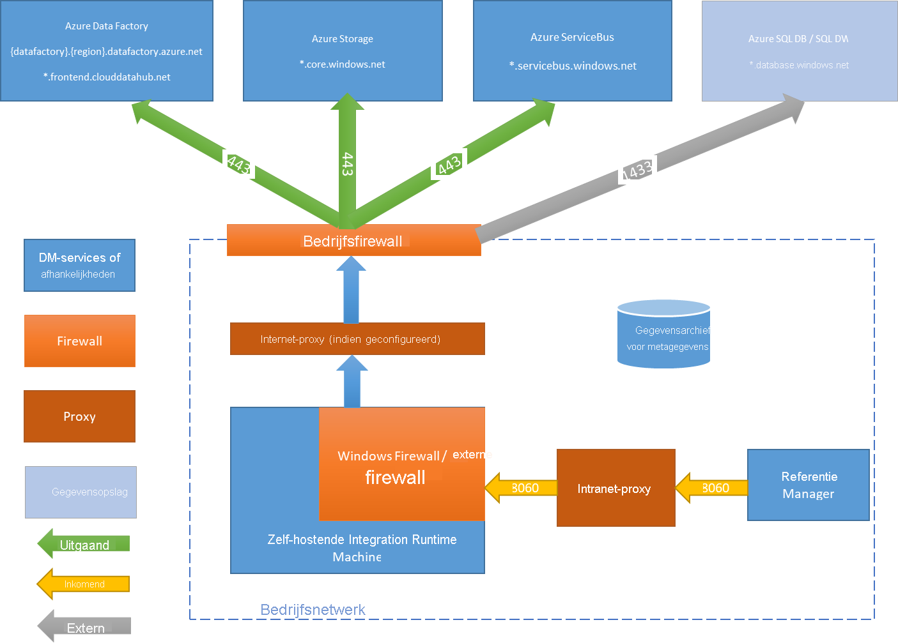

# <a name="create-and-configure-a-self-hosted-integration-runtime"></a>Zelf-hostende Integration Runtime maken en configureren

[!INCLUDE[appliesto-adf-asa-md](includes/appliesto-adf-asa-md.md)]

Integration runtime (IR) is de berekenings infrastructuur die Azure Data Factory gebruikt voor het bieden van mogelijkheden voor gegevens integratie in verschillende netwerk omgevingen. Zie [Integration runtime Overview](concepts-integration-runtime.md)(Engelstalig) voor meer informatie over IR.

Een zelf-hostende Integration runtime kan Kopieer activiteiten uitvoeren tussen een gegevens archief in de Cloud en een gegevens archief in een particulier netwerk. Het kan ook trans formatie activiteiten verzenden met reken bronnen in een on-premises netwerk of een virtueel Azure-netwerk. Voor de installatie van een zelf-hostende Integration runtime is een on-premises computer of een virtuele machine in een particulier netwerk vereist.  

In dit artikel wordt beschreven hoe u een zelf-hostende IR kunt maken en configureren.

[!INCLUDE [updated-for-az](../../includes/updated-for-az.md)]

## <a name="setting-up-a-self-hosted-integration-runtime"></a>Een zelf-hostende Integration runtime instellen

Gebruik de volgende procedures om een zelf-hostende Integration runtime te maken en in te stellen.

### <a name="create-a-self-hosted-ir-via-azure-powershell"></a>Een zelf-hostende IR maken via Azure PowerShell

1. U kunt Azure PowerShell voor deze taak gebruiken. Hier volgt een voorbeeld:

    ```powershell
    Set-AzDataFactoryV2IntegrationRuntime -ResourceGroupName $resourceGroupName -DataFactoryName $dataFactoryName -Name $selfHostedIntegrationRuntimeName -Type SelfHosted -Description "selfhosted IR description"
    ```
  
2. [Down load](https://www.microsoft.com/download/details.aspx?id=39717) en installeer de zelf-hostende Integration runtime op een lokale computer.

3. De verificatie sleutel ophalen en de zelf-hostende Integration runtime registreren bij de sleutel. Hier volgt een Power shell-voor beeld:

    ```powershell

    Get-AzDataFactoryV2IntegrationRuntimeKey -ResourceGroupName $resourceGroupName -DataFactoryName $dataFactoryName -Name $selfHostedIntegrationRuntimeName  

    ```

### <a name="create-a-self-hosted-ir-via-azure-data-factory-ui"></a>Een zelf-hostende IR maken via Azure Data Factory gebruikers interface

Gebruik de volgende stappen om een zelf-hostende IR te maken met behulp van Azure Data Factory gebruikers interface.

1. Selecteer op de pagina **aan de slag** van Azure Data Factory gebruikers interface het [tabblad beheren](https://docs.microsoft.com/azure/data-factory/author-management-hub) in het deel venster uiterst links.

   

1. Selecteer **integratie-Runtimes** in het linkerdeel venster en selecteer **+ Nieuw**.

   

1. Selecteer op de pagina **Integration runtime Setup** de optie **Azure, zelf-hostend**en selecteer **door gaan**. 

1. Selecteer op de volgende pagina **zelf-hosten** om een zelf-hostende IR te maken en selecteer vervolgens **door gaan**.
   

1. Voer een naam in voor uw IR en selecteer **maken**.

1. Selecteer op de pagina **Integration runtime Setup** de koppeling onder **optie 1** om de snelle installatie op uw computer te openen. Of volg de stappen onder **optie 2** om hand matig in te stellen. De volgende instructies zijn gebaseerd op hand matige installatie:

   

    1. Kopieer en plak de verificatie sleutel. Selecteer **down load en installeer Integration runtime**.

    1. Download de zelf-hostende Integration Runtime op een lokale Windows-computer. Voer het installatieprogramma uit.

    1. Plak de sleutel die u eerder hebt opgeslagen op de pagina **registreren Integration runtime (zelf-hostend)** en selecteer **registreren**.
    
       

    1. Selecteer op de pagina **nieuw Integration runtime (zelf-hostend) knoop punt** **volt ooien**.

1. Nadat de zelf-hostende Integration runtime is geregistreerd, ziet u het volgende venster:

    

### <a name="set-up-a-self-hosted-ir-on-an-azure-vm-via-an-azure-resource-manager-template"></a>Een zelf-hostende IR instellen op een Azure-VM via een Azure Resource Manager sjabloon

U kunt zelf-hostende IR-instellingen automatiseren op een virtuele Azure-machine met behulp van de [sjabloon zelf host-IR maken](https://github.com/Azure/azure-quickstart-templates/tree/master/101-vms-with-selfhost-integration-runtime). De sjabloon biedt een eenvoudige manier om een volledig functionele, zelf-hostende IR te hebben in een virtueel Azure-netwerk. De IR heeft functies met hoge Beschik baarheid en schaal baarheid, zolang u het aantal knoop punten instelt op 2 of hoger.

### <a name="set-up-an-existing-self-hosted-ir-via-local-powershell"></a>Een bestaande zelf-hostende IR instellen via lokale Power shell

U kunt een opdracht regel gebruiken om een bestaande zelf-hostende IR in te stellen of te beheren. Dit gebruik kan vooral helpen bij het automatiseren van de installatie en registratie van zelf-hostende IR-knoop punten.

Dmgcmd.exe is opgenomen in het zelf-hostende installatie programma. Het bevindt zich meestal in de map C:\Program Files\Microsoft Integration Runtime\4.0\Shared\. Deze toepassing ondersteunt verschillende para meters en kan worden aangeroepen via een opdracht regel met behulp van batch scripts voor automatisering.

Gebruik de toepassing als volgt:

```powershell
dmgcmd [ -RegisterNewNode "<AuthenticationKey>" -EnableRemoteAccess "<port>" ["<thumbprint>"] -EnableRemoteAccessInContainer "<port>" ["<thumbprint>"] -DisableRemoteAccess -Key "<AuthenticationKey>" -GenerateBackupFile "<filePath>" "<password>" -ImportBackupFile "<filePath>" "<password>" -Restart -Start -Stop -StartUpgradeService -StopUpgradeService -TurnOnAutoUpdate -TurnOffAutoUpdate -SwitchServiceAccount "<domain\user>" ["<password>"] -Loglevel <logLevel> ]
```

Hier volgen de details van de para meters en eigenschappen van de toepassing: 

| Eigenschap                                                    | Beschrijving                                                  | Vereist |
| ----------------------------------------------------------- | ------------------------------------------------------------ | -------- |
| **RegisterNewNode** "`<AuthenticationKey>`"                     | Registreer een zelf-hostend Integration runtime-knoop punt met de opgegeven verificatie sleutel. | Nee       |
| **RegisterNewNode** "`<AuthenticationKey>`" "`<NodeName>`"      | Registreer een zelf-hostend Integration runtime-knoop punt met de opgegeven verificatie sleutel en knooppunt naam. | Nee       |
| **EnableRemoteAccess** "`<port>`" ["`<thumbprint>`"]            | Schakel externe toegang op het huidige knoop punt in om een cluster met hoge Beschik baarheid in te stellen. Of schakel referenties rechtstreeks in voor de zelf-hostende IR zonder Azure Data Factory te passeren. U doet dit met behulp van de cmdlet **New-AzDataFactoryV2LinkedServiceEncryptedCredential** van een externe computer in hetzelfde netwerk. | Nee       |
| **EnableRemoteAccessInContainer** "`<port>`" ["`<thumbprint>`"] | Externe toegang tot het huidige knoop punt inschakelen wanneer het knoop punt in een container wordt uitgevoerd. | Nee       |
| **DisableRemoteAccess**                                         | Externe toegang tot het huidige knoop punt uitschakelen. Externe toegang is vereist voor het instellen van een configuratie met meer knoop punten. De Power shell **-cmdlet New-AzDataFactoryV2LinkedServiceEncryptedCredential** werkt nog steeds, zelfs wanneer externe toegang is uitgeschakeld. Dit gedrag is waar, zolang de cmdlet wordt uitgevoerd op dezelfde computer als het zelf-hostende IR-knoop punt. | Nee       |
| **Sleutel** "`<AuthenticationKey>`"                                 | De vorige verificatie sleutel overschrijven of bijwerken. Wees voorzichtig met deze actie. Het vorige zelf-hostende IR-knoop punt kan offline gaan als de sleutel een nieuwe Integration runtime is. | Nee       |
| **GenerateBackupFile** "`<filePath>`" "`<password>`"            | Genereer een back-upbestand voor het huidige knoop punt. Het back-upbestand bevat de referenties van de knooppunt sleutel en de gegevens opslag. | Nee       |
| **ImportBackupFile** "`<filePath>`" "`<password>`"              | Herstel het knoop punt uit een back-upbestand.                          | Nee       |
| **Opnieuw starten**                                                     | Start de zelf-hostende Integration runtime host-service opnieuw.   | Nee       |
| **Begin**                                                       | Start de zelf-hostende integratie runtime host service.     | Nee       |
| **Stoppen**                                                        | Stop de zelf-hostende integratie runtime host service.        | Nee       |
| **StartUpgradeService**                                         | Start de zelf-hostende Integration runtime upgrade-service.       | Nee       |
| **StopUpgradeService**                                          | Stop de zelf-hostende Integration runtime upgrade-service.        | Nee       |
| **TurnOnAutoUpdate**                                            | Schakel automatisch bijwerken van de zelf-hostende Integration runtime in.        | Nee       |
| **TurnOffAutoUpdate**                                           | Schakel automatisch bijwerken van de zelf-hostende Integration runtime uit.       | Nee       |
| **SwitchServiceAccount** "`<domain\user>`" ["`<password>`"]           | Stel DIAHostService in om te worden uitgevoerd als een nieuw account. Gebruik het lege wacht woord voor systeem accounts en virtuele accounts. | Nee       |


## <a name="command-flow-and-data-flow"></a>Opdracht stroom en gegevens stroom

Wanneer u gegevens verplaatst tussen on-premises en de Cloud, gebruikt de activiteit een zelf-hostende Integration runtime om de gegevens over te dragen tussen een on-premises gegevens bron en de Cloud.

Hier volgt een beknopt overzicht van de stappen voor de gegevens stroom voor het kopiëren met een zelf-hostende IR:


1. Een Data ontwikkelaar maakt een zelf-hostende Integration runtime binnen een Azure-data factory met behulp van een Power shell-cmdlet. Deze functie wordt momenteel niet ondersteund door de Azure Portal.
1. De data ontwikkelaar maakt een gekoppelde service voor een on-premises gegevens opslag. De ontwikkelaar doet dit door het zelf-hostende Integration runtime-exemplaar op te geven dat door de service moet worden gebruikt om verbinding te maken met gegevens archieven.
1. Het knoop punt voor de zelf-hostende Integration runtime versleutelt de referenties met behulp van Windows Data Protection Application Programming Interface (DPAPI) en slaat de referenties lokaal op. Als er meerdere knoop punten zijn ingesteld voor hoge Beschik baarheid, worden de referenties verder gesynchroniseerd tussen andere knoop punten. Elk knoop punt versleutelt de referenties met behulp van DPAPI en slaat ze lokaal op. Synchronisatie van referenties is transparant voor de gegevens ontwikkelaar en wordt verwerkt door de zelf-hostende IR.
1. Azure Data Factory communiceert met de zelf-hostende Integration runtime om taken te plannen en te beheren. Communicatie via een besturings kanaal dat gebruikmaakt van een gedeelde [Azure service bus relay](https://docs.microsoft.com/azure/service-bus-relay/relay-what-is-it#wcf-relay) -verbinding. Wanneer een activiteiten taak moet worden uitgevoerd, Data Factory de aanvraag vergezeld van alle referentie gegevens. Dit doet zich voor als referenties niet al zijn opgeslagen op de zelf-hostende Integration runtime. Met de zelf-hostende Integration runtime wordt de taak gestart nadat de wachtrij is gepolld.
1. De zelf-hostende Integration runtime kopieert gegevens tussen een on-premises opslag en Cloud opslag. De richting van de kopie is afhankelijk van hoe de Kopieer activiteit is geconfigureerd in de gegevens pijplijn. Voor deze stap communiceert de zelf-hostende Integration runtime rechtstreeks met opslag Services op basis van de Cloud, zoals Azure Blob-opslag via een beveiligd HTTPS-kanaal.

## <a name="considerations-for-using-a-self-hosted-ir"></a>Overwegingen voor het gebruik van een zelf-hostende IR

- U kunt één zelf-hostende Integration runtime gebruiken voor meerdere on-premises gegevens bronnen. U kunt deze ook delen met een andere data factory binnen dezelfde Azure Active Directory (Azure AD)-Tenant. Zie [een zelf-hostende Integration runtime delen](#create-a-shared-self-hosted-integration-runtime-in-azure-data-factory)voor meer informatie.
- U kunt slechts één exemplaar van een zelf-hostende Integration runtime op één computer installeren. Als u twee gegevens fabrieken hebt die toegang nodig hebben tot on-premises gegevens bronnen, gebruikt u de [zelf-hostende](#create-a-shared-self-hosted-integration-runtime-in-azure-data-factory) IR-functie voor delen om de zelf-hostende IR te delen of installeert u de zelf-hostende IR op twee on-premises computers, één voor elke Data Factory.  
- De zelf-hostende Integration runtime hoeft zich niet op dezelfde computer als de gegevens bron te bevinden. Als de zelf-hostende Integration runtime echter dicht bij de gegevens bron afneemt, vermindert u de tijd voor de zelf-hostende Integration runtime om verbinding te maken met de gegevens bron. U wordt aangeraden de zelf-hostende Integration runtime te installeren op een computer die afwijkt van de versie die als host fungeert voor de on-premises gegevens bron. Wanneer de zelf-hostende Integration runtime en de gegevens bron zich op verschillende computers bevinden, kan de zelf-hostende Integration runtime niet concurreren met de gegevens bron voor bronnen.
- U kunt meerdere zelf-hostende Integration Runtimes op verschillende computers hebben die verbinding maken met dezelfde on-premises gegevens bron. Als u bijvoorbeeld twee zelf-hostende Integration Runtimes hebt die twee gegevens fabrieken gebruiken, kan dezelfde on-premises gegevens bron worden geregistreerd met beide gegevens fabrieken.
- Als u al een gateway op uw computer hebt geïnstalleerd voor een Power BI scenario, installeert u een afzonderlijke zelf-hostende Integration runtime voor Data Factory op een andere computer.
- Gebruik een zelf-hostende Integration runtime voor de ondersteuning van gegevens integratie binnen een virtueel Azure-netwerk.
- Behandel uw gegevens bron als een on-premises gegevens bron die zich achter een firewall bevindt, zelfs wanneer u Azure ExpressRoute gebruikt. Gebruik de zelf-hostende Integration runtime om de service te verbinden met de gegevens bron.
- Gebruik de zelf-hostende Integration runtime, zelfs als het gegevens archief zich in de Cloud bevindt op een virtuele machine met Azure Infrastructure as a Service (IaaS).
- Taken kunnen mislukken in een zelf-hostende Integration runtime die u hebt geïnstalleerd op een Windows-Server waarvoor FIPS-compatibele versleuteling is ingeschakeld. U kunt dit probleem omzeilen door FIPS-compatibele versleuteling op de server uit te scha kelen. Als u FIPS-compatibele versleuteling wilt uitschakelen, wijzigt u de waarde van de volgende registersubsleutel van 1 (ingeschakeld) in 0 (uitgeschakeld): `HKLM\System\CurrentControlSet\Control\Lsa\FIPSAlgorithmPolicy\Enabled` .

## <a name="prerequisites"></a>Vereisten

- De ondersteunde versies van Windows zijn:
  + Windows 7 servicepack 1
  + Windows 8.1
  + Windows 10
  + Windows Server 2008 R2 SP1
  + Windows Server 2012
  + Windows Server 2012 R2
  + Windows Server 2016
  + Windows Server 2019
   
   De installatie van de zelf-hostende Integration runtime op een domein controller wordt niet ondersteund.
- .NET Framework 4.6.1 of hoger is vereist. Als u de zelf-hostende Integration runtime installeert op een computer met Windows 7, installeert u .NET Framework 4.6.1 of hoger. Zie [.NET Framework systeem vereisten](/dotnet/framework/get-started/system-requirements) voor meer informatie.
- De aanbevolen minimale configuratie voor de zelf-hostende Integration runtime machine is een 2 GHz processor met vier kernen, 8 GB aan RAM-geheugen en 80 GB beschik bare ruimte op de vaste schijf.
- Als de hostcomputer zich in de slaap stand bevindt, reageert de zelf-hostende Integration runtime niet op gegevens aanvragen. Configureer een geschikt energiebeheer schema op de computer voordat u de zelf-hostende Integration runtime installeert. Als de computer is geconfigureerd voor de slaap stand, wordt door het installatie programma voor de zelf-hostende Integration runtime een bericht gevraagd.
- U moet een beheerder op de computer zijn om de zelf-hostende Integration runtime te kunnen installeren en configureren.
- Kopieer-activiteit wordt uitgevoerd met een specifieke frequentie. Het gebruik van de processor en het RAM-geheugen op de computer volgt hetzelfde patroon met piek-en inactieve tijden. Resource gebruik is ook afhankelijk van de hoeveelheid gegevens die wordt verplaatst. Wanneer er meerdere Kopieer taken worden uitgevoerd, ziet u het resource gebruik tijdens piek tijden.
- Taken kunnen mislukken tijdens het uitpakken van gegevens in Parquet-, ORC-of Avro-indelingen. Zie [Parquet-indeling in azure Data Factory](https://docs.microsoft.com/azure/data-factory/format-parquet#using-self-hosted-integration-runtime)voor meer informatie over Parquet. Het maken van bestanden wordt uitgevoerd op de zelf-hostende integratie computer. Voor een juiste werking van het maken van bestanden zijn de volgende vereisten vereist:
    - Te [distribueren pakket Visual C++ 2010](https://download.microsoft.com/download/3/2/2/3224B87F-CFA0-4E70-BDA3-3DE650EFEBA5/vcredist_x64.exe) Pakket (x64)
    - Java runtime (JRE) versie 8 van een JRE-provider, zoals het [aannemen van openjdk](https://adoptopenjdk.net/). Zorg ervoor dat de `JAVA_HOME` omgevings variabele is ingesteld.

## <a name="installation-best-practices"></a>Best practices voor installatie

U kunt de zelf-hostende Integration runtime installeren door een configuratie pakket voor beheerde identiteit te downloaden van het [micro soft Download centrum](https://www.microsoft.com/download/details.aspx?id=39717). Zie het artikel [gegevens verplaatsen tussen on-premises en de Cloud](tutorial-hybrid-copy-powershell.md) voor stapsgewijze instructies.

- Configureer een energiebeheer schema op de hostmachine voor de zelf-hostende Integration runtime, zodat de computer niet in de slaap stand wordt gezet. Als de hostcomputer zich in de slaap stand bevindt, gaat de zelf-hostende Integration runtime offline.
- Regel matig een back-up maken van de referenties die zijn gekoppeld aan de zelf-hostende Integration runtime.
- Als u zelf-hostende IR-installatie bewerkingen wilt automatiseren, kunt u [een bestaande zelf-hostende IR instellen via Power shell](#setting-up-a-self-hosted-integration-runtime).  

## <a name="install-and-register-a-self-hosted-ir-from-microsoft-download-center"></a>Een zelf-hostende IR installeren en registreren vanuit het micro soft Download centrum

1. Ga naar de [Download pagina voor micro soft Integration runtime](https://www.microsoft.com/download/details.aspx?id=39717).
1. Selecteer **downloaden**, selecteer de 64-bits versie en selecteer **volgende**. De 32-bits versie wordt niet ondersteund.
1. Voer het beheerde ID-bestand rechtstreeks uit of sla het op de vaste schijf op en voer het uit.
1. Selecteer een taal in het **welkomst** venster en selecteer **volgende**.
1. Ga akkoord met de licentie voorwaarden voor micro soft-software en selecteer **volgende**.
1. Selecteer **map** om de zelf-hostende Integration runtime te installeren en selecteer **volgende**.
1. Selecteer **installeren**op de pagina **gereed voor installatie** .
1. Selecteer **volt ooien** om de installatie te volt ooien.
1. De verificatie sleutel ophalen met behulp van Power shell. Hier volgt een Power shell-voor beeld voor het ophalen van de verificatie sleutel:

    ```powershell
    Get-AzDataFactoryV2IntegrationRuntimeKey -ResourceGroupName $resourceGroupName -DataFactoryName $dataFactoryName -Name $selfHostedIntegrationRuntime
    ```

1. Voer de volgende stappen uit in het venster **Integration runtime (zelf-hostend) registreren** van Microsoft Integration Runtime Configuration Manager op uw computer wordt uitgevoerd:

    1. Plak de verificatie sleutel in het tekst gebied.

    1. Selecteer eventueel **verificatie sleutel weer geven** om de sleutel tekst te bekijken.

    1. Selecteer **Registreren**.

## <a name="high-availability-and-scalability"></a>Hoge Beschik baarheid en schaal baarheid

U kunt een zelf-hostende Integration runtime koppelen met meerdere on-premises machines of virtuele machines in Azure. Deze computers worden knoop punten genoemd. U kunt Maxi maal vier knoop punten koppelen aan een zelf-hostende Integration runtime. De voor delen van het hebben van meerdere knoop punten op on-premises machines met een gateway die is geïnstalleerd voor een logische gateway zijn:

* Een hogere Beschik baarheid van de zelf-hostende Integration runtime, zodat deze niet langer de Single Point of Failure in uw big data oplossing of Cloud gegevens integratie met Data Factory. Deze Beschik baarheid zorgt voor continuïteit bij het gebruik van Maxi maal vier knoop punten.
* Verbeterde prestaties en door Voer tijdens het verplaatsen van gegevens tussen on-premises en gegevens opslag in de Cloud. Meer informatie over [prestatie vergelijkingen](copy-activity-performance.md).

U kunt meerdere knoop punten koppelen door de zelf-hostende Integration runtime-software te installeren vanuit het [Download centrum](https://www.microsoft.com/download/details.aspx?id=39717). Registreer deze vervolgens met behulp van een van de verificatie sleutels die zijn verkregen van de cmdlet **New-AzDataFactoryV2IntegrationRuntimeKey** , zoals beschreven in de [zelf studie](tutorial-hybrid-copy-powershell.md).

> [!NOTE]
> U hoeft geen nieuwe zelf-hostende Integration runtime te maken om elk knoop punt te koppelen. U kunt de zelf-hostende Integration runtime op een andere computer installeren en registreren met behulp van dezelfde verificatie sleutel.

> [!NOTE]
> Voordat u een ander knoop punt toevoegt voor hoge Beschik baarheid en schaal baarheid, moet u ervoor zorgen dat de optie **externe toegang tot intranet** is ingeschakeld op het eerste knoop punt. Als u dit wilt doen, selecteert u **Microsoft Integration Runtime Configuration Manager**  >  **instellingen**  >  **externe toegang tot intranet**.

### <a name="scale-considerations"></a>Schaal overwegingen

#### <a name="scale-out"></a>Uitschalen

Wanneer het processor gebruik hoog is en er onvoldoende geheugen beschikbaar is op de zelf-hostende IR, voegt u een nieuw knoop punt toe om de belasting op meerdere machines te verg Roten. Als activiteiten mislukken omdat er een time-out optreedt of het zelf-hostende IR-knoop punt offline is, is het handig als u een knoop punt aan de gateway toevoegt.

#### <a name="scale-up"></a>Omhoog schalen

Wanneer de processor en het beschik bare RAM-geheugen niet goed zijn gebruikt, maar de uitvoering van gelijktijdige taken de limieten van een knoop punt bereikt, kunt u omhoog schalen door het aantal gelijktijdige taken te verhogen dat een knoop punt kan uitvoeren. Het kan ook zijn dat u wilt opschalen wanneer de activiteiten uitvallen omdat de zelf-hostende IR overbelast is. Zoals in de volgende afbeelding wordt weer gegeven, kunt u de maximale capaciteit voor een knoop punt verhogen:  


### <a name="tlsssl-certificate-requirements"></a>Vereisten voor TLS/SSL-certificaat

Hier volgen de vereisten voor het TLS/SSL-certificaat dat u gebruikt voor het beveiligen van de communicatie tussen de knoop punten van Integration runtime:

- Het certificaat moet een openbaar vertrouwd x509 v3-certificaat zijn. U wordt aangeraden certificaten te gebruiken die zijn uitgegeven door een open bare partner certificerings instantie (CA).
- Elk knoop punt voor Integration runtime moet dit certificaat vertrouwen.
- We raden geen SAN-certificaten (alternatieve naam voor onderwerp) aan omdat alleen het laatste SAN-item wordt gebruikt. Alle andere SAN-items worden genegeerd. Als u bijvoorbeeld een SAN-certificaat hebt waarvan de San's **node1.domain.contoso.com** en **node2.domain.contoso.com**zijn, kunt u dit certificaat alleen gebruiken op een computer waarvan de Fully Qualified Domain Name (FQDN) **node2.domain.contoso.com**is.
- Het certificaat kan een wille keurige sleutel grootte gebruiken die wordt ondersteund door Windows Server 2012 R2 voor TLS/SSL-certificaten.
- Certificaten die CNG-sleutels gebruiken, worden niet ondersteund.  

> [!NOTE]
> Dit certificaat wordt gebruikt:
>
> - Voor het versleutelen van poorten op een zelf-hostend IR-knoop punt.
> - Voor communicatie tussen knoop punten voor status synchronisatie, inclusief synchronisatie van referenties van gekoppelde services op verschillende knoop punten.
> - Wanneer een Power shell-cmdlet wordt gebruikt voor instellingen van een gekoppelde service referentie vanuit een lokaal netwerk.
>
> U wordt aangeraden dit certificaat te gebruiken als uw particuliere netwerk omgeving niet veilig is of als u de communicatie tussen knoop punten in uw particuliere netwerk wilt beveiligen.
>
> Gegevens verplaatsing in transit van een zelf-hostende IR naar andere gegevens archieven vindt altijd plaats in een versleuteld kanaal, ongeacht of dit certificaat is ingesteld.

## <a name="create-a-shared-self-hosted-integration-runtime-in-azure-data-factory"></a>Een gedeelde zelf-hostende Integration runtime maken in Azure Data Factory

U kunt een bestaande zelf-hostende Integration runtime-infra structuur die u al in een data factory hebt ingesteld, opnieuw gebruiken. Met dit hergebruik kunt u een gekoppelde zelf-hostende Integration runtime in een andere data factory maken door te verwijzen naar een bestaande gedeelde zelf-hostende IR.

Bekijk de volgende video van 12 minuten om een inleiding en demonstratie van deze functie weer te geven:

> [!VIDEO https://channel9.msdn.com/Shows/Azure-Friday/Hybrid-data-movement-across-multiple-Azure-Data-Factories/player]

### <a name="terminology"></a>Terminologie

- **Gedeelde IR**: een originele zelf-hostende IR die wordt uitgevoerd op een fysieke infra structuur.  
- **Gekoppelde IR**: een IR die verwijst naar een andere gedeelde IR. De gekoppelde IR is een logische IR en maakt gebruik van de infra structuur van een andere gedeelde zelf-hostende IR.

### <a name="methods-to-share-a-self-hosted-integration-runtime"></a>Methoden voor het delen van een zelf-hostende Integration runtime

Zie [een gedeelde zelf-hostende Integration runtime maken](create-shared-self-hosted-integration-runtime-powershell.md) voor meer informatie over het delen van een zelf-hostende Integration runtime met meerdere gegevens fabrieken.

### <a name="monitoring"></a>Controleren

#### <a name="shared-ir"></a>Gedeelde IR


#### <a name="linked-ir"></a>Gekoppelde IR


### <a name="known-limitations-of-self-hosted-ir-sharing"></a>Bekende beperkingen van zelf-hostende IR-delen

* De data factory waarin een gekoppelde IR wordt gemaakt, moet een [beheerde identiteit](https://docs.microsoft.com/azure/active-directory/managed-service-identity/overview)hebben. Standaard hebben de gegevens fabrieken die zijn gemaakt in de Azure Portal-of Power shell-cmdlets een impliciet gemaakte beheerde identiteit. Maar wanneer een data factory wordt gemaakt via een Azure Resource Manager sjabloon of SDK, moet u de **identiteits** eigenschap expliciet instellen. Deze instelling zorgt ervoor dat Resource Manager een data factory maakt die een beheerde identiteit bevat.

* De Data Factory .NET SDK die deze functie ondersteunt, moet versie 1.1.0 of hoger zijn.

* Als u machtigingen wilt verlenen, moet u de rol eigenaar of de overgenomen rol eigenaar hebben in de data factory waar de gedeelde IR zich bevindt.

* De functie voor delen werkt alleen voor gegevens fabrieken binnen dezelfde Azure AD-Tenant.

* Voor Azure AD- [gast gebruikers](https://docs.microsoft.com/azure/active-directory/governance/manage-guest-access-with-access-reviews), de zoek functie in de gebruikers interface, met alle gegevens fabrieken met behulp van een zoek woord, [werkt niet](https://msdn.microsoft.com/library/azure/ad/graph/howto/azure-ad-graph-api-permission-scopes#SearchLimits). Maar zolang de gast gebruiker de eigenaar van het data factory is, kunt u de IR delen zonder de zoek functionaliteit. Voor de beheerde identiteit van de data factory die de IR moet delen, voert u die beheerde identiteit in het vak **machtiging toewijzen** in en selecteert u **toevoegen** in de Data Factory gebruikers interface.

  > [!NOTE]
  > Deze functie is alleen beschikbaar in Data Factory v2.

## <a name="notification-area-icons-and-notifications"></a>Pictogrammen van het systeemvak en meldingen

Als u de cursor over het pictogram of het bericht in het systeemvak beweegt, ziet u details over de status van de zelf-hostende Integration runtime.


## <a name="ports-and-firewalls"></a>Poorten en firewalls

Er zijn twee firewalls waarmee u rekening moet houden:

- De *bedrijfs firewall* die wordt uitgevoerd op de centrale router van de organisatie
- *Windows Firewall* die is geconfigureerd als een daemon op de lokale computer waarop de zelf-hostende Integration runtime is geïnstalleerd



Op het niveau van de bedrijfs firewall moet u de volgende domeinen en uitgaande poorten configureren:

[!INCLUDE [domain-and-outbound-port-requirements](../../includes/domain-and-outbound-port-requirements.md)]

Op het niveau van Windows Firewall of op computer niveau worden deze uitgaande poorten normaal gesp roken ingeschakeld. Als dat niet het geval is, kunt u de domeinen en poorten configureren op een zelf-hostende Integration runtime-computer.

> [!NOTE]
> Op basis van uw bron en sinks moet u mogelijk extra domeinen en uitgaande poorten in de firewall van uw bedrijf of Windows Firewall toestaan.
>
> Voor sommige Cloud databases, zoals Azure SQL Database en Azure Data Lake, moet u mogelijk IP-adressen van zelf-hostende Integration runtime-machines toestaan voor de firewall configuratie.

### <a name="copy-data-from-a-source-to-a-sink"></a>Gegevens van een bron naar een Sink kopiëren

Zorg ervoor dat u firewall regels correct inschakelt op de firewall van het bedrijf, Windows Firewall van de zelf-hostende Integration runtime-computer en het gegevens archief zelf. Door deze regels in te scha kelen, kan de zelf-hostende Integration runtime verbinding maken met zowel de bron-als de sink. Schakel regels in voor elk gegevens archief dat is betrokken bij de Kopieer bewerking.

Als u bijvoorbeeld van een on-premises gegevens archief wilt kopiëren naar een SQL Database sink of een Azure SQL Data Warehouse-sink, voert u de volgende stappen uit:

1. Uitgaande TCP-communicatie toestaan op poort 1433 voor zowel Windows Firewall als de firewall van het bedrijf.
1. Configureer de firewall instellingen van de SQL Database om het IP-adres van de zelf-hostende Integration runtime-machine toe te voegen aan de lijst met toegestane IP-adressen.

> [!NOTE]
> Als uw firewall geen uitgaande poort 1433 toestaat, is de zelf-hostende Integration runtime niet rechtstreeks toegang tot de SQL database. In dit geval kunt u een [gefaseerde kopie](copy-activity-performance.md) van SQL Database en SQL Data Warehouse gebruiken. In dit scenario hebt u alleen HTTPS (poort 443) nodig voor het verplaatsen van gegevens.

## <a name="proxy-server-considerations"></a>Overwegingen voor de proxy server

Als uw bedrijfs netwerk omgeving gebruikmaakt van een proxy server voor toegang tot internet, configureert u de zelf-hostende Integration runtime om de juiste proxy-instellingen te gebruiken. U kunt de proxy instellen tijdens de eerste registratie fase.


Wanneer de zelf-hostende Integration runtime de proxy server gebruikt om verbinding te maken met de bron en het doel van de Cloud service (die het HTTP-of HTTPS-protocol gebruiken). Daarom selecteert u de **wijzigings koppeling** tijdens de eerste installatie.


Er zijn drie configuratie opties:

- **Geen proxy gebruiken**: de zelf-hostende Integration runtime gebruikt geen proxy om verbinding te maken met Cloud Services.
- **Systeem proxy gebruiken**: de zelf-hostende Integration runtime maakt gebruik van de proxy-instelling die is geconfigureerd in diahost.exe.config en diawp.exe.config. Als deze bestanden geen proxy configuratie opgeven, maakt de zelf-hostende Integration runtime rechtstreeks verbinding met de Cloud service zonder een proxy te passeren.
- **Aangepaste proxy gebruiken**: Configureer de http-proxy-instelling die moet worden gebruikt voor de zelf-hostende Integration runtime, in plaats van configuraties te gebruiken in diahost.exe.config en diawp.exe.config. **Adres** -en **poort** waarden zijn vereist. De waarden voor **gebruikers naam** en **wacht woord** zijn optioneel, afhankelijk van de verificatie-instelling van uw proxy. Alle instellingen worden versleuteld met Windows DPAPI op de zelf-hostende Integration runtime en lokaal opgeslagen op de computer.

De integratie runtime host service wordt automatisch opnieuw opgestart nadat u de bijgewerkte proxy-instellingen hebt opgeslagen.

Wanneer u de zelf-hostende Integration runtime hebt geregistreerd en u de proxy-instellingen wilt weer geven of bijwerken, gebruikt u Microsoft Integration Runtime Configuration Manager.

1. Open **Microsoft Integration Runtime Configuration Manager**.
1. Selecteer het tabblad **Instellingen**.
1. Selecteer onder **http-proxy**de **wijzigings** koppeling om het dialoog venster **http-proxy instellen** te openen.
1. Selecteer **Volgende**. Vervolgens wordt er een waarschuwing weer gegeven waarin u wordt gevraagd om de proxy instelling op te slaan en de integratie runtime host-service opnieuw te starten.

U kunt het hulp programma Configuration Manager gebruiken om de HTTP-proxy weer te geven en bij te werken.


> [!NOTE]
> Als u een proxy server met NTLM-verificatie instelt, wordt de integratie-runtime host service uitgevoerd onder het domein account. Als u later het wacht woord voor het domein account wijzigt, vergeet dan niet de configuratie-instellingen voor de service bij te werken en de service opnieuw te starten. Vanwege deze vereiste raden we u aan om toegang te krijgen tot de proxy server met behulp van een toegewezen domein account waarvoor u het wacht woord regel matig niet hoeft bij te werken.

### <a name="configure-proxy-server-settings"></a>Proxyserver instellingen configureren

Als u de optie **systeem proxy gebruiken** voor de http-proxy selecteert, gebruikt de zelf-hostende Integration runtime de proxy-instellingen in diahost.exe.config en diawp.exe.config. Als deze bestanden geen proxy opgeven, maakt de zelf-hostende Integration runtime rechtstreeks verbinding met de Cloud service zonder een proxy te passeren. De volgende procedure bevat instructies voor het bijwerken van het diahost.exe.config-bestand:

1. Maak in Verkenner een veilige kopie van C:\Program Files\Microsoft Integration Runtime\4.0\Shared\diahost.exe.config als back-up van het oorspronkelijke bestand.
1. Open Klad blok als Administrator.
1. Open in Klad blok het tekst bestand C:\Program Files\Microsoft Integration Runtime\4.0\Shared\diahost.exe.config.
1. Zoek de standaard **System.net** -tag, zoals wordt weer gegeven in de volgende code:

    ```xml
    <system.net>
        <defaultProxy useDefaultCredentials="true" />
    </system.net>
    ```
    U kunt vervolgens Details van de proxy server toevoegen, zoals wordt weer gegeven in het volgende voor beeld:

    ```xml
    <system.net>
        <defaultProxy enabled="true">
              <proxy bypassonlocal="true" proxyaddress="http://proxy.domain.org:8888/" />
        </defaultProxy>
    </system.net>
    ```

    Met de proxy code kunnen aanvullende eigenschappen de vereiste instellingen opgeven, zoals `scriptLocation` . Zie [ \<proxy\> element (netwerk instellingen)](https://msdn.microsoft.com/library/sa91de1e.aspx) voor de syntaxis.

    ```xml
    <proxy autoDetect="true|false|unspecified" bypassonlocal="true|false|unspecified" proxyaddress="uriString" scriptLocation="uriString" usesystemdefault="true|false|unspecified "/>
    ```
1. Sla het configuratie bestand op de oorspronkelijke locatie op. Start vervolgens de zelf-hostende integratie runtime host service, waarmee de wijzigingen worden opgehaald.

   Als u de service opnieuw wilt starten, gebruikt u het onderdeel Services van het configuratie scherm. Of selecteer de knop **service stoppen** in Integration Runtime Configuration Manager en selecteer vervolgens **service starten**.

   Als de service niet start, hebt u waarschijnlijk onjuiste XML-label syntaxis toegevoegd in het configuratie bestand van de toepassing dat u hebt bewerkt.

> [!IMPORTANT]
> Vergeet niet om zowel diahost.exe.config als diawp.exe.config bij te werken.

U moet er ook voor zorgen dat Microsoft Azure zich in de acceptatie lijst van uw bedrijf bevindt. U kunt de lijst met geldige Azure IP-adressen downloaden van het [micro soft Download centrum](https://www.microsoft.com/download/details.aspx?id=41653).

### <a name="possible-symptoms-for-issues-related-to-the-firewall-and-proxy-server"></a>Mogelijke symptomen voor problemen met de firewall en de proxy server

Als er fout berichten worden weer geven, zoals de volgende, is de waarschijnlijke oorzaak een onjuiste configuratie van de firewall of proxy server. Met deze configuratie kan de zelf-hostende Integration runtime geen verbinding maken met Data Factory om zichzelf te verifiëren. Raadpleeg de vorige sectie om ervoor te zorgen dat uw firewall en proxy server correct zijn geconfigureerd.

* Wanneer u de zelf-hostende Integration runtime probeert te registreren, wordt het volgende fout bericht weer gegeven: ' kan dit knoop punt niet registreren Integration Runtime. Controleer of de verificatie sleutel geldig is en of de service Integration service host op deze computer wordt uitgevoerd.
* Wanneer u Integration Runtime Configuration Manager opent, ziet u de status **losgekoppeld** of verbinding **maken**. Wanneer u Windows-gebeurtenis logboeken bekijkt onder **Logboeken**  >  **Logboeken van toepassingen en services**  >  **Microsoft Integration runtime**, worden fout berichten als deze weer gegeven:

    ```
    Unable to connect to the remote server
    A component of Integration Runtime has become unresponsive and restarts automatically. Component name: Integration Runtime (Self-hosted).
    ```

### <a name="enable-remote-access-from-an-intranet"></a>Externe toegang via een intranet inschakelen

Als u Power shell gebruikt voor het versleutelen van referenties van een andere netwerk computer dan waar u de zelf-hostende Integration runtime hebt geïnstalleerd, kunt u de optie **externe toegang vanaf intranet** inschakelen. Als u Power shell uitvoert om referenties te versleutelen op de computer waarop u de zelf-hostende Integration runtime hebt geïnstalleerd, kunt u **externe toegang niet inschakelen via intranet**.

Schakel **externe toegang vanaf intranet in** voordat u een ander knoop punt toevoegt voor hoge Beschik baarheid en schaal baarheid.  

Wanneer u de zelf-hostende Integration runtime Setup-versie 3,3 of hoger uitvoert, schakelt de zelf-hostende Integration runtime-installatie programma **externe toegang van intranet uit** op de zelf-hostende Integration runtime-computer.

Wanneer u een firewall van een partner of anderen gebruikt, kunt u hand matig poort 8060 of de door de gebruiker geconfigureerde poort openen. Als u een firewall probleem hebt tijdens het instellen van de zelf-hostende Integration runtime, gebruikt u de volgende opdracht om de zelf-hostende Integration runtime te installeren zonder de firewall te configureren:

```
msiexec /q /i IntegrationRuntime.msi NOFIREWALL=1
```

Als u poort 8060 niet op de zelf-hostende Integration runtime-computer wilt openen, gebruikt u andere mechanismen dan de toepassing voor het instellen van referenties voor het configureren van referenties voor gegevens archieven. U kunt bijvoorbeeld de Power shell **-cmdlet New-AzDataFactoryV2LinkedServiceEncryptCredential** gebruiken.

## <a name="next-steps"></a>Volgende stappen

Zie [zelf studie: on-premises gegevens kopiëren naar de Cloud](tutorial-hybrid-copy-powershell.md)voor stapsgewijze instructies.
