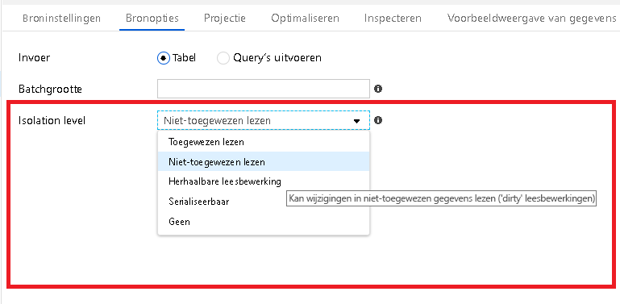

# <a name="source-transformation-for-mapping-data-flow"></a>Bron transformatie voor het toewijzen van gegevens stroom 

Met een bron transformatie configureert u de gegevens bron voor de gegevens stroom. Bij het ontwerpen van gegevens stromen wordt de eerste stap altijd een bron transformatie configureren. Als u een bron wilt toevoegen, klikt u op het vak **bron toevoegen** in het canvas voor gegevens stromen.

Elke gegevens stroom vereist ten minste één bron transformatie, maar u kunt zoveel bronnen toevoegen als u nodig hebt om uw gegevens transformaties te volt ooien. U kunt deze bronnen samen voegen met een koppelings-, zoek-of een Union-trans formatie.

Elke bron transformatie is gekoppeld aan precies één Data Factory-gegevensset. De gegevensset definieert de vorm en locatie van de gegevens waarnaar u wilt schrijven of waaruit u wilt lezen. Als u een gegevensset op basis van een bestand gebruikt, kunt u Joker tekens en bestands lijsten in uw bron gebruiken om met meer dan één bestand tegelijk te werken.

## <a name="supported-connectors-in-mapping-data-flow"></a>Ondersteunde connectors in gegevens stroom toewijzen

Toewijzing van gegevens stroom volgt een extractie benadering, Load, Transform (ELT) en werkt met *faserings* gegevens sets die allemaal in azure zijn. Momenteel kunnen de volgende gegevens sets worden gebruikt in een bron transformatie:
    
* Azure Blob Storage (JSON, AVRO, Text, Parquet)
* Azure Data Lake Storage Gen1 (JSON, AVRO, Text, Parquet)
* Azure Data Lake Storage Gen2 (JSON, AVRO, Text, Parquet)
* Azure SQL Data Warehouse
* Azure SQL Database
* Azure CosmosDB

Azure Data Factory heeft toegang tot meer dan 80 systeem eigen connectors. Als u gegevens uit deze andere bronnen in uw gegevens stroom wilt toevoegen, gebruikt u de Kopieer activiteit om die gegevens te laden in een van de ondersteunde staging-gebieden.

## <a name="source-settings"></a>Broninstellingen

Nadat u een bron hebt toegevoegd, configureert u via het tabblad **bron instellingen** . Hier kunt u de gegevensset voor uw bron punten kiezen of maken. U kunt ook schema-en bemonsterings opties voor uw gegevens selecteren.


**Schema-drift:** [schema-drift](concepts-data-flow-schema-drift.md) Data Factory is de mogelijkheid van een systeem eigen flexibele schema's in uw gegevens stromen zonder dat er expliciet kolom wijzigingen hoeven te worden gedefinieerd.

* Schakel het selectie vakje **schema-drift toestaan** in als de bron kolommen vaak worden gewijzigd. Met deze instelling kunnen alle binnenkomende bron velden door de trans formaties worden getransporteerd naar de sink.

* Bij het kiezen van een **afleidende kolom Type** wordt de instructie Data Factory om gegevens typen te detecteren en te definiëren voor elke nieuwe kolom die wordt gedetecteerd. Als deze functie is uitgeschakeld, zijn alle gedrijfde kolommen van het type teken reeks.

**Schema valideren:** Als validatie schema is geselecteerd, kan de gegevens stroom niet worden uitgevoerd als de binnenkomende bron gegevens niet overeenkomen met het gedefinieerde schema van de gegevensset.

**Aantal regels overs Laan:** In het veld aantal regel items overs Laan wordt aangegeven hoeveel regels aan het begin van de gegevensset moeten worden genegeerd.

**Steek proeven:** Schakel steek proeven in om het aantal rijen van de bron te beperken. Gebruik deze instelling wanneer u gegevens uit uw bron test of van uw source gebruikt voor fout opsporing.

**Meerregelige rijen:** Selecteer meerregelige rijen als uw bron tekst bestand teken reeks waarden bevat die meerdere rijen bevatten, dat wil zeggen een nieuwe regel in een waarde.

Als u wilt valideren of uw bron juist is geconfigureerd, schakelt u de foutopsporingsmodus in en haalt u een voor beeld van de gegevens op. Zie [debug mode (foutopsporingsmodus](concepts-data-flow-debug-mode.md)) voor meer informatie.

> [!NOTE]
> Wanneer de foutopsporingsmodus is ingeschakeld, wordt de sampling-instelling in de bron tijdens de preview-versie overschreven door de configuratie van het aantal rijen in de instellingen voor fout opsporing.

## <a name="file-based-source-options"></a>Bron opties op basis van een bestand

Als u een gegevensset op basis van een bestand gebruikt, zoals Azure Blob Storage of Azure Data Lake Storage, kunt u op het tabblad **bron opties** beheren hoe bestanden worden gelezen met uw bron.


**Pad met Joker tekens:** Als u een Joker teken gebruikt, wordt ADF geadviseerd om elke overeenkomende map en elk bestand in één bron transformatie te verwerken. Dit is een efficiënte manier om meerdere bestanden binnen één stroom te verwerken. Voeg meerdere Joker teken patronen toe met het plus teken dat wordt weer gegeven bij het aanwijzen van het bestaande Joker teken patroon.

Kies in uw bron container een reeks bestanden die overeenkomen met een patroon. Alleen container kan worden opgegeven in de gegevensset. Het pad naar uw Joker teken moet daarom ook uw mappad van de hoofdmap bevatten.

Voor beelden van joker tekens:

* ```*``` vertegenwoordigt een wille keurige set tekens
* ```**``` staat voor recursieve nesten van mappen
* ```?``` vervangt één teken
* ```[]``` komt overeen met een van de tekens in de vier Kante haken

* ```/data/sales/**/*.csv``` haalt alle CSV-bestanden op/Data/Sales
* ```/data/sales/20??/**``` alle bestanden in de twintigste eeuw ophalen
* ```/data/sales/2004/*/12/[XY]1?.csv``` haalt alle CSV-bestanden in 2004 december op, beginnend met X of Y, voorafgegaan door een getal van twee cijfers

Basispad **:** Als u gepartitioneerde mappen in de bestands bron hebt met een ```key=value```-indeling (bijvoorbeeld Year = 2019), kunt u het hoogste niveau van die partitie mappen structuur toewijzen aan een kolom naam in de gegevens stroom van de gegevensstroom.

Stel eerst een Joker teken in om alle paden op te nemen van de gepartitioneerde mappen plus de blad bestanden die u wilt lezen.


Gebruik de instelling basis pad partitie om te definiëren wat het hoogste niveau van de mappen structuur is. Wanneer u de inhoud van uw gegevens bekijkt via een voor beeld van de gegevens, ziet u dat de opgeloste partities in elk van uw mapniveau worden toegevoegd.


**Lijst met bestanden:** Dit is een bestandenset. Maak een tekst bestand met een lijst met relatieve padgegevens die moeten worden verwerkt. Wijs dit tekst bestand aan.

**Kolom voor het opslaan van de bestands naam:** Sla de naam van het bron bestand op in een kolom in uw gegevens. Voer hier een nieuwe kolom naam in om de teken reeks voor de bestands naam op te slaan.

**Na voltooiing:** U kunt niets doen met het bron bestand nadat de gegevens stroom is uitgevoerd, het bron bestand te verwijderen of het bron bestand te verplaatsen. De paden voor de verplaatsing zijn relatief.

Als u bron bestanden naar een andere locatie wilt verplaatsen, selecteert u eerst verplaatsen voor bestands bewerking. Stel vervolgens de map uit. Als u geen joker tekens gebruikt voor uw pad, is de instelling van ' van ' dezelfde map als de bronmap.

Als u een bronpad met Joker teken hebt, ziet uw syntaxis er als volgt uit:

```/data/sales/20??/**/*.csv```

U kunt "van" opgeven als

```/data/sales```

En "aan" als

```/backup/priorSales```

In dit geval worden alle bestanden die zijn gebrond onder/Data/Sales verplaatst naar/backup/priorSales.

> [!NOTE]
> Bestands bewerkingen worden alleen uitgevoerd wanneer u de gegevens stroom start vanuit een pijplijn uitvoering (een uitvoering van een pijp lijn of uitvoering) die gebruikmaakt van de activiteit gegevens stroom uitvoeren in een pijp lijn. Bestands bewerkingen *worden niet* uitgevoerd in de modus voor fout opsporing van gegevens stromen.

**Filteren op laatst gewijzigd:** U kunt filteren op de bestanden die u verwerkt door een datum bereik op te geven wanneer ze voor het laatst zijn gewijzigd. Alle datum-tijden zijn in UTC. 

### <a name="add-dynamic-content"></a>Dynamische inhoud toevoegen

Alle bron instellingen kunnen worden opgegeven als expressies met de [taal van de transformatie expressie van de toewijzings gegevens stroom](data-flow-expression-functions.md). Als u dynamische inhoud wilt toevoegen, klikt of plaatst u de muis aanwijzer in de velden in het deel venster instellingen. Klik op de Hyper link voor **dynamische inhoud toevoegen**. Hiermee wordt de opbouw functie voor expressies gestart, waar u waarden dynamisch kunt instellen met behulp van expressies, statische letterlijke waarden of para meters.


## <a name="sql-source-options"></a>Opties voor SQL-bron

Als uw bron zich in SQL Database of SQL Data Warehouse bevindt, zijn aanvullende SQL-specifieke instellingen beschikbaar op het tabblad **bron opties** . 

**Invoer:** Selecteer of u uw bron op een tabel (equivalent van ```Select * from <table-name>```) wilt aanwijzen of voer een aangepaste SQL-query in.

**Query**: als u in het invoer veld query selecteert, voert u een SQL-query in voor uw bron. Deze instelling overschrijft elke tabel die u in de gegevensset hebt gekozen. **Order by** -componenten worden hier niet ondersteund, maar u kunt een volledige Select from-instructie instellen. U kunt ook door de gebruiker gedefinieerde tabel functies gebruiken. **Select * from udfGetData ()** is een UDF in SQL die een tabel retourneert. Met deze query wordt een bron tabel geproduceerd die u in uw gegevens stroom kunt gebruiken. Het gebruik van query's is ook een uitstekende manier om rijen te verminderen voor het testen of voor Zoek opdrachten. Voorbeeld: ```Select * from MyTable where customerId > 1000 and customerId < 2000```

**Batch grootte**: Voer een batch grootte in om grote hoeveel heden gegevens in Lees bewerkingen te segmenteren.

**Isolatie niveau**: de standaard waarde voor SQL-bronnen in de toewijzings gegevens stroom is niet-vastgelegd. U kunt het isolatie niveau hier wijzigen in een van deze waarden:
* Doorgevoerde lezen
* Lezen niet-doorgevoerd
* Herhaal bare Lees bewerking
* Serializable
* Geen (isolatie niveau negeren)



## <a name="projection"></a>Projectie

Net als schema's in gegevens sets definieert de projectie in een bron de gegevens kolommen, typen en indelingen van de bron gegevens. Voor de meeste typen gegevensset, zoals SQL en Parquet, wordt de projectie van een bron vastgesteld op basis van het schema dat is gedefinieerd in een gegevensset. Als uw bron bestanden niet sterk worden getypt (bijvoorbeeld platte CSV-bestanden in plaats van Parquet-bestanden), kunt u de gegevens typen voor elk veld in de bron transformatie definiëren.


Als uw tekst bestand geen gedefinieerd schema heeft, selecteert u **gegevens type detecteren** zodat Data Factory de gegevens typen worden gesampled en afgeleid. Selecteer **standaard indeling instellen** op automatische detectie van de standaard gegevens indelingen. 

U kunt de kolom gegevens typen wijzigen in een trans formatie die is afgeleid van een dalende stroom kolom. Gebruik een SELECT trans formatie om de kolom namen te wijzigen.

### <a name="import-schema"></a>Schema importeren

Gegevens sets zoals Avro en CosmosDB die ondersteuning bieden voor complexe gegevens structuren, vereisen niet dat schema definities aanwezig zijn in de gegevensset. Daarom kunt u klikken op de knop **schema importeren** op het tabblad **projectie** voor deze typen bronnen.

## <a name="cosmosdb-specific-settings"></a>Specifieke instellingen voor CosmosDB

Wanneer u CosmosDB als bron type gebruikt, moet u rekening houden met enkele van de volgende opties:

* Inclusief systeem kolommen: als u deze optie inschakelt, worden ```id```, ```_ts```en andere systeem kolommen opgenomen in de meta gegevens van de gegevensstroom vanuit CosmosDB. Wanneer u verzamelingen bijwerkt, is het belang rijk om dit op te halen, zodat u de bestaande rij-id kunt ophalen.
* Pagina formaat: het aantal documenten per pagina van het query resultaat. De standaard waarde is '-1 ' die gebruikmaakt van de dynamische pagina van de service tot 1000.
* Door Voer: Stel een optionele waarde in voor het aantal RUs dat u wilt Toep assen op uw CosmosDB-verzameling voor elke uitvoering van deze gegevens stroom tijdens de Lees bewerking. Minimum is 400.
* Voorkeurs regio's: u kunt de voorkeurs gebieden voor het lezen van dit proces kiezen.

## <a name="optimize-the-source-transformation"></a>De bron transformatie optimaliseren

Op het tabblad **optimaliseren** voor de bron transformatie ziet u mogelijk een type **bron** partitie. Deze optie is alleen beschikbaar als uw bron Azure SQL Database is. Dit komt omdat Data Factory verbinding probeert te maken met het parallel uitvoeren van grote query's op uw SQL Database bron.


U hoeft geen gegevens op uw SQL Database bron te partitioneren, maar partities zijn handig voor grote query's. U kunt de partitie baseren op een kolom of een query.

### <a name="use-a-column-to-partition-data"></a>Een kolom gebruiken om gegevens te partitioneren

Selecteer in de bron tabel een kolom waarop moet worden gepartitioneerd. Stel ook het aantal partities in.

### <a name="use-a-query-to-partition-data"></a>Een query gebruiken om gegevens te partitioneren

U kunt ervoor kiezen om de verbindingen te partitioneren op basis van een query. Voer de inhoud van een WHERE-predikaat in. Voer bijvoorbeeld jaar > 1980 in.

Zie het [tabblad optimaliseren](concepts-data-flow-overview.md#optimize)voor meer informatie over optimalisatie binnen de toewijzing van gegevens stromen.

## <a name="next-steps"></a>Volgende stappen

Beginnen met het bouwen van een [afgeleide kolom transformatie](data-flow-derived-column.md) en een [geselecteerde trans formatie](data-flow-select.md).
