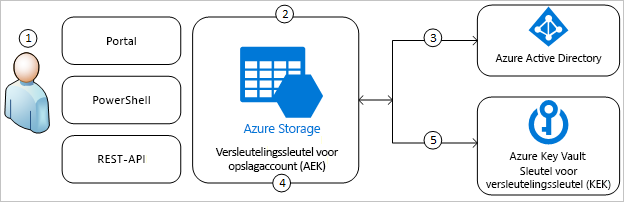
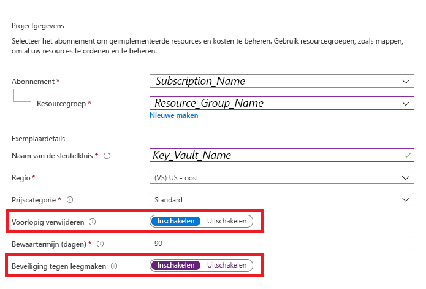
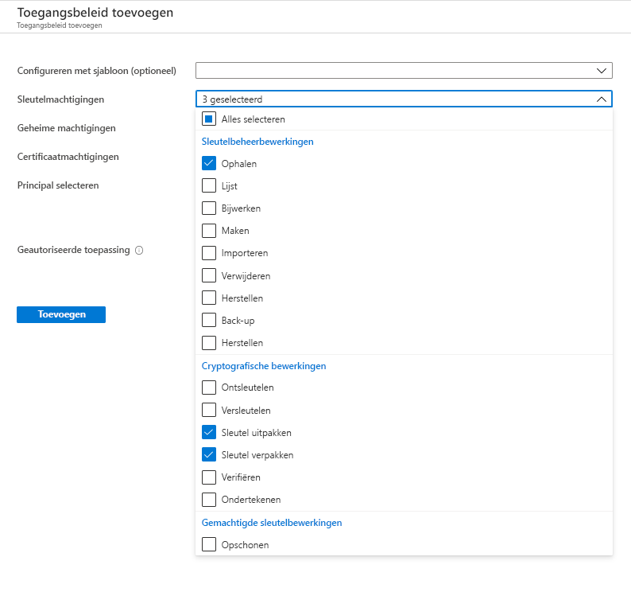
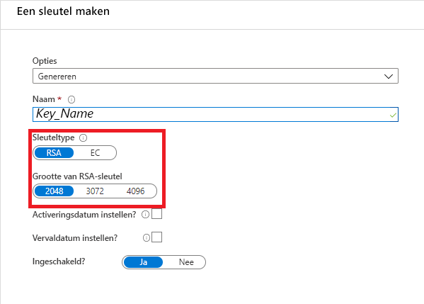
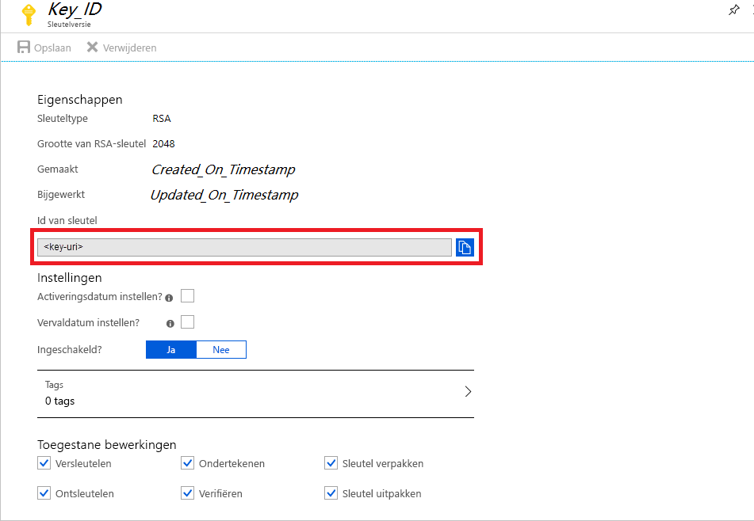
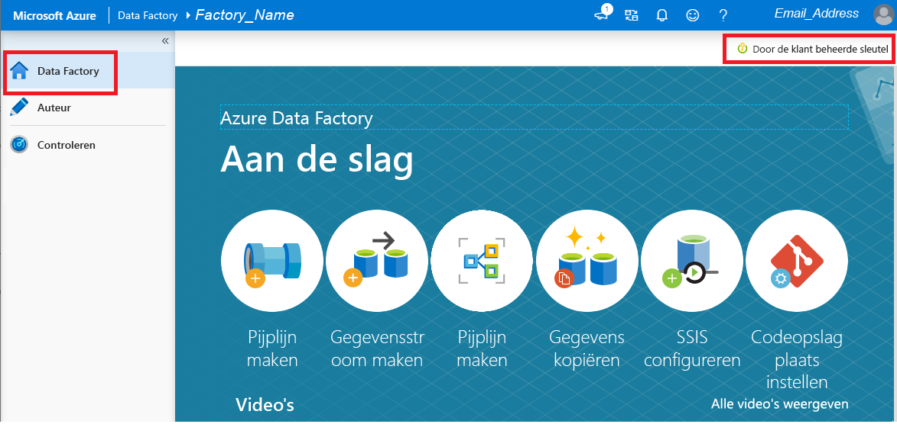

# Azure Data Factory versleutelen met door de klant beheerde sleutels

[!INCLUDE[appliesto-adf-xxx-md](includes/appliesto-adf-xxx-md.md)]

Azure Data Factory codeert data-at-rest, waaronder entiteitsdefinities en gegevens die zijn opgeslagen in de cache terwijl uitvoeringen bezig zijn. Standaard worden gegevens versleuteld met een willekeurig gegenereerde, door Microsoft beheerde sleutel die uniek is toegewezen aan uw data factory. Voor extra beveiligingsgaranties kunt u nu Bring Your Own Key (BYOK) inschakelen met de functie voor door de klant beheerde sleutels in Azure Data Factory. Wanneer u een door de klant beheerde sleutel opgeeft, gebruikt Data Factory __zowel__ de systeemsleutel van de fabriek als de CMK om klantgegevens te versleutelen. Wanneer een van deze ontbreekt, wordt toegang tot gegevens en factory geweigerd.

Azure Key Vault is vereist om door de klant beheerde sleutels op te slaan. U kunt uw eigen sleutels maken en deze opslaan in een sleutelkluis of u kunt de Azure Key Vault API's gebruiken om sleutels te genereren. Key Vault en Data Factory moeten zich in dezelfde Azure Active Directory (Azure AD)-tenant en in dezelfde regio bevinden, maar ze kunnen wel in verschillende abonnementen zijn. Zie [Wat is Azure Key Vault?](../key-vault/general/overview.md) voor meer informatie over Azure Key Vault.

> [!NOTE]
> Een door de klant beheerde sleutel kan alleen in een lege data factory worden geconfigureerd. De data factory kan geen resources bevatten als gekoppelde services, pijplijnen en gegevensstromen. Het wordt aangeraden om de door de klant beheerde sleutel in te schakelen nadat de factory is gemaakt.

## Over door de klant beheerde sleutels

In het volgende diagram ziet u hoe Data Factory Azure Active Directory en Azure Key Vault gebruikt om aanvragen te maken met de door de klant beheerde sleutel:

  

In de volgende lijst worden de genummerde stappen in het diagram uitgelegd:

1. Een Azure Key Vault-beheerder verleent machtigingen voor versleutelingssleutels aan de beheerde identiteit die is gekoppeld aan de Data Factory
1. Een Data Factory-beheerder schakelt de functie voor de door de klant beheerde sleutel in de factory in
1. Data Factory gebruikt de beheerde identiteit die is gekoppeld aan de factory om de toegang tot Azure Key Vault via Azure Active Directory te verifiëren
1. Data Factory verpakt de versleutelingssleutel voor de factory met de klantensleutel in Azure Key Vault
1. Voor lees- en schrijfbewerkingen stuurt Data Factory aanvragen naar Azure Key Vault om de versleutelingssleutel van het account uit te pakken om versleutelings- en ontsleutelingsbewerkingen uit te voeren

## Vereisten: Azure Key Vault configureren en sleutels genereren

### Voorlopig verwijderen en Niet wissen inschakelen op Azure Key Vault

Voor het gebruik van door de klant beheerde sleutels met Data Factory moeten op de Key Vault twee eigenschappen worden ingesteld, __Voorlopig verwijderen__ en __Niet leegmaken__. Deze eigenschappen kunnen worden ingeschakeld met PowerShell of Azure CLI in een nieuwe of bestaande sleutelkluis. Voor meer informatie over het inschakelen van deze eigenschappen voor een bestaande sleutelkluis raadpleegt u de secties _Voorlopig verwijderen inschakelen_ en _Beveiliging tegen leegmaken inschakelen_ in een van de volgende artikelen:

- [Voorlopig verwijderen gebruiken met PowerShell](../key-vault/general/soft-delete-powershell.md)
- [Voorlopig verwijderen gebruiken met CLI](../key-vault/general/soft-delete-cli.md)

Als u een nieuwe Azure Key Vault maakt via Azure Portal, kunnen __Voorlopig verwijderen__ en __Niet leegmaken__ als volgt worden ingeschakeld:

  

### Data Factory-toegang verlenen tot Azure Key Vault

Zorg ervoor dat Azure Key Vault en Azure Data Factory zich in dezelfde Azure Active Directory-tenant (Azure AD) en in de _dezelfde regio_bevinden. Ken vanuit Azure Key Vault-toegangsbeheer de Managed Service Identity (MSI) van de data factory de volgende machtigingen toe: _Ophalen_, _Sleutel uitpakken_en _Sleutel inpakken_. Deze machtigingen zijn vereist om door de klant beheerde sleutels in Data Factory in te schakelen.

  

### Door de klant beheerde sleutel genereren of uploaden naar Azure Key Vault

U kunt uw eigen sleutels maken en deze opslaan in een sleutelkluis of u kunt de Azure Key Vault API's gebruiken om sleutels te genereren. Alleen 2048-bits RSA-sleutels worden ondersteund met Data Factory-versleuteling. Zie [Over sleutels, geheimen en certificaten](../key-vault/general/about-keys-secrets-certificates.md) voor meer informatie.

  

## Door de klant beheerde sleutels inschakelen

1. Zorg ervoor dat de Data Factory leeg is. De data factory kan geen resources bevatten als gekoppelde services, pijplijnen en gegevensstromen. Voor nu resulteert het implementeren van de door de klant beheerde sleutel naar een niet-lege factory in een fout.

1. Als u de sleutel-URI in Azure Portal wilt zoeken, gaat u naar Azure Key Vault en selecteert u de instelling Sleutels. Selecteer de gewenste sleutel en klik op de sleutel om de versies ervan weer te geven. Een sleutelversie selecteren om de instellingen weer te geven

1. De waarde van het veld Sleutel-id, dat de URI levert, kopiëren

    

1. Start Azure Data Factory Portal en ga met de navigatiebalk aan de linkerkant naar de Data Factory-beheerportal

1. Klik op het pictogram __Door de klant beheerde sleutel__

    

1. Voer de URI in voor de door de klant beheerde sleutel die u eerder hebt gekopieerd

1. Klik op __Opslaan__ en door de klant beheerde sleutelversleuteling wordt ingeschakeld voor Data Factory

## Sleutelversie bijwerken

Wanneer u een nieuwe versie van een sleutel maakt, moet u data factory bijwerken om de nieuwe versie te gebruiken. Volg dezelfde stappen als beschreven in het gedeelte _Door de klant beheerde sleutels inschakelen_, waaronder:

1. Zoek de URI voor de nieuwe sleutelversie via Azure Key Vault Portal

1. Ga naar de instelling __Door de klant beheerde sleutel__

1. Vervang en plak de URI voor de nieuwe sleutel

1. Klik op __Opslaan__ en Data Factory wordt nu versleuteld met de nieuwe sleutelversie

## Een andere sleutel gebruiken

Als u de sleutel wilt wijzigen die wordt gebruikt voor Data Factory-versleuteling, moet u de instellingen in Data Factory handmatig bijwerken. Volg dezelfde stappen als beschreven in het gedeelte _Door de klant beheerde sleutels inschakelen_, waaronder:

1. De URI voor de nieuwe sleutel zoeken via Azure Key Vault Portal

1. Ga naar de instelling __Door de klant beheerde sleutel__

1. Vervang en plak de URI voor de nieuwe sleutel

1. Klik op __Opslaan__ en Data Factory wordt nu versleuteld met de nieuwe sleutel

## Door klant beheerde sleutels uitschakelen

Zodra de functie voor de door de klant beheerde sleutel is ingeschakeld, kunt u de extra beveiligingsstap niet meer verwijderen. We verwachten altijd een door de klant verschafte sleutel om factory en gegevens te versleutelen.

## Volgende stappen

Doorloop de [zelfstudies](tutorial-copy-data-dot-net.md) voor meer informatie over het gebruiken van Data Factory in andere scenario's.
