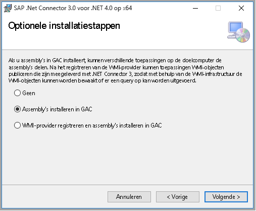

# <a name="copy-data-from-sap-business-warehouse-by-using-azure-data-factory"></a>Gegevens van SAP Business Warehouse kopiëren met behulp van Azure Data Factory

In dit artikel wordt beschreven hoe u Azure Data Factory kunt gebruiken om gegevens van SAP Business Warehouse (BW) te kopiëren via open hub naar Azure Data Lake Storage Gen2. U kunt een vergelijkbaar proces gebruiken om gegevens naar andere [ondersteunde Sink-gegevens opslag](copy-activity-overview.md#supported-data-stores-and-formats)te kopiëren.

> [!TIP]
> Zie voor algemene informatie over het kopiëren van gegevens uit SAP BW, waaronder SAP BW open hub-integratie en Delta-extractie stroom, [gegevens kopiëren van SAP Business Warehouse via open hub met behulp van Azure Data Factory](connector-sap-business-warehouse-open-hub.md).

## <a name="prerequisites"></a>Vereisten

- **Azure Data Factory**: als u er geen hebt, volgt u de stappen voor het [maken van een Data Factory](quickstart-create-data-factory-portal.md#create-a-data-factory).

- **SAP BW open hub Destination (OHD) met het doel type ' database tabel '** : als u een OHD wilt maken of als u wilt controleren of uw OHD correct is geconfigureerd voor Data Factory-integratie, raadpleegt u de sectie [SAP BW open hub-doel configuraties](#sap-bw-open-hub-destination-configurations) van dit artikel.

- **De SAP BW gebruiker heeft de volgende machtigingen nodig**:

  - Autorisatie voor externe functie aanroepen (RFC) en SAP BW.
  - Machtigingen voor de activiteit ' Execute ' van het **S_SDSAUTH** -autorisatie object.

- **Een [zelf-hostende Integration runtime (IR)](concepts-integration-runtime.md#self-hosted-integration-runtime) met SAP .net connector 3,0**. Volg deze installatie stappen:

  1. Installeer en registreer de zelf-hostende Integration runtime versie 3,13 of hoger. (Dit proces wordt verderop in dit artikel beschreven.)

  2. Down load de [64-bits sap connector voor Microsoft .NET 3,0](https://support.sap.com/en/product/connectors/msnet.html) van de SAP-website en installeer deze op dezelfde computer als de zelf-hostende IR. Zorg er tijdens de installatie voor dat u **Assembly's installeren naar GAC** selecteert in het dialoog venster **optionele installatie stappen** , zoals in de volgende afbeelding wordt weer gegeven:

     

## <a name="do-a-full-copy-from-sap-bw-open-hub"></a>Een volledige kopie van SAP BW hub openen

Ga in Azure Portal naar uw data factory. Selecteer **auteur & monitor** om de Data Factory gebruikers interface te openen op een afzonderlijk tabblad.

1. Selecteer op de pagina **aan de slag** de optie **Gegevens kopiëren** om het gegevens kopiëren-hulp programma te openen.

2. Geef op de pagina **Eigenschappen** een **taak naam**op en selecteer **volgende**.

3. Selecteer op de pagina **brongegevens archief** de optie **+ nieuwe verbinding maken**. Selecteer **SAP BW hub openen** in de galerie met connectors en selecteer vervolgens **door gaan**. Als u de connectors wilt filteren, kunt u **SAP** in het zoekvak typen.

4. Voer op de pagina **SAP BW open hub-verbinding opgeven** de volgende stappen uit om een nieuwe verbinding te maken.

   

   1. Selecteer een bestaande zelf-hostende IR in de lijst **verbinding maken via Integration runtime** . Of kies ervoor om er een te maken als u er nog geen hebt.

      Als u een nieuwe zelf-hostende IR wilt maken, selecteert u **+ Nieuw**en selecteert u **zelf gehost**. Voer een **naam**in en selecteer **volgende**. Selecteer **snelle installatie** om te installeren op de huidige computer of volg de **hand matige installatie** stappen die worden meegeleverd.

      Zoals vermeld in [vereisten](#prerequisites), zorgt u ervoor dat SAP-Connector voor Microsoft .net 3,0 is geïnstalleerd op dezelfde computer waarop de zelf-hostende IR wordt uitgevoerd.

   2. Vul de SAP BW **Server naam**, het **systeem nummer**, de **client-id, de** **taal** (indien van een andere dan **en**), **gebruikers naam**en **wacht woord**in.

   3. Selecteer **verbinding testen** om de instellingen te valideren en selecteer vervolgens **volt ooien**.

   4. Er wordt een nieuwe verbinding gemaakt. Selecteer **Next**.

5. Blader op de pagina **Open hub-doelen selecteren** door de open hub-bestemmingen die beschikbaar zijn in uw SAP BW. Selecteer de OHD waaruit u gegevens wilt kopiëren en selecteer vervolgens **volgende**.

   

6. Geef een filter op, als u er een hebt. Als uw OHD alleen gegevens bevat van één DTP-uitvoering (data-overdracht) met één aanvraag-ID, of als u zeker weet dat uw DTP is voltooid en u de gegevens wilt kopiëren, schakelt u het selectie vakje **laatste aanvraag uitsluiten** uit.

   Meer informatie over deze instellingen vindt u in de sectie [SAP BW open hub-doel configuraties](#sap-bw-open-hub-destination-configurations) van dit artikel. Selecteer **valideren** om te controleren welke gegevens worden geretourneerd. Selecteer vervolgens **Volgende**.

   

7. Selecteer op de pagina **doel gegevens archief** de optie **+ nieuwe verbinding maken** > **Azure data Lake Storage Gen2** > **door te gaan**.

8. Voer op de pagina **Azure data Lake Storage verbinding opgeven** de volgende stappen uit om een verbinding te maken.

   

   1. Selecteer uw Data Lake Storage Gen2-compatibele account in de vervolg keuzelijst **naam** .
   2. Selecteer **Voltooien** om de verbinding te maken. Selecteer vervolgens **Volgende**.

9. Voer op de pagina **het uitvoer bestand of de map kiezen** **copyfromopenhub** in als de naam van de uitvoermap. Selecteer vervolgens **Volgende**.

   

10. Selecteer op de pagina **instelling voor bestands indeling** de optie **volgende** om de standaard instellingen te gebruiken.

    

11. Vouw op de pagina **instellingen** de optie **prestatie-instellingen**uit. Voer een waarde in voor de **mate van afparallelie van kopieën** , zoals 5, die parallel moeten worden geladen in SAP BW. Selecteer vervolgens **Volgende**.

    

12. Bekijk de instellingen op de pagina **Samenvatting** . Selecteer vervolgens **Volgende**.

13. Selecteer op de pagina **implementatie** de optie **controleren** om de pijp lijn te bewaken.

    

14. U ziet dat het tabblad **monitor** aan de linkerkant van de pagina automatisch wordt geselecteerd. De kolom **acties** bevat koppelingen om de details van de activiteit weer te geven en de pijp lijn opnieuw uit te voeren.

    

15. Als u de uitvoering van activiteiten wilt weer geven die zijn gekoppeld aan de pijplijn uitvoering, selecteert u de optie **uitvoering van activiteit weer geven** in de kolom **acties** . Omdat er slechts één activiteit (kopieeractiviteit) in de pijplijn is, ziet u slechts één vermelding in de lijst. Als u wilt terugkeren naar de weer gave pijplijn uitvoeringen, selecteert u de koppeling **pijp lijnen** bovenaan. Selecteer **Vernieuwen** om de lijst te vernieuwen.

    

16. Als u de uitvoerings Details voor elke Kopieer activiteit wilt bewaken, selecteert u de koppeling **Details** . Dit is een bril-pictogram onder **acties** in de weer gave activiteiten bewaking. Beschik bare Details zijn het gegevens volume dat is gekopieerd van de bron naar de sink, gegevens doorvoer, uitvoerings stappen en duur en gebruikte configuraties.

    

17. Als u de **maximum aanvraag-id**wilt weer geven, gaat u terug naar de weer gave activiteit-bewaking en selecteert u **uitvoer** onder **acties**.

    

    

## <a name="incremental-copy-from-sap-bw-open-hub"></a>Incrementele kopie van SAP BW hub openen

> [!TIP]
> Zie [SAP BW de stroom van de Delta-extractie van hub-connectors openen](connector-sap-business-warehouse-open-hub.md#delta-extraction-flow) voor meer informatie over hoe de SAP BW hub-connector openen in Data Factory incrementele gegevens van SAP BW kopieert. In dit artikel vindt u meer informatie over de basis configuratie van connectors.

Nu gaan we de incrementele kopie configureren van SAP BW open hub.

Met een incrementele kopie wordt een ' High-watermerk ' mechanisme gebruikt dat is gebaseerd op de **aanvraag-id**. Deze ID wordt automatisch gegenereerd in SAP BW open hub-bestemming door de DTP. In het volgende diagram ziet u deze werk stroom:


Selecteer op de pagina data factory **aan de slag** de optie **pijp lijn maken van sjabloon** om de ingebouwde sjabloon te gebruiken.

1. Zoek naar **SAP BW** om de **incrementele kopie te zoeken en te selecteren van SAP BW naar Azure data Lake Storage Gen2** -sjabloon. Met deze sjabloon worden gegevens naar Azure Data Lake Storage Gen2 gekopieerd. U kunt een vergelijk bare werk stroom gebruiken om naar andere Sink-typen te kopiëren.

2. Op de hoofd pagina van de sjabloon selecteert of maakt u de volgende drie verbindingen en selecteert **u vervolgens deze sjabloon gebruiken** in de rechter benedenhoek van het venster.

   - **Azure Blob-opslag**: in dit scenario gebruiken we Azure Blob-opslag voor het opslaan van de bovengrens. Dit is de *Maxi maal GEKOPIEERDE aanvraag-id*.
   - **SAP BW hub openen**: dit is de bron waaruit u gegevens wilt kopiëren. Raadpleeg het vorige overzicht van de volledige kopie voor een gedetailleerde configuratie.
   - **Azure data Lake Storage Gen2**: dit is de Sink voor het kopiëren van gegevens naar. Raadpleeg het vorige overzicht van de volledige kopie voor een gedetailleerde configuratie.

   

3. Met deze sjabloon wordt een pijp lijn gegenereerd met de volgende drie activiteiten en worden ze gekoppeld aan het slagen: *lookup*, *gegevens kopiëren*en *Web*.

   Ga naar het tabblad pijplijn **parameters** . U ziet alle configuraties die u moet opgeven.

   

   - **SAPOpenHubDestinationName**: Geef de naam van de open hub-tabel op waaruit u gegevens wilt kopiëren.

   - **ADLSGen2SinkPath**: Geef het doel Azure data Lake Storage Gen2 pad op waarnaar u gegevens wilt kopiëren. Als het pad niet bestaat, maakt de Data Factory Kopieer activiteit tijdens de uitvoering een pad.

   - **HighWatermarkBlobPath**: Geef het pad op voor het opslaan van de hoogste watermerk waarde, zoals `container/path`.

   - **HighWatermarkBlobName**: Geef de naam van de BLOB op voor het opslaan van de bovengrens waarde, zoals `requestIdCache.txt`. Ga in Blob Storage naar het overeenkomstige pad van HighWatermarkBlobPath + HighWatermarkBlobName, zoals *container/pad/requestIdCache. txt*. Maak een blob met inhoud 0.

      

   - **LogicAppURL**: in deze sjabloon gebruiken we webactiviteit voor het aanroepen van Azure Logic apps om de waarde met hoge water merk in Blob Storage in te stellen. U kunt ook Azure SQL Database gebruiken om deze op te slaan. Gebruik een opgeslagen procedure activiteit om de waarde bij te werken.

      U moet eerst een logische app maken, zoals in de volgende afbeelding wordt weer gegeven. Plak vervolgens in de **URL voor http post**.

      

      1. Ga naar Azure Portal. Selecteer een nieuwe **Logic apps** service. Selecteer **+ lege logische app** om naar **Logic apps Designer**te gaan.

      2. Een trigger maken van **Wanneer een HTTP-aanvraag wordt ontvangen**. Geef de HTTP-aanvraag tekst als volgt op:

         ```json
         {
            "properties": {
               "sapOpenHubMaxRequestId": {
                  "type": "string"
               }
            },
            "type": "object"
         }
         ```

      3. Voeg een actie **Blob maken** toe. Voor **mappad** en **BLOB-naam**gebruikt u dezelfde waarden die u eerder hebt geconfigureerd in **HighWatermarkBlobPath** en **HighWatermarkBlobName**.

      4. Selecteer **Opslaan**. Kopieer vervolgens de waarde van de **http post-URL** voor gebruik in de Data Factory-pijp lijn.

4. Nadat u de para meters voor de Data Factory pijplijn hebt opgegeven, selecteert u **fout opsporing** > **volt ooien** om de configuratie te valideren. Of selecteer **Alles publiceren** om de wijzigingen te publiceren en selecteer vervolgens **trigger** om een uitvoering uit te voeren.

## <a name="sap-bw-open-hub-destination-configurations"></a>SAP BW open hub-doel configuraties

In deze sectie wordt de configuratie van de SAP BW-zijde geïntroduceerd om de SAP BW open hub-connector in Data Factory te gebruiken om gegevens te kopiëren.

### <a name="configure-delta-extraction-in-sap-bw"></a>Delta-extractie in SAP BW configureren

Als u zowel een historische kopie als een incrementele kopie of alleen een incrementele kopie nodig hebt, configureert u Delta-extractie in SAP BW.

1. Maak het open hub-doel. U kunt de OHD maken in SAP Trans Action RSA1, waarmee automatisch het vereiste proces voor trans formatie en gegevens overdracht wordt gemaakt. Gebruik de volgende instellingen:

   - **Object type: u**kunt elk van de objecten gebruiken. Hier gebruiken we **InfoCube** als voor beeld.
   - **Doel type**: **database tabel**selecteren.
   - **Sleutel van de tabel**: Selecteer de **technische sleutel**.
   - **Extractie**: Selecteer **gegevens bijeenhouden en records invoegen in tabel**.

   

   

   U kunt het aantal parallelle SAP-werk processen voor de DTP verhogen:

   

2. Plan de DTP in proces ketens.

   Een Delta-DTP voor een kubus werkt alleen als de benodigde rijen niet zijn gecomprimeerd. Zorg ervoor dat BW-kubus compressie niet wordt uitgevoerd vóór de DTP naar de open hub-tabel. De eenvoudigste manier om dit te doen is het integreren van de DTP in uw bestaande proces ketens. In het volgende voor beeld wordt de DTP (naar de OHD) ingevoegd in de proces keten tussen de stappen *aanpassen* (aggregatie samen vouwen) en *samen vouwen* (kubus compressie).

   

### <a name="configure-full-extraction-in-sap-bw"></a>Volledige extractie in SAP BW configureren

Naast Delta-extractie wilt u mogelijk een volledige extractie van hetzelfde SAP BW InfoProvider. Dit geldt meestal als u een volledige kopie wilt uitvoeren, maar niet incrementeel wilt, of als u [Delta-extractie wilt synchroniseren](#resync-delta-extraction).

U kunt niet meer dan één DTP voor dezelfde OHD. Daarom moet u een extra OHD maken vóór Delta-extractie.


Kies voor een volledige belasting OHD andere opties dan voor de Delta-extractie:

- In OHD: Stel de **extractie** optie in om **gegevens te verwijderen en records in te voegen**. Anders worden gegevens meermaals geëxtraheerd wanneer u de DTP in een BW-proces keten herhaalt.

- In de DTP: **extractie modus** op **volledig**instellen. U moet de automatisch gemaakte DTP wijzigen van **Delta** naar **volledig** onmiddellijk nadat de OHD is gemaakt, zoals in deze afbeelding wordt weer gegeven:

   

- In de ZW open hub-connector van Data Factory: Schakel **laatste aanvraag uitsluiten**uit. Anders wordt niets geëxtraheerd.

Doorgaans voert u de volledige DTP hand matig uit. U kunt ook een proces keten maken voor de volledige DTP. Het is doorgaans een afzonderlijke keten die onafhankelijk is van uw bestaande proces ketens. In beide gevallen controleert *u of de DTP is voltooid voordat u de extractie start met behulp van Data Factory kopie*. Anders worden alleen gedeeltelijke gegevens gekopieerd.

### <a name="run-delta-extraction-the-first-time"></a>De eerste keer Delta-extractie uitvoeren

De eerste Delta-extractie is technisch gezien een *volledige extractie*. De SAP BW open hub-connector sluit de laatste aanvraag standaard uit wanneer de gegevens worden gekopieerd. Voor de eerste Delta-extractie worden er geen gegevens geëxtraheerd door de Data Factory Kopieer activiteit tot een volgende DTP de Delta gegevens in de tabel met een afzonderlijke aanvraag-ID genereert. Er zijn twee manieren om dit scenario te voor komen:

- Schakel de optie **laatste aanvraag uitsluiten** voor de eerste Delta-extractie uit. Zorg ervoor dat de eerste Delta-DTP is voltooid voordat u de Delta-extractie de eerste keer start.
-  Gebruik de procedure voor het opnieuw synchroniseren van de Delta-extractie, zoals wordt beschreven in de volgende sectie.

### <a name="resync-delta-extraction"></a>Delta-extractie van Resync

In de volgende scenario's worden de gegevens in SAP BW kubussen gewijzigd, maar worden niet meegenomen door de Delta-DTP:

- SAP BW selectief verwijderen (van rijen met behulp van een filter voorwaarde)
- Verwijdering van SAP BW aanvragen (van mislukte aanvragen)

Een SAP open hub-doel is geen door de datamart beheerde gegevens doel (in alle SAP BW-ondersteunings pakketten sinds 2015). Zo kunt u gegevens uit een kubus verwijderen zonder dat u de gegevens in de OHD hoeft te wijzigen. U moet de gegevens van de kubus vervolgens opnieuw synchroniseren met Data Factory:

1. Voer een volledige extractie uit in Data Factory (door gebruik te maken van een volledige DTP in SAP).
2. Verwijder alle rijen in de tabel open hub voor de Delta-DTP.
3. Stel de status van de Delta DTP in op **opgehaald**.

Daarna werken alle daaropvolgende Delta-DTPs en Data Factory Delta-extracten zoals verwacht.

Als u de status van de Delta DTP wilt instellen op **opgehaald**, kunt u de volgende optie gebruiken om de Delta-DTP hand matig uit te voeren:

    *No Data Transfer; Delta Status in Source: Fetched*

## <a name="next-steps"></a>Volgende stappen

Meer informatie over de ondersteuning van SAP BW open hub-connector:

> [!div class="nextstepaction"]
>[SAP Business Warehouse open hub-connector](connector-sap-business-warehouse-open-hub.md)
