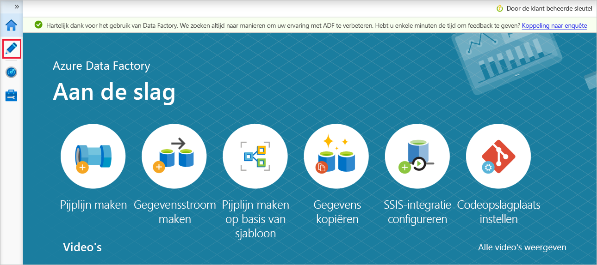

# <a name="copy-multiple-tables-in-bulk-by-using-azure-data-factory-in-the-azure-portal"></a>Meerdere tabellen bulksgewijs kopiëren met behulp van Azure Data Factory in de Azure-portal

[!INCLUDE[appliesto-adf-asa-md](includes/appliesto-adf-asa-md.md)]

Deze zelfstudie demonstreert het **kopiëren van een aantal tabellen uit Azure SQL Database naar Azure Synapse Analytics (voorheen SQL DW)** . U kunt hetzelfde patroon toepassen in andere kopieerscenario's. Bijvoorbeeld het kopiëren van tabellen van SQL Server/Oracle naar Azure SQL Database/Data Synapse Analytics (voorheen SQL DW)/Azure Blob, verschillende paden kopiëren van Blob naar Azure SQL Database-tabellen.

> [!NOTE]
> - Zie [Inleiding tot Azure Data Factory](introduction.md) als u niet bekend bent met Azure Data Factory.

Op hoog niveau bevat deze zelfstudie de volgende stappen:

> [!div class="checklist"]
> * Een data factory maken.
> * Gekoppelde services maken voor Azure SQL Database, Azure Synapse Analytics (voorheen SQL DW) en Azure Storage.
> * Gegevenssets maken voor Azure SQL Database en Azure Synapse Analytics (voorheen SQL DW).
> * Een pijplijn maken om de te kopiëren tabellen op te zoeken en een andere pijplijn om de kopieerbewerking daadwerkelijk uit te voeren. 
> * Een pijplijnuitvoering starten.
> * De uitvoering van de pijplijn en van de activiteit controleren.

In deze zelfstudie wordt Azure Portal gebruikt. Zie [Quickstarts](quickstart-create-data-factory-dot-net.md) (Snelstartgidsen) voor meer informatie over het gebruik van andere hulpprogramma's/SDK's voor het maken van een gegevensfactory. 

## <a name="end-to-end-workflow"></a>End-to-end werkstroom
In dit scenario gebruikt u een aantal tabellen in Azure SQL Database die u gaat kopiëren naar Azure Synapse Analytics (voorheen SQL DW). Dit is de logische volgorde van de stappen in de werkstroom die in pijplijnen plaatsvindt:


* De eerste pijplijn zoekt de lijst op met tabellen die moeten worden gekopieerd naar de sinkgegevensopslag.  U kunt ook een metagegevenstabel bijhouden waarin alle tabellen worden vermeld die moeten worden gekopieerd naar de sinkgegevensopslag. De pijplijn activeert vervolgens een andere pijplijn, die elke tabel in de database langsloopt en de bewerking uitvoert waarmee de gegevens worden gekopieerd.
* De tweede pijplijn voert de daadwerkelijke kopieerbewerking uit. De lijst met tabellen wordt gebruikt als parameter. Kopieer voor elke tabel in de lijst de specifieke tabel in Azure SQL Database naar de bijbehorende tabel in Azure Synapse Analytics (voorheen SQL DW) met behulp van [gefaseerd kopiëren via Blob storage en PolyBase](connector-azure-sql-data-warehouse.md#use-polybase-to-load-data-into-azure-sql-data-warehouse) (Engelstalig artikel) voor de beste prestaties. In dit voorbeeld wordt de lijst met tabellen in de eerste pijplijn doorgegeven als een waarde voor de parameter. 

Als u nog geen abonnement op Azure hebt, maak dan een [gratis account](https://azure.microsoft.com/free/) aan voordat u begint.

## <a name="prerequisites"></a>Vereisten
* **Een Azure Storage-account**. Het Azure Storage-account wordt gebruikt als faseringsblobopslag in de bulksgewijze kopieerbewerking. 
* **Azure SQL-database**. Deze database bevat de brongegevens. 
* **Azure Synapse Analytics (voorheen SQL DW)** . Dit datawarehouse bevat de uit de SQL Database gekopieerde gegevens. 

### <a name="prepare-sql-database-and-azure-synapse-analytics-formerly-sql-dw"></a>SQL Database en Azure Synapse Analytics (voorheen SQL DW) voorbereiden

**De Azure SQL Database-bron voorbereiden**:

Maak een Azure SQL Database met Adventure Works LT-testgegevens door het artikel [Create an Azure SQL database](../azure-sql/database/single-database-create-quickstart.md) (Een Azure SQL-database maken) te volgen. In deze zelfstudie worden alle tabellen van deze voorbeelddatabase naar Azure Synapse Analytics (voorheen SQL DW) gekopieerd.

**Bereid de sink voor Azure Synapse Analytics (voorheen SQL DW) voor**:

1. Als u geen Azure Synapse Analytics (voorheen SQL DW) hebt, raadpleegt u het artikel [Een Azure SQL Data Warehouse maken](../sql-data-warehouse/sql-data-warehouse-get-started-tutorial.md) voor de stappen om er een te maken.

1. Maak corresponderende tabelschema's in Azure Synapse Analytics (voorheen SQL DW). U gebruikt Azure Data Factory om gegevens in een latere stap te migreren/kopiëren.

## <a name="azure-services-to-access-sql-server"></a>Azure-services voor toegang tot SQL-server

Voor zowel SQL Database als Azure Synapse Analytics (voorheen SQL DW) moet u Azure-services toegang verlenen tot SQL Server. Zorg ervoor dat de instelling **Azure-services en -resources toegang verlenen tot deze server** is ingesteld op **AAN** voor uw server. Met deze instelling kan de Data Factory-service gegevens lezen uit uw Azure SQL Database en schrijven naar uw Azure Synapse Analytics (voorheen SQL DW). 

Om deze instelling te controleren en in te schakelen, gaat u naar uw server > Beveiliging > Firewalls en virtuele netwerken > zet **Toegang tot Azure-services toestaan** op **AAN**.

## <a name="create-a-data-factory"></a>Een gegevensfactory maken

1. Start de webbrowser **Microsoft Edge** of **Google Chrome**. Op dit moment wordt de Data Factory-gebruikersinterface alleen ondersteund in de webbrowsers Microsoft Edge en Google Chrome.
1. Ga naar de [Azure Portal](https://portal.azure.com). 
1. Selecteer in het linkermenu van de Azure-portal **Een resource maken** > **Analyse** > **Data Factory**. 
   
1. Voer op de pagina **New data factory** **ADFTutorialBulkCopyDF** in bij **name**. 
 
   De naam van de Azure-gegevensfactory moet **wereldwijd uniek** zijn. Als u het volgende foutbericht krijgt, wijzigt u de naam van de gegevensfactory (bijvoorbeeld uwnaamADFTutorialBulkCopyDF) en probeert u het opnieuw. Zie het artikel [Data factory - Naamgevingsregels](naming-rules.md) voor meer informatie over naamgevingsregels voor Data Factory-artefacten.
  
       `Data factory name "ADFTutorialBulkCopyDF" is not available`
1. Selecteer het Azure-**abonnement** waarin u de gegevensfactory wilt maken. 
1. Voer een van de volgende stappen uit voor de **Resourcegroep**:
     
   - Selecteer **Bestaande gebruiken** en selecteer een bestaande resourcegroep in de vervolgkeuzelijst. 
   - Selecteer **Nieuwe maken** en voer de naam van een resourcegroep in.   
         
     Zie [Resourcegroepen gebruiken om Azure-resources te beheren](../azure-resource-manager/management/overview.md) voor meer informatie.  
1. Selecteer **V2** als de **versie**.
1. Selecteer de **locatie** voor de gegevensfactory. Voor een lijst met Azure-regio's waarin Data Factory momenteel beschikbaar is, selecteert u op de volgende pagina de regio's waarin u geïnteresseerd bent, vouwt u vervolgens **Analytics** uit en gaat u naar **Data Factory**: [Beschikbare producten per regio](https://azure.microsoft.com/global-infrastructure/services/). De gegevensopslagexemplaren (Azure Storage, Azure SQL Database, enzovoort) en berekeningen (HDInsight, enzovoort) die worden gebruikt in Data Factory, kunnen zich in andere regio's bevinden.
1. Klik op **Create**.
1. Nadat het maken is voltooid, selecteert u **Ga naar resource** om naar de pagina **Data Factory** te gaan. 
   
1. Klik op **Author & Monitor** om de gebruikersinterface (UI) van Data Factory op een afzonderlijk tabblad te openen.
1. Ga op de pagina **Aan de slag** naar het tabblad **Auteur** in het linkerdeelvenster, zoals wordt weergegeven in de volgende afbeelding:

     

## <a name="create-linked-services"></a>Gekoppelde services maken
U maakt gekoppelde services om uw gegevensarchieven en compute-services aan een gegevensfactory te koppelen. Een gekoppelde service beschikt over de verbindingsgegevens die de Data Factory-service tijdens runtime gebruikt om een verbinding met het gegevensarchief tot stand te brengen. 

In deze zelfstudie koppelt u uw gegevensarchieven van Azure SQL Database, Azure Synapse Analytics (voorheen SQL DW) en Azure Blob Storage aan uw data factory. De Azure SQL-database fungeert als brongegevensarchief. Azure Synapse Analytics (voorheen SQL DW) dient als de sink/bestemming van het gegevensarchief. Azure Blob Storage is bedoeld voor het vasthouden van de gegevens voordat deze worden geladen in Azure Synapse Analytics (voorheen SQL DW)met behulp van PolyBase. 

### <a name="create-the-source-azure-sql-database-linked-service"></a>Maak de gekoppelde Azure SQL Database-bronservice
In deze stap maakt u een gekoppelde service om uw Azure SQL-database aan de gegevensfactory te koppelen. 

1. Klik op **Verbindingen** onder aan het venster en klik op **+Nieuwe** op de werkbalk (de knop **Verbindingen** bevindt zich aan de onderkant van de linkerkolom onder **Factory-resources**). 

1. In het venster **New Linked Service** selecteert u **Azure SQL Database** en klikt u op **Doorgaan**. 
1. Voer in het venster **Nieuwe gekoppelde service (Azure SQL Database)** de volgende stappen uit: 

    a. Voer **AzureSqlDatabaseLinkedService** in als **Naam**.
    
    b. Selecteer uw server als **Servernaam**
    
    c. Selecteer uw Azure SQL-database bij **Database name**. 
    
    d. Voer **naam van de gebruiker** in om verbinding te maken met de Azure SQL-database. 
    
    e. Voer het **wachtwoord** voor de gebruiker in. 

    f. Als u de verbinding met de Azure SQL-database wilt testen met de opgegeven informatie, klikt u op **Test connection**.
  
    g. Klik op **Maken** om de gekoppelde service op te slaan.


### <a name="create-the-sink-azure-synapse-analytics-formerly-sql-dw-linked-service"></a>De gekoppelde service van de sink voor Azure Synapse Analytics (voorheen SQL DW) maken

1. Op het tabblad **Connections** klikt u nogmaals op **+ New** op de werkbalk. 
1. In het venster **Nieuwe gekoppelde service** selecteert u **Azure Synapse Analytics (voorheen SQL DW)** en klikt u op **Doorgaan**. 
1. Voer de volgende stappen uit in het venster **Nieuwe gekoppelde service (Azure Synapse Analytics (voorheen SQL DW))** : 
   
    a. Voer **AzureStorageLinkedService** in bij **Name**.
     
    b. Selecteer uw server als **Servernaam**
     
    c. Selecteer uw Azure SQL-database bij **Database name**. 
     
    d. Voer de **Gebruikersnaam** in om verbinding te maken met de Azure SQL-database. 
     
    e. Voer het **Wachtwoord** voor de gebruiker in. 
     
    f. Als u de verbinding met de Azure SQL-database wilt testen met de opgegeven informatie, klikt u op **Test connection**.
     
    g. Klik op **Create**.

### <a name="create-the-staging-azure-storage-linked-service"></a>De gekoppelde Azure Storage-faseringsservice maken
In deze zelfstudie gebruikt u Azure Blob-opslag als een tussentijds faseringsgebied voor het inschakelen van PolyBase voor betere kopieerprestaties.

1. Op het tabblad **Connections** klikt u nogmaals op **+ New** op de werkbalk. 
1. In het venster **New Linked Service** selecteert u **Azure Blob Storage** en klikt u op **Continue**. 
1. Voer de volgende stappen uit in het venster **Nieuwe gekoppelde service (Azure Blob Storage)** : 

    a. Voer **AzureStorageLinkedService** in als **Naam**.                                                 
    b. Selecteer uw **Azure Storage-account** bij **Storage account name**.
    
    c. Klik op **Create**.


## <a name="create-datasets"></a>Gegevenssets maken
In deze zelfstudie maakt u bron- en sinkgegevenssets, waarmee de locatie wordt opgegeven waar de gegevens zijn opgeslagen. 

De invoergegevensset **AzureSqlDatabaseDataset** verwijst naar de **AzureSqlDatabaseLinkedService**. De gekoppelde service geeft de verbindingsreeks aan om verbinding maken met de database. De gegevensset bevat de naam van de database en de tabel met de brongegevens. 

De uitvoergegevensset **AzureSqlDWDataset** verwijst naar de **AzureSqlDWLinkedService**. De gekoppelde service geeft de verbindingsreeks aan om verbinding maken met Azure Synapse Analytics (voorheen SQL DW). De gegevensset bevat de database en de tabel waarnaar de gegevens worden gekopieerd. 

In deze zelfstudie zijn de bron- en doel-SQL-tabellen niet vastgelegd in de definities van de gegevensset. In plaats daarvan geeft de ForEach-activiteit de naam van de tabel tijdens runtime door aan de Copy-activiteit. 

### <a name="create-a-dataset-for-source-sql-database"></a>Een gegevensset maken voor bron SQL-Database

1. Klik op **+ (plus)** in het linkervenster en klik vervolgens op **Dataset**. 

    
1. Selecteer in het venster **Nieuwe gegevensset** de optie **Azure SQL Database** en selecteer vervolgens **Doorgaan**. 
    
1. Voer in het venster **Eigenschappen instellen** onder **Naam** **AzureSqlDatabaseDataset** in. Selecteer bij **Gekoppelde service** de optie **AzureSqlDatabaseLinkedService**. Klik vervolgens op **OK**.

1. Ga naar het tabblad **Verbinding** en selecteer een tabel bij voor **Tabel**. Dit is een tijdelijke tabel. U geeft een query voor de brongegevensset op tijdens het maken van een pijplijn. De query wordt gebruikt om gegevens te extraheren uit de Azure SQL-database. U kunt ook het selectievakje **Bewerken** inschakelen en **dbo.dummyName** invoeren als tabelnaam. 
 

### <a name="create-a-dataset-for-sink-azure-synapse-analytics-formerly-sql-dw"></a>Een gegevensset maken voor de sink voor Azure Synapse Analytics (voorheen SQL DW)

1. Klik op **+ (plus)** in het linkervenster en klik op **Dataset**. 
1. In het venster **Nieuwe gegevensset** selecteert u **Azure Synapse Analytics (voorheen SQL DW)** en klikt u op **Doorgaan**.
1. Voer in het venster **Eigenschappen instellen** onder **Naam** **AzureSqlDWDataset** in. Selecteer bij **Gekoppelde service** de optie **AzureSqlDWLinkedService**. Klik vervolgens op **OK**.
1. Ga naar het tabblad **Parameters**, klik op **+ Nieuw** en voer **DWTableName** in als de parameternaam. Als u deze naam kopieert/plakt vanaf de pagina, moet u ervoor zorgen dat er geen **spatie** volgt na **DWTableName**.
1. Ga naar het tabblad **Verbinding**, 

    a. Vink de optie **Bewerken** aan voor **Tabel**. Voer **dbo** in het invoervak voor de naam van de eerste tabel in. Selecteer vervolgens het tweede invoervak en klik op de link **Dynamische inhoud toevoegen** eronder. 

    

    b. Klik op de pagina **Dynamische inhoud toevoegen** op de **DWTAbleName** onder **Parameters**. Het expressietekstvak `@dataset().DWTableName` wordt nu automatisch ingevuld. Klik vervolgens op **Voltooien**. De **tableName**-eigenschap van de gegevensset is ingesteld op de waarde die wordt doorgegeven als argument voor de **DWTableName**-parameter. De ForEach-activiteit doorloopt een lijst met tabellen en geeft deze één voor één door aan de Copy-activiteit. 

    
 
## <a name="create-pipelines"></a>Pijplijnen maken
In deze zelfstudie maakt u twee pijplijnen: **IterateAndCopySQLTables** en **GetTableListAndTriggerCopyData**. 

De pijplijn **GetTableListAndTriggerCopyData** voert twee acties uit:

* Zoekt de systeemtabel van Azure SQL Database op om de lijst met te kopiëren tabellen op te halen.
* Activeert de pijplijn **IterateAndCopySQLTables** om het kopiëren van de gegevens daadwerkelijk uit te voeren.

De pijplijn **IterateAndCopySQLTables** gebruikt een lijst met tabellen als parameter. Voor elke tabel in de lijst worden gegevens uit de tabel in Azure SQL Database naar Azure Synapse Analytics (voorheen SQL DW) gekopieerd met behulp van gefaseerd kopiëren en PolyBase.

### <a name="create-the-pipeline-iterateandcopysqltables"></a>De pijplijn IterateAndCopySQLTables maken

1. Klik op **+ (plus)** in het linkervenster en klik op **Pipeline**.

    
 
1. Geef op het tabblad Algemeen bij **Eigenschappen** **IterateAndCopySQLTables** op als **Naam**. Vouw het paneel vervolgens samen door in de rechterbovenhoek op het pictogram Eigenschappen te klikken.

1. Open het tabblad **Parameters** en voer de volgende stappen uit: 

    a. Klik op **+ New**. 
    
    b. Voer **tableList** in als **Name**-parameter.
    
    c. Selecteer **Matrix** bij **Type**.

1. Vouw in de werkset **Activities** de optie **Iteration & Conditions** uit en sleep de **ForEach**-activiteit naar het ontwerpoppervlak voor pijplijnen. U kunt ook zoeken naar activiteiten in de werkset **Activiteiten**. 

    a. Voer onderaan het tabblad **Algemeen** **IterateSQLTables** bij **Naam** in. 

    b. Ga naar het tabblad **Instellingen**, klik op het invoervak voor **Items** en klik vervolgens op de onderstaande link **Dynamische inhoud toevoegen**. 

    c. Vouw op de pagina **Dynamische inhoud toevoegen** de secties **Systeemvariabelen** en **Functies** samen en klik op de **tableList** onder **Parameters**. Het expressietekstvak wordt nu automatisch ingevuld als `@pipeline().parameter.tableList`. Klik vervolgens op **Voltooien**. 

    
    
    d. Ga naar het tabblad **Activiteiten** en klik op **het potloodpictogram** om een onderliggende activiteit toe te voegen aan de activiteit **ForEach**.
    

1. Vouw in de **Activiteiten**-werkset de optie **Verplaatsen en overzetten** uit. Gebruik vervolgens slepen-en-neerzetten om de activiteit **Gegevens kopiëren** te verplaatsen naar het ontwerpoppervlak voor pijplijnen. Let op het breadcrumb-menu bovenaan. **IterateAndCopySQLTable** is de naam van de pijplijn en **IterateSQLTables** is de naam van de ForEach-activiteit. Voor de ontwerpfunctie is het activiteitbereik actief. Als u vanuit de ForEach-editor wilt overschakelen naar de pijplijn-editor, klikt u op de koppeling in het koppelingenmenu. 

    

1. Open het tabblad **Source** en voer de volgende stappen uit:

    1. Selecteer **AzureSqlDatabaseDataset** bij **Source Dataset**. 
    1. Selecteer **Query** bij **Query gebruiken**. 
    1. Klik op het invoervak **Query** -> Selecteer de koppeling **Dynamische inhoud toevoegen** hieronder -> voer de volgende expressie in voor **Query** -> selecteer **Voltooien**.

        ```sql
        SELECT * FROM [@{item().TABLE_SCHEMA}].[@{item().TABLE_NAME}]
        ``` 


1. Open het tabblad **Sink** en voer de volgende stappen uit: 

    1. Selecteer **AzureSqlDWDataset** bij **Sink Dataset**.
    1. Klik op het invoervak voor VALUE van de parameter DWTableName -> Selecteer **Dynamische inhoud toevoegen** hieronder, voer de expressie `[@{item().TABLE_SCHEMA}].[@{item().TABLE_NAME}]` als script in -> selecteer **Voltooien**.
    1. Selecteer als kopieermethode **PolyBase**. 
    1. Schakel de optie **Standaardtype gebruiken** uit. 
    1. Klik op het invoervak **Prekopieerscript** -> Selecteer de koppeling **Dynamische inhoud toevoegen** hieronder -> voer de volgende expressie als script in -> selecteer **Voltooien**. 

        ```sql
        TRUNCATE TABLE [@{item().TABLE_SCHEMA}].[@{item().TABLE_NAME}]
        ```

        
1. Ga naar het tabblad **Instellingen** en voer de volgende stappen uit: 

    1. Selecteer het selectievakje voor **Fasering inschakelen**.
    1. Selecteer **AzureStorageLinkedService** bij **Store Account Linked Service**.

1. Klik in de bovenste pijplijnwerkbalk op **Valideren** om de instellingen voor de pijplijn te valideren. Controleer of er geen validatiefouten zijn. Sluit het venster **Pipeline Validation Report** door op **>>** te klikken.

### <a name="create-the-pipeline-gettablelistandtriggercopydata"></a>De pijplijn GetTableListAndTriggerCopyData maken

Deze pijplijn voert twee acties uit:

* Zoekt de systeemtabel van Azure SQL Database op om de lijst met te kopiëren tabellen op te halen.
* Activeert de pijplijn 'IterateAndCopySQLTables' om het kopiëren van de gegevens daadwerkelijk uit te voeren.

1. Klik op **+ (plus)** in het linkervenster en klik op **Pipeline**.
1. In het tabblad **Algemeen** wijzigt u de naam van de pijplijn in **GetTableListAndTriggerCopyData**. 

1. Vouw in de werkset **Activiteiten** de optie **Algemeen** uit, sleep de **Opzoeken**-activiteit naar het ontwerpoppervlak voor pijplijnen en voer de volgende stappen uit:

    1. Voer **LookupTableList** in als **Name**. 
    1. Voer **De tabellijst ophalen uit de Azure SQL-database** in bij **Description**.

1. Ga naar het tabblad **Instellingen** en voer de volgende stappen uit:

    1. Selecteer **AzureSqlDatabaseDataset** bij **Source Dataset**. 
    1. Selecteer **Query** bij **Query gebruiken**. 
    1. Voer bij **Query** de volgende SQL-query in.

        ```sql
        SELECT TABLE_SCHEMA, TABLE_NAME FROM information_schema.TABLES WHERE TABLE_TYPE = 'BASE TABLE' and TABLE_SCHEMA = 'SalesLT' and TABLE_NAME <> 'ProductModel'
        ```
    1. Schakel het selectievakje voor het veld **First row only** uit.

        
1. Sleep de **Pijplijn uitvoeren**-activiteit van de werkset Activiteiten naar het ontwerpoppervlak voor pijplijnen en stel de naam in op **TriggerCopy**.

1. **Verbind** de activiteit **Opzoeken** met de activiteit **Pijplijn uitvoeren** door het **groene vakje** dat aan de activiteit Opzoeken is gekoppeld, naar de linkerkant van de activiteit Pijplijn uitvoeren te slepen.

    

1. Ga naar het tabblad **Instellingen** in het tabblad van de activiteit **Pijplijn uitvoeren** en voer de volgende stappen uit: 

    1. Selecteer **IterateAndCopySQLTables** bij **Invoked pipeline**. 
    1. Vouw de sectie **Geavanceerd** uit en schakel het selectievakje uit bij **Wachten op voltooiing**.
    1. Klik op **+ New** in de sectie **Parameters**. 
    1. Voer **tableList** in als parameter **Naam**.
    1. Klik op het invoervak VALUE -> selecteer de koppeling **Dynamische inhoud toevoegen** hieronder - voer `@activity('LookupTableList').output.value` als waarde voor de tabelnaam -> selecteer **Voltooien**. U stelt de lijst met resultaten vanuit de activiteit Opzoeken in als invoer voor de tweede pijplijn. De lijst met resultaten bevat de lijst met tabellen waarvan de gegevens naar de bestemming moeten worden gekopieerd. 

        

1. Valideer de pijplijn door te klikken op de knop **Validate** op de werkbalk. Controleer of er geen validatiefouten zijn. Sluit het venster **Pipeline Validation Report** door op **>>** te klikken.

1. Als u entiteiten (gegevenssets, pijplijnen, enzovoort) wilt publiceren naar de Data Factory-service, klikt u boven aan het venster op **Alles publiceren**. Wacht totdat de publicatie is uitgevoerd. 

## <a name="trigger-a-pipeline-run"></a>Een pijplijnuitvoering activeren

1. Ga naar pijplijn **GetTableListAndTriggerCopyData**, klik op **Trigger toevoegen** op de bovenste werkbalk van de pijplijn en klik vervolgens op **Nu activeren**. 

1. Bevestig de uitvoering op de pagina **Pijplijn uitvoeren** en selecteer **Voltooien**.

## <a name="monitor-the-pipeline-run"></a>De pijplijnuitvoering controleren.

1. Ga naar het tabblad **Controleren**. Klik op **Refresh** totdat u uitvoeringen voor beide pijplijnen in uw oplossing ziet. Blijf de lijst vernieuwen totdat de status **Succeeded** wordt weergegeven. 

1. Als u uitvoeringen van activiteit wilt weergeven die gekoppeld zijn aan de pijplijn **GetTableListAndTriggerCopyData**, klikt u op de link voor de naam van die pijplijn. Er moeten twee uitvoeringen van activiteit voor deze pijplijnuitvoering te zien zijn. 
    
1. Als u de uitvoer van de activiteit **Opzoeken** wilt weergeven, klikt u op de link **Uitvoer** naast de activiteit in de kolom **ACTIVITEITNAAM**. U kunt het venster **Output** maximaliseren en herstellen. Nadat u de uitvoer hebt bekeken, klikt u op **X** om het venster **Output** te sluiten.

    ```json
    {
        "count": 9,
        "value": [
            {
                "TABLE_SCHEMA": "SalesLT",
                "TABLE_NAME": "Customer"
            },
            {
                "TABLE_SCHEMA": "SalesLT",
                "TABLE_NAME": "ProductDescription"
            },
            {
                "TABLE_SCHEMA": "SalesLT",
                "TABLE_NAME": "Product"
            },
            {
                "TABLE_SCHEMA": "SalesLT",
                "TABLE_NAME": "ProductModelProductDescription"
            },
            {
                "TABLE_SCHEMA": "SalesLT",
                "TABLE_NAME": "ProductCategory"
            },
            {
                "TABLE_SCHEMA": "SalesLT",
                "TABLE_NAME": "Address"
            },
            {
                "TABLE_SCHEMA": "SalesLT",
                "TABLE_NAME": "CustomerAddress"
            },
            {
                "TABLE_SCHEMA": "SalesLT",
                "TABLE_NAME": "SalesOrderDetail"
            },
            {
                "TABLE_SCHEMA": "SalesLT",
                "TABLE_NAME": "SalesOrderHeader"
            }
        ],
        "effectiveIntegrationRuntime": "DefaultIntegrationRuntime (East US)",
        "effectiveIntegrationRuntimes": [
            {
                "name": "DefaultIntegrationRuntime",
                "type": "Managed",
                "location": "East US",
                "billedDuration": 0,
                "nodes": null
            }
        ]
    }
    ```    
1. Als u wilt terugkeren naar de weergave **Pijplijn uitvoeren**, klikt u op de link **Alle uitgevoerde pijplijnen** boven aan het koppelingsmenu. Klik op **IterateAndCopySQLTables** (onder de kolom **PIJPLIJNNAAM**) om de uitvoering van de pijplijnactiviteiten weer te geven. U ziet dat er één **kopieer**activiteit is uitgevoerd voor elke tabel in de uitvoer van de **opzoek**activiteit. 

1. Bevestig dat de gegevens zijn gekopieerd naar het beoogde Azure Synapse Analytics (voorheen SQL DW) dat u in deze zelfstudie hebt gebruikt. 

## <a name="next-steps"></a>Volgende stappen
In deze zelfstudie hebt u de volgende stappen uitgevoerd: 

> [!div class="checklist"]
> * Een data factory maken.
> * Gekoppelde services maken voor Azure SQL Database, Azure Synapse Analytics (voorheen SQL DW) en Azure Storage.
> * Gegevenssets maken voor Azure SQL Database en Azure Synapse Analytics (voorheen SQL DW).
> * Een pijplijn maken om de te kopiëren tabellen op te zoeken en een andere pijplijn om de kopieerbewerking daadwerkelijk uit te voeren. 
> * Een pijplijnuitvoering starten.
> * De uitvoering van de pijplijn en van de activiteit controleren.

Ga door naar de volgende zelfstudie voor informatie over het incrementeel kopiëren van gegevens uit een bron naar een bestemming:
> [!div class="nextstepaction"]
>[Gegevens incrementeel kopiëren](tutorial-incremental-copy-portal.md)
